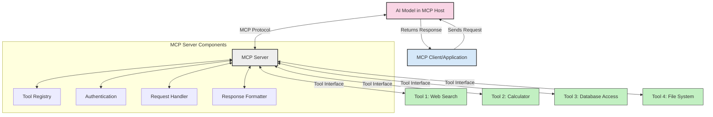
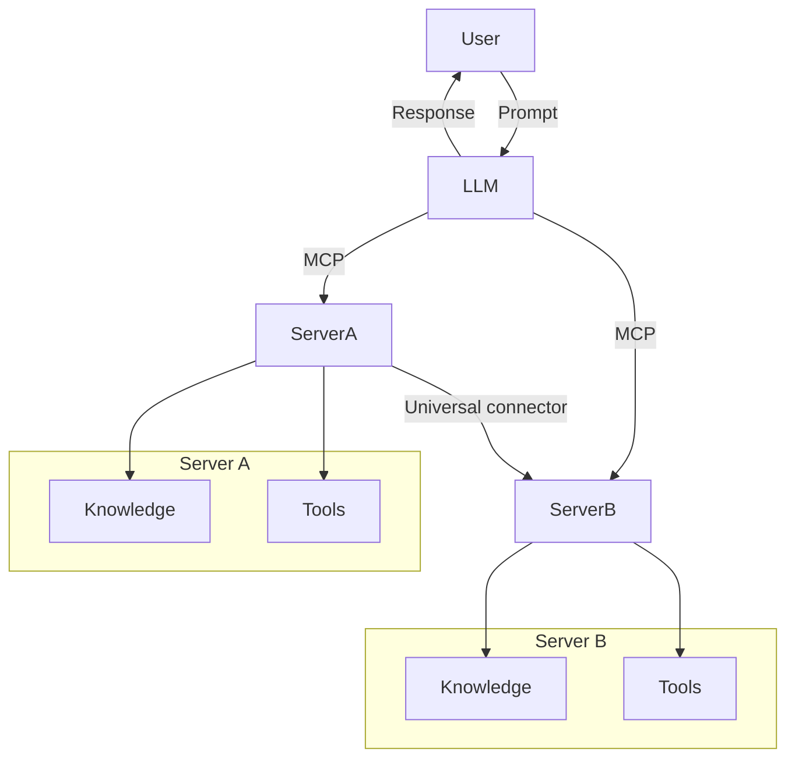

# Introduction to Model Context Protocol (MCP) 

Generative AI applications are a great step forward as they often let the user interact with the app using natural language prompts. However, as more time and resources are invested in such apps, you want to make sure you can easily integrate functionalities and resources in such a way that it's easy to extend, that your app can cater to more than one model being used, and its intricacies. In short, building Gen AI apps is easy to begin with but as it grows and becomes more complex, you need to start defining an architecture and most likely will need to lean on a standard to make sure your apps are built in a consistent way. This is where MCP comes into to organize things, to provide a standard.

## Overview

The Model Context Protocol (MCP) is a standardized interface that enables Large Language Models (LLMs) to interact seamlessly with external tools, data sources, and services. This lesson provides an introduction to MCP, its purpose, and its significance in the modern AI ecosystem.

## Learning Objectives

By the end of this lesson, you will:
- Understand what MCP is and why it was developed
- Recognize the importance of standardizing AI model interactions
- Identify real-world applications and benefits of MCP
- Have a high-level understanding of the MCP architecture

## What is the Model Context Protocol?

The Model Context Protocol (MCP) is an open standard that defines how AI models, particularly LLMs, can interact with external systems in a structured, consistent way. It creates a standardized interface that allows models to:

- Access external data sources.
- Use tools and execute functions.
- Interact with various services and APIs.
- Maintain conversational context across interactions.

At its core, MCP addresses a fundamental challenge in AI applications: how to extend an AI model's capabilities beyond its training data by giving it access to up-to-date information and functional tools.

## Why MCP Matters

MCP is important as it provides the following benefits:

- **Standardization**, a common standard to expose resources and tools.
- **Hardening of apps and their architecture**, by using MCP you solve a myriad of different problems with many times brittle solutions.

### Standardization Benefits

Standardization provide the following benefits:

- **Interoperability**: Models and tools from different vendors can work together seamlessly;
- **Consistency**: Developers can rely on predictable behavior across different implementations;
- **Reusability**: Components built for one MCP system can be reused in others;
- **Reduced Development Time**: Standard interfaces eliminate the need to create custom integrations;

### The Problem MCP Solves

Before MCP, integrating AI models with external tools required custom, often brittle solutions:

- Each model vendor had different approaches to tool integration
- Custom code was needed for each model-tool combination
- Changes to models or tools often broke integrations
- Scaling to multiple tools was challenging

## MCP Architecture: A High-Level View

MCP follows a client-server architecture with these key components:

- **Hosts**: LLM applications that initiate connections
- **Clients**: Connectors within the host application that request capabilities
- **Servers**: Services that provide context and capabilities to the model
- **Features**:
   - **Resources**: Context and data for the user or AI model to use
   - **Prompts**: Templated messages and workflows for users
   - **Tools**: Functions for the AI model to execute
   - **Sampling**: Server-initiated agentic behaviors and recursive LLM interactions

## How MCP Servers Work

MCP servers operate in the following way:

- **Request Flow**: 
    1. The MCP Client sends a request to the AI Model running in an MCP Host.
    2. The AI Model identifies when it needs external tools or data.
    3. The model communicates with the MCP Server using the standardized protocol.

- **MCP Server Functionality**:
    - Tool Registry: Maintains a catalog of available tools and their capabilities.
    - Authentication: Verifies permissions for tool access.
    - Request Handler: Processes incoming tool requests from the model.
    - Response Formatter: Structures tool outputs in a format the model can understand.

- **Tool Execution**: 
    - The server routes requests to the appropriate external tools
    - Tools execute their specialized functions (search, calculation, database queries, etc.)
    - Results are returned to the model in a consistent format.

- **Response Completion**: 
    - The AI model incorporates tool outputs into its response.
    - The final response is sent back to the client application.

## Code Examples: Creating Your First MCP Server

MCP servers allow you to extend LLM capabilities by providing data and functionality. 

Here are examples of creating a simple MCP server in different languages:

- **Python Example**: https://github.com/modelcontextprotocol/python-sdk

- **TypeScript Example**: https://github.com/modelcontextprotocol/typescript-sdk

- **Java Example**: https://github.com/modelcontextprotocol/java-sdk

- **C#/.NET Example**: https://github.com/modelcontextprotocol/csharp-sdk

## Real-World Applications

MCP enables a wide range of applications by extending AI capabilities:

- **Enterprise Data Integration**: Connect AI models to company databases, knowledge bases, and internal tools
- **Multi-Modal Systems**: Combine text, image, and audio processing in cohesive applications
- **Agent Systems**: Create AI agents that can take actions in the world through API calls
- **Augmented Generation**: Enhance AI outputs with real-time data and specialized tools

### Model Context Protocol - a universal standard for AI interactions

The Model Context Protocol (MCP) acts as a universal standard for AI interactions, much like how USB-C standardized physical connections for devices. In the world of AI, MCP provides a consistent interface, allowing models (clients) to integrate seamlessly with external tools and data providers (servers). This eliminates the need for diverse, custom protocols for each API or data source.

Under MCP, an MCP-compatible tool (referred to as an MCP server) follows a unified standard. These servers can list the tools or actions they offer and execute those actions when requested by an AI agent. AI agent platforms that support MCP are capable of discovering available tools from the servers and invoking them through this standard protocol.

### Facilities access to knowledge

Beyond offering tools, MCP also facilitates access to knowledge. It enables applications to provide context to large language models (LLMs) by linking them to various data sources. For instance, an MCP server might represent a company’s document repository, allowing agents to retrieve relevant information on demand. Another server could handle specific actions like sending emails or updating records. From the agent’s perspective, these are simply tools it can use—some tools return data (knowledge context), while others perform actions. MCP efficiently manages both.

An agent connecting to an MCP server automatically learns the server's available capabilities and accessible data through a standard format. This standardization enables dynamic tool availability. For example, adding a new MCP server to an agent’s system makes its functions immediately usable without requiring further customization of the agent's instructions.

This streamlined integration aligns with the flow depicted in the mermaid diagram, where servers provide both tools and knowledge, ensuring seamless collaboration across systems. 

### Example: Scalable Agent Solution

## Practical Benefits of MCP

Here's some practical benefits to using MCP:

- **Freshness**: Models can access up-to-date information beyond their training data
- **Capability Extension**: Models can leverage specialized tools for tasks they weren't trained for
- **Reduced Hallucinations**: External data sources provide factual grounding
- **Privacy**: Sensitive data can stay within secure environments instead of being embedded in prompts

## Key Takeaways

The following are key takeaways for using MCP:

- MCP provides a standardized way for AI models to interact with external systems
- It solves integration challenges through a consistent, reusable interface
- The client-server architecture enables flexible, extensible AI applications
- MCP helps reduce development time, improve reliability, and extend model capabilities

## Exercise

Think about an AI application you're interested in building. What external tools or data sources would make this application more powerful? How might MCP help you integrate these capabilities?

## Additional Resources

- [MCP GitHub Repository](https://github.com/modelcontextprotocol)

## What's next

Next: [Chapter 1: Core Concepts](/01-CoreConcepts/README.md)
