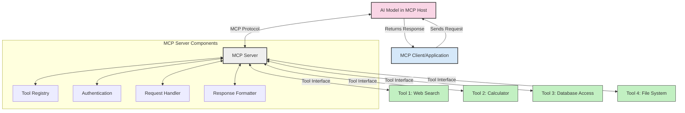
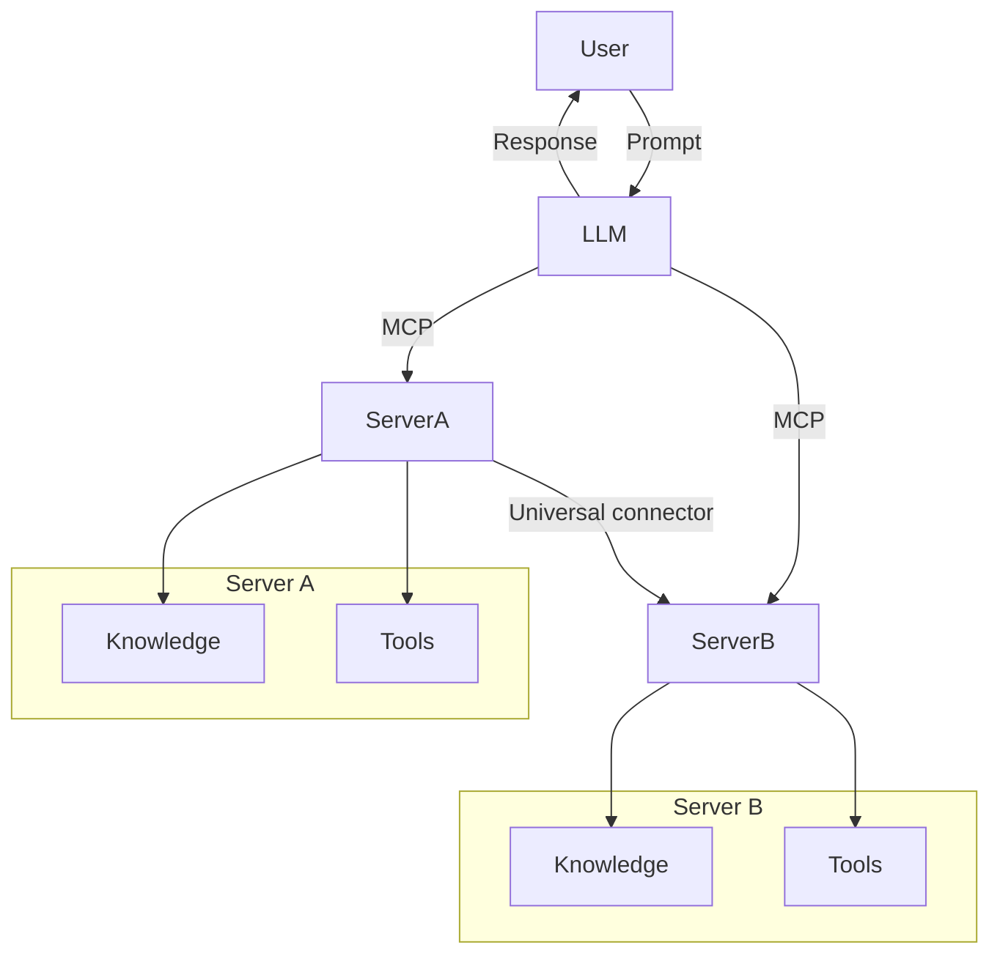

# Introduction to Model Context Protocol (MCP): Why It Matters for Scalable AI Applications

Generative AI applications are a great step forward as they often let the user interact with the app using natural language prompts. However, as more time and resources are invested in such apps, you want to make sure you can easily integrate functionalities and resources in such a way that it's easy to extend, that your app can cater to more than one model being used, and its intricacies. In short, building Gen AI apps is easy to begin with but as it grows and becomes more complex, you need to start defining an architecture and most likely will need to lean on a standard to make sure your apps are built in a consistent way. This is where MCP comes in to organize things, to provide a standard.

---

## **🔍 What Is the Model Context Protocol (MCP)?**

The **Model Context Protocol (MCP)** is an **open, standardized interface** that allows Large Language Models (LLMs) to interact seamlessly with external tools, APIs, and data sources. It provides a consistent architecture to enhance AI model functionality beyond their training data, enabling smarter, scalable, and more responsive AI systems.

---

## **🎯 Why Standardization in AI Matters**

As generative AI applications become more complex, it's essential to adopt standards that ensure **scalability, extensibility**, and **maintainability**. MCP addresses these needs by:

- Unifying model-tool integrations
- Reducing brittle, one-off custom solutions
- Allowing multiple models to coexist within one ecosystem

---

## **📚 Learning Objectives**

By the end of this article, you'll be able to:

- Define **Model Context Protocol (MCP)** and its use cases
- Understand how MCP standardizes model-to-tool communication
- Identify the core components of MCP architecture
- Explore real-world applications of MCP in enterprise and development contexts

---

## **💡 Why the Model Context Protocol (MCP) Is a Game-Changer**

### **🔗 MCP Solves Fragmentation in AI Interactions**

Before MCP, integrating models with tools required:

- Custom code per tool-model pair
- Non-standard APIs for each vendor
- Frequent breaks due to updates
- Poor scalability with more tools

### **✅ Benefits of MCP Standardization**

| **Benefit**              | **Description**                                                                |
|--------------------------|--------------------------------------------------------------------------------|
| Interoperability         | LLMs work seamlessly with tools across different vendors                       |
| Consistency              | Uniform behavior across platforms and tools                                    |
| Reusability              | Tools built once can be used across projects and systems                       |
| Accelerated Development  | Reduce dev time by using standardized, plug-and-play interfaces                |

---

## **🧱 High-Level MCP Architecture Overview**

MCP follows a **client-server model**, where:

- **MCP Hosts** run the AI models
- **MCP Clients** initiate requests
- **MCP Servers** serve context, tools, and capabilities

### **Key Components:**

- **Resources** – Static or dynamic data for models  
- **Prompts** – Predefined workflows for guided generation  
- **Tools** – Executable functions like search, calculations  
- **Sampling** – Agentic behavior via recursive interactions

---

## How MCP Servers Work

MCP servers operate in the following way:

- **Request Flow**: 
    1. The MCP Client sends a request to the AI Model running in an MCP Host.
    2. The AI Model identifies when it needs external tools or data.
    3. The model communicates with the MCP Server using the standardized protocol.

- **MCP Server Functionality**:
    - Tool Registry: Maintains a catalog of available tools and their capabilities.
    - Authentication: Verifies permissions for tool access.
    - Request Handler: Processes incoming tool requests from the model.
    - Response Formatter: Structures tool outputs in a format the model can understand.

- **Tool Execution**: 
    - The server routes requests to the appropriate external tools
    - Tools execute their specialized functions (search, calculation, database queries, etc.)
    - Results are returned to the model in a consistent format.

- **Response Completion**: 
    - The AI model incorporates tool outputs into its response.
    - The final response is sent back to the client application.

## 👨‍💻 How to Build an MCP Server (With Examples)

MCP servers allow you to extend LLM capabilities by providing data and functionality. 

Ready to try it out? Here are examples of creating a simple MCP server in different languages:

- **Python Example**: https://github.com/modelcontextprotocol/python-sdk

- **TypeScript Example**: https://github.com/modelcontextprotocol/typescript-sdk

- **Java Example**: https://github.com/modelcontextprotocol/java-sdk

- **C#/.NET Example**: https://github.com/modelcontextprotocol/csharp-sdk

## 🌍 Real-World Use Cases for MCP

MCP enables a wide range of applications by extending AI capabilities:

| **Application**              | **Description**                                                                |
|------------------------------|--------------------------------------------------------------------------------|
| Enterprise Data Integration  | Connect LLMs to databases, CRMs, or internal tools                             |
| Agentic AI Systems           | Enable autonomous agents with tool access and decision-making workflows        |
| Multi-modal Applications     | Combine text, image, and audio tools within a single unified AI app            |
| Real-time Data Integration   | Bring live data into AI interactions for more accurate, current outputs        |

### 🧠 MCP = Universal Standard for AI Interactions

The Model Context Protocol (MCP) acts as a universal standard for AI interactions, much like how USB-C standardized physical connections for devices. In the world of AI, MCP provides a consistent interface, allowing models (clients) to integrate seamlessly with external tools and data providers (servers). This eliminates the need for diverse, custom protocols for each API or data source.

Under MCP, an MCP-compatible tool (referred to as an MCP server) follows a unified standard. These servers can list the tools or actions they offer and execute those actions when requested by an AI agent. AI agent platforms that support MCP are capable of discovering available tools from the servers and invoking them through this standard protocol.

### 💡 Facilitates access to knowledge

Beyond offering tools, MCP also facilitates access to knowledge. It enables applications to provide context to large language models (LLMs) by linking them to various data sources. For instance, an MCP server might represent a company’s document repository, allowing agents to retrieve relevant information on demand. Another server could handle specific actions like sending emails or updating records. From the agent’s perspective, these are simply tools it can use—some tools return data (knowledge context), while others perform actions. MCP efficiently manages both.

An agent connecting to an MCP server automatically learns the server's available capabilities and accessible data through a standard format. This standardization enables dynamic tool availability. For example, adding a new MCP server to an agent’s system makes its functions immediately usable without requiring further customization of the agent's instructions.

This streamlined integration aligns with the flow depicted in the mermaid diagram, where servers provide both tools and knowledge, ensuring seamless collaboration across systems. 

### 👉 Example: Scalable Agent Solution

## 🔐 Practical Benefits of MCP

Here's the practical benefits to using MCP:

- **Freshness**: Models can access up-to-date information beyond their training data
- **Capability Extension**: Models can leverage specialized tools for tasks they weren't trained for
- **Reduced hallucinations**: External data sources provide factual grounding
- **Privacy**: Sensitive data can stay within secure environments instead of being embedded in prompts

## 📌 Key Takeaways

The following are key takeaways for using MCP:

- **MCP** standardizes how AI models interact with tools and data
- Promotes **extensibility, consistency, and interoperability**
- MCP helps **reduce development time, improve reliability, and extend model capabilities**
- The client-server architecture **enables flexible, extensible AI applications**

## 🧠 Exercise

Think about an AI application you're interested in building.

- Which **external tools or data** could enhance its capabilities?
- How might MCP make integration **simpler and more reliable?**

## Additional Resources

- [MCP GitHub Repository](https://github.com/modelcontextprotocol)

## What's next

Next: [Chapter 1: Core Concepts](/01-CoreConcepts/README.md)
