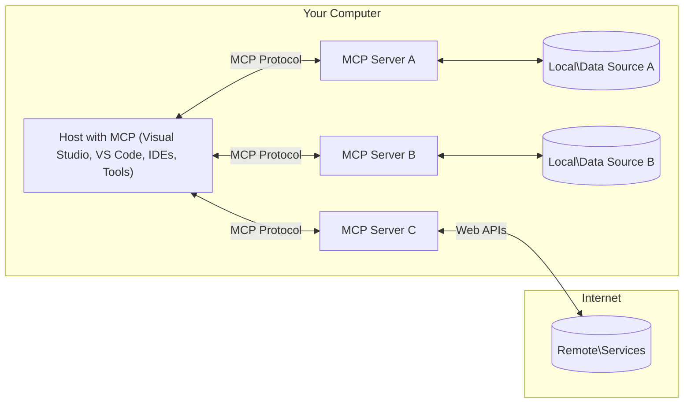

# 📖 MCP Core Concepts: Mastering the Model Context Protocol for AI Integration

[](https://youtu.be/earDzWGtE84)

_(Click the image above to view video of this lesson)_

The [Model Context Protocol (MCP)](https://github.com/modelcontextprotocol) is a powerful, standardized framework that optimizes communication between Large Language Models (LLMs) and external tools, applications, and data sources. This guide will walk you through the core concepts of MCP, ensuring you understand its client-server architecture, essential components, communication mechanics, and implementation best practices.

## Overview

This lesson explores the fundamental architecture and components that make up the Model Context Protocol (MCP) ecosystem. You'll learn about the client-server architecture, key components, and communication mechanisms that power MCP interactions.

## 👩‍🎓 Key Learning Objectives

By the end of this lesson, you will:

- Understand the MCP client-server architecture.
- Identify roles and responsibilities of Hosts, Clients, and Servers.
- Analyze the core features that make MCP a flexible integration layer.
- Learn how information flows within the MCP ecosystem.
- Gain practical insights through code examples in .NET, Java, Python, and JavaScript.

## 🔎 MCP Architecture: A Deeper Look

The MCP ecosystem is built on a client-server model. This modular structure allows AI applications to interact with tools, databases, APIs, and contextual resources efficiently. Let's break down this architecture into its core components.

At its core, MCP follows a client-server architecture where a host application can connect to multiple servers:



- **MCP Hosts**: Programs like VSCode, Claude Desktop, IDEs, or AI tools that want to access data through MCP
- **MCP Clients**: Protocol clients that maintain 1:1 connections with servers
- **MCP Servers**: Lightweight programs that each expose specific capabilities through the standardized Model Context Protocol
- **Local Data Sources**: Your computer's files, databases, and services that MCP servers can securely access
- **Remote Services**: External systems available over the internet that MCP servers can connect to through APIs.

The MCP Protocol is an evolving standard. You can see the latest updates to the [protocol specification](https://modelcontextprotocol.io/specification/2025-06-18/)

### 1. Hosts

In the Model Context Protocol (MCP), Hosts play a crucial role as the primary interface through which users interact with the protocol. Hosts are applications or environments that initiate connections with MCP servers to access data, tools, and prompts. Examples of Hosts include integrated development environments (IDEs) like Visual Studio Code, AI tools like Claude Desktop, or custom-built agents designed for specific tasks

**Hosts** are applications that initiate connections with LLMs. They:

- Execute or interact with AI models to generate responses.
- Initiate connections with MCP servers.
- Manage the conversation flow and user interface.
- Control permission and security constraints.
- Handle user consent for data sharing and tool execution.


### 2. Clients

Clients are essential components that facilitate the interaction between Hosts and MCP servers. Clients act as intermediaries, enabling Hosts to access and utilize the functionalities provided by MCP servers. They play a crucial role in ensuring smooth communication and efficient data exchange within the MCP architecture

**Clients** are connectors within the host application. They:

- Send requests to servers with prompts/instructions.
- Negotiate capabilities with servers.
- Manage tool execution requests from models.
- Process and display responses to users.

### 3. Servers

Servers are responsible for handling requests from MCP clients and providing appropriate responses. Most commonly, servers act as tools which provide a specific capability to the LLM. They manage various operations such as data retrieval, tool execution, and prompt generation. Servers ensure that the communication between clients and Hosts is efficient and reliable, maintaining the integrity of the interaction process

**Servers** are services that provide context and capabilities. They:

- Register available features (resources, prompts, tools)
- Receive and execute tool calls from the client
- Provide contextual information to enhance model responses
- Return outputs back to the client
- Maintain state across interactions when needed

Servers can be developed by anyone to extend model capabilities with specialized functionality.

### 4. Server Features

Servers in the Model Context Protocol (MCP) provide fundamental building blocks that enable rich interactions between clients, hosts, and language models. These features are designed to enhance the capabilities of MCP by offering structured context, tools, and prompts.

MCP servers can offer any of the following features:

#### 📑 Resources 

Resources in the Model Context Protocol (MCP) encompass various types of context and data that can be utilized by users or AI models. These include:

- **Contextual Data**: Information and context that users or AI models can leverage for decision-making and task execution.
- **Knowledge Bases and Document Repositories**: Collections of structured and unstructured data, such as articles, manuals, and research papers, that provide valuable insights and information.
- **Local Files and Databases**: Data stored locally on devices or within databases, accessible for processing and analysis.
- **APIs and Web Services**: External interfaces and services that offer additional data and functionalities, enabling integration with various online resources and tools.

An example of a resource can be a database schema or a file that can be accessed like so:

```text
file://log.txt
database://schema
```

### 🤖 Prompts
Prompts in the Model Context Protocol (MCP) include various pre-defined templates and interaction patterns designed to streamline user workflows and enhance communication. These include:

- **Templated Messages and Workflows**: Pre-structured messages and processes that guide users through specific tasks and interactions.
- **Pre-defined Interaction Patterns**: Standardized sequences of actions and responses that facilitate consistent and efficient communication.
- **Specialized Conversation Templates**: Customizable templates tailored for specific types of conversations, ensuring relevant and contextually appropriate interactions.

A prompt template could look like this:

```markdown
Generate a product slogan based on the following {{product}} with the following {{keywords}}
```

#### ⛏️ Tools

Tools in the Model Context Protocol (MCP) are functions that the AI model can execute to perform specific tasks. These tools are designed to enhance the capabilities of the AI model by providing structured and reliable operations. Key aspects include:

- **Functions for the AI model to execute**: Tools are executable functions that the AI model can invoke to carry out various tasks.
- **Unique Name and Description**: Each tool has a distinct name and a detailed description that explains its purpose and functionality.
- **Parameters and Outputs**: Tools accept specific parameters and return structured outputs, ensuring consistent and predictable results.
- **Discrete Functions**: Tools perform discrete functions such as web searches, calculations, and database queries.

An example tool could look like so:

```typescript
server.tool(
  "GetProducts",
  {
    pageSize: z.string().optional(),
    pageCount: z.string().optional()
  }, () => {
    // return results from API
  }
)
```

## Client Features
In the Model Context Protocol (MCP), clients offer several key features to servers, enhancing the overall functionality and interaction within the protocol. One of the notable features is Sampling.

### 👉 Sampling

- **Server-Initiated Agentic Behaviors**: Clients enable servers to initiate specific actions or behaviors autonomously, enhancing the dynamic capabilities of the system.
- **Recursive LLM Interactions**: This feature allows for recursive interactions with large language models (LLMs), enabling more complex and iterative processing of tasks.
- **Requesting Additional Model Completions**: Servers can request additional completions from the model, ensuring that the responses are thorough and contextually relevant.

## Information Flow in MCP

The Model Context Protocol (MCP) defines a structured flow of information between hosts, clients, servers, and models. Understanding this flow helps clarify how user requests are processed and how external tools and data are integrated into model responses.

- **Host Initiates Connection**  
  The host application (such as an IDE or chat interface) establishes a connection to an MCP server, typically via STDIO, WebSocket, or another supported transport.

- **Capability Negotiation**  
  The client (embedded in the host) and the server exchange information about their supported features, tools, resources, and protocol versions. This ensures both sides understand what capabilities are available for the session.

- **User Request**  
  The user interacts with the host (e.g., enters a prompt or command). The host collects this input and passes it to the client for processing.

- **Resource or Tool Use**  
  - The client may request additional context or resources from the server (such as files, database entries, or knowledge base articles) to enrich the model's understanding.
  - If the model determines that a tool is needed (e.g., to fetch data, perform a calculation, or call an API), the client sends a tool invocation request to the server, specifying the tool name and parameters.

- **Server Execution**  
  The server receives the resource or tool request, executes the necessary operations (such as running a function, querying a database, or retrieving a file), and returns the results to the client in a structured format.

- **Response Generation**  
  The client integrates the server's responses (resource data, tool outputs, etc.) into the ongoing model interaction. The model uses this information to generate a comprehensive and contextually relevant response.

- **Result Presentation**  
  The host receives the final output from the client and presents it to the user, often including both the model's generated text and any results from tool executions or resource lookups.

This flow enables MCP to support advanced, interactive, and context-aware AI applications by seamlessly connecting models with external tools and data sources.

## Protocol Details

MCP (Model Context Protocol) is built on top of [JSON-RPC 2.0](https://www.jsonrpc.org/), providing a standardized, language-agnostic message format for communication between hosts, clients, and servers. This foundation enables reliable, structured, and extensible interactions across diverse platforms and programming languages.

### Key Protocol Features

MCP extends JSON-RPC 2.0 with additional conventions for tool invocation, resource access, and prompt management. It supports multiple transport layers (STDIO, WebSocket, SSE) and enables secure, extensible, and language-agnostic communication between components.

#### 🧢 Base Protocol

- **JSON-RPC Message Format**: All requests and responses use the JSON-RPC 2.0 specification, ensuring consistent structure for method calls, parameters, results, and error handling.
- **Stateful Connections**: MCP sessions maintain state across multiple requests, supporting ongoing conversations, context accumulation, and resource management.
- **Capability Negotiation**: During connection setup, clients and servers exchange information about supported features, protocol versions, available tools, and resources. This ensures both sides understand each other's capabilities and can adapt accordingly.

#### ➕ Additional Utilities

Below are some additional utilities and protocol extensions that MCP provides to enhance developer experience and enable advanced scenarios:

- **Configuration Options**: MCP allows dynamic configuration of session parameters, such as tool permissions, resource access, and model settings, tailored to each interaction.
- **Progress Tracking**: Long-running operations can report progress updates, enabling responsive user interfaces and better user experience during complex tasks.
- **Request Cancellation**: Clients can cancel in-flight requests, allowing users to interrupt operations that are no longer needed or taking too long.
- **Error Reporting**: Standardized error messages and codes help diagnose issues, handle failures gracefully, and provide actionable feedback to users and developers.
- **Logging**: Both clients and servers can emit structured logs for auditing, debugging, and monitoring protocol interactions.

By leveraging these protocol features, MCP ensures robust, secure, and flexible communication between language models and external tools or data sources.

### 🔐 Security Considerations

MCP implementations should adhere to several key security principles to ensure safe and trustworthy interactions:

- **User Consent and Control**: Users must provide explicit consent before any data is accessed or operations are performed. They should have clear control over what data is shared and which actions are authorized, supported by intuitive user interfaces for reviewing and approving activities.

- **Data Privacy**: User data should only be exposed with explicit consent and must be protected by appropriate access controls. MCP implementations must safeguard against unauthorized data transmission and ensure that privacy is maintained throughout all interactions.

- **Tool Safety**: Before invoking any tool, explicit user consent is required. Users should have a clear understanding of each tool’s functionality, and robust security boundaries must be enforced to prevent unintended or unsafe tool execution.

By following these principles, MCP ensures that user trust, privacy, and safety are maintained across all protocol interactions.

## Code Examples: Key Components

Below are code examples in several popular programming languages that illustrate how to implement key MCP server components and tools.

### .NET Example: Creating a Simple MCP Server with Tools

Here is a practical .NET code example demonstrating how to implement a simple MCP server with custom tools. This example showcases how to define and register tools, handle requests, and connect the server using the Model Context Protocol.

```csharp
using System;
using System.Threading.Tasks;
using ModelContextProtocol.Server;
using ModelContextProtocol.Server.Transport;
using ModelContextProtocol.Server.Tools;

public class WeatherServer
{
    public static async Task Main(string[] args)
    {
        // Create an MCP server
        var server = new McpServer(
            name: "Weather MCP Server",
            version: "1.0.0"
        );
        
        // Register our custom weather tool
        server.AddTool<string, WeatherData>("weatherTool", 
            description: "Gets current weather for a location",
            execute: async (location) => {
                // Call weather API (simplified)
                var weatherData = await GetWeatherDataAsync(location);
                return weatherData;
            });
        
        // Connect the server using stdio transport
        var transport = new StdioServerTransport();
        await server.ConnectAsync(transport);
        
        Console.WriteLine("Weather MCP Server started");
        
        // Keep the server running until process is terminated
        await Task.Delay(-1);
    }
    
    private static async Task<WeatherData> GetWeatherDataAsync(string location)
    {
        // This would normally call a weather API
        // Simplified for demonstration
        await Task.Delay(100); // Simulate API call
        return new WeatherData { 
            Temperature = 72.5,
            Conditions = "Sunny",
            Location = location
        };
    }
}

public class WeatherData
{
    public double Temperature { get; set; }
    public string Conditions { get; set; }
    public string Location { get; set; }
}
```

### Java Example: MCP Server Components

This example demonstrates the same MCP server and tool registration as the .NET example above, but implemented in Java.

```java
import io.modelcontextprotocol.server.McpServer;
import io.modelcontextprotocol.server.McpToolDefinition;
import io.modelcontextprotocol.server.transport.StdioServerTransport;
import io.modelcontextprotocol.server.tool.ToolExecutionContext;
import io.modelcontextprotocol.server.tool.ToolResponse;

public class WeatherMcpServer {
    public static void main(String[] args) throws Exception {
        // Create an MCP server
        McpServer server = McpServer.builder()
            .name("Weather MCP Server")
            .version("1.0.0")
            .build();
            
        // Register a weather tool
        server.registerTool(McpToolDefinition.builder("weatherTool")
            .description("Gets current weather for a location")
            .parameter("location", String.class)
            .execute((ToolExecutionContext ctx) -> {
                String location = ctx.getParameter("location", String.class);
                
                // Get weather data (simplified)
                WeatherData data = getWeatherData(location);
                
                // Return formatted response
                return ToolResponse.content(
                    String.format("Temperature: %.1f°F, Conditions: %s, Location: %s", 
                    data.getTemperature(), 
                    data.getConditions(), 
                    data.getLocation())
                );
            })
            .build());
        
        // Connect the server using stdio transport
        try (StdioServerTransport transport = new StdioServerTransport()) {
            server.connect(transport);
            System.out.println("Weather MCP Server started");
            // Keep server running until process is terminated
            Thread.currentThread().join();
        }
    }
    
    private static WeatherData getWeatherData(String location) {
        // Implementation would call a weather API
        // Simplified for example purposes
        return new WeatherData(72.5, "Sunny", location);
    }
}

class WeatherData {
    private double temperature;
    private String conditions;
    private String location;
    
    public WeatherData(double temperature, String conditions, String location) {
        this.temperature = temperature;
        this.conditions = conditions;
        this.location = location;
    }
    
    public double getTemperature() {
        return temperature;
    }
    
    public String getConditions() {
        return conditions;
    }
    
    public String getLocation() {
        return location;
    }
}
```

### Python Example: Building an MCP Server

In this example we show how to build an MCP server in Python. You're also shown two different ways to create tools.

```python
#!/usr/bin/env python3
import asyncio
from mcp.server.fastmcp import FastMCP
from mcp.server.transports.stdio import serve_stdio

# Create a FastMCP server
mcp = FastMCP(
    name="Weather MCP Server",
    version="1.0.0"
)

@mcp.tool()
def get_weather(location: str) -> dict:
    """Gets current weather for a location."""
    # This would normally call a weather API
    # Simplified for demonstration
    return {
        "temperature": 72.5,
        "conditions": "Sunny",
        "location": location
    }

# Alternative approach using a class
class WeatherTools:
    @mcp.tool()
    def forecast(self, location: str, days: int = 1) -> dict:
        """Gets weather forecast for a location for the specified number of days."""
        # This would normally call a weather API forecast endpoint
        # Simplified for demonstration
        return {
            "location": location,
            "forecast": [
                {"day": i+1, "temperature": 70 + i, "conditions": "Partly Cloudy"}
                for i in range(days)
            ]
        }

# Instantiate the class to register its tools
weather_tools = WeatherTools()

# Start the server using stdio transport
if __name__ == "__main__":
    asyncio.run(serve_stdio(mcp))
```

### JavaScript Example: Creating an MCP Server

This example shows MCP server creation in JavaScript and how to register two weather-related tools.

```javascript
// Using the official Model Context Protocol SDK
import { McpServer } from "@modelcontextprotocol/sdk/server/mcp.js";
import { StdioServerTransport } from "@modelcontextprotocol/sdk/server/stdio.js";
import { z } from "zod"; // For parameter validation

// Create an MCP server
const server = new McpServer({
  name: "Weather MCP Server",
  version: "1.0.0"
});

// Define a weather tool
server.tool(
  "weatherTool",
  {
    location: z.string().describe("The location to get weather for")
  },
  async ({ location }) => {
    // This would normally call a weather API
    // Simplified for demonstration
    const weatherData = await getWeatherData(location);
    
    return {
      content: [
        { 
          type: "text", 
          text: `Temperature: ${weatherData.temperature}°F, Conditions: ${weatherData.conditions}, Location: ${weatherData.location}` 
        }
      ]
    };
  }
);

// Define a forecast tool
server.tool(
  "forecastTool",
  {
    location: z.string(),
    days: z.number().default(3).describe("Number of days for forecast")
  },
  async ({ location, days }) => {
    // This would normally call a weather API
    // Simplified for demonstration
    const forecast = await getForecastData(location, days);
    
    return {
      content: [
        { 
          type: "text", 
          text: `${days}-day forecast for ${location}: ${JSON.stringify(forecast)}` 
        }
      ]
    };
  }
);

// Helper functions
async function getWeatherData(location) {
  // Simulate API call
  return {
    temperature: 72.5,
    conditions: "Sunny",
    location: location
  };
}

async function getForecastData(location, days) {
  // Simulate API call
  return Array.from({ length: days }, (_, i) => ({
    day: i + 1,
    temperature: 70 + Math.floor(Math.random() * 10),
    conditions: i % 2 === 0 ? "Sunny" : "Partly Cloudy"
  }));
}

// Connect the server using stdio transport
const transport = new StdioServerTransport();
server.connect(transport).catch(console.error);

console.log("Weather MCP Server started");
```

This JavaScript example demonstrates how to create an MCP client that connects to a server, sends a prompt, and processes the response including any tool calls that were made.

## Security and Authorization

MCP includes several built-in concepts and mechanisms for managing security and authorization throughout the protocol:

1. **Tool Permission Control**:  
  Clients can specify which tools a model is allowed to use during a session. This ensures that only explicitly authorized tools are accessible, reducing the risk of unintended or unsafe operations. Permissions can be configured dynamically based on user preferences, organizational policies, or the context of the interaction.

2. **Authentication**:  
  Servers can require authentication before granting access to tools, resources, or sensitive operations. This may involve API keys, OAuth tokens, or other authentication schemes. Proper authentication ensures that only trusted clients and users can invoke server-side capabilities.

3. **Validation**:  
  Parameter validation is enforced for all tool invocations. Each tool defines the expected types, formats, and constraints for its parameters, and the server validates incoming requests accordingly. This prevents malformed or malicious input from reaching tool implementations and helps maintain the integrity of operations.

4. **Rate Limiting**:  
  To prevent abuse and ensure fair usage of server resources, MCP servers can implement rate limiting for tool calls and resource access. Rate limits can be applied per user, per session, or globally, and help protect against denial-of-service attacks or excessive resource consumption.

By combining these mechanisms, MCP provides a secure foundation for integrating language models with external tools and data sources, while giving users and developers fine-grained control over access and usage.

## Protocol Messages

MCP communication uses structured JSON messages to facilitate clear and reliable interactions between clients, servers, and models. The main message types include:

- **Client Request**  
  Sent from the client to the server, this message typically includes:
  - The user's prompt or command
  - Conversation history for context
  - Tool configuration and permissions
  - Any additional metadata or session information

- **Model Response**  
  Returned by the model (via the client), this message contains:
  - Generated text or completion based on the prompt and context
  - Optional tool call instructions if the model determines a tool should be invoked
  - References to resources or additional context as needed

- **Tool Request**  
  Sent from the client to the server when a tool needs to be executed. This message includes:
  - The name of the tool to invoke
  - Parameters required by the tool (validated against the tool's schema)
  - Contextual information or identifiers for tracking the request

- **Tool Response**  
  Returned by the server after executing a tool. This message provides:
  - The results of the tool execution (structured data or content)
  - Any errors or status information if the tool call failed
  - Optionally, additional metadata or logs related to the execution

These structured messages ensure that each step in the MCP workflow is explicit, traceable, and extensible, supporting advanced scenarios such as multi-turn conversations, tool chaining, and robust error handling.

## Key Takeaways

- MCP uses a client-server architecture to connect models with external capabilities
- The ecosystem consists of clients, hosts, servers, tools, and data sources
- Communication can happen through STDIO, SSE, or WebSockets
- Tools are the fundamental units of functionality exposed to models
- Structured communication protocols ensure consistent interactions

## Exercise

Design a simple MCP tool that would be useful in your domain. Define:
1. What the tool would be named
2. What parameters it would accept
3. What output it would return
4. How a model might use this tool to solve user problems


---

## What's next

Next: [Chapter 2: Security](../02-Security/README.md)
