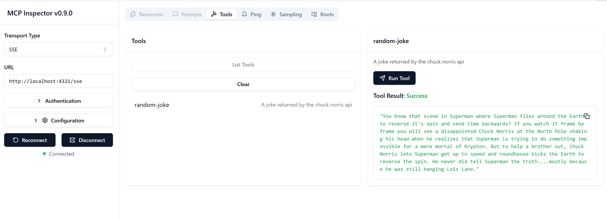

# SSE Server

SSE (Server Sent Events) is a standard for server-to-client streaming, allowing servers to push real-time updates to clients over HTTP. This is particularly useful for applications that require live updates, such as chat applications, notifications, or real-time data feeds. Also, your server can be used by multiple clients at the same time as it lives on a server that can be run somewhere in the cloud for example

## Overview

This lesson covers ow to build and consume SSE Servers.

## Learning Objectives

By the end of this lesson, you will be able to:

- Build an SSE Server.
- Debug an SSE Server using the Inspector.
- Consume an SSE Server using Visual Studio Code.


## SSE, how it works

SSE is one of two supported transport types. You've already seen the first one stdio being used in previous lessons. The difference is the following:

- SSE needs you to handle two things connection and messages.
- As this is a server that can live anywhere, you need that to reflect in how you work with tools like the Inspector and Visual Studio. What that means is that instead of pointing out how to start the server, you instead point to the endpoint where it can establish a connection. See below example code:

    ```typescript
    app.get("/sse", async (_: Request, res: Response) => {
        const transport = new SSEServerTransport('/messages', res);
        transports[transport.sessionId] = transport;
        res.on("close", () => {
            delete transports[transport.sessionId];
        });
        await server.connect(transport);
    });

    app.post("/messages", async (req: Request, res: Response) => {
        const sessionId = req.query.sessionId as string;
        const transport = transports[sessionId];
        if (transport) {
            await transport.handlePostMessage(req, res);
        } else {
            res.status(400).send('No transport found for sessionId');
        }
    });
    ```

    In the preceding code:

    - `/sse` is set up as a route. When a request is made towards this route, a new transport instance is created and the server *connects* using this transport
    - `/messages`, this is the route that handles incoming messages.

Now that we know a little bit more about SSE, let's build an SSE server next.

## Exercise: Creating an SSE Server

To create our server, we need to keep two things in mind:

- We need to use a web server to expose endpoints for connection and messages.
- Build our server like we normally do with tools, resources and prompts when we were using stdio.

### -1- Create a server instance

To create our server, we use the same types as with stdio. However, for the transport, we need to choose SSE.

<details>
<summary>Typescript</summary>

```typescript
import express, { Request, Response } from "express";
import { McpServer } from "@modelcontextprotocol/sdk/server/mcp.js";
import { SSEServerTransport } from "@modelcontextprotocol/sdk/server/sse.js";

const server = new McpServer({
  name: "example-server",
  version: "1.0.0"
});

const app = express();

const transports: {[sessionId: string]: SSEServerTransport} = {};
```

</details>

In the preceding code we've:

- Created a server instance.
- Defined an using the web framework express.
- Created a transports variable that we will use to store incoming connections.

Let's add the needed routes next.

### -2- Add routes

Let's add routes next that handle the connection and incoming messages:

<details>
<summary>Typescript</summary>

```typescript
app.get("/sse", async (_: Request, res: Response) => {
  const transport = new SSEServerTransport('/messages', res);
  transports[transport.sessionId] = transport;
  res.on("close", () => {
    delete transports[transport.sessionId];
  });
  await server.connect(transport);
});

app.post("/messages", async (req: Request, res: Response) => {
  const sessionId = req.query.sessionId as string;
  const transport = transports[sessionId];
  if (transport) {
    await transport.handlePostMessage(req, res);
  } else {
    res.status(400).send('No transport found for sessionId');
  }
});

app.listen(3001);
```

</details>

In the preceding code we've defined:

- An `/sse` route that instantiates a transport of type SSE and ends up calling `connect` on the MCP server.
- A `/messages` route that takes care of incoming messages.

This code looks the same for all SSE servers.

Let's add capabilties to the server next.

### -3- Adding server capabilities

Now that we've got everything SSE specific defined, let's add server capabilities like tools, prompts and resources.

<details>
<summary>Typescript</summary>

```typescript
server.tool("random-joke", "A joke returned by the chuck norris api", {},
  async () => {
    const response = await fetch("https://api.chucknorris.io/jokes/random");
    const data = await response.json();

    return {
      content: [
        {
          type: "text",
          text: data.value
        }
      ]
    };
  }
);
```

Here's how you can add a tool for example. This specific tool creates a tool call "random-joke" that calls a Chuck Norris API and returns a JSON response.

</details>

Your full code should look like so:

<details>
<summary>Typescript</summary>

```typescript
// server-sse.ts
import express, { Request, Response } from "express";
import { McpServer } from "@modelcontextprotocol/sdk/server/mcp.js";
import { SSEServerTransport } from "@modelcontextprotocol/sdk/server/sse.js";
import { z } from "zod";

// Create an MCP server
const server = new McpServer({
  name: "example-server",
  version: "1.0.0"
});

app = express();

app.get("/sse", async (_: Request, res: Response) => {
  const transport = new SSEServerTransport('/messages', res);
  transports[transport.sessionId] = transport;
  res.on("close", () => {
    delete transports[transport.sessionId];
  });
  await server.connect(transport);
});

app.get("/messages", async (req: Request, res: Response) => {
  const sessionId = req.query.sessionId as string;
  const transport = transports[sessionId];
  if (transport) {
    await transport.handlePostMessage(req, res);
  } else {
    res.status(400).send('No transport found for sessionId');
  }
});

app.tool("random-joke", "A joke returned by the chuck norris api", {},
  async () => {
    const response = await fetch("https://api.chucknorris.io/jokes/random");
    const data = await response.json();

    return {
      content: [
        {
          type: "text",
          text: data.value
        }
      ]
    };
  }
);

app.listen(3001);
```

</details>

Great, we have a server using SSE, let's take it for a spin next.

## Exercise: Debugging an SSE Server with Inspector

Inspector is a great tool that we saw in a previous lesson [Creating your first server](/03-GettingStarted/01-first-server/README.md). Let's see if we can use the Inspector even here:

### -1- Running the inspector

To run the inspector, you first must have an SSE server running, so let's do that next:

1. Run the server 

    <details>
    <summary>Typescript</summary>

    ```sh
    tsx && node ./build/server-sse.ts
    ```

    </details>

1. Run the inspector

    <details>
    <summary>Typescript</summary>

    ```sh
    npx @modelcontextprotocol/inspector
    ```

    Note how we don't pass any commands to it. Let's connect the inspector to the server next.

    </details>


### -2- Trying out the tool

Connect the server by selecting SSE in the droplist and fill in the url field where your server is running, for example http:localhost:4321/sse. Now click the "Connect" button. As before, select to list tools, select a tool and provide input values. You should see a result like below:



Great, you're able to work with the inspector, let's see how we can work with Visual Studio Code next.

## Exercise: Consuming an SSE Server via Visual Studio Code

### -0- Prestep 

If you don't already have .vscode folder with an mcp.json file create it.

Now let's add the following entry:

```json
 "sse-server": {
    "type": "sse",
    "url": "http://localhost:4321/sse",
}
```


Adapt the above value of `url` depending on where your server is. Also note how type is `sse`. 

### -1 Connect server 

Connect your server by pressing the "play" icon. 

You should now be able to use your server's tools from the chat window in GitHub Copilot

### -2- Test server

Type a prompt like for example "tell me a joke", this should indicate in GitHub Copilot that it wants to run the tool "random-joke".

You should see a Chuck Norris joke be displayed in the GitHub Copilot chat window. 

Congrats !

## Assignment

Try building out your server with more capabilities. See [this page](https://api.chucknorris.io/) for more endpoints you could be supporting. Some responses return back an icon url, consider how you could be showing that in GitHub Copilot or via a client.

## Solution

[Solution](./solution/README.md)

## Key Takeaways

The takeaways from this chapter is the following:

- SSE is the second supported transport next to stdio.
- To support SSE, you need to manage incoming connections and messages using a web framework.
- You can use both Inspector and Visual Studio Code to consume SSE server, just like stdio servers.

## Samples 

- [Java Calculator](../samples/java/calculator/README.md)
- [.Net Calculator](../samples/csharp/)
- [JavaScript Calculator](../samples/javascript/README.md)
- [TypeScript Calculator](../samples/typescript/README.md)
- [Python Calculator](../samples/python/) 

## Additional Resources

- [SSE](https://developer.mozilla.org/en-US/docs/Web/API/Server-sent_events)

## What's Next

- Next: [Practical implementations](/04-PracticalImplementation/README.md)