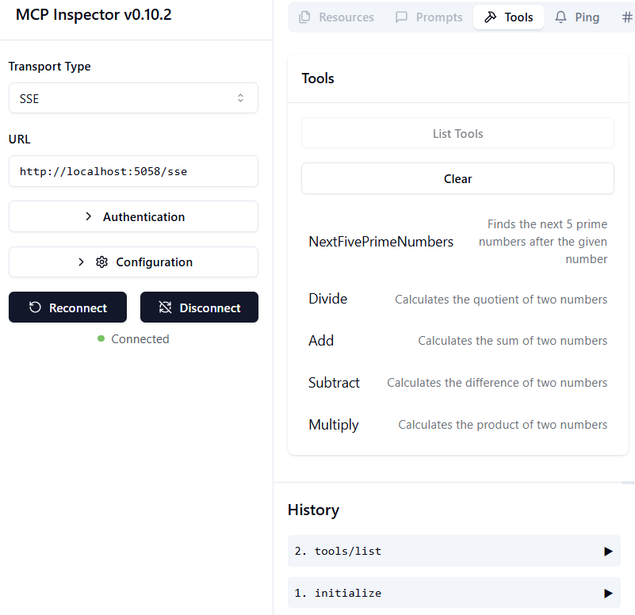

# Sample

The previous example shows how to use a local .NET project with the `sdio` type. And how to run the server locally in a container. This is a good solution in many situations. However, it can be useful to have the server running remotly, like in a cloud environment. This is where the `http` type comes in.

Looking at the solution in the `04-PracticalImplementation` folder, it may look much more complex than the previous one. But in reality, it is not. If you look closely to the project `src/mcpserver/mcpserver.csproj`, you will see that it is mostly the same code as the previous example. The only difference is that we are using a different library `ModelContextProtocol.AspNetCore` to handle the HTTP requests. And we change the method `IsPrime` to make it private, just to show that you can have private methods in your code. The rest of the code is the same as before.

The other projects are from [.NET Aspire](https://learn.microsoft.com/dotnet/aspire/get-started/aspire-overview). Having .NET Aspire in the solution will improve the experience of the developer while developing and testing and help with observability. It is not required to run the server, but it is a good practice to have it in your solution.

## Start the server locally

1. From VS Code (with the C# DevKit extension), open the solution `04-PracticalImplementation\samples\csharp\src\Calculator-chap4.sln`.
2. Press `F5` to start the server. It should start a web browser with the .NET Aspire dashboard. 

or

1. From a terminal, navigate to the folder `04-PracticalImplementation\samples\csharp\src`
2. Execute the following command to start the server:
   ```bash
    dotnet run --project .\AppHost
   ```

3. From the Dashboard, note the `http` URL. It should be something like `http://localhost:5058/`.

## Test `SSE` with the ModelContext Protocol Inspector

If you have Node.js 22.7.5 and higher, you can use the ModelContext Protocol Inspector to test your server. 

Start the server and run the following command in a terminal:

```bash
npx @modelcontextprotocol/inspector@latest
```



- Select the `SSE` as the Transport type. SSE stand for Server-Sent Events. 
- In the Url field, enter the URL of the server noted earlier,and append `/sse`. It should be `http` (not `https`) something like `http://localhost:5058/sse`.
- select the Connect button.

A nice thing about the Inspector is that it provide a nice visibility on what is happening.

- Try listing the availables tools
- Try some of them, it should works just like before.


## Test `SSE` with Github Copilot Chat in VS Code

To use the `SSE` transport with Github Copilot Chat, change the configuration of the `mcp-calc` server created previously to loo like this:

```json
"mcp-calc": {
    "type": "sse",
    "url": "http://localhost:5058/sse"
}
```

Do some tests:
- Ask for the 3 prime numbers after 6780. Note how Copilot will use the new tools `NextFivePrimeNumbers` and only return the first 3 prime numbers.
- Ask for the 7 prime numbers after 111, to see what happens.


# Deploy the server to Azure

Let's deploy the server to Azure so more people can use it. 

From a terminal, navigate to the folder `04-PracticalImplementation\samples\csharp\src` and run the following command:

```bash
azd init
```

This will create a few files locally to save the configuration of Azure resources, and your Infrastructure as code (IaC). 

Then, run the following command to deploy the server to Azure:

```bash
azd up
```

Once the deployment is finished, you should see a message like this:


Navigate to the Aspire dashboard and note the `HTTP` URL to use it in the MCP Inspector and in the Github Copilot Chat.


## What's next?

We try different transport types, and testing tools and we also deployour MCP server to Azure. But what if our server needs to access to private resources? For example, a database or a private API? In the next chapter, we will see how we can improve the security of our server.