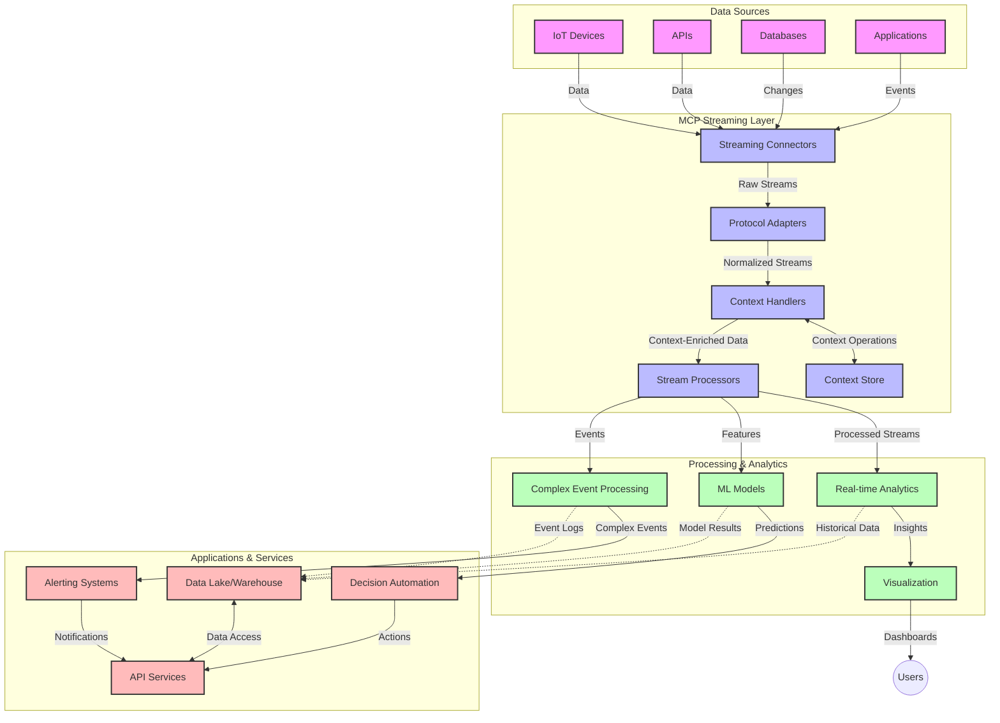

# Model Context Protocol for Real-Time Data Streaming

## Overview

Real-time data streaming has become essential in today's data-driven world, where businesses and applications require immediate access to information to make timely decisions. The Model Context Protocol (MCP) represents a significant advancement in optimizing these real-time streaming processes, enhancing data processing efficiency, maintaining contextual integrity, and improving overall system performance.

This module explores how MCP transforms real-time data streaming by providing a standardized approach to context management across AI models, streaming platforms, and applications.

## Introduction to Real-Time Data Streaming

Real-time data streaming is a technological paradigm that enables the continuous transfer, processing, and analysis of data as it's generated, allowing systems to react immediately to new information. Unlike traditional batch processing that operates on static datasets, streaming processes data in motion, delivering insights and actions with minimal latency.

### Core Concepts of Real-Time Data Streaming:

- **Continuous Data Flow**: Data is processed as a continuous, never-ending stream of events or records.
- **Low Latency Processing**: Systems are designed to minimize the time between data generation and processing.
- **Scalability**: Streaming architectures must handle variable data volumes and velocity.
- **Fault Tolerance**: Systems need to be resilient against failures to ensure uninterrupted data flow.
- **Stateful Processing**: Maintaining context across events is crucial for meaningful analysis.

### The Model Context Protocol and Real-Time Streaming

The Model Context Protocol (MCP) addresses several critical challenges in real-time streaming environments:

1. **Contextual Continuity**: MCP standardizes how context is maintained across distributed streaming components, ensuring that AI models and processing nodes have access to relevant historical and environmental context.

2. **Efficient State Management**: By providing structured mechanisms for context transmission, MCP reduces the overhead of state management in streaming pipelines.

3. **Interoperability**: MCP creates a common language for context sharing between diverse streaming technologies and AI models, enabling more flexible and extensible architectures.

4. **Streaming-Optimized Context**: MCP implementations can prioritize which context elements are most relevant for real-time decision making, optimizing for both performance and accuracy.

5. **Adaptive Processing**: With proper context management through MCP, streaming systems can dynamically adjust processing based on evolving conditions and patterns in the data.

In modern applications ranging from IoT sensor networks to financial trading platforms, the integration of MCP with streaming technologies enables more intelligent, context-aware processing that can respond appropriately to complex, evolving situations in real time.

## Learning Objectives

By the end of this lesson, you will be able to:

- Understand the fundamentals of real-time data streaming and its challenges
- Explain how the Model Context Protocol (MCP) enhances real-time data streaming
- Implement MCP-based streaming solutions using popular frameworks like Kafka and Pulsar
- Design and deploy fault-tolerant, high-performance streaming architectures with MCP
- Apply MCP concepts to IoT, financial trading, and AI-driven analytics use cases
- Evaluate emerging trends and future innovations in MCP-based streaming technologies


### Definition and Significance

Real-time data streaming involves the continuous generation, processing, and delivery of data with minimal latency. Unlike batch processing, where data is collected and processed in groups, streaming data is processed incrementally as it arrives, enabling immediate insights and actions.

Key characteristics of real-time data streaming include:

- **Low Latency**: Processing and analyzing data within milliseconds to seconds
- **Continuous Flow**: Uninterrupted streams of data from various sources
- **Immediate Processing**: Analyzing data as it arrives rather than in batches
- **Event-Driven Architecture**: Responding to events as they occur

### Challenges in Traditional Data Streaming

Traditional data streaming approaches face several limitations:

1. **Context Loss**: Difficulty maintaining context across distributed systems
2. **Scalability Issues**: Challenges in scaling to handle high-volume, high-velocity data
3. **Integration Complexity**: Problems with interoperability between different systems
4. **Latency Management**: Balancing throughput with processing time
5. **Data Consistency**: Ensuring data accuracy and completeness across the stream

## Understanding Model Context Protocol (MCP)

### What is MCP?

The Model Context Protocol (MCP) is a standardized communication protocol designed to facilitate efficient interaction between AI models and applications. In the context of real-time data streaming, MCP provides a framework for:

- Preserving context throughout the data pipeline
- Standardizing data exchange formats
- Optimizing the transmission of large datasets
- Enhancing model-to-model and model-to-application communication

### Core Components and Architecture

MCP architecture for real-time streaming consists of several key components:

1. **Context Handlers**: Manage and maintain contextual information across the streaming pipeline
2. **Stream Processors**: Process incoming data streams using context-aware techniques
3. **Protocol Adapters**: Convert between different streaming protocols while preserving context
4. **Context Store**: Efficiently store and retrieve contextual information
5. **Streaming Connectors**: Connect to various streaming platforms (Kafka, Pulsar, Kinesis, etc.)



### How MCP Improves Real-Time Data Handling

MCP addresses traditional streaming challenges through:

- **Contextual Integrity**: Maintaining relationships between data points across the entire pipeline
- **Optimized Transmission**: Reducing redundancy in data exchange through intelligent context management
- **Standardized Interfaces**: Providing consistent APIs for streaming components
- **Reduced Latency**: Minimizing processing overhead through efficient context handling
- **Enhanced Scalability**: Supporting horizontal scaling while preserving context

## Integration and Implementation

Real-time data streaming systems require careful architectural design and implementation to maintain both performance and contextual integrity. The Model Context Protocol offers a standardized approach to integrating AI models and streaming technologies, allowing for more sophisticated, context-aware processing pipelines.

### Overview of MCP Integration in Streaming Architectures

Implementing MCP in real-time streaming environments involves several key considerations:

1. **Context Serialization and Transport**: MCP provides efficient mechanisms for encoding contextual information within streaming data packets, ensuring that essential context follows the data throughout the processing pipeline. This includes standardized serialization formats optimized for streaming transport.

2. **Stateful Stream Processing**: MCP enables more intelligent stateful processing by maintaining consistent context representation across processing nodes. This is particularly valuable in distributed streaming architectures where state management is traditionally challenging.

3. **Event-Time vs. Processing-Time**: MCP implementations in streaming systems must address the common challenge of differentiating between when events occurred and when they're processed. The protocol can incorporate temporal context that preserves event time semantics.

4. **Backpressure Management**: By standardizing context handling, MCP helps manage backpressure in streaming systems, allowing components to communicate their processing capabilities and adjust flow accordingly.

5. **Context Windowing and Aggregation**: MCP facilitates more sophisticated windowing operations by providing structured representations of temporal and relational contexts, enabling more meaningful aggregations across event streams.

6. **Exactly-Once Processing**: In streaming systems requiring exactly-once semantics, MCP can incorporate processing metadata to help track and verify processing status across distributed components.

The implementation of MCP across various streaming technologies creates a unified approach to context management, reducing the need for custom integration code while enhancing the system's ability to maintain meaningful context as data flows through the pipeline.

### MCP in Various Data Streaming Frameworks

MCP can be integrated with popular streaming frameworks including:

#### Apache Kafka Integration

```python
import asyncio
from confluent_kafka import Consumer, Producer, KafkaError
from mcp.streaming import StreamingContextManager, MCPMessageContext

# Configuration for Kafka
kafka_config = {
    'bootstrap.servers': 'localhost:9092',
    'group.id': 'mcp-streaming-group',
    'auto.offset.reset': 'earliest'
}

# Initialize MCP Streaming Context Manager
context_manager = StreamingContextManager()

# Producer callback
def delivery_report(err, msg):
    if err is not None:
        print(f'Message delivery failed: {err}')
    else:
        print(f'Message delivered to {msg.topic()} [{msg.partition()}]')

async def produce_with_context(topic, data, context):
    # Create producer
    producer = Producer(kafka_config)
    
    # Serialize context with data
    serialized_message = context_manager.serialize_message(data, context)
    
    # Produce message with context
    producer.produce(
        topic, 
        serialized_message, 
        callback=delivery_report
    )
    producer.flush()

async def consume_with_context(topics):
    # Create consumer
    consumer = Consumer(kafka_config)
    consumer.subscribe(topics)
    
    try:
        while True:
            msg = consumer.poll(1.0)
            
            if msg is None:
                continue
            if msg.error():
                if msg.error().code() == KafkaError._PARTITION_EOF:
                    continue
                print(f'Consumer error: {msg.error()}')
                break
            
            # Deserialize message and extract context
            data, context = context_manager.deserialize_message(msg.value())
            
            # Process with context awareness
            result = await process_with_context(data, context)
            
            # Produce result with updated context
            new_context = context.update({'processing_timestamp': asyncio.get_event_loop().time()})
            await produce_with_context('output-topic', result, new_context)
            
    finally:
        consumer.close()

async def process_with_context(data, context):
    # Example processing logic using context
    print(f"Processing data with context: {context}")
    # Apply context-aware transformations
    return f"Processed: {data}"

# Main streaming application
async def main():
    # Create sample context
    initial_context = MCPMessageContext(
        conversation_id="conv123",
        metadata={"source": "sensor-1", "priority": "high"}
    )
    
    # Start consumer in background
    consumer_task = asyncio.create_task(consume_with_context(['input-topic']))
    
    # Produce sample messages with context
    for i in range(5):
        await produce_with_context(
            'input-topic',
            f"Message {i}",
            initial_context.update({"sequence": i})
        )
        await asyncio.sleep(1)
    
    # Wait for consumer to process messages
    await asyncio.sleep(10)
    consumer_task.cancel()
    
if __name__ == "__main__":
    asyncio.run(main())
```

#### Apache Pulsar Implementation

```python
import asyncio
import json
import pulsar
from mcp.streaming import StreamingContextManager, MCPMessageContext

# Initialize MCP Streaming Context Manager
context_manager = StreamingContextManager()

class MCPPulsarClient:
    def __init__(self, service_url):
        self.client = pulsar.Client(service_url)
        
    def create_producer(self, topic):
        return self.client.create_producer(topic)
    
    def subscribe(self, topic, subscription_name, context_enabled=True):
        consumer = self.client.subscribe(
            topic,
            subscription_name,
            consumer_type=pulsar.ConsumerType.Shared
        )
        if context_enabled:
            return MCPPulsarConsumer(consumer, context_manager)
        return consumer
    
    def close(self):
        self.client.close()

class MCPPulsarConsumer:
    def __init__(self, consumer, context_manager):
        self.consumer = consumer
        self.context_manager = context_manager
        
    def receive(self, timeout_ms=None):
        msg = self.consumer.receive(timeout_ms)
        data, context = self.context_manager.deserialize_message(msg.data())
        return MCPPulsarMessage(msg, data, context)
    
    def acknowledge(self, message):
        self.consumer.acknowledge(message.original_message)
        
    def close(self):
        self.consumer.close()

class MCPPulsarMessage:
    def __init__(self, original_message, data, context):
        self.original_message = original_message
        self._data = data
        self._context = context
        
    def data(self):
        return self._data
    
    def get_context(self):
        return self._context

async def pulsar_streaming_example():
    # Create client
    client = MCPPulsarClient('pulsar://localhost:6650')
    
    # Create context
    initial_context = MCPMessageContext(
        conversation_id="pulsar-conv-1",
        metadata={"source": "sensor-a", "priority": "medium"}
    )
    
    # Create producer
    producer = client.create_producer('input-topic')
    
    # Create consumer with context awareness
    consumer = client.subscribe('input-topic', 'my-subscription', context_enabled=True)
    
    # Send messages with context
    for i in range(3):
        message_context = initial_context.update({"sequence": i})
        serialized_message = context_manager.serialize_message(
            f"Pulsar message {i}", 
            message_context
        )
        producer.send(serialized_message)
    
    # Process messages with context
    try:
        for i in range(3):
            msg = consumer.receive(timeout_ms=5000)
            
            print(f"Received: {msg.data()}")
            print(f"Context: {msg.get_context()}")
            
            # Process with context
            result = process_with_context(msg.data(), msg.get_context())
            
            # Acknowledge message
            consumer.acknowledge(msg)
            
            # Send result with updated context
            updated_context = msg.get_context().update({"processed": True})
            output_producer = client.create_producer('output-topic')
            output_message = context_manager.serialize_message(result, updated_context)
            output_producer.send(output_message)
            
    except Exception as e:
        print(f"Error processing messages: {e}")
    finally:
        consumer.close()
        client.close()

def process_with_context(data, context):
    # Example processing with context
    return f"Processed [{context.conversation_id}]: {data}"

if __name__ == "__main__":
    asyncio.run(pulsar_streaming_example())
```

### Best Practices for Deployment

When implementing MCP for real-time streaming:

1. **Design for Fault Tolerance**:
   - Implement proper error handling
   - Use dead-letter queues for failed messages
   - Design idempotent processors

2. **Optimize for Performance**:
   - Configure appropriate buffer sizes
   - Use batching where appropriate
   - Implement backpressure mechanisms

3. **Monitor and Observe**:
   - Track stream processing metrics
   - Monitor context propagation
   - Set up alerts for anomalies

4. **Secure Your Streams**:
   - Implement encryption for sensitive data
   - Use authentication and authorization
   - Apply proper access controls


### MCP in IoT and Edge Computing

MCP enhances IoT streaming by:

- Preserving device context across the processing pipeline
- Enabling efficient edge-to-cloud data streaming
- Supporting real-time analytics on IoT data streams
- Facilitating device-to-device communication with context

Example: Smart City Sensor Networks
```
Sensors → Edge Gateways → MCP Stream Processors → Real-time Analytics → Automated Responses
```

### Role in Financial Transactions and High-Frequency Trading

MCP provides significant advantages for financial data streaming:

- Ultra-low latency processing for trading decisions
- Maintaining transaction context throughout processing
- Supporting complex event processing with contextual awareness
- Ensuring data consistency across distributed trading systems

### Enhancing AI-Driven Data Analytics

MCP creates new possibilities for streaming analytics:

- Real-time model training and inference
- Continuous learning from streaming data
- Context-aware feature extraction
- Multi-model inference pipelines with preserved context

## Future Trends and Innovations

### Evolution of MCP in Real-Time Environments

Looking ahead, we anticipate MCP evolving to address:

- **Quantum Computing Integration**: Preparing for quantum-based streaming systems
- **Edge-Native Processing**: Moving more context-aware processing to edge devices
- **Autonomous Stream Management**: Self-optimizing streaming pipelines
- **Federated Streaming**: Distributed processing while preserving privacy

### Potential Advancements in Technology

Emerging technologies that will shape the future of MCP streaming:

1. **AI-Optimized Streaming Protocols**: Custom protocols designed specifically for AI workloads
2. **Neuromorphic Computing Integration**: Brain-inspired computing for stream processing
3. **Serverless Streaming**: Event-driven, scalable streaming without infrastructure management
4. **Distributed Context Stores**: Globally distributed yet highly consistent context management

## Hands-On Exercises

### Exercise 1: Setting Up a Basic MCP Streaming Pipeline

In this exercise, you'll learn how to:
- Configure a basic MCP streaming environment
- Implement context handlers for stream processing
- Test and validate context preservation

### Exercise 2: Building a Real-Time Analytics Dashboard

Create a complete application that:
- Ingests streaming data using MCP
- Processes the stream while maintaining context
- Visualizes results in real-time

### Exercise 3: Implementing Complex Event Processing with MCP

Advanced exercise covering:
- Pattern detection in streams
- Contextual correlation across multiple streams
- Generating complex events with preserved context

## Additional Resources

- [Model Context Protocol Specification](https://github.com/modelcontextprotocol) - Official MCP specification and documentation
- [Apache Kafka Documentation](https://kafka.apache.org/documentation/) - Learn about Kafka for stream processing
- [Apache Pulsar](https://pulsar.apache.org/) - Unified messaging and streaming platform
- [Streaming Systems: The What, Where, When, and How of Large-Scale Data Processing](https://www.oreilly.com/library/view/streaming-systems/9781491983867/) - Comprehensive book on streaming architectures
- [Microsoft Azure Event Hubs](https://learn.microsoft.com/azure/event-hubs/event-hubs-about) - Managed event streaming service
- [MLflow Documentation](https://mlflow.org/docs/latest/index.html) - For ML model tracking and deployment
- [Real-Time Analytics with Apache Storm](https://storm.apache.org/releases/current/index.html) - Processing framework for real-time computation
- [Flink ML](https://nightlies.apache.org/flink/flink-ml-docs-master/) - Machine learning library for Apache Flink
- [LangChain Documentation](https://python.langchain.com/docs/get_started/introduction) - Building applications with LLMs


## Learning Outcomes

By completing this module, you will be able to:

- Understand the fundamentals of real-time data streaming and its challenges
- Explain how the Model Context Protocol (MCP) enhances real-time data streaming
- Implement MCP-based streaming solutions using popular frameworks like Kafka and Pulsar
- Design and deploy fault-tolerant, high-performance streaming architectures with MCP
- Apply MCP concepts to IoT, financial trading, and AI-driven analytics use cases
- Evaluate emerging trends and future innovations in MCP-based streaming technologies

## What's next 

- [6. Community Contributions](../../06-CommunityContributions/README.md)
