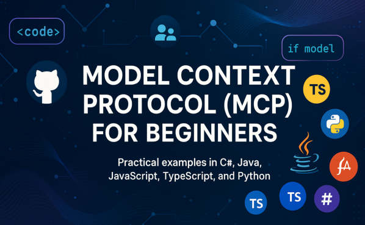

 

Follow these steps to get started using these resources :
1. **Fork the Repository**: Click 
2. **Clone the Repository**:   `git clone https://github.com/microsoft/mcp-for-beginners.git`
3. [**Join The Azure AI Foundry Discord and meet experts and fellow developers**](https://discord.com/invite/ByRwuEEgH4)

### 🌐 Multi-Language Support

#### Supported via GitHub Action (Automated & Always Up-to-Date)

[French](./translations/fr/README.md) | [Spanish](./translations/es/README.md) | [German](./translations/de/README.md) | [Russian](./translations/ru/README.md) | [Arabic](./translations/ar/README.md) | [Persian (Farsi)](./translations/fa/README.md) | [Urdu](./translations/ur/README.md) | [Chinese (Simplified)](./translations/zh/README.md) | [Chinese (Traditional, Macau)](./translations/mo/README.md) | [Chinese (Traditional, Hong Kong)](./translations/hk/README.md) | [Chinese (Traditional, Taiwan)](./translations/tw/README.md) | [Japanese](./translations/ja/README.md) | [Korean](./translations/ko/README.md) | [Hindi](./translations/hi/README.md) | [Bengali](./translations/bn/README.md) | [Marathi](./translations/mr/README.md) | [Nepali](./translations/ne/README.md) | [Punjabi (Gurmukhi)](./translations/pa/README.md) | [Portuguese (Portugal)](./translations/pt/README.md) | [Portuguese (Brazil)](./translations/br/README.md) | [Italian](./translations/it/README.md) | [Polish](./translations/pl/README.md) | [Turkish](./translations/tr/README.md) | [Greek](./translations/el/README.md) | [Thai](./translations/th/README.md) | [Swedish](./translations/sv/README.md) | [Danish](./translations/da/README.md) | [Norwegian](./translations/no/README.md) | [Finnish](./translations/fi/README.md) | [Dutch](./translations/nl/README.md) | [Hebrew](./translations/he/README.md) | [Vietnamese](./translations/vi/README.md) | [Indonesian](./translations/id/README.md) | [Malay](./translations/ms/README.md) | [Tagalog (Filipino)](./translations/tl/README.md) | [Swahili](./translations/sw/README.md) | [Hungarian](./translations/hu/README.md) | [Czech](./translations/cs/README.md) | [Slovak](./translations/sk/README.md) | [Romanian](./translations/ro/README.md) | [Bulgarian](./translations/bg/README.md) | [Serbian (Cyrillic)](./translations/sr/README.md) | [Croatian](./translations/hr/README.md) | [Slovenian](./translations/sl/README.md)

# 🚀 Model Context Protocol (MCP) Curriculum for Beginners

## **Learn MCP with Hands-on Code Examples in C#, Java, JavaScript, Python, and TypeScript**

## 🧠 Overview of the Model Context Protocol Curriculum

The **Model Context Protocol (MCP)** is a cutting-edge framework designed to standardize interactions between AI models and client applications. This open-source curriculum offers a structured learning path, complete with practical coding examples and real-world use cases, across popular programming languages including C#, Java, JavaScript, TypeScript, and Python.

Whether you're an AI developer, system architect, or software engineer, this guide is your comprehensive resource for mastering MCP fundamentals and implementation strategies.

## 🔗 Official MCP Resources

- 📘 [MCP Documentation](https://modelcontextprotocol.io/) – Detailed tutorials and user guides  
- 📜 [MCP Specification](https://spec.modelcontextprotocol.io/) – Protocol architecture and technical references  
- 🧑‍💻 [MCP GitHub Repository](https://github.com/modelcontextprotocol) – Open-source SDKs, tools, and code samples  

## 🧭 Complete MCP Curriculum Structure

| Ch | Title | Description | Link |
|--|--|--|--|
| 00 | **Introduction to MCP** | Overview of the Model Context Protocol and its significance in AI pipelines, including what is the Model Context Protocol, why standardization matters and practical use cases and benefits | [Introduction](./00-Introduction/README.md) |
| 01 | **Core Concepts Explained** | In-depth exploration of the core concepts of MCP, including client-server architecture, key protocol components, and messaging patterns | [Core Concepts](./01-CoreConcepts/README.md) |
| 02 | **Security in MCP** | Identifying security threats within MCP-based systems, techniques and best practices for securing implementations | [Security](/02-Security/README.md) |
| 03 | **Getting Started with MCP** | Environment setup and configuration, creating basic MCP servers and clients, integrating MCP with existing applications | [Getting Started](./03-GettingStarted/README.md) |
| 3.1 | **First server** | Setting up a basic server using the MCP protocol, understanding the server-client interaction, and testing the server | [First Server](./03-GettingStarted/01-first-server/README.md) |
| 3.2 | **First client**  | Setting up a basic client using the MCP protocol, understanding the client-server interaction, and testing the client | [First Client](./03-GettingStarted/02-client/README.md) |
| 3.3 | **Client with LLM**  | Setting up a client using the MCP protocol with a Large Language Model (LLM) | [Client with LLM](./03-GettingStarted/03-llm-client/README.md) |
| 3.4 | **Consuming a server with Visual Studio Code** | Setting up Visual Studio Code to consume servers using the MCP protocol | [Consuming a server with Visual Studio Code](./03-GettingStarted/04-vscode/README.md) |
| 3.5 | **Creating a server using SSE** | SSE helps us expose a server to the internet. This section will help you create a server using SSE | [Creating a server using SSE](./03-GettingStarted/05-sse-server/README.md) |
| 3.6 | **Use AI Toolkit** | AI toolkit is a great tool that will help you manage your AI and MCP workflow. | [Use AI Toolkit](./03-GettingStarted/06-aitk/README.md) |
| 3.7 | **Testing your server** | Testing is an important part of the development process. This section will help you test use several different tools. | [Testing your server](./03-GettingStarted/07-testing/README.md) |
| 3.8 | **Deploy your server** | How do you go from local development to production? This section will help you develop and deploy your server. | [Deploy your server](./03-GettingStarted/08-deployment/README.md) |
| 04 | **Practical Implementation** | Using SDKs across different languages, debugging, testing, and validation, crafting reusable prompt templates and workflows | [Practical Implementation](./04-PracticalImplementation/README.md) |
| 05 | **Advanced Topics in MCP** | Multi-modal AI workflows and extensibility, secure scaling strategies, MCP in enterprise ecosystems | [Advanced Topics](./05-AdvancedTopics/README.md) |
| 5.1 | **MCP Integration with Azure** | Shows integration with Azure | [MCP Azure integration](./05-AdvancedTopics/mcp-integration/README.md) |
| 5.2 | **Multi modality** | Showing how to work with different modalities like images and more | [Multi modality](./05-AdvancedTopics/mcp-multi-modality/README.md) |
| 5.3 | **MCP OAuth2 Demo** | Minimal Spring Boot app showing OAuth2 with MCP, both as Authorization and Resource Server. Demonstrates secure token issuance, protected endpoints, Azure Container Apps deployment, and API Management integration. | [MCP OAuth2 Demo](./05-AdvancedTopics/mcp-oauth2-demo/README.md) |
| 5.4 | **Root Contexts** | Learn more about root context and how to implement them | [Root Contexts](./05-AdvancedTopics/mcp-root-contexts/README.md) |
| 5.5 | **Routing** | Learn different types of routing | [Routing](./05-AdvancedTopics/mcp-routing/README.md) |
| 5.6 | **Sampling** | Learn how to work with sampling | [Sampling](./05-AdvancedTopics/mcp-sampling/README.md) |
| 5.7 | **Scaling** | Learn about scaling MCP servers, including horizontal and vertical scaling strategies, resource optimization, and performance tuning | [Scaling](./05-AdvancedTopics/mcp-scaling/README.md) |
| 5.8 | **Security** | Secure your MCP Server, including authentication, authorization, and data protection strategies | [Security](./05-AdvancedTopics/mcp-security/README.md) |
| 5.9 | **Web Search MCP** | Python MCP server and client integrating with SerpAPI for real-time web, news, product search, and Q&A. Demonstrates multi-tool orchestration, external API integration, and robust error handling | [Web Search MCP](./05-AdvancedTopics/web-search-mcp/README.md) |
| 06 | **Community Contributions** | How to contribute code and docs, collaborating via GitHub, community-driven enhancements and feedback | [Community Contributions](./06-CommunityContributions/README.md) |
| 07 | **Insights from Early Adoption** | Real-world implementations and what worked, building and deploying MCP-based solutions, trends and future roadmap | [Insights](./07-LessonsFromEarlyAdoption/README.md) |
| 08 | **Best Practices for MCP** | Performance tuning and optimization, designing fault-tolerant MCP systems, testing and resilience strategies | [Best Practices](./08-BestPractices/README.md) |
| 09 | **MCP Case Studies** | Deep-dives into MCP solution architectures, deployment blueprints and integration tips, annotated diagrams and project walkthroughs | [Case Studies](./09-CaseStudy/README.md) |

## Sample Projects

### 🧮 MCP Calculator Sample Projects:

  
<strong>Explore Code Implementations by Language</strong>

  - [C# MCP Server Example](./03-GettingStarted/samples/csharp/README.md)
  - [Java MCP Calculator](./03-GettingStarted/samples/java/calculator/README.md)
  - [JavaScript MCP Demo](./03-GettingStarted/samples/javascript/README.md)
  - [Python MCP Server](./03-GettingStarted/samples/python/mcp_calculator_server.py)
  - [TypeScript MCP Example](./03-GettingStarted/samples/typescript/README.md)

### 💡 MCP Advanced Calculator Projects:

  
<strong>Explore Advanced Samples</strong>

  - [Advanced C# Sample](./04-PracticalImplementation/samples/csharp/README.md)
  - [Java Container App Example](./04-PracticalImplementation/samples/java/containerapp/README.md)
  - [JavaScript Advanced Sample](./04-PracticalImplementation/samples/javascript/README.md)
  - [Python Complex Implementation](./04-PracticalImplementation/samples/python/mcp_sample.py)
  - [TypeScript Container Sample](./04-PracticalImplementation/samples/typescript/README.md)

## 🎯 Prerequisites for Learning MCP

To get the most out of this curriculum, you should have:

- Basic knowledge of C#, Java, or Python
- Understanding of client-server model and APIs
- (Optional) Familiarity with machine learning concepts

## 🛠️ How to Use This Curriculum Effectively

Each lesson in this guide includes:

1. Clear explanations of MCP concepts  
2. Live code examples in multiple languages  
3. Exercises to build real MCP applications  
4. Extra resources for advanced learners  

## 📜 License Information

This content is licensed under the **MIT License**. For terms and conditions, see the [LICENSE](./LICENSE).

## 🤝 Contribution Guidelines

This project welcomes contributions and suggestions.  Most contributions require you to agree to a
Contributor License Agreement (CLA) declaring that you have the right to, and actually do, grant us
the rights to use your contribution. For details, visit <https://cla.opensource.microsoft.com>.

When you submit a pull request, a CLA bot will automatically determine whether you need to provide
a CLA and decorate the PR appropriately (e.g., status check, comment). Simply follow the instructions
provided by the bot. You will only need to do this once across all repos using our CLA.

This project has adopted the [Microsoft Open Source Code of Conduct](https://opensource.microsoft.com/codeofconduct/).
For more information see the [Code of Conduct FAQ](https://opensource.microsoft.com/codeofconduct/faq/) or
contact [opencode@microsoft.com](mailto:opencode@microsoft.com) with any additional questions or comments.

## 🎒 Other Courses
Our team produces other courses! Check out:

- [AI Agents For Beginners](https://github.com/microsoft/ai-agents-for-beginners?WT.mc_id=academic-105485-koreyst)
- [Generative AI for Beginners using .NET](https://github.com/microsoft/Generative-AI-for-beginners-dotnet?WT.mc_id=academic-105485-koreyst)
- [Generative AI for Beginners using JavaScript](https://github.com/microsoft/generative-ai-with-javascript?WT.mc_id=academic-105485-koreyst)
- [Generative AI for Beginners](https://github.com/microsoft/generative-ai-for-beginners?WT.mc_id=academic-105485-koreyst)
- [ML for Beginners](https://aka.ms/ml-beginners?WT.mc_id=academic-105485-koreyst)
- [Data Science for Beginners](https://aka.ms/datascience-beginners?WT.mc_id=academic-105485-koreyst)
- [AI for Beginners](https://aka.ms/ai-beginners?WT.mc_id=academic-105485-koreyst)
- [Cybersecurity for Beginners](https://github.com/microsoft/Security-101??WT.mc_id=academic-96948-sayoung)
- [Web Dev for Beginners](https://aka.ms/webdev-beginners?WT.mc_id=academic-105485-koreyst)
- [IoT for Beginners](https://aka.ms/iot-beginners?WT.mc_id=academic-105485-koreyst)
- [XR Development for Beginners](https://github.com/microsoft/xr-development-for-beginners?WT.mc_id=academic-105485-koreyst)
- [Mastering GitHub Copilot for AI Paired Programming](https://aka.ms/GitHubCopilotAI?WT.mc_id=academic-105485-koreyst)
- [Mastering GitHub Copilot for C#/.NET Developers](https://github.com/microsoft/mastering-github-copilot-for-dotnet-csharp-developers?WT.mc_id=academic-105485-koreyst)
- [Choose Your Own Copilot Adventure](https://github.com/microsoft/CopilotAdventures?WT.mc_id=academic-105485-koreyst)

## ™️ Trademark Notice

This project may contain trademarks or logos for projects, products, or services. Authorized use of Microsoft
trademarks or logos is subject to and must follow
[Microsoft's Trademark & Brand Guidelines](https://www.microsoft.com/legal/intellectualproperty/trademarks/usage/general).
Use of Microsoft trademarks or logos in modified versions of this project must not cause confusion or imply Microsoft sponsorship.
Any use of third-party trademarks or logos is subject to those third-parties' policies.

