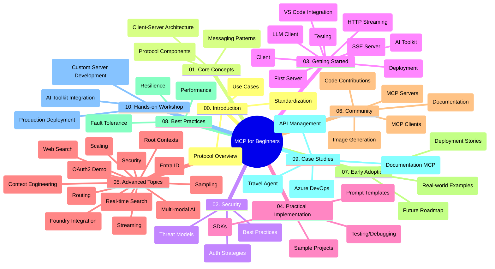

# Model Context Protocol (MCP) for Beginners - Study Guide

This study guide provides an overview of the repository structure and content for the "Model Context Protocol (MCP) for Beginners" curriculum. Use this guide to navigate the repository efficiently and make the most of the available resources.

## Repository Overview

The Model Context Protocol (MCP) is a standardized framework for interactions between AI models and client applications. Initially created by Anthropic, MCP is now maintained by the broader MCP community and the official GitHub organization. This repository provides a comprehensive curriculum with hands-on code examples in various programming languages, designed for AI developers, system architects, and software engineers.

## Visual Curriculum Map

## Repository Structure

The repository is organized into ten main sections, each focusing on different aspects of MCP:

1. **Introduction (00-Introduction/)**
   - Overview of the Model Context Protocol
   - Why standardization matters in AI pipelines
   - Practical use cases and benefits

2. **Core Concepts (01-CoreConcepts/)**
   - Client-server architecture
   - Key protocol components
   - Messaging patterns in MCP

3. **Security (02-Security/)**
   - Security threats in MCP-based systems
   - Best practices for securing implementations
   - Authentication and authorization strategies

4. **Getting Started (03-GettingStarted/)**
   - Environment setup and configuration
   - Creating basic MCP servers and clients
   - Integration with existing applications
   - Includes sections for:
     - First server implementation
     - Client development
     - LLM client integration
     - VS Code integration
     - Server-Sent Events (SSE) server
     - HTTP streaming
     - AI Toolkit integration
     - Testing strategies
     - Deployment guidelines

5. **Practical Implementation (04-PracticalImplementation/)**
   - Using SDKs across different programming languages
   - Debugging, testing, and validation techniques
   - Crafting reusable prompt templates and workflows
   - Sample projects with implementation examples

6. **Advanced Topics (05-AdvancedTopics/)**
   - Context engineering techniques
   - Foundry agent integration
   - Multi-modal AI workflows 
   - OAuth2 authentication demos
   - Real-time search capabilities
   - Real-time streaming
   - Root contexts implementation
   - Routing strategies
   - Sampling techniques
   - Scaling approaches
   - Security considerations
   - Entra ID security integration
   - Web search integration

7. **Community Contributions (06-CommunityContributions/)**
   - How to contribute code and documentation
   - Collaborating via GitHub
   - Community-driven enhancements and feedback
   - Using various MCP clients (Claude Desktop, Cline, VSCode)
   - Working with popular MCP servers including image generation

8. **Lessons from Early Adoption (07-LessonsfromEarlyAdoption/)**
   - Real-world implementations and success stories
   - Building and deploying MCP-based solutions
   - Trends and future roadmap

9. **Best Practices (08-BestPractices/)**
   - Performance tuning and optimization
   - Designing fault-tolerant MCP systems
   - Testing and resilience strategies

10. **Case Studies (09-CaseStudy/)**
    - Case study: Azure API Management integration
    - Case study: Travel agent implementation
    - Case study: Azure DevOps integration with YouTube
    - Implementation examples with detailed documentation

11. **Hands-on Workshop (10-StreamliningAIWorkflowsBuildingAnMCPServerWithAIToolkit/)**
    - Comprehensive hands-on workshop combining MCP with AI Toolkit
    - Building intelligent applications bridging AI models with real-world tools
    - Practical modules covering fundamentals, custom server development, and production deployment strategies
    - Lab-based learning approach with step-by-step instructions

## Additional Resources

The repository includes supporting resources:

- **Images folder**: Contains diagrams and illustrations used throughout the curriculum
- **Translations**: Multi-language support with automated translations of documentation
- **Official MCP Resources**:
  - [MCP Documentation](https://modelcontextprotocol.io/)
  - [MCP Specification](https://spec.modelcontextprotocol.io/)
  - [MCP GitHub Repository](https://github.com/modelcontextprotocol)

## How to Use This Repository

1. **Sequential Learning**: Follow the chapters in order (00 through 10) for a structured learning experience.
2. **Language-Specific Focus**: If you're interested in a particular programming language, explore the samples directories for implementations in your preferred language.
3. **Practical Implementation**: Start with the "Getting Started" section to set up your environment and create your first MCP server and client.
4. **Advanced Exploration**: Once comfortable with the basics, dive into the advanced topics to expand your knowledge.
5. **Community Engagement**: Join the MCP community through GitHub discussions and Discord channels to connect with experts and fellow developers.

## MCP Clients and Tools

The curriculum covers various MCP clients and tools:

1. **Official Clients**:
   - Claude Desktop
   - Claude in VSCode 
   - Claude API

2. **Community Clients**:
   - Cline (terminal-based)
   - Cursor (code editor)
   - ChatMCP
   - Windsurf

3. **MCP Management Tools**:
   - MCP CLI
   - MCP Manager
   - MCP Linker
   - MCP Router

## Popular MCP Servers

The repository introduces various MCP servers, including:

1. **Official Reference Servers**:
   - Filesystem
   - Fetch
   - Memory
   - Sequential Thinking

2. **Image Generation**:
   - Azure OpenAI DALL-E 3
   - Stable Diffusion WebUI
   - Replicate

3. **Development Tools**:
   - Git MCP
   - Terminal Control
   - Code Assistant

4. **Specialized Servers**:
   - Salesforce
   - Microsoft Teams
   - Jira & Confluence

## Contributing

This repository welcomes contributions from the community. See the Community Contributions section for guidance on how to contribute effectively to the MCP ecosystem.

## Changelog

| Date | Changes |
|------|---------|
| July 16, 2025 | - Updated repository structure to reflect current content - Added MCP Clients and Tools section - Added Popular MCP Servers section - Updated Visual Curriculum Map with all current topics - Enhanced Advanced Topics section with all specialized areas - Updated Case Studies to reflect actual examples - Clarified MCP origin as created by Anthropic |
| June 11, 2025 | - Initial creation of the study guide - Added Visual Curriculum Map - Outlined repository structure - Included sample projects and additional resources |

---

*This study guide was updated on July 16, 2025, and provides an overview of the repository as of that date. Repository content may be updated after this date.*
