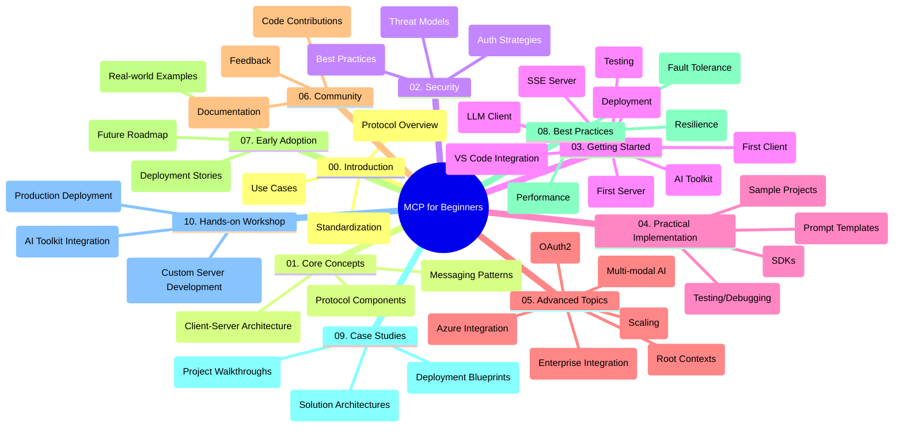

# Model Context Protocol (MCP) for Beginners - Study Guide

This study guide provides an overview of the repository structure and content for the "Model Context Protocol (MCP) for Beginners" curriculum. Use this guide to navigate the repository efficiently and make the most of the available resources.

## Repository Overview

The Model Context Protocol (MCP) is a standardized framework for interactions between AI models and client applications. This repository provides a comprehensive curriculum with hands-on code examples in C#, Java, JavaScript, Python, and TypeScript, designed for AI developers, system architects, and software engineers.

## Visual Curriculum Map

## Repository Structure

The repository is organized into ten main sections, each focusing on different aspects of MCP:

1. **Introduction (00-Introduction/)**
   - Overview of the Model Context Protocol
   - Why standardization matters in AI pipelines
   - Practical use cases and benefits

2. **Core Concepts (01-CoreConcepts/)**
   - Client-server architecture
   - Key protocol components
   - Messaging patterns in MCP

3. **Security (02-Security/)**
   - Security threats in MCP-based systems
   - Best practices for securing implementations
   - Authentication and authorization strategies

4. **Getting Started (03-GettingStarted/)**
   - Environment setup and configuration
   - Creating basic MCP servers and clients
   - Integration with existing applications
   - Subsections for first server, first client, LLM client, VS Code integration, SSE server, AI Toolkit, testing, and deployment

5. **Practical Implementation (04-PracticalImplementation/)**
   - Using SDKs across different programming languages
   - Debugging, testing, and validation techniques
   - Crafting reusable prompt templates and workflows
   - Sample projects with implementation examples

6. **Advanced Topics (05-AdvancedTopics/)**
   - Multi-modal AI workflows and extensibility
   - Secure scaling strategies
   - MCP in enterprise ecosystems
   - Specialized topics including Azure integration, multi-modality, OAuth2, root contexts, routing, sampling, scaling, security, web search integration, and streaming.

7. **Community Contributions (06-CommunityContributions/)**
   - How to contribute code and documentation
   - Collaborating via GitHub
   - Community-driven enhancements and feedback

8. **Lessons from Early Adoption (07-LessonsfromEarlyAdoption/)**
   - Real-world implementations and success stories
   - Building and deploying MCP-based solutions
   - Trends and future roadmap

9. **Best Practices (08-BestPractices/)**
   - Performance tuning and optimization
   - Designing fault-tolerant MCP systems
   - Testing and resilience strategies

10. **Case Studies (09-CaseStudy/)**
    - Deep-dives into MCP solution architectures
    - Deployment blueprints and integration tips
    - Annotated diagrams and project walkthroughs

11. **Hands-on Workshop (10-StreamliningAIWorkflowsBuildingAnMCPServerWithAIToolkit/)**
    - Comprehensive hands-on workshop combining MCP with Microsoft's AI Toolkit for VS Code
    - Building intelligent applications bridging AI models with real-world tools
    - Practical modules covering fundamentals, custom server development, and production deployment strategies

## Sample Projects

The repository includes multiple sample projects that demonstrate MCP implementation across different programming languages:

### Basic MCP Calculator Samples
- C# MCP Server Example
- Java MCP Calculator
- JavaScript MCP Demo
- Python MCP Server
- TypeScript MCP Example

### Advanced MCP Calculator Projects
- Advanced C# Sample
- Java Container App Example
- JavaScript Advanced Sample
- Python Complex Implementation
- TypeScript Container Sample

## Additional Resources

The repository includes supporting resources:

- **Images folder**: Contains diagrams and illustrations used throughout the curriculum
- **Translations**: Multi-language support with automated translations of documentation
- **Official MCP Resources**:
  - [MCP Documentation](https://modelcontextprotocol.io/)
  - [MCP Specification](https://spec.modelcontextprotocol.io/)
  - [MCP GitHub Repository](https://github.com/modelcontextprotocol)

## How to Use This Repository

1. **Sequential Learning**: Follow the chapters in order (00 through 10) for a structured learning experience.
2. **Language-Specific Focus**: If you're interested in a particular programming language, explore the samples directories for implementations in your preferred language.
3. **Practical Implementation**: Start with the "Getting Started" section to set up your environment and create your first MCP server and client.
4. **Advanced Exploration**: Once comfortable with the basics, dive into the advanced topics to expand your knowledge.
5. **Community Engagement**: Join the [Azure AI Foundry Discord](https://discord.com/invite/ByRwuEEgH4) to connect with experts and fellow developers.

## Contributing

This repository welcomes contributions from the community. See the Community Contributions section for guidance on how to contribute.

---

*This study guide was created on June 11, 2025, and provides an overview of the repository as of that date. Repository content may have been updated since then.*
