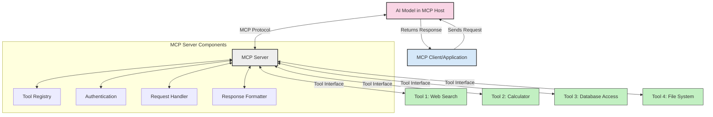
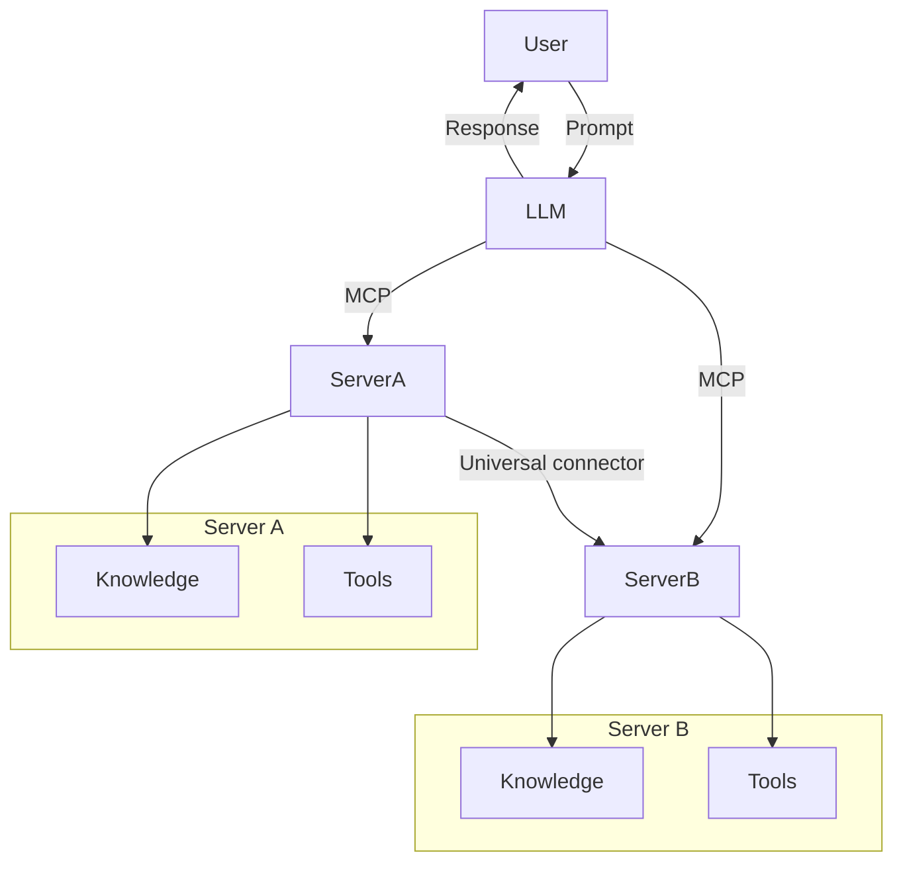

<!--
CO_OP_TRANSLATOR_METADATA:
{
  "original_hash": "1d88dee994dcbb3fa52c271d0c0817b5",
  "translation_date": "2025-05-20T20:19:25+00:00",
  "source_file": "00-Introduction/README.md",
  "language_code": "ar"
}
-->
# مقدمة في بروتوكول سياق النموذج (MCP): لماذا هو مهم لتطبيقات الذكاء الاصطناعي القابلة للتوسع

تُعد تطبيقات الذكاء الاصطناعي التوليدي خطوة كبيرة إلى الأمام لأنها غالبًا ما تتيح للمستخدم التفاعل مع التطبيق باستخدام تعليمات بلغة طبيعية. ومع ذلك، مع استثمار المزيد من الوقت والموارد في هذه التطبيقات، ترغب في التأكد من إمكانية دمج الوظائف والموارد بسهولة بطريقة تسهل التوسع، وأن تطبيقك يمكنه التعامل مع أكثر من نموذج واحد مستخدم، ومعالجة تعقيدات النماذج المختلفة. باختصار، بناء تطبيقات الذكاء الاصطناعي التوليدي سهل في البداية، ولكن مع نموها وتعقيدها، تحتاج إلى البدء في تحديد بنية وستحتاج على الأرجح إلى الاعتماد على معيار لضمان بناء تطبيقاتك بطريقة متسقة. هنا يأتي دور MCP لتنظيم الأمور وتوفير معيار.

---

## **🔍 ما هو بروتوكول سياق النموذج (MCP)؟**

بروتوكول سياق النموذج (MCP) هو **واجهة مفتوحة وموحدة** تتيح لنماذج اللغة الكبيرة (LLMs) التفاعل بسلاسة مع الأدوات الخارجية وواجهات برمجة التطبيقات ومصادر البيانات. يوفر بنية متسقة لتعزيز وظائف نموذج الذكاء الاصطناعي خارج بيانات تدريبه، مما يمكّن أنظمة ذكاء اصطناعي أكثر ذكاءً وقابلية للتوسع واستجابة أفضل.

---

## **🎯 لماذا تهم المعايير في الذكاء الاصطناعي**

مع تعقيد تطبيقات الذكاء الاصطناعي التوليدي، من الضروري اعتماد معايير تضمن **القابلية للتوسع، والتمديد، والصيانة**. يعالج MCP هذه الاحتياجات من خلال:

- توحيد تكاملات النماذج مع الأدوات  
- تقليل الحلول المخصصة الهشة والمؤقتة  
- السماح بتعايش نماذج متعددة ضمن نظام بيئي واحد  

---

## **📚 أهداف التعلم**

بحلول نهاية هذا المقال، ستكون قادرًا على:

- تعريف بروتوكول سياق النموذج (MCP) وحالات استخدامه  
- فهم كيف يقوم MCP بتوحيد التواصل بين النموذج والأداة  
- تحديد المكونات الأساسية لبنية MCP  
- استكشاف تطبيقات MCP في سياقات المؤسسات والتطوير  

---

## **💡 لماذا يُعد بروتوكول سياق النموذج (MCP) مغيرًا لقواعد اللعبة**

### **🔗 MCP يحل مشكلة التجزئة في تفاعلات الذكاء الاصطناعي**

قبل MCP، كان دمج النماذج مع الأدوات يتطلب:

- كود مخصص لكل زوج أداة-نموذج  
- واجهات برمجة تطبيقات غير موحدة لكل بائع  
- توقفات متكررة بسبب التحديثات  
- ضعف القابلية للتوسع مع زيادة الأدوات  

### **✅ فوائد توحيد MCP**

| **الفائدة**              | **الوصف**                                                                |
|--------------------------|-------------------------------------------------------------------------|
| التوافق التشغيلي         | تعمل نماذج اللغة الكبيرة بسلاسة مع أدوات من بائعين مختلفين              |
| الاتساق                  | سلوك موحد عبر المنصات والأدوات                                           |
| إعادة الاستخدام          | يمكن استخدام الأدوات المبنية مرة واحدة عبر مشاريع وأنظمة متعددة        |
| تسريع التطوير            | تقليل وقت التطوير باستخدام واجهات موحدة وجاهزة للتوصيل                  |

---

## **🧱 نظرة عامة على بنية MCP عالية المستوى**

يتبع MCP نموذج **العميل-الخادم**، حيث:

- **مضيفو MCP** يشغلون نماذج الذكاء الاصطناعي  
- **عملاء MCP** يبدؤون الطلبات  
- **خوادم MCP** تقدم السياق والأدوات والقدرات  

### **المكونات الرئيسية:**

- **الموارد** – بيانات ثابتة أو ديناميكية للنماذج  
- **التعليمات** – سير عمل معرف مسبقًا للتوليد الموجه  
- **الأدوات** – وظائف قابلة للتنفيذ مثل البحث والحسابات  
- **العينة** – سلوك وكيل عبر تفاعلات متكررة  

---

## كيف تعمل خوادم MCP

تعمل خوادم MCP على النحو التالي:

- **تدفق الطلبات**:  
    1. يرسل عميل MCP طلبًا إلى نموذج الذكاء الاصطناعي المشغل في مضيف MCP.  
    2. يحدد نموذج الذكاء الاصطناعي متى يحتاج إلى أدوات أو بيانات خارجية.  
    3. يتواصل النموذج مع خادم MCP باستخدام البروتوكول الموحد.  

- **وظائف خادم MCP**:  
    - سجل الأدوات: يحتفظ بفهرس للأدوات المتاحة وقدراتها.  
    - المصادقة: يتحقق من أذونات الوصول إلى الأدوات.  
    - معالج الطلبات: يعالج طلبات الأدوات الواردة من النموذج.  
    - منسق الاستجابات: ينظم مخرجات الأدوات بصيغة يفهمها النموذج.  

- **تنفيذ الأدوات**:  
    - يقوم الخادم بتوجيه الطلبات إلى الأدوات الخارجية المناسبة  
    - تنفذ الأدوات وظائفها المتخصصة (بحث، حسابات، استعلامات قاعدة بيانات، إلخ)  
    - تُعاد النتائج إلى النموذج بصيغة موحدة  

- **إكمال الاستجابة**:  
    - يدمج نموذج الذكاء الاصطناعي مخرجات الأدوات في استجابته  
    - تُرسل الاستجابة النهائية مرة أخرى إلى تطبيق العميل  

## 👨‍💻 كيفية بناء خادم MCP (مع أمثلة)

تتيح خوادم MCP لك توسيع قدرات نماذج اللغة الكبيرة من خلال توفير البيانات والوظائف.

هل أنت مستعد لتجربتها؟ إليك أمثلة لإنشاء خادم MCP بسيط بلغات مختلفة:

- **مثال بايثون**: https://github.com/modelcontextprotocol/python-sdk

- **مثال تايب سكريبت**: https://github.com/modelcontextprotocol/typescript-sdk

- **مثال جافا**: https://github.com/modelcontextprotocol/java-sdk

- **مثال C#/.NET**: https://github.com/modelcontextprotocol/csharp-sdk

## 🌍 حالات الاستخدام الواقعية لـ MCP

يمكن MCP من مجموعة واسعة من التطبيقات من خلال توسيع قدرات الذكاء الاصطناعي:

| **التطبيق**               | **الوصف**                                                                |
|----------------------------|-------------------------------------------------------------------------|
| تكامل بيانات المؤسسات      | ربط نماذج اللغة الكبيرة بقواعد البيانات، نظم إدارة علاقات العملاء، أو الأدوات الداخلية  |
| أنظمة الذكاء الاصطناعي الوكيلة | تمكين الوكلاء المستقلين من الوصول إلى الأدوات وسير العمل لاتخاذ القرارات         |
| التطبيقات متعددة الوسائط    | دمج أدوات النص، الصورة، والصوت ضمن تطبيق ذكاء اصطناعي موحد واحد              |
| تكامل البيانات في الوقت الحقيقي | جلب البيانات الحية إلى تفاعلات الذكاء الاصطناعي للحصول على مخرجات أكثر دقة وحداثة |

### 🧠 MCP = المعيار العالمي لتفاعلات الذكاء الاصطناعي

يعمل بروتوكول سياق النموذج (MCP) كمعيار عالمي لتفاعلات الذكاء الاصطناعي، تمامًا كما وحد USB-C الاتصالات الفيزيائية للأجهزة. في عالم الذكاء الاصطناعي، يوفر MCP واجهة متسقة، تتيح للنماذج (العملاء) التكامل بسلاسة مع الأدوات ومزودي البيانات الخارجيين (الخوادم). هذا يلغي الحاجة إلى بروتوكولات مخصصة ومختلفة لكل واجهة برمجة تطبيقات أو مصدر بيانات.

تتبع أداة متوافقة مع MCP (المشار إليها كخادم MCP) معيارًا موحدًا. يمكن لهذه الخوادم سرد الأدوات أو الإجراءات التي تقدمها وتنفيذ تلك الإجراءات عند طلب وكيل الذكاء الاصطناعي. منصات وكلاء الذكاء الاصطناعي التي تدعم MCP قادرة على اكتشاف الأدوات المتاحة من الخوادم واستدعائها عبر هذا البروتوكول القياسي.

### 💡 يسهل الوصول إلى المعرفة

بجانب تقديم الأدوات، يسهل MCP أيضًا الوصول إلى المعرفة. يمكّن التطبيقات من توفير سياق لنماذج اللغة الكبيرة (LLMs) من خلال ربطها بمصادر بيانات متنوعة. على سبيل المثال، قد يمثل خادم MCP مستودع مستندات شركة، مما يسمح للوكلاء باسترجاع المعلومات ذات الصلة عند الطلب. قد يتعامل خادم آخر مع إجراءات محددة مثل إرسال البريد الإلكتروني أو تحديث السجلات. من منظور الوكيل، هذه ببساطة أدوات يمكنه استخدامها—بعض الأدوات تعيد بيانات (سياق المعرفة)، بينما تؤدي أخرى إجراءات. يدير MCP كلا الحالتين بكفاءة.

يتعلم الوكيل المتصل بخادم MCP تلقائيًا القدرات والبيانات المتاحة للخادم من خلال صيغة معيارية. تتيح هذه المعايير توفر الأدوات بشكل ديناميكي. على سبيل المثال، إضافة خادم MCP جديد إلى نظام الوكيل يجعل وظائفه قابلة للاستخدام فورًا دون الحاجة إلى تخصيص إضافي لتعليمات الوكيل.

يتماشى هذا التكامل المبسط مع التدفق الموضح في مخطط mermaid، حيث توفر الخوادم كل من الأدوات والمعرفة، مما يضمن تعاونًا سلسًا عبر الأنظمة.

### 👉 مثال: حل وكيل قابل للتوسع

## 🔐 الفوائد العملية لـ MCP

إليك الفوائد العملية لاستخدام MCP:

- **الحداثة**: يمكن للنماذج الوصول إلى معلومات محدثة تتجاوز بيانات تدريبها  
- **تمديد القدرات**: يمكن للنماذج الاستفادة من أدوات متخصصة لمهام لم تُدرّب عليها  
- **تقليل الهلوسة**: توفر مصادر البيانات الخارجية أساسًا واقعيًا  
- **الخصوصية**: يمكن أن تبقى البيانات الحساسة ضمن بيئات آمنة بدلاً من تضمينها في التعليمات  

## 📌 النقاط الرئيسية

فيما يلي النقاط الرئيسية لاستخدام MCP:

- **MCP** يوحد طريقة تفاعل نماذج الذكاء الاصطناعي مع الأدوات والبيانات  
- يعزز **التمديد، الاتساق، والتوافق التشغيلي**  
- يساعد MCP على **تقليل وقت التطوير، تحسين الاعتمادية، وتوسيع قدرات النموذج**  
- تتيح بنية العميل-الخادم **تطبيقات ذكاء اصطناعي مرنة وقابلة للتمديد**  

## 🧠 تمرين

فكر في تطبيق ذكاء اصطناعي ترغب في بنائه.

- ما هي **الأدوات أو البيانات الخارجية** التي يمكن أن تعزز قدراته؟  
- كيف يمكن لـ MCP جعل التكامل **أبسط وأكثر موثوقية**؟  

## موارد إضافية

- [مستودع MCP على GitHub](https://github.com/modelcontextprotocol)

## ما التالي

التالي: [الفصل 1: المفاهيم الأساسية](/01-CoreConcepts/README.md)

**إخلاء المسؤولية**:  
تمت ترجمة هذا المستند باستخدام خدمة الترجمة الآلية [Co-op Translator](https://github.com/Azure/co-op-translator). بينما نسعى لتحقيق الدقة، يرجى العلم أن الترجمات الآلية قد تحتوي على أخطاء أو عدم دقة. يجب اعتبار المستند الأصلي بلغته الأصلية المصدر المعتمد. للمعلومات الهامة، يُنصح بالترجمة المهنية البشرية. نحن غير مسؤولين عن أي سوء فهم أو تفسير ناتج عن استخدام هذه الترجمة.