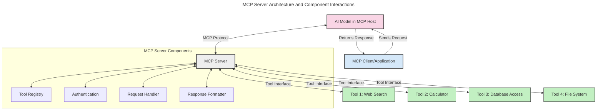
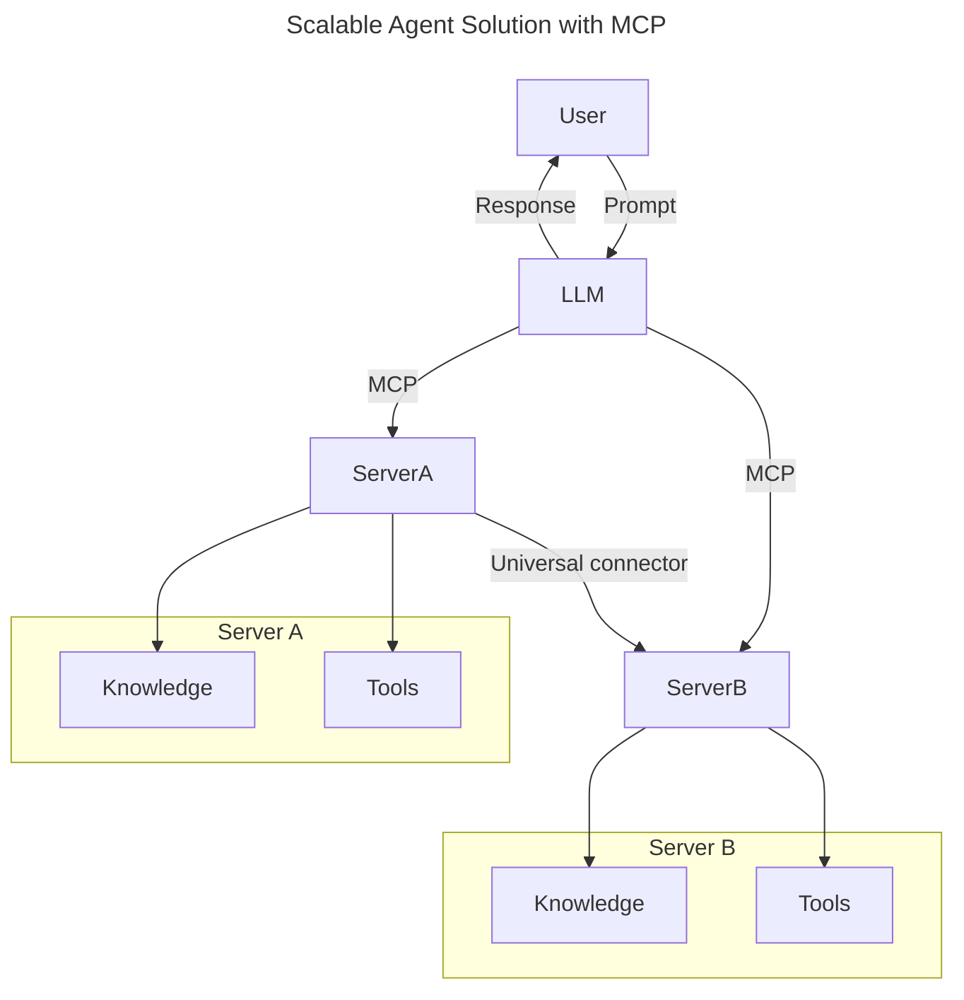
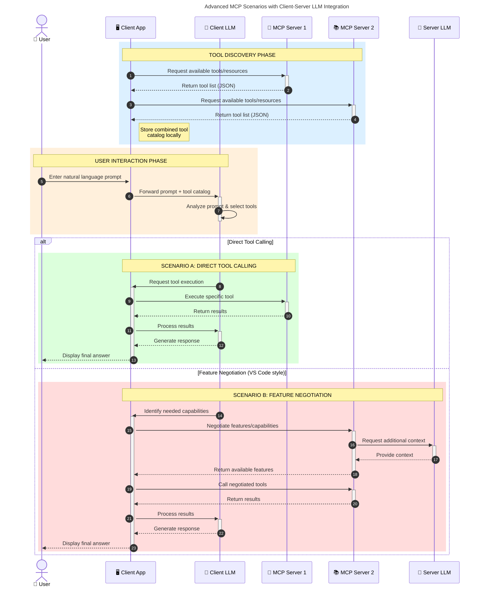

<!--
CO_OP_TRANSLATOR_METADATA:
{
  "original_hash": "105c2ddbb77bc38f7e9df009e1b06e45",
  "translation_date": "2025-07-13T15:26:10+00:00",
  "source_file": "00-Introduction/README.md",
  "language_code": "ar"
}
-->
# مقدمة في بروتوكول سياق النموذج (MCP): لماذا هو مهم لتطبيقات الذكاء الاصطناعي القابلة للتوسع

تُعد تطبيقات الذكاء الاصطناعي التوليدية خطوة كبيرة إلى الأمام لأنها غالبًا ما تتيح للمستخدم التفاعل مع التطبيق باستخدام أوامر لغة طبيعية. ومع ذلك، مع استثمار المزيد من الوقت والموارد في هذه التطبيقات، ترغب في التأكد من إمكانية دمج الوظائف والموارد بسهولة بطريقة تسهل التوسع، بحيث يمكن لتطبيقك دعم أكثر من نموذج واحد والتعامل مع تعقيدات النماذج المختلفة. باختصار، بناء تطبيقات الذكاء الاصطناعي التوليدية سهل في البداية، ولكن مع نموها وتعقيدها، تحتاج إلى البدء في تحديد بنية وستحتاج على الأرجح إلى الاعتماد على معيار لضمان بناء تطبيقاتك بطريقة متسقة. هنا يأتي دور MCP لتنظيم الأمور وتوفير معيار.

---

## **🔍 ما هو بروتوكول سياق النموذج (MCP)؟**

بروتوكول سياق النموذج (MCP) هو **واجهة مفتوحة وموحدة** تتيح لنماذج اللغة الكبيرة (LLMs) التفاعل بسلاسة مع الأدوات الخارجية وواجهات برمجة التطبيقات ومصادر البيانات. يوفر بنية متسقة لتعزيز وظائف نماذج الذكاء الاصطناعي بما يتجاوز بيانات التدريب، مما يمكّن أنظمة ذكاء اصطناعي أكثر ذكاءً وقابلية للتوسع واستجابة.

---

## **🎯 لماذا تعتبر المعايير مهمة في الذكاء الاصطناعي**

مع تعقيد تطبيقات الذكاء الاصطناعي التوليدية، من الضروري اعتماد معايير تضمن **القابلية للتوسع، والتمديد، والصيانة**. يعالج MCP هذه الاحتياجات من خلال:

- توحيد تكامل النماذج مع الأدوات
- تقليل الحلول المخصصة الهشة والفردية
- السماح بتعايش نماذج متعددة ضمن نظام بيئي واحد

---

## **📚 أهداف التعلم**

بنهاية هذا المقال، ستكون قادرًا على:

- تعريف **بروتوكول سياق النموذج (MCP)** وحالات استخدامه
- فهم كيف يقوم MCP بتوحيد التواصل بين النموذج والأداة
- التعرف على المكونات الأساسية لبنية MCP
- استكشاف تطبيقات MCP في سياقات المؤسسات والتطوير

---

## **💡 لماذا يعتبر بروتوكول سياق النموذج (MCP) نقطة تحول**

### **🔗 MCP يحل مشكلة التشتت في تفاعلات الذكاء الاصطناعي**

قبل MCP، كان دمج النماذج مع الأدوات يتطلب:

- كود مخصص لكل زوج أداة-نموذج
- واجهات برمجة تطبيقات غير موحدة لكل مزود
- انقطاعات متكررة بسبب التحديثات
- ضعف القابلية للتوسع مع زيادة الأدوات

### **✅ فوائد توحيد MCP**

| **الفائدة**              | **الوصف**                                                                |
|--------------------------|-------------------------------------------------------------------------|
| التوافقية               | تعمل نماذج اللغة الكبيرة بسلاسة مع أدوات من مزودين مختلفين              |
| الاتساق                 | سلوك موحد عبر المنصات والأدوات                                          |
| إعادة الاستخدام         | يمكن استخدام الأدوات المبنية مرة واحدة عبر مشاريع وأنظمة متعددة        |
| تسريع التطوير           | تقليل وقت التطوير باستخدام واجهات موحدة قابلة للتوصيل والتشغيل          |

---

## **🧱 نظرة عامة على بنية MCP على مستوى عالٍ**

يتبع MCP نموذج **العميل-الخادم**، حيث:

- **مضيفو MCP** يشغلون نماذج الذكاء الاصطناعي
- **عملاء MCP** يبدؤون الطلبات
- **خوادم MCP** تقدم السياق، الأدوات، والقدرات

### **المكونات الرئيسية:**

- **الموارد** – بيانات ثابتة أو ديناميكية للنماذج  
- **المطالبات** – سير عمل محدد مسبقًا للتوليد الموجه  
- **الأدوات** – وظائف قابلة للتنفيذ مثل البحث، الحسابات  
- **العينة** – سلوك وكيل عبر تفاعلات متكررة

---

## كيف تعمل خوادم MCP

تعمل خوادم MCP بالطريقة التالية:

- **تدفق الطلب**:  
    1. يرسل عميل MCP طلبًا إلى نموذج الذكاء الاصطناعي الذي يعمل في مضيف MCP.  
    2. يحدد النموذج متى يحتاج إلى أدوات أو بيانات خارجية.  
    3. يتواصل النموذج مع خادم MCP باستخدام البروتوكول الموحد.

- **وظائف خادم MCP**:  
    - سجل الأدوات: يحتفظ بفهرس الأدوات المتاحة وقدراتها.  
    - المصادقة: يتحقق من الأذونات للوصول إلى الأدوات.  
    - معالج الطلبات: يعالج طلبات الأدوات الواردة من النموذج.  
    - منسق الاستجابة: ينظم مخرجات الأدوات بصيغة يفهمها النموذج.

- **تنفيذ الأدوات**:  
    - يوجه الخادم الطلبات إلى الأدوات الخارجية المناسبة  
    - تنفذ الأدوات وظائفها المتخصصة (بحث، حساب، استعلامات قاعدة بيانات، إلخ)  
    - تُعاد النتائج إلى النموذج بصيغة موحدة.

- **إكمال الاستجابة**:  
    - يدمج نموذج الذكاء الاصطناعي مخرجات الأدوات في استجابته.  
    - تُرسل الاستجابة النهائية إلى تطبيق العميل.

## 👨‍💻 كيفية بناء خادم MCP (مع أمثلة)

تتيح خوادم MCP توسيع قدرات نماذج اللغة الكبيرة من خلال توفير البيانات والوظائف.

هل أنت مستعد لتجربته؟ إليك أمثلة لإنشاء خادم MCP بسيط بلغات مختلفة:

- **مثال بايثون**: https://github.com/modelcontextprotocol/python-sdk

- **مثال TypeScript**: https://github.com/modelcontextprotocol/typescript-sdk

- **مثال جافا**: https://github.com/modelcontextprotocol/java-sdk

- **مثال C#/.NET**: https://github.com/modelcontextprotocol/csharp-sdk

## 🌍 حالات استخدام MCP في العالم الحقيقي

يمكن MCP من مجموعة واسعة من التطبيقات من خلال توسيع قدرات الذكاء الاصطناعي:

| **التطبيق**                | **الوصف**                                                                |
|----------------------------|-------------------------------------------------------------------------|
| تكامل بيانات المؤسسات     | ربط نماذج اللغة الكبيرة بقواعد البيانات، أنظمة إدارة علاقات العملاء، أو الأدوات الداخلية |
| أنظمة الذكاء الاصطناعي الوكيلة | تمكين الوكلاء المستقلين من الوصول إلى الأدوات وسير عمل اتخاذ القرار    |
| التطبيقات متعددة الوسائط   | دمج أدوات النص، الصورة، والصوت ضمن تطبيق ذكاء اصطناعي موحد             |
| تكامل البيانات في الوقت الحقيقي | جلب البيانات الحية إلى تفاعلات الذكاء الاصطناعي للحصول على مخرجات أكثر دقة وحداثة |

### 🧠 MCP = المعيار العالمي لتفاعلات الذكاء الاصطناعي

يعمل بروتوكول سياق النموذج (MCP) كمعيار عالمي لتفاعلات الذكاء الاصطناعي، تمامًا كما وحد USB-C الاتصالات الفيزيائية للأجهزة. في عالم الذكاء الاصطناعي، يوفر MCP واجهة متسقة تتيح للنماذج (العملاء) التكامل بسلاسة مع الأدوات الخارجية ومزودي البيانات (الخوادم). هذا يلغي الحاجة إلى بروتوكولات مخصصة ومتنوعة لكل واجهة برمجة تطبيقات أو مصدر بيانات.

تتبع الأداة المتوافقة مع MCP (المشار إليها كخادم MCP) معيارًا موحدًا. يمكن لهذه الخوادم سرد الأدوات أو الإجراءات التي تقدمها وتنفيذها عند طلب وكيل الذكاء الاصطناعي. يمكن لمنصات الوكلاء التي تدعم MCP اكتشاف الأدوات المتاحة من الخوادم واستدعائها عبر هذا البروتوكول الموحد.

### 💡 يسهل الوصول إلى المعرفة

إلى جانب توفير الأدوات، يسهل MCP أيضًا الوصول إلى المعرفة. يمكّن التطبيقات من توفير سياق لنماذج اللغة الكبيرة (LLMs) من خلال ربطها بمصادر بيانات مختلفة. على سبيل المثال، قد يمثل خادم MCP مستودع مستندات شركة، مما يسمح للوكلاء باسترجاع المعلومات ذات الصلة عند الطلب. قد يتولى خادم آخر مهام محددة مثل إرسال البريد الإلكتروني أو تحديث السجلات. من منظور الوكيل، هذه مجرد أدوات يمكنه استخدامها—بعض الأدوات تعيد بيانات (سياق المعرفة)، بينما تقوم أخرى بأداء إجراءات. يدير MCP كلا الحالتين بكفاءة.

يتعلم الوكيل المتصل بخادم MCP تلقائيًا القدرات المتاحة والبيانات التي يمكن الوصول إليها من خلال صيغة معيارية. تتيح هذه المعايير توفر الأدوات بشكل ديناميكي. على سبيل المثال، إضافة خادم MCP جديد إلى نظام الوكيل يجعل وظائفه قابلة للاستخدام فورًا دون الحاجة إلى تخصيص إضافي لتعليمات الوكيل.

يتماشى هذا التكامل السلس مع التدفق الموضح في مخطط mermaid، حيث توفر الخوادم الأدوات والمعرفة، مما يضمن تعاونًا سلسًا عبر الأنظمة.

### 👉 مثال: حل وكيل قابل للتوسع

### 🔄 سيناريوهات MCP المتقدمة مع تكامل LLM على جانب العميل

بعيدًا عن بنية MCP الأساسية، هناك سيناريوهات متقدمة حيث يحتوي كل من العميل والخادم على نماذج لغة كبيرة، مما يتيح تفاعلات أكثر تعقيدًا:

## 🔐 الفوائد العملية لـ MCP

فيما يلي الفوائد العملية لاستخدام MCP:

- **التحديث**: يمكن للنماذج الوصول إلى معلومات حديثة تتجاوز بيانات التدريب  
- **توسيع القدرات**: يمكن للنماذج الاستفادة من أدوات متخصصة لمهام لم يتم تدريبها عليها  
- **تقليل الهلوسة**: توفر مصادر البيانات الخارجية أساسًا واقعيًا  
- **الخصوصية**: يمكن أن تبقى البيانات الحساسة داخل بيئات آمنة بدلاً من تضمينها في المطالبات

## 📌 النقاط الرئيسية

فيما يلي النقاط الرئيسية لاستخدام MCP:

- **MCP** يوحد طريقة تفاعل نماذج الذكاء الاصطناعي مع الأدوات والبيانات  
- يعزز **التمديد، الاتساق، والتوافقية**  
- يساعد MCP في **تقليل وقت التطوير، تحسين الموثوقية، وتوسيع قدرات النموذج**  
- تتيح بنية العميل-الخادم **تطبيقات ذكاء اصطناعي مرنة وقابلة للتوسع**

## 🧠 تمرين

فكر في تطبيق ذكاء اصطناعي ترغب في بنائه.

- ما هي **الأدوات أو البيانات الخارجية** التي يمكن أن تعزز قدراته؟  
- كيف يمكن لـ MCP أن يجعل التكامل **أسهل وأكثر موثوقية**؟

## موارد إضافية

- [مستودع MCP على GitHub](https://github.com/modelcontextprotocol)

## ما التالي

التالي: [الفصل 1: المفاهيم الأساسية](../01-CoreConcepts/README.md)

**إخلاء المسؤولية**:  
تمت ترجمة هذا المستند باستخدام خدمة الترجمة الآلية [Co-op Translator](https://github.com/Azure/co-op-translator). بينما نسعى لتحقيق الدقة، يرجى العلم أن الترجمات الآلية قد تحتوي على أخطاء أو عدم دقة. يجب اعتبار المستند الأصلي بلغته الأصلية المصدر الموثوق به. للمعلومات الهامة، يُنصح بالترجمة البشرية المهنية. نحن غير مسؤولين عن أي سوء فهم أو تفسير ناتج عن استخدام هذه الترجمة.