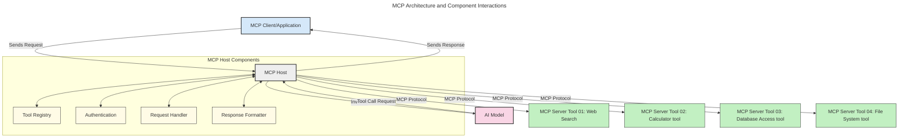
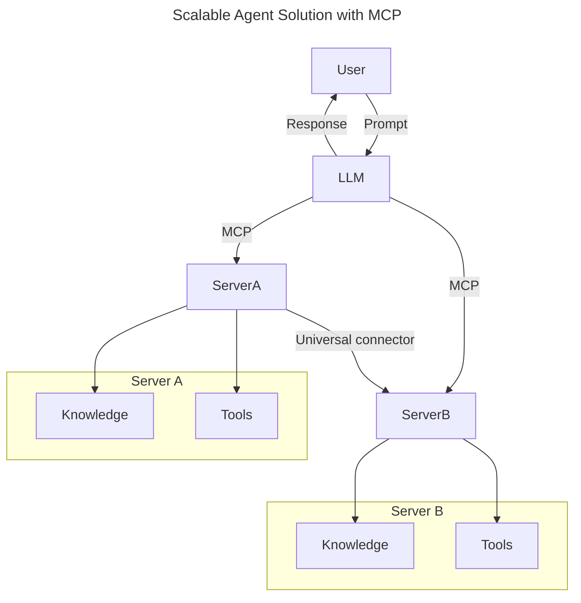
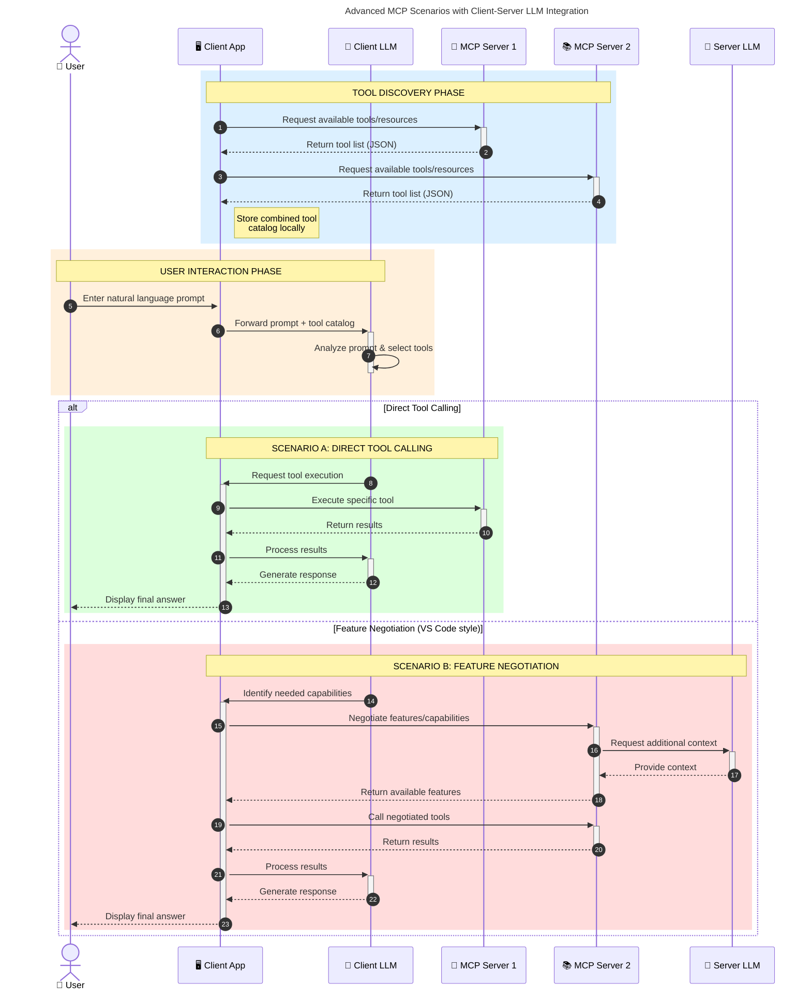

<!--
CO_OP_TRANSLATOR_METADATA:
{
  "original_hash": "0df1ee78a6dd8300f3a040ca5b411c2e",
  "translation_date": "2025-08-18T13:51:49+00:00",
  "source_file": "00-Introduction/README.md",
  "language_code": "ar"
}
-->
# مقدمة إلى بروتوكول سياق النموذج (MCP): لماذا هو مهم لتطبيقات الذكاء الاصطناعي القابلة للتوسع

_(انقر على الصورة أعلاه لمشاهدة فيديو الدرس)_

تُعتبر تطبيقات الذكاء الاصطناعي التوليدي خطوة كبيرة إلى الأمام لأنها غالبًا ما تتيح للمستخدم التفاعل مع التطبيق باستخدام مطالبات اللغة الطبيعية. ومع ذلك، مع زيادة الوقت والموارد المستثمرة في هذه التطبيقات، يجب التأكد من إمكانية دمج الوظائف والموارد بسهولة بطريقة تجعل التوسع سهلاً، وأن التطبيق يمكنه التعامل مع أكثر من نموذج واحد، ومعالجة تعقيدات النماذج المختلفة. باختصار، بناء تطبيقات الذكاء الاصطناعي التوليدي سهل في البداية، ولكن مع نموها وزيادة تعقيدها، ستحتاج إلى البدء في تحديد بنية وقد تحتاج إلى الاعتماد على معيار لضمان بناء التطبيقات بطريقة متسقة. هنا يأتي دور MCP لتنظيم الأمور وتوفير معيار.

---

## **🔍 ما هو بروتوكول سياق النموذج (MCP)؟**

**بروتوكول سياق النموذج (MCP)** هو **واجهة مفتوحة وموحدة** تتيح للنماذج اللغوية الكبيرة (LLMs) التفاعل بسلاسة مع الأدوات الخارجية وواجهات برمجة التطبيقات ومصادر البيانات. يوفر بنية متسقة لتعزيز وظائف نماذج الذكاء الاصطناعي بما يتجاوز بيانات التدريب الخاصة بها، مما يتيح أنظمة ذكاء اصطناعي أكثر ذكاءً وقابلية للتوسع واستجابة.

---

## **🎯 لماذا يهم التوحيد القياسي في الذكاء الاصطناعي**

مع تعقيد تطبيقات الذكاء الاصطناعي التوليدي، يصبح من الضروري اعتماد معايير تضمن **القابلية للتوسع، التمديد، الصيانة،** وتجنب **الاعتماد على مورد واحد**. يعالج MCP هذه الاحتياجات من خلال:

- توحيد تكامل النماذج مع الأدوات
- تقليل الحلول المخصصة الهشة
- السماح بتعايش نماذج متعددة من موردين مختلفين داخل نظام واحد

**ملاحظة:** على الرغم من أن MCP يقدم نفسه كمعيار مفتوح، لا توجد خطط لتوحيد MCP من خلال أي هيئات معايير قائمة مثل IEEE، IETF، W3C، ISO، أو أي هيئة معايير أخرى.

---

## **📚 أهداف التعلم**

بنهاية هذه المقالة، ستكون قادرًا على:

- تعريف **بروتوكول سياق النموذج (MCP)** واستخداماته
- فهم كيفية توحيد MCP للتواصل بين النموذج والأدوات
- التعرف على المكونات الأساسية لبنية MCP
- استكشاف تطبيقات MCP في سياقات المؤسسات والتطوير

---

## **💡 لماذا يعتبر بروتوكول سياق النموذج (MCP) نقطة تحول**

### **🔗 MCP يحل مشكلة التجزئة في تفاعلات الذكاء الاصطناعي**

قبل MCP، كان دمج النماذج مع الأدوات يتطلب:

- كود مخصص لكل زوج من الأدوات والنماذج
- واجهات برمجة تطبيقات غير موحدة لكل مورد
- انقطاعات متكررة بسبب التحديثات
- ضعف القابلية للتوسع مع زيادة الأدوات

### **✅ فوائد توحيد MCP**

| **الفائدة**              | **الوصف**                                                                |
|--------------------------|--------------------------------------------------------------------------------|
| التوافق                  | تعمل النماذج اللغوية الكبيرة بسلاسة مع الأدوات عبر موردين مختلفين                       |
| الاتساق                  | سلوك موحد عبر المنصات والأدوات                                                |
| إعادة الاستخدام          | الأدوات التي يتم بناؤها مرة واحدة يمكن استخدامها عبر المشاريع والأنظمة                       |
| تسريع التطوير            | تقليل وقت التطوير باستخدام واجهات موحدة وسهلة الاستخدام                          |

---

## **🧱 نظرة عامة على بنية MCP عالية المستوى**

يتبع MCP نموذج **العميل-الخادم**، حيث:

- **مضيفو MCP** يشغلون نماذج الذكاء الاصطناعي
- **عملاء MCP** يبدؤون الطلبات
- **خوادم MCP** تقدم السياق، الأدوات، والقدرات

### **المكونات الرئيسية:**

- **الموارد** – بيانات ثابتة أو ديناميكية للنماذج  
- **المطالبات** – تدفقات عمل محددة مسبقًا لتوجيه التوليد  
- **الأدوات** – وظائف قابلة للتنفيذ مثل البحث، الحسابات  
- **التجميع** – سلوك وكيل عبر تفاعلات متكررة  

---

## كيف تعمل خوادم MCP

تعمل خوادم MCP بالطريقة التالية:

- **تدفق الطلب**:
    1. يبدأ المستخدم النهائي أو البرنامج الذي يعمل نيابة عنه طلبًا.
    2. يرسل **عميل MCP** الطلب إلى **مضيف MCP**، الذي يدير وقت تشغيل نموذج الذكاء الاصطناعي.
    3. يتلقى **نموذج الذكاء الاصطناعي** مطالبة المستخدم وقد يطلب الوصول إلى أدوات أو بيانات خارجية عبر مكالمات أدوات متعددة.
    4. يتواصل **مضيف MCP**، وليس النموذج مباشرة، مع **خوادم MCP** المناسبة باستخدام البروتوكول الموحد.
- **وظائف مضيف MCP**:
    - **سجل الأدوات**: يحتفظ بكاتالوج الأدوات المتاحة وقدراتها.
    - **المصادقة**: يتحقق من أذونات الوصول إلى الأدوات.
    - **معالج الطلبات**: يعالج طلبات الأدوات الواردة من النموذج.
    - **منسق الردود**: يهيكل مخرجات الأدوات بتنسيق يمكن للنموذج فهمه.
- **تنفيذ خادم MCP**:
    - يقوم **مضيف MCP** بتوجيه مكالمات الأدوات إلى واحد أو أكثر من **خوادم MCP**، كل منها يعرض وظائف متخصصة (مثل البحث، الحسابات، استعلامات قواعد البيانات).
    - تقوم **خوادم MCP** بتنفيذ عملياتها الخاصة وتعيد النتائج إلى **مضيف MCP** بتنسيق موحد.
    - يقوم **مضيف MCP** بتنسيق هذه النتائج ويرسلها إلى **نموذج الذكاء الاصطناعي**.
- **إكمال الرد**:
    - يدمج **نموذج الذكاء الاصطناعي** مخرجات الأدوات في رد نهائي.
    - يرسل **مضيف MCP** هذا الرد إلى **عميل MCP**، الذي يقدمه للمستخدم النهائي أو البرنامج الذي قام بالطلب.

## 👨‍💻 كيفية بناء خادم MCP (مع أمثلة)

تتيح خوادم MCP توسيع قدرات النماذج اللغوية الكبيرة من خلال توفير البيانات والوظائف.

جاهز لتجربتها؟ إليك حزم تطوير البرمجيات (SDKs) مع أمثلة لإنشاء خوادم MCP بسيطة بلغات/تقنيات مختلفة:

- **Python SDK**: https://github.com/modelcontextprotocol/python-sdk

- **TypeScript SDK**: https://github.com/modelcontextprotocol/typescript-sdk

- **Java SDK**: https://github.com/modelcontextprotocol/java-sdk

- **C#/.NET SDK**: https://github.com/modelcontextprotocol/csharp-sdk

---

## 🌍 استخدامات واقعية لـ MCP

يتيح MCP مجموعة واسعة من التطبيقات من خلال توسيع قدرات الذكاء الاصطناعي:

| **التطبيق**                | **الوصف**                                                                |
|----------------------------|--------------------------------------------------------------------------------|
| تكامل بيانات المؤسسات      | ربط النماذج اللغوية الكبيرة بقواعد البيانات، أنظمة إدارة علاقات العملاء، أو الأدوات الداخلية |
| أنظمة الذكاء الاصطناعي الوكيل | تمكين الوكلاء المستقلين من الوصول إلى الأدوات وسير العمل لاتخاذ القرارات              |
| التطبيقات متعددة الوسائط    | دمج النصوص، الصور، والأدوات الصوتية داخل تطبيق ذكاء اصطناعي موحد واحد                 |
| تكامل البيانات في الوقت الحقيقي | إدخال البيانات الحية في تفاعلات الذكاء الاصطناعي للحصول على مخرجات أكثر دقة وحداثة         |

---

### 🧠 MCP = معيار عالمي لتفاعلات الذكاء الاصطناعي

يعمل بروتوكول سياق النموذج (MCP) كمعيار عالمي لتفاعلات الذكاء الاصطناعي، تمامًا كما وحد USB-C الاتصالات الفيزيائية للأجهزة. في عالم الذكاء الاصطناعي، يوفر MCP واجهة متسقة، مما يسمح للنماذج (العملاء) بالتكامل بسلاسة مع الأدوات الخارجية ومزودي البيانات (الخوادم). هذا يلغي الحاجة إلى بروتوكولات مخصصة ومتنوعة لكل واجهة برمجة تطبيقات أو مصدر بيانات.

---

### 💡 يسهل الوصول إلى المعرفة

إلى جانب تقديم الأدوات، يسهل MCP أيضًا الوصول إلى المعرفة. يتيح للتطبيقات توفير السياق للنماذج اللغوية الكبيرة (LLMs) من خلال ربطها بمصادر بيانات متنوعة. على سبيل المثال، قد يمثل خادم MCP مستودع مستندات الشركة، مما يسمح للوكلاء باسترجاع المعلومات ذات الصلة عند الطلب. يمكن لخادم آخر التعامل مع إجراءات محددة مثل إرسال البريد الإلكتروني أو تحديث السجلات. من منظور الوكيل، هذه مجرد أدوات يمكن استخدامها—بعض الأدوات تعيد البيانات (سياق المعرفة)، بينما يقوم البعض الآخر بتنفيذ الإجراءات. يدير MCP كلا النوعين بكفاءة.

---

### 👉 مثال: حل وكيل قابل للتوسع

---

### 🔄 سيناريوهات MCP المتقدمة مع تكامل LLM على جانب العميل

إلى جانب بنية MCP الأساسية، هناك سيناريوهات متقدمة حيث يحتوي كل من العميل والخادم على نماذج لغوية كبيرة، مما يتيح تفاعلات أكثر تطورًا. في الرسم البياني التالي، يمكن أن يكون **تطبيق العميل** بيئة تطوير متكاملة (IDE) مع عدد من أدوات MCP المتاحة للاستخدام من قبل النموذج اللغوي الكبير:

---

## 🔐 الفوائد العملية لـ MCP

فيما يلي الفوائد العملية لاستخدام MCP:

- **الحداثة**: يمكن للنماذج الوصول إلى معلومات محدثة تتجاوز بيانات التدريب الخاصة بها
- **توسيع القدرات**: يمكن للنماذج الاستفادة من أدوات متخصصة للمهام التي لم يتم تدريبها عليها
- **تقليل الهلوسة**: توفر مصادر البيانات الخارجية أساسًا واقعيًا
- **الخصوصية**: يمكن أن تبقى البيانات الحساسة داخل بيئات آمنة بدلاً من تضمينها في المطالبات

---

## 📌 النقاط الرئيسية

النقاط الرئيسية لاستخدام MCP:

- **MCP** يوحد كيفية تفاعل نماذج الذكاء الاصطناعي مع الأدوات والبيانات
- يعزز **التمديد، الاتساق، والتوافق**
- يساعد MCP على **تقليل وقت التطوير، تحسين الموثوقية، وتوسيع قدرات النموذج**
- بنية العميل-الخادم **تمكن تطبيقات الذكاء الاصطناعي المرنة والقابلة للتوسع**

---

## 🧠 تمرين

فكر في تطبيق ذكاء اصطناعي ترغب في بنائه.

- ما هي **الأدوات أو البيانات الخارجية** التي يمكن أن تعزز قدراته؟
- كيف يمكن أن يجعل MCP التكامل **أبسط وأكثر موثوقية؟**

---

## موارد إضافية

- [مستودع MCP على GitHub](https://github.com/modelcontextprotocol)

---

## ما التالي

التالي: [الفصل الأول: المفاهيم الأساسية](../01-CoreConcepts/README.md)

**إخلاء المسؤولية**:  
تم ترجمة هذا المستند باستخدام خدمة الترجمة الآلية [Co-op Translator](https://github.com/Azure/co-op-translator). بينما نسعى لتحقيق الدقة، يرجى العلم أن الترجمات الآلية قد تحتوي على أخطاء أو معلومات غير دقيقة. يجب اعتبار المستند الأصلي بلغته الأصلية هو المصدر الموثوق. للحصول على معلومات حساسة أو هامة، يُوصى بالاستعانة بترجمة بشرية احترافية. نحن غير مسؤولين عن أي سوء فهم أو تفسيرات خاطئة تنشأ عن استخدام هذه الترجمة.