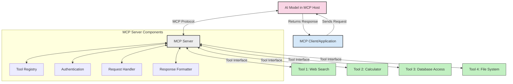
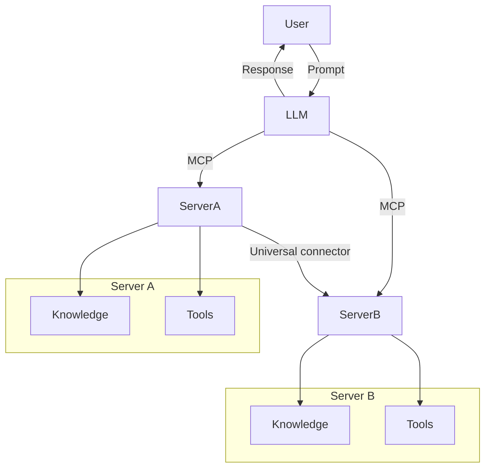

<!--
CO_OP_TRANSLATOR_METADATA:
{
  "original_hash": "02301140adbd807ecf0f17720fa307bc",
  "translation_date": "2025-05-17T05:53:23+00:00",
  "source_file": "00-Introduction/README.md",
  "language_code": "ar"
}
-->
# مقدمة لبروتوكول سياق النموذج (MCP): لماذا هو مهم لتطبيقات الذكاء الاصطناعي القابلة للتوسع

تعتبر تطبيقات الذكاء الاصطناعي التوليدية خطوة كبيرة للأمام لأنها غالبًا ما تسمح للمستخدم بالتفاعل مع التطبيق باستخدام المطالبات باللغة الطبيعية. ومع ذلك، مع استثمار المزيد من الوقت والموارد في هذه التطبيقات، ترغب في التأكد من أنه يمكنك دمج الوظائف والموارد بسهولة بحيث يكون من السهل توسيعها، وأن يكون التطبيق قادرًا على التعامل مع أكثر من نموذج واحد يتم استخدامه وتعقيداته. باختصار، بناء تطبيقات الذكاء الاصطناعي التوليدية سهل في البداية، ولكن مع نموها وتزايد تعقيدها، تحتاج إلى البدء في تحديد بنية ومن المرجح أن تحتاج إلى الاعتماد على معيار للتأكد من أن تطبيقاتك مبنية بطريقة متسقة. هنا يأتي دور MCP لتنظيم الأمور وتوفير معيار.

---

## **🔍 ما هو بروتوكول سياق النموذج (MCP)؟**

**بروتوكول سياق النموذج (MCP)** هو **واجهة مفتوحة وموحدة** تسمح لنماذج اللغة الكبيرة (LLMs) بالتفاعل بسلاسة مع الأدوات الخارجية وواجهات برمجة التطبيقات ومصادر البيانات. يوفر بنية متسقة لتعزيز وظيفة نموذج الذكاء الاصطناعي بما يتجاوز بيانات التدريب الخاصة بهم، مما يمكن من إنشاء أنظمة ذكاء اصطناعي أكثر ذكاءً وقابلة للتوسع وأكثر استجابة.

---

## **🎯 لماذا يهم التوحيد القياسي في الذكاء الاصطناعي**

مع تزايد تعقيد تطبيقات الذكاء الاصطناعي التوليدية، يصبح من الضروري اعتماد معايير تضمن **القابلية للتوسع، القابلية للتوسيع**، و**القابلية للصيانة**. MCP يعالج هذه الاحتياجات عن طريق:

- توحيد تكاملات النموذج والأدوات
- تقليل الحلول المخصصة الهشة والفردية
- السماح بتعايش نماذج متعددة داخل نظام بيئي واحد

---

## **📚 أهداف التعلم**

بنهاية هذه المقالة، ستكون قادرًا على:

- تعريف **بروتوكول سياق النموذج (MCP)** واستخداماته
- فهم كيف يقوم MCP بتوحيد الاتصال بين النموذج والأداة
- تحديد المكونات الأساسية لبنية MCP
- استكشاف تطبيقات العالم الحقيقي لـ MCP في سياقات المؤسسات والتطوير

---

## **💡 لماذا يعتبر بروتوكول سياق النموذج (MCP) تغييرًا في اللعبة**

### **🔗 MCP يحل مشكلة التجزئة في تفاعلات الذكاء الاصطناعي**

قبل MCP، كان تكامل النماذج مع الأدوات يتطلب:

- كود مخصص لكل زوج من الأدوات والنماذج
- واجهات برمجة تطبيقات غير قياسية لكل مورد
- انقطاعات متكررة بسبب التحديثات
- ضعف القابلية للتوسع مع المزيد من الأدوات

### **✅ فوائد توحيد MCP**

| **الفائدة**               | **الوصف**                                                                   |
|---------------------------|----------------------------------------------------------------------------|
| التوافق                   | تعمل LLMs بسلاسة مع الأدوات عبر مختلف الموردين                             |
| الاتساق                   | سلوك موحد عبر المنصات والأدوات                                              |
| إعادة الاستخدام           | يمكن استخدام الأدوات التي تم بناؤها مرة واحدة عبر المشاريع والأنظمة        |
| تسريع التطوير             | تقليل وقت التطوير باستخدام واجهات قياسية قابلة للتوصيل والتشغيل            |

---

## **🧱 نظرة عامة على بنية MCP عالية المستوى**

يتبع MCP نموذج **العميل-الخادم**، حيث:

- **مضيفي MCP** يشغلون نماذج الذكاء الاصطناعي
- **عملاء MCP** يبدأون الطلبات
- **خوادم MCP** تقدم السياق والأدوات والقدرات

### **المكونات الرئيسية:**

- **الموارد** – بيانات ثابتة أو ديناميكية للنماذج  
- **المطالبات** – تدفقات عمل محددة مسبقًا للتوليد الموجه  
- **الأدوات** – وظائف قابلة للتنفيذ مثل البحث، الحسابات  
- **التعيين** – سلوك وكيل عبر تفاعلات متكررة

---

## كيف تعمل خوادم MCP

تعمل خوادم MCP بالطريقة التالية:

- **تدفق الطلب**: 
    1. يرسل عميل MCP طلبًا إلى نموذج الذكاء الاصطناعي الذي يعمل في مضيف MCP.
    2. يحدد نموذج الذكاء الاصطناعي عندما يحتاج إلى أدوات أو بيانات خارجية.
    3. يتواصل النموذج مع خادم MCP باستخدام البروتوكول الموحد.

- **وظائف خادم MCP**:
    - سجل الأدوات: يحتفظ بكاتالوج الأدوات المتاحة وقدراتها.
    - المصادقة: يتحقق من الأذونات للوصول إلى الأدوات.
    - معالج الطلبات: يعالج الطلبات الواردة من النموذج.
    - منسق الاستجابة: ينظم مخرجات الأدوات في صيغة يمكن للنموذج فهمها.

- **تنفيذ الأدوات**: 
    - يوجه الخادم الطلبات إلى الأدوات الخارجية المناسبة
    - تنفذ الأدوات وظائفها المتخصصة (البحث، الحساب، استعلامات قاعدة البيانات، إلخ)
    - يتم إرجاع النتائج إلى النموذج في صيغة متسقة.

- **إكمال الاستجابة**: 
    - يقوم نموذج الذكاء الاصطناعي بإدماج مخرجات الأدوات في استجابته.
    - يتم إرسال الاستجابة النهائية إلى تطبيق العميل.

## 👨‍💻 كيفية بناء خادم MCP (مع أمثلة)

تسمح خوادم MCP بتمديد قدرات LLM عن طريق توفير البيانات والوظائف. 

جاهز لتجربتها؟ إليك أمثلة على إنشاء خادم MCP بسيط بلغات مختلفة:

- **مثال بايثون**: https://github.com/modelcontextprotocol/python-sdk

- **مثال TypeScript**: https://github.com/modelcontextprotocol/typescript-sdk

- **مثال جافا**: https://github.com/modelcontextprotocol/java-sdk

- **مثال C#/.NET**: https://github.com/modelcontextprotocol/csharp-sdk

## 🌍 حالات استخدام واقعية لـ MCP

يمكن لـ MCP تمكين مجموعة واسعة من التطبيقات عن طريق تمديد قدرات الذكاء الاصطناعي:

| **التطبيق**                | **الوصف**                                                                   |
|----------------------------|----------------------------------------------------------------------------|
| تكامل بيانات المؤسسات      | ربط LLMs بقواعد البيانات أو أنظمة إدارة علاقات العملاء أو الأدوات الداخلية   |
| أنظمة الذكاء الاصطناعي الوكيلة | تمكين الوكلاء المستقلين بالوصول إلى الأدوات وتدفقات العمل لاتخاذ القرارات   |
| تطبيقات متعددة الوسائط      | دمج أدوات النص والصورة والصوت داخل تطبيق ذكاء اصطناعي موحد واحد             |
| تكامل البيانات في الوقت الحقيقي | جلب البيانات الحية إلى تفاعلات الذكاء الاصطناعي للحصول على مخرجات أكثر دقة وحداثة |

### 🧠 MCP = معيار عالمي لتفاعلات الذكاء الاصطناعي

يعمل بروتوكول سياق النموذج (MCP) كمعيار عالمي لتفاعلات الذكاء الاصطناعي، مثلما قياسي USB-C التوصيلات الفيزيائية للأجهزة. في عالم الذكاء الاصطناعي، يوفر MCP واجهة متسقة، مما يسمح للنماذج (العملاء) بالتكامل بسلاسة مع الأدوات الخارجية ومزودي البيانات (الخوادم). هذا يلغي الحاجة إلى بروتوكولات متنوعة ومخصصة لكل واجهة برمجة تطبيقات أو مصدر بيانات.

تحت MCP، يتبع الأداة المتوافقة مع MCP (المعروفة باسم خادم MCP) معيار موحد. يمكن لهذه الخوادم سرد الأدوات أو الإجراءات التي تقدمها وتنفيذ تلك الإجراءات عند طلبها من قبل وكيل الذكاء الاصطناعي. منصات وكيل الذكاء الاصطناعي التي تدعم MCP قادرة على اكتشاف الأدوات المتاحة من الخوادم واستدعائها عبر هذا البروتوكول القياسي.

### 💡 تسهيل الوصول إلى المعرفة

بالإضافة إلى تقديم الأدوات، يسهل MCP أيضًا الوصول إلى المعرفة. يمكنه تمكين التطبيقات من توفير السياق لنماذج اللغة الكبيرة (LLMs) عن طريق ربطها بمصادر بيانات مختلفة. على سبيل المثال، قد يمثل خادم MCP مستودع وثائق الشركة، مما يسمح للوكلاء باسترجاع المعلومات ذات الصلة عند الطلب. يمكن لخادم آخر التعامل مع إجراءات محددة مثل إرسال البريد الإلكتروني أو تحديث السجلات. من منظور الوكيل، هذه مجرد أدوات يمكنه استخدامها - بعض الأدوات تعيد البيانات (سياق المعرفة)، بينما تقوم الأخرى بتنفيذ الإجراءات. يدير MCP كلاهما بكفاءة.

يتعلم الوكيل الذي يتصل بخادم MCP تلقائيًا القدرات المتاحة للخادم والبيانات المتاحة من خلال صيغة قياسية. هذه التوحيد القياسي يمكن من توفر الأدوات الديناميكي. على سبيل المثال، إضافة خادم MCP جديد إلى نظام الوكيل يجعل وظائفه قابلة للاستخدام فورًا دون الحاجة إلى تخصيص إضافي لتعليمات الوكيل.

يتماشى هذا التكامل المبسط مع التدفق الموضح في مخطط ميرميد، حيث توفر الخوادم الأدوات والمعرفة، مما يضمن التعاون السلس عبر الأنظمة.

### 👉 مثال: حل وكيل قابل للتوسع

## 🔐 فوائد عملية لـ MCP

إليك بعض الفوائد العملية لاستخدام MCP:

- **الجدة**: يمكن للنماذج الوصول إلى معلومات محدثة تتجاوز بيانات التدريب الخاصة بها
- **تمديد القدرات**: يمكن للنماذج الاستفادة من الأدوات المتخصصة للمهام التي لم يتم تدريبها عليها
- **تقليل الهلوسة**: توفر مصادر البيانات الخارجية الأساس الواقعي
- **الخصوصية**: يمكن أن تبقى البيانات الحساسة داخل بيئات آمنة بدلاً من تضمينها في المطالبات

## 📌 النقاط الرئيسية

النقاط الرئيسية لاستخدام MCP هي:

- **MCP** يوحد كيفية تفاعل نماذج الذكاء الاصطناعي مع الأدوات والبيانات
- يشجع على **القابلية للتوسيع، الاتساق، والتوافق**
- يساعد MCP في **تقليل وقت التطوير، تحسين الموثوقية، وتمديد قدرات النموذج**
- بنية العميل-الخادم **تمكن تطبيقات الذكاء الاصطناعي المرنة والقابلة للتوسع**

## 🧠 تمرين

فكر في تطبيق ذكاء اصطناعي تهتم ببنائه.

- ما هي **الأدوات أو البيانات الخارجية** التي يمكن أن تعزز قدراته؟
- كيف يمكن لـ MCP أن يجعل التكامل **أبسط وأكثر موثوقية؟**

## موارد إضافية

- [مستودع MCP على GitHub](https://github.com/modelcontextprotocol)

## ما التالي

التالي: [الفصل 1: المفاهيم الأساسية](/01-CoreConcepts/README.md)

**إخلاء مسؤولية**:  
تم ترجمة هذه الوثيقة باستخدام خدمة الترجمة بالذكاء الاصطناعي [Co-op Translator](https://github.com/Azure/co-op-translator). بينما نسعى لتحقيق الدقة، يرجى العلم أن الترجمات الآلية قد تحتوي على أخطاء أو عدم دقة. يجب اعتبار الوثيقة الأصلية بلغتها الأم هي المصدر الموثوق. بالنسبة للمعلومات الحيوية، يوصى بالترجمة البشرية الاحترافية. نحن لسنا مسؤولين عن أي سوء فهم أو تفسير خاطئ ناتج عن استخدام هذه الترجمة.