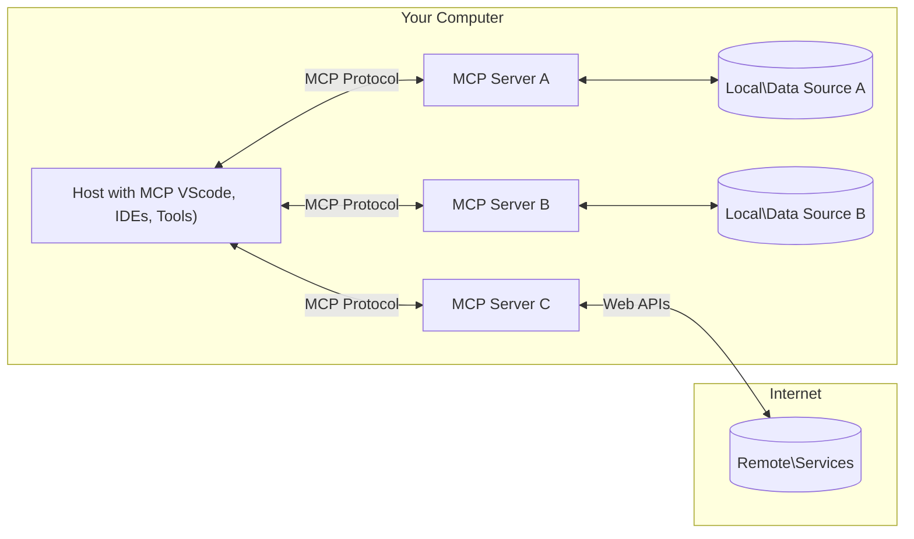

<!--
CO_OP_TRANSLATOR_METADATA:
{
  "original_hash": "b3b4a6ad10c3c0edbf7fa7cfa0ec496b",
  "translation_date": "2025-07-02T06:54:39+00:00",
  "source_file": "01-CoreConcepts/README.md",
  "language_code": "ar"
}
-->
# 📖 مفاهيم أساسية في MCP: إتقان بروتوكول سياق النموذج لتكامل الذكاء الاصطناعي

بروتوكول سياق النموذج (MCP) هو إطار عمل قوي وموحد يعمل على تحسين التواصل بين نماذج اللغة الكبيرة (LLMs) والأدوات الخارجية، والتطبيقات، ومصادر البيانات. سيرشدك هذا الدليل المحسّن لتحسين محركات البحث عبر المفاهيم الأساسية لـ MCP، مما يضمن فهمك لهندسة العميل-الخادم، والمكونات الأساسية، وآليات الاتصال، وأفضل الممارسات في التنفيذ.

## نظرة عامة

تستعرض هذه الدرس الهندسة الأساسية والمكونات التي تشكل نظام بروتوكول سياق النموذج (MCP). ستتعرف على هندسة العميل-الخادم، والمكونات الرئيسية، وآليات الاتصال التي تدعم تفاعلات MCP.

## 👩‍🎓 الأهداف التعليمية الرئيسية

بحلول نهاية هذا الدرس، ستتمكن من:

- فهم هندسة العميل-الخادم في MCP.
- تحديد أدوار ومسؤوليات المضيفين، والعملاء، والخوادم.
- تحليل الميزات الأساسية التي تجعل MCP طبقة تكامل مرنة.
- التعرف على كيفية تدفق المعلومات داخل نظام MCP.
- الحصول على رؤى عملية من خلال أمثلة برمجية في .NET، وجافا، وبايثون، وجافاسكريبت.

## 🔎 هندسة MCP: نظرة معمقة

يعتمد نظام MCP على نموذج عميل-خادم. تتيح هذه البنية المعيارية لتطبيقات الذكاء الاصطناعي التفاعل بكفاءة مع الأدوات، وقواعد البيانات، وواجهات برمجة التطبيقات، والموارد السياقية. لنقسم هذه الهندسة إلى مكوناتها الأساسية.

في جوهره، يتبع MCP هندسة عميل-خادم حيث يمكن لتطبيق المضيف الاتصال بعدة خوادم:



- **مضيفو MCP**: برامج مثل VSCode، Claude Desktop، بيئات التطوير المتكاملة (IDEs)، أو أدوات الذكاء الاصطناعي التي ترغب في الوصول إلى البيانات عبر MCP
- **عملاء MCP**: عملاء البروتوكول الذين يحافظون على اتصالات 1:1 مع الخوادم
- **خوادم MCP**: برامج خفيفة تعرض كل منها قدرات محددة عبر بروتوكول سياق النموذج الموحد
- **مصادر البيانات المحلية**: ملفات، قواعد بيانات، وخدمات على جهاز الكمبيوتر الخاص بك يمكن لخوادم MCP الوصول إليها بأمان
- **الخدمات البعيدة**: أنظمة خارجية متاحة عبر الإنترنت يمكن لخوادم MCP الاتصال بها عبر واجهات برمجة التطبيقات.

بروتوكول MCP هو معيار متطور، يمكنك الاطلاع على أحدث التحديثات في [مواصفات البروتوكول](https://modelcontextprotocol.io/specification/2025-06-18/)

### 1. المضيفون

في بروتوكول سياق النموذج (MCP)، يلعب المضيفون دورًا حيويًا كواجهة أساسية يتفاعل من خلالها المستخدمون مع البروتوكول. المضيفون هم تطبيقات أو بيئات تبدأ الاتصالات مع خوادم MCP للوصول إلى البيانات، الأدوات، والتعليمات. من أمثلة المضيفين بيئات التطوير المتكاملة مثل Visual Studio Code، أدوات الذكاء الاصطناعي مثل Claude Desktop، أو وكلاء مخصصون تم تصميمهم لمهام محددة.

**المضيفون** هم تطبيقات نماذج اللغة الكبيرة التي تبدأ الاتصالات. وهم:

- ينفذون أو يتفاعلون مع نماذج الذكاء الاصطناعي لتوليد الردود.
- يبدأون الاتصالات مع خوادم MCP.
- يديرون سير المحادثة وواجهة المستخدم.
- يتحكمون في أذونات الأمان والقيود.
- يتعاملون مع موافقة المستخدم على مشاركة البيانات وتنفيذ الأدوات.

### 2. العملاء

العملاء هم مكونات أساسية تسهل التفاعل بين المضيفين وخوادم MCP. يعمل العملاء كوسطاء، مما يمكّن المضيفين من الوصول إلى الوظائف التي توفرها خوادم MCP واستخدامها. يلعبون دورًا مهمًا في ضمان سلاسة الاتصال وتبادل البيانات بكفاءة ضمن هندسة MCP.

**العملاء** هم موصلات داخل تطبيق المضيف. وهم:

- يرسلون طلبات إلى الخوادم مع التعليمات/الإرشادات.
- يتفاوضون على القدرات مع الخوادم.
- يديرون طلبات تنفيذ الأدوات من النماذج.
- يعالجون ويعرضون الردود للمستخدمين.

### 3. الخوادم

الخوادم مسؤولة عن معالجة الطلبات من عملاء MCP وتقديم الردود المناسبة. تدير عمليات متنوعة مثل استرجاع البيانات، تنفيذ الأدوات، وتوليد التعليمات. تضمن الخوادم أن يكون الاتصال بين العملاء والمضيفين فعالًا وموثوقًا، مع الحفاظ على سلامة عملية التفاعل.

**الخوادم** هي خدمات توفر السياق والقدرات. وهي:

- تسجل الميزات المتاحة (الموارد، التعليمات، الأدوات)
- تستقبل وتنفذ استدعاءات الأدوات من العميل
- توفر معلومات سياقية لتعزيز ردود النموذج
- تعيد المخرجات إلى العميل
- تحافظ على الحالة عبر التفاعلات عند الحاجة

يمكن لأي شخص تطوير خوادم لتوسيع قدرات النموذج بوظائف متخصصة.

### 4. ميزات الخادم

توفر خوادم MCP اللبنات الأساسية التي تمكن التفاعلات الغنية بين العملاء، والمضيفين، ونماذج اللغة. تم تصميم هذه الميزات لتعزيز قدرات MCP من خلال تقديم سياق منظم، وأدوات، وتعليمات.

يمكن لخوادم MCP تقديم أي من الميزات التالية:

#### 📑 الموارد

تشمل الموارد في بروتوكول سياق النموذج أنواعًا مختلفة من السياق والبيانات التي يمكن للمستخدمين أو نماذج الذكاء الاصطناعي الاستفادة منها. وتتضمن:

- **البيانات السياقية**: معلومات وسياق يمكن للمستخدمين أو نماذج الذكاء الاصطناعي الاستناد إليها لاتخاذ القرارات وتنفيذ المهام.
- **قواعد المعرفة ومستودعات الوثائق**: مجموعات من البيانات المنظمة وغير المنظمة، مثل المقالات، والكتيبات، والأبحاث، التي توفر رؤى ومعلومات قيمة.
- **الملفات المحلية وقواعد البيانات**: بيانات مخزنة محليًا على الأجهزة أو داخل قواعد البيانات، يمكن الوصول إليها للمعالجة والتحليل.
- **واجهات برمجة التطبيقات والخدمات الإلكترونية**: واجهات وخدمات خارجية تقدم بيانات ووظائف إضافية، مما يتيح التكامل مع موارد وأدوات عبر الإنترنت.

مثال على مورد يمكن أن يكون مخطط قاعدة بيانات أو ملف يمكن الوصول إليه كما يلي:

```text
file://log.txt
database://schema
```

### 🤖 التعليمات

تشمل التعليمات في MCP قوالب وأنماط تفاعل محددة مسبقًا مصممة لتبسيط سير عمل المستخدمين وتعزيز التواصل. وتتضمن:

- **رسائل وقوالب سير عمل مُهيكلة مسبقًا**: رسائل وعمليات منظمة توجه المستخدمين خلال مهام وتفاعلات محددة.
- **أنماط تفاعل محددة مسبقًا**: تسلسلات موحدة من الإجراءات والردود تسهل تواصلًا متسقًا وفعالًا.
- **قوالب محادثة متخصصة**: قوالب قابلة للتخصيص مصممة لأنواع محددة من المحادثات، لضمان تفاعلات ملائمة وسياقية.

يمكن أن تبدو قالب التعليمات كما يلي:

```markdown
Generate a product slogan based on the following {{product}} with the following {{keywords}}
```

#### ⛏️ الأدوات

الأدوات في MCP هي وظائف يمكن لنموذج الذكاء الاصطناعي تنفيذها لأداء مهام محددة. صممت هذه الأدوات لتعزيز قدرات النموذج من خلال توفير عمليات منظمة وموثوقة. تشمل الجوانب الرئيسية:

- **وظائف يمكن للنموذج تنفيذها**: الأدوات هي دوال قابلة للتنفيذ يمكن للنموذج استدعاؤها لأداء مهام متنوعة.
- **اسم ووصف فريد**: لكل أداة اسم مميز ووصف تفصيلي يشرح غرضها ووظيفتها.
- **المعلمات والمخرجات**: تقبل الأدوات معلمات محددة وتعيد مخرجات منظمة لضمان نتائج متسقة ومتوقعة.
- **وظائف منفصلة**: تقوم الأدوات بوظائف محددة مثل البحث على الويب، الحسابات، واستعلامات قواعد البيانات.

يمكن أن يبدو مثال على أداة كما يلي:

```typescript
server.tool(
  "GetProducts",
  {
    pageSize: z.string().optional(),
    pageCount: z.string().optional()
  }, () => {
    // return results from API
  }
)
```

## ميزات العملاء

في MCP، يقدم العملاء عدة ميزات رئيسية للخوادم، تعزز الوظائف العامة والتفاعل داخل البروتوكول. من الميزات الملحوظة هي Sampling.

### 👉 Sampling

- **سلوكيات وكيلية يبدأها الخادم**: يتيح العملاء للخوادم بدء إجراءات أو سلوكيات محددة بشكل مستقل، مما يعزز القدرات الديناميكية للنظام.
- **تفاعلات متكررة مع نماذج اللغة الكبيرة**: تتيح هذه الميزة تفاعلات متكررة مع نماذج اللغة الكبيرة، مما يمكن من معالجة أكثر تعقيدًا وتكرارية للمهام.
- **طلب إكمالات إضافية من النموذج**: يمكن للخوادم طلب إكمالات إضافية من النموذج، لضمان ردود شاملة وذات صلة سياقية.

## تدفق المعلومات في MCP

يحدد بروتوكول سياق النموذج (MCP) تدفقًا منظمًا للمعلومات بين المضيفين، والعملاء، والخوادم، والنماذج. يساعد فهم هذا التدفق على توضيح كيفية معالجة طلبات المستخدمين وكيفية دمج الأدوات والبيانات الخارجية في ردود النموذج.

- **يبدأ المضيف الاتصال**  
  يقوم تطبيق المضيف (مثل بيئة تطوير متكاملة أو واجهة محادثة) بإنشاء اتصال مع خادم MCP، عادة عبر STDIO أو WebSocket أو وسائل نقل مدعومة أخرى.

- **التفاوض على القدرات**  
  يتبادل العميل (المدمج في المضيف) والخادم معلومات حول الميزات، الأدوات، الموارد، وإصدارات البروتوكول المدعومة. هذا يضمن فهم الطرفين للقدرات المتاحة للجلسة.

- **طلب المستخدم**  
  يتفاعل المستخدم مع المضيف (مثل إدخال تعليمات أو أمر). يجمع المضيف هذا الإدخال ويرسله إلى العميل للمعالجة.

- **استخدام الموارد أو الأدوات**  
  - قد يطلب العميل سياقًا أو موارد إضافية من الخادم (مثل ملفات، سجلات قواعد بيانات، أو مقالات قواعد المعرفة) لتعزيز فهم النموذج.
  - إذا قرر النموذج أن أداة ضرورية (مثل جلب بيانات، إجراء حساب، أو استدعاء API)، يرسل العميل طلب استدعاء الأداة إلى الخادم مع تحديد اسم الأداة والمعلمات.

- **تنفيذ الخادم**  
  يستقبل الخادم طلب المورد أو الأداة، ينفذ العمليات اللازمة (مثل تشغيل دالة، استعلام قاعدة بيانات، أو استرجاع ملف)، ويعيد النتائج إلى العميل في صيغة منظمة.

- **توليد الرد**  
  يدمج العميل ردود الخادم (بيانات الموارد، مخرجات الأدوات، إلخ) في التفاعل المستمر مع النموذج. يستخدم النموذج هذه المعلومات لتوليد رد شامل وذو صلة سياقية.

- **عرض النتيجة**  
  يستلم المضيف المخرجات النهائية من العميل ويعرضها للمستخدم، غالبًا متضمنة النص المولد من النموذج وأي نتائج من تنفيذ الأدوات أو استعلامات الموارد.

يمكن هذا التدفق MCP من دعم تطبيقات الذكاء الاصطناعي المتقدمة، التفاعلية، والواعية للسياق من خلال ربط النماذج بسلاسة مع الأدوات والبيانات الخارجية.

## تفاصيل البروتوكول

يُبنى MCP (بروتوكول سياق النموذج) على أساس [JSON-RPC 2.0](https://www.jsonrpc.org/)، موفرًا صيغة رسائل موحدة وغير مرتبطة بلغة معينة للتواصل بين المضيفين، والعملاء، والخوادم. يتيح هذا الأساس تفاعلات موثوقة، منظمة، وقابلة للتوسع عبر منصات ولغات برمجة متنوعة.

### الميزات الرئيسية للبروتوكول

يوسع MCP JSON-RPC 2.0 بإضافات خاصة لاستدعاء الأدوات، الوصول إلى الموارد، وإدارة التعليمات. يدعم عدة طبقات نقل (STDIO، WebSocket، SSE) ويُمكّن تواصلًا آمنًا، قابلًا للتوسع، وغير مرتبط بلغة بين المكونات.

#### 🧢 البروتوكول الأساسي

- **صيغة رسائل JSON-RPC**: جميع الطلبات والردود تستخدم مواصفات JSON-RPC 2.0، مما يضمن بنية متسقة لاستدعاءات الطرق، المعلمات، النتائج، ومعالجة الأخطاء.
- **اتصالات حالة**: تحافظ جلسات MCP على الحالة عبر طلبات متعددة، داعمة للمحادثات المستمرة، تراكم السياق، وإدارة الموارد.
- **التفاوض على القدرات**: خلال إعداد الاتصال، يتبادل العملاء والخوادم معلومات حول الميزات المدعومة، إصدارات البروتوكول، الأدوات المتاحة، والموارد. هذا يضمن فهم الطرفين لقدرات بعضهما البعض والقدرة على التكيف.

#### ➕ أدوات إضافية

فيما يلي بعض الأدوات والإضافات التي يوفرها MCP لتحسين تجربة المطور وتمكين السيناريوهات المتقدمة:

- **خيارات التكوين**: يسمح MCP بتكوين ديناميكي لمعلمات الجلسة، مثل أذونات الأدوات، الوصول إلى الموارد، وإعدادات النموذج، مخصصة لكل تفاعل.
- **تتبع التقدم**: يمكن للعمليات طويلة الأمد الإبلاغ عن تحديثات التقدم، مما يتيح واجهات مستخدم تفاعلية وتجربة أفضل أثناء المهام المعقدة.
- **إلغاء الطلبات**: يمكن للعملاء إلغاء الطلبات الجارية، مما يسمح للمستخدمين بوقف العمليات غير الضرورية أو التي تستغرق وقتًا طويلاً.
- **الإبلاغ عن الأخطاء**: تساعد رسائل وأكواد الأخطاء الموحدة في تشخيص المشكلات، التعامل مع الفشل بسلاسة، وتقديم ملاحظات قابلة للتنفيذ للمستخدمين والمطورين.
- **التسجيل**: يمكن لكل من العملاء والخوادم إصدار سجلات منظمة للتدقيق، وتصحيح الأخطاء، ومراقبة تفاعلات البروتوكول.

من خلال الاستفادة من هذه الميزات، يضمن MCP تواصلًا قويًا، آمنًا، ومرنًا بين نماذج اللغة والأدوات أو مصادر البيانات الخارجية.

### 🔐 اعتبارات الأمان

يجب على تطبيقات MCP الالتزام بعدة مبادئ أمنية رئيسية لضمان تفاعلات آمنة وموثوقة:

- **موافقة المستخدم والتحكم**: يجب أن يقدم المستخدمون موافقة صريحة قبل الوصول إلى أي بيانات أو تنفيذ عمليات. يجب أن يكون لديهم تحكم واضح فيما يُشارك من بيانات وأي الإجراءات مخولة، مدعومًا بواجهات مستخدم بديهية لمراجعة والموافقة على الأنشطة.

- **خصوصية البيانات**: يجب أن تُكشف بيانات المستخدم فقط بموافقة صريحة، ويجب حمايتها بواسطة ضوابط وصول مناسبة. يجب على تطبيقات MCP حماية البيانات من النقل غير المصرح به وضمان الحفاظ على الخصوصية طوال التفاعلات.

- **سلامة الأدوات**: قبل استدعاء أي أداة، يجب الحصول على موافقة صريحة من المستخدم. ينبغي أن يكون لدى المستخدمين فهم واضح لوظيفة كل أداة، ويجب فرض حدود أمان قوية لمنع تنفيذ أدوات غير مقصود أو غير آمن.

باتباع هذه المبادئ، يضمن MCP الحفاظ على ثقة المستخدم، الخصوصية، والسلامة عبر جميع تفاعلات البروتوكول.

## أمثلة برمجية: المكونات الرئيسية

فيما يلي أمثلة برمجية بعدة لغات برمجة شهيرة توضح كيفية تنفيذ مكونات خادم MCP الأساسية والأدوات.

### مثال .NET: إنشاء خادم MCP بسيط مع أدوات

هنا مثال عملي في .NET يوضح كيفية تنفيذ خادم MCP بسيط مع أدوات مخصصة. يعرض هذا المثال كيفية تعريف وتسجيل الأدوات، معالجة الطلبات، وربط الخادم باستخدام بروتوكول سياق النموذج.

```csharp
using System;
using System.Threading.Tasks;
using ModelContextProtocol.Server;
using ModelContextProtocol.Server.Transport;
using ModelContextProtocol.Server.Tools;

public class WeatherServer
{
    public static async Task Main(string[] args)
    {
        // Create an MCP server
        var server = new McpServer(
            name: "Weather MCP Server",
            version: "1.0.0"
        );
        
        // Register our custom weather tool
        server.AddTool<string, WeatherData>("weatherTool", 
            description: "Gets current weather for a location",
            execute: async (location) => {
                // Call weather API (simplified)
                var weatherData = await GetWeatherDataAsync(location);
                return weatherData;
            });
        
        // Connect the server using stdio transport
        var transport = new StdioServerTransport();
        await server.ConnectAsync(transport);
        
        Console.WriteLine("Weather MCP Server started");
        
        // Keep the server running until process is terminated
        await Task.Delay(-1);
    }
    
    private static async Task<WeatherData> GetWeatherDataAsync(string location)
    {
        // This would normally call a weather API
        // Simplified for demonstration
        await Task.Delay(100); // Simulate API call
        return new WeatherData { 
            Temperature = 72.5,
            Conditions = "Sunny",
            Location = location
        };
    }
}

public class WeatherData
{
    public double Temperature { get; set; }
    public string Conditions { get; set; }
    public string Location { get; set; }
}
```

### مثال جافا: مكونات خادم MCP

يعرض هذا المثال نفس خادم MCP وتسجيل الأدوات كما في مثال .NET أعلاه، لكنه منفذ بلغة جافا.

```java
import io.modelcontextprotocol.server.McpServer;
import io.modelcontextprotocol.server.McpToolDefinition;
import io.modelcontextprotocol.server.transport.StdioServerTransport;
import io.modelcontextprotocol.server.tool.ToolExecutionContext;
import io.modelcontextprotocol.server.tool.ToolResponse;

public class WeatherMcpServer {
    public static void main(String[] args) throws Exception {
        // Create an MCP server
        McpServer server = McpServer.builder()
            .name("Weather MCP Server")
            .version("1.0.0")
            .build();
            
        // Register a weather tool
        server.registerTool(McpToolDefinition.builder("weatherTool")
            .description("Gets current weather for a location")
            .parameter("location", String.class)
            .execute((ToolExecutionContext ctx) -> {
                String location = ctx.getParameter("location", String.class);
                
                // Get weather data (simplified)
                WeatherData data = getWeatherData(location);
                
                // Return formatted response
                return ToolResponse.content(
                    String.format("Temperature: %.1f°F, Conditions: %s, Location: %s", 
                    data.getTemperature(), 
                    data.getConditions(), 
                    data.getLocation())
                );
            })
            .build());
        
        // Connect the server using stdio transport
        try (StdioServerTransport transport = new StdioServerTransport()) {
            server.connect(transport);
            System.out.println("Weather MCP Server started");
            // Keep server running until process is terminated
            Thread.currentThread().join();
        }
    }
    
    private static WeatherData getWeatherData(String location) {
        // Implementation would call a weather API
        // Simplified for example purposes
        return new WeatherData(72.5, "Sunny", location);
    }
}

class WeatherData {
    private double temperature;
    private String conditions;
    private String location;
    
    public WeatherData(double temperature, String conditions, String location) {
        this.temperature = temperature;
        this.conditions = conditions;
        this.location = location;
    }
    
    public double getTemperature() {
        return temperature;
    }
    
    public String getConditions() {
        return conditions;
    }
    
    public String getLocation() {
        return location;
    }
}
```

### مثال بايثون: بناء خادم MCP

في هذا المثال نعرض كيفية بناء خادم MCP بلغة بايثون. كما نعرض طريقتين مختلفتين لإنشاء الأدوات.

```python
#!/usr/bin/env python3
import asyncio
from mcp.server.fastmcp import FastMCP
from mcp.server.transports.stdio import serve_stdio

# Create a FastMCP server
mcp = FastMCP(
    name="Weather MCP Server",
    version="1.0.0"
)

@mcp.tool()
def get_weather(location: str) -> dict:
    """Gets current weather for a location."""
    # This would normally call a weather API
    # Simplified for demonstration
    return {
        "temperature": 72.5,
        "conditions": "Sunny",
        "location": location
    }

# Alternative approach using a class
class WeatherTools:
    @mcp.tool()
    def forecast(self, location: str, days: int = 1) -> dict:
        """Gets weather forecast for a location for the specified number of days."""
        # This would normally call a weather API forecast endpoint
        # Simplified for demonstration
        return {
            "location": location,
            "forecast": [
                {"day": i+1, "temperature": 70 + i, "conditions": "Partly Cloudy"}
                for i in range(days)
            ]
        }

# Instantiate the class to register its tools
weather_tools = WeatherTools()

# Start the server using stdio transport
if __name__ == "__main__":
    asyncio.run(serve_stdio(mcp))
```

### مثال جافاسكريبت: إنشاء خادم MCP

يعرض هذا المثال إنشاء خادم MCP في جافاسكريبت وكيفية تسجيل أداتين مرتبطتين بالطقس.

```javascript
// Using the official Model Context Protocol SDK
import { McpServer } from "@modelcontextprotocol/sdk/server/mcp.js";
import { StdioServerTransport } from "@modelcontextprotocol/sdk/server/stdio.js";
import { z } from "zod"; // For parameter validation

// Create an MCP server
const server = new McpServer({
  name: "Weather MCP Server",
  version: "1.0.0"
});

// Define a weather tool
server.tool(
  "weatherTool",
  {
    location: z.string().describe("The location to get weather for")
  },
  async ({ location }) => {
    // This would normally call a weather API
    // Simplified for demonstration
    const weatherData = await getWeatherData(location);
    
    return {
      content: [
        { 
          type: "text", 
          text: `Temperature: ${weatherData.temperature}°F, Conditions: ${weatherData.conditions}, Location: ${weatherData.location}` 
        }
      ]
    };
  }
);

// Define a forecast tool
server.tool(
  "forecastTool",
  {
    location: z.string(),
    days: z.number().default(3).describe("Number of days for forecast")
  },
  async ({ location, days }) => {
    // This would normally call a weather API
    // Simplified for demonstration
    const forecast = await getForecastData(location, days);
    
    return {
      content: [
        { 
          type: "text", 
          text: `${days}-day forecast for ${location}: ${JSON.stringify(forecast)}` 
        }
      ]
    };
  }
);

// Helper functions
async function getWeatherData(location) {
  // Simulate API call
  return {
    temperature: 72.5,
    conditions: "Sunny",
    location: location
  };
}

async function getForecastData(location, days) {
  // Simulate API call
  return Array.from({ length: days }, (_, i) => ({
    day: i + 1,
    temperature: 70 + Math.floor(Math.random() * 10),
    conditions: i % 2 === 0 ? "Sunny" : "Partly Cloudy"
  }));
}

// Connect the server using stdio transport
const transport = new StdioServerTransport();
server.connect(transport).catch(console.error);

console.log("Weather MCP Server started");
```

يوضح هذا المثال في جافاسكريبت كيفية إنشاء عميل MCP يتصل بخادم، يرسل تعليمات، ويعالج الرد بما في ذلك أي استدعاءات أدوات تمت.

## الأمان والتفويض

يتضمن MCP عدة مفاهيم وآليات مدمجة لإدارة الأمان والتفويض عبر البروتوكول:

1. **التحكم في أذونات الأدوات**  
  يمكن للعملاء تحديد الأدوات التي يسمح للنموذج باستخدامها خلال الجلسة. يضمن هذا أن الأدوات المصرح بها فقط هي المتاحة، مما يقلل من مخاطر العمليات غير المقصودة أو غير الآمنة. يمكن تكوين الأذونات ديناميكيًا بناءً على تفضيلات المستخدم، سياسات المنظمة، أو سياق التفاعل.

2. **المصادقة**  
  يمكن للخوادم طلب المصادقة قبل منح الوصول إلى الأدوات، الموارد، أو العمليات الحساسة. قد يشمل ذلك مفاتيح API، رموز OAuth، أو مخططات مصادقة أخرى. تضمن المصادقة الصحيحة أن العملاء والمستخدمين الموثوقين فقط يمكنهم استدعاء قدرات الخادم.

3. **التحقق**  
  يُفرض التحقق من المعلمات لجميع استدعاءات الأدوات. تعرف كل أداة أنواع، صيغ، وقيود متوقعة لمعلماتها، ويقوم الخادم بالتحقق من الطلبات الواردة وفقًا لذلك. يمنع هذا وصول إدخالات خاطئة أو خبيثة إلى تنفيذ الأدوات ويساعد في الحفاظ على سلامة العمليات.

4. **تحديد المعدل**  
  لمنع سوء الاستخدام وضمان الاستخدام العادل لموارد الخادم، يمكن لخوادم MCP تطبيق حدود على عدد استدعاءات الأدوات والوصول إلى الموارد. يمكن تطبيق حدود المعدل لكل مستخدم، لكل جلسة، أو

**إخلاء المسؤولية**:  
تمت ترجمة هذا المستند باستخدام خدمة الترجمة الآلية [Co-op Translator](https://github.com/Azure/co-op-translator). بينما نسعى لتحقيق الدقة، يرجى العلم أن الترجمات الآلية قد تحتوي على أخطاء أو عدم دقة. يجب اعتبار المستند الأصلي بلغته الأصلية المصدر الرسمي والمعتمد. للمعلومات الحساسة أو الحرجة، يُنصح بالاستعانة بترجمة بشرية محترفة. نحن غير مسؤولين عن أي سوء فهم أو تفسيرات خاطئة تنشأ عن استخدام هذه الترجمة.