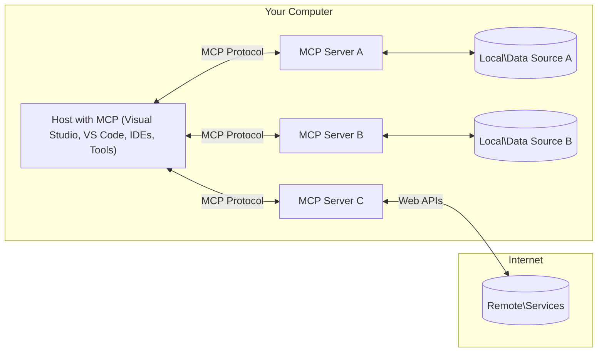

<!--
CO_OP_TRANSLATOR_METADATA:
{
  "original_hash": "0a6a7bcb289c024a91289e0444cb370b",
  "translation_date": "2025-08-18T13:31:38+00:00",
  "source_file": "01-CoreConcepts/README.md",
  "language_code": "ar"
}
-->
# مفاهيم أساسية لـ MCP: إتقان بروتوكول سياق النموذج لتكامل الذكاء الاصطناعي

[](https://youtu.be/earDzWGtE84)

_(اضغط على الصورة أعلاه لمشاهدة فيديو الدرس)_

[Model Context Protocol (MCP)](https://gi- **موافقة المستخدم الصريحة**: يتطلب الوصول إلى البيانات وتنفيذ العمليات موافقة صريحة من المستخدم قبل التنفيذ. يجب أن يكون لدى المستخدمين فهم واضح للبيانات التي سيتم الوصول إليها والإجراءات التي سيتم تنفيذها، مع التحكم الدقيق في الأذونات والتفويضات.

- **حماية خصوصية البيانات**: يتم الكشف عن بيانات المستخدم فقط بموافقة صريحة ويجب حمايتها من خلال ضوابط وصول قوية طوال دورة حياة التفاعل. يجب أن تمنع التطبيقات نقل البيانات غير المصرح به وتحافظ على حدود الخصوصية الصارمة.

- **سلامة تنفيذ الأدوات**: يتطلب كل استدعاء للأدوات موافقة صريحة من المستخدم مع فهم واضح لوظائف الأداة، المعلمات، والتأثير المحتمل. يجب أن تمنع الحدود الأمنية القوية تنفيذ الأدوات غير المقصود أو غير الآمن أو الخبيث.

- **أمان طبقة النقل**: يجب أن تستخدم جميع قنوات الاتصال آليات التشفير والمصادقة المناسبة. يجب أن تنفذ الاتصالات البعيدة بروتوكولات نقل آمنة وإدارة سليمة للمصادقات.

#### إرشادات التنفيذ:

- **إدارة الأذونات**: تنفيذ أنظمة أذونات دقيقة تسمح للمستخدمين بالتحكم في الخوادم، الأدوات، والموارد التي يمكن الوصول إليها  
- **المصادقة والتفويض**: استخدام طرق مصادقة آمنة (OAuth، مفاتيح API) مع إدارة سليمة للرموز وانتهاء صلاحيتها  
- **التحقق من المدخلات**: التحقق من جميع المعلمات ومدخلات البيانات وفقًا للمخططات المحددة لمنع هجمات الحقن  
- **تسجيل التدقيق**: الحفاظ على سجلات شاملة لجميع العمليات لمراقبة الأمان والامتثال

## نظرة عامة

يستكشف هذا الدرس البنية الأساسية والمكونات التي تشكل نظام Model Context Protocol (MCP). ستتعلم عن بنية العميل-الخادم، المكونات الرئيسية، وآليات الاتصال التي تدعم تفاعلات MCP.

## أهداف التعلم الرئيسية

بنهاية هذا الدرس، ستتمكن من:

- فهم بنية العميل-الخادم لـ MCP.
- تحديد أدوار ومسؤوليات المضيفين، العملاء، والخوادم.
- تحليل الميزات الأساسية التي تجعل MCP طبقة تكامل مرنة.
- تعلم كيفية تدفق المعلومات داخل نظام MCP.
- اكتساب رؤى عملية من خلال أمثلة برمجية في .NET، Java، Python، وJavaScript.

## بنية MCP: نظرة أعمق

تم بناء نظام MCP على نموذج العميل-الخادم. يتيح هذا الهيكل المعياري لتطبيقات الذكاء الاصطناعي التفاعل بكفاءة مع الأدوات، قواعد البيانات، واجهات برمجة التطبيقات، والموارد السياقية. دعونا نحلل هذه البنية إلى مكوناتها الأساسية.

في جوهره، يتبع MCP بنية العميل-الخادم حيث يمكن لتطبيق المضيف الاتصال بعدة خوادم:



- **مضيفو MCP**: برامج مثل VSCode، Claude Desktop، IDEs، أو أدوات الذكاء الاصطناعي التي ترغب في الوصول إلى البيانات عبر MCP  
- **عملاء MCP**: عملاء البروتوكول الذين يحافظون على اتصالات 1:1 مع الخوادم  
- **خوادم MCP**: برامج خفيفة الوزن تكشف عن قدرات محددة من خلال بروتوكول سياق النموذج القياسي  
- **مصادر البيانات المحلية**: ملفات الكمبيوتر، قواعد البيانات، والخدمات التي يمكن لخوادم MCP الوصول إليها بأمان  
- **الخدمات البعيدة**: الأنظمة الخارجية المتاحة عبر الإنترنت التي يمكن لخوادم MCP الاتصال بها من خلال واجهات برمجة التطبيقات.

يعد بروتوكول MCP معيارًا متطورًا يستخدم إصدارًا يعتمد على التاريخ (YYYY-MM-DD). الإصدار الحالي للبروتوكول هو **2025-06-18**. يمكنك رؤية أحدث التحديثات لمواصفات [البروتوكول](https://modelcontextprotocol.io/specification/2025-06-18/)

### 1. المضيفون

في بروتوكول سياق النموذج (MCP)، **المضيفون** هم تطبيقات الذكاء الاصطناعي التي تعمل كواجهة رئيسية يتفاعل المستخدمون من خلالها مع البروتوكول. يقوم المضيفون بتنسيق وإدارة الاتصالات مع خوادم MCP متعددة من خلال إنشاء عملاء MCP مخصصين لكل اتصال بالخادم. أمثلة على المضيفين تشمل:

- **تطبيقات الذكاء الاصطناعي**: Claude Desktop، Visual Studio Code، Claude Code  
- **بيئات التطوير**: IDEs ومحررات الأكواد مع تكامل MCP  
- **تطبيقات مخصصة**: وكلاء وأدوات الذكاء الاصطناعي المصممة خصيصًا

**المضيفون** هم تطبيقات تنسق تفاعلات نماذج الذكاء الاصطناعي. يقومون بـ:

- **تنسيق نماذج الذكاء الاصطناعي**: تنفيذ أو التفاعل مع LLMs لتوليد الردود وتنسيق سير العمل  
- **إدارة اتصالات العملاء**: إنشاء والحفاظ على عميل MCP لكل اتصال بخادم MCP  
- **التحكم في واجهة المستخدم**: التعامل مع تدفق المحادثة، تفاعلات المستخدم، وعرض الردود  
- **فرض الأمان**: التحكم في الأذونات، قيود الأمان، والمصادقة  
- **إدارة موافقة المستخدم**: إدارة موافقة المستخدم على مشاركة البيانات وتنفيذ الأدوات  

### 2. العملاء

**العملاء** هم مكونات أساسية تحافظ على اتصالات مخصصة بين المضيفين وخوادم MCP. يتم إنشاء كل عميل MCP بواسطة المضيف للاتصال بخادم MCP محدد، مما يضمن قنوات اتصال منظمة وآمنة. يتيح تعدد العملاء للمضيفين الاتصال بعدة خوادم في وقت واحد.

**العملاء** هم مكونات الاتصال داخل تطبيق المضيف. يقومون بـ:

- **اتصال البروتوكول**: إرسال طلبات JSON-RPC 2.0 إلى الخوادم مع التعليمات  
- **التفاوض على القدرات**: التفاوض على الميزات المدعومة وإصدارات البروتوكول مع الخوادم أثناء التهيئة  
- **تنفيذ الأدوات**: إدارة طلبات تنفيذ الأدوات من النماذج ومعالجة الردود  
- **التحديثات الفورية**: التعامل مع الإشعارات والتحديثات الفورية من الخوادم  
- **معالجة الردود**: معالجة وتنسيق ردود الخوادم لعرضها على المستخدمين  

### 3. الخوادم

**الخوادم** هي برامج توفر السياق، الأدوات، والقدرات لعملاء MCP. يمكن تنفيذها محليًا (على نفس الجهاز مثل المضيف) أو عن بُعد (على منصات خارجية)، وهي مسؤولة عن معالجة طلبات العملاء وتقديم الردود المنظمة. تكشف الخوادم عن وظائف محددة من خلال بروتوكول سياق النموذج القياسي.

**الخوادم** هي خدمات توفر السياق والقدرات. تقوم بـ:

- **تسجيل الميزات**: تسجيل وكشف الموارد المتاحة (المصادر، التعليمات، الأدوات) للعملاء  
- **معالجة الطلبات**: استقبال وتنفيذ استدعاءات الأدوات، طلبات الموارد، وطلبات التعليمات من العملاء  
- **توفير السياق**: تقديم معلومات سياقية وبيانات لتعزيز ردود النموذج  
- **إدارة الحالة**: الحفاظ على حالة الجلسة والتعامل مع التفاعلات المستمرة عند الحاجة  
- **الإشعارات الفورية**: إرسال إشعارات حول تغييرات القدرات والتحديثات للعملاء المتصلين  

يمكن لأي شخص تطوير الخوادم لتوسيع قدرات النموذج بوظائف متخصصة، وتدعم سيناريوهات النشر المحلية والبعيدة.

### 4. البدائيات الخادمة

توفر الخوادم في بروتوكول سياق النموذج (MCP) ثلاث **بدائيات** أساسية تحدد اللبنات الأساسية للتفاعلات الغنية بين العملاء، المضيفين، ونماذج اللغة. تحدد هذه البدائيات أنواع المعلومات السياقية والإجراءات المتاحة من خلال البروتوكول.

يمكن لخوادم MCP كشف أي مجموعة من البدائيات الأساسية الثلاثة التالية:

#### الموارد

**الموارد** هي مصادر بيانات توفر معلومات سياقية لتطبيقات الذكاء الاصطناعي. تمثل محتوى ثابتًا أو ديناميكيًا يمكن أن يعزز فهم النموذج واتخاذ القرار:

- **بيانات سياقية**: معلومات منظمة وسياق لاستهلاك نموذج الذكاء الاصطناعي  
- **قواعد المعرفة**: مستودعات الوثائق، المقالات، الكتيبات، والأوراق البحثية  
- **مصادر البيانات المحلية**: الملفات، قواعد البيانات، ومعلومات النظام المحلي  
- **البيانات الخارجية**: ردود واجهات برمجة التطبيقات، خدمات الويب، وبيانات الأنظمة البعيدة  
- **المحتوى الديناميكي**: بيانات فورية تتحدث بناءً على الظروف الخارجية  

يتم تحديد الموارد بواسطة URIs وتدعم الاكتشاف من خلال طرق `resources/list` والاسترجاع عبر `resources/read`:

```text
file://documents/project-spec.md
database://production/users/schema
api://weather/current
```

#### التعليمات

**التعليمات** هي قوالب قابلة لإعادة الاستخدام تساعد في هيكلة التفاعلات مع نماذج اللغة. توفر أنماط تفاعل قياسية وسير عمل مهيكل:

- **التفاعلات القائمة على القوالب**: رسائل مهيكلة مسبقًا وبدايات محادثة  
- **قوالب سير العمل**: تسلسلات قياسية للمهام والتفاعلات الشائعة  
- **أمثلة قليلة اللقطات**: قوالب قائمة على الأمثلة لتعليم النموذج  
- **تعليمات النظام**: تعليمات أساسية تحدد سلوك النموذج والسياق  
- **القوالب الديناميكية**: تعليمات ذات معلمات تتكيف مع سياقات محددة  

تدعم التعليمات استبدال المتغيرات ويمكن اكتشافها عبر `prompts/list` واسترجاعها باستخدام `prompts/get`:

```markdown
Generate a {{task_type}} for {{product}} targeting {{audience}} with the following requirements: {{requirements}}
```

#### الأدوات

**الأدوات** هي وظائف قابلة للتنفيذ يمكن لنماذج الذكاء الاصطناعي استدعاؤها لتنفيذ إجراءات محددة. تمثل "الأفعال" في نظام MCP، مما يتيح للنماذج التفاعل مع الأنظمة الخارجية:

- **وظائف قابلة للتنفيذ**: عمليات منفصلة يمكن للنماذج استدعاؤها بمعلمات محددة  
- **تكامل الأنظمة الخارجية**: استدعاءات واجهات برمجة التطبيقات، استعلامات قواعد البيانات، عمليات الملفات، الحسابات  
- **هوية فريدة**: لكل أداة اسم مميز، وصف، ومخطط معلمات  
- **مدخلات ومخرجات منظمة**: تقبل الأدوات معلمات تم التحقق منها وتعيد ردودًا منظمة ومكتوبة  
- **قدرات العمل**: تمكين النماذج من تنفيذ إجراءات واقعية واسترجاع بيانات حية  

يتم تعريف الأدوات بمخطط JSON للتحقق من المعلمات وتكتشف عبر `tools/list` وتنفذ عبر `tools/call`:

```typescript
server.tool(
  "search_products", 
  {
    query: z.string().describe("Search query for products"),
    category: z.string().optional().describe("Product category filter"),
    max_results: z.number().default(10).describe("Maximum results to return")
  }, 
  async (params) => {
    // Execute search and return structured results
    return await productService.search(params);
  }
);
```

## البدائيات العميلة

في بروتوكول سياق النموذج (MCP)، يمكن للعملاء كشف بدائيات تمكن الخوادم من طلب قدرات إضافية من تطبيق المضيف. تتيح هذه البدائيات على جانب العميل تنفيذات خادم أكثر ثراءً وتفاعلية يمكنها الوصول إلى قدرات النموذج وتفاعلات المستخدم.

### أخذ العينات

**أخذ العينات** يسمح للخوادم بطلب إكمالات نموذج اللغة من تطبيق الذكاء الاصطناعي الخاص بالعميل. تمكن هذه البدائية الخوادم من الوصول إلى قدرات LLM دون تضمين تبعيات النموذج الخاصة بها:

- **الوصول المستقل للنموذج**: يمكن للخوادم طلب الإكمالات دون تضمين SDKs LLM أو إدارة الوصول إلى النموذج  
- **الذكاء الاصطناعي المبادر من الخادم**: تمكن الخوادم من إنشاء محتوى بشكل مستقل باستخدام نموذج الذكاء الاصطناعي الخاص بالعميل  
- **تفاعلات LLM المتكررة**: تدعم السيناريوهات المعقدة حيث تحتاج الخوادم إلى مساعدة الذكاء الاصطناعي للمعالجة  
- **إنشاء محتوى ديناميكي**: تسمح للخوادم بإنشاء ردود سياقية باستخدام نموذج المضيف  

يتم بدء أخذ العينات من خلال طريقة `sampling/complete`، حيث ترسل الخوادم طلبات الإكمال إلى العملاء.

### الاستنباط

**الاستنباط** يمكن الخوادم من طلب معلومات إضافية أو تأكيد من المستخدمين عبر واجهة العميل:

- **طلبات إدخال المستخدم**: يمكن للخوادم طلب معلومات إضافية عند الحاجة لتنفيذ الأدوات  
- **مربعات حوار التأكيد**: طلب موافقة المستخدم على العمليات الحساسة أو المؤثرة  
- **سير العمل التفاعلي**: تمكن الخوادم من إنشاء تفاعلات خطوة بخطوة مع المستخدم  
- **جمع المعلمات الديناميكية**: جمع المعلمات المفقودة أو الاختيارية أثناء تنفيذ الأدوات  

يتم تقديم طلبات الاستنباط باستخدام طريقة `elicitation/request` لجمع إدخال المستخدم عبر واجهة العميل.

### التسجيل

**التسجيل** يسمح للخوادم بإرسال رسائل سجل منظمة إلى العملاء لأغراض التصحيح، المراقبة، ورؤية العمليات:

- **دعم التصحيح**: تمكين الخوادم من تقديم سجلات تنفيذ مفصلة لاستكشاف الأخطاء وإصلاحها  
- **مراقبة العمليات**: إرسال تحديثات الحالة ومقاييس الأداء إلى العملاء  
- **الإبلاغ عن الأخطاء**: تقديم سياق خطأ مفصل ومعلومات تشخيصية  
- **مسارات التدقيق**: إنشاء سجلات شاملة لعمليات الخادم وقراراته  

يتم إرسال رسائل التسجيل إلى العملاء لتوفير الشفافية في عمليات الخادم وتسهيل التصحيح.

## تدفق المعلومات في MCP

يحدد بروتوكول سياق النموذج (MCP) تدفقًا منظمًا للمعلومات بين المضيفين، العملاء، الخوادم، والنماذج. يساعد فهم هذا التدفق في توضيح كيفية معالجة طلبات المستخدم وكيفية دمج الأدوات والبيانات الخارجية في ردود النموذج.

- **المضيف يبدأ الاتصال**  
  يقوم تطبيق المضيف (مثل IDE أو واجهة المحادثة) بإنشاء اتصال بخادم MCP، عادةً عبر STDIO، WebSocket، أو وسيلة نقل مدعومة أخرى.

- **التفاوض على القدرات**  
  يتبادل العميل (المضمن في المضيف) والخادم معلومات حول الميزات المدعومة، الأدوات، الموارد، وإصدارات البروتوكول. يضمن هذا أن كلا الجانبين يفهم القدرات المتاحة للجلسة.

- **طلب المستخدم**  
  يتفاعل المستخدم مع المضيف (على سبيل المثال، يدخل تعليمات أو أمرًا). يجمع المضيف هذا الإدخال ويمرره إلى العميل للمعالجة.

- **استخدام الموارد أو الأدوات**  
  - قد يطلب العميل سياقًا إضافيًا أو موارد من الخادم (مثل الملفات، إدخالات قواعد البيانات، أو مقالات قواعد المعرفة) لتعزيز فهم النموذج.  
  - إذا قرر النموذج أن هناك حاجة إلى أداة (على سبيل المثال، لجلب البيانات، إجراء حساب، أو استدعاء واجهة برمجة التطبيقات)، يرسل العميل طلب استدعاء الأداة إلى الخادم، محددًا اسم الأداة والمعلمات.

- **تنفيذ الخادم**  
  يستقبل الخادم طلب الموارد أو الأدوات، ينفذ العمليات اللازمة (مثل تشغيل وظيفة، استعلام قاعدة بيانات، أو استرجاع ملف)، ويعيد النتائج إلى العميل بتنسيق منظم.

- **توليد الرد**  
  يدمج العميل ردود الخادم (بيانات الموارد، مخرجات الأدوات، إلخ) في التفاعل الجاري مع النموذج. يستخدم النموذج هذه المعلومات لتوليد رد شامل وملائم سياقيًا.

- **عرض النتيجة**  
  يستقبل المضيف الإخراج النهائي من العميل ويعرضه على المستخدم، غالبًا بما في ذلك النص الذي تم إنشاؤه بواسطة النموذج وأي نتائج من تنفيذ الأدوات أو البحث عن الموارد.

يمكن لـ MCP دعم تطبيقات الذكاء الاصطناعي المتقدمة، التفاعلية، والواعية بالسياق من خلال ربط النماذج بسلاسة بالأدوات والبيانات الخارجية.

## بنية البروتوكول والطبقات

يتكون MCP من طبقتين معماريتين متميزتين تعملان معًا لتوفير إطار اتصال كامل:

### طبقة البيانات

تقوم **طبقة البيانات** بتنفيذ بروتوكول MCP الأساسي باستخدام **JSON-RPC 2.0** كأساس لها. تحدد هذه الطبقة هيكل الرسائل، الدلالات، وأنماط التفاعل:

#### المكونات الأساسية:

- **بروتوكول JSON-RPC 2.0**: تستخدم جميع الاتصالات تنسيق الرسائل القياسي JSON-RPC 2.0 لاستدعاء الطرق، الردود، والإشعارات
- **إدارة دورة الحياة**: تتولى تهيئة الاتصال، التفاوض على القدرات، وإنهاء الجلسة بين العملاء والخوادم  
- **الوظائف الأساسية للخادم**: تمكن الخوادم من تقديم الوظائف الأساسية من خلال الأدوات، الموارد، والقوالب  
- **الوظائف الأساسية للعميل**: تمكن الخوادم من طلب العينات من نماذج اللغة الكبيرة (LLMs)، استدعاء مدخلات المستخدم، وإرسال رسائل السجل  
- **الإشعارات الفورية**: تدعم الإشعارات غير المتزامنة لتحديثات ديناميكية دون الحاجة إلى الاستعلام المستمر  

#### الميزات الرئيسية:

- **تفاوض إصدار البروتوكول**: يستخدم إصدارًا يعتمد على التاريخ (YYYY-MM-DD) لضمان التوافق  
- **اكتشاف القدرات**: يتبادل العملاء والخوادم معلومات الميزات المدعومة أثناء التهيئة  
- **الجلسات ذات الحالة**: يحافظ على حالة الاتصال عبر تفاعلات متعددة لضمان استمرارية السياق  

### طبقة النقل

تدير **طبقة النقل** قنوات الاتصال، تأطير الرسائل، والمصادقة بين المشاركين في MCP:

#### آليات النقل المدعومة:

1. **نقل STDIO**:
   - يستخدم تدفقات الإدخال/الإخراج القياسية للتواصل المباشر بين العمليات  
   - مثالي للعمليات المحلية على نفس الجهاز دون أي عبء شبكي  
   - يُستخدم عادةً لتطبيقات خادم MCP المحلية  

2. **نقل HTTP القابل للبث**:
   - يستخدم HTTP POST للرسائل من العميل إلى الخادم  
   - أحداث الخادم المرسلة (SSE) اختيارية للبث من الخادم إلى العميل  
   - يتيح التواصل مع الخوادم البعيدة عبر الشبكات  
   - يدعم المصادقة القياسية لـ HTTP (رموز التحقق، مفاتيح API، رؤوس مخصصة)  
   - يوصي MCP باستخدام OAuth للمصادقة الآمنة القائمة على الرموز  

#### تجريد النقل:

تجرد طبقة النقل تفاصيل الاتصال من طبقة البيانات، مما يتيح استخدام نفس تنسيق الرسائل JSON-RPC 2.0 عبر جميع آليات النقل. يسمح هذا التجريد للتطبيقات بالتبديل بين الخوادم المحلية والبعيدة بسلاسة.

### اعتبارات الأمان

يجب أن تلتزم تطبيقات MCP بعدة مبادئ أمان أساسية لضمان تفاعلات آمنة وموثوقة عبر جميع عمليات البروتوكول:

- **موافقة المستخدم والتحكم**: يجب أن يقدم المستخدمون موافقة صريحة قبل الوصول إلى أي بيانات أو تنفيذ أي عمليات. يجب أن يكون لديهم تحكم واضح في البيانات التي يتم مشاركتها والإجراءات المصرح بها، مدعومة بواجهات مستخدم سهلة لفحص الأنشطة والموافقة عليها.

- **خصوصية البيانات**: يجب أن يتم الكشف عن بيانات المستخدم فقط بموافقة صريحة ويجب حمايتها بواسطة ضوابط وصول مناسبة. يجب أن تضمن تطبيقات MCP الحماية ضد نقل البيانات غير المصرح به والحفاظ على الخصوصية طوال جميع التفاعلات.

- **سلامة الأدوات**: يتطلب استدعاء أي أداة موافقة صريحة من المستخدم. يجب أن يكون لدى المستخدمين فهم واضح لوظائف كل أداة، ويجب فرض حدود أمان قوية لمنع تنفيذ الأدوات غير المقصود أو غير الآمن.

من خلال اتباع هذه المبادئ الأمنية، يضمن MCP الحفاظ على ثقة المستخدم، الخصوصية، والسلامة عبر جميع تفاعلات البروتوكول مع تمكين تكاملات الذكاء الاصطناعي القوية.

## أمثلة التعليمات البرمجية: المكونات الرئيسية

فيما يلي أمثلة تعليمات برمجية بعدة لغات برمجة شائعة توضح كيفية تنفيذ مكونات خادم MCP الرئيسية والأدوات.

### مثال .NET: إنشاء خادم MCP بسيط مع أدوات

فيما يلي مثال عملي بلغة .NET يوضح كيفية تنفيذ خادم MCP بسيط مع أدوات مخصصة. يعرض هذا المثال كيفية تعريف الأدوات وتسجيلها، معالجة الطلبات، وربط الخادم باستخدام بروتوكول Model Context Protocol.

```csharp
using System;
using System.Threading.Tasks;
using ModelContextProtocol.Server;
using ModelContextProtocol.Server.Transport;
using ModelContextProtocol.Server.Tools;

public class WeatherServer
{
    public static async Task Main(string[] args)
    {
        // Create an MCP server
        var server = new McpServer(
            name: "Weather MCP Server",
            version: "1.0.0"
        );
        
        // Register our custom weather tool
        server.AddTool<string, WeatherData>("weatherTool", 
            description: "Gets current weather for a location",
            execute: async (location) => {
                // Call weather API (simplified)
                var weatherData = await GetWeatherDataAsync(location);
                return weatherData;
            });
        
        // Connect the server using stdio transport
        var transport = new StdioServerTransport();
        await server.ConnectAsync(transport);
        
        Console.WriteLine("Weather MCP Server started");
        
        // Keep the server running until process is terminated
        await Task.Delay(-1);
    }
    
    private static async Task<WeatherData> GetWeatherDataAsync(string location)
    {
        // This would normally call a weather API
        // Simplified for demonstration
        await Task.Delay(100); // Simulate API call
        return new WeatherData { 
            Temperature = 72.5,
            Conditions = "Sunny",
            Location = location
        };
    }
}

public class WeatherData
{
    public double Temperature { get; set; }
    public string Conditions { get; set; }
    public string Location { get; set; }
}
```

### مثال Java: مكونات خادم MCP

يوضح هذا المثال نفس خادم MCP وتسجيل الأدوات كما في المثال السابق بلغة .NET، ولكن تم تنفيذه بلغة Java.

```java
import io.modelcontextprotocol.server.McpServer;
import io.modelcontextprotocol.server.McpToolDefinition;
import io.modelcontextprotocol.server.transport.StdioServerTransport;
import io.modelcontextprotocol.server.tool.ToolExecutionContext;
import io.modelcontextprotocol.server.tool.ToolResponse;

public class WeatherMcpServer {
    public static void main(String[] args) throws Exception {
        // Create an MCP server
        McpServer server = McpServer.builder()
            .name("Weather MCP Server")
            .version("1.0.0")
            .build();
            
        // Register a weather tool
        server.registerTool(McpToolDefinition.builder("weatherTool")
            .description("Gets current weather for a location")
            .parameter("location", String.class)
            .execute((ToolExecutionContext ctx) -> {
                String location = ctx.getParameter("location", String.class);
                
                // Get weather data (simplified)
                WeatherData data = getWeatherData(location);
                
                // Return formatted response
                return ToolResponse.content(
                    String.format("Temperature: %.1f°F, Conditions: %s, Location: %s", 
                    data.getTemperature(), 
                    data.getConditions(), 
                    data.getLocation())
                );
            })
            .build());
        
        // Connect the server using stdio transport
        try (StdioServerTransport transport = new StdioServerTransport()) {
            server.connect(transport);
            System.out.println("Weather MCP Server started");
            // Keep server running until process is terminated
            Thread.currentThread().join();
        }
    }
    
    private static WeatherData getWeatherData(String location) {
        // Implementation would call a weather API
        // Simplified for example purposes
        return new WeatherData(72.5, "Sunny", location);
    }
}

class WeatherData {
    private double temperature;
    private String conditions;
    private String location;
    
    public WeatherData(double temperature, String conditions, String location) {
        this.temperature = temperature;
        this.conditions = conditions;
        this.location = location;
    }
    
    public double getTemperature() {
        return temperature;
    }
    
    public String getConditions() {
        return conditions;
    }
    
    public String getLocation() {
        return location;
    }
}
```

### مثال Python: بناء خادم MCP

في هذا المثال نعرض كيفية بناء خادم MCP بلغة Python. يتم عرض طريقتين مختلفتين لإنشاء الأدوات.

```python
#!/usr/bin/env python3
import asyncio
from mcp.server.fastmcp import FastMCP
from mcp.server.transports.stdio import serve_stdio

# Create a FastMCP server
mcp = FastMCP(
    name="Weather MCP Server",
    version="1.0.0"
)

@mcp.tool()
def get_weather(location: str) -> dict:
    """Gets current weather for a location."""
    # This would normally call a weather API
    # Simplified for demonstration
    return {
        "temperature": 72.5,
        "conditions": "Sunny",
        "location": location
    }

# Alternative approach using a class
class WeatherTools:
    @mcp.tool()
    def forecast(self, location: str, days: int = 1) -> dict:
        """Gets weather forecast for a location for the specified number of days."""
        # This would normally call a weather API forecast endpoint
        # Simplified for demonstration
        return {
            "location": location,
            "forecast": [
                {"day": i+1, "temperature": 70 + i, "conditions": "Partly Cloudy"}
                for i in range(days)
            ]
        }

# Instantiate the class to register its tools
weather_tools = WeatherTools()

# Start the server using stdio transport
if __name__ == "__main__":
    asyncio.run(serve_stdio(mcp))
```

### مثال JavaScript: إنشاء خادم MCP

يوضح هذا المثال كيفية إنشاء خادم MCP بلغة JavaScript وكيفية تسجيل أداتين متعلقتين بالطقس.

```javascript
// Using the official Model Context Protocol SDK
import { McpServer } from "@modelcontextprotocol/sdk/server/mcp.js";
import { StdioServerTransport } from "@modelcontextprotocol/sdk/server/stdio.js";
import { z } from "zod"; // For parameter validation

// Create an MCP server
const server = new McpServer({
  name: "Weather MCP Server",
  version: "1.0.0"
});

// Define a weather tool
server.tool(
  "weatherTool",
  {
    location: z.string().describe("The location to get weather for")
  },
  async ({ location }) => {
    // This would normally call a weather API
    // Simplified for demonstration
    const weatherData = await getWeatherData(location);
    
    return {
      content: [
        { 
          type: "text", 
          text: `Temperature: ${weatherData.temperature}°F, Conditions: ${weatherData.conditions}, Location: ${weatherData.location}` 
        }
      ]
    };
  }
);

// Define a forecast tool
server.tool(
  "forecastTool",
  {
    location: z.string(),
    days: z.number().default(3).describe("Number of days for forecast")
  },
  async ({ location, days }) => {
    // This would normally call a weather API
    // Simplified for demonstration
    const forecast = await getForecastData(location, days);
    
    return {
      content: [
        { 
          type: "text", 
          text: `${days}-day forecast for ${location}: ${JSON.stringify(forecast)}` 
        }
      ]
    };
  }
);

// Helper functions
async function getWeatherData(location) {
  // Simulate API call
  return {
    temperature: 72.5,
    conditions: "Sunny",
    location: location
  };
}

async function getForecastData(location, days) {
  // Simulate API call
  return Array.from({ length: days }, (_, i) => ({
    day: i + 1,
    temperature: 70 + Math.floor(Math.random() * 10),
    conditions: i % 2 === 0 ? "Sunny" : "Partly Cloudy"
  }));
}

// Connect the server using stdio transport
const transport = new StdioServerTransport();
server.connect(transport).catch(console.error);

console.log("Weather MCP Server started");
```

يوضح هذا المثال بلغة JavaScript كيفية إنشاء عميل MCP يتصل بخادم، يرسل طلبًا، ويعالج الاستجابة بما في ذلك أي استدعاءات أدوات تم تنفيذها.

## الأمان والتفويض

يتضمن MCP عدة مفاهيم وآليات مدمجة لإدارة الأمان والتفويض عبر البروتوكول:

1. **التحكم في أذونات الأدوات**:  
   يمكن للعملاء تحديد الأدوات التي يُسمح للنموذج باستخدامها أثناء الجلسة. يضمن ذلك أن الأدوات المصرح بها فقط هي التي يمكن الوصول إليها، مما يقلل من خطر العمليات غير المقصودة أو غير الآمنة. يمكن تكوين الأذونات ديناميكيًا بناءً على تفضيلات المستخدم، سياسات المؤسسة، أو سياق التفاعل.

2. **المصادقة**:  
   يمكن للخوادم طلب المصادقة قبل منح الوصول إلى الأدوات، الموارد، أو العمليات الحساسة. قد يشمل ذلك مفاتيح API، رموز OAuth، أو مخططات مصادقة أخرى. تضمن المصادقة المناسبة أن العملاء والمستخدمين الموثوق بهم فقط يمكنهم استدعاء القدرات على جانب الخادم.

3. **التحقق**:  
   يتم فرض التحقق من المعلمات لجميع استدعاءات الأدوات. تحدد كل أداة الأنواع، التنسيقات، والقيود المتوقعة لمعلماتها، ويقوم الخادم بالتحقق من الطلبات الواردة وفقًا لذلك. يمنع ذلك الإدخال المشوه أو الضار من الوصول إلى تنفيذ الأدوات ويساعد في الحفاظ على سلامة العمليات.

4. **تحديد المعدل**:  
   لمنع الإساءة وضمان الاستخدام العادل لموارد الخادم، يمكن لخوادم MCP تنفيذ تحديد المعدل لاستدعاءات الأدوات والوصول إلى الموارد. يمكن تطبيق حدود المعدل لكل مستخدم، لكل جلسة، أو عالميًا، وتساعد في الحماية ضد هجمات الحرمان من الخدمة أو الاستهلاك المفرط للموارد.

من خلال الجمع بين هذه الآليات، يوفر MCP أساسًا آمنًا لتكامل نماذج اللغة مع الأدوات والموارد الخارجية، مع منح المستخدمين والمطورين تحكمًا دقيقًا في الوصول والاستخدام.

## رسائل البروتوكول وتدفق الاتصال

يستخدم MCP رسائل **JSON-RPC 2.0** المهيكلة لتسهيل التفاعلات الواضحة والموثوقة بين المضيفين، العملاء، والخوادم. يحدد البروتوكول أنماط رسائل محددة لأنواع مختلفة من العمليات:

### أنواع الرسائل الأساسية:

#### **رسائل التهيئة**
- **طلب `initialize`**: يثبت الاتصال ويتفاوض على إصدار البروتوكول والقدرات  
- **استجابة `initialize`**: تؤكد الميزات المدعومة ومعلومات الخادم  
- **`notifications/initialized`**: يشير إلى اكتمال التهيئة واستعداد الجلسة  

#### **رسائل الاكتشاف**
- **طلب `tools/list`**: يكتشف الأدوات المتاحة من الخادم  
- **طلب `resources/list`**: يسرد الموارد المتاحة (مصادر البيانات)  
- **طلب `prompts/list`**: يسترجع قوالب الطلبات المتاحة  

#### **رسائل التنفيذ**  
- **طلب `tools/call`**: ينفذ أداة معينة مع المعلمات المقدمة  
- **طلب `resources/read`**: يسترجع محتوى من مورد معين  
- **طلب `prompts/get`**: يجلب قالب طلب مع معلمات اختيارية  

#### **رسائل العميل**
- **طلب `sampling/complete`**: يطلب الخادم إكمال نموذج اللغة من العميل  
- **`elicitation/request`**: يطلب الخادم مدخلات المستخدم عبر واجهة العميل  
- **رسائل السجل**: يرسل الخادم رسائل سجل مهيكلة إلى العميل  

#### **رسائل الإشعار**
- **`notifications/tools/list_changed`**: يخطر الخادم العميل بتغييرات الأدوات  
- **`notifications/resources/list_changed`**: يخطر الخادم العميل بتغييرات الموارد  
- **`notifications/prompts/list_changed`**: يخطر الخادم العميل بتغييرات القوالب  

### هيكل الرسائل:

تتبع جميع رسائل MCP تنسيق JSON-RPC 2.0 مع:  
- **رسائل الطلب**: تتضمن `id`، `method`، ومعلمات اختيارية  
- **رسائل الاستجابة**: تتضمن `id` و`result` أو `error`  
- **رسائل الإشعار**: تتضمن `method` ومعلمات اختيارية (لا تتطلب `id` أو استجابة)  

يضمن هذا الاتصال المهيكل تفاعلات موثوقة، قابلة للتتبع، وقابلة للتوسيع تدعم سيناريوهات متقدمة مثل التحديثات الفورية، تسلسل الأدوات، ومعالجة الأخطاء القوية.

## النقاط الرئيسية

- **الهندسة**: يستخدم MCP هندسة العميل-الخادم حيث يدير المضيفون اتصالات متعددة بين العملاء والخوادم  
- **المشاركون**: يشمل النظام المضيفون (تطبيقات الذكاء الاصطناعي)، العملاء (موصلات البروتوكول)، والخوادم (مقدمو القدرات)  
- **آليات النقل**: يدعم الاتصال STDIO (محلي) وHTTP القابل للبث مع SSE اختياري (بعيد)  
- **الوظائف الأساسية**: تعرض الخوادم الأدوات (وظائف قابلة للتنفيذ)، الموارد (مصادر البيانات)، والقوالب (النماذج)  
- **وظائف العميل**: يمكن للخوادم طلب العينات (إكمال نماذج اللغة)، الاستدعاء (مدخلات المستخدم)، والسجل من العملاء  
- **أساس البروتوكول**: مبني على JSON-RPC 2.0 مع إصدار يعتمد على التاريخ (الحالي: 2025-06-18)  
- **القدرات الفورية**: يدعم الإشعارات للتحديثات الديناميكية والمزامنة الفورية  
- **الأمان أولاً**: الموافقة الصريحة للمستخدم، حماية خصوصية البيانات، والنقل الآمن هي متطلبات أساسية  

## تمرين

صمم أداة MCP بسيطة تكون مفيدة في مجالك. حدد:  
1. اسم الأداة  
2. المعلمات التي ستقبلها  
3. المخرجات التي ستعيدها  
4. كيف يمكن للنموذج استخدام هذه الأداة لحل مشاكل المستخدم  

---

## ما التالي

التالي: [الفصل 2: الأمان](../02-Security/README.md)

**إخلاء المسؤولية**:  
تم ترجمة هذا المستند باستخدام خدمة الترجمة بالذكاء الاصطناعي [Co-op Translator](https://github.com/Azure/co-op-translator). بينما نسعى لتحقيق الدقة، يرجى العلم أن الترجمات الآلية قد تحتوي على أخطاء أو معلومات غير دقيقة. يجب اعتبار المستند الأصلي بلغته الأصلية المصدر الرسمي. للحصول على معلومات حاسمة، يُوصى بالاستعانة بترجمة بشرية احترافية. نحن غير مسؤولين عن أي سوء فهم أو تفسيرات خاطئة ناتجة عن استخدام هذه الترجمة.