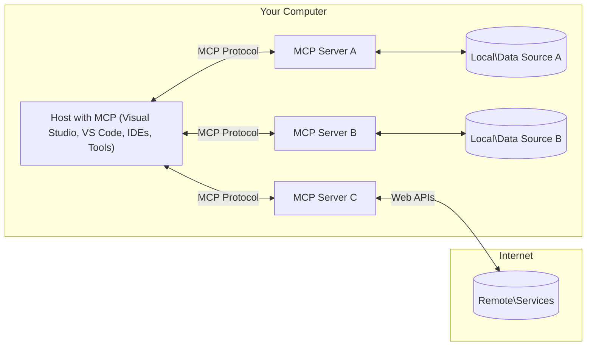

<!--
CO_OP_TRANSLATOR_METADATA:
{
  "original_hash": "904b59de1de9264801242d90a42cdd9d",
  "translation_date": "2025-09-05T10:19:15+00:00",
  "source_file": "01-CoreConcepts/README.md",
  "language_code": "ar"
}
-->
# مفاهيم أساسية في بروتوكول MCP: إتقان بروتوكول سياق النموذج لتكامل الذكاء الاصطناعي

[](https://youtu.be/earDzWGtE84)

_(اضغط على الصورة أعلاه لمشاهدة فيديو الدرس)_

[Model Context Protocol (MCP)](https://github.com/modelcontextprotocol) هو إطار عمل قوي وموحد يهدف إلى تحسين التواصل بين نماذج اللغة الكبيرة (LLMs) والأدوات الخارجية والتطبيقات ومصادر البيانات. 
سيرشدك هذا الدليل لفهم المفاهيم الأساسية لـ MCP. ستتعلم عن بنية العميل-الخادم، المكونات الأساسية، آليات الاتصال، وأفضل الممارسات للتنفيذ.

- **موافقة المستخدم الصريحة**: يتطلب الوصول إلى البيانات وتنفيذ العمليات موافقة صريحة من المستخدم قبل التنفيذ. يجب أن يفهم المستخدم بوضوح البيانات التي سيتم الوصول إليها والإجراءات التي سيتم تنفيذها، مع تحكم دقيق في الأذونات والتصاريح.

- **حماية خصوصية البيانات**: لا يتم الكشف عن بيانات المستخدم إلا بموافقة صريحة، ويجب حمايتها من خلال ضوابط وصول قوية طوال دورة التفاعل. يجب أن تمنع عمليات التنفيذ نقل البيانات غير المصرح به مع الحفاظ على حدود الخصوصية الصارمة.

- **أمان تنفيذ الأدوات**: يتطلب استدعاء أي أداة موافقة صريحة من المستخدم مع فهم واضح لوظيفة الأداة، معاييرها، وتأثيرها المحتمل. يجب أن تمنع الحدود الأمنية القوية تنفيذ الأدوات غير المقصود أو غير الآمن أو الضار.

- **أمان طبقة النقل**: يجب أن تستخدم جميع قنوات الاتصال آليات تشفير ومصادقة مناسبة. يجب أن تنفذ الاتصالات البعيدة بروتوكولات نقل آمنة وإدارة صحيحة للاعتمادات.

#### إرشادات التنفيذ:

- **إدارة الأذونات**: تنفيذ أنظمة أذونات دقيقة تتيح للمستخدمين التحكم في الخوادم والأدوات والموارد التي يمكن الوصول إليها.
- **المصادقة والتفويض**: استخدام طرق مصادقة آمنة (مثل OAuth، مفاتيح API) مع إدارة صحيحة للرموز وانتهاء صلاحيتها.
- **التحقق من المدخلات**: التحقق من جميع المعايير ومدخلات البيانات وفقًا للمخططات المحددة لمنع هجمات الحقن.
- **تسجيل التدقيق**: الاحتفاظ بسجلات شاملة لجميع العمليات لمراقبة الأمان والامتثال.

## نظرة عامة

يستكشف هذا الدرس البنية الأساسية والمكونات التي تشكل نظام Model Context Protocol (MCP). ستتعرف على بنية العميل-الخادم، المكونات الرئيسية، وآليات الاتصال التي تدعم تفاعلات MCP.

## الأهداف التعليمية الرئيسية

بنهاية هذا الدرس، ستتمكن من:

- فهم بنية العميل-الخادم في MCP.
- تحديد أدوار ومسؤوليات المضيفين، العملاء، والخوادم.
- تحليل الميزات الأساسية التي تجعل MCP طبقة تكامل مرنة.
- التعرف على كيفية تدفق المعلومات داخل نظام MCP.
- اكتساب رؤى عملية من خلال أمثلة برمجية في .NET، Java، Python، وJavaScript.

## بنية MCP: نظرة أعمق

يعتمد نظام MCP على نموذج العميل-الخادم. تتيح هذه البنية المعيارية للتطبيقات الذكية التفاعل بكفاءة مع الأدوات، قواعد البيانات، واجهات برمجة التطبيقات، والموارد السياقية. دعونا نحلل هذه البنية إلى مكوناتها الأساسية.

في جوهره، يتبع MCP بنية العميل-الخادم حيث يمكن لتطبيق المضيف الاتصال بعدة خوادم:



- **مضيفو MCP**: برامج مثل VSCode، Claude Desktop، IDEs، أو أدوات الذكاء الاصطناعي التي ترغب في الوصول إلى البيانات عبر MCP.
- **عملاء MCP**: عملاء البروتوكول الذين يحافظون على اتصالات 1:1 مع الخوادم.
- **خوادم MCP**: برامج خفيفة الوزن تكشف عن قدرات محددة من خلال بروتوكول Model Context Protocol الموحد.
- **مصادر البيانات المحلية**: ملفات الكمبيوتر، قواعد البيانات، والخدمات التي يمكن لخوادم MCP الوصول إليها بأمان.
- **الخدمات البعيدة**: الأنظمة الخارجية المتاحة عبر الإنترنت التي يمكن لخوادم MCP الاتصال بها من خلال واجهات برمجة التطبيقات.

بروتوكول MCP هو معيار متطور يستخدم إصدارًا يعتمد على التاريخ (صيغة YYYY-MM-DD). الإصدار الحالي للبروتوكول هو **2025-06-18**. يمكنك الاطلاع على آخر التحديثات في [مواصفات البروتوكول](https://modelcontextprotocol.io/specification/2025-06-18/).

### 1. المضيفون

في بروتوكول Model Context Protocol (MCP)، **المضيفون** هم تطبيقات الذكاء الاصطناعي التي تعمل كواجهة رئيسية يتفاعل المستخدمون من خلالها مع البروتوكول. يقوم المضيفون بتنسيق وإدارة الاتصالات مع خوادم MCP متعددة من خلال إنشاء عملاء MCP مخصصين لكل اتصال خادم. أمثلة على المضيفين تشمل:

- **تطبيقات الذكاء الاصطناعي**: Claude Desktop، Visual Studio Code، Claude Code.
- **بيئات التطوير**: IDEs ومحررات الأكواد التي تدعم تكامل MCP.
- **التطبيقات المخصصة**: وكلاء وأدوات الذكاء الاصطناعي المصممة خصيصًا.

**المضيفون** هم تطبيقات تنسق تفاعلات نماذج الذكاء الاصطناعي. يقومون بـ:

- **تنسيق النماذج الذكية**: تنفيذ أو التفاعل مع نماذج LLMs لتوليد الردود وتنسيق سير العمل.
- **إدارة اتصالات العملاء**: إنشاء وصيانة عميل MCP لكل اتصال خادم MCP.
- **التحكم في واجهة المستخدم**: إدارة تدفق المحادثة، تفاعلات المستخدم، وعرض الردود.
- **فرض الأمان**: التحكم في الأذونات، القيود الأمنية، والمصادقة.
- **إدارة موافقة المستخدم**: التعامل مع موافقة المستخدم لمشاركة البيانات وتنفيذ الأدوات.

### 2. العملاء

**العملاء** هم مكونات أساسية تحافظ على اتصالات مخصصة بين المضيفين وخوادم MCP. يتم إنشاء كل عميل MCP بواسطة المضيف للاتصال بخادم MCP معين، مما يضمن قنوات اتصال منظمة وآمنة. يتيح وجود عملاء متعددين للمضيفين الاتصال بعدة خوادم في نفس الوقت.

**العملاء** هم مكونات الربط داخل تطبيق المضيف. يقومون بـ:

- **التواصل بالبروتوكول**: إرسال طلبات JSON-RPC 2.0 إلى الخوادم مع التعليمات.
- **التفاوض على القدرات**: التفاوض على الميزات المدعومة وإصدارات البروتوكول مع الخوادم أثناء التهيئة.
- **تنفيذ الأدوات**: إدارة طلبات تنفيذ الأدوات من النماذج ومعالجة الردود.
- **التحديثات الفورية**: التعامل مع الإشعارات والتحديثات الفورية من الخوادم.
- **معالجة الردود**: معالجة وتنسيق ردود الخوادم لعرضها على المستخدمين.

### 3. الخوادم

**الخوادم** هي برامج توفر السياق، الأدوات، والقدرات لعملاء MCP. يمكن تشغيلها محليًا (على نفس الجهاز مع المضيف) أو عن بُعد (على منصات خارجية)، وهي مسؤولة عن معالجة طلبات العملاء وتقديم الردود المنظمة. تكشف الخوادم عن وظائف محددة من خلال بروتوكول Model Context Protocol الموحد.

**الخوادم** هي خدمات تقدم السياق والقدرات. تقوم بـ:

- **تسجيل الميزات**: تسجيل وتعريف الموارد، الأدوات، والمحفزات المتاحة للعملاء.
- **معالجة الطلبات**: استقبال وتنفيذ استدعاءات الأدوات، طلبات الموارد، وطلبات المحفزات من العملاء.
- **توفير السياق**: تقديم المعلومات السياقية والبيانات لتحسين استجابات النماذج.
- **إدارة الحالة**: الحفاظ على حالة الجلسة ومعالجة التفاعلات المستمرة عند الحاجة.
- **الإشعارات الفورية**: إرسال إشعارات حول تغييرات القدرات والتحديثات للعملاء المتصلين.

يمكن لأي شخص تطوير خوادم لتوسيع قدرات النماذج بوظائف متخصصة، وهي تدعم سيناريوهات النشر المحلية والبعيدة.

### 4. البدائيات الخدمية

توفر الخوادم في بروتوكول Model Context Protocol (MCP) ثلاث **بدائيات** أساسية تحدد اللبنات الأساسية للتفاعلات الغنية بين العملاء، المضيفين، والنماذج اللغوية. تحدد هذه البدائيات أنواع المعلومات السياقية والإجراءات المتاحة من خلال البروتوكول.

يمكن لخوادم MCP الكشف عن أي مجموعة من البدائيات الأساسية الثلاثة التالية:

#### الموارد

**الموارد** هي مصادر بيانات توفر معلومات سياقية لتطبيقات الذكاء الاصطناعي. تمثل محتوى ثابتًا أو ديناميكيًا يعزز فهم النموذج واتخاذ القرار:

- **البيانات السياقية**: معلومات منظمة وسياق لاستهلاك نماذج الذكاء الاصطناعي.
- **قواعد المعرفة**: مستودعات الوثائق، المقالات، الكتيبات، والأبحاث.
- **مصادر البيانات المحلية**: الملفات، قواعد البيانات، ومعلومات النظام المحلي.
- **البيانات الخارجية**: ردود واجهات برمجة التطبيقات، خدمات الويب، وبيانات الأنظمة البعيدة.
- **المحتوى الديناميكي**: بيانات حية تتحدث بناءً على الظروف الخارجية.

يتم تحديد الموارد بواسطة URIs وتدعم الاكتشاف من خلال طرق `resources/list` والاسترجاع عبر `resources/read`:

```text
file://documents/project-spec.md
database://production/users/schema
api://weather/current
```

#### المحفزات

**المحفزات** هي قوالب قابلة لإعادة الاستخدام تساعد في هيكلة التفاعلات مع النماذج اللغوية. توفر أنماط تفاعل موحدة وسير عمل مهيكل:

- **التفاعلات القائمة على القوالب**: رسائل مسبقة الهيكلة وبدايات المحادثة.
- **قوالب سير العمل**: تسلسلات موحدة للمهام والتفاعلات الشائعة.
- **أمثلة قليلة اللقطات**: قوالب قائمة على الأمثلة لتوجيه النموذج.
- **المحفزات النظامية**: محفزات أساسية تحدد سلوك النموذج والسياق.
- **القوالب الديناميكية**: محفزات ذات معايير قابلة للتكيف مع السياقات المحددة.

تدعم المحفزات استبدال المتغيرات ويمكن اكتشافها عبر `prompts/list` واسترجاعها باستخدام `prompts/get`:

```markdown
Generate a {{task_type}} for {{product}} targeting {{audience}} with the following requirements: {{requirements}}
```

#### الأدوات

**الأدوات** هي وظائف قابلة للتنفيذ يمكن للنماذج الذكية استدعاؤها لأداء إجراءات محددة. تمثل "الأفعال" في نظام MCP، مما يتيح للنماذج التفاعل مع الأنظمة الخارجية:

- **وظائف قابلة للتنفيذ**: عمليات منفصلة يمكن للنماذج استدعاؤها بمعايير محددة.
- **تكامل الأنظمة الخارجية**: استدعاءات واجهات برمجة التطبيقات، استعلامات قواعد البيانات، عمليات الملفات، الحسابات.
- **هوية فريدة**: لكل أداة اسم مميز، وصف، ومخطط معايير.
- **إدخال/إخراج منظم**: تقبل الأدوات معايير تم التحقق منها وتعيد ردودًا منظمة ومحددة.
- **قدرات العمل**: تمكين النماذج من تنفيذ إجراءات حقيقية واسترجاع بيانات حية.

يتم تعريف الأدوات باستخدام JSON Schema للتحقق من المعايير واكتشافها عبر `tools/list` وتنفيذها من خلال `tools/call`:

```typescript
server.tool(
  "search_products", 
  {
    query: z.string().describe("Search query for products"),
    category: z.string().optional().describe("Product category filter"),
    max_results: z.number().default(10).describe("Maximum results to return")
  }, 
  async (params) => {
    // Execute search and return structured results
    return await productService.search(params);
  }
);
```

## بدائيات العميل

في بروتوكول Model Context Protocol (MCP)، يمكن للعملاء الكشف عن بدائيات تمكن الخوادم من طلب قدرات إضافية من تطبيق المضيف. تتيح هذه البدائيات على جانب العميل تنفيذات خوادم أكثر تفاعلية وغنى يمكنها الوصول إلى قدرات النماذج الذكية وتفاعلات المستخدم.

### أخذ العينات

**أخذ العينات** يسمح للخوادم بطلب إكمالات من نماذج اللغة من تطبيق الذكاء الاصطناعي الخاص بالعميل. تمكن هذه البدائية الخوادم من الوصول إلى قدرات LLM دون تضمين تبعيات النماذج الخاصة بها:

- **الوصول المستقل عن النموذج**: يمكن للخوادم طلب الإكمالات دون تضمين SDKs للنماذج أو إدارة الوصول إلى النماذج.
- **الذكاء الاصطناعي المبادر من الخادم**: تمكين الخوادم من إنشاء محتوى بشكل مستقل باستخدام نموذج الذكاء الاصطناعي الخاص بالعميل.
- **تفاعلات LLM المتكررة**: دعم السيناريوهات المعقدة حيث تحتاج الخوادم إلى مساعدة الذكاء الاصطناعي للمعالجة.
- **توليد المحتوى الديناميكي**: السماح للخوادم بإنشاء ردود سياقية باستخدام نموذج المضيف.

يتم بدء أخذ العينات من خلال طريقة `sampling/complete`، حيث ترسل الخوادم طلبات الإكمال إلى العملاء.

### الاستنباط

**الاستنباط** يمكن الخوادم من طلب معلومات إضافية أو تأكيد من المستخدمين عبر واجهة العميل:

- **طلبات إدخال المستخدم**: يمكن للخوادم طلب معلومات إضافية عند الحاجة لتنفيذ الأدوات.
- **حوارات التأكيد**: طلب موافقة المستخدم على العمليات الحساسة أو ذات التأثير الكبير.
- **سير العمل التفاعلي**: تمكين الخوادم من إنشاء تفاعلات خطوة بخطوة مع المستخدم.
- **جمع المعايير الديناميكية**: جمع المعايير المفقودة أو الاختيارية أثناء تنفيذ الأدوات.

تتم طلبات الاستنباط باستخدام طريقة `elicitation/request` لجمع إدخال المستخدم عبر واجهة العميل.

### التسجيل

**التسجيل** يسمح للخوادم بإرسال رسائل سجل منظمة إلى العملاء لأغراض التصحيح، المراقبة، ورؤية العمليات:

- **دعم التصحيح**: تمكين الخوادم من توفير سجلات تنفيذ مفصلة لاستكشاف الأخطاء وإصلاحها.
- **مراقبة العمليات**: إرسال تحديثات الحالة ومقاييس الأداء إلى العملاء.
- **الإبلاغ عن الأخطاء**: توفير سياق خطأ مفصل ومعلومات تشخيصية.
- **مسارات التدقيق**: إنشاء سجلات شاملة لعمليات الخادم وقراراته.

يتم إرسال رسائل التسجيل إلى العملاء لتوفير الشفافية في عمليات الخادم وتسهيل التصحيح.

## تدفق المعلومات في MCP

يحدد بروتوكول Model Context Protocol (MCP) تدفقًا منظمًا للمعلومات بين المضيفين، العملاء، الخوادم، والنماذج. يساعد فهم هذا التدفق على توضيح كيفية معالجة طلبات المستخدم وكيفية دمج الأدوات والبيانات الخارجية في استجابات النماذج.

- **المضيف يبدأ الاتصال**  
  يقوم تطبيق المضيف (مثل IDE أو واجهة محادثة) بإنشاء اتصال بخادم MCP، عادةً عبر STDIO، WebSocket، أو وسيلة نقل مدعومة أخرى.

- **التفاوض على القدرات**  
  يتبادل العميل (المضمن في المضيف) والخادم معلومات حول الميزات المدعومة، الأدوات، الموارد، وإصدارات البروتوكول. يضمن هذا التبادل فهم كلا الجانبين للقدرات المتاحة للجلسة.

- **طلب المستخدم**  
  يتفاعل المستخدم مع المضيف (على سبيل المثال، يدخل طلبًا أو أمرًا). يجمع المضيف هذا الإدخال ويمرره إلى العميل للمعالجة.

- **استخدام الموارد أو الأدوات**  
  - قد يطلب العميل سياقًا إضافيًا أو موارد من الخادم (مثل الملفات، إدخالات قاعدة البيانات، أو مقالات قاعدة المعرفة) لتعزيز فهم النموذج.
  - إذا قرر النموذج أن أداة مطلوبة (على سبيل المثال، لجلب البيانات، إجراء حساب، أو استدعاء API)، يرسل العميل طلب استدعاء أداة إلى الخادم، محددًا اسم الأداة والمعايير.

- **تنفيذ الخادم**  
  يستقبل الخادم طلب المورد أو الأداة، ينفذ العمليات اللازمة (مثل تشغيل وظيفة، استعلام قاعدة بيانات، أو استرجاع ملف)، ويعيد النتائج إلى العميل بتنسيق منظم.

- **توليد الاستجابة**  
  يدمج العميل ردود الخادم (بيانات الموارد، مخرجات الأدوات، إلخ) في التفاعل الجاري مع النموذج. يستخدم النموذج هذه المعلومات لتوليد استجابة شاملة وذات صلة بالسياق.

- **عرض النتيجة**  
  يستقبل المضيف الإخراج النهائي من العميل ويعرضه على المستخدم، غالبًا بما في ذلك النص الذي أنشأه النموذج وأي نتائج من تنفيذ الأدوات أو استرجاع الموارد.

يمكّن هذا التدفق MCP من دعم تطبيقات الذكاء الاصطناعي المتقدمة، التفاعلية، والواعية بالسياق من خلال ربط النماذج بسلاسة مع الأدوات والبيانات الخارجية.

## بنية البروتوكول والطبقات

يتكون MCP من طبقتين معماريتين متميزتين تعملان معًا لتوفير إطار عمل اتصال كامل:

### طبقة البيانات

تقوم **طبقة البيانات** بتنفيذ بروتوكول MCP الأساسي باستخدام **JSON-RPC 2.0** كأساس لها. تحدد هذه الطبقة بنية الرسائل، الدلالات، وأنماط التفاعل:

#### المكونات الأساسية:
- **بروتوكول JSON-RPC 2.0**: يتم استخدام تنسيق الرسائل الموحد JSON-RPC 2.0 لجميع استدعاءات الطرق، الردود، والإشعارات.
- **إدارة دورة الحياة**: يتولى تهيئة الاتصال، التفاوض على القدرات، وإنهاء الجلسات بين العملاء والخوادم.
- **الوظائف الأساسية للخادم**: تمكّن الخوادم من تقديم الوظائف الأساسية من خلال الأدوات، الموارد، والقوالب.
- **الوظائف الأساسية للعميل**: تمكّن الخوادم من طلب عينات من نماذج اللغة الكبيرة (LLMs)، استدعاء إدخال المستخدم، وإرسال رسائل السجل.
- **الإشعارات الفورية**: تدعم الإشعارات غير المتزامنة لتحديثات ديناميكية دون الحاجة إلى الاستعلام المستمر.

#### الميزات الرئيسية:

- **تفاوض إصدار البروتوكول**: يستخدم إصدارًا يعتمد على التاريخ (YYYY-MM-DD) لضمان التوافق.
- **اكتشاف القدرات**: يتبادل العملاء والخوادم معلومات الميزات المدعومة أثناء التهيئة.
- **الجلسات ذات الحالة**: يحافظ على حالة الاتصال عبر تفاعلات متعددة لضمان استمرارية السياق.

### طبقة النقل

تدير **طبقة النقل** قنوات الاتصال، تأطير الرسائل، والمصادقة بين المشاركين في بروتوكول MCP:

#### آليات النقل المدعومة:

1. **نقل STDIO**:
   - يستخدم تدفقات الإدخال/الإخراج القياسية للتواصل المباشر بين العمليات.
   - مثالي للعمليات المحلية على نفس الجهاز دون أي عبء شبكي.
   - يُستخدم بشكل شائع في تنفيذات خوادم MCP المحلية.

2. **نقل HTTP القابل للبث**:
   - يستخدم HTTP POST للرسائل من العميل إلى الخادم.
   - يدعم أحداث الخادم المرسلة (SSE) اختياريًا للبث من الخادم إلى العميل.
   - يتيح الاتصال بالخوادم البعيدة عبر الشبكات.
   - يدعم مصادقة HTTP القياسية (رموز التوكين، مفاتيح API، رؤوس مخصصة).
   - يوصي بروتوكول MCP باستخدام OAuth للمصادقة الآمنة القائمة على الرموز.

#### تجريد النقل:

تجرد طبقة النقل تفاصيل الاتصال عن طبقة البيانات، مما يتيح استخدام نفس تنسيق الرسائل JSON-RPC 2.0 عبر جميع آليات النقل. يتيح هذا التجريد للتطبيقات التبديل بسهولة بين الخوادم المحلية والبعيدة.

### اعتبارات الأمان

يجب أن تلتزم تنفيذات MCP بعدة مبادئ أمان حاسمة لضمان تفاعلات آمنة وموثوقة عبر جميع عمليات البروتوكول:

- **موافقة المستخدم والتحكم**: يجب أن يقدم المستخدمون موافقة صريحة قبل الوصول إلى أي بيانات أو تنفيذ أي عمليات. يجب أن يكون لديهم تحكم واضح في البيانات التي تتم مشاركتها والإجراءات المصرح بها، مدعومة بواجهات مستخدم بديهية لمراجعة الأنشطة والموافقة عليها.

- **خصوصية البيانات**: يجب ألا يتم الكشف عن بيانات المستخدم إلا بموافقة صريحة، ويجب حمايتها من خلال ضوابط وصول مناسبة. يجب أن تضمن تنفيذات MCP الحماية من نقل البيانات غير المصرح به والحفاظ على الخصوصية طوال جميع التفاعلات.

- **أمان الأدوات**: قبل استدعاء أي أداة، يجب الحصول على موافقة صريحة من المستخدم. يجب أن يكون لدى المستخدمين فهم واضح لوظيفة كل أداة، ويجب فرض حدود أمان قوية لمنع تنفيذ الأدوات غير المقصود أو غير الآمن.

من خلال اتباع هذه المبادئ الأمنية، يضمن بروتوكول MCP الحفاظ على ثقة المستخدم، الخصوصية، والأمان عبر جميع التفاعلات مع تمكين تكاملات الذكاء الاصطناعي القوية.

## أمثلة على الأكواد: المكونات الرئيسية

فيما يلي أمثلة على الأكواد بلغات برمجة شائعة توضح كيفية تنفيذ مكونات خادم MCP الرئيسية والأدوات.

### مثال .NET: إنشاء خادم MCP بسيط مع أدوات

فيما يلي مثال عملي بلغة .NET يوضح كيفية تنفيذ خادم MCP بسيط مع أدوات مخصصة. يعرض هذا المثال كيفية تعريف الأدوات وتسجيلها، معالجة الطلبات، وربط الخادم باستخدام بروتوكول Model Context Protocol.

```csharp
using System;
using System.Threading.Tasks;
using ModelContextProtocol.Server;
using ModelContextProtocol.Server.Transport;
using ModelContextProtocol.Server.Tools;

public class WeatherServer
{
    public static async Task Main(string[] args)
    {
        // Create an MCP server
        var server = new McpServer(
            name: "Weather MCP Server",
            version: "1.0.0"
        );
        
        // Register our custom weather tool
        server.AddTool<string, WeatherData>("weatherTool", 
            description: "Gets current weather for a location",
            execute: async (location) => {
                // Call weather API (simplified)
                var weatherData = await GetWeatherDataAsync(location);
                return weatherData;
            });
        
        // Connect the server using stdio transport
        var transport = new StdioServerTransport();
        await server.ConnectAsync(transport);
        
        Console.WriteLine("Weather MCP Server started");
        
        // Keep the server running until process is terminated
        await Task.Delay(-1);
    }
    
    private static async Task<WeatherData> GetWeatherDataAsync(string location)
    {
        // This would normally call a weather API
        // Simplified for demonstration
        await Task.Delay(100); // Simulate API call
        return new WeatherData { 
            Temperature = 72.5,
            Conditions = "Sunny",
            Location = location
        };
    }
}

public class WeatherData
{
    public double Temperature { get; set; }
    public string Conditions { get; set; }
    public string Location { get; set; }
}
```

### مثال Java: مكونات خادم MCP

يوضح هذا المثال نفس خادم MCP وتسجيل الأدوات كما في المثال السابق بلغة .NET، ولكن تم تنفيذه بلغة Java.

```java
import io.modelcontextprotocol.server.McpServer;
import io.modelcontextprotocol.server.McpToolDefinition;
import io.modelcontextprotocol.server.transport.StdioServerTransport;
import io.modelcontextprotocol.server.tool.ToolExecutionContext;
import io.modelcontextprotocol.server.tool.ToolResponse;

public class WeatherMcpServer {
    public static void main(String[] args) throws Exception {
        // Create an MCP server
        McpServer server = McpServer.builder()
            .name("Weather MCP Server")
            .version("1.0.0")
            .build();
            
        // Register a weather tool
        server.registerTool(McpToolDefinition.builder("weatherTool")
            .description("Gets current weather for a location")
            .parameter("location", String.class)
            .execute((ToolExecutionContext ctx) -> {
                String location = ctx.getParameter("location", String.class);
                
                // Get weather data (simplified)
                WeatherData data = getWeatherData(location);
                
                // Return formatted response
                return ToolResponse.content(
                    String.format("Temperature: %.1f°F, Conditions: %s, Location: %s", 
                    data.getTemperature(), 
                    data.getConditions(), 
                    data.getLocation())
                );
            })
            .build());
        
        // Connect the server using stdio transport
        try (StdioServerTransport transport = new StdioServerTransport()) {
            server.connect(transport);
            System.out.println("Weather MCP Server started");
            // Keep server running until process is terminated
            Thread.currentThread().join();
        }
    }
    
    private static WeatherData getWeatherData(String location) {
        // Implementation would call a weather API
        // Simplified for example purposes
        return new WeatherData(72.5, "Sunny", location);
    }
}

class WeatherData {
    private double temperature;
    private String conditions;
    private String location;
    
    public WeatherData(double temperature, String conditions, String location) {
        this.temperature = temperature;
        this.conditions = conditions;
        this.location = location;
    }
    
    public double getTemperature() {
        return temperature;
    }
    
    public String getConditions() {
        return conditions;
    }
    
    public String getLocation() {
        return location;
    }
}
```

### مثال Python: بناء خادم MCP

يستخدم هذا المثال مكتبة fastmcp، لذا يرجى التأكد من تثبيتها أولاً:

```python
pip install fastmcp
```
عينة الكود:

```python
#!/usr/bin/env python3
import asyncio
from fastmcp import FastMCP
from fastmcp.transports.stdio import serve_stdio

# Create a FastMCP server
mcp = FastMCP(
    name="Weather MCP Server",
    version="1.0.0"
)

@mcp.tool()
def get_weather(location: str) -> dict:
    """Gets current weather for a location."""
    return {
        "temperature": 72.5,
        "conditions": "Sunny",
        "location": location
    }

# Alternative approach using a class
class WeatherTools:
    @mcp.tool()
    def forecast(self, location: str, days: int = 1) -> dict:
        """Gets weather forecast for a location for the specified number of days."""
        return {
            "location": location,
            "forecast": [
                {"day": i+1, "temperature": 70 + i, "conditions": "Partly Cloudy"}
                for i in range(days)
            ]
        }

# Register class tools
weather_tools = WeatherTools()

# Start the server
if __name__ == "__main__":
    asyncio.run(serve_stdio(mcp))
```

### مثال JavaScript: إنشاء خادم MCP

يوضح هذا المثال كيفية إنشاء خادم MCP بلغة JavaScript وكيفية تسجيل أداتين متعلقتين بالطقس.

```javascript
// Using the official Model Context Protocol SDK
import { McpServer } from "@modelcontextprotocol/sdk/server/mcp.js";
import { StdioServerTransport } from "@modelcontextprotocol/sdk/server/stdio.js";
import { z } from "zod"; // For parameter validation

// Create an MCP server
const server = new McpServer({
  name: "Weather MCP Server",
  version: "1.0.0"
});

// Define a weather tool
server.tool(
  "weatherTool",
  {
    location: z.string().describe("The location to get weather for")
  },
  async ({ location }) => {
    // This would normally call a weather API
    // Simplified for demonstration
    const weatherData = await getWeatherData(location);
    
    return {
      content: [
        { 
          type: "text", 
          text: `Temperature: ${weatherData.temperature}°F, Conditions: ${weatherData.conditions}, Location: ${weatherData.location}` 
        }
      ]
    };
  }
);

// Define a forecast tool
server.tool(
  "forecastTool",
  {
    location: z.string(),
    days: z.number().default(3).describe("Number of days for forecast")
  },
  async ({ location, days }) => {
    // This would normally call a weather API
    // Simplified for demonstration
    const forecast = await getForecastData(location, days);
    
    return {
      content: [
        { 
          type: "text", 
          text: `${days}-day forecast for ${location}: ${JSON.stringify(forecast)}` 
        }
      ]
    };
  }
);

// Helper functions
async function getWeatherData(location) {
  // Simulate API call
  return {
    temperature: 72.5,
    conditions: "Sunny",
    location: location
  };
}

async function getForecastData(location, days) {
  // Simulate API call
  return Array.from({ length: days }, (_, i) => ({
    day: i + 1,
    temperature: 70 + Math.floor(Math.random() * 10),
    conditions: i % 2 === 0 ? "Sunny" : "Partly Cloudy"
  }));
}

// Connect the server using stdio transport
const transport = new StdioServerTransport();
server.connect(transport).catch(console.error);

console.log("Weather MCP Server started");
```

يوضح هذا المثال بلغة JavaScript كيفية إنشاء عميل MCP يتصل بخادم، يرسل طلبًا، ويعالج الرد بما في ذلك أي استدعاءات أدوات تم تنفيذها.

## الأمان والتفويض

يتضمن بروتوكول MCP عدة مفاهيم وآليات مدمجة لإدارة الأمان والتفويض عبر البروتوكول:

1. **التحكم في أذونات الأدوات**:  
   يمكن للعملاء تحديد الأدوات التي يُسمح للنموذج باستخدامها أثناء الجلسة. يضمن ذلك أن الأدوات المصرح بها فقط هي التي تكون متاحة، مما يقلل من مخاطر العمليات غير المقصودة أو غير الآمنة. يمكن تكوين الأذونات ديناميكيًا بناءً على تفضيلات المستخدم، سياسات المؤسسة، أو سياق التفاعل.

2. **المصادقة**:  
   يمكن للخوادم طلب المصادقة قبل منح الوصول إلى الأدوات، الموارد، أو العمليات الحساسة. قد يشمل ذلك مفاتيح API، رموز OAuth، أو مخططات مصادقة أخرى. تضمن المصادقة الصحيحة أن العملاء والمستخدمين الموثوق بهم فقط يمكنهم استدعاء القدرات على جانب الخادم.

3. **التحقق**:  
   يتم فرض التحقق من المعلمات لجميع استدعاءات الأدوات. تحدد كل أداة الأنواع، التنسيقات، والقيود المتوقعة لمعلماتها، ويتحقق الخادم من الطلبات الواردة وفقًا لذلك. يمنع ذلك الإدخال غير الصحيح أو الضار من الوصول إلى تنفيذات الأدوات ويساعد في الحفاظ على سلامة العمليات.

4. **تحديد المعدل**:  
   لمنع إساءة الاستخدام وضمان الاستخدام العادل لموارد الخادم، يمكن لخوادم MCP تنفيذ تحديد المعدل لاستدعاءات الأدوات والوصول إلى الموارد. يمكن تطبيق حدود المعدل لكل مستخدم، لكل جلسة، أو عالميًا، وتساعد في الحماية من هجمات حجب الخدمة أو الاستهلاك المفرط للموارد.

من خلال الجمع بين هذه الآليات، يوفر بروتوكول MCP أساسًا آمنًا لتكامل نماذج اللغة مع الأدوات والموارد الخارجية، مع منح المستخدمين والمطورين تحكمًا دقيقًا في الوصول والاستخدام.

## رسائل البروتوكول وتدفق الاتصال

تستخدم اتصالات MCP رسائل **JSON-RPC 2.0** المهيكلة لتسهيل التفاعلات الواضحة والموثوقة بين المضيفين، العملاء، والخوادم. يعرف البروتوكول أنماط رسائل محددة لأنواع مختلفة من العمليات:

### أنواع الرسائل الأساسية:

#### **رسائل التهيئة**
- **طلب `initialize`**: ينشئ الاتصال ويتفاوض على إصدار البروتوكول والقدرات.
- **رد `initialize`**: يؤكد الميزات المدعومة ومعلومات الخادم.  
- **`notifications/initialized`**: يشير إلى اكتمال التهيئة وأن الجلسة جاهزة.

#### **رسائل الاكتشاف**
- **طلب `tools/list`**: يكتشف الأدوات المتاحة من الخادم.
- **طلب `resources/list`**: يسرد الموارد المتاحة (مصادر البيانات).
- **طلب `prompts/list`**: يسترجع قوالب الطلبات المتاحة.

#### **رسائل التنفيذ**  
- **طلب `tools/call`**: ينفذ أداة معينة مع المعلمات المقدمة.
- **طلب `resources/read`**: يسترجع محتوى من مورد معين.
- **طلب `prompts/get`**: يجلب قالب طلب مع معلمات اختيارية.

#### **رسائل العميل**
- **طلب `sampling/complete`**: يطلب الخادم إكمال نموذج اللغة من العميل.
- **`elicitation/request`**: يطلب الخادم إدخال المستخدم عبر واجهة العميل.
- **رسائل السجل**: يرسل الخادم رسائل سجل مهيكلة إلى العميل.

#### **رسائل الإشعار**
- **`notifications/tools/list_changed`**: يخطر الخادم العميل بتغييرات الأدوات.
- **`notifications/resources/list_changed`**: يخطر الخادم العميل بتغييرات الموارد.  
- **`notifications/prompts/list_changed`**: يخطر الخادم العميل بتغييرات القوالب.

### هيكل الرسائل:

تتبع جميع رسائل MCP تنسيق JSON-RPC 2.0 مع:
- **رسائل الطلب**: تتضمن `id`، `method`، ومعلمات اختيارية.
- **رسائل الرد**: تتضمن `id` و`result` أو `error`.  
- **رسائل الإشعار**: تتضمن `method` ومعلمات اختيارية (لا تتطلب `id` أو ردًا).

يضمن هذا الاتصال المهيكل تفاعلات موثوقة، قابلة للتتبع، وقابلة للتوسيع تدعم سيناريوهات متقدمة مثل التحديثات الفورية، تسلسل الأدوات، ومعالجة الأخطاء القوية.

## النقاط الرئيسية

- **الهيكلية**: يستخدم بروتوكول MCP هيكلية العميل-الخادم حيث يدير المضيفون اتصالات متعددة بين العملاء والخوادم.
- **المشاركون**: يشمل النظام البيئي المضيفين (تطبيقات الذكاء الاصطناعي)، العملاء (موصلات البروتوكول)، والخوادم (مزودي القدرات).
- **آليات النقل**: يدعم الاتصال STDIO (محلي) وHTTP القابل للبث مع SSE اختياري (بعيد).
- **الوظائف الأساسية**: تكشف الخوادم عن الأدوات (وظائف قابلة للتنفيذ)، الموارد (مصادر البيانات)، والقوالب (النماذج).
- **الوظائف الأساسية للعميل**: يمكن للخوادم طلب العينات (إكمالات LLM)، الاستدعاء (إدخال المستخدم)، وتسجيل السجلات من العملاء.
- **أساس البروتوكول**: يعتمد على JSON-RPC 2.0 مع إصدار يعتمد على التاريخ (الحالي: 2025-06-18).
- **القدرات الفورية**: يدعم الإشعارات للتحديثات الديناميكية والمزامنة الفورية.
- **الأمان أولاً**: تتطلب موافقة المستخدم الصريحة، حماية خصوصية البيانات، والنقل الآمن.

## تمرين

صمم أداة MCP بسيطة تكون مفيدة في مجالك. حدد:
1. اسم الأداة.
2. المعلمات التي ستقبلها.
3. المخرجات التي ستعيدها.
4. كيف يمكن للنموذج استخدام هذه الأداة لحل مشاكل المستخدم.

---

## ما التالي

التالي: [الفصل 2: الأمان](../02-Security/README.md)

---

**إخلاء المسؤولية**:  
تمت ترجمة هذا المستند باستخدام خدمة الترجمة الآلية [Co-op Translator](https://github.com/Azure/co-op-translator). بينما نسعى لتحقيق الدقة، يرجى العلم أن الترجمات الآلية قد تحتوي على أخطاء أو معلومات غير دقيقة. يجب اعتبار المستند الأصلي بلغته الأصلية هو المصدر الموثوق. للحصول على معلومات حساسة أو هامة، يُوصى بالاستعانة بترجمة بشرية احترافية. نحن غير مسؤولين عن أي سوء فهم أو تفسيرات خاطئة تنشأ عن استخدام هذه الترجمة.