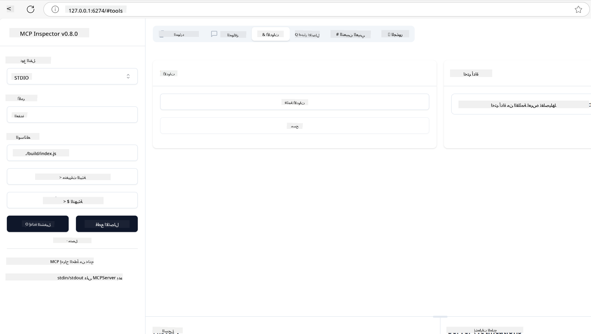
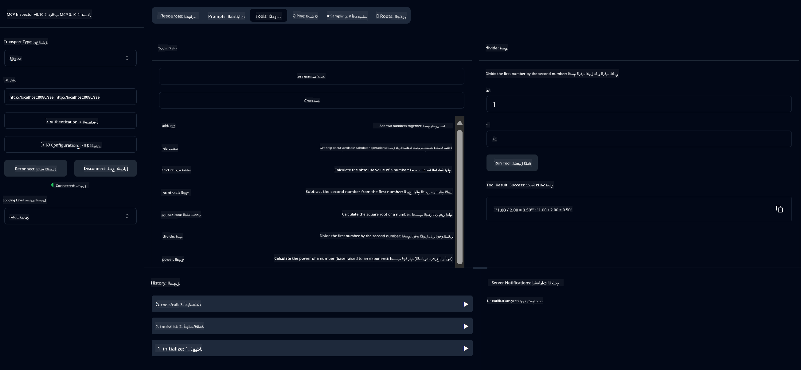
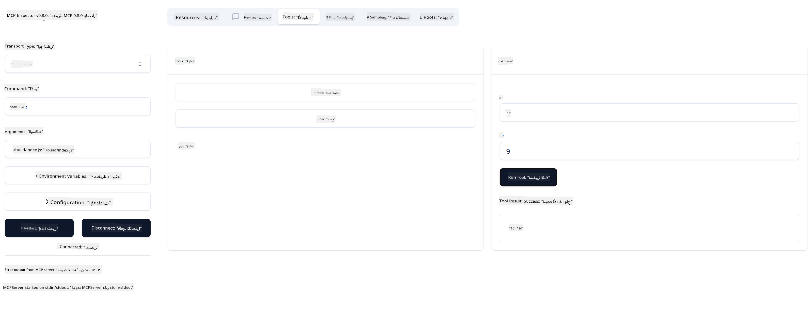

<!--
CO_OP_TRANSLATOR_METADATA:
{
  "original_hash": "ec11ee93f31fdadd94facd3e3d22f9e6",
  "translation_date": "2025-09-09T21:23:54+00:00",
  "source_file": "03-GettingStarted/01-first-server/README.md",
  "language_code": "ar"
}
-->
# البدء مع MCP

مرحبًا بك في خطواتك الأولى مع بروتوكول سياق النموذج (MCP)! سواء كنت جديدًا على MCP أو تسعى لتعميق فهمك، سيرشدك هذا الدليل خلال عملية الإعداد والتطوير الأساسية. ستكتشف كيف يتيح MCP التكامل السلس بين نماذج الذكاء الاصطناعي والتطبيقات، وستتعلم كيفية تجهيز بيئتك بسرعة لبناء واختبار الحلول المدعومة بـ MCP.

> ملخص سريع: إذا كنت تبني تطبيقات ذكاء اصطناعي، فأنت تعلم أنه يمكنك إضافة أدوات وموارد أخرى إلى النموذج اللغوي الكبير (LLM) لجعله أكثر معرفة. ولكن إذا وضعت هذه الأدوات والموارد على خادم، يمكن استخدام قدرات التطبيق والخادم من قبل أي عميل مع أو بدون LLM.

## نظرة عامة

تقدم هذه الدرس إرشادات عملية حول إعداد بيئات MCP وبناء تطبيقات MCP الأولى. ستتعلم كيفية إعداد الأدوات والأطر اللازمة، بناء خوادم MCP الأساسية، إنشاء تطبيقات مضيفة، واختبار تنفيذاتك.

بروتوكول سياق النموذج (MCP) هو بروتوكول مفتوح يحدد كيفية توفير التطبيقات للسياق للنماذج اللغوية الكبيرة (LLMs). فكر في MCP كأنه منفذ USB-C لتطبيقات الذكاء الاصطناعي - يوفر طريقة موحدة لتوصيل نماذج الذكاء الاصطناعي بمصادر البيانات والأدوات المختلفة.

## أهداف التعلم

بنهاية هذا الدرس، ستكون قادرًا على:

- إعداد بيئات التطوير لـ MCP باستخدام C#، Java، Python، TypeScript، وRust
- بناء ونشر خوادم MCP الأساسية بميزات مخصصة (الموارد، المطالبات، والأدوات)
- إنشاء تطبيقات مضيفة تتصل بخوادم MCP
- اختبار وتصحيح تنفيذات MCP

## إعداد بيئة MCP الخاصة بك

قبل البدء في العمل مع MCP، من المهم تجهيز بيئة التطوير وفهم سير العمل الأساسي. ستوجهك هذه القسم خلال خطوات الإعداد الأولية لضمان بداية سلسة مع MCP.

### المتطلبات الأساسية

قبل الغوص في تطوير MCP، تأكد من توفر:

- **بيئة تطوير**: للغة التي اخترتها (C#، Java، Python، TypeScript، أو Rust)
- **IDE/محرر**: Visual Studio، Visual Studio Code، IntelliJ، Eclipse، PyCharm، أو أي محرر حديث
- **مديري الحزم**: NuGet، Maven/Gradle، pip، npm/yarn، أو Cargo
- **مفاتيح API**: لأي خدمات ذكاء اصطناعي تخطط لاستخدامها في تطبيقاتك المضيفة

## هيكل خادم MCP الأساسي

عادةً ما يتضمن خادم MCP:

- **إعدادات الخادم**: إعداد المنفذ، المصادقة، والإعدادات الأخرى
- **الموارد**: البيانات والسياق المتاح للنماذج اللغوية الكبيرة
- **الأدوات**: الوظائف التي يمكن للنماذج استدعاؤها
- **المطالبات**: قوالب لإنشاء النصوص أو هيكلتها

إليك مثال مبسط بلغة TypeScript:

```typescript
import { McpServer, ResourceTemplate } from "@modelcontextprotocol/sdk/server/mcp.js";
import { StdioServerTransport } from "@modelcontextprotocol/sdk/server/stdio.js";
import { z } from "zod";

// Create an MCP server
const server = new McpServer({
  name: "Demo",
  version: "1.0.0"
});

// Add an addition tool
server.tool("add",
  { a: z.number(), b: z.number() },
  async ({ a, b }) => ({
    content: [{ type: "text", text: String(a + b) }]
  })
);

// Add a dynamic greeting resource
server.resource(
  "file",
  // The 'list' parameter controls how the resource lists available files. Setting it to undefined disables listing for this resource.
  new ResourceTemplate("file://{path}", { list: undefined }),
  async (uri, { path }) => ({
    contents: [{
      uri: uri.href,
      text: `File, ${path}!`
    }]
  })
);

// Add a file resource that reads the file contents
server.resource(
  "file",
  new ResourceTemplate("file://{path}", { list: undefined }),
  async (uri, { path }) => {
    let text;
    try {
      text = await fs.readFile(path, "utf8");
    } catch (err) {
      text = `Error reading file: ${err.message}`;
    }
    return {
      contents: [{
        uri: uri.href,
        text
      }]
    };
  }
);

server.prompt(
  "review-code",
  { code: z.string() },
  ({ code }) => ({
    messages: [{
      role: "user",
      content: {
        type: "text",
        text: `Please review this code:\n\n${code}`
      }
    }]
  })
);

// Start receiving messages on stdin and sending messages on stdout
const transport = new StdioServerTransport();
await server.connect(transport);
```

في الكود السابق قمنا بـ:

- استيراد الفئات اللازمة من SDK الخاص بـ MCP بلغة TypeScript.
- إنشاء وتكوين مثيل جديد لخادم MCP.
- تسجيل أداة مخصصة (`calculator`) مع وظيفة معالجة.
- بدء تشغيل الخادم للاستماع إلى طلبات MCP الواردة.

## الاختبار وتصحيح الأخطاء

قبل البدء في اختبار خادم MCP الخاص بك، من المهم فهم الأدوات المتاحة وأفضل الممارسات لتصحيح الأخطاء. يضمن الاختبار الفعال أن يتصرف الخادم كما هو متوقع ويساعدك على تحديد المشكلات وحلها بسرعة. يوضح القسم التالي النهج الموصى بها للتحقق من تنفيذ MCP الخاص بك.

يوفر MCP أدوات لمساعدتك في اختبار وتصحيح أخطاء خوادمك:

- **أداة المفتش**، واجهة رسومية تسمح لك بالاتصال بالخادم واختبار الأدوات، المطالبات، والموارد.
- **curl**، يمكنك أيضًا الاتصال بالخادم باستخدام أداة سطر الأوامر مثل curl أو عملاء آخرين يمكنهم إنشاء وتشغيل أوامر HTTP.

### استخدام MCP Inspector

[مفتش MCP](https://github.com/modelcontextprotocol/inspector) هو أداة اختبار مرئية تساعدك على:

1. **اكتشاف قدرات الخادم**: الكشف التلقائي عن الموارد، الأدوات، والمطالبات المتاحة
2. **اختبار تنفيذ الأدوات**: تجربة معلمات مختلفة ورؤية الردود في الوقت الفعلي
3. **عرض بيانات الخادم الوصفية**: فحص معلومات الخادم، المخططات، والإعدادات

```bash
# ex TypeScript, installing and running MCP Inspector
npx @modelcontextprotocol/inspector node build/index.js
```

عند تشغيل الأوامر أعلاه، سيطلق مفتش MCP واجهة ويب محلية في متصفحك. يمكنك توقع رؤية لوحة عرض تعرض خوادم MCP المسجلة، الأدوات، الموارد، والمطالبات المتاحة. تتيح لك الواجهة اختبار تنفيذ الأدوات بشكل تفاعلي، فحص بيانات الخادم الوصفية، وعرض الردود في الوقت الفعلي، مما يسهل التحقق وتصحيح أخطاء تنفيذات خادم MCP الخاصة بك.

إليك لقطة شاشة لما يمكن أن يبدو عليه:



## مشكلات الإعداد الشائعة وحلولها

| المشكلة | الحل المحتمل |
|---------|--------------|
| رفض الاتصال | تحقق مما إذا كان الخادم يعمل والمنفذ صحيح |
| أخطاء تنفيذ الأدوات | راجع التحقق من صحة المعلمات ومعالجة الأخطاء |
| فشل المصادقة | تحقق من صحة مفاتيح API والأذونات |
| أخطاء التحقق من المخطط | تأكد من تطابق المعلمات مع المخطط المحدد |
| عدم بدء تشغيل الخادم | تحقق من تعارض المنافذ أو التبعيات المفقودة |
| أخطاء CORS | قم بتكوين رؤوس CORS المناسبة لطلبات الأصل المتقاطع |
| مشكلات المصادقة | تحقق من صلاحية الرموز والأذونات |

## التطوير المحلي

للتطوير والاختبار المحلي، يمكنك تشغيل خوادم MCP مباشرة على جهازك:

1. **بدء عملية الخادم**: قم بتشغيل تطبيق خادم MCP الخاص بك
2. **تكوين الشبكات**: تأكد من أن الخادم يمكن الوصول إليه على المنفذ المتوقع
3. **اتصال العملاء**: استخدم عناوين URL للاتصال المحلي مثل `http://localhost:3000`

```bash
# Example: Running a TypeScript MCP server locally
npm run start
# Server running at http://localhost:3000
```

## بناء أول خادم MCP الخاص بك

لقد غطينا [المفاهيم الأساسية](/01-CoreConcepts/README.md) في درس سابق، والآن حان الوقت لتطبيق تلك المعرفة عمليًا.

### ما يمكن أن يفعله الخادم

قبل أن نبدأ في كتابة الكود، دعونا نذكر أنفسنا بما يمكن أن يفعله الخادم:

يمكن لخادم MCP على سبيل المثال:

- الوصول إلى الملفات وقواعد البيانات المحلية
- الاتصال بـ APIs عن بعد
- إجراء العمليات الحسابية
- التكامل مع الأدوات والخدمات الأخرى
- توفير واجهة مستخدم للتفاعل

رائع، الآن بعد أن عرفنا ما يمكننا القيام به، دعونا نبدأ في كتابة الكود.

## تمرين: إنشاء خادم

لإنشاء خادم، تحتاج إلى اتباع الخطوات التالية:

- تثبيت SDK الخاص بـ MCP.
- إنشاء مشروع وإعداد هيكل المشروع.
- كتابة كود الخادم.
- اختبار الخادم.

### -1- إنشاء المشروع

#### TypeScript

```sh
# Create project directory and initialize npm project
mkdir calculator-server
cd calculator-server
npm init -y
```

#### Python

```sh
# Create project dir
mkdir calculator-server
cd calculator-server
# Open the folder in Visual Studio Code - Skip this if you are using a different IDE
code .
```

#### .NET

```sh
dotnet new console -n McpCalculatorServer
cd McpCalculatorServer
```

#### Java

لـ Java، قم بإنشاء مشروع Spring Boot:

```bash
curl https://start.spring.io/starter.zip \
  -d dependencies=web \
  -d javaVersion=21 \
  -d type=maven-project \
  -d groupId=com.example \
  -d artifactId=calculator-server \
  -d name=McpServer \
  -d packageName=com.microsoft.mcp.sample.server \
  -o calculator-server.zip
```

استخراج ملف zip:

```bash
unzip calculator-server.zip -d calculator-server
cd calculator-server
# optional remove the unused test
rm -rf src/test/java
```

أضف التكوين الكامل التالي إلى ملف *pom.xml* الخاص بك:

```xml
<?xml version="1.0" encoding="UTF-8"?>
<project xmlns="http://maven.apache.org/POM/4.0.0"
    xmlns:xsi="http://www.w3.org/2001/XMLSchema-instance"
    xsi:schemaLocation="http://maven.apache.org/POM/4.0.0 http://maven.apache.org/xsd/maven-4.0.0.xsd">
    <modelVersion>4.0.0</modelVersion>
    
    <!-- Spring Boot parent for dependency management -->
    <parent>
        <groupId>org.springframework.boot</groupId>
        <artifactId>spring-boot-starter-parent</artifactId>
        <version>3.5.0</version>
        <relativePath />
    </parent>

    <!-- Project coordinates -->
    <groupId>com.example</groupId>
    <artifactId>calculator-server</artifactId>
    <version>0.0.1-SNAPSHOT</version>
    <name>Calculator Server</name>
    <description>Basic calculator MCP service for beginners</description>

    <!-- Properties -->
    <properties>
        <java.version>21</java.version>
        <maven.compiler.source>21</maven.compiler.source>
        <maven.compiler.target>21</maven.compiler.target>
    </properties>

    <!-- Spring AI BOM for version management -->
    <dependencyManagement>
        <dependencies>
            <dependency>
                <groupId>org.springframework.ai</groupId>
                <artifactId>spring-ai-bom</artifactId>
                <version>1.0.0-SNAPSHOT</version>
                <type>pom</type>
                <scope>import</scope>
            </dependency>
        </dependencies>
    </dependencyManagement>

    <!-- Dependencies -->
    <dependencies>
        <dependency>
            <groupId>org.springframework.ai</groupId>
            <artifactId>spring-ai-starter-mcp-server-webflux</artifactId>
        </dependency>
        <dependency>
            <groupId>org.springframework.boot</groupId>
            <artifactId>spring-boot-starter-actuator</artifactId>
        </dependency>
        <dependency>
         <groupId>org.springframework.boot</groupId>
         <artifactId>spring-boot-starter-test</artifactId>
         <scope>test</scope>
      </dependency>
    </dependencies>

    <!-- Build configuration -->
    <build>
        <plugins>
            <plugin>
                <groupId>org.springframework.boot</groupId>
                <artifactId>spring-boot-maven-plugin</artifactId>
            </plugin>
            <plugin>
                <groupId>org.apache.maven.plugins</groupId>
                <artifactId>maven-compiler-plugin</artifactId>
                <configuration>
                    <release>21</release>
                </configuration>
            </plugin>
        </plugins>
    </build>

    <!-- Repositories for Spring AI snapshots -->
    <repositories>
        <repository>
            <id>spring-milestones</id>
            <name>Spring Milestones</name>
            <url>https://repo.spring.io/milestone</url>
            <snapshots>
                <enabled>false</enabled>
            </snapshots>
        </repository>
        <repository>
            <id>spring-snapshots</id>
            <name>Spring Snapshots</name>
            <url>https://repo.spring.io/snapshot</url>
            <releases>
                <enabled>false</enabled>
            </releases>
        </repository>
    </repositories>
</project>
```

#### Rust

```sh
mkdir calculator-server
cd calculator-server
cargo init
```

### -2- إضافة التبعيات

الآن بعد أن قمت بإنشاء مشروعك، دعنا نضيف التبعيات:

#### TypeScript

```sh
# If not already installed, install TypeScript globally
npm install typescript -g

# Install the MCP SDK and Zod for schema validation
npm install @modelcontextprotocol/sdk zod
npm install -D @types/node typescript
```

#### Python

```sh
# Create a virtual env and install dependencies
python -m venv venv
venv\Scripts\activate
pip install "mcp[cli]"
```

#### Java

```bash
cd calculator-server
./mvnw clean install -DskipTests
```

#### Rust

```sh
cargo add rmcp --features server,transport-io
cargo add serde
cargo add tokio --features rt-multi-thread
```

### -3- إنشاء ملفات المشروع

#### TypeScript

افتح ملف *package.json* واستبدل المحتوى بما يلي لضمان إمكانية بناء وتشغيل الخادم:

```json
{
  "name": "calculator-server",
  "version": "1.0.0",
  "main": "index.js",
  "type": "module",
  "scripts": {
    "start": "tsc && node ./build/index.js",
    "build": "tsc && node ./build/index.js"
  },
  "keywords": [],
  "author": "",
  "license": "ISC",
  "description": "A simple calculator server using Model Context Protocol",
  "dependencies": {
    "@modelcontextprotocol/sdk": "^1.16.0",
    "zod": "^3.25.76"
  },
  "devDependencies": {
    "@types/node": "^24.0.14",
    "typescript": "^5.8.3"
  }
}
```

قم بإنشاء ملف *tsconfig.json* بالمحتوى التالي:

```json
{
  "compilerOptions": {
    "target": "ES2022",
    "module": "Node16",
    "moduleResolution": "Node16",
    "outDir": "./build",
    "rootDir": "./src",
    "strict": true,
    "esModuleInterop": true,
    "skipLibCheck": true,
    "forceConsistentCasingInFileNames": true
  },
  "include": ["src/**/*"],
  "exclude": ["node_modules"]
}
```

قم بإنشاء دليل لكود المصدر الخاص بك:

```sh
mkdir src
touch src/index.ts
```

#### Python

قم بإنشاء ملف *server.py*

```sh
touch server.py
```

#### .NET

قم بتثبيت حزم NuGet المطلوبة:

```sh
dotnet add package ModelContextProtocol --prerelease
dotnet add package Microsoft.Extensions.Hosting
```

#### Java

بالنسبة لمشاريع Java Spring Boot، يتم إنشاء هيكل المشروع تلقائيًا.

#### Rust

بالنسبة لـ Rust، يتم إنشاء ملف *src/main.rs* افتراضيًا عند تشغيل `cargo init`. افتح الملف واحذف الكود الافتراضي.

### -4- كتابة كود الخادم

#### TypeScript

قم بإنشاء ملف *index.ts* وأضف الكود التالي:

```typescript
import { McpServer, ResourceTemplate } from "@modelcontextprotocol/sdk/server/mcp.js";
import { StdioServerTransport } from "@modelcontextprotocol/sdk/server/stdio.js";
import { z } from "zod";
 
// Create an MCP server
const server = new McpServer({
  name: "Calculator MCP Server",
  version: "1.0.0"
});
```

الآن لديك خادم، لكنه لا يفعل الكثير، دعنا نصلح ذلك.

#### Python

```python
# server.py
from mcp.server.fastmcp import FastMCP

# Create an MCP server
mcp = FastMCP("Demo")
```

#### .NET

```csharp
using Microsoft.Extensions.DependencyInjection;
using Microsoft.Extensions.Hosting;
using Microsoft.Extensions.Logging;
using ModelContextProtocol.Server;
using System.ComponentModel;

var builder = Host.CreateApplicationBuilder(args);
builder.Logging.AddConsole(consoleLogOptions =>
{
    // Configure all logs to go to stderr
    consoleLogOptions.LogToStandardErrorThreshold = LogLevel.Trace;
});

builder.Services
    .AddMcpServer()
    .WithStdioServerTransport()
    .WithToolsFromAssembly();
await builder.Build().RunAsync();

// add features
```

#### Java

بالنسبة لـ Java، قم بإنشاء مكونات الخادم الأساسية. أولاً، قم بتعديل فئة التطبيق الرئيسية:

*src/main/java/com/microsoft/mcp/sample/server/McpServerApplication.java*:

```java
package com.microsoft.mcp.sample.server;

import org.springframework.ai.tool.ToolCallbackProvider;
import org.springframework.ai.tool.method.MethodToolCallbackProvider;
import org.springframework.boot.SpringApplication;
import org.springframework.boot.autoconfigure.SpringBootApplication;
import org.springframework.context.annotation.Bean;
import com.microsoft.mcp.sample.server.service.CalculatorService;

@SpringBootApplication
public class McpServerApplication {

    public static void main(String[] args) {
        SpringApplication.run(McpServerApplication.class, args);
    }
    
    @Bean
    public ToolCallbackProvider calculatorTools(CalculatorService calculator) {
        return MethodToolCallbackProvider.builder().toolObjects(calculator).build();
    }
}
```

قم بإنشاء خدمة الحاسبة *src/main/java/com/microsoft/mcp/sample/server/service/CalculatorService.java*:

```java
package com.microsoft.mcp.sample.server.service;

import org.springframework.ai.tool.annotation.Tool;
import org.springframework.stereotype.Service;

/**
 * Service for basic calculator operations.
 * This service provides simple calculator functionality through MCP.
 */
@Service
public class CalculatorService {

    /**
     * Add two numbers
     * @param a The first number
     * @param b The second number
     * @return The sum of the two numbers
     */
    @Tool(description = "Add two numbers together")
    public String add(double a, double b) {
        double result = a + b;
        return formatResult(a, "+", b, result);
    }

    /**
     * Subtract one number from another
     * @param a The number to subtract from
     * @param b The number to subtract
     * @return The result of the subtraction
     */
    @Tool(description = "Subtract the second number from the first number")
    public String subtract(double a, double b) {
        double result = a - b;
        return formatResult(a, "-", b, result);
    }

    /**
     * Multiply two numbers
     * @param a The first number
     * @param b The second number
     * @return The product of the two numbers
     */
    @Tool(description = "Multiply two numbers together")
    public String multiply(double a, double b) {
        double result = a * b;
        return formatResult(a, "*", b, result);
    }

    /**
     * Divide one number by another
     * @param a The numerator
     * @param b The denominator
     * @return The result of the division
     */
    @Tool(description = "Divide the first number by the second number")
    public String divide(double a, double b) {
        if (b == 0) {
            return "Error: Cannot divide by zero";
        }
        double result = a / b;
        return formatResult(a, "/", b, result);
    }

    /**
     * Calculate the power of a number
     * @param base The base number
     * @param exponent The exponent
     * @return The result of raising the base to the exponent
     */
    @Tool(description = "Calculate the power of a number (base raised to an exponent)")
    public String power(double base, double exponent) {
        double result = Math.pow(base, exponent);
        return formatResult(base, "^", exponent, result);
    }

    /**
     * Calculate the square root of a number
     * @param number The number to find the square root of
     * @return The square root of the number
     */
    @Tool(description = "Calculate the square root of a number")
    public String squareRoot(double number) {
        if (number < 0) {
            return "Error: Cannot calculate square root of a negative number";
        }
        double result = Math.sqrt(number);
        return String.format("√%.2f = %.2f", number, result);
    }

    /**
     * Calculate the modulus (remainder) of division
     * @param a The dividend
     * @param b The divisor
     * @return The remainder of the division
     */
    @Tool(description = "Calculate the remainder when one number is divided by another")
    public String modulus(double a, double b) {
        if (b == 0) {
            return "Error: Cannot divide by zero";
        }
        double result = a % b;
        return formatResult(a, "%", b, result);
    }

    /**
     * Calculate the absolute value of a number
     * @param number The number to find the absolute value of
     * @return The absolute value of the number
     */
    @Tool(description = "Calculate the absolute value of a number")
    public String absolute(double number) {
        double result = Math.abs(number);
        return String.format("|%.2f| = %.2f", number, result);
    }

    /**
     * Get help about available calculator operations
     * @return Information about available operations
     */
    @Tool(description = "Get help about available calculator operations")
    public String help() {
        return "Basic Calculator MCP Service\n\n" +
               "Available operations:\n" +
               "1. add(a, b) - Adds two numbers\n" +
               "2. subtract(a, b) - Subtracts the second number from the first\n" +
               "3. multiply(a, b) - Multiplies two numbers\n" +
               "4. divide(a, b) - Divides the first number by the second\n" +
               "5. power(base, exponent) - Raises a number to a power\n" +
               "6. squareRoot(number) - Calculates the square root\n" + 
               "7. modulus(a, b) - Calculates the remainder of division\n" +
               "8. absolute(number) - Calculates the absolute value\n\n" +
               "Example usage: add(5, 3) will return 5 + 3 = 8";
    }

    /**
     * Format the result of a calculation
     */
    private String formatResult(double a, String operator, double b, double result) {
        return String.format("%.2f %s %.2f = %.2f", a, operator, b, result);
    }
}
```

**مكونات اختيارية لخدمة جاهزة للإنتاج:**

قم بإنشاء تكوين بدء التشغيل *src/main/java/com/microsoft/mcp/sample/server/config/StartupConfig.java*:

```java
package com.microsoft.mcp.sample.server.config;

import org.springframework.boot.CommandLineRunner;
import org.springframework.context.annotation.Bean;
import org.springframework.context.annotation.Configuration;

@Configuration
public class StartupConfig {
    
    @Bean
    public CommandLineRunner startupInfo() {
        return args -> {
            System.out.println("\n" + "=".repeat(60));
            System.out.println("Calculator MCP Server is starting...");
            System.out.println("SSE endpoint: http://localhost:8080/sse");
            System.out.println("Health check: http://localhost:8080/actuator/health");
            System.out.println("=".repeat(60) + "\n");
        };
    }
}
```

قم بإنشاء وحدة تحكم الصحة *src/main/java/com/microsoft/mcp/sample/server/controller/HealthController.java*:

```java
package com.microsoft.mcp.sample.server.controller;

import org.springframework.http.ResponseEntity;
import org.springframework.web.bind.annotation.GetMapping;
import org.springframework.web.bind.annotation.RestController;
import java.time.LocalDateTime;
import java.util.HashMap;
import java.util.Map;

@RestController
public class HealthController {
    
    @GetMapping("/health")
    public ResponseEntity<Map<String, Object>> healthCheck() {
        Map<String, Object> response = new HashMap<>();
        response.put("status", "UP");
        response.put("timestamp", LocalDateTime.now().toString());
        response.put("service", "Calculator MCP Server");
        return ResponseEntity.ok(response);
    }
}
```

قم بإنشاء معالج استثناءات *src/main/java/com/microsoft/mcp/sample/server/exception/GlobalExceptionHandler.java*:

```java
package com.microsoft.mcp.sample.server.exception;

import org.springframework.http.HttpStatus;
import org.springframework.http.ResponseEntity;
import org.springframework.web.bind.annotation.ExceptionHandler;
import org.springframework.web.bind.annotation.RestControllerAdvice;

@RestControllerAdvice
public class GlobalExceptionHandler {

    @ExceptionHandler(IllegalArgumentException.class)
    public ResponseEntity<ErrorResponse> handleIllegalArgumentException(IllegalArgumentException ex) {
        ErrorResponse error = new ErrorResponse(
            "Invalid_Input", 
            "Invalid input parameter: " + ex.getMessage());
        return new ResponseEntity<>(error, HttpStatus.BAD_REQUEST);
    }

    public static class ErrorResponse {
        private String code;
        private String message;

        public ErrorResponse(String code, String message) {
            this.code = code;
            this.message = message;
        }

        // Getters
        public String getCode() { return code; }
        public String getMessage() { return message; }
    }
}
```

قم بإنشاء شعار مخصص *src/main/resources/banner.txt*:

```text
_____      _            _       _             
 / ____|    | |          | |     | |            
| |     __ _| | ___ _   _| | __ _| |_ ___  _ __ 
| |    / _` | |/ __| | | | |/ _` | __/ _ \| '__|
| |___| (_| | | (__| |_| | | (_| | || (_) | |   
 \_____\__,_|_|\___|\__,_|_|\__,_|\__\___/|_|   
                                                
Calculator MCP Server v1.0
Spring Boot MCP Application
```

#### Rust

أضف الكود التالي إلى أعلى ملف *src/main.rs*. هذا يستورد المكتبات والوحدات اللازمة لخادم MCP الخاص بك.

```rust
use rmcp::{
    handler::server::{router::tool::ToolRouter, tool::Parameters},
    model::{ServerCapabilities, ServerInfo},
    schemars, tool, tool_handler, tool_router,
    transport::stdio,
    ServerHandler, ServiceExt,
};
use std::error::Error;
```

سيكون خادم الحاسبة بسيطًا يمكنه جمع رقمين معًا. دعنا ننشئ هيكلًا لتمثيل طلب الحاسبة.

```rust
#[derive(Debug, serde::Deserialize, schemars::JsonSchema)]
pub struct CalculatorRequest {
    pub a: f64,
    pub b: f64,
}
```

بعد ذلك، قم بإنشاء هيكل لتمثيل خادم الحاسبة. هذا الهيكل سيحتوي على أداة التوجيه، التي تُستخدم لتسجيل الأدوات.

```rust
#[derive(Debug, Clone)]
pub struct Calculator {
    tool_router: ToolRouter<Self>,
}
```

الآن، يمكننا تنفيذ هيكل `Calculator` لإنشاء مثيل جديد للخادم وتنفيذ معالج الخادم لتوفير معلومات الخادم.

```rust
#[tool_router]
impl Calculator {
    pub fn new() -> Self {
        Self {
            tool_router: Self::tool_router(),
        }
    }
}

#[tool_handler]
impl ServerHandler for Calculator {
    fn get_info(&self) -> ServerInfo {
        ServerInfo {
            instructions: Some("A simple calculator tool".into()),
            capabilities: ServerCapabilities::builder().enable_tools().build(),
            ..Default::default()
        }
    }
}
```

أخيرًا، نحتاج إلى تنفيذ الوظيفة الرئيسية لبدء تشغيل الخادم. هذه الوظيفة ستقوم بإنشاء مثيل لهيكل `Calculator` وتشغيله عبر الإدخال/الإخراج القياسي.

```rust
#[tokio::main]
async fn main() -> Result<(), Box<dyn Error>> {
    let service = Calculator::new().serve(stdio()).await?;
    service.waiting().await?;
    Ok(())
}
```

الخادم الآن معد لتوفير معلومات أساسية عن نفسه. بعد ذلك، سنضيف أداة لإجراء الجمع.

### -5- إضافة أداة وموارد

أضف أداة وموارد بإضافة الكود التالي:

#### TypeScript

```typescript
server.tool(
  "add",
  { a: z.number(), b: z.number() },
  async ({ a, b }) => ({
    content: [{ type: "text", text: String(a + b) }]
  })
);

server.resource(
  "greeting",
  new ResourceTemplate("greeting://{name}", { list: undefined }),
  async (uri, { name }) => ({
    contents: [{
      uri: uri.href,
      text: `Hello, ${name}!`
    }]
  })
);
```

تأخذ أداتك معلمات `a` و`b` وتنفذ وظيفة تنتج استجابة بالشكل:

```typescript
{
  contents: [{
    type: "text", content: "some content"
  }]
}
```

يتم الوصول إلى المورد الخاص بك من خلال سلسلة "greeting" ويأخذ معلمة `name` وينتج استجابة مشابهة للأداة:

```typescript
{
  uri: "<href>",
  text: "a text"
}
```

#### Python

```python
# Add an addition tool
@mcp.tool()
def add(a: int, b: int) -> int:
    """Add two numbers"""
    return a + b


# Add a dynamic greeting resource
@mcp.resource("greeting://{name}")
def get_greeting(name: str) -> str:
    """Get a personalized greeting"""
    return f"Hello, {name}!"
```

في الكود السابق قمنا بـ:

- تعريف أداة `add` التي تأخذ معلمات `a` و`p`، كلاهما أعداد صحيحة.
- إنشاء مورد يسمى `greeting` يأخذ معلمة `name`.

#### .NET

أضف هذا إلى ملف Program.cs الخاص بك:

```csharp
[McpServerToolType]
public static class CalculatorTool
{
    [McpServerTool, Description("Adds two numbers")]
    public static string Add(int a, int b) => $"Sum {a + b}";
}
```

#### Java

تم إنشاء الأدوات بالفعل في الخطوة السابقة.

#### Rust

أضف أداة جديدة داخل كتلة `impl Calculator`:

```rust
#[tool(description = "Adds a and b")]
async fn add(
    &self,
    Parameters(CalculatorRequest { a, b }): Parameters<CalculatorRequest>,
) -> String {
    (a + b).to_string()
}
```

### -6- الكود النهائي

دعنا نضيف الكود الأخير الذي نحتاجه حتى يتمكن الخادم من البدء:

#### TypeScript

```typescript
// Start receiving messages on stdin and sending messages on stdout
const transport = new StdioServerTransport();
await server.connect(transport);
```

إليك الكود الكامل:

```typescript
// index.ts
import { McpServer, ResourceTemplate } from "@modelcontextprotocol/sdk/server/mcp.js";
import { StdioServerTransport } from "@modelcontextprotocol/sdk/server/stdio.js";
import { z } from "zod";

// Create an MCP server
const server = new McpServer({
  name: "Calculator MCP Server",
  version: "1.0.0"
});

// Add an addition tool
server.tool(
  "add",
  { a: z.number(), b: z.number() },
  async ({ a, b }) => ({
    content: [{ type: "text", text: String(a + b) }]
  })
);

// Add a dynamic greeting resource
server.resource(
  "greeting",
  new ResourceTemplate("greeting://{name}", { list: undefined }),
  async (uri, { name }) => ({
    contents: [{
      uri: uri.href,
      text: `Hello, ${name}!`
    }]
  })
);

// Start receiving messages on stdin and sending messages on stdout
const transport = new StdioServerTransport();
server.connect(transport);
```

#### Python

```python
# server.py
from mcp.server.fastmcp import FastMCP

# Create an MCP server
mcp = FastMCP("Demo")


# Add an addition tool
@mcp.tool()
def add(a: int, b: int) -> int:
    """Add two numbers"""
    return a + b


# Add a dynamic greeting resource
@mcp.resource("greeting://{name}")
def get_greeting(name: str) -> str:
    """Get a personalized greeting"""
    return f"Hello, {name}!"

# Main execution block - this is required to run the server
if __name__ == "__main__":
    mcp.run()
```

#### .NET

قم بإنشاء ملف Program.cs بالمحتوى التالي:

```csharp
using Microsoft.Extensions.DependencyInjection;
using Microsoft.Extensions.Hosting;
using Microsoft.Extensions.Logging;
using ModelContextProtocol.Server;
using System.ComponentModel;

var builder = Host.CreateApplicationBuilder(args);
builder.Logging.AddConsole(consoleLogOptions =>
{
    // Configure all logs to go to stderr
    consoleLogOptions.LogToStandardErrorThreshold = LogLevel.Trace;
});

builder.Services
    .AddMcpServer()
    .WithStdioServerTransport()
    .WithToolsFromAssembly();
await builder.Build().RunAsync();

[McpServerToolType]
public static class CalculatorTool
{
    [McpServerTool, Description("Adds two numbers")]
    public static string Add(int a, int b) => $"Sum {a + b}";
}
```

#### Java

يجب أن تبدو فئة التطبيق الرئيسية الكاملة كما يلي:

```java
// McpServerApplication.java
package com.microsoft.mcp.sample.server;

import org.springframework.ai.tool.ToolCallbackProvider;
import org.springframework.ai.tool.method.MethodToolCallbackProvider;
import org.springframework.boot.SpringApplication;
import org.springframework.boot.autoconfigure.SpringBootApplication;
import org.springframework.context.annotation.Bean;
import com.microsoft.mcp.sample.server.service.CalculatorService;

@SpringBootApplication
public class McpServerApplication {

    public static void main(String[] args) {
        SpringApplication.run(McpServerApplication.class, args);
    }
    
    @Bean
    public ToolCallbackProvider calculatorTools(CalculatorService calculator) {
        return MethodToolCallbackProvider.builder().toolObjects(calculator).build();
    }
}
```

#### Rust

يجب أن يبدو الكود النهائي لخادم Rust كما يلي:

```rust
use rmcp::{
    ServerHandler, ServiceExt,
    handler::server::{router::tool::ToolRouter, tool::Parameters},
    model::{ServerCapabilities, ServerInfo},
    schemars, tool, tool_handler, tool_router,
    transport::stdio,
};
use std::error::Error;

#[derive(Debug, serde::Deserialize, schemars::JsonSchema)]
pub struct CalculatorRequest {
    pub a: f64,
    pub b: f64,
}

#[derive(Debug, Clone)]
pub struct Calculator {
    tool_router: ToolRouter<Self>,
}

#[tool_router]
impl Calculator {
    pub fn new() -> Self {
        Self {
            tool_router: Self::tool_router(),
        }
    }
    
    #[tool(description = "Adds a and b")]
    async fn add(
        &self,
        Parameters(CalculatorRequest { a, b }): Parameters<CalculatorRequest>,
    ) -> String {
        (a + b).to_string()
    }
}

#[tool_handler]
impl ServerHandler for Calculator {
    fn get_info(&self) -> ServerInfo {
        ServerInfo {
            instructions: Some("A simple calculator tool".into()),
            capabilities: ServerCapabilities::builder().enable_tools().build(),
            ..Default::default()
        }
    }
}

#[tokio::main]
async fn main() -> Result<(), Box<dyn Error>> {
    let service = Calculator::new().serve(stdio()).await?;
    service.waiting().await?;
    Ok(())
}
```

### -7- اختبار الخادم

ابدأ تشغيل الخادم باستخدام الأمر التالي:

#### TypeScript

```sh
npm run build
```

#### Python

```sh
mcp run server.py
```

> لاستخدام MCP Inspector، استخدم `mcp dev server.py` الذي يطلق المفتش تلقائيًا ويوفر رمز جلسة الوكيل المطلوب. إذا كنت تستخدم `mcp run server.py`، ستحتاج إلى بدء المفتش يدويًا وتكوين الاتصال.

#### .NET

تأكد من أنك في دليل مشروعك:

```sh
cd McpCalculatorServer
dotnet run
```

#### Java

```bash
./mvnw clean install -DskipTests
java -jar target/calculator-server-0.0.1-SNAPSHOT.jar
```

#### Rust

قم بتشغيل الأوامر التالية لتنسيق وتشغيل الخادم:

```sh
cargo fmt
cargo run
```

### -8- التشغيل باستخدام المفتش

المفتش هو أداة رائعة يمكنها تشغيل خادمك وتتيح لك التفاعل معه حتى تتمكن من اختبار أنه يعمل. دعنا نبدأ تشغيله:

> [!NOTE]
> قد يبدو مختلفًا في حقل "الأمر" حيث يحتوي على الأمر لتشغيل خادم باستخدام وقت التشغيل الخاص بك.

#### TypeScript

```sh
npx @modelcontextprotocol/inspector node build/index.js
```

أو أضفه إلى ملف *package.json* الخاص بك مثل: `"inspector": "npx @modelcontextprotocol/inspector node build/index.js"` ثم قم بتشغيل `npm run inspector`

Python يلتف حول أداة Node.js تسمى المفتش. من الممكن استدعاء هذه الأداة كما يلي:

```sh
mcp dev server.py
```

ومع ذلك، لا تنفذ جميع الطرق المتاحة على الأداة لذا يُوصى بتشغيل أداة Node.js مباشرة كما يلي:

```sh
npx @modelcontextprotocol/inspector mcp run server.py
```

إذا كنت تستخدم أداة أو IDE يسمح لك بتكوين الأوامر والمعلمات لتشغيل البرامج النصية، 
تأكد من تعيين `python` في حقل `Command` و`server.py` كـ `Arguments`. هذا يضمن تشغيل البرنامج النصي بشكل صحيح.

#### .NET

تأكد من أنك في دليل مشروعك:

```sh
cd McpCalculatorServer
npx @modelcontextprotocol/inspector dotnet run
```

#### Java

تأكد من تشغيل خادم الحاسبة
ثم قم بتشغيل المفتش:

```cmd
npx @modelcontextprotocol/inspector
```

في واجهة الويب الخاصة بالمفتش:

1. اختر "SSE" كنوع النقل
2. قم بتعيين عنوان URL إلى: `http://localhost:8080/sse`
3. انقر على "Connect"


**أنت الآن متصل بالخادم**  
**تم الانتهاء من قسم اختبار خادم Java الآن**

القسم التالي يتعلق بالتفاعل مع الخادم.

يجب أن ترى واجهة المستخدم التالية:


1. قم بالاتصال بالخادم عن طريق اختيار زر "اتصال".  
   بمجرد الاتصال بالخادم، يجب أن ترى الآن ما يلي:

   

1. اختر "الأدوات" و"listTools"، يجب أن ترى "إضافة" تظهر، اختر "إضافة" واملأ قيم المعلمات.

   يجب أن ترى الاستجابة التالية، أي نتيجة أداة "إضافة":

   

تهانينا، لقد تمكنت من إنشاء وتشغيل أول خادم لك!

#### Rust

لتشغيل خادم Rust باستخدام MCP Inspector CLI، استخدم الأمر التالي:

```sh
npx @modelcontextprotocol/inspector cargo run --cli --method tools/call --tool-name add --tool-arg a=1 b=2
```

### SDKs الرسمية

توفر MCP SDKs رسمية للغات متعددة:

- [C# SDK](https://github.com/modelcontextprotocol/csharp-sdk) - يتم صيانته بالتعاون مع Microsoft  
- [Java SDK](https://github.com/modelcontextprotocol/java-sdk) - يتم صيانته بالتعاون مع Spring AI  
- [TypeScript SDK](https://github.com/modelcontextprotocol/typescript-sdk) - التنفيذ الرسمي لـ TypeScript  
- [Python SDK](https://github.com/modelcontextprotocol/python-sdk) - التنفيذ الرسمي لـ Python  
- [Kotlin SDK](https://github.com/modelcontextprotocol/kotlin-sdk) - التنفيذ الرسمي لـ Kotlin  
- [Swift SDK](https://github.com/modelcontextprotocol/swift-sdk) - يتم صيانته بالتعاون مع Loopwork AI  
- [Rust SDK](https://github.com/modelcontextprotocol/rust-sdk) - التنفيذ الرسمي لـ Rust  

## النقاط الرئيسية

- إعداد بيئة تطوير MCP سهل باستخدام SDKs الخاصة باللغات  
- بناء خوادم MCP يتطلب إنشاء وتسجيل أدوات مع مخططات واضحة  
- الاختبار وتصحيح الأخطاء ضروريان لتنفيذ MCP موثوق  

## أمثلة

- [Java Calculator](../samples/java/calculator/README.md)  
- [.Net Calculator](../../../../03-GettingStarted/samples/csharp)  
- [JavaScript Calculator](../samples/javascript/README.md)  
- [TypeScript Calculator](../samples/typescript/README.md)  
- [Python Calculator](../../../../03-GettingStarted/samples/python)  
- [Rust Calculator](../../../../03-GettingStarted/samples/rust)  

## المهمة

قم بإنشاء خادم MCP بسيط باستخدام أداة من اختيارك:

1. قم بتنفيذ الأداة باللغة التي تفضلها (.NET، Java، Python، TypeScript، أو Rust).  
2. قم بتحديد معلمات الإدخال وقيم الإرجاع.  
3. قم بتشغيل أداة الفحص للتأكد من أن الخادم يعمل كما هو متوقع.  
4. اختبر التنفيذ باستخدام مدخلات متنوعة.  

## الحل

[الحل](./solution/README.md)

## موارد إضافية

- [بناء وكلاء باستخدام Model Context Protocol على Azure](https://learn.microsoft.com/azure/developer/ai/intro-agents-mcp)  
- [MCP عن بُعد باستخدام Azure Container Apps (Node.js/TypeScript/JavaScript)](https://learn.microsoft.com/samples/azure-samples/mcp-container-ts/mcp-container-ts/)  
- [.NET OpenAI MCP Agent](https://learn.microsoft.com/samples/azure-samples/openai-mcp-agent-dotnet/openai-mcp-agent-dotnet/)  

## ما التالي

التالي: [البدء مع عملاء MCP](../02-client/README.md)  

---

**إخلاء المسؤولية**:  
تم ترجمة هذا المستند باستخدام خدمة الترجمة بالذكاء الاصطناعي [Co-op Translator](https://github.com/Azure/co-op-translator). بينما نسعى لتحقيق الدقة، يرجى العلم أن الترجمات الآلية قد تحتوي على أخطاء أو معلومات غير دقيقة. يجب اعتبار المستند الأصلي بلغته الأصلية المصدر الرسمي. للحصول على معلومات حاسمة، يُوصى بالاستعانة بترجمة بشرية احترافية. نحن غير مسؤولين عن أي سوء فهم أو تفسيرات خاطئة تنشأ عن استخدام هذه الترجمة.