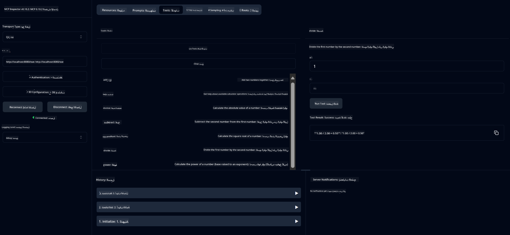

<!--
CO_OP_TRANSLATOR_METADATA:
{
  "original_hash": "ed9cab32cc67c12d8969b407aa47100a",
  "translation_date": "2025-06-11T09:28:37+00:00",
  "source_file": "03-GettingStarted/01-first-server/solution/java/README.md",
  "language_code": "ar"
}
-->
# خدمة الحاسبة الأساسية MCP

توفر هذه الخدمة عمليات الحاسبة الأساسية من خلال بروتوكول سياق النموذج (MCP) باستخدام Spring Boot مع نقل WebFlux. تم تصميمها كمثال بسيط للمبتدئين الذين يتعلمون عن تنفيذات MCP.

لمزيد من المعلومات، راجع وثائق المرجع [MCP Server Boot Starter](https://docs.spring.io/spring-ai/reference/api/mcp/mcp-server-boot-starter-docs.html).


## استخدام الخدمة

تعرض الخدمة نقاط نهاية API التالية عبر بروتوكول MCP:

- `add(a, b)`: جمع رقمين معًا  
- `subtract(a, b)`: طرح الرقم الثاني من الأول  
- `multiply(a, b)`: ضرب رقمين  
- `divide(a, b)`: قسمة الرقم الأول على الثاني (مع التحقق من الصفر)  
- `power(base, exponent)`: حساب أس الرقم  
- `squareRoot(number)`: حساب الجذر التربيعي (مع التحقق من الرقم السالب)  
- `modulus(a, b)`: حساب الباقي عند القسمة  
- `absolute(number)`: حساب القيمة المطلقة  

## التبعيات

يتطلب المشروع التبعيات الرئيسية التالية:

```xml
<dependency>
    <groupId>org.springframework.ai</groupId>
    <artifactId>spring-ai-starter-mcp-server-webflux</artifactId>
</dependency>
```

## بناء المشروع

قم ببناء المشروع باستخدام Maven:  
```bash
./mvnw clean install -DskipTests
```

## تشغيل الخادم

### باستخدام Java

```bash
java -jar target/calculator-server-0.0.1-SNAPSHOT.jar
```

### باستخدام MCP Inspector

يعد MCP Inspector أداة مفيدة للتفاعل مع خدمات MCP. لاستخدامه مع خدمة الحاسبة هذه:

1. **قم بتثبيت وتشغيل MCP Inspector** في نافذة طرفية جديدة:  
   ```bash
   npx @modelcontextprotocol/inspector
   ```

2. **ادخل إلى واجهة الويب** بالنقر على عنوان URL المعروض من التطبيق (عادةً http://localhost:6274)

3. **قم بتكوين الاتصال**:  
   - اضبط نوع النقل على "SSE"  
   - اضبط عنوان URL على نقطة نهاية SSE الخاصة بالخادم الذي يعمل لديك: `http://localhost:8080/sse`  
   - انقر على "Connect"  

4. **استخدم الأدوات**:  
   - انقر على "List Tools" لرؤية العمليات المتاحة في الحاسبة  
   - اختر أداة وانقر على "Run Tool" لتنفيذ العملية  



**تنويه**:  
تمت ترجمة هذا المستند باستخدام خدمة الترجمة الآلية [Co-op Translator](https://github.com/Azure/co-op-translator). بينما نسعى لتحقيق الدقة، يرجى العلم أن الترجمات الآلية قد تحتوي على أخطاء أو عدم دقة. يجب اعتبار المستند الأصلي بلغته الأصلية المصدر المعتمد. للمعلومات الهامة، يُنصح بالترجمة الاحترافية البشرية. نحن غير مسؤولين عن أي سوء فهم أو تفسير ناتج عن استخدام هذه الترجمة.