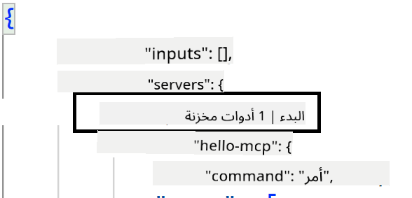
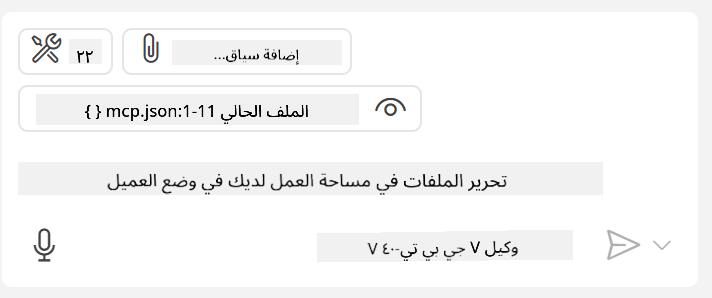

<!--
CO_OP_TRANSLATOR_METADATA:
{
  "original_hash": "c37fabfbc0dcbc9a4afb6d17e7d3be9f",
  "translation_date": "2025-05-17T11:00:47+00:00",
  "source_file": "03-GettingStarted/04-vscode/README.md",
  "language_code": "ar"
}
-->
لنناقش المزيد حول كيفية استخدام الواجهة المرئية في الأقسام التالية.

## النهج

إليك كيفية التعامل مع هذا على مستوى عالٍ:

- تكوين ملف للعثور على خادم MCP لدينا.
- بدء/الاتصال بالخادم المذكور ليقوم بإدراج ميزاته.
- استخدام الميزات المذكورة عبر واجهة الدردشة في GitHub Copilot.

رائع، الآن بعد أن فهمنا التدفق، دعونا نحاول استخدام خادم MCP عبر Visual Studio Code من خلال تمرين.

## تمرين: استهلاك خادم

في هذا التمرين، سنقوم بتكوين Visual Studio Code للعثور على خادم MCP الخاص بك بحيث يمكن استخدامه من واجهة الدردشة في GitHub Copilot.

### -0- الخطوة التمهيدية، تمكين اكتشاف خادم MCP

قد تحتاج إلى تمكين اكتشاف خوادم MCP.

1. انتقل إلى `File -> Preferences -> Settings` in Visual Studio Code.

1. Search for "MCP" and enable `chat.mcp.discovery.enabled` في ملف settings.json.

### -1- إنشاء ملف تكوين

ابدأ بإنشاء ملف تكوين في جذر المشروع الخاص بك، ستحتاج إلى ملف يسمى MCP.json ووضعه في مجلد يسمى .vscode. يجب أن يبدو هكذا:

```text
.vscode
|-- mcp.json
```

بعد ذلك، دعونا نرى كيف يمكننا إضافة إدخال خادم.

### -2- تكوين خادم

أضف المحتوى التالي إلى *mcp.json*:

```json
{
    "inputs": [],
    "servers": {
       "hello-mcp": {
           "command": "cmd",
           "args": [
               "/c", "node", "<absolute path>\\build\\index.js"
           ]
       }
    }
}
```

إليك مثال بسيط أعلاه حول كيفية بدء خادم مكتوب بلغة Node.js، بالنسبة للغات البرمجة الأخرى أشر إلى الأمر المناسب لبدء الخادم باستخدام `command` and `args`.

### -3- بدء الخادم

الآن بعد أن أضفت إدخالاً، دعونا نبدأ الخادم:

1. حدد موقع إدخالك في *mcp.json* وتأكد من العثور على رمز "التشغيل":

    

1. انقر على رمز "التشغيل"، يجب أن ترى رمز الأدوات في واجهة الدردشة في GitHub Copilot يزداد عدد الأدوات المتاحة. إذا نقرت على رمز الأدوات المذكور، ستظهر لك قائمة بالأدوات المسجلة. يمكنك التحقق/إلغاء التحقق من كل أداة حسب ما إذا كنت تريد أن يستخدمها GitHub Copilot كجزء من السياق:

  

1. لتشغيل أداة، اكتب طلبًا تعرف أنه سيتطابق مع وصف إحدى أدواتك، على سبيل المثال طلب مثل "أضف 22 إلى 1":

  

  يجب أن ترى استجابة تقول 23.

## مهمة

حاول إضافة إدخال خادم إلى ملف *mcp.json* الخاص بك وتأكد من أنك تستطيع بدء/إيقاف الخادم. تأكد أيضًا من أنك تستطيع التواصل مع الأدوات على خادمك عبر واجهة الدردشة في GitHub Copilot.

## الحل

[الحل](./solution/README.md)

## النقاط الرئيسية

النقاط الرئيسية من هذا الفصل هي التالية:

- يعد Visual Studio Code عميلًا رائعًا يتيح لك استهلاك عدة خوادم MCP وأدواتها.
- واجهة الدردشة في GitHub Copilot هي الطريقة التي تتفاعل بها مع الخوادم.
- يمكنك طلب المدخلات من المستخدم مثل مفاتيح API التي يمكن تمريرها إلى خادم MCP عند تكوين إدخال الخادم في ملف *mcp.json*.

## عينات

- [Java Calculator](../samples/java/calculator/README.md)
- [.Net Calculator](../../../../03-GettingStarted/samples/csharp)
- [JavaScript Calculator](../samples/javascript/README.md)
- [TypeScript Calculator](../samples/typescript/README.md)
- [Python Calculator](../../../../03-GettingStarted/samples/python) 

## موارد إضافية

- [وثائق Visual Studio](https://code.visualstudio.com/docs/copilot/chat/mcp-servers)

## ما التالي

- التالي: [إنشاء خادم SSE](/03-GettingStarted/05-sse-server/README.md)

**إخلاء مسؤولية**:  
تم ترجمة هذا المستند باستخدام خدمة الترجمة بالذكاء الاصطناعي [Co-op Translator](https://github.com/Azure/co-op-translator). بينما نسعى لتحقيق الدقة، يرجى العلم أن الترجمات الآلية قد تحتوي على أخطاء أو عدم دقة. يجب اعتبار المستند الأصلي بلغته الأصلية المصدر الموثوق به. بالنسبة للمعلومات الهامة، يُوصى بالترجمة البشرية الاحترافية. نحن غير مسؤولين عن أي سوء فهم أو تفسير خاطئ ناتج عن استخدام هذه الترجمة.