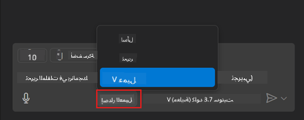
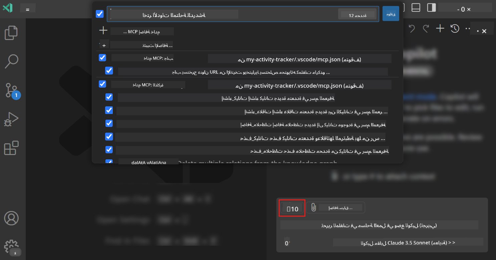
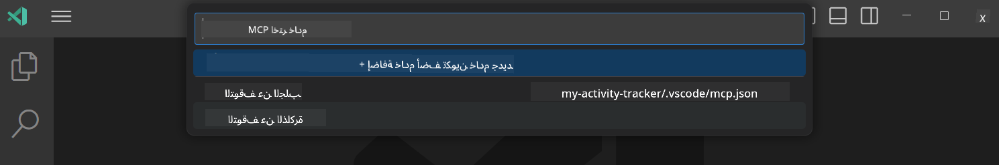
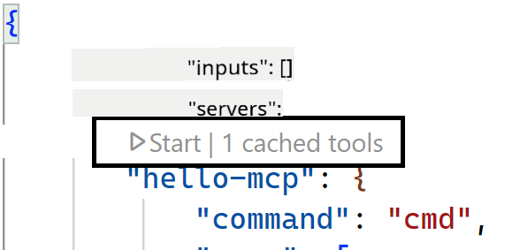
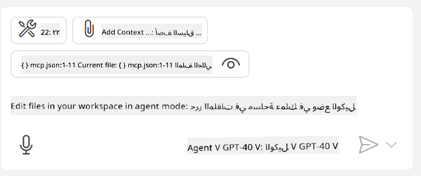
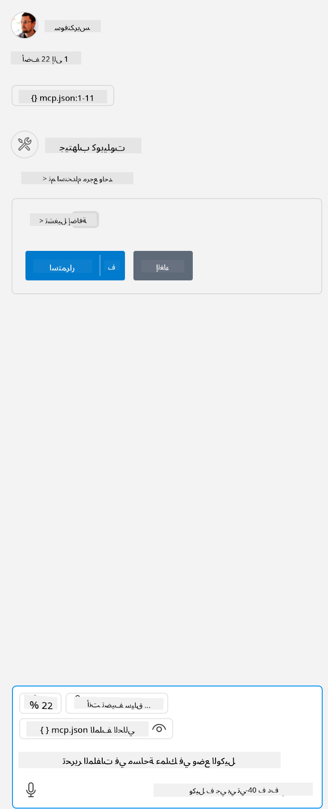

<!--
CO_OP_TRANSLATOR_METADATA:
{
  "original_hash": "d940b5e0af75e3a3a4d1c3179120d1d9",
  "translation_date": "2025-08-26T17:08:44+00:00",
  "source_file": "03-GettingStarted/04-vscode/README.md",
  "language_code": "ar"
}
-->
# استهلاك خادم من وضع GitHub Copilot Agent

يمكن لـ Visual Studio Code وGitHub Copilot العمل كعميل واستهلاك خادم MCP. قد تتساءل لماذا نرغب في القيام بذلك؟ حسنًا، هذا يعني أن أي ميزات يمتلكها خادم MCP يمكن استخدامها الآن من داخل بيئة التطوير الخاصة بك. تخيل أنك تضيف، على سبيل المثال، خادم MCP الخاص بـ GitHub، مما سيسمح لك بالتحكم في GitHub عبر الأوامر النصية بدلاً من كتابة أوامر محددة في الطرفية. أو تخيل أي شيء بشكل عام يمكن أن يحسن تجربة المطور لديك، وكل ذلك يتم التحكم فيه عبر اللغة الطبيعية. الآن بدأت ترى الفائدة، أليس كذلك؟

## نظرة عامة

تغطي هذه الدرس كيفية استخدام Visual Studio Code ووضع GitHub Copilot Agent كعميل لخادم MCP.

## أهداف التعلم

بنهاية هذا الدرس، ستكون قادرًا على:

- استهلاك خادم MCP عبر Visual Studio Code.
- تشغيل قدرات مثل الأدوات عبر GitHub Copilot.
- تكوين Visual Studio Code للعثور على خادم MCP الخاص بك وإدارته.

## الاستخدام

يمكنك التحكم في خادم MCP الخاص بك بطريقتين مختلفتين:

- واجهة المستخدم، سترى كيف يتم ذلك لاحقًا في هذا الفصل.
- الطرفية، من الممكن التحكم في الأمور من الطرفية باستخدام الأمر `code`:

  لإضافة خادم MCP إلى ملف تعريف المستخدم الخاص بك، استخدم خيار سطر الأوامر --add-mcp، وقدم تكوين الخادم بصيغة JSON مثل {\"name\":\"server-name\",\"command\":...}.

  ```
  code --add-mcp "{\"name\":\"my-server\",\"command\": \"uvx\",\"args\": [\"mcp-server-fetch\"]}"
  ```

### لقطات الشاشة





دعونا نتحدث أكثر عن كيفية استخدام واجهة المستخدم المرئية في الأقسام التالية.

## النهج

إليك كيفية التعامل مع هذا على مستوى عالٍ:

- تكوين ملف للعثور على خادم MCP الخاص بنا.
- تشغيل/الاتصال بالخادم المذكور لعرض قائمة بقدراته.
- استخدام القدرات المذكورة عبر واجهة GitHub Copilot Chat.

رائع، الآن بعد أن فهمنا التدفق، دعونا نحاول استخدام خادم MCP عبر Visual Studio Code من خلال تمرين.

## تمرين: استهلاك خادم

في هذا التمرين، سنقوم بتكوين Visual Studio Code للعثور على خادم MCP الخاص بك بحيث يمكن استخدامه من خلال واجهة GitHub Copilot Chat.

### -0- الخطوة التمهيدية، تمكين اكتشاف خادم MCP

قد تحتاج إلى تمكين اكتشاف خوادم MCP.

1. انتقل إلى `File -> Preferences -> Settings` في Visual Studio Code.

1. ابحث عن "MCP" وقم بتمكين `chat.mcp.discovery.enabled` في ملف settings.json.

### -1- إنشاء ملف التكوين

ابدأ بإنشاء ملف تكوين في جذر مشروعك، ستحتاج إلى ملف يسمى MCP.json ووضعه في مجلد يسمى .vscode. يجب أن يبدو كما يلي:

```text
.vscode
|-- mcp.json
```

بعد ذلك، دعونا نرى كيف يمكننا إضافة إدخال خادم.

### -2- تكوين خادم

أضف المحتوى التالي إلى *mcp.json*:

```json
{
    "inputs": [],
    "servers": {
       "hello-mcp": {
           "command": "node",
           "args": [
               "build/index.js"
           ]
       }
    }
}
```

هذا مثال بسيط أعلاه حول كيفية بدء خادم مكتوب بلغة Node.js، بالنسبة للغات البرمجة الأخرى، قم بتحديد الأمر المناسب لبدء الخادم باستخدام `command` و`args`.

### -3- تشغيل الخادم

الآن بعد أن أضفت إدخالًا، دعنا نبدأ الخادم:

1. حدد موقع الإدخال الخاص بك في *mcp.json* وتأكد من العثور على أيقونة "تشغيل":

    

1. انقر على أيقونة "تشغيل"، يجب أن ترى أيقونة الأدوات في GitHub Copilot Chat تزداد بعدد الأدوات المتاحة. إذا نقرت على أيقونة الأدوات المذكورة، سترى قائمة بالأدوات المسجلة. يمكنك تحديد/إلغاء تحديد كل أداة بناءً على ما إذا كنت تريد أن يستخدمها GitHub Copilot كجزء من السياق:

  

1. لتشغيل أداة، اكتب أمرًا نصيًا تعرف أنه يتطابق مع وصف إحدى أدواتك، على سبيل المثال أمر نصي مثل "أضف 22 إلى 1":

  

  يجب أن ترى استجابة تقول 23.

## المهمة

حاول إضافة إدخال خادم إلى ملف *mcp.json* الخاص بك وتأكد من أنه يمكنك بدء/إيقاف الخادم. تأكد أيضًا من أنه يمكنك التواصل مع الأدوات الموجودة على خادمك عبر واجهة GitHub Copilot Chat.

## الحل

[الحل](./solution/README.md)

## النقاط الرئيسية

النقاط الرئيسية من هذا الفصل هي كالتالي:

- Visual Studio Code هو عميل رائع يتيح لك استهلاك العديد من خوادم MCP وأدواتها.
- واجهة GitHub Copilot Chat هي الطريقة التي تتفاعل بها مع الخوادم.
- يمكنك طلب إدخالات من المستخدم مثل مفاتيح API التي يمكن تمريرها إلى خادم MCP عند تكوين إدخال الخادم في ملف *mcp.json*.

## أمثلة

- [Java Calculator](../samples/java/calculator/README.md)
- [.Net Calculator](../../../../03-GettingStarted/samples/csharp)
- [JavaScript Calculator](../samples/javascript/README.md)
- [TypeScript Calculator](../samples/typescript/README.md)
- [Python Calculator](../../../../03-GettingStarted/samples/python)

## موارد إضافية

- [وثائق Visual Studio](https://code.visualstudio.com/docs/copilot/chat/mcp-servers)

## ما التالي

- التالي: [إنشاء خادم stdio](../05-stdio-server/README.md)

---

**إخلاء المسؤولية**:  
تم ترجمة هذا المستند باستخدام خدمة الترجمة بالذكاء الاصطناعي [Co-op Translator](https://github.com/Azure/co-op-translator). بينما نسعى لتحقيق الدقة، يرجى العلم أن الترجمات الآلية قد تحتوي على أخطاء أو معلومات غير دقيقة. يجب اعتبار المستند الأصلي بلغته الأصلية المصدر الموثوق. للحصول على معلومات حاسمة، يُوصى بالاستعانة بترجمة بشرية احترافية. نحن غير مسؤولين عن أي سوء فهم أو تفسيرات خاطئة ناتجة عن استخدام هذه الترجمة.