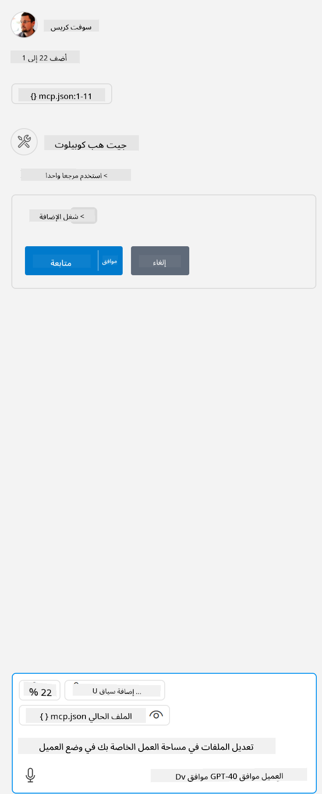

<!--
CO_OP_TRANSLATOR_METADATA:
{
  "original_hash": "96e08a8c1049dab757deb64cce4ea1e8",
  "translation_date": "2025-05-17T11:18:15+00:00",
  "source_file": "03-GettingStarted/04-vscode/solution/README.md",
  "language_code": "ar"
}
-->
# تشغيل النموذج

هنا نفترض أن لديك بالفعل كود الخادم يعمل. يرجى تحديد خادم من أحد الفصول السابقة.

## إعداد mcp.json

إليك ملف تستخدمه كمرجع، [mcp.json](../../../../../03-GettingStarted/04-vscode/solution/mcp.json).

قم بتغيير إدخال الخادم حسب الحاجة لتحديد المسار المطلق إلى الخادم الخاص بك بما في ذلك الأمر الكامل المطلوب للتشغيل.

في ملف المثال المشار إليه أعلاه، يبدو إدخال الخادم كما يلي:

```json
"hello-mcp": {
    "command": "cmd",
    "args": [
        "/c", "node", "<absolute path>\\build\\index.js"
    ]
}
```

هذا يتوافق مع تشغيل أمر مثل: `cmd /c node <absolute path>\\build\index.js`. 

- Change this server entry to fit where your server file is located or to what's needed to startup your server depending on your chosen runtime and server location.

## Consume the features in the server

- Click the `play` icon, once you've added *mcp.json* to *./vscode* folder, 

    Observe the tooling icon change to increase the number of available tools. Tooling icon is located right above the chat field in GitHub Copilot.

## Run a tool

- Type a prompt in your chat window that matches the description of your tool. For example to trigger the tool `add` اكتب شيئًا مثل "أضف 3 إلى 20".

يجب أن ترى أداة تُعرض فوق مربع نص الدردشة تشير إلى أنك يجب أن تختار تشغيل الأداة كما هو موضح في هذا الشكل:



يجب أن ينتج عن اختيار الأداة نتيجة رقمية تقول "23" إذا كان الطلب الخاص بك كما ذكرنا سابقًا.

**إخلاء المسؤولية**: 
تمت ترجمة هذه الوثيقة باستخدام خدمة الترجمة بالذكاء الاصطناعي [Co-op Translator](https://github.com/Azure/co-op-translator). بينما نسعى لتحقيق الدقة، يرجى العلم أن الترجمات الآلية قد تحتوي على أخطاء أو عدم دقة. يجب اعتبار الوثيقة الأصلية بلغتها الأصلية المصدر الموثوق. للحصول على معلومات حاسمة، يُوصى بالترجمة البشرية الاحترافية. نحن غير مسؤولين عن أي سوء فهم أو تفسير خاطئ ينشأ من استخدام هذه الترجمة.