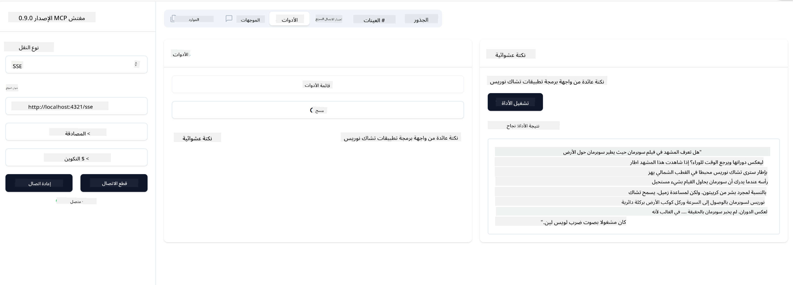

<!--
CO_OP_TRANSLATOR_METADATA:
{
  "original_hash": "0a8086dc4bf89448f83e7936db972c42",
  "translation_date": "2025-05-17T11:26:10+00:00",
  "source_file": "03-GettingStarted/05-sse-server/README.md",
  "language_code": "ar"
}
-->
# خادم SSE

SSE (الأحداث المرسلة من الخادم) هو معيار للبث من الخادم إلى العميل، مما يسمح للخوادم بدفع التحديثات في الوقت الحقيقي إلى العملاء عبر HTTP. هذا مفيد بشكل خاص للتطبيقات التي تتطلب تحديثات مباشرة، مثل تطبيقات الدردشة، الإشعارات، أو تغذيات البيانات في الوقت الحقيقي. كما يمكن استخدام الخادم الخاص بك من قبل عدة عملاء في نفس الوقت لأنه يعمل على خادم يمكن تشغيله في مكان ما في السحابة على سبيل المثال.

## نظرة عامة

تغطي هذه الدرس كيفية بناء واستهلاك خوادم SSE.

## الأهداف التعليمية

بنهاية هذا الدرس، ستكون قادرًا على:

- بناء خادم SSE.
- تصحيح خادم SSE باستخدام المفتش.
- استهلاك خادم SSE باستخدام Visual Studio Code.

## SSE، كيف يعمل

SSE هو واحد من نوعين من النقل المدعوم. لقد رأيت بالفعل النوع الأول stdio المستخدم في الدروس السابقة. الفرق هو التالي:

- يحتاج SSE منك التعامل مع شيئين هما الاتصال والرسائل.
- بما أن هذا خادم يمكن أن يكون في أي مكان، تحتاج إلى أن يعكس ذلك في كيفية العمل مع الأدوات مثل المفتش وVisual Studio. ما يعنيه ذلك هو أنه بدلاً من الإشارة إلى كيفية بدء الخادم، تشير بدلاً من ذلك إلى النقطة النهائية حيث يمكنه إنشاء اتصال. انظر مثال الكود أدناه:
تم تدريبك على البيانات حتى أكتوبر 2023.

الآن بعد أن عرفنا المزيد عن SSE، دعونا نبني خادم SSE بعد ذلك.

## تمرين: إنشاء خادم SSE

لإنشاء خادمنا، نحتاج إلى الاحتفاظ بأمرين في الاعتبار:

- نحتاج إلى استخدام خادم ويب لعرض النقاط النهائية للاتصال والرسائل.
- بناء خادمنا كما نفعل عادةً باستخدام الأدوات والموارد والمطالبات عندما كنا نستخدم stdio.

### -1- إنشاء مثيل للخادم

لإنشاء خادمنا، نستخدم نفس الأنواع كما في stdio. ومع ذلك، بالنسبة للنقل، نحتاج إلى اختيار SSE.

دعونا نضيف المسارات اللازمة بعد ذلك.

### -2- إضافة المسارات

دعونا نضيف المسارات بعد ذلك التي تتعامل مع الاتصال والرسائل الواردة:

دعونا نضيف القدرات إلى الخادم بعد ذلك.

### -3- إضافة قدرات الخادم

الآن بعد أن حددنا كل شيء خاص بـ SSE، دعونا نضيف قدرات الخادم مثل الأدوات والمطالبات والموارد.

يجب أن يبدو الكود الكامل الخاص بك كما يلي:

رائع، لدينا خادم يستخدم SSE، دعونا نجربه بعد ذلك.

## تمرين: تصحيح خادم SSE باستخدام المفتش

المفتش هو أداة رائعة رأيناها في درس سابق [إنشاء خادمك الأول](/03-GettingStarted/01-first-server/README.md). دعونا نرى ما إذا كان بإمكاننا استخدام المفتش حتى هنا:

### -1- تشغيل المفتش

لتشغيل المفتش، يجب أولاً أن يكون لديك خادم SSE يعمل، لذا دعونا نفعل ذلك بعد ذلك:

1. تشغيل الخادم

1. تشغيل المفتش

   > ![NOTE]
   > قم بتشغيل هذا في نافذة طرفية منفصلة عن تلك التي يعمل فيها الخادم. لاحظ أيضًا، أنك بحاجة إلى ضبط الأمر أدناه ليتناسب مع عنوان URL حيث يعمل الخادم الخاص بك.

   ```sh
    npx @modelcontextprotocol/inspector --cli http://localhost:8000/sse --method tools/list
    ```

   تشغيل المفتش يبدو نفسه في جميع الأوقات. لاحظ كيف أننا بدلاً من تمرير مسار إلى خادمنا وأمر لبدء الخادم، نمرر بدلاً من ذلك عنوان URL حيث يعمل الخادم ونحدد أيضًا مسار `/sse`.

### -2- تجربة الأداة

قم بتوصيل الخادم عن طريق تحديد SSE في القائمة المنسدلة وملء حقل عنوان URL حيث يعمل الخادم الخاص بك، على سبيل المثال http:localhost:4321/sse. الآن اضغط على زر "اتصال". كما في السابق، اختر قائمة الأدوات، اختر أداة وقدم قيم الإدخال. يجب أن ترى نتيجة مثل ما يلي:



رائع، أنت قادر على العمل مع المفتش، دعونا نرى كيف يمكننا العمل مع Visual Studio Code بعد ذلك.

## المهمة

حاول بناء خادمك مع المزيد من القدرات. انظر [هذه الصفحة](https://api.chucknorris.io/) على سبيل المثال لإضافة أداة تتصل بواجهة برمجة التطبيقات، تقرر كيف يجب أن يبدو الخادم. استمتع :)

## الحل

[الحل](./solution/README.md) إليك حل ممكن مع كود يعمل.

## النقاط الرئيسية

النقاط الرئيسية من هذا الفصل هي التالية:

- SSE هو النقل الثاني المدعوم بجانب stdio.
- لدعم SSE، تحتاج إلى إدارة الاتصالات الواردة والرسائل باستخدام إطار عمل ويب.
- يمكنك استخدام كل من المفتش وVisual Studio Code لاستهلاك خادم SSE، تمامًا مثل خوادم stdio. لاحظ كيف يختلف قليلاً بين stdio وSSE. بالنسبة لـ SSE، تحتاج إلى بدء تشغيل الخادم بشكل منفصل ثم تشغيل أداة المفتش الخاصة بك. لأداة المفتش، هناك أيضًا بعض الاختلافات في أنك تحتاج إلى تحديد عنوان URL.

## عينات

- [Java Calculator](../samples/java/calculator/README.md)
- [.Net Calculator](../../../../03-GettingStarted/samples/csharp)
- [JavaScript Calculator](../samples/javascript/README.md)
- [TypeScript Calculator](../samples/typescript/README.md)
- [Python Calculator](../../../../03-GettingStarted/samples/python)

## موارد إضافية

- [SSE](https://developer.mozilla.org/en-US/docs/Web/API/Server-sent_events)

## ما التالي

- التالي: [البدء مع مجموعة أدوات الذكاء الاصطناعي لـ VSCode](/03-GettingStarted/06-aitk/README.md)

**إخلاء المسؤولية**:  
تمت ترجمة هذه الوثيقة باستخدام خدمة الترجمة بالذكاء الاصطناعي [Co-op Translator](https://github.com/Azure/co-op-translator). بينما نسعى لتحقيق الدقة، يرجى العلم أن الترجمات الآلية قد تحتوي على أخطاء أو عدم دقة. يجب اعتبار الوثيقة الأصلية بلغتها الأم المصدر الموثوق. بالنسبة للمعلومات الحساسة، يُوصى بالترجمة البشرية الاحترافية. نحن غير مسؤولين عن أي سوء فهم أو تفسيرات خاطئة تنشأ عن استخدام هذه الترجمة.