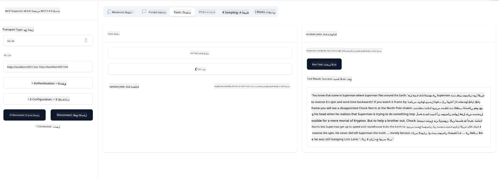

<!--
CO_OP_TRANSLATOR_METADATA:
{
  "original_hash": "d90ca3d326c48fab2ac0ebd3a9876f59",
  "translation_date": "2025-07-13T19:49:04+00:00",
  "source_file": "03-GettingStarted/05-sse-server/README.md",
  "language_code": "ar"
}
-->
الآن بعد أن عرفنا المزيد عن SSE، دعونا نبني خادم SSE بعد ذلك.

## التمرين: إنشاء خادم SSE

لإنشاء خادمنا، نحتاج إلى وضع أمرين في الاعتبار:

- نحتاج إلى استخدام خادم ويب لعرض نقاط النهاية للاتصال والرسائل.
- بناء خادمنا كما نفعل عادة باستخدام الأدوات والموارد والمطالبات عندما كنا نستخدم stdio.

### -1- إنشاء مثيل للخادم

لإنشاء خادمنا، نستخدم نفس الأنواع كما في stdio. ومع ذلك، بالنسبة للنقل، نحتاج إلى اختيار SSE.

---

دعونا نضيف المسارات اللازمة بعد ذلك.

### -2- إضافة المسارات

دعونا نضيف المسارات التي تتعامل مع الاتصال والرسائل الواردة:

---

دعونا نضيف القدرات إلى الخادم بعد ذلك.

### -3- إضافة قدرات الخادم

الآن بعد أن حددنا كل ما يتعلق بـ SSE، دعونا نضيف قدرات الخادم مثل الأدوات والمطالبات والموارد.

---

يجب أن يبدو الكود الكامل الخاص بك كما يلي:

---

رائع، لدينا خادم يستخدم SSE، دعونا نجربه بعد ذلك.

## التمرين: تصحيح خادم SSE باستخدام Inspector

Inspector هو أداة رائعة رأيناها في درس سابق [إنشاء خادمك الأول](/03-GettingStarted/01-first-server/README.md). دعونا نرى إذا كان بإمكاننا استخدام Inspector هنا أيضًا:

### -1- تشغيل Inspector

لتشغيل Inspector، يجب أولاً أن يكون لديك خادم SSE يعمل، لذا دعونا نفعل ذلك الآن:

1. تشغيل الخادم

---

1. تشغيل Inspector

    > ![NOTE]
    > قم بتشغيل هذا في نافذة طرفية منفصلة عن تلك التي يعمل فيها الخادم. لاحظ أيضًا، أنك بحاجة إلى تعديل الأمر أدناه ليتناسب مع عنوان URL الذي يعمل عليه خادمك.

    ```sh
    npx @modelcontextprotocol/inspector --cli http://localhost:8000/sse --method tools/list
    ```

    تشغيل Inspector يبدو نفسه في جميع بيئات التشغيل. لاحظ كيف أننا بدلاً من تمرير مسار إلى خادمنا وأمر لبدء الخادم، نمرر بدلاً من ذلك عنوان URL حيث يعمل الخادم ونحدد أيضًا مسار `/sse`.

### -2- تجربة الأداة

اتصل بالخادم عن طريق اختيار SSE من القائمة المنسدلة واملأ حقل العنوان URL حيث يعمل خادمك، على سبيل المثال http:localhost:4321/sse. الآن اضغط على زر "اتصال". كما في السابق، اختر قائمة الأدوات، اختر أداة وقدم قيم الإدخال. يجب أن ترى نتيجة مثل الصورة أدناه:



رائع، يمكنك العمل مع Inspector، دعونا نرى كيف يمكننا العمل مع Visual Studio Code بعد ذلك.

## المهمة

حاول بناء خادمك مع المزيد من القدرات. انظر [هذه الصفحة](https://api.chucknorris.io/) لإضافة أداة تستدعي API على سبيل المثال. أنت من يقرر كيف يجب أن يبدو الخادم. استمتع :)

## الحل

[الحل](./solution/README.md) هنا حل ممكن مع كود يعمل.

## النقاط الرئيسية

النقاط الرئيسية من هذا الفصل هي كما يلي:

- SSE هو نوع النقل الثاني المدعوم بعد stdio.
- لدعم SSE، تحتاج إلى إدارة الاتصالات والرسائل الواردة باستخدام إطار عمل ويب.
- يمكنك استخدام كل من Inspector و Visual Studio Code لاستهلاك خادم SSE، تمامًا مثل خوادم stdio. لاحظ كيف يختلف الأمر قليلاً بين stdio و SSE. بالنسبة لـ SSE، تحتاج إلى تشغيل الخادم بشكل منفصل ثم تشغيل أداة Inspector الخاصة بك. بالنسبة لأداة Inspector، هناك أيضًا بعض الاختلافات في أنه يجب عليك تحديد عنوان URL.

## عينات

- [حاسبة جافا](../samples/java/calculator/README.md)
- [حاسبة .Net](../../../../03-GettingStarted/samples/csharp)
- [حاسبة جافا سكريبت](../samples/javascript/README.md)
- [حاسبة تايب سكريبت](../samples/typescript/README.md)
- [حاسبة بايثون](../../../../03-GettingStarted/samples/python)

## موارد إضافية

- [SSE](https://developer.mozilla.org/en-US/docs/Web/API/Server-sent_events)

## ما التالي

- التالي: [البث عبر HTTP مع MCP (HTTP قابل للبث)](../06-http-streaming/README.md)

**إخلاء المسؤولية**:  
تمت ترجمة هذا المستند باستخدام خدمة الترجمة الآلية [Co-op Translator](https://github.com/Azure/co-op-translator). بينما نسعى لتحقيق الدقة، يرجى العلم أن الترجمات الآلية قد تحتوي على أخطاء أو عدم دقة. يجب اعتبار المستند الأصلي بلغته الأصلية المصدر الموثوق به. للمعلومات الهامة، يُنصح بالاعتماد على الترجمة البشرية المهنية. نحن غير مسؤولين عن أي سوء فهم أو تفسير ناتج عن استخدام هذه الترجمة.