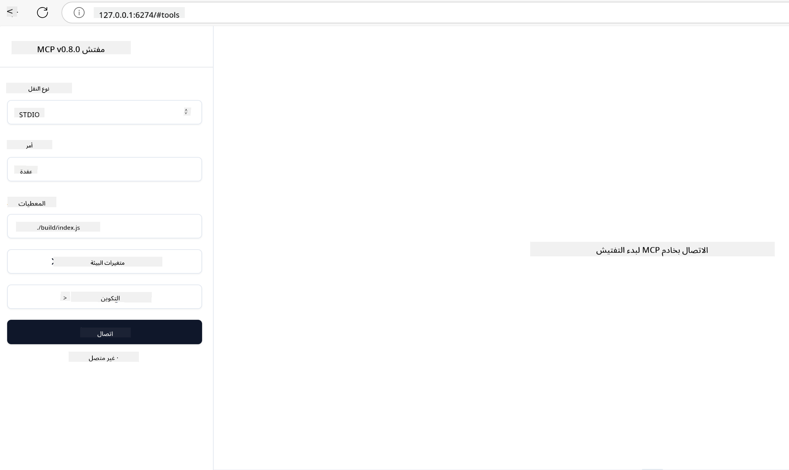

<!--
CO_OP_TRANSLATOR_METADATA:
{
  "original_hash": "717f34718a773f6cf52d8445e40a96bf",
  "translation_date": "2025-05-17T12:39:36+00:00",
  "source_file": "03-GettingStarted/07-testing/README.md",
  "language_code": "ar"
}
-->
## اختبار وتصحيح الأخطاء

قبل أن تبدأ في اختبار خادم MCP الخاص بك، من المهم فهم الأدوات المتاحة وأفضل الممارسات لتصحيح الأخطاء. يضمن الاختبار الفعال أن يتصرف الخادم كما هو متوقع ويساعدك في تحديد المشكلات وحلها بسرعة. يوضح القسم التالي النهج الموصى بها للتحقق من تنفيذ MCP الخاص بك.

## نظرة عامة

تغطي هذه الدرس كيفية اختيار النهج الصحيح للاختبار وأداة الاختبار الأكثر فعالية.

## أهداف التعلم

بنهاية هذا الدرس، ستكون قادرًا على:

- وصف مختلف النهج للاختبار.
- استخدام أدوات مختلفة لاختبار الكود الخاص بك بفعالية.

## اختبار خوادم MCP

يوفر MCP أدوات لمساعدتك في اختبار وتصحيح أخطاء خوادمك:

- **MCP Inspector**: أداة سطر الأوامر التي يمكن تشغيلها كأداة CLI وكأداة مرئية.
- **الاختبار اليدوي**: يمكنك استخدام أداة مثل curl لإجراء طلبات الويب، ولكن أي أداة قادرة على تشغيل HTTP ستفي بالغرض.
- **اختبار الوحدات**: من الممكن استخدام إطار الاختبار المفضل لديك لاختبار ميزات الخادم والعميل.

### استخدام MCP Inspector

لقد وصفنا استخدام هذه الأداة في الدروس السابقة ولكن دعنا نتحدث عنها قليلاً على مستوى عالي. إنها أداة مبنية في Node.js ويمكنك استخدامها عن طريق استدعاء الملف التنفيذي `npx` الذي سيقوم بتحميل وتثبيت الأداة مؤقتًا وسينظف نفسه بمجرد الانتهاء من تشغيل طلبك.

يساعد [MCP Inspector](https://github.com/modelcontextprotocol/inspector) في:

- **اكتشاف قدرات الخادم**: الكشف التلقائي عن الموارد المتاحة، الأدوات، والمطالبات
- **اختبار تنفيذ الأداة**: تجربة معلمات مختلفة ورؤية الردود في الوقت الفعلي
- **عرض بيانات الخادم الوصفية**: فحص معلومات الخادم، المخططات، والتكوينات

يبدو تشغيل الأداة النموذجي كما يلي:

```bash
npx @modelcontextprotocol/inspector node build/index.js
```

يبدأ الأمر أعلاه MCP وواجهة المستخدم المرئية الخاصة به ويطلق واجهة ويب محلية في متصفحك. يمكنك توقع رؤية لوحة تعرض خوادم MCP المسجلة لديك، الأدوات المتاحة، الموارد، والمطالبات. تسمح لك الواجهة باختبار تنفيذ الأداة بشكل تفاعلي، فحص بيانات الخادم الوصفية، وعرض الردود في الوقت الفعلي، مما يسهل التحقق وتصحيح تنفيذات خادم MCP الخاص بك.

يمكن أن يبدو هذا كما يلي: 

يمكنك أيضًا تشغيل هذه الأداة في وضع CLI وفي هذه الحالة تضيف السمة `--cli`. إليك مثال على تشغيل الأداة في وضع "CLI" والذي يعرض جميع الأدوات على الخادم:

```sh
npx @modelcontextprotocol/inspector --cli node build/index.js --method tools/list
```

### الاختبار اليدوي

بصرف النظر عن تشغيل أداة المفتش لاختبار قدرات الخادم، نهج مشابه آخر هو تشغيل عميل قادر على استخدام HTTP مثل curl.

باستخدام curl، يمكنك اختبار خوادم MCP مباشرة باستخدام طلبات HTTP:

```bash
# Example: Test server metadata
curl http://localhost:3000/v1/metadata

# Example: Execute a tool
curl -X POST http://localhost:3000/v1/tools/execute \
  -H "Content-Type: application/json" \
  -d '{"name": "calculator", "parameters": {"expression": "2+2"}}'
```

كما ترى من استخدام curl أعلاه، تستخدم طلب POST لاستدعاء أداة باستخدام حمولة تتكون من اسم الأداة ومعلماتها. استخدم النهج الذي يناسبك بشكل أفضل. تميل أدوات CLI بشكل عام إلى أن تكون أسرع في الاستخدام وتتيح نفسها ليتم كتابتها مما يمكن أن يكون مفيدًا في بيئة CI/CD.

### اختبار الوحدات

قم بإنشاء اختبارات وحدة لأدواتك ومواردك لضمان أنها تعمل كما هو متوقع. إليك بعض الكود التجريبي كمثال.

```python
import pytest

from mcp.server.fastmcp import FastMCP
from mcp.shared.memory import (
    create_connected_server_and_client_session as create_session,
)

# Mark the whole module for async tests
pytestmark = pytest.mark.anyio


async def test_list_tools_cursor_parameter():
    """Test that the cursor parameter is accepted for list_tools.

    Note: FastMCP doesn't currently implement pagination, so this test
    only verifies that the cursor parameter is accepted by the client.
    """

 server = FastMCP("test")

    # Create a couple of test tools
    @server.tool(name="test_tool_1")
    async def test_tool_1() -> str:
        """First test tool"""
        return "Result 1"

    @server.tool(name="test_tool_2")
    async def test_tool_2() -> str:
        """Second test tool"""
        return "Result 2"

    async with create_session(server._mcp_server) as client_session:
        # Test without cursor parameter (omitted)
        result1 = await client_session.list_tools()
        assert len(result1.tools) == 2

        # Test with cursor=None
        result2 = await client_session.list_tools(cursor=None)
        assert len(result2.tools) == 2

        # Test with cursor as string
        result3 = await client_session.list_tools(cursor="some_cursor_value")
        assert len(result3.tools) == 2

        # Test with empty string cursor
        result4 = await client_session.list_tools(cursor="")
        assert len(result4.tools) == 2
    
```

يقوم الكود السابق بما يلي:

- يستفيد من إطار pytest الذي يتيح لك إنشاء اختبارات كوظائف واستخدام عبارات assert.
- ينشئ خادم MCP مع أداتين مختلفتين.
- يستخدم عبارة `assert` للتحقق من أن شروط معينة محققة.

ألق نظرة على [الملف الكامل هنا](https://github.com/modelcontextprotocol/python-sdk/blob/main/tests/client/test_list_methods_cursor.py)

بالنظر إلى الملف أعلاه، يمكنك اختبار الخادم الخاص بك لضمان إنشاء القدرات كما ينبغي.

لدى جميع SDKs الرئيسية أقسام اختبار مشابهة بحيث يمكنك التكيف مع وقت التشغيل الذي اخترته.

## نماذج

- [Java Calculator](../samples/java/calculator/README.md)
- [.Net Calculator](../../../../03-GettingStarted/samples/csharp)
- [JavaScript Calculator](../samples/javascript/README.md)
- [TypeScript Calculator](../samples/typescript/README.md)
- [Python Calculator](../../../../03-GettingStarted/samples/python) 

## موارد إضافية

- [Python SDK](https://github.com/modelcontextprotocol/python-sdk)

## ماذا بعد

- التالي: [التوزيع](/03-GettingStarted/08-deployment/README.md)

**إخلاء المسؤولية**:  
تم ترجمة هذه الوثيقة باستخدام خدمة الترجمة بالذكاء الاصطناعي [Co-op Translator](https://github.com/Azure/co-op-translator). بينما نسعى لتحقيق الدقة، يرجى العلم أن الترجمات الآلية قد تحتوي على أخطاء أو عدم دقة. يجب اعتبار الوثيقة الأصلية بلغتها الأصلية المصدر الرسمي. للحصول على معلومات حيوية، يُوصى بالترجمة البشرية المهنية. نحن غير مسؤولين عن أي سوء فهم أو تفسير ناتج عن استخدام هذه الترجمة.