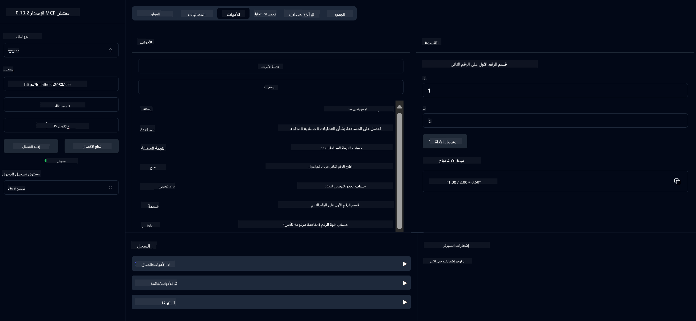

<!--
CO_OP_TRANSLATOR_METADATA:
{
  "original_hash": "13231e9951b68efd9df8c56bd5cdb27e",
  "translation_date": "2025-05-17T13:05:15+00:00",
  "source_file": "03-GettingStarted/samples/java/calculator/README.md",
  "language_code": "ar"
}
-->
# خدمة الآلة الحاسبة الأساسية MCP

تقدم هذه الخدمة عمليات الآلة الحاسبة الأساسية عبر بروتوكول Model Context Protocol (MCP) باستخدام Spring Boot مع نقل WebFlux. تم تصميمها كمثال بسيط للمبتدئين الذين يتعلمون عن تطبيقات MCP.

لمزيد من المعلومات، راجع وثائق [MCP Server Boot Starter](https://docs.spring.io/spring-ai/reference/api/mcp/mcp-server-boot-starter-docs.html).

## نظرة عامة

تستعرض الخدمة:
- دعم SSE (أحداث مرسلة من الخادم)
- تسجيل الأدوات تلقائيًا باستخدام التعليمة `@Tool` من Spring AI
- وظائف الآلة الحاسبة الأساسية:
  - الجمع، الطرح، الضرب، القسمة
  - حساب القوة والجذر التربيعي
  - باقي القسمة والقيمة المطلقة
  - وظيفة المساعدة لوصف العمليات

## الميزات

تقدم خدمة الآلة الحاسبة هذه القدرات التالية:

1. **العمليات الحسابية الأساسية**:
   - جمع رقمين
   - طرح رقم من آخر
   - ضرب رقمين
   - قسمة رقم على آخر (مع التحقق من القسمة على صفر)

2. **العمليات المتقدمة**:
   - حساب القوة (رفع الأساس إلى الأس)
   - حساب الجذر التربيعي (مع التحقق من الأرقام السالبة)
   - حساب باقي القسمة
   - حساب القيمة المطلقة

3. **نظام المساعدة**:
   - وظيفة المساعدة المدمجة التي تشرح جميع العمليات المتاحة

## استخدام الخدمة

تعرض الخدمة نقاط النهاية API التالية عبر بروتوكول MCP:

- `add(a, b)`: جمع رقمين معًا
- `subtract(a, b)`: طرح الرقم الثاني من الأول
- `multiply(a, b)`: ضرب رقمين
- `divide(a, b)`: قسمة الرقم الأول على الثاني (مع التحقق من القسمة على صفر)
- `power(base, exponent)`: حساب قوة الرقم
- `squareRoot(number)`: حساب الجذر التربيعي (مع التحقق من الأرقام السالبة)
- `modulus(a, b)`: حساب باقي القسمة عند القسمة
- `absolute(number)`: حساب القيمة المطلقة
- `help()`: الحصول على معلومات حول العمليات المتاحة

## عميل الاختبار

يتضمن الحزمة `com.microsoft.mcp.sample.client` عميل اختبار بسيط. توضح الفئة `SampleCalculatorClient` العمليات المتاحة لخدمة الآلة الحاسبة.

## استخدام عميل LangChain4j

يتضمن المشروع عميل مثال LangChain4j في `com.microsoft.mcp.sample.client.LangChain4jClient` الذي يوضح كيفية دمج خدمة الآلة الحاسبة مع LangChain4j ونماذج GitHub:

### المتطلبات الأساسية

1. **إعداد رمز GitHub**:
   
   لاستخدام نماذج الذكاء الاصطناعي في GitHub (مثل phi-4)، تحتاج إلى رمز وصول شخصي في GitHub:

   a. اذهب إلى إعدادات حسابك في GitHub: https://github.com/settings/tokens
   
   b. انقر على "توليد رمز جديد" → "توليد رمز جديد (كلاسيكي)"
   
   c. أعط رمزك اسمًا وصفيًا
   
   d. اختر النطاقات التالية:
      - `repo` (التحكم الكامل في المستودعات الخاصة)
      - `read:org` (قراءة عضوية المنظمة والفريق، قراءة مشاريع المنظمة)
      - `gist` (إنشاء gists)
      - `user:email` (الوصول إلى عناوين البريد الإلكتروني للمستخدم (قراءة فقط))
   
   e. انقر على "توليد رمز" ونسخ رمزك الجديد
   
   f. قم بتعيينه كمتغير بيئة:
      
      على Windows:
      ```
      set GITHUB_TOKEN=your-github-token
      ```
      
      على macOS/Linux:
      ```bash
      export GITHUB_TOKEN=your-github-token
      ```

   g. للإعداد الدائم، أضفه إلى متغيرات البيئة من خلال إعدادات النظام

2. أضف تبعية LangChain4j GitHub إلى مشروعك (مدرجة بالفعل في pom.xml):
   ```xml
   <dependency>
       <groupId>dev.langchain4j</groupId>
       <artifactId>langchain4j-github</artifactId>
       <version>${langchain4j.version}</version>
   </dependency>
   ```

3. تأكد من تشغيل خادم الآلة الحاسبة على `localhost:8080`

### تشغيل عميل LangChain4j

يوضح هذا المثال:
- الاتصال بخادم الآلة الحاسبة MCP عبر نقل SSE
- استخدام LangChain4j لإنشاء روبوت دردشة يستفيد من عمليات الآلة الحاسبة
- التكامل مع نماذج الذكاء الاصطناعي في GitHub (الآن باستخدام نموذج phi-4)

يرسل العميل الاستفسارات التالية كمثال لإظهار الوظائف:
1. حساب مجموع رقمين
2. إيجاد الجذر التربيعي لرقم
3. الحصول على معلومات المساعدة حول العمليات المتاحة للآلة الحاسبة

قم بتشغيل المثال وتحقق من مخرجات وحدة التحكم لرؤية كيفية استخدام نموذج الذكاء الاصطناعي لأدوات الآلة الحاسبة للرد على الاستفسارات.

### إعداد نموذج GitHub

تم تكوين عميل LangChain4j لاستخدام نموذج phi-4 في GitHub بالإعدادات التالية:

```java
ChatLanguageModel model = GitHubChatModel.builder()
    .apiKey(System.getenv("GITHUB_TOKEN"))
    .timeout(Duration.ofSeconds(60))
    .modelName("phi-4")
    .logRequests(true)
    .logResponses(true)
    .build();
```

لاستخدام نماذج مختلفة من GitHub، يمكنك ببساطة تغيير معلمة `modelName` إلى نموذج آخر مدعوم (مثل "claude-3-haiku-20240307"، "llama-3-70b-8192"، إلخ).

## التبعيات

يتطلب المشروع التبعيات الرئيسية التالية:

```xml
<!-- For MCP Server -->
<dependency>
    <groupId>org.springframework.ai</groupId>
    <artifactId>spring-ai-starter-mcp-server-webflux</artifactId>
</dependency>

<!-- For LangChain4j integration -->
<dependency>
    <groupId>dev.langchain4j</groupId>
    <artifactId>langchain4j-mcp</artifactId>
    <version>${langchain4j.version}</version>
</dependency>

<!-- For GitHub models support -->
<dependency>
    <groupId>dev.langchain4j</groupId>
    <artifactId>langchain4j-github</artifactId>
    <version>${langchain4j.version}</version>
</dependency>
```

## بناء المشروع

قم ببناء المشروع باستخدام Maven:
```bash
./mvnw clean install -DskipTests
```

## تشغيل الخادم

### باستخدام Java

```bash
java -jar target/calculator-server-0.0.1-SNAPSHOT.jar
```

### باستخدام MCP Inspector

MCP Inspector هو أداة مفيدة للتفاعل مع خدمات MCP. لاستخدامه مع خدمة الآلة الحاسبة هذه:

1. **قم بتثبيت وتشغيل MCP Inspector** في نافذة طرفية جديدة:
   ```bash
   npx @modelcontextprotocol/inspector
   ```

2. **الوصول إلى واجهة المستخدم عبر الويب** بالنقر على عنوان URL المعروض بواسطة التطبيق (عادةً http://localhost:6274)

3. **تكوين الاتصال**:
   - ضبط نوع النقل على "SSE"
   - ضبط عنوان URL لنقطة نهاية SSE للخادم الذي يعمل: `http://localhost:8080/sse`
   - انقر على "اتصال"

4. **استخدام الأدوات**:
   - انقر على "قائمة الأدوات" لرؤية العمليات المتاحة للآلة الحاسبة
   - اختر أداة وانقر على "تشغيل الأداة" لتنفيذ عملية



### باستخدام Docker

يتضمن المشروع ملف Docker لنشر الحاويات:

1. **بناء صورة Docker**:
   ```bash
   docker build -t calculator-mcp-service .
   ```

2. **تشغيل حاوية Docker**:
   ```bash
   docker run -p 8080:8080 calculator-mcp-service
   ```

هذا سيقوم بـ:
- بناء صورة Docker متعددة المراحل باستخدام Maven 3.9.9 و Eclipse Temurin 24 JDK
- إنشاء صورة حاوية محسّنة
- عرض الخدمة على المنفذ 8080
- بدء خدمة الآلة الحاسبة MCP داخل الحاوية

يمكنك الوصول إلى الخدمة على `http://localhost:8080` بمجرد تشغيل الحاوية.

## استكشاف الأخطاء وإصلاحها

### المشاكل الشائعة مع رمز GitHub

1. **مشاكل أذونات الرمز**: إذا حصلت على خطأ 403 Forbidden، تحقق من أن الرمز الخاص بك لديه الأذونات الصحيحة كما هو موضح في المتطلبات الأساسية.

2. **الرمز غير موجود**: إذا حصلت على خطأ "No API key found"، تأكد من تعيين متغير البيئة GITHUB_TOKEN بشكل صحيح.

3. **تقييد المعدل**: لدى GitHub حدود معدل API. إذا واجهت خطأ في تقييد المعدل (رمز الحالة 429)، انتظر بضع دقائق قبل المحاولة مرة أخرى.

4. **انتهاء صلاحية الرمز**: يمكن أن تنتهي صلاحية رموز GitHub. إذا تلقيت أخطاء مصادقة بعد فترة، قم بتوليد رمز جديد وتحديث متغير البيئة الخاص بك.

إذا كنت بحاجة إلى مزيد من المساعدة، تحقق من [وثائق LangChain4j](https://github.com/langchain4j/langchain4j) أو [وثائق API في GitHub](https://docs.github.com/en/rest).

**إخلاء المسؤولية**:  
تم ترجمة هذه الوثيقة باستخدام خدمة الترجمة بالذكاء الاصطناعي [Co-op Translator](https://github.com/Azure/co-op-translator). بينما نسعى لتحقيق الدقة، يُرجى العلم أن الترجمات الآلية قد تحتوي على أخطاء أو عدم دقة. يجب اعتبار الوثيقة الأصلية بلغتها الأم المصدر الموثوق. للحصول على معلومات مهمة، يُوصى بالترجمة البشرية المهنية. نحن لسنا مسؤولين عن أي سوء فهم أو تفسيرات خاطئة ناتجة عن استخدام هذه الترجمة.