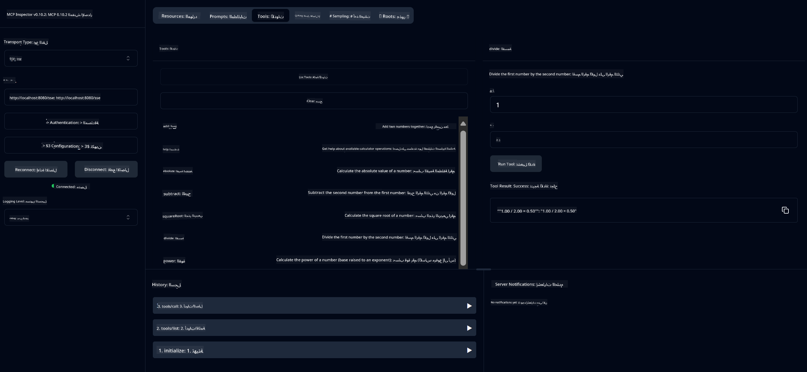

<!--
CO_OP_TRANSLATOR_METADATA:
{
  "original_hash": "13231e9951b68efd9df8c56bd5cdb27e",
  "translation_date": "2025-07-13T22:21:25+00:00",
  "source_file": "03-GettingStarted/samples/java/calculator/README.md",
  "language_code": "ar"
}
-->
# خدمة الآلة الحاسبة الأساسية MCP

تقدم هذه الخدمة عمليات آلة حاسبة أساسية عبر بروتوكول سياق النموذج (MCP) باستخدام Spring Boot مع نقل WebFlux. تم تصميمها كمثال بسيط للمبتدئين الذين يتعلمون عن تطبيقات MCP.

لمزيد من المعلومات، راجع وثائق المرجع [MCP Server Boot Starter](https://docs.spring.io/spring-ai/reference/api/mcp/mcp-server-boot-starter-docs.html).

## نظرة عامة

تعرض الخدمة ما يلي:
- دعم SSE (الأحداث المرسلة من الخادم)
- التسجيل التلقائي للأدوات باستخدام تعليق Spring AI `@Tool`
- وظائف آلة حاسبة أساسية:
  - الجمع، الطرح، الضرب، القسمة
  - حساب القوة والجذر التربيعي
  - باقي القسمة والقيمة المطلقة
  - وظيفة المساعدة لوصف العمليات

## الميزات

تقدم خدمة الآلة الحاسبة هذه القدرات التالية:

1. **العمليات الحسابية الأساسية**:
   - جمع رقمين
   - طرح رقم من آخر
   - ضرب رقمين
   - قسمة رقم على آخر (مع التحقق من القسمة على صفر)

2. **العمليات المتقدمة**:
   - حساب القوة (رفع الأساس إلى الأس)
   - حساب الجذر التربيعي (مع التحقق من الأعداد السالبة)
   - حساب باقي القسمة
   - حساب القيمة المطلقة

3. **نظام المساعدة**:
   - وظيفة مساعدة مدمجة تشرح جميع العمليات المتاحة

## استخدام الخدمة

تعرض الخدمة نقاط نهاية API التالية عبر بروتوكول MCP:

- `add(a, b)`: جمع رقمين معًا
- `subtract(a, b)`: طرح الرقم الثاني من الأول
- `multiply(a, b)`: ضرب رقمين
- `divide(a, b)`: قسمة الرقم الأول على الثاني (مع التحقق من القسمة على صفر)
- `power(base, exponent)`: حساب القوة لرقم
- `squareRoot(number)`: حساب الجذر التربيعي (مع التحقق من الأعداد السالبة)
- `modulus(a, b)`: حساب باقي القسمة
- `absolute(number)`: حساب القيمة المطلقة
- `help()`: الحصول على معلومات حول العمليات المتاحة

## عميل الاختبار

يتضمن المشروع عميل اختبار بسيط في الحزمة `com.microsoft.mcp.sample.client`. توضح فئة `SampleCalculatorClient` العمليات المتاحة لخدمة الآلة الحاسبة.

## استخدام عميل LangChain4j

يتضمن المشروع مثالاً لعميل LangChain4j في `com.microsoft.mcp.sample.client.LangChain4jClient` يوضح كيفية دمج خدمة الآلة الحاسبة مع LangChain4j ونماذج GitHub:

### المتطلبات المسبقة

1. **إعداد رمز GitHub**:
   
   لاستخدام نماذج الذكاء الاصطناعي من GitHub (مثل phi-4)، تحتاج إلى رمز وصول شخصي من GitHub:

   أ. اذهب إلى إعدادات حساب GitHub الخاص بك: https://github.com/settings/tokens
   
   ب. انقر على "Generate new token" → "Generate new token (classic)"
   
   ج. امنح الرمز اسمًا وصفيًا
   
   د. اختر الصلاحيات التالية:
      - `repo` (التحكم الكامل في المستودعات الخاصة)
      - `read:org` (قراءة عضوية المنظمة والفريق، وقراءة مشاريع المنظمة)
      - `gist` (إنشاء gists)
      - `user:email` (الوصول إلى عناوين البريد الإلكتروني للمستخدم (قراءة فقط))
   
   هـ. انقر على "Generate token" ونسخ الرمز الجديد
   
   و. قم بتعيينه كمتغير بيئة:
      
      على ويندوز:
      ```
      set GITHUB_TOKEN=your-github-token
      ```
      
      على macOS/Linux:
      ```bash
      export GITHUB_TOKEN=your-github-token
      ```

   ز. للإعداد الدائم، أضفه إلى متغيرات البيئة عبر إعدادات النظام

2. أضف تبعية LangChain4j GitHub إلى مشروعك (مضمنة بالفعل في pom.xml):
   ```xml
   <dependency>
       <groupId>dev.langchain4j</groupId>
       <artifactId>langchain4j-github</artifactId>
       <version>${langchain4j.version}</version>
   </dependency>
   ```

3. تأكد من تشغيل خادم الآلة الحاسبة على `localhost:8080`

### تشغيل عميل LangChain4j

يوضح هذا المثال:
- الاتصال بخادم MCP الخاص بالآلة الحاسبة عبر نقل SSE
- استخدام LangChain4j لإنشاء روبوت دردشة يستفيد من عمليات الآلة الحاسبة
- التكامل مع نماذج الذكاء الاصطناعي من GitHub (الآن باستخدام نموذج phi-4)

يرسل العميل الاستعلامات النموذجية التالية لعرض الوظائف:
1. حساب مجموع رقمين
2. إيجاد الجذر التربيعي لرقم
3. الحصول على معلومات مساعدة حول عمليات الآلة الحاسبة المتاحة

شغّل المثال وتحقق من مخرجات وحدة التحكم لترى كيف يستخدم نموذج الذكاء الاصطناعي أدوات الآلة الحاسبة للرد على الاستفسارات.

### تكوين نموذج GitHub

تم تكوين عميل LangChain4j لاستخدام نموذج phi-4 من GitHub بالإعدادات التالية:

```java
ChatLanguageModel model = GitHubChatModel.builder()
    .apiKey(System.getenv("GITHUB_TOKEN"))
    .timeout(Duration.ofSeconds(60))
    .modelName("phi-4")
    .logRequests(true)
    .logResponses(true)
    .build();
```

لاستخدام نماذج GitHub مختلفة، ببساطة غيّر معلمة `modelName` إلى نموذج مدعوم آخر (مثل "claude-3-haiku-20240307"، "llama-3-70b-8192"، إلخ).

## التبعيات

يتطلب المشروع التبعيات الرئيسية التالية:

```xml
<!-- For MCP Server -->
<dependency>
    <groupId>org.springframework.ai</groupId>
    <artifactId>spring-ai-starter-mcp-server-webflux</artifactId>
</dependency>

<!-- For LangChain4j integration -->
<dependency>
    <groupId>dev.langchain4j</groupId>
    <artifactId>langchain4j-mcp</artifactId>
    <version>${langchain4j.version}</version>
</dependency>

<!-- For GitHub models support -->
<dependency>
    <groupId>dev.langchain4j</groupId>
    <artifactId>langchain4j-github</artifactId>
    <version>${langchain4j.version}</version>
</dependency>
```

## بناء المشروع

ابنِ المشروع باستخدام Maven:
```bash
./mvnw clean install -DskipTests
```

## تشغيل الخادم

### باستخدام Java

```bash
java -jar target/calculator-server-0.0.1-SNAPSHOT.jar
```

### باستخدام MCP Inspector

يعد MCP Inspector أداة مفيدة للتفاعل مع خدمات MCP. لاستخدامه مع خدمة الآلة الحاسبة هذه:

1. **قم بتثبيت وتشغيل MCP Inspector** في نافذة طرفية جديدة:
   ```bash
   npx @modelcontextprotocol/inspector
   ```

2. **ادخل إلى واجهة الويب** بالنقر على الرابط المعروض من التطبيق (عادة http://localhost:6274)

3. **قم بتكوين الاتصال**:
   - اضبط نوع النقل على "SSE"
   - اضبط عنوان URL إلى نقطة نهاية SSE الخاصة بالخادم الذي يعمل لديك: `http://localhost:8080/sse`
   - انقر على "Connect"

4. **استخدم الأدوات**:
   - انقر على "List Tools" لرؤية العمليات المتاحة في الآلة الحاسبة
   - اختر أداة وانقر على "Run Tool" لتنفيذ عملية



### باستخدام Docker

يتضمن المشروع ملف Dockerfile للنشر في حاوية:

1. **بناء صورة Docker**:
   ```bash
   docker build -t calculator-mcp-service .
   ```

2. **تشغيل حاوية Docker**:
   ```bash
   docker run -p 8080:8080 calculator-mcp-service
   ```

سيقوم هذا بـ:
- بناء صورة Docker متعددة المراحل باستخدام Maven 3.9.9 و Eclipse Temurin 24 JDK
- إنشاء صورة حاوية محسنة
- فتح المنفذ 8080 للخدمة
- بدء خدمة الآلة الحاسبة MCP داخل الحاوية

يمكنك الوصول إلى الخدمة على `http://localhost:8080` بمجرد تشغيل الحاوية.

## استكشاف الأخطاء وإصلاحها

### المشكلات الشائعة مع رمز GitHub

1. **مشاكل صلاحيات الرمز**: إذا حصلت على خطأ 403 Forbidden، تحقق من أن الرمز لديه الصلاحيات الصحيحة كما هو موضح في المتطلبات المسبقة.

2. **الرمز غير موجود**: إذا ظهر خطأ "No API key found"، تأكد من تعيين متغير البيئة GITHUB_TOKEN بشكل صحيح.

3. **تحديد المعدل**: لدى GitHub حدود على عدد الطلبات. إذا واجهت خطأ تحديد المعدل (رمز الحالة 429)، انتظر بضع دقائق قبل المحاولة مجددًا.

4. **انتهاء صلاحية الرمز**: قد تنتهي صلاحية رموز GitHub. إذا تلقيت أخطاء مصادقة بعد فترة، أنشئ رمزًا جديدًا وقم بتحديث متغير البيئة.

إذا كنت بحاجة إلى مساعدة إضافية، راجع [وثائق LangChain4j](https://github.com/langchain4j/langchain4j) أو [وثائق GitHub API](https://docs.github.com/en/rest).

**إخلاء المسؤولية**:  
تمت ترجمة هذا المستند باستخدام خدمة الترجمة الآلية [Co-op Translator](https://github.com/Azure/co-op-translator). بينما نسعى لتحقيق الدقة، يرجى العلم أن الترجمات الآلية قد تحتوي على أخطاء أو عدم دقة. يجب اعتبار المستند الأصلي بلغته الأصلية المصدر الموثوق به. للمعلومات الهامة، يُنصح بالاعتماد على الترجمة البشرية المهنية. نحن غير مسؤولين عن أي سوء فهم أو تفسير ناتج عن استخدام هذه الترجمة.