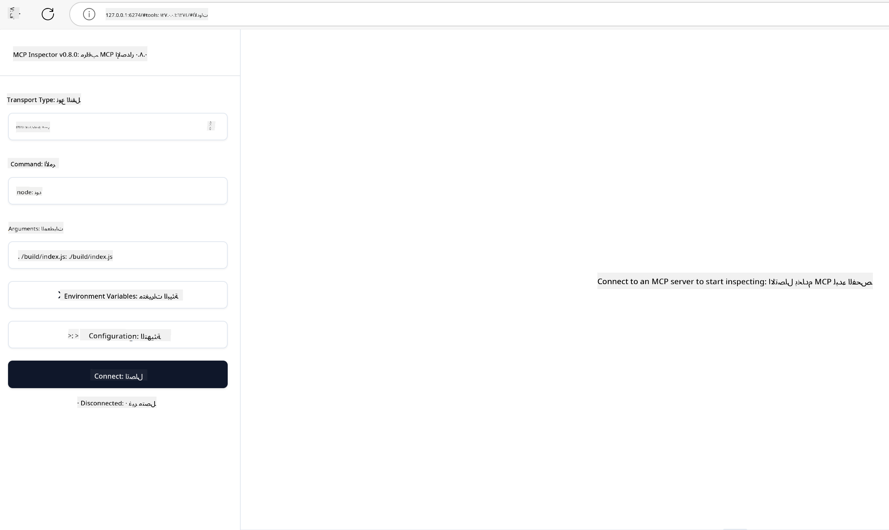

<!--
CO_OP_TRANSLATOR_METADATA:
{
  "original_hash": "83efa75a69bc831277263a6f1ae53669",
  "translation_date": "2025-08-18T13:35:59+00:00",
  "source_file": "04-PracticalImplementation/README.md",
  "language_code": "ar"
}
-->
# التنفيذ العملي

[](https://youtu.be/vCN9-mKBDfQ)

_(اضغط على الصورة أعلاه لمشاهدة فيديو هذا الدرس)_

التنفيذ العملي هو المكان الذي تصبح فيه قوة بروتوكول Model Context Protocol (MCP) ملموسة. بينما يُعد فهم النظرية والهندسة المعمارية وراء MCP أمرًا مهمًا، فإن القيمة الحقيقية تظهر عند تطبيق هذه المفاهيم لبناء واختبار ونشر حلول تحل مشكلات العالم الحقيقي. يهدف هذا الفصل إلى سد الفجوة بين المعرفة النظرية والتطوير العملي، حيث يرشدك خلال عملية تحويل تطبيقات MCP إلى واقع.

سواء كنت تطور مساعدين أذكياء، أو تدمج الذكاء الاصطناعي في سير العمل التجاري، أو تبني أدوات مخصصة لمعالجة البيانات، فإن MCP يوفر أساسًا مرنًا. تصميمه المحايد للغة ووجود SDKs رسمية للغات البرمجة الشهيرة يجعله متاحًا لمجموعة واسعة من المطورين. من خلال الاستفادة من هذه SDKs، يمكنك بسرعة إنشاء نماذج أولية، وتكرارها، وتوسيع نطاق حلولك عبر منصات وبيئات مختلفة.

في الأقسام التالية، ستجد أمثلة عملية، وأكواد نموذجية، واستراتيجيات نشر توضح كيفية تنفيذ MCP باستخدام C#، Java مع Spring، TypeScript، JavaScript، وPython. ستتعلم أيضًا كيفية تصحيح أخطاء خوادم MCP واختبارها، وإدارة واجهات برمجة التطبيقات (APIs)، ونشر الحلول إلى السحابة باستخدام Azure. تم تصميم هذه الموارد العملية لتسريع تعلمك ومساعدتك على بناء تطبيقات MCP قوية وجاهزة للإنتاج بثقة.

## نظرة عامة

يركز هذا الدرس على الجوانب العملية لتنفيذ MCP عبر لغات برمجة متعددة. سنستكشف كيفية استخدام SDKs الخاصة بـ MCP في C#، Java مع Spring، TypeScript، JavaScript، وPython لبناء تطبيقات قوية، وتصحيح أخطاء خوادم MCP واختبارها، وإنشاء موارد وقوالب وأدوات قابلة لإعادة الاستخدام.

## أهداف التعلم

بنهاية هذا الدرس، ستكون قادرًا على:

- تنفيذ حلول MCP باستخدام SDKs الرسمية في لغات برمجة متنوعة
- تصحيح أخطاء خوادم MCP واختبارها بشكل منهجي
- إنشاء واستخدام ميزات الخادم (الموارد، القوالب، والأدوات)
- تصميم سير عمل MCP فعال للمهام المعقدة
- تحسين تنفيذ MCP من حيث الأداء والموثوقية

## موارد SDK الرسمية

يوفر بروتوكول Model Context Protocol SDKs رسمية لعدة لغات:

- [C# SDK](https://github.com/modelcontextprotocol/csharp-sdk)
- [Java مع Spring SDK](https://github.com/modelcontextprotocol/java-sdk) **ملاحظة:** يتطلب الاعتماد على [Project Reactor](https://projectreactor.io). (راجع [مناقشة القضية 246](https://github.com/orgs/modelcontextprotocol/discussions/246).)
- [TypeScript SDK](https://github.com/modelcontextprotocol/typescript-sdk)
- [Python SDK](https://github.com/modelcontextprotocol/python-sdk)
- [Kotlin SDK](https://github.com/modelcontextprotocol/kotlin-sdk)

## العمل مع SDKs الخاصة بـ MCP

يوفر هذا القسم أمثلة عملية لتنفيذ MCP عبر لغات برمجة متعددة. يمكنك العثور على أكواد نموذجية في دليل `samples` المنظم حسب اللغة.

### العينات المتوفرة

يتضمن المستودع [تنفيذات نموذجية](../../../04-PracticalImplementation/samples) باللغات التالية:

- [C#](./samples/csharp/README.md)
- [Java مع Spring](./samples/java/containerapp/README.md)
- [TypeScript](./samples/typescript/README.md)
- [JavaScript](./samples/javascript/README.md)
- [Python](./samples/python/README.md)

كل عينة توضح مفاهيم MCP الرئيسية وأنماط التنفيذ الخاصة بتلك اللغة والنظام البيئي.

## ميزات الخادم الأساسية

يمكن لخوادم MCP تنفيذ أي مجموعة من هذه الميزات:

### الموارد

توفر الموارد سياقًا وبيانات للمستخدم أو نموذج الذكاء الاصطناعي لاستخدامها:

- مستودعات الوثائق
- قواعد المعرفة
- مصادر البيانات المنظمة
- أنظمة الملفات

### القوالب

القوالب هي رسائل وأنماط عمل موجهة للمستخدمين:

- قوالب محادثة محددة مسبقًا
- أنماط تفاعل موجهة
- هياكل حوار متخصصة

### الأدوات

الأدوات هي وظائف ينفذها نموذج الذكاء الاصطناعي:

- أدوات معالجة البيانات
- تكاملات API الخارجية
- قدرات حسابية
- وظائف البحث

## تنفيذات نموذجية: تنفيذ C#

يتضمن مستودع SDK الرسمي لـ C# عدة تنفيذات نموذجية توضح جوانب مختلفة من MCP:

- **عميل MCP الأساسي**: مثال بسيط يوضح كيفية إنشاء عميل MCP واستدعاء الأدوات
- **خادم MCP الأساسي**: تنفيذ خادم بسيط مع تسجيل أدوات أساسي
- **خادم MCP المتقدم**: خادم متكامل الميزات مع تسجيل الأدوات، والمصادقة، ومعالجة الأخطاء
- **تكامل ASP.NET**: أمثلة توضح التكامل مع ASP.NET Core
- **أنماط تنفيذ الأدوات**: أنماط مختلفة لتنفيذ الأدوات بمستويات تعقيد مختلفة

SDK الخاص بـ MCP في C# في مرحلة المعاينة وقد تتغير واجهات برمجة التطبيقات. سنقوم بتحديث هذه المدونة باستمرار مع تطور SDK.

### الميزات الرئيسية

- [C# MCP Nuget ModelContextProtocol](https://www.nuget.org/packages/ModelContextProtocol)
- بناء [أول خادم MCP](https://devblogs.microsoft.com/dotnet/build-a-model-context-protocol-mcp-server-in-csharp/).

للحصول على عينات تنفيذ كاملة لـ C#، قم بزيارة [مستودع العينات الرسمي لـ C# SDK](https://github.com/modelcontextprotocol/csharp-sdk)

## تنفيذ نموذجي: تنفيذ Java مع Spring

يوفر SDK الخاص بـ Java مع Spring خيارات تنفيذ MCP قوية مع ميزات على مستوى المؤسسات.

### الميزات الرئيسية

- تكامل مع إطار عمل Spring
- أمان قوي للأنواع
- دعم البرمجة التفاعلية
- معالجة شاملة للأخطاء

للحصول على عينة تنفيذ كاملة لـ Java مع Spring، راجع [عينة Java مع Spring](samples/java/containerapp/README.md) في دليل العينات.

## تنفيذ نموذجي: تنفيذ JavaScript

يوفر SDK الخاص بـ JavaScript نهجًا خفيف الوزن ومرنًا لتنفيذ MCP.

### الميزات الرئيسية

- دعم Node.js والمتصفح
- واجهة برمجة تعتمد على الوعود (Promise-based API)
- تكامل سهل مع Express وأطر عمل أخرى
- دعم WebSocket للبث

للحصول على عينة تنفيذ كاملة لـ JavaScript، راجع [عينة JavaScript](samples/javascript/README.md) في دليل العينات.

## تنفيذ نموذجي: تنفيذ Python

يوفر SDK الخاص بـ Python نهجًا Pythonic لتنفيذ MCP مع تكامل ممتاز مع أطر عمل التعلم الآلي.

### الميزات الرئيسية

- دعم Async/await مع asyncio
- تكامل مع FastAPI
- تسجيل أدوات بسيط
- تكامل أصلي مع مكتبات التعلم الآلي الشهيرة

للحصول على عينة تنفيذ كاملة لـ Python، راجع [عينة Python](samples/python/README.md) في دليل العينات.

## إدارة واجهات برمجة التطبيقات (APIs)

تُعد إدارة واجهات برمجة التطبيقات في Azure حلاً رائعًا لتأمين خوادم MCP. الفكرة هي وضع مثيل إدارة واجهات برمجة التطبيقات في Azure أمام خادم MCP الخاص بك وتركه يتولى الميزات التي قد تحتاجها مثل:

- تحديد معدل الطلبات
- إدارة الرموز (Tokens)
- المراقبة
- موازنة الأحمال
- الأمان

### عينة Azure

إليك عينة من Azure تقوم بذلك بالضبط، أي [إنشاء خادم MCP وتأمينه باستخدام إدارة واجهات برمجة التطبيقات في Azure](https://github.com/Azure-Samples/remote-mcp-apim-functions-python).

### اختبار الخادم الخاص بك باستخدام MCP Inspector

1. في **نافذة طرفية جديدة**، قم بتثبيت وتشغيل MCP Inspector

    ```shell
    npx @modelcontextprotocol/inspector
    ```

    يجب أن ترى واجهة مشابهة لـ:

    

1. اضغط على الرابط لتحميل تطبيق الويب MCP Inspector من عنوان URL الذي يعرضه التطبيق (مثل [http://127.0.0.1:6274/#resources](http://127.0.0.1:6274/#resources))
1. قم بتعيين نوع النقل إلى `SSE`
1. قم بتعيين عنوان URL إلى نقطة نهاية SSE الخاصة بإدارة واجهات برمجة التطبيقات التي تم عرضها بعد `azd up` واضغط على **اتصال**:

    ```shell
    https://<apim-servicename-from-azd-output>.azure-api.net/mcp/sse
    ```

1. **قائمة الأدوات**. اضغط على أداة واختر **تشغيل الأداة**.

إذا نجحت جميع الخطوات، يجب أن تكون الآن متصلاً بخادم MCP وتمكنت من استدعاء أداة.

## خوادم MCP لـ Azure

[Remote-mcp-functions](https://github.com/Azure-Samples/remote-mcp-functions-dotnet): توفر هذه المجموعة من المستودعات قوالب بدء سريعة لبناء ونشر خوادم MCP مخصصة باستخدام Azure Functions مع Python، C# .NET أو Node/TypeScript.

### الميزات الرئيسية

- الأمان حسب التصميم: يتم تأمين خادم MCP باستخدام المفاتيح وHTTPS
- خيارات المصادقة: يدعم OAuth باستخدام المصادقة المدمجة و/أو إدارة واجهات برمجة التطبيقات
- العزل الشبكي: يسمح بالعزل الشبكي باستخدام شبكات Azure الافتراضية (VNET)
- بنية بدون خادم: تعتمد على Azure Functions للتنفيذ القابل للتوسع والموجه بالأحداث
- التطوير المحلي: دعم شامل للتطوير المحلي وتصحيح الأخطاء
- عملية نشر بسيطة: عملية نشر مبسطة إلى Azure

## النقاط الرئيسية

- توفر SDKs الخاصة بـ MCP أدوات خاصة بكل لغة لتنفيذ حلول MCP قوية
- عملية تصحيح الأخطاء والاختبار ضرورية لتطبيقات MCP الموثوقة
- قوالب القوالب القابلة لإعادة الاستخدام تمكن من تفاعلات AI متسقة
- يمكن لسير العمل المصمم جيدًا تنظيم المهام المعقدة باستخدام أدوات متعددة
- يتطلب تنفيذ حلول MCP مراعاة الأمان، الأداء، ومعالجة الأخطاء

## تمرين

صمم سير عمل MCP عملي يعالج مشكلة واقعية في مجالك:

1. حدد 3-4 أدوات ستكون مفيدة لحل هذه المشكلة
2. أنشئ مخطط سير عمل يوضح كيفية تفاعل هذه الأدوات
3. نفذ نسخة أساسية من إحدى الأدوات باستخدام لغتك المفضلة
4. أنشئ قالبًا يساعد النموذج على استخدام أداتك بفعالية

## موارد إضافية

---

التالي: [المواضيع المتقدمة](../05-AdvancedTopics/README.md)

**إخلاء المسؤولية**:  
تمت ترجمة هذا المستند باستخدام خدمة الترجمة الآلية [Co-op Translator](https://github.com/Azure/co-op-translator). بينما نسعى لتحقيق الدقة، يرجى العلم أن الترجمات الآلية قد تحتوي على أخطاء أو عدم دقة. يجب اعتبار المستند الأصلي بلغته الأصلية هو المصدر الموثوق. للحصول على معلومات حاسمة، يُوصى بالاستعانة بترجمة بشرية احترافية. نحن غير مسؤولين عن أي سوء فهم أو تفسيرات خاطئة تنشأ عن استخدام هذه الترجمة.