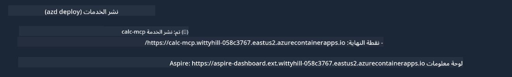

<!--
CO_OP_TRANSLATOR_METADATA:
{
  "original_hash": "5020a3e1a1c7f30c00f9e37f1fa208e3",
  "translation_date": "2025-05-17T14:05:14+00:00",
  "source_file": "04-PracticalImplementation/samples/csharp/README.md",
  "language_code": "ar"
}
-->
# نموذج

المثال السابق يوضح كيفية استخدام مشروع .NET محلي مع النوع `sdio` وكيفية تشغيل الخادم محليًا في حاوية. هذه حل جيد في العديد من الحالات. ومع ذلك، قد يكون من المفيد تشغيل الخادم عن بعد، مثل في بيئة السحاب. هنا يأتي دور النوع `http`.

عند النظر إلى الحل في المجلد `04-PracticalImplementation`، قد يبدو أكثر تعقيدًا من المثال السابق. لكن في الواقع، ليس كذلك. إذا نظرت بعناية إلى المشروع `src/mcpserver/mcpserver.csproj`، ستلاحظ أنه في الغالب نفس الكود كما في المثال السابق. الفرق الوحيد هو أننا نستخدم مكتبة مختلفة `ModelContextProtocol.AspNetCore` لمعالجة طلبات HTTP. وقمنا بتغيير الطريقة `IsPrime` لجعلها خاصة، فقط لنظهر أنه يمكنك أن يكون لديك طرق خاصة في الكود الخاص بك. بقية الكود هو نفسه كما كان من قبل.

المشاريع الأخرى تأتي من [.NET Aspire](https://learn.microsoft.com/dotnet/aspire/get-started/aspire-overview). وجود .NET Aspire في الحل سيحسن تجربة المطور أثناء التطوير والاختبار ويساعد في المراقبة. ليس من الضروري لتشغيل الخادم، لكنه ممارسة جيدة ليكون في الحل الخاص بك.

## بدء الخادم محليًا

1. من VS Code (مع امتداد C# DevKit)، افتح الحل `04-PracticalImplementation\samples\csharp\src\Calculator-chap4.sln`.
2. اضغط على `F5` لبدء الخادم. يجب أن يبدأ متصفح الويب مع لوحة التحكم .NET Aspire.

أو

1. من الطرفية، انتقل إلى المجلد `04-PracticalImplementation\samples\csharp\src`
2. نفذ الأمر التالي لبدء الخادم:
   ```bash
    dotnet run --project .\AppHost
   ```

3. من لوحة التحكم، لاحظ عنوان URL `http`. يجب أن يكون شيء مثل `http://localhost:5058/`.

## Test `SSE` مع مفتش بروتوكول ModelContext

إذا كان لديك Node.js 22.7.5 وأعلى، يمكنك استخدام مفتش بروتوكول ModelContext لاختبار الخادم الخاص بك.

ابدأ الخادم وقم بتشغيل الأمر التالي في الطرفية:

```bash
npx @modelcontextprotocol/inspector@latest
```


- اختر `SSE` as the Transport type. SSE stand for Server-Sent Events. 
- In the Url field, enter the URL of the server noted earlier,and append `/sse`. يجب أن يكون `http` (ليس `https`) something like `http://localhost:5058/sse`.
- select the Connect button.

A nice thing about the Inspector is that it provide a nice visibility on what is happening.

- Try listing the availables tools
- Try some of them, it should works just like before.


## Test `SSE` with Github Copilot Chat in VS Code

To use the `SSE` transport with Github Copilot Chat, change the configuration of the `mcp-calc` الخادم الذي تم إنشاؤه سابقًا ليبدو هكذا:

```json
"mcp-calc": {
    "type": "sse",
    "url": "http://localhost:5058/sse"
}
```

قم ببعض الاختبارات:
- اطلب الأرقام الأولية الثلاثة بعد 6780. لاحظ كيف سيستخدم Copilot الأدوات الجديدة `NextFivePrimeNumbers` ويعيد فقط الأرقام الأولية الثلاثة الأولى.
- اطلب الأرقام الأولية السبعة بعد 111، لترى ماذا يحدث.

# نشر الخادم إلى Azure

لنقم بنشر الخادم إلى Azure لكي يتمكن المزيد من الأشخاص من استخدامه.

من الطرفية، انتقل إلى المجلد `04-PracticalImplementation\samples\csharp\src` وقم بتشغيل الأمر التالي:

```bash
azd init
```

هذا سيقوم بإنشاء بعض الملفات محليًا لحفظ تكوين موارد Azure والبنية التحتية ككود (IaC).

ثم، قم بتشغيل الأمر التالي لنشر الخادم إلى Azure:

```bash
azd up
```

بمجرد انتهاء النشر، يجب أن ترى رسالة مثل هذه:



انتقل إلى لوحة التحكم Aspire ولاحظ عنوان URL `HTTP` لاستخدامه في مفتش MCP وفي دردشة Github Copilot.

## ماذا بعد؟

نجرب أنواع نقل مختلفة، وأدوات اختبار وقمنا أيضًا بنشر خادم MCP الخاص بنا إلى Azure. ولكن ماذا إذا كان خادمنا يحتاج إلى الوصول إلى موارد خاصة؟ على سبيل المثال، قاعدة بيانات أو واجهة برمجة تطبيقات خاصة؟ في الفصل التالي، سنرى كيف يمكننا تحسين أمان خادمنا.

**إخلاء المسؤولية**:  
تمت ترجمة هذا المستند باستخدام خدمة الترجمة بالذكاء الاصطناعي [Co-op Translator](https://github.com/Azure/co-op-translator). بينما نسعى لتحقيق الدقة، يرجى العلم أن الترجمات الآلية قد تحتوي على أخطاء أو عدم دقة. يجب اعتبار المستند الأصلي بلغته الأصلية المصدر الموثوق. للحصول على معلومات حيوية، يوصى بالترجمة البشرية الاحترافية. نحن غير مسؤولين عن أي سوء فهم أو تفسيرات خاطئة تنشأ عن استخدام هذه الترجمة.