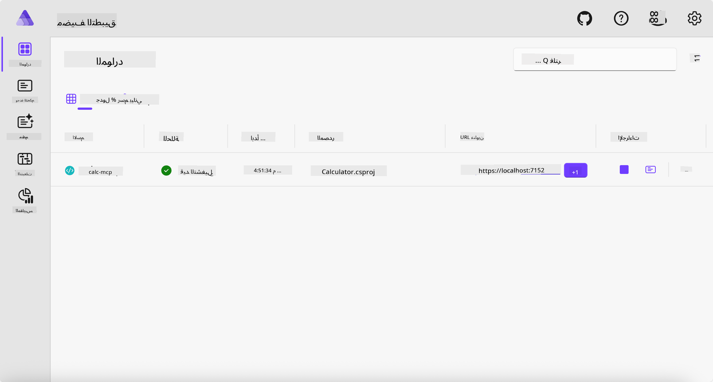
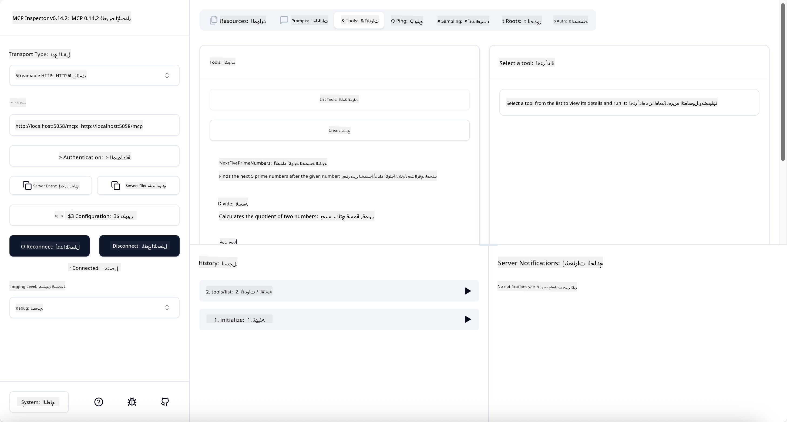
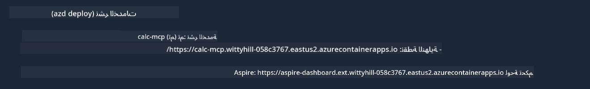

<!--
CO_OP_TRANSLATOR_METADATA:
{
  "original_hash": "0bc7bd48f55f1565f1d95ccb2c16f728",
  "translation_date": "2025-07-13T23:03:46+00:00",
  "source_file": "04-PracticalImplementation/samples/csharp/README.md",
  "language_code": "ar"
}
-->
# مثال

يُظهر المثال السابق كيفية استخدام مشروع .NET محلي مع نوع `stdio`. وكيفية تشغيل الخادم محليًا داخل حاوية. هذا حل جيد في العديد من الحالات. ومع ذلك، قد يكون من المفيد تشغيل الخادم عن بُعد، مثل بيئة السحابة. وهنا يأتي دور نوع `http`.

عند النظر إلى الحل في مجلد `04-PracticalImplementation`، قد يبدو أكثر تعقيدًا من المثال السابق. لكن في الواقع، ليس كذلك. إذا نظرت عن كثب إلى مشروع `src/Calculator`، سترى أنه في الغالب نفس الكود كما في المثال السابق. الاختلاف الوحيد هو أننا نستخدم مكتبة مختلفة `ModelContextProtocol.AspNetCore` للتعامل مع طلبات HTTP. ونغير الطريقة `IsPrime` لتصبح خاصة، فقط لإظهار أنه يمكنك وجود طرق خاصة في كودك. بقية الكود هو نفسه كما كان من قبل.

المشاريع الأخرى هي من [.NET Aspire](https://learn.microsoft.com/dotnet/aspire/get-started/aspire-overview). وجود .NET Aspire في الحل سيحسن تجربة المطور أثناء التطوير والاختبار ويساعد في الرصد. ليس من الضروري لتشغيل الخادم، لكنه ممارسة جيدة أن يكون موجودًا في الحل الخاص بك.

## تشغيل الخادم محليًا

1. من VS Code (مع امتداد C# DevKit)، انتقل إلى مجلد `04-PracticalImplementation/samples/csharp`.
1. نفذ الأمر التالي لتشغيل الخادم:

   ```bash
    dotnet watch run --project ./src/AppHost
   ```

1. عندما يفتح متصفح الويب لوحة تحكم .NET Aspire، لاحظ عنوان URL الخاص بـ `http`. يجب أن يكون شيئًا مثل `http://localhost:5058/`.

   

## اختبار Streamable HTTP باستخدام MCP Inspector

إذا كان لديك Node.js إصدار 22.7.5 أو أعلى، يمكنك استخدام MCP Inspector لاختبار الخادم الخاص بك.

شغّل الخادم ونفذ الأمر التالي في الطرفية:

```bash
npx @modelcontextprotocol/inspector http://localhost:5058
```



- اختر `Streamable HTTP` كنوع النقل.
- في حقل Url، أدخل عنوان URL الخاص بالخادم الذي لاحظته سابقًا، وأضف `/mcp` في النهاية. يجب أن يكون `http` (وليس `https`) مثل `http://localhost:5058/mcp`.
- اضغط على زر Connect.

ميزة جيدة في Inspector هي أنه يوفر رؤية واضحة لما يحدث.

- جرب عرض الأدوات المتاحة
- جرب بعضها، يجب أن تعمل كما في السابق.

## اختبار MCP Server مع GitHub Copilot Chat في VS Code

لاستخدام نقل Streamable HTTP مع GitHub Copilot Chat، غيّر إعدادات خادم `calc-mcp` الذي أنشأته سابقًا ليبدو كالتالي:

```jsonc
// .vscode/mcp.json
{
  "servers": {
    "calc-mcp": {
      "type": "http",
      "url": "http://localhost:5058/mcp"
    }
  }
}
```

قم ببعض الاختبارات:

- اطلب "3 أعداد أولية بعد 6780". لاحظ كيف سيستخدم Copilot الأدوات الجديدة `NextFivePrimeNumbers` ويعيد فقط أول 3 أعداد أولية.
- اطلب "7 أعداد أولية بعد 111"، لترى ماذا يحدث.
- اطلب "جون لديه 24 مصاصة ويريد توزيعها كلها على أطفاله الثلاثة. كم عدد المصاصات التي يحصل عليها كل طفل؟"، لترى ماذا يحدث.

## نشر الخادم على Azure

لنشر الخادم على Azure ليتمكن المزيد من الأشخاص من استخدامه.

من الطرفية، انتقل إلى مجلد `04-PracticalImplementation/samples/csharp` ونفذ الأمر التالي:

```bash
azd up
```

عند انتهاء النشر، يجب أن ترى رسالة مثل هذه:



انسخ عنوان URL واستخدمه في MCP Inspector وفي GitHub Copilot Chat.

```jsonc
// .vscode/mcp.json
{
  "servers": {
    "calc-mcp": {
      "type": "http",
      "url": "https://calc-mcp.gentleriver-3977fbcf.australiaeast.azurecontainerapps.io/mcp"
    }
  }
}
```

## ماذا بعد؟

جربنا أنواع نقل مختلفة وأدوات اختبار. كما نشرنا خادم MCP الخاص بك على Azure. لكن ماذا لو كان خادمنا يحتاج إلى الوصول إلى موارد خاصة؟ مثل قاعدة بيانات أو API خاصة؟ في الفصل القادم، سنرى كيف يمكننا تحسين أمان الخادم الخاص بنا.

**إخلاء المسؤولية**:  
تمت ترجمة هذا المستند باستخدام خدمة الترجمة الآلية [Co-op Translator](https://github.com/Azure/co-op-translator). بينما نسعى لتحقيق الدقة، يرجى العلم أن الترجمات الآلية قد تحتوي على أخطاء أو عدم دقة. يجب اعتبار المستند الأصلي بلغته الأصلية المصدر الموثوق به. للمعلومات الهامة، يُنصح بالترجمة البشرية المهنية. نحن غير مسؤولين عن أي سوء فهم أو تفسير ناتج عن استخدام هذه الترجمة.