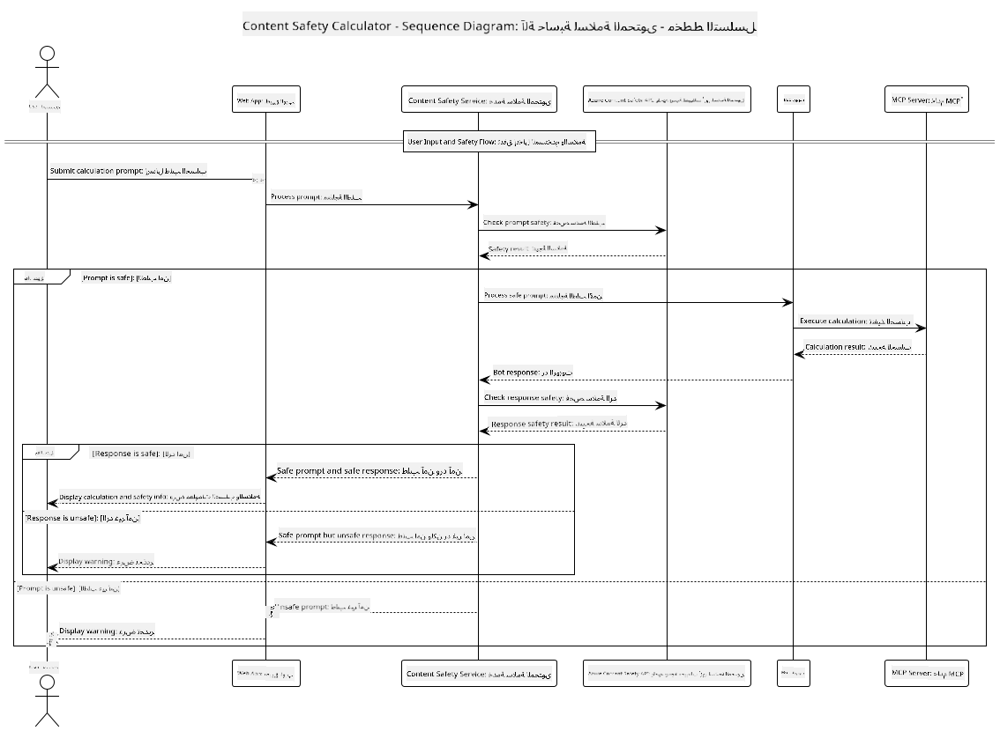

<!--
CO_OP_TRANSLATOR_METADATA:
{
  "original_hash": "e5ea5e7582f70008ea9bec3b3820f20a",
  "translation_date": "2025-07-13T23:12:00+00:00",
  "source_file": "04-PracticalImplementation/samples/java/containerapp/README.md",
  "language_code": "ar"
}
-->
## هندسة النظام

يعرض هذا المشروع تطبيق ويب يستخدم فحص سلامة المحتوى قبل تمرير مطالبات المستخدم إلى خدمة الآلة الحاسبة عبر بروتوكول سياق النموذج (MCP).



### كيف يعمل

1. **إدخال المستخدم**: يقوم المستخدم بإدخال طلب حسابي في واجهة الويب  
2. **فحص سلامة المحتوى (الإدخال)**: يتم تحليل الطلب بواسطة Azure Content Safety API  
3. **قرار السلامة (الإدخال)**:  
   - إذا كان المحتوى آمنًا (شدة < 2 في جميع الفئات)، يتم المتابعة إلى الآلة الحاسبة  
   - إذا تم تصنيف المحتوى كمحتمل الضرر، يتوقف العملية ويُعاد تحذير  
4. **تكامل الآلة الحاسبة**: يتم معالجة المحتوى الآمن بواسطة LangChain4j، الذي يتواصل مع خادم الآلة الحاسبة عبر MCP  
5. **فحص سلامة المحتوى (الإخراج)**: يتم تحليل رد البوت بواسطة Azure Content Safety API  
6. **قرار السلامة (الإخراج)**:  
   - إذا كان رد البوت آمنًا، يُعرض للمستخدم  
   - إذا تم تصنيف رد البوت كمحتمل الضرر، يُستبدل بتحذير  
7. **الرد**: تُعرض النتائج (إذا كانت آمنة) للمستخدم مع تحليلي السلامة لكلا الطرفين

## استخدام بروتوكول سياق النموذج (MCP) مع خدمات الآلة الحاسبة

يعرض هذا المشروع كيفية استخدام بروتوكول سياق النموذج (MCP) لاستدعاء خدمات الآلة الحاسبة عبر MCP من LangChain4j. يستخدم التنفيذ خادم MCP محلي يعمل على المنفذ 8080 لتوفير عمليات الآلة الحاسبة.

### إعداد خدمة Azure Content Safety

قبل استخدام ميزات سلامة المحتوى، تحتاج إلى إنشاء مورد خدمة Azure Content Safety:

1. سجّل الدخول إلى [بوابة Azure](https://portal.azure.com)  
2. انقر على "إنشاء مورد" وابحث عن "Content Safety"  
3. اختر "Content Safety" وانقر على "إنشاء"  
4. أدخل اسمًا فريدًا لموردك  
5. اختر اشتراكك ومجموعة الموارد (أو أنشئ مجموعة جديدة)  
6. اختر منطقة مدعومة (راجع [توفر المناطق](https://azure.microsoft.com/en-us/global-infrastructure/services/?products=cognitive-services) للتفاصيل)  
7. اختر خطة تسعير مناسبة  
8. انقر على "إنشاء" لنشر المورد  
9. بعد اكتمال النشر، انقر على "الانتقال إلى المورد"  
10. في اللوحة اليسرى، ضمن "إدارة المورد"، اختر "المفاتيح ونقطة النهاية"  
11. انسخ أحد المفاتيح وعنوان نقطة النهاية لاستخدامها في الخطوة التالية

### تكوين متغيرات البيئة

قم بتعيين متغير البيئة `GITHUB_TOKEN` لمصادقة نماذج GitHub:  
```sh
export GITHUB_TOKEN=<your_github_token>
```

لميزات سلامة المحتوى، قم بتعيين:  
```sh
export CONTENT_SAFETY_ENDPOINT=<your_content_safety_endpoint>
export CONTENT_SAFETY_KEY=<your_content_safety_key>
```

تُستخدم هذه المتغيرات من قبل التطبيق للمصادقة مع خدمة Azure Content Safety. إذا لم يتم تعيين هذه المتغيرات، سيستخدم التطبيق قيمًا افتراضية لأغراض العرض فقط، لكن ميزات سلامة المحتوى لن تعمل بشكل صحيح.

### بدء خادم MCP للآلة الحاسبة

قبل تشغيل العميل، تحتاج إلى بدء خادم MCP للآلة الحاسبة في وضع SSE على localhost:8080.

## وصف المشروع

يعرض هذا المشروع دمج بروتوكول سياق النموذج (MCP) مع LangChain4j لاستدعاء خدمات الآلة الحاسبة. تشمل الميزات الرئيسية:

- استخدام MCP للاتصال بخدمة الآلة الحاسبة للعمليات الحسابية الأساسية  
- فحص سلامة المحتوى بطبقتين لكل من مطالبات المستخدم وردود البوت  
- التكامل مع نموذج gpt-4.1-nano الخاص بـ GitHub عبر LangChain4j  
- استخدام أحداث الخادم المرسلة (SSE) لنقل MCP

## تكامل سلامة المحتوى

يتضمن المشروع ميزات شاملة لسلامة المحتوى لضمان خلو كل من مدخلات المستخدم وردود النظام من المحتوى الضار:

1. **فحص الإدخال**: يتم تحليل جميع مطالبات المستخدم لفئات المحتوى الضار مثل خطاب الكراهية، العنف، إيذاء النفس، والمحتوى الجنسي قبل المعالجة.  
2. **فحص الإخراج**: حتى عند استخدام نماذج قد تكون غير مراقبة، يتحقق النظام من جميع الردود المولدة عبر نفس فلاتر سلامة المحتوى قبل عرضها للمستخدم.

يضمن هذا النهج ذو الطبقتين بقاء النظام آمنًا بغض النظر عن النموذج الذكي المستخدم، مما يحمي المستخدمين من كل من المدخلات الضارة والمخرجات التي قد تكون إشكالية.

## عميل الويب

يتضمن التطبيق واجهة ويب سهلة الاستخدام تتيح للمستخدمين التفاعل مع نظام الآلة الحاسبة مع سلامة المحتوى:

### ميزات واجهة الويب

- نموذج بسيط وبديهي لإدخال مطالبات الحساب  
- تحقق مزدوج لسلامة المحتوى (الإدخال والإخراج)  
- تغذية راجعة فورية حول سلامة الطلب والرد  
- مؤشرات ألوان لسهولة التفسير  
- تصميم نظيف ومتجاوب يعمل على مختلف الأجهزة  
- أمثلة على مطالبات آمنة لتوجيه المستخدمين

### استخدام عميل الويب

1. ابدأ التطبيق:  
   ```sh
   mvn spring-boot:run
   ```

2. افتح متصفحك وانتقل إلى `http://localhost:8087`

3. أدخل طلب حسابي في منطقة النص المتوفرة (مثلاً: "احسب مجموع 24.5 و 17.3")

4. انقر على "إرسال" لمعالجة طلبك

5. عرض النتائج، والتي ستشمل:  
   - تحليل سلامة المحتوى لطلبك  
   - النتيجة المحسوبة (إذا كان الطلب آمنًا)  
   - تحليل سلامة المحتوى لرد البوت  
   - أي تحذيرات سلامة إذا تم تصنيف الإدخال أو الإخراج كمشكلة

يتولى عميل الويب تلقائيًا كلا عمليتي التحقق من سلامة المحتوى، مما يضمن أن جميع التفاعلات آمنة ومناسبة بغض النظر عن النموذج الذكي المستخدم.

**إخلاء المسؤولية**:  
تمت ترجمة هذا المستند باستخدام خدمة الترجمة الآلية [Co-op Translator](https://github.com/Azure/co-op-translator). بينما نسعى لتحقيق الدقة، يرجى العلم أن الترجمات الآلية قد تحتوي على أخطاء أو عدم دقة. يجب اعتبار المستند الأصلي بلغته الأصلية المصدر الموثوق به. للمعلومات الهامة، يُنصح بالاعتماد على الترجمة البشرية المهنية. نحن غير مسؤولين عن أي سوء فهم أو تفسير ناتج عن استخدام هذه الترجمة.