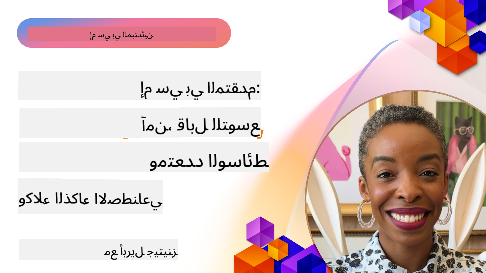

<!--
CO_OP_TRANSLATOR_METADATA:
{
  "original_hash": "d204bc94ea6027d06a703b21b711ca57",
  "translation_date": "2025-08-18T13:37:34+00:00",
  "source_file": "05-AdvancedTopics/README.md",
  "language_code": "ar"
}
-->
# مواضيع متقدمة في MCP

_(انقر على الصورة أعلاه لمشاهدة فيديو الدرس)_

يغطي هذا الفصل سلسلة من المواضيع المتقدمة في تنفيذ بروتوكول سياق النموذج (MCP)، بما في ذلك التكامل متعدد الوسائط، القابلية للتوسع، أفضل ممارسات الأمان، والتكامل المؤسسي. هذه المواضيع ضرورية لبناء تطبيقات MCP قوية وجاهزة للإنتاج تلبي متطلبات أنظمة الذكاء الاصطناعي الحديثة.

## نظرة عامة

يستكشف هذا الدرس مفاهيم متقدمة في تنفيذ بروتوكول سياق النموذج، مع التركيز على التكامل متعدد الوسائط، القابلية للتوسع، أفضل ممارسات الأمان، والتكامل المؤسسي. هذه المواضيع أساسية لبناء تطبيقات MCP جاهزة للإنتاج يمكنها التعامل مع متطلبات معقدة في بيئات المؤسسات.

## أهداف التعلم

بنهاية هذا الدرس، ستكون قادرًا على:

- تنفيذ قدرات متعددة الوسائط داخل أطر عمل MCP
- تصميم بنى MCP قابلة للتوسع لسيناريوهات الطلب العالي
- تطبيق أفضل ممارسات الأمان بما يتماشى مع مبادئ أمان MCP
- دمج MCP مع أنظمة وأطر عمل الذكاء الاصطناعي المؤسسية
- تحسين الأداء والموثوقية في بيئات الإنتاج

## الدروس والمشاريع النموذجية

| الرابط | العنوان | الوصف |
|--------|---------|-------|
| [5.1 التكامل مع Azure](./mcp-integration/README.md) | التكامل مع Azure | تعلم كيفية دمج خادم MCP الخاص بك على Azure |
| [5.2 نموذج متعدد الوسائط](./mcp-multi-modality/README.md) | نماذج متعددة الوسائط MCP | نماذج للصوت، الصور، والاستجابة متعددة الوسائط |
| [5.3 نموذج OAuth2 MCP](../../../05-AdvancedTopics/mcp-oauth2-demo) | عرض OAuth2 MCP | تطبيق Spring Boot بسيط يظهر OAuth2 مع MCP، كخادم تفويض وخادم موارد. يوضح إصدار الرموز الآمنة، نقاط النهاية المحمية، نشر تطبيقات Azure Container، وتكامل إدارة API. |
| [5.4 سياقات الجذر](./mcp-root-contexts/README.md) | سياقات الجذر | تعرف على المزيد حول سياقات الجذر وكيفية تنفيذها |
| [5.5 التوجيه](./mcp-routing/README.md) | التوجيه | تعلم أنواع مختلفة من التوجيه |
| [5.6 أخذ العينات](./mcp-sampling/README.md) | أخذ العينات | تعلم كيفية العمل مع أخذ العينات |
| [5.7 التوسع](./mcp-scaling/README.md) | التوسع | تعرف على التوسع |
| [5.8 الأمان](./mcp-security/README.md) | الأمان | قم بتأمين خادم MCP الخاص بك |
| [5.9 نموذج البحث على الويب](./web-search-mcp/README.md) | بحث الويب MCP | خادم وعميل MCP بلغة Python يتكامل مع SerpAPI للبحث في الوقت الحقيقي على الويب، الأخبار، المنتجات، والأسئلة والأجوبة. يوضح تنسيق الأدوات المتعددة، تكامل API الخارجي، ومعالجة الأخطاء القوية. |
| [5.10 البث في الوقت الحقيقي](./mcp-realtimestreaming/README.md) | البث | أصبح البث المباشر للبيانات ضروريًا في عالم اليوم القائم على البيانات، حيث تحتاج الشركات والتطبيقات إلى الوصول الفوري للمعلومات لاتخاذ قرارات في الوقت المناسب. |
| [5.11 البحث على الويب في الوقت الحقيقي](./mcp-realtimesearch/README.md) | بحث الويب | كيف يحول MCP البحث على الويب في الوقت الحقيقي من خلال توفير نهج موحد لإدارة السياق عبر نماذج الذكاء الاصطناعي، محركات البحث، والتطبيقات. |
| [5.12 مصادقة Entra ID لخوادم بروتوكول سياق النموذج](./mcp-security-entra/README.md) | مصادقة Entra ID | يوفر Microsoft Entra ID حلاً قوياً لإدارة الهوية والوصول المستندة إلى السحابة، مما يساعد على ضمان أن المستخدمين والتطبيقات المصرح لهم فقط يمكنهم التفاعل مع خادم MCP الخاص بك. |
| [5.13 تكامل وكيل Azure AI Foundry](./mcp-foundry-agent-integration/README.md) | تكامل Azure AI Foundry | تعلم كيفية دمج خوادم بروتوكول سياق النموذج مع وكلاء Azure AI Foundry، مما يتيح تنسيق الأدوات القوي وقدرات الذكاء الاصطناعي المؤسسية مع اتصالات موحدة لمصادر البيانات الخارجية. |
| [5.14 هندسة السياق](./mcp-contextengineering/README.md) | هندسة السياق | الفرصة المستقبلية لتقنيات هندسة السياق لخوادم MCP، بما في ذلك تحسين السياق، إدارة السياق الديناميكي، واستراتيجيات الهندسة الفعالة للمطالبات داخل أطر عمل MCP. |

## مراجع إضافية

للحصول على أحدث المعلومات حول مواضيع MCP المتقدمة، راجع:
- [وثائق MCP](https://modelcontextprotocol.io/)
- [مواصفات MCP](https://spec.modelcontextprotocol.io/)
- [مستودع GitHub](https://github.com/modelcontextprotocol)

## النقاط الرئيسية

- تنفيذات MCP متعددة الوسائط توسع قدرات الذكاء الاصطناعي إلى ما هو أبعد من معالجة النصوص
- القابلية للتوسع ضرورية لنشر المؤسسات ويمكن معالجتها من خلال التوسع الأفقي والعمودي
- تدابير الأمان الشاملة تحمي البيانات وتضمن التحكم المناسب في الوصول
- التكامل المؤسسي مع منصات مثل Azure OpenAI وMicrosoft AI Foundry يعزز قدرات MCP
- تستفيد تنفيذات MCP المتقدمة من البنى المحسنة والإدارة الدقيقة للموارد

## تمرين

صمم تنفيذ MCP على مستوى المؤسسة لحالة استخدام محددة:

1. حدد متطلبات الوسائط المتعددة لحالة الاستخدام الخاصة بك
2. ضع قائمة بعناصر التحكم الأمنية اللازمة لحماية البيانات الحساسة
3. صمم بنية قابلة للتوسع يمكنها التعامل مع الأحمال المتغيرة
4. خطط لنقاط التكامل مع أنظمة الذكاء الاصطناعي المؤسسية
5. وثق اختناقات الأداء المحتملة واستراتيجيات التخفيف

## موارد إضافية

- [وثائق Azure OpenAI](https://learn.microsoft.com/en-us/azure/ai-services/openai/)
- [وثائق Microsoft AI Foundry](https://learn.microsoft.com/en-us/ai-services/)

---

## ما التالي

- [5.1 تكامل MCP](./mcp-integration/README.md)

**إخلاء المسؤولية**:  
تمت ترجمة هذا المستند باستخدام خدمة الترجمة الآلية [Co-op Translator](https://github.com/Azure/co-op-translator). على الرغم من أننا نسعى لتحقيق الدقة، يرجى العلم أن الترجمات الآلية قد تحتوي على أخطاء أو عدم دقة. يجب اعتبار المستند الأصلي بلغته الأصلية المصدر الموثوق. للحصول على معلومات حساسة أو هامة، يُوصى بالاستعانة بترجمة بشرية احترافية. نحن غير مسؤولين عن أي سوء فهم أو تفسيرات خاطئة تنشأ عن استخدام هذه الترجمة.