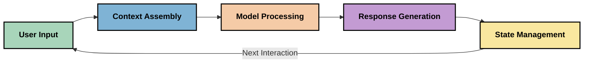
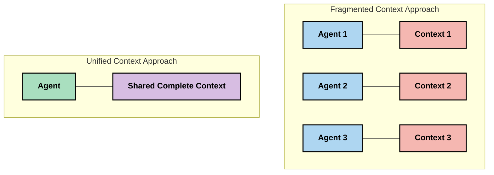
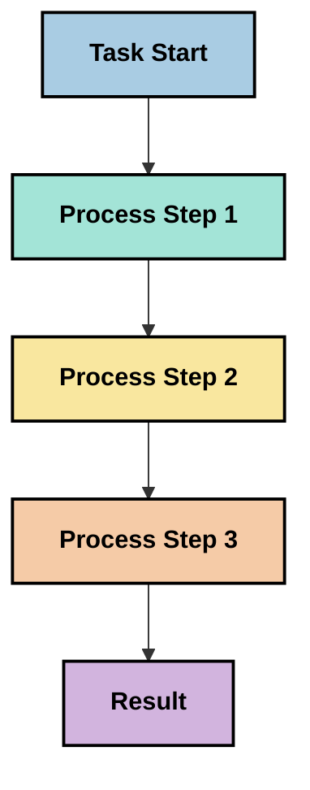
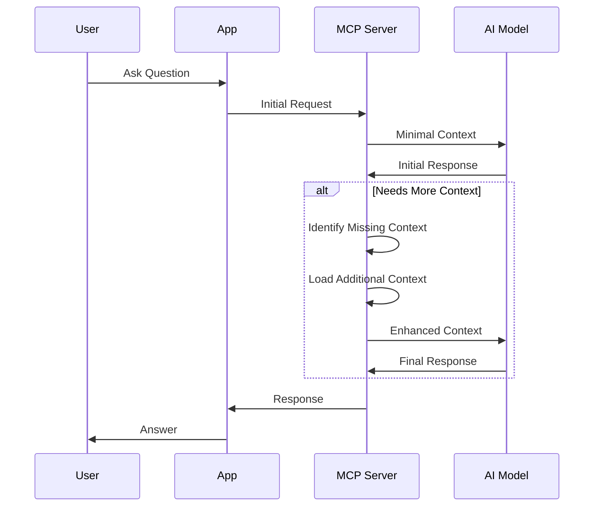
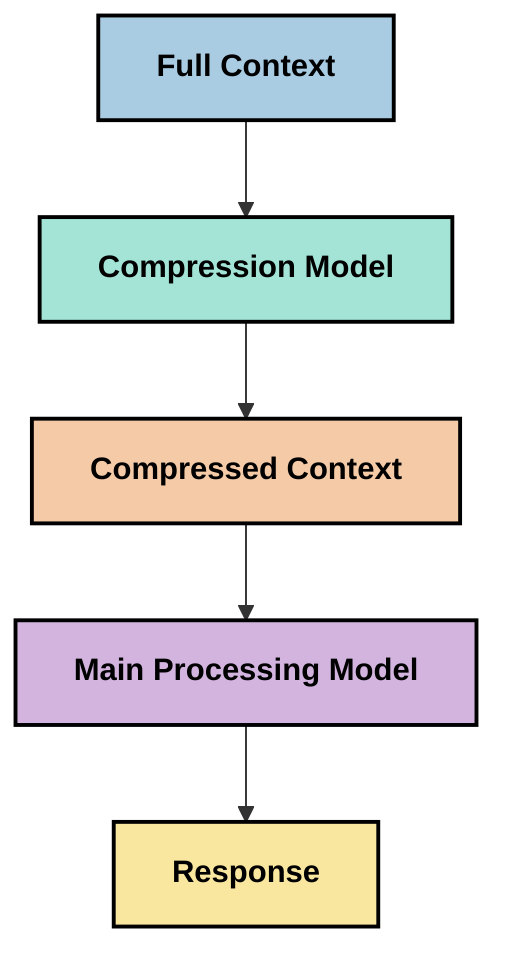
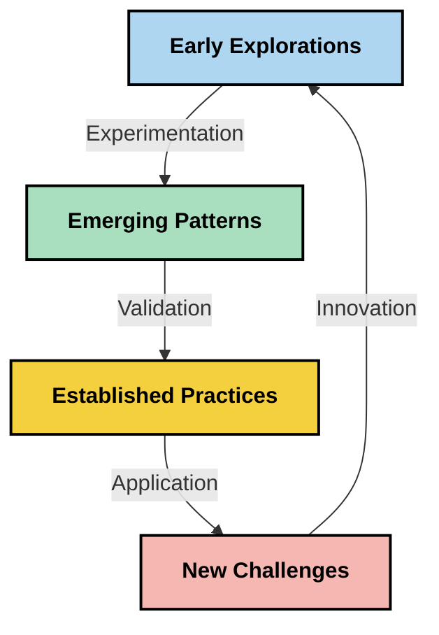

<!--
CO_OP_TRANSLATOR_METADATA:
{
  "original_hash": "5762e8e74dd99d8b7dbb31e69a82561e",
  "translation_date": "2025-07-17T01:37:02+00:00",
  "source_file": "05-AdvancedTopics/mcp-contextengineering/README.md",
  "language_code": "ar"
}
-->
# هندسة السياق: مفهوم ناشئ في نظام MCP البيئي

## نظرة عامة

هندسة السياق هي مفهوم ناشئ في مجال الذكاء الاصطناعي يستكشف كيفية تنظيم المعلومات وتسليمها والحفاظ عليها خلال التفاعلات بين العملاء وخدمات الذكاء الاصطناعي. مع تطور نظام بروتوكول سياق النموذج (MCP)، يصبح فهم كيفية إدارة السياق بفعالية أمرًا ذا أهمية متزايدة. يقدم هذا الوحدة مفهوم هندسة السياق ويستعرض تطبيقاته المحتملة في تنفيذات MCP.

## أهداف التعلم

بنهاية هذه الوحدة، ستكون قادرًا على:

- فهم مفهوم هندسة السياق الناشئ ودوره المحتمل في تطبيقات MCP
- التعرف على التحديات الرئيسية في إدارة السياق التي يعالجها تصميم بروتوكول MCP
- استكشاف تقنيات لتحسين أداء النماذج من خلال تحسين التعامل مع السياق
- النظر في طرق قياس وتقييم فعالية السياق
- تطبيق هذه المفاهيم الناشئة لتحسين تجارب الذكاء الاصطناعي عبر إطار عمل MCP

## مقدمة في هندسة السياق

هندسة السياق هي مفهوم ناشئ يركز على التصميم المتعمد وإدارة تدفق المعلومات بين المستخدمين والتطبيقات ونماذج الذكاء الاصطناعي. على عكس مجالات معروفة مثل هندسة المطالبات، لا يزال مفهوم هندسة السياق يتشكل على يد الممارسين أثناء عملهم على حل التحديات الفريدة لتزويد نماذج الذكاء الاصطناعي بالمعلومات الصحيحة في الوقت المناسب.

مع تطور نماذج اللغة الكبيرة (LLMs)، أصبح أهمية السياق أكثر وضوحًا. جودة وملاءمة وبنية السياق الذي نقدمه تؤثر مباشرة على مخرجات النموذج. تستكشف هندسة السياق هذه العلاقة وتسعى لتطوير مبادئ لإدارة السياق بفعالية.

> "في عام 2025، النماذج المتاحة ذكية للغاية. لكن حتى أذكى البشر لن يتمكنوا من أداء عملهم بفعالية بدون سياق ما يُطلب منهم القيام به... 'هندسة السياق' هي المستوى التالي لهندسة المطالبات. هي القيام بذلك تلقائيًا في نظام ديناميكي." — Walden Yan، Cognition AI

قد تشمل هندسة السياق:

1. **اختيار السياق**: تحديد المعلومات ذات الصلة لمهمة معينة  
2. **هيكلة السياق**: تنظيم المعلومات لتعظيم فهم النموذج  
3. **تسليم السياق**: تحسين كيفية ووقت إرسال المعلومات إلى النماذج  
4. **صيانة السياق**: إدارة حالة وتطور السياق مع مرور الوقت  
5. **تقييم السياق**: قياس وتحسين فعالية السياق  

هذه المجالات ذات صلة خاصة بنظام MCP البيئي، الذي يوفر طريقة موحدة للتطبيقات لتقديم السياق إلى نماذج اللغة الكبيرة.

## منظور رحلة السياق

طريقة واحدة لتصور هندسة السياق هي تتبع رحلة المعلومات عبر نظام MCP:



### المراحل الرئيسية في رحلة السياق:

1. **إدخال المستخدم**: المعلومات الخام من المستخدم (نصوص، صور، مستندات)  
2. **تجميع السياق**: دمج إدخال المستخدم مع سياق النظام، تاريخ المحادثة، ومعلومات أخرى مسترجعة  
3. **معالجة النموذج**: يقوم نموذج الذكاء الاصطناعي بمعالجة السياق المجمّع  
4. **توليد الاستجابة**: ينتج النموذج مخرجات بناءً على السياق المقدم  
5. **إدارة الحالة**: يقوم النظام بتحديث حالته الداخلية بناءً على التفاعل  

يسلط هذا المنظور الضوء على الطبيعة الديناميكية للسياق في أنظمة الذكاء الاصطناعي ويطرح أسئلة مهمة حول أفضل طرق إدارة المعلومات في كل مرحلة.

## المبادئ الناشئة في هندسة السياق

مع تشكل مجال هندسة السياق، بدأت بعض المبادئ الأولية تظهر من قبل الممارسين. قد تساعد هذه المبادئ في توجيه اختيارات تنفيذ MCP:

### المبدأ 1: مشاركة السياق بشكل كامل

يجب مشاركة السياق بشكل كامل بين جميع مكونات النظام بدلاً من تجزئته عبر وكلاء أو عمليات متعددة. عندما يُوزع السياق، قد تتعارض القرارات المتخذة في جزء من النظام مع تلك المتخذة في مكان آخر.



في تطبيقات MCP، يشير هذا إلى تصميم أنظمة يتدفق فيها السياق بسلاسة عبر كامل الخط بدلاً من تقسيمه.

### المبدأ 2: الاعتراف بأن الأفعال تحمل قرارات ضمنية

كل فعل يتخذه النموذج يتضمن قرارات ضمنية حول كيفية تفسير السياق. عندما تتصرف مكونات متعددة على سياقات مختلفة، قد تتعارض هذه القرارات الضمنية، مما يؤدي إلى نتائج غير متسقة.

لهذا المبدأ آثار مهمة على تطبيقات MCP:
- تفضيل المعالجة الخطية للمهام المعقدة بدلاً من التنفيذ المتوازي مع سياق مجزأ  
- ضمان وصول جميع نقاط اتخاذ القرار إلى نفس المعلومات السياقية  
- تصميم أنظمة تسمح للخطوات اللاحقة برؤية السياق الكامل للقرارات السابقة  

### المبدأ 3: موازنة عمق السياق مع حدود النافذة

مع ازدياد طول المحادثات والعمليات، تنفد سعة نوافذ السياق في النهاية. تستكشف هندسة السياق طرقًا لإدارة هذا التوتر بين شمولية السياق والقيود التقنية.

تشمل الطرق المحتملة التي يتم استكشافها:
- ضغط السياق مع الحفاظ على المعلومات الأساسية مع تقليل استخدام الرموز  
- تحميل السياق تدريجيًا بناءً على الصلة بالاحتياجات الحالية  
- تلخيص التفاعلات السابقة مع الحفاظ على القرارات والحقائق الرئيسية  

## تحديات السياق وتصميم بروتوكول MCP

تم تصميم بروتوكول سياق النموذج (MCP) مع وعي بالتحديات الفريدة لإدارة السياق. يساعد فهم هذه التحديات في تفسير الجوانب الرئيسية لتصميم بروتوكول MCP:

### التحدي 1: حدود نافذة السياق  
معظم نماذج الذكاء الاصطناعي لها أحجام ثابتة لنوافذ السياق، مما يحد من كمية المعلومات التي يمكن معالجتها دفعة واحدة.

**استجابة تصميم MCP:**  
- يدعم البروتوكول سياقًا منظمًا قائمًا على الموارد يمكن الرجوع إليه بكفاءة  
- يمكن ترقيم الموارد وتحميلها تدريجيًا  

### التحدي 2: تحديد الصلة  
تحديد المعلومات الأكثر صلة لإدراجها في السياق أمر صعب.

**استجابة تصميم MCP:**  
- أدوات مرنة تسمح باسترجاع المعلومات ديناميكيًا حسب الحاجة  
- مطالبات منظمة تتيح تنظيم السياق بشكل متسق  

### التحدي 3: استمرارية السياق  
إدارة الحالة عبر التفاعلات تتطلب تتبعًا دقيقًا للسياق.

**استجابة تصميم MCP:**  
- إدارة جلسات موحدة  
- أنماط تفاعل محددة بوضوح لتطور السياق  

### التحدي 4: السياق متعدد الوسائط  
أنواع مختلفة من البيانات (نصوص، صور، بيانات منظمة) تتطلب معالجات مختلفة.

**استجابة تصميم MCP:**  
- تصميم البروتوكول يستوعب أنواع المحتوى المتنوعة  
- تمثيل موحد للمعلومات متعددة الوسائط  

### التحدي 5: الأمان والخصوصية  
غالبًا ما يحتوي السياق على معلومات حساسة يجب حمايتها.

**استجابة تصميم MCP:**  
- حدود واضحة بين مسؤوليات العميل والخادم  
- خيارات المعالجة المحلية لتقليل تعرض البيانات  

فهم هذه التحديات وكيف يعالجها MCP يوفر أساسًا لاستكشاف تقنيات هندسة السياق المتقدمة.

## مناهج هندسة السياق الناشئة

مع تطور مجال هندسة السياق، تظهر عدة مناهج واعدة. تمثل هذه الأفكار التفكير الحالي وليست ممارسات راسخة، ومن المرجح أن تتطور مع اكتساب المزيد من الخبرة في تنفيذات MCP.

### 1. المعالجة الخطية ذات الخيط الواحد

على عكس البنى متعددة الوكلاء التي توزع السياق، يجد بعض الممارسين أن المعالجة الخطية ذات الخيط الواحد تنتج نتائج أكثر اتساقًا. يتماشى هذا مع مبدأ الحفاظ على سياق موحد.



رغم أن هذا النهج قد يبدو أقل كفاءة من المعالجة المتوازية، إلا أنه غالبًا ما ينتج نتائج أكثر تماسكًا وموثوقية لأن كل خطوة تبني على فهم كامل للقرارات السابقة.

### 2. تقسيم السياق وتحديد الأولويات

تقسيم السياقات الكبيرة إلى أجزاء يمكن إدارتها وتحديد الأولويات للأهم منها.

```python
# Conceptual Example: Context Chunking and Prioritization
def process_with_chunked_context(documents, query):
    # 1. Break documents into smaller chunks
    chunks = chunk_documents(documents)
    
    # 2. Calculate relevance scores for each chunk
    scored_chunks = [(chunk, calculate_relevance(chunk, query)) for chunk in chunks]
    
    # 3. Sort chunks by relevance score
    sorted_chunks = sorted(scored_chunks, key=lambda x: x[1], reverse=True)
    
    # 4. Use the most relevant chunks as context
    context = create_context_from_chunks([chunk for chunk, score in sorted_chunks[:5]])
    
    # 5. Process with the prioritized context
    return generate_response(context, query)
```

المفهوم أعلاه يوضح كيف يمكننا تقسيم المستندات الكبيرة إلى أجزاء يمكن التحكم بها واختيار الأجزاء الأكثر صلة للسياق. يساعد هذا النهج في العمل ضمن حدود نوافذ السياق مع الاستفادة من قواعد المعرفة الكبيرة.

### 3. التحميل التدريجي للسياق

تحميل السياق تدريجيًا حسب الحاجة بدلاً من تحميله دفعة واحدة.



يبدأ التحميل التدريجي للسياق بأقل قدر من السياق ويتوسع فقط عند الضرورة. يمكن أن يقلل هذا بشكل كبير من استخدام الرموز للاستفسارات البسيطة مع الحفاظ على القدرة على التعامل مع الأسئلة المعقدة.

### 4. ضغط وتلخيص السياق

تقليل حجم السياق مع الحفاظ على المعلومات الأساسية.



يركز ضغط السياق على:  
- إزالة المعلومات المكررة  
- تلخيص المحتوى الطويل  
- استخراج الحقائق والتفاصيل الرئيسية  
- الحفاظ على عناصر السياق الحرجة  
- تحسين كفاءة استخدام الرموز  

يمكن أن يكون هذا النهج ذا قيمة خاصة للحفاظ على المحادثات الطويلة ضمن نوافذ السياق أو لمعالجة المستندات الكبيرة بكفاءة. يستخدم بعض الممارسين نماذج متخصصة خصيصًا لضغط وتلخيص تاريخ المحادثة.

## اعتبارات استكشافية في هندسة السياق

أثناء استكشاف مجال هندسة السياق الناشئ، هناك عدة اعتبارات تستحق الانتباه عند العمل مع تنفيذات MCP. هذه ليست ممارسات ملزمة بل مجالات استكشاف قد تحقق تحسينات في حالتك الخاصة.

### فكر في أهداف سياقك

قبل تنفيذ حلول إدارة سياق معقدة، حدد بوضوح ما تحاول تحقيقه:  
- ما المعلومات المحددة التي يحتاجها النموذج للنجاح؟  
- أي المعلومات ضرورية وأيها إضافية؟  
- ما هي قيود الأداء لديك (الزمن المستغرق، حدود الرموز، التكاليف)؟  

### استكشف مناهج السياق الطبقي

يجد بعض الممارسين نجاحًا مع ترتيب السياق في طبقات مفهومية:  
- **الطبقة الأساسية**: المعلومات الضرورية التي يحتاجها النموذج دائمًا  
- **الطبقة الظرفية**: السياق الخاص بالتفاعل الحالي  
- **الطبقة الداعمة**: معلومات إضافية قد تكون مفيدة  
- **طبقة الطوارئ**: معلومات يتم الوصول إليها فقط عند الحاجة  

### تحقق من استراتيجيات الاسترجاع

تعتمد فعالية السياق غالبًا على كيفية استرجاع المعلومات:  
- البحث الدلالي والتضمينات للعثور على المعلومات ذات الصلة المفهومية  
- البحث بالكلمات المفتاحية للتفاصيل الواقعية المحددة  
- مناهج هجينة تجمع بين طرق استرجاع متعددة  
- تصفية البيانات الوصفية لتضييق النطاق بناءً على الفئات أو التواريخ أو المصادر  

### جرب تماسك السياق

قد تؤثر بنية وتدفق السياق على فهم النموذج:  
- تجميع المعلومات ذات الصلة معًا  
- استخدام تنسيق وتنظيم متسق  
- الحفاظ على ترتيب منطقي أو زمني حيثما كان مناسبًا  
- تجنب المعلومات المتناقضة  

### وزن الموازنات في البنى متعددة الوكلاء

بينما تحظى البنى متعددة الوكلاء بشعبية في العديد من أُطُر الذكاء الاصطناعي، إلا أنها تواجه تحديات كبيرة في إدارة السياق:  
- تجزئة السياق قد تؤدي إلى قرارات غير متسقة عبر الوكلاء  
- المعالجة المتوازية قد تسبب تعارضات يصعب حلها  
- عبء التواصل بين الوكلاء قد يعوض مكاسب الأداء  
- إدارة الحالة المعقدة ضرورية للحفاظ على التماسك  

في كثير من الحالات، قد ينتج عن نهج الوكيل الواحد مع إدارة شاملة للسياق نتائج أكثر موثوقية من وجود وكلاء متخصصين متعددين مع سياق مجزأ.

### طور طرق التقييم

لتحسين هندسة السياق مع الوقت، فكر في كيفية قياس النجاح:  
- اختبار A/B لهياكل سياق مختلفة  
- مراقبة استخدام الرموز وأوقات الاستجابة  
- تتبع رضا المستخدم ومعدلات إتمام المهام  
- تحليل حالات فشل استراتيجيات السياق  

تمثل هذه الاعتبارات مجالات نشطة للاستكشاف في مجال هندسة السياق. مع نضوج المجال، من المرجح أن تظهر أنماط وممارسات أكثر تحديدًا.

## قياس فعالية السياق: إطار عمل متطور

مع ظهور هندسة السياق كمفهوم، بدأ الممارسون في استكشاف كيفية قياس فعاليتها. لا يوجد إطار عمل راسخ بعد، لكن هناك مقاييس مختلفة تُدرس قد تساعد في توجيه العمل المستقبلي.

### أبعاد القياس المحتملة

#### 1. اعتبارات كفاءة الإدخال

- **نسبة السياق إلى الاستجابة**: كم من السياق مطلوب مقارنة بحجم الاستجابة؟  
- **استخدام الرموز**: ما نسبة رموز السياق المقدمة التي تؤثر على الاستجابة؟  
- **تقليل السياق**: مدى فعالية ضغط المعلومات الخام؟  

#### 2. اعتبارات الأداء

- **تأثير الكمون**: كيف تؤثر إدارة السياق على زمن الاستجابة؟  
- **اقتصاد الرموز**: هل نستخدم الرموز بكفاءة؟  
- **دقة الاسترجاع**: مدى صلة المعلومات المسترجعة؟  
- **استخدام الموارد**: ما الموارد الحاسوبية المطلوبة؟  

#### 3. اعتبارات الجودة

- **صلة الاستجابة**: مدى ملاءمة الاستجابة للسؤال؟  
- **الدقة الواقعية**: هل تحسن إدارة السياق من صحة المعلومات؟  
- **الاتساق**: هل الاستجابات متسقة عبر استفسارات مماثلة؟  
- **معدل الهلوسة**: هل يقلل السياق الأفضل من أخطاء النموذج؟  

#### 4. اعتبارات تجربة المستخدم

- **معدل المتابعة**: كم مرة يحتاج المستخدمون إلى توضيح؟  
- **إتمام المهام**: هل ينجح المستخدمون في تحقيق أهدافهم؟  
- **مؤشرات الرضا**: كيف يقيم المستخدمون تجربتهم؟  

### مناهج استكشافية للقياس

عند تجربة هندسة السياق في تنفيذات MCP، ضع في اعتبارك هذه المناهج الاستكشافية:

1. **مقارنات الأساس**: أنشئ خط أساس باستخدام طرق سياق بسيطة قبل اختبار الطرق الأكثر تعقيدًا  
2. **التغييرات التدريجية**: غيّر جانبًا واحدًا من إدارة السياق في كل مرة لعزل تأثيره  
3. **التقييم المرتكز على المستخدم**: اجمع بين المقاييس الكمية وردود الفعل النوعية للمستخدم  
4. **تحليل الفشل**: افحص الحالات التي تفشل فيها استراتيجيات السياق لفهم التحسينات المحتملة  
5. **التقييم متعدد الأبعاد**: اعتبر الموازنات بين الكفاءة والجودة وتجربة المستخدم  

يتماشى هذا النهج التجريبي والمتعدد الجوانب مع الطبيعة الناشئة لهندسة السياق.

## أفكار ختامية

هندسة السياق هي مجال استكشافي ناشئ قد يكون محوريًا لتطبيقات MCP الفعالة. من خلال التفكير المتأني في كيفية تدفق المعلومات عبر نظامك، يمكنك خلق تجارب ذكاء اصطناعي أكثر كفاءة ودقة وقيمة للمستخدمين.

تمثل التقنيات والمناهج الموضحة في هذه الوحدة التفكير المبكر في هذا المجال، وليست ممارسات راسخة. قد تتطور هندسة السياق إلى تخصص أكثر تحديدًا مع تطور قدرات الذكاء الاصطناعي وتعميق فهمنا. في الوقت الحالي، يبدو أن التجريب مع القياس الدقيق هو النهج الأكثر إنتاجية.

## الاتجاهات المستقبلية المحتملة

لا يزال مجال هندسة السياق في مراحله الأولى، لكن هناك عدة اتجاهات واعدة تظهر:

- قد تؤثر مبادئ هندسة السياق بشكل كبير على أداء النموذج، والكفاءة، وتجربة المستخدم، والموثوقية  
- قد تتفوق المناهج الخطية ذات الخيط الواحد مع إدارة شاملة للسياق على البنى متعددة الوكلاء في العديد من حالات الاستخدام  
- قد تصبح نماذج ضغط السياق المتخصصة مكونات قياسية في خطوط أنابيب الذكاء الاصطناعي  
- من المرجح أن يدفع التوتر بين شمولية السياق وحدود الرموز الابتكار في معالجة السياق  
- مع تطور النماذج لتصبح أكثر قدرة على التواصل البشري الفعال، قد يصبح التعاون الحقيقي بين الوكلاء المتعددين أكثر قابلية للتطبيق  
- قد تتطور تنفيذات MCP لتوحيد أنماط إدارة السياق التي تظهر من التجارب الحالية  



## الموارد

### الموارد الرسمية لـ MCP
- [موقع بروتوكول سياق النموذج](https://modelcontextprotocol.io/)
- [مواصفات بروتوكول سياق النموذج](https://github.com/modelcontextprotocol/modelcontextprotocol)
- [توثيق MCP](https://modelcontextprotocol.io/docs)
- [MCP SDK لـ C#](https://github.com/modelcontextprotocol/csharp-sdk)
- [MCP SDK لـ Python](https://github.com/modelcontextprotocol/python-sdk)
- [MCP SDK لـ TypeScript](https://github.com/modelcontextprotocol/typescript-sdk)
- [MCP Inspector](https://github.com/modelcontextprotocol/inspector) - أداة اختبار بصرية لخوادم MCP

### مقالات هندسة السياق
- [لا تبنِ وكلاء متعددين: مبادئ هندسة السياق](https://cognition.ai/blog/dont-build-multi-agents) - رؤى Walden Yan حول مبادئ هندسة السياق
- [دليل عملي لبناء الوكلاء](https://cdn.openai.com/business-guides-and-resources/a-practical-guide-to-building-agents.pdf) - دليل OpenAI لتصميم الوكلاء الفعّال
- [بناء وكلاء فعّالين](https://www.anthropic.com/engineering/building-effective-agents) - نهج Anthropic في تطوير الوكلاء

### أبحاث ذات صلة
- [التعزيز الديناميكي للاسترجاع لنماذج اللغة الكبيرة](https://arxiv.org/abs/2310.01487) - بحث حول أساليب الاسترجاع الديناميكي
- [ضائع في المنتصف: كيف تستخدم نماذج اللغة السياقات الطويلة](https://arxiv.org/abs/2307.03172) - بحث مهم حول أنماط معالجة السياق
- [توليد الصور المشروط بالنص الهرمي باستخدام CLIP Latents](https://arxiv.org/abs/2204.06125) - ورقة DALL-E 2 مع رؤى حول هيكلة السياق
- [استكشاف دور السياق في هياكل نماذج اللغة الكبيرة](https://aclanthology.org/2023.findings-emnlp.124/) - بحث حديث حول معالجة السياق
- [التعاون بين وكلاء متعددين: مسح شامل](https://arxiv.org/abs/2304.03442) - بحث حول أنظمة الوكلاء المتعددين وتحدياتها

### موارد إضافية
- [تقنيات تحسين نافذة السياق](https://learn.microsoft.com/en-us/azure/ai-services/openai/concepts/context-window)
- [تقنيات RAG المتقدمة](https://www.microsoft.com/en-us/research/blog/retrieval-augmented-generation-rag-and-frontier-models/)
- [توثيق Semantic Kernel](https://github.com/microsoft/semantic-kernel)
- [أدوات الذكاء الاصطناعي لإدارة السياق](https://github.com/microsoft/aitoolkit)

## ما التالي
- [6. مساهمات المجتمع](../../06-CommunityContributions/README.md)

**إخلاء المسؤولية**:  
تمت ترجمة هذا المستند باستخدام خدمة الترجمة الآلية [Co-op Translator](https://github.com/Azure/co-op-translator). بينما نسعى لتحقيق الدقة، يرجى العلم أن الترجمات الآلية قد تحتوي على أخطاء أو عدم دقة. يجب اعتبار المستند الأصلي بلغته الأصلية المصدر الموثوق به. للمعلومات الهامة، يُنصح بالترجمة البشرية المهنية. نحن غير مسؤولين عن أي سوء فهم أو تفسير ناتج عن استخدام هذه الترجمة.