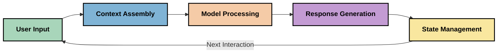
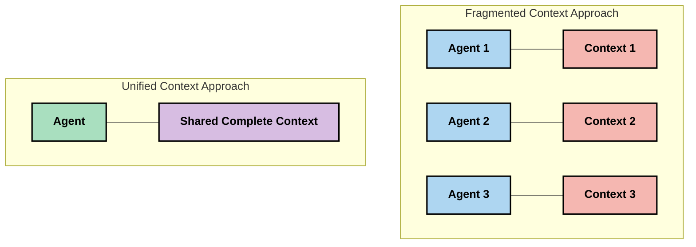
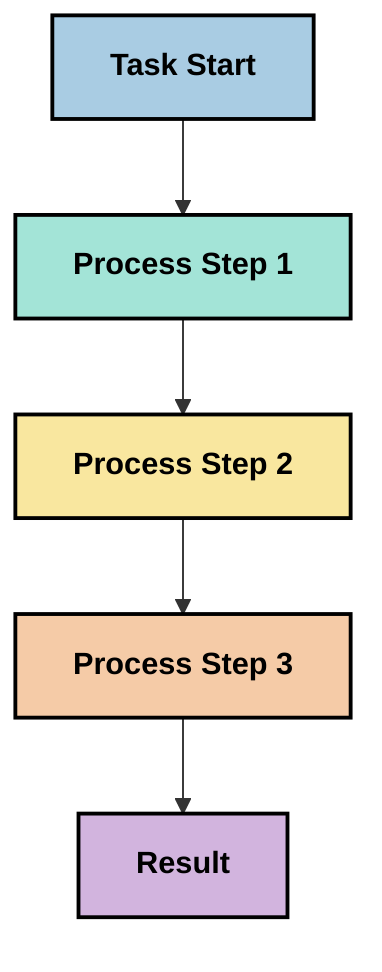
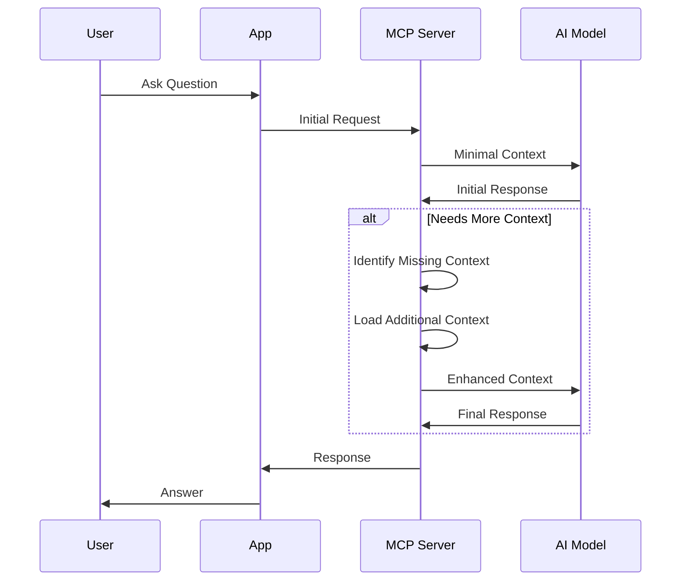
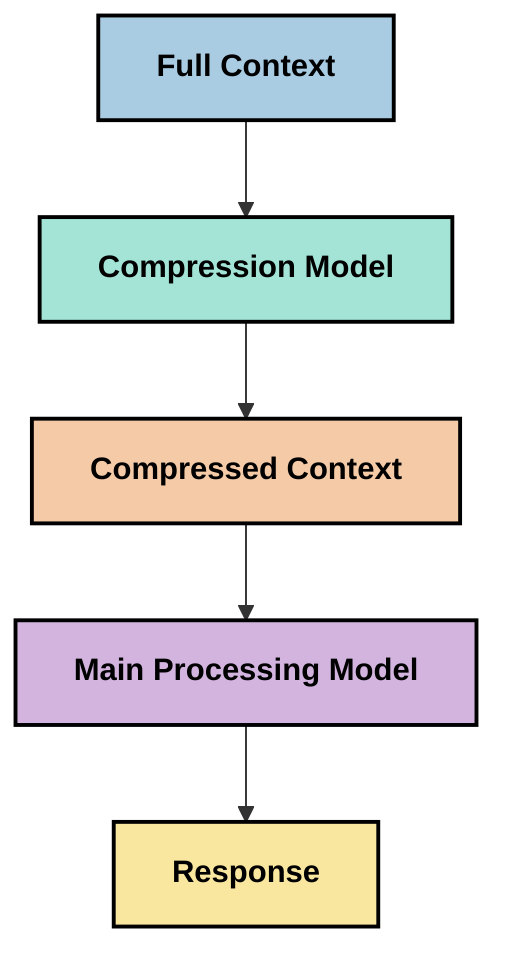
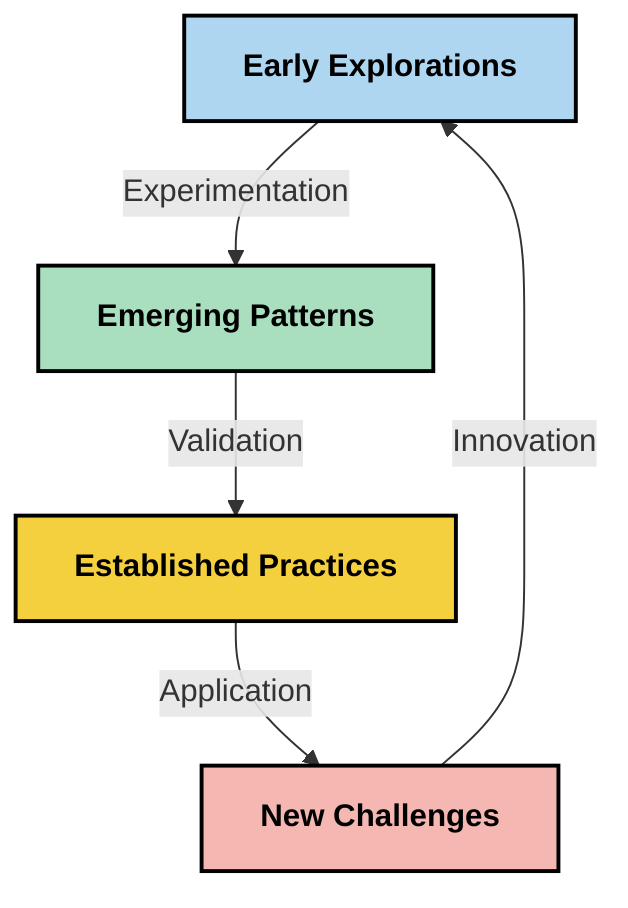

<!--
CO_OP_TRANSLATOR_METADATA:
{
  "original_hash": "fd169ca3071b81b5ee282e194bc823df",
  "translation_date": "2025-09-15T19:43:42+00:00",
  "source_file": "05-AdvancedTopics/mcp-contextengineering/README.md",
  "language_code": "ar"
}
-->
# هندسة السياق: مفهوم ناشئ في نظام MCP

## نظرة عامة

هندسة السياق هي مفهوم ناشئ في مجال الذكاء الاصطناعي يستكشف كيفية هيكلة المعلومات وتقديمها والحفاظ عليها خلال التفاعلات بين العملاء وخدمات الذكاء الاصطناعي. مع تطور نظام Model Context Protocol (MCP)، يصبح فهم كيفية إدارة السياق بشكل فعال أكثر أهمية. يقدم هذا القسم مفهوم هندسة السياق ويستكشف تطبيقاته المحتملة في تنفيذات MCP.

## أهداف التعلم

بنهاية هذا القسم، ستكون قادرًا على:

- فهم مفهوم هندسة السياق الناشئ ودوره المحتمل في تطبيقات MCP
- تحديد التحديات الرئيسية في إدارة السياق التي يعالجها تصميم بروتوكول MCP
- استكشاف تقنيات تحسين أداء النماذج من خلال تحسين التعامل مع السياق
- النظر في طرق قياس وتقييم فعالية السياق
- تطبيق هذه المفاهيم الناشئة لتحسين تجارب الذكاء الاصطناعي من خلال إطار عمل MCP

## مقدمة في هندسة السياق

هندسة السياق هي مفهوم ناشئ يركز على التصميم المتعمد وإدارة تدفق المعلومات بين المستخدمين والتطبيقات والنماذج الذكية. على عكس المجالات الراسخة مثل هندسة التوجيهات (Prompt Engineering)، لا تزال هندسة السياق قيد التعريف من قبل الممارسين الذين يعملون على حل التحديات الفريدة لتزويد نماذج الذكاء الاصطناعي بالمعلومات المناسبة في الوقت المناسب.

مع تطور نماذج اللغة الكبيرة (LLMs)، أصبحت أهمية السياق أكثر وضوحًا. جودة السياق وملاءمته وهيكله تؤثر بشكل مباشر على مخرجات النماذج. تستكشف هندسة السياق هذه العلاقة وتسعى لتطوير مبادئ لإدارة السياق بشكل فعال.

> "في عام 2025، ستكون النماذج الموجودة ذكية للغاية. لكن حتى أذكى إنسان لن يتمكن من أداء وظيفته بفعالية دون سياق لما يُطلب منه القيام به... 'هندسة السياق' هي المستوى التالي من هندسة التوجيهات. إنها تتعلق بالقيام بذلك تلقائيًا في نظام ديناميكي." — والدن يان، Cognition AI

قد تشمل هندسة السياق:

1. **اختيار السياق**: تحديد المعلومات ذات الصلة بمهمة معينة
2. **هيكلة السياق**: تنظيم المعلومات لتعظيم فهم النموذج
3. **تقديم السياق**: تحسين كيفية ومتى يتم إرسال المعلومات إلى النماذج
4. **الحفاظ على السياق**: إدارة حالة وتطور السياق بمرور الوقت
5. **تقييم السياق**: قياس وتحسين فعالية السياق

هذه المجالات ذات أهمية خاصة لنظام MCP، الذي يوفر طريقة موحدة للتطبيقات لتقديم السياق إلى نماذج اللغة الكبيرة.

## منظور رحلة السياق

يمكن تصور هندسة السياق من خلال تتبع رحلة المعلومات عبر نظام MCP:



### المراحل الرئيسية في رحلة السياق:

1. **مدخلات المستخدم**: معلومات خام من المستخدم (نصوص، صور، مستندات)
2. **تجميع السياق**: دمج مدخلات المستخدم مع سياق النظام، تاريخ المحادثة، والمعلومات المسترجعة الأخرى
3. **معالجة النموذج**: يقوم النموذج الذكي بمعالجة السياق المجمع
4. **توليد الاستجابة**: ينتج النموذج مخرجات بناءً على السياق المقدم
5. **إدارة الحالة**: يقوم النظام بتحديث حالته الداخلية بناءً على التفاعل

يسلط هذا المنظور الضوء على الطبيعة الديناميكية للسياق في أنظمة الذكاء الاصطناعي ويثير أسئلة مهمة حول كيفية إدارة المعلومات بشكل أفضل في كل مرحلة.

## المبادئ الناشئة في هندسة السياق

مع تشكل مجال هندسة السياق، بدأت بعض المبادئ الأولية في الظهور من الممارسين. قد تساعد هذه المبادئ في توجيه خيارات تنفيذ MCP:

### المبدأ الأول: مشاركة السياق بالكامل

يجب مشاركة السياق بالكامل بين جميع مكونات النظام بدلاً من تجزئته عبر وكلاء أو عمليات متعددة. عندما يتم توزيع السياق، قد تتعارض القرارات المتخذة في جزء من النظام مع تلك المتخذة في مكان آخر.



في تطبيقات MCP، يشير هذا إلى تصميم أنظمة حيث يتدفق السياق بسلاسة عبر خط الأنابيب بأكمله بدلاً من أن يكون مجزأً.

### المبدأ الثاني: الاعتراف بأن الإجراءات تحمل قرارات ضمنية

كل إجراء يتخذه النموذج يتضمن قرارات ضمنية حول كيفية تفسير السياق. عندما تعمل مكونات متعددة على سياقات مختلفة، يمكن أن تتعارض هذه القرارات الضمنية، مما يؤدي إلى نتائج غير متسقة.

هذا المبدأ له آثار مهمة على تطبيقات MCP:
- تفضيل المعالجة الخطية للمهام المعقدة على التنفيذ المتوازي مع سياق مجزأ
- ضمان أن جميع نقاط القرار لديها وصول إلى نفس المعلومات السياقية
- تصميم أنظمة حيث يمكن للخطوات اللاحقة رؤية السياق الكامل للقرارات السابقة

### المبدأ الثالث: تحقيق التوازن بين عمق السياق وحدود النوافذ

مع نمو المحادثات والعمليات، تفيض نوافذ السياق في النهاية. تستكشف هندسة السياق الفعالة طرقًا لإدارة هذا التوتر بين السياق الشامل والقيود التقنية.

تشمل الأساليب المحتملة التي يتم استكشافها:
- ضغط السياق الذي يحافظ على المعلومات الأساسية مع تقليل استخدام الرموز
- التحميل التدريجي للسياق بناءً على ملاءمته للاحتياجات الحالية
- تلخيص التفاعلات السابقة مع الحفاظ على القرارات والحقائق الرئيسية

## تحديات السياق وتصميم بروتوكول MCP

تم تصميم بروتوكول Model Context Protocol (MCP) مع إدراك للتحديات الفريدة لإدارة السياق. يساعد فهم هذه التحديات في تفسير الجوانب الرئيسية لتصميم بروتوكول MCP:

### التحدي الأول: حدود نافذة السياق
معظم نماذج الذكاء الاصطناعي لديها أحجام نوافذ سياق ثابتة، مما يحد من كمية المعلومات التي يمكنها معالجتها في وقت واحد.

**استجابة تصميم MCP:** 
- يدعم البروتوكول السياق الهيكلي المستند إلى الموارد الذي يمكن الرجوع إليه بكفاءة
- يمكن تقسيم الموارد وتحميلها تدريجيًا

### التحدي الثاني: تحديد الملاءمة
تحديد المعلومات الأكثر ملاءمة لتضمينها في السياق أمر صعب.

**استجابة تصميم MCP:**
- أدوات مرنة تسمح باسترجاع المعلومات ديناميكيًا بناءً على الحاجة
- توجيهات منظمة تمكن من تنظيم السياق بشكل متسق

### التحدي الثالث: استمرارية السياق
يتطلب إدارة الحالة عبر التفاعلات تتبعًا دقيقًا للسياق.

**استجابة تصميم MCP:**
- إدارة جلسات موحدة
- أنماط تفاعل محددة بوضوح لتطور السياق

### التحدي الرابع: السياق متعدد الوسائط
تتطلب أنواع البيانات المختلفة (نصوص، صور، بيانات منظمة) معالجة مختلفة.

**استجابة تصميم MCP:**
- تصميم البروتوكول يستوعب أنواع المحتوى المختلفة
- تمثيل موحد للمعلومات متعددة الوسائط

### التحدي الخامس: الأمن والخصوصية
غالبًا ما يحتوي السياق على معلومات حساسة يجب حمايتها.

**استجابة تصميم MCP:**
- حدود واضحة بين مسؤوليات العميل والخادم
- خيارات المعالجة المحلية لتقليل تعرض البيانات

فهم هذه التحديات وكيفية معالجتها بواسطة MCP يوفر أساسًا لاستكشاف تقنيات هندسة السياق الأكثر تقدمًا.

## أساليب هندسة السياق الناشئة

مع تطور مجال هندسة السياق، تظهر عدة أساليب واعدة. تمثل هذه الأساليب التفكير الحالي بدلاً من الممارسات الراسخة، ومن المرجح أن تتطور مع اكتساب المزيد من الخبرة في تنفيذات MCP.

### 1. المعالجة الخطية ذات الخيط الواحد

على عكس البنى متعددة الوكلاء التي توزع السياق، يجد بعض الممارسين أن المعالجة الخطية ذات الخيط الواحد تنتج نتائج أكثر اتساقًا. يتماشى هذا مع مبدأ الحفاظ على السياق الموحد.



على الرغم من أن هذا النهج قد يبدو أقل كفاءة من المعالجة المتوازية، إلا أنه غالبًا ما ينتج نتائج أكثر تماسكًا وموثوقية لأن كل خطوة تبني على فهم كامل للقرارات السابقة.

### 2. تقسيم السياق وتحديد الأولويات

تقسيم السياقات الكبيرة إلى أجزاء قابلة للإدارة وتحديد الأولويات لما هو الأكثر أهمية.

```python
# Conceptual Example: Context Chunking and Prioritization
def process_with_chunked_context(documents, query):
    # 1. Break documents into smaller chunks
    chunks = chunk_documents(documents)
    
    # 2. Calculate relevance scores for each chunk
    scored_chunks = [(chunk, calculate_relevance(chunk, query)) for chunk in chunks]
    
    # 3. Sort chunks by relevance score
    sorted_chunks = sorted(scored_chunks, key=lambda x: x[1], reverse=True)
    
    # 4. Use the most relevant chunks as context
    context = create_context_from_chunks([chunk for chunk, score in sorted_chunks[:5]])
    
    # 5. Process with the prioritized context
    return generate_response(context, query)
```

المفهوم أعلاه يوضح كيف يمكننا تقسيم المستندات الكبيرة إلى أجزاء قابلة للإدارة واختيار الأجزاء الأكثر ملاءمة للسياق فقط. يمكن أن يساعد هذا النهج في العمل ضمن حدود نافذة السياق مع الاستفادة من قواعد المعرفة الكبيرة.

### 3. التحميل التدريجي للسياق

تحميل السياق تدريجيًا حسب الحاجة بدلاً من تحميله دفعة واحدة.



يبدأ التحميل التدريجي للسياق بسياق بسيط ويتوسع فقط عند الضرورة. يمكن أن يقلل هذا بشكل كبير من استخدام الرموز للاستفسارات البسيطة مع الحفاظ على القدرة على التعامل مع الأسئلة المعقدة.

### 4. ضغط السياق والتلخيص

تقليل حجم السياق مع الحفاظ على المعلومات الأساسية.



يركز ضغط السياق على:
- إزالة المعلومات الزائدة
- تلخيص المحتوى الطويل
- استخراج الحقائق والتفاصيل الرئيسية
- الحفاظ على عناصر السياق الحرجة
- تحسين كفاءة الرموز

يمكن أن يكون هذا النهج ذا قيمة خاصة للحفاظ على المحادثات الطويلة ضمن نوافذ السياق أو لمعالجة المستندات الكبيرة بكفاءة. يستخدم بعض الممارسين نماذج متخصصة خصيصًا لضغط السياق وتلخيص تاريخ المحادثة.

## اعتبارات استكشافية لهندسة السياق

مع استكشاف مجال هندسة السياق الناشئ، هناك عدة اعتبارات تستحق الاهتمام عند العمل مع تنفيذات MCP. هذه ليست ممارسات أفضل وصفية ولكنها مجالات استكشاف قد تؤدي إلى تحسينات في حالتك الخاصة.

### ضع أهداف السياق في اعتبارك

قبل تنفيذ حلول إدارة السياق المعقدة، حدد بوضوح ما تحاول تحقيقه:
- ما المعلومات المحددة التي يحتاجها النموذج ليكون ناجحًا؟
- ما المعلومات الأساسية مقابل التكميلية؟
- ما هي قيود الأداء الخاصة بك (زمن الاستجابة، حدود الرموز، التكاليف)؟

### استكشف نهج السياق الطبقي

يجد بعض الممارسين نجاحًا في ترتيب السياق في طبقات مفاهيمية:
- **الطبقة الأساسية**: المعلومات الأساسية التي يحتاجها النموذج دائمًا
- **الطبقة الظرفية**: السياق الخاص بالتفاعل الحالي
- **الطبقة الداعمة**: معلومات إضافية قد تكون مفيدة
- **الطبقة الاحتياطية**: المعلومات التي يتم الوصول إليها فقط عند الحاجة

### استقصي استراتيجيات الاسترجاع

غالبًا ما تعتمد فعالية السياق على كيفية استرجاع المعلومات:
- البحث الدلالي والتضمينات للعثور على المعلومات ذات الصلة المفاهيمية
- البحث القائم على الكلمات المفتاحية للحصول على تفاصيل واقعية محددة
- نهج هجينة تجمع بين طرق استرجاع متعددة
- تصفية البيانات الوصفية لتضييق النطاق بناءً على الفئات أو التواريخ أو المصادر

### جرب تماسك السياق

قد تؤثر بنية وتدفق السياق على فهم النموذج:
- تجميع المعلومات ذات الصلة معًا
- استخدام تنسيق وتنظيم متسقين
- الحفاظ على ترتيب منطقي أو زمني حيثما كان ذلك مناسبًا
- تجنب المعلومات المتناقضة

### وزن التوازنات في البنى متعددة الوكلاء

على الرغم من أن البنى متعددة الوكلاء شائعة في العديد من أطر الذكاء الاصطناعي، إلا أنها تأتي مع تحديات كبيرة لإدارة السياق:
- يمكن أن يؤدي تجزئة السياق إلى قرارات غير متسقة عبر الوكلاء
- قد يؤدي المعالجة المتوازية إلى إدخال تعارضات يصعب حلها
- يمكن أن يؤدي عبء الاتصال بين الوكلاء إلى تعويض مكاسب الأداء
- يتطلب إدارة الحالة المعقدة للحفاظ على التماسك

في كثير من الحالات، قد ينتج نهج الوكيل الواحد مع إدارة سياق شاملة نتائج أكثر موثوقية من وكلاء متخصصين متعددين بسياق مجزأ.

### تطوير طرق التقييم

لتحسين هندسة السياق بمرور الوقت، ضع في اعتبارك كيفية قياس النجاح:
- اختبار A/B لهيكل السياق المختلف
- مراقبة استخدام الرموز وأوقات الاستجابة
- تتبع رضا المستخدم ومعدلات إكمال المهام
- تحليل متى ولماذا تفشل استراتيجيات السياق

تمثل هذه الاعتبارات مجالات استكشاف نشطة في مجال هندسة السياق. مع نضوج المجال، من المرجح أن تظهر أنماط وممارسات أكثر تحديدًا.

## قياس فعالية السياق: إطار عمل متطور

مع ظهور هندسة السياق كمفهوم، بدأ الممارسون في استكشاف كيفية قياس فعاليتها. لا يوجد إطار عمل راسخ حتى الآن، ولكن يتم النظر في مقاييس مختلفة قد تساعد في توجيه العمل المستقبلي.

### أبعاد القياس المحتملة

#### 1. اعتبارات كفاءة المدخلات

- **نسبة السياق إلى الاستجابة**: كم السياق المطلوب بالنسبة لحجم الاستجابة؟
- **استخدام الرموز**: ما النسبة المئوية لرموز السياق المقدمة التي تؤثر على الاستجابة؟
- **تقليل السياق**: ما مدى فعالية ضغط المعلومات الخام؟

#### 2. اعتبارات الأداء

- **تأثير زمن الاستجابة**: كيف تؤثر إدارة السياق على وقت الاستجابة؟
- **اقتصاد الرموز**: هل نستخدم الرموز بكفاءة؟
- **دقة الاسترجاع**: ما مدى ملاءمة المعلومات المسترجعة؟
- **استخدام الموارد**: ما الموارد الحاسوبية المطلوبة؟

#### 3. اعتبارات الجودة

- **ملاءمة الاستجابة**: ما مدى جودة الاستجابة في معالجة الاستفسار؟
- **الدقة الواقعية**: هل تحسن إدارة السياق من صحة الحقائق؟
- **التناسق**: هل الاستجابات متسقة عبر استفسارات مشابهة؟
- **معدل الهلوسة**: هل يقلل السياق الأفضل من هلوسة النموذج؟

#### 4. اعتبارات تجربة المستخدم

- **معدل المتابعة**: كم مرة يحتاج المستخدمون إلى توضيح؟
- **إكمال المهام**: هل ينجح المستخدمون في تحقيق أهدافهم؟
- **مؤشرات الرضا**: كيف يقيم المستخدمون تجربتهم؟

### أساليب استكشافية للقياس

عند تجربة هندسة السياق في تنفيذات MCP، ضع في اعتبارك هذه الأساليب الاستكشافية:

1. **مقارنات الأساس**: قم بإنشاء أساس باستخدام نهج سياق بسيط قبل اختبار طرق أكثر تعقيدًا

2. **التغييرات التدريجية**: قم بتغيير جانب واحد من إدارة السياق في كل مرة لعزل تأثيره

3. **تقييم متمركز حول المستخدم**: اجمع بين المقاييس الكمية وملاحظات المستخدم النوعية

4. **تحليل الفشل**: قم بفحص الحالات التي تفشل فيها استراتيجيات السياق لفهم التحسينات المحتملة

5. **التقييم متعدد الأبعاد**: ضع في اعتبارك التوازنات بين الكفاءة والجودة وتجربة المستخدم

يتماشى هذا النهج التجريبي متعدد الأوجه للقياس مع الطبيعة الناشئة لهندسة السياق.

## أفكار ختامية

هندسة السياق هي مجال استكشاف ناشئ قد يكون مركزيًا لتطبيقات MCP الفعالة. من خلال النظر بعناية في كيفية تدفق المعلومات عبر نظامك، يمكنك إنشاء تجارب ذكاء اصطناعي أكثر كفاءة ودقة وقيمة للمستخدمين.

تمثل التقنيات والأساليب الموضحة في هذا القسم التفكير المبكر في هذا المجال، وليس الممارسات الراسخة. قد تتطور هندسة السياق إلى تخصص أكثر تحديدًا مع تطور قدرات الذكاء الاصطناعي وتعميق فهمنا. في الوقت الحالي، يبدو أن التجريب مع القياس الدقيق هو النهج الأكثر إنتاجية.

## اتجاهات مستقبلية محتملة

لا يزال مجال هندسة السياق في مراحله الأولى، ولكن تظهر عدة اتجاهات واعدة:

- قد تؤثر مبادئ هندسة السياق بشكل كبير على أداء النماذج وكفاءتها وتجربة المستخدم وموثوقيتها
- قد تتفوق الأساليب ذات الخيط الواحد مع إدارة سياق شاملة على البنى متعددة الوكلاء للعديد من الحالات
- قد تصبح نماذج ضغط السياق المتخصصة مكونات قياسية في خطوط أنابيب الذكاء الاصطناعي
- من المرجح أن يدفع التوتر بين اكتمال السياق وحدود الرموز الابتكار في التعامل مع السياق
- مع تحسن قدرة النماذج على التواصل بكفاءة بطريقة شبيهة بالبشر، قد يصبح التعاون الحقيقي متعدد الوكلاء أكثر قابلية للتطبيق
- قد تتطور تنفيذات MCP لتوحيد أنماط إدارة السياق التي تنبثق من التجارب الحالية



## الموارد

### موارد MCP الرسمية
- [موقع بروتوكول سياق النموذج](https://modelcontextprotocol.io/)
- [مواصفات بروتوكول سياق النموذج](https://github.com/modelcontextprotocol/modelcontextprotocol)
- [وثائق MCP](https://modelcontextprotocol.io/docs)
- [MCP C# SDK](https://github.com/modelcontextprotocol/csharp-sdk)
- [MCP Python SDK](https://github.com/modelcontextprotocol/python-sdk)
- [MCP TypeScript SDK](https://github.com/modelcontextprotocol/typescript-sdk)
- [MCP Inspector](https://github.com/modelcontextprotocol/inspector) - أداة اختبار مرئية لخوادم MCP

### مقالات هندسة السياق
- [لا تبني أنظمة متعددة الوكلاء: مبادئ هندسة السياق](https://cognition.ai/blog/dont-build-multi-agents) - رؤى والدن يان حول مبادئ هندسة السياق
- [دليل عملي لبناء الوكلاء](https://cdn.openai.com/business-guides-and-resources/a-practical-guide-to-building-agents.pdf) - دليل OpenAI لتصميم الوكلاء الفعّال
- [بناء وكلاء فعّالين](https://www.anthropic.com/engineering/building-effective-agents) - نهج Anthropic لتطوير الوكلاء

### أبحاث ذات صلة
- [تعزيز الاسترجاع الديناميكي لنماذج اللغة الكبيرة](https://arxiv.org/abs/2310.01487) - بحث حول أساليب الاسترجاع الديناميكي
- [ضائع في المنتصف: كيف تستخدم نماذج اللغة السياقات الطويلة](https://arxiv.org/abs/2307.03172) - بحث مهم حول أنماط معالجة السياق
- [توليد الصور المشروط بالنص بشكل هرمي باستخدام CLIP Latents](https://arxiv.org/abs/2204.06125) - ورقة DALL-E 2 مع رؤى حول هيكلة السياق
- [استكشاف دور السياق في بنية نماذج اللغة الكبيرة](https://aclanthology.org/2023.findings-emnlp.124/) - بحث حديث حول معالجة السياق
- [التعاون بين الوكلاء المتعددين: دراسة استقصائية](https://arxiv.org/abs/2304.03442) - بحث حول أنظمة الوكلاء المتعددين وتحدياتها

### موارد إضافية
- [تقنيات تحسين نافذة السياق](https://learn.microsoft.com/en-us/azure/ai-services/openai/concepts/context-window)
- [تقنيات RAG المتقدمة](https://www.microsoft.com/en-us/research/blog/retrieval-augmented-generation-rag-and-frontier-models/)
- [وثائق النواة الدلالية](https://github.com/microsoft/semantic-kernel)
- [مجموعة أدوات الذكاء الاصطناعي لإدارة السياق](https://github.com/microsoft/aitoolkit)

## ما القادم 

- [5.15 MCP النقل المخصص](../mcp-transport/README.md)

---

**إخلاء المسؤولية**:  
تم ترجمة هذا المستند باستخدام خدمة الترجمة بالذكاء الاصطناعي [Co-op Translator](https://github.com/Azure/co-op-translator). بينما نسعى لتحقيق الدقة، يرجى العلم أن الترجمات الآلية قد تحتوي على أخطاء أو معلومات غير دقيقة. يجب اعتبار المستند الأصلي بلغته الأصلية المصدر الرسمي. للحصول على معلومات حاسمة، يُوصى بالاستعانة بترجمة بشرية احترافية. نحن غير مسؤولين عن أي سوء فهم أو تفسيرات خاطئة تنشأ عن استخدام هذه الترجمة.