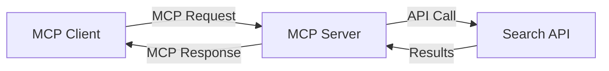
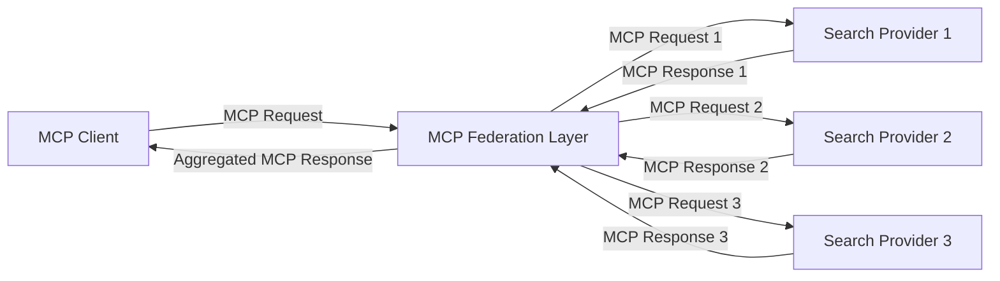
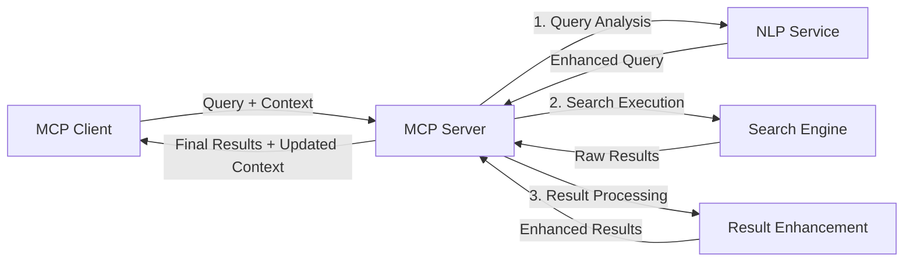

<!--
CO_OP_TRANSLATOR_METADATA:
{
  "original_hash": "333a03e51f90bdf3e6f1ba1694c73f36",
  "translation_date": "2025-07-16T23:37:23+00:00",
  "source_file": "05-AdvancedTopics/mcp-realtimesearch/README.md",
  "language_code": "ar"
}
-->
## إخلاء مسؤولية أمثلة الشيفرة

> **ملاحظة مهمة**: أمثلة الشيفرة أدناه توضح دمج بروتوكول سياق النموذج (MCP) مع وظيفة البحث على الويب. رغم أنها تتبع أنماط وهياكل SDKs الرسمية لـ MCP، فقد تم تبسيطها لأغراض تعليمية.
> 
> تعرض هذه الأمثلة:
> 
> 1. **تنفيذ بايثون**: تنفيذ خادم FastMCP يوفر أداة بحث على الويب ويتصل بواجهة برمجة تطبيقات بحث خارجية. يوضح هذا المثال إدارة دورة حياة صحيحة، والتعامل مع السياق، وتنفيذ الأداة باتباع أنماط [SDK بايثون الرسمي لـ MCP](https://github.com/modelcontextprotocol/python-sdk). يستخدم الخادم بروتوكول النقل HTTP القابل للبث الموصى به والذي حل محل بروتوكول SSE القديم في بيئات الإنتاج.
> 
> 2. **تنفيذ جافاسكريبت**: تنفيذ TypeScript/JavaScript باستخدام نمط FastMCP من [SDK TypeScript الرسمي لـ MCP](https://github.com/modelcontextprotocol/typescript-sdk) لإنشاء خادم بحث مع تعريفات أدوات صحيحة واتصالات العملاء. يتبع أحدث الأنماط الموصى بها لإدارة الجلسات والحفاظ على السياق.
> 
> تتطلب هذه الأمثلة إضافة معالجة أخطاء، ومصادقة، وشيفرة تكامل API محددة للاستخدام في الإنتاج. نقاط نهاية API البحث المعروضة (`https://api.search-service.example/search`) هي مجرد عناصر نائبة ويجب استبدالها بنقاط نهاية خدمات البحث الفعلية.
> 
> لمزيد من التفاصيل حول التنفيذ وأحدث الأساليب، يرجى الرجوع إلى [المواصفة الرسمية لـ MCP](https://spec.modelcontextprotocol.io/) ووثائق SDK.

## المفاهيم الأساسية

### إطار عمل بروتوكول سياق النموذج (MCP)

في جوهره، يوفر بروتوكول سياق النموذج طريقة موحدة لنماذج الذكاء الاصطناعي، والتطبيقات، والخدمات لتبادل السياق. في البحث على الويب في الوقت الحقيقي، يعد هذا الإطار ضروريًا لإنشاء تجارب بحث متماسكة ومتعددة التفاعلات. تشمل المكونات الرئيسية:

1. **هيكلية العميل-الخادم**: يؤسس MCP فصلًا واضحًا بين عملاء البحث (الطالبين) وخوادم البحث (المزودين)، مما يسمح بنماذج نشر مرنة.

2. **الاتصال عبر JSON-RPC**: يستخدم البروتوكول JSON-RPC لتبادل الرسائل، مما يجعله متوافقًا مع تقنيات الويب وسهل التنفيذ عبر منصات مختلفة.

3. **إدارة السياق**: يحدد MCP طرقًا منظمة للحفاظ على السياق، وتحديثه، والاستفادة منه عبر تفاعلات متعددة.

4. **تعريفات الأدوات**: تُعرض قدرات البحث كأدوات موحدة ذات معلمات وقيم إرجاع محددة جيدًا.

5. **دعم البث**: يدعم البروتوكول بث النتائج، وهو أمر أساسي للبحث في الوقت الحقيقي حيث قد تصل النتائج تدريجيًا.

### أنماط دمج البحث على الويب

عند دمج MCP مع البحث على الويب، تظهر عدة أنماط:

#### 1. دمج مزود البحث المباشر

في هذا النمط، يتصل خادم MCP مباشرة بواحدة أو أكثر من واجهات برمجة تطبيقات البحث، مترجمًا طلبات MCP إلى استدعاءات API محددة ويُنسق النتائج كردود MCP.

#### 2. البحث الموحد مع الحفاظ على السياق

يوزع هذا النمط استعلامات البحث عبر عدة مزودين متوافقين مع MCP، قد يتخصص كل منهم في أنواع مختلفة من المحتوى أو قدرات البحث، مع الحفاظ على سياق موحد.

#### 3. سلسلة البحث المعززة بالسياق

في هذا النمط، يُقسم عملية البحث إلى مراحل متعددة، مع إثراء السياق في كل خطوة، مما يؤدي إلى نتائج أكثر صلة تدريجيًا.

### مكونات سياق البحث

في البحث على الويب المعتمد على MCP، يشمل السياق عادةً:

- **تاريخ الاستعلامات**: استعلامات البحث السابقة في الجلسة
- **تفضيلات المستخدم**: اللغة، المنطقة، إعدادات البحث الآمن
- **تاريخ التفاعل**: النتائج التي تم النقر عليها، الوقت المستغرق على النتائج
- **معلمات البحث**: الفلاتر، ترتيب النتائج، ومعدلات البحث الأخرى
- **معرفة المجال**: السياق الموضوعي ذي الصلة بالبحث
- **السياق الزمني**: عوامل الصلة المبنية على الوقت
- **تفضيلات المصادر**: المصادر الموثوقة أو المفضلة للمعلومات

## حالات الاستخدام والتطبيقات

### البحث وجمع المعلومات

يعزز MCP سير عمل البحث من خلال:

- الحفاظ على سياق البحث عبر جلسات متعددة
- تمكين استعلامات أكثر تعقيدًا وذات صلة سياقية
- دعم توحيد البحث من مصادر متعددة
- تسهيل استخراج المعرفة من نتائج البحث

### مراقبة الأخبار والاتجاهات في الوقت الحقيقي

يقدم البحث المدعوم بـ MCP مزايا لمراقبة الأخبار:

- اكتشاف قصص الأخبار الناشئة في الوقت شبه الحقيقي
- تصفية المعلومات ذات الصلة بناءً على السياق
- تتبع المواضيع والكيانات عبر مصادر متعددة
- تنبيهات أخبار مخصصة بناءً على سياق المستخدم

### التصفح والبحث المعزز بالذكاء الاصطناعي

يخلق MCP إمكانيات جديدة للتصفح المعزز بالذكاء الاصطناعي:

- اقتراحات بحث سياقية بناءً على نشاط المتصفح الحالي
- دمج سلس للبحث على الويب مع المساعدين المدعومين بنماذج اللغة الكبيرة
- تحسين البحث متعدد التفاعلات مع الحفاظ على السياق
- تعزيز التحقق من الحقائق وتدقيق المعلومات

## الاتجاهات والابتكارات المستقبلية

### تطور MCP في البحث على الويب

نتوقع في المستقبل أن يتطور MCP ليشمل:

- **البحث متعدد الوسائط**: دمج البحث النصي، والصوري، والصوتي، والفيديو مع الحفاظ على السياق
- **البحث اللامركزي**: دعم أنظمة البحث الموزعة والموحدة
- **خصوصية البحث**: آليات بحث تحافظ على الخصوصية مع الوعي بالسياق  
- **فهم الاستعلام**: تحليل دلالي عميق لاستعلامات البحث باللغة الطبيعية  

### التطورات المحتملة في التكنولوجيا  

التقنيات الناشئة التي ستشكل مستقبل بحث MCP:  

1. **هياكل البحث العصبية**: أنظمة بحث تعتمد على التضمين ومُحسّنة لـ MCP  
2. **سياق البحث المخصص**: تعلم أنماط بحث المستخدم الفردية مع مرور الوقت  
3. **دمج رسم المعرفة**: بحث سياقي معزز بواسطة رسوم المعرفة المتخصصة في المجال  
4. **السياق متعدد الوسائط**: الحفاظ على السياق عبر أنماط البحث المختلفة  

## تمارين عملية  

### التمرين 1: إعداد خط أنابيب بحث MCP أساسي  

في هذا التمرين، ستتعلم كيفية:  
- تكوين بيئة بحث MCP أساسية  
- تنفيذ معالجات السياق لبحث الويب  
- اختبار والتحقق من الحفاظ على السياق عبر تكرارات البحث  

### التمرين 2: بناء مساعد بحث باستخدام MCP  

أنشئ تطبيقًا كاملاً يقوم بـ:  
- معالجة أسئلة البحث باللغة الطبيعية  
- إجراء عمليات بحث ويب مع وعي بالسياق  
- تجميع المعلومات من مصادر متعددة  
- عرض نتائج البحث بشكل منظم  

### التمرين 3: تنفيذ اتحاد بحث متعدد المصادر باستخدام MCP  

تمرين متقدم يشمل:  
- توجيه الاستعلامات مع وعي بالسياق إلى محركات بحث متعددة  
- ترتيب وتجميع النتائج  
- إزالة التكرار السياقي لنتائج البحث  
- التعامل مع بيانات وصفية خاصة بالمصدر  

## موارد إضافية  

- [Model Context Protocol Specification](https://spec.modelcontextprotocol.io/) - المواصفات الرسمية لبروتوكول MCP والوثائق التفصيلية  
- [Model Context Protocol Documentation](https://modelcontextprotocol.io/) - دروس تفصيلية وأدلة تنفيذ  
- [MCP Python SDK](https://github.com/modelcontextprotocol/python-sdk) - التنفيذ الرسمي لبروتوكول MCP بلغة بايثون  
- [MCP TypeScript SDK](https://github.com/modelcontextprotocol/typescript-sdk) - التنفيذ الرسمي لبروتوكول MCP بلغة تايب سكريبت  
- [MCP Reference Servers](https://github.com/modelcontextprotocol/servers) - تطبيقات مرجعية لخوادم MCP  
- [Bing Web Search API Documentation](https://learn.microsoft.com/en-us/bing/search-apis/bing-web-search/overview) - واجهة برمجة تطبيقات بحث الويب من مايكروسوفت  
- [Google Custom Search JSON API](https://developers.google.com/custom-search/v1/overview) - محرك البحث القابل للبرمجة من جوجل  
- [SerpAPI Documentation](https://serpapi.com/search-api) - واجهة برمجة تطبيقات صفحة نتائج محركات البحث  
- [Meilisearch Documentation](https://www.meilisearch.com/docs) - محرك بحث مفتوح المصدر  
- [Elasticsearch Documentation](https://www.elastic.co/guide/index.html) - محرك بحث وتحليلات موزع  
- [LangChain Documentation](https://python.langchain.com/docs/get_started/introduction) - بناء التطبيقات باستخدام نماذج اللغة الكبيرة  

## نتائج التعلم  

عند إكمال هذه الوحدة، ستكون قادرًا على:  

- فهم أساسيات البحث في الويب في الوقت الحقيقي والتحديات المرتبطة به  
- شرح كيف يعزز Model Context Protocol (MCP) قدرات البحث في الويب في الوقت الحقيقي  
- تنفيذ حلول بحث تعتمد على MCP باستخدام الأُطُر وواجهات البرمجة الشائعة  
- تصميم ونشر هياكل بحث قابلة للتوسع وعالية الأداء باستخدام MCP  
- تطبيق مفاهيم MCP على حالات استخدام متنوعة تشمل البحث الدلالي، المساعدة البحثية، والتصفح المعزز بالذكاء الاصطناعي  
- تقييم الاتجاهات الناشئة والابتكارات المستقبلية في تقنيات البحث المبنية على MCP  

### اعتبارات الثقة والسلامة  

عند تنفيذ حلول بحث ويب تعتمد على MCP، تذكر المبادئ المهمة التالية من مواصفات MCP:  

1. **موافقة المستخدم والتحكم**: يجب أن يوافق المستخدمون صراحة ويفهموا جميع عمليات الوصول إلى البيانات والإجراءات. هذا مهم بشكل خاص لتطبيقات بحث الويب التي قد تصل إلى مصادر بيانات خارجية.  

2. **خصوصية البيانات**: تأكد من التعامل المناسب مع استعلامات البحث والنتائج، خاصة إذا كانت تحتوي على معلومات حساسة. طبق ضوابط وصول مناسبة لحماية بيانات المستخدم.  

3. **سلامة الأدوات**: نفذ تفويضًا وتحققًا مناسبًا لأدوات البحث، لأنها تمثل مخاطر أمنية محتملة من خلال تنفيذ أكواد عشوائية. يجب اعتبار وصف سلوك الأدوات غير موثوق به إلا إذا تم الحصول عليه من خادم موثوق.  

4. **توثيق واضح**: قدم توثيقًا واضحًا حول القدرات والقيود واعتبارات الأمان لتطبيق البحث المعتمد على MCP، متبعًا إرشادات التنفيذ من مواصفات MCP.  

5. **تدفقات موافقة قوية**: أنشئ تدفقات موافقة وتفويض قوية تشرح بوضوح وظيفة كل أداة قبل السماح باستخدامها، خاصة للأدوات التي تتفاعل مع موارد ويب خارجية.  

للحصول على تفاصيل كاملة حول أمان MCP واعتبارات الثقة والسلامة، راجع [التوثيق الرسمي](https://modelcontextprotocol.io/specification/2025-03-26#security-and-trust-%26-safety).  

## ما التالي  

- [5.12 مصادقة Entra ID لخوادم Model Context Protocol](../mcp-security-entra/README.md)

**إخلاء مسؤولية**:  
تمت ترجمة هذا المستند باستخدام خدمة الترجمة الآلية [Co-op Translator](https://github.com/Azure/co-op-translator). بينما نسعى لتحقيق الدقة، يرجى العلم أن الترجمات الآلية قد تحتوي على أخطاء أو عدم دقة. يجب اعتبار المستند الأصلي بلغته الأصلية المصدر الموثوق به. للمعلومات الهامة، يُنصح بالترجمة البشرية المهنية. نحن غير مسؤولين عن أي سوء فهم أو تفسير ناتج عن استخدام هذه الترجمة.