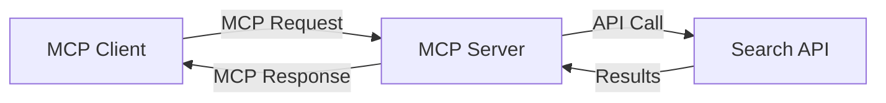
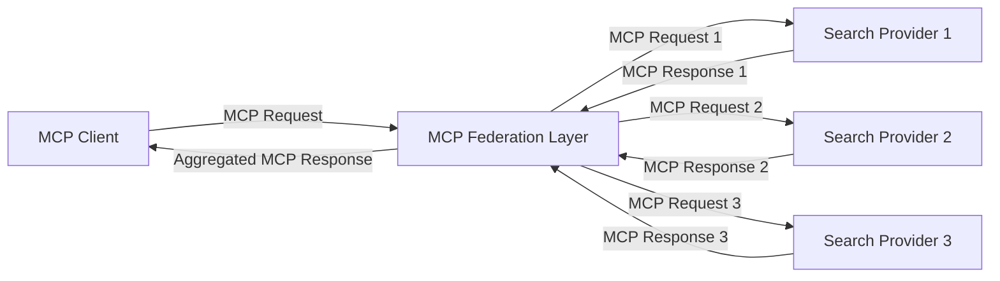
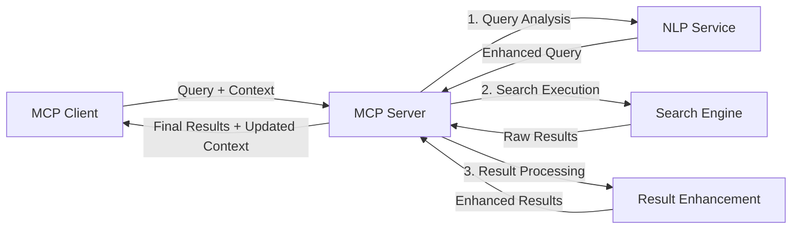

<!--
CO_OP_TRANSLATOR_METADATA:
{
  "original_hash": "16bef2c93c6a86d4ca6a8ce9e120e384",
  "translation_date": "2025-06-13T02:35:59+00:00",
  "source_file": "05-AdvancedTopics/mcp-realtimesearch/README.md",
  "language_code": "ar"
}
-->
## إخلاء مسؤولية أمثلة الكود

> **ملاحظة مهمة**: أمثلة الكود أدناه توضح دمج بروتوكول سياق النموذج (MCP) مع وظيفة البحث على الويب. بينما تتبع هذه الأمثلة أنماط وهياكل SDKs الرسمية لـ MCP، فقد تم تبسيطها لأغراض تعليمية.
> 
> تعرض هذه الأمثلة:
> 
> 1. **تنفيذ بايثون**: تنفيذ خادم FastMCP يوفر أداة بحث على الويب ويتصل بواجهة برمجة تطبيقات بحث خارجية. يوضح هذا المثال إدارة دورة حياة صحيحة، والتعامل مع السياق، وتنفيذ الأداة باتباع أنماط [SDK بايثون الرسمي لـ MCP](https://github.com/modelcontextprotocol/python-sdk). يستخدم الخادم بروتوكول النقل Streamable HTTP الموصى به والذي حل محل النقل القديم SSE للنشر في بيئات الإنتاج.
> 
> 2. **تنفيذ جافاسكريبت**: تنفيذ TypeScript/JavaScript باستخدام نمط FastMCP من [SDK TypeScript الرسمي لـ MCP](https://github.com/modelcontextprotocol/typescript-sdk) لإنشاء خادم بحث مع تعريفات أدوات واتصالات عميل صحيحة. يتبع أحدث الأنماط الموصى بها لإدارة الجلسات والحفاظ على السياق.
> 
> تتطلب هذه الأمثلة مزيدًا من معالجة الأخطاء، والمصادقة، ورمز تكامل API محدد للاستخدام في الإنتاج. نقاط نهاية API البحث المعروضة (`https://api.search-service.example/search`) هي عناصر نائبة ويجب استبدالها بنقاط نهاية خدمة بحث فعلية.
> 
> للحصول على تفاصيل التنفيذ الكاملة وأحدث الأساليب، يرجى الرجوع إلى [مواصفة MCP الرسمية](https://spec.modelcontextprotocol.io/) ووثائق SDK.

## المفاهيم الأساسية

### إطار عمل بروتوكول سياق النموذج (MCP)

في جوهره، يوفر بروتوكول سياق النموذج طريقة موحدة لنماذج الذكاء الاصطناعي، والتطبيقات، والخدمات لتبادل السياق. في البحث على الويب في الوقت الحقيقي، يعد هذا الإطار ضروريًا لإنشاء تجارب بحث متماسكة متعددة الأدوار. تشمل المكونات الرئيسية:

1. **هيكلية العميل-الخادم**: يحدد MCP فصلًا واضحًا بين عملاء البحث (المطالبين) وخوادم البحث (المزودين)، مما يسمح بنماذج نشر مرنة.

2. **الاتصال عبر JSON-RPC**: يستخدم البروتوكول JSON-RPC لتبادل الرسائل، مما يجعله متوافقًا مع تقنيات الويب وسهل التنفيذ عبر منصات مختلفة.

3. **إدارة السياق**: يحدد MCP طرقًا منظمة للحفاظ على السياق وتحديثه والاستفادة منه عبر تفاعلات متعددة.

4. **تعريفات الأدوات**: يتم عرض قدرات البحث كأدوات موحدة بمعايير محددة للمعاملات وقيم الإرجاع.

5. **دعم التدفق المستمر**: يدعم البروتوكول تدفق النتائج، وهو ضروري للبحث في الوقت الحقيقي حيث قد تصل النتائج تدريجيًا.

### أنماط دمج البحث على الويب

عند دمج MCP مع البحث على الويب، تظهر عدة أنماط:

#### 1. دمج مزود البحث المباشر

في هذا النمط، يتصل خادم MCP مباشرة بواحدة أو أكثر من واجهات برمجة تطبيقات البحث، مترجمًا طلبات MCP إلى مكالمات خاصة بالواجهة البرمجية ويقوم بتنسيق النتائج كردود MCP.

#### 2. البحث الموحد مع الحفاظ على السياق

يوزع هذا النمط استعلامات البحث عبر عدة مزودي بحث متوافقين مع MCP، كل منهم قد يتخصص في أنواع مختلفة من المحتوى أو قدرات البحث، مع الحفاظ على سياق موحد.

#### 3. سلسلة البحث المحسنة بالسياق

في هذا النمط، تُقسم عملية البحث إلى مراحل متعددة، مع إثراء السياق في كل خطوة، مما يؤدي إلى نتائج أكثر ملاءمة تدريجيًا.

### مكونات سياق البحث

في البحث على الويب المعتمد على MCP، يتضمن السياق عادةً:

- **تاريخ الاستعلامات**: استعلامات البحث السابقة في الجلسة
- **تفضيلات المستخدم**: اللغة، المنطقة، إعدادات البحث الآمن
- **تاريخ التفاعل**: النتائج التي تم النقر عليها، والوقت المستغرق على النتائج
- **معلمات البحث**: الفلاتر، ترتيب الفرز، ومعدلات البحث الأخرى
- **معرفة المجال**: سياق موضوعي ذو صلة بالبحث
- **السياق الزمني**: عوامل الصلة المرتبطة بالوقت
- **تفضيلات المصادر**: المصادر الموثوقة أو المفضلة للمعلومات

## حالات الاستخدام والتطبيقات

### البحث وجمع المعلومات

يعزز MCP سير عمل البحث من خلال:

- الحفاظ على سياق البحث عبر جلسات البحث
- تمكين استعلامات أكثر تعقيدًا وذات صلة سياقية
- دعم الاتحاد متعدد المصادر للبحث
- تسهيل استخراج المعرفة من نتائج البحث

### مراقبة الأخبار والاتجاهات في الوقت الحقيقي

يوفر البحث المدعوم بـ MCP مزايا لمراقبة الأخبار:

- اكتشاف الأخبار الناشئة في الوقت القريب من الوقت الحقيقي
- تصفية معلومات ذات صلة سياقيًا
- تتبع المواضيع والكيانات عبر مصادر متعددة
- تنبيهات أخبار مخصصة بناءً على سياق المستخدم

### التصفح والبحث المدعومان بالذكاء الاصطناعي

يخلق MCP إمكانيات جديدة للتصفح المدعوم بالذكاء الاصطناعي:

- اقتراحات بحث سياقية بناءً على نشاط المتصفح الحالي
- تكامل سلس بين البحث على الويب والمساعدين المدعومين بنماذج اللغة الكبيرة
- تحسين البحث متعدد الأدوار مع الحفاظ على السياق
- تعزيز التحقق من الحقائق والتحقق من المعلومات

## الاتجاهات والابتكارات المستقبلية

### تطور MCP في البحث على الويب

نتوقع في المستقبل أن يتطور MCP ليشمل:

- **البحث متعدد الوسائط**: دمج البحث النصي، والصوري، والصوتي، والفيديو مع الحفاظ على السياق
- **البحث اللامركزي**: دعم أنظمة البحث الموزعة والموحدة
- **خصوصية البحث**: آليات بحث تحافظ على الخصوصية مدركة للسياق
- **فهم الاستعلامات**: تحليل دلالي عميق لاستعلامات البحث الطبيعية

### التطورات المحتملة في التكنولوجيا

التقنيات الناشئة التي ستشكل مستقبل بحث MCP:

1. **هياكل البحث العصبية**: أنظمة بحث معتمدة على التضمين ومحسنة لـ MCP
2. **سياق البحث المخصص**: تعلم أنماط بحث المستخدم الفردية مع مرور الوقت
3. **دمج رسم المعرفة**: البحث السياقي المحسن برسوم معرفة متخصصة بالمجال
4. **السياق متعدد الوسائط**: الحفاظ على السياق عبر أنماط بحث مختلفة

## تمارين عملية

### التمرين 1: إعداد خط أنابيب بحث MCP أساسي

في هذا التمرين، ستتعلم كيفية:
- تكوين بيئة بحث MCP أساسية
- تنفيذ معالجات السياق للبحث على الويب
- اختبار والتحقق من الحفاظ على السياق عبر تكرارات البحث

### التمرين 2: بناء مساعد بحث باستخدام MCP

أنشئ تطبيقًا كاملاً يقوم بـ:
- معالجة أسئلة بحث طبيعية اللغة
- إجراء بحث على الويب مدرك للسياق
- تلخيص المعلومات من مصادر متعددة
- تقديم نتائج بحث منظمة

### التمرين 3: تنفيذ اتحاد بحث متعدد المصادر باستخدام MCP

تمرين متقدم يغطي:
- إرسال الاستعلامات مدركة للسياق إلى عدة محركات بحث
- ترتيب وتجميع النتائج
- إزالة التكرار السياقي للنتائج
- التعامل مع بيانات وصفية خاصة بالمصدر

## موارد إضافية

- [مواصفة بروتوكول سياق النموذج](https://spec.modelcontextprotocol.io/) - المواصفة الرسمية والوثائق التفصيلية للبروتوكول
- [توثيق بروتوكول سياق النموذج](https://modelcontextprotocol.io/) - دروس تفصيلية وأدلة تنفيذ
- [MCP Python SDK](https://github.com/modelcontextprotocol/python-sdk) - التنفيذ الرسمي لبروتوكول MCP بلغة بايثون
- [MCP TypeScript SDK](https://github.com/modelcontextprotocol/typescript-sdk) - التنفيذ الرسمي لبروتوكول MCP بلغة TypeScript
- [خوادم MCP المرجعية](https://github.com/modelcontextprotocol/servers) - تطبيقات مرجعية لخوادم MCP
- [توثيق Bing Web Search API](https://learn.microsoft.com/en-us/bing/search-apis/bing-web-search/overview) - واجهة برمجة التطبيقات للبحث على الويب من مايكروسوفت
- [Google Custom Search JSON API](https://developers.google.com/custom-search/v1/overview) - محرك البحث القابل للبرمجة من جوجل
- [توثيق SerpAPI](https://serpapi.com/search-api) - واجهة برمجة تطبيقات صفحة نتائج محرك البحث
- [توثيق Meilisearch](https://www.meilisearch.com/docs) - محرك بحث مفتوح المصدر
- [توثيق Elasticsearch](https://www.elastic.co/guide/index.html) - محرك بحث وتحليلات موزع
- [توثيق LangChain](https://python.langchain.com/docs/get_started/introduction) - بناء التطبيقات باستخدام نماذج اللغة الكبيرة

## نتائج التعلم

بعد إكمال هذه الوحدة، ستكون قادرًا على:

- فهم أساسيات البحث على الويب في الوقت الحقيقي وتحدياته
- شرح كيف يعزز بروتوكول سياق النموذج (MCP) قدرات البحث في الوقت الحقيقي
- تنفيذ حلول بحث تعتمد على MCP باستخدام الأطر وواجهات برمجة التطبيقات الشائعة
- تصميم ونشر هياكل بحث قابلة للتوسع وعالية الأداء باستخدام MCP
- تطبيق مفاهيم MCP على حالات استخدام متعددة تشمل البحث الدلالي، ومساعدة البحث، والتصفح المدعوم بالذكاء الاصطناعي
- تقييم الاتجاهات الناشئة والابتكارات المستقبلية في تقنيات البحث المعتمدة على MCP

### اعتبارات الثقة والسلامة

عند تنفيذ حلول البحث على الويب المعتمدة على MCP، تذكر المبادئ المهمة التالية من مواصفة MCP:

1. **موافقة المستخدم والتحكم**: يجب أن يوافق المستخدمون صراحة ويفهموا كل عمليات الوصول إلى البيانات والعمليات. هذا مهم بشكل خاص لتنفيذات البحث على الويب التي قد تصل إلى مصادر بيانات خارجية.

2. **خصوصية البيانات**: تأكد من التعامل المناسب مع استعلامات البحث والنتائج، خاصة إذا كانت تحتوي على معلومات حساسة. نفذ ضوابط وصول مناسبة لحماية بيانات المستخدم.

3. **سلامة الأدوات**: طبق التفويض والتحقق المناسبين لأدوات البحث، لأنها تمثل مخاطر أمنية محتملة من خلال تنفيذ كود عشوائي. يجب اعتبار وصف سلوك الأداة غير موثوق به ما لم يتم الحصول عليه من خادم موثوق.

4. **توثيق واضح**: قدم توثيقًا واضحًا حول القدرات والقيود واعتبارات الأمان في تنفيذ البحث المعتمد على MCP، متبعًا إرشادات التنفيذ من مواصفة MCP.

5. **تدفقات موافقة قوية**: أنشئ تدفقات موافقة وتفويض قوية تشرح بوضوح وظيفة كل أداة قبل السماح باستخدامها، خاصة للأدوات التي تتفاعل مع موارد ويب خارجية.

للحصول على تفاصيل كاملة حول أمان MCP واعتبارات الثقة والسلامة، راجع [التوثيق الرسمي](https://modelcontextprotocol.io/specification/2025-03-26#security-and-trust-%26-safety).

## ما التالي

- [6. مساهمات المجتمع](../../06-CommunityContributions/README.md)

**إخلاء المسؤولية**:  
تمت ترجمة هذا المستند باستخدام خدمة الترجمة الآلية [Co-op Translator](https://github.com/Azure/co-op-translator). بينما نسعى لتحقيق الدقة، يرجى العلم أن الترجمات الآلية قد تحتوي على أخطاء أو عدم دقة. يجب اعتبار المستند الأصلي بلغته الأصلية المصدر الموثوق به. للمعلومات الهامة، يُنصح بالاستعانة بترجمة بشرية محترفة. نحن غير مسؤولين عن أي سوء فهم أو تفسير خاطئ ناتج عن استخدام هذه الترجمة.