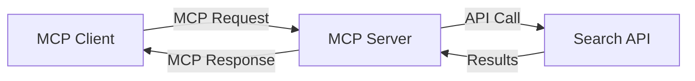
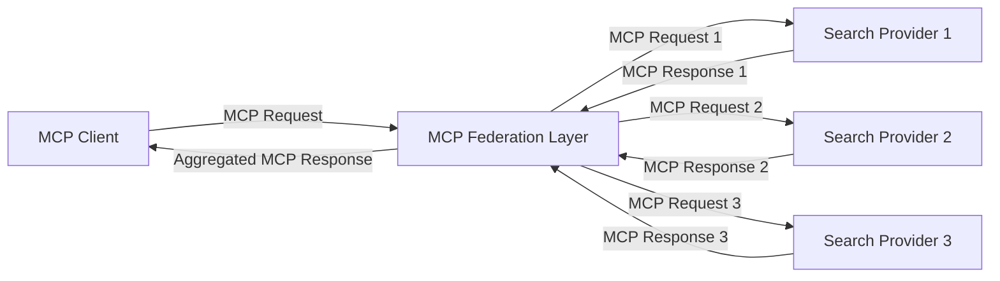
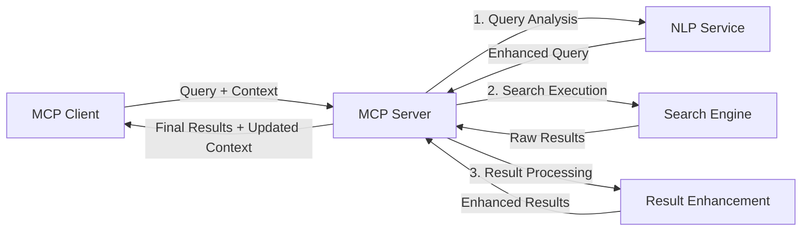

<!--
CO_OP_TRANSLATOR_METADATA:
{
  "original_hash": "eb12652eb7bd17f2193b835a344425c6",
  "translation_date": "2025-06-26T13:38:19+00:00",
  "source_file": "05-AdvancedTopics/mcp-realtimesearch/README.md",
  "language_code": "ar"
}
-->
## إخلاء مسؤولية أمثلة الشيفرة

> **ملاحظة مهمة**: أمثلة الشيفرة أدناه توضح دمج بروتوكول سياق النموذج (MCP) مع وظيفة البحث على الويب. رغم أنها تتبع الأنماط والهياكل الخاصة بحزم تطوير MCP الرسمية، إلا أنها مبسطة لأغراض تعليمية.
> 
> تعرض هذه الأمثلة:
> 
> 1. **تنفيذ بايثون**: تنفيذ خادم FastMCP يوفر أداة بحث على الويب ويتصل بواجهة برمجة تطبيقات بحث خارجية. يوضح هذا المثال إدارة دورة حياة صحيحة، وتعامل مع السياق، وتنفيذ الأدوات وفقًا لأنماط [حزمة MCP الرسمية لبايثون](https://github.com/modelcontextprotocol/python-sdk). يستخدم الخادم النقل الموصى به Streamable HTTP الذي حل محل النقل القديم SSE في بيئات الإنتاج.
> 
> 2. **تنفيذ جافاسكريبت**: تنفيذ TypeScript/JavaScript باستخدام نمط FastMCP من [حزمة MCP الرسمية لـ TypeScript](https://github.com/modelcontextprotocol/typescript-sdk) لإنشاء خادم بحث بتعريفات أدوات صحيحة واتصالات عملاء. يتبع أحدث الأنماط الموصى بها لإدارة الجلسات والحفاظ على السياق.
> 
> تتطلب هذه الأمثلة إضافة معالجات أخطاء، وتوثيق، وشيفرات دمج API محددة لاستخدام الإنتاج. نقاط نهاية API الخاصة بالبحث المعروضة (`https://api.search-service.example/search`) هي عناصر نائبة ويجب استبدالها بنقاط نهاية خدمات البحث الفعلية.
> 
> لمزيد من التفاصيل حول التنفيذ وأحدث الأساليب، يرجى الرجوع إلى [المواصفة الرسمية لـ MCP](https://spec.modelcontextprotocol.io/) ووثائق حزم التطوير.

## المفاهيم الأساسية

### إطار عمل بروتوكول سياق النموذج (MCP)

في جوهره، يوفر بروتوكول سياق النموذج طريقة موحدة لنماذج الذكاء الاصطناعي، والتطبيقات، والخدمات لتبادل السياق. في البحث على الويب في الوقت الفعلي، يُعد هذا الإطار ضروريًا لإنشاء تجارب بحث متعددة الأدوار ومتسقة. تشمل المكونات الأساسية:

1. **هيكلية عميل-خادم**: يحدد MCP فصلًا واضحًا بين عملاء البحث (المطلِبين) وخوادم البحث (المزودين)، مما يسمح بنماذج نشر مرنة.

2. **الاتصال عبر JSON-RPC**: يستخدم البروتوكول JSON-RPC لتبادل الرسائل، مما يجعله متوافقًا مع تقنيات الويب وسهل التنفيذ عبر منصات مختلفة.

3. **إدارة السياق**: يحدد MCP طرقًا منظمة للحفاظ على السياق، وتحديثه، والاستفادة منه عبر تفاعلات متعددة.

4. **تعريفات الأدوات**: تُعرض قدرات البحث كأدوات موحدة ذات معلمات وقيم إرجاع محددة جيدًا.

5. **دعم البث**: يدعم البروتوكول بث النتائج، وهو أمر أساسي للبحث في الوقت الفعلي حيث قد تصل النتائج تدريجيًا.

### أنماط دمج البحث على الويب

عند دمج MCP مع البحث على الويب، تظهر عدة أنماط:

#### 1. دمج مزود البحث المباشر

في هذا النمط، يتصل خادم MCP مباشرة بواحدة أو أكثر من واجهات برمجة تطبيقات البحث، مترجمًا طلبات MCP إلى استدعاءات API محددة ويُنسق النتائج كردود MCP.

#### 2. البحث الموحد مع الحفاظ على السياق

يوزع هذا النمط استعلامات البحث عبر مزودي بحث متعددين متوافقين مع MCP، كل منهم قد يتخصص في أنواع مختلفة من المحتوى أو قدرات البحث، مع الحفاظ على سياق موحد.

#### 3. سلسلة بحث معززة بالسياق

في هذا النمط، تُقسم عملية البحث إلى مراحل متعددة، حيث يُثري السياق في كل خطوة، مما يؤدي إلى نتائج أكثر ملاءمة تدريجيًا.

### مكونات سياق البحث

في البحث على الويب المعتمد على MCP، يشمل السياق عادةً:

- **تاريخ الاستعلامات**: الاستعلامات السابقة في الجلسة
- **تفضيلات المستخدم**: اللغة، المنطقة، إعدادات البحث الآمن
- **تاريخ التفاعل**: النتائج التي تم النقر عليها، الوقت المستغرق على النتائج
- **معلمات البحث**: الفلاتر، ترتيب النتائج، وغيرها من معدلات البحث
- **المعرفة المتخصصة**: سياق متعلق بموضوع البحث
- **السياق الزمني**: عوامل الصلة المرتبطة بالوقت
- **تفضيلات المصدر**: مصادر المعلومات الموثوقة أو المفضلة

## حالات الاستخدام والتطبيقات

### البحث وجمع المعلومات

يعزز MCP سير عمل البحث من خلال:

- الحفاظ على سياق البحث عبر جلسات متعددة
- تمكين استعلامات أكثر تطورًا وذات صلة بالسياق
- دعم البحث الموحد من مصادر متعددة
- تسهيل استخراج المعرفة من نتائج البحث

### مراقبة الأخبار والاتجاهات في الوقت الفعلي

يوفر البحث المدعوم بـ MCP مزايا لمراقبة الأخبار:

- اكتشاف الأخبار الناشئة في الوقت القريب من الحقيقي
- تصفية المعلومات ذات الصلة بناءً على السياق
- تتبع المواضيع والكيانات عبر مصادر متعددة
- تنبيهات أخبار مخصصة بناءً على سياق المستخدم

### التصفح والبحث المعزز بالذكاء الاصطناعي

يخلق MCP إمكانيات جديدة للتصفح المعزز بالذكاء الاصطناعي:

- اقتراحات بحث سياقية بناءً على نشاط المتصفح الحالي
- دمج سلس للبحث على الويب مع المساعدين المدعومين بنماذج اللغة الكبيرة
- تحسين البحث متعدد الأدوار مع الحفاظ على السياق
- تعزيز التحقق من الحقائق وتدقيق المعلومات

## الاتجاهات والابتكارات المستقبلية

### تطور MCP في البحث على الويب

نتوقع في المستقبل أن يتطور MCP لمعالجة:

- **البحث متعدد الوسائط**: دمج البحث النصي، والصوري، والصوتي، والفيديو مع الحفاظ على السياق
- **البحث اللامركزي**: دعم أنظمة البحث الموزعة والموحدة
- **خصوصية البحث**: آليات بحث تحفظ الخصوصية مع الوعي بالسياق
- **فهم الاستعلامات**: تحليل دلالي عميق لاستعلامات البحث باللغة الطبيعية

### التطورات التقنية المحتملة

التقنيات الناشئة التي ستشكل مستقبل بحث MCP:

1. **هياكل البحث العصبي**: أنظمة بحث تعتمد على التضمين ومُحسنة لـ MCP
2. **سياق البحث المخصص**: تعلم أنماط بحث المستخدم الفردي مع الزمن
3. **دمج مخططات المعرفة**: البحث السياقي المحسن بمخططات معرفة متخصصة
4. **السياق عبر الوسائط**: الحفاظ على السياق عبر أنماط بحث متعددة

## تمارين عملية

### التمرين 1: إعداد خط أنابيب بحث MCP أساسي

في هذا التمرين، ستتعلم كيفية:
- تكوين بيئة بحث MCP أساسية
- تنفيذ معالجات السياق للبحث على الويب
- اختبار والتحقق من الحفاظ على السياق عبر تكرارات البحث

### التمرين 2: بناء مساعد بحث مع MCP

أنشئ تطبيقًا كاملاً يقوم بـ:
- معالجة أسئلة البحث بلغة طبيعية
- إجراء بحث على الويب مع وعي بالسياق
- تلخيص المعلومات من مصادر متعددة
- عرض نتائج البحث المنظمة

### التمرين 3: تنفيذ اتحاد البحث متعدد المصادر مع MCP

تمرين متقدم يغطي:
- إرسال الاستعلامات بوعي للسياق إلى محركات بحث متعددة
- ترتيب وتجميع النتائج
- إزالة التكرار السياقي لنتائج البحث
- التعامل مع بيانات وصفية خاصة بالمصدر

## موارد إضافية

- [مواصفة بروتوكول سياق النموذج](https://spec.modelcontextprotocol.io/) - المواصفة الرسمية ووثائق البروتوكول التفصيلية
- [توثيق بروتوكول سياق النموذج](https://modelcontextprotocol.io/) - دروس تفصيلية وأدلة تنفيذ
- [حزمة MCP بايثون](https://github.com/modelcontextprotocol/python-sdk) - تنفيذ MCP الرسمي بلغة بايثون
- [حزمة MCP TypeScript](https://github.com/modelcontextprotocol/typescript-sdk) - تنفيذ MCP الرسمي بـ TypeScript
- [خوادم MCP المرجعية](https://github.com/modelcontextprotocol/servers) - تطبيقات مرجعية لخوادم MCP
- [وثائق Bing Web Search API](https://learn.microsoft.com/en-us/bing/search-apis/bing-web-search/overview) - واجهة بحث الويب من مايكروسوفت
- [Google Custom Search JSON API](https://developers.google.com/custom-search/v1/overview) - محرك البحث القابل للبرمجة من جوجل
- [وثائق SerpAPI](https://serpapi.com/search-api) - API لصفحات نتائج محركات البحث
- [وثائق Meilisearch](https://www.meilisearch.com/docs) - محرك بحث مفتوح المصدر
- [وثائق Elasticsearch](https://www.elastic.co/guide/index.html) - محرك بحث وتحليلات موزع
- [وثائق LangChain](https://python.langchain.com/docs/get_started/introduction) - بناء التطبيقات باستخدام نماذج اللغة الكبيرة

## مخرجات التعلم

بعد إكمال هذه الوحدة، ستكون قادرًا على:

- فهم أساسيات البحث على الويب في الوقت الفعلي وتحدياته
- شرح كيف يعزز بروتوكول سياق النموذج (MCP) قدرات البحث في الوقت الفعلي
- تنفيذ حلول بحث قائمة على MCP باستخدام أُطُر العمل وواجهات برمجة التطبيقات الشائعة
- تصميم ونشر هياكل بحث قابلة للتوسع وعالية الأداء باستخدام MCP
- تطبيق مفاهيم MCP على حالات استخدام متعددة تشمل البحث الدلالي، ومساعدة البحث، والتصفح المعزز بالذكاء الاصطناعي
- تقييم الاتجاهات الناشئة والابتكارات المستقبلية في تقنيات البحث القائمة على MCP

### اعتبارات الثقة والسلامة

عند تنفيذ حلول البحث على الويب المعتمدة على MCP، تذكر المبادئ المهمة التالية من مواصفة MCP:

1. **موافقة المستخدم والتحكم**: يجب أن يوافق المستخدمون صراحةً ويفهموا جميع عمليات الوصول إلى البيانات والعمليات. هذا مهم بشكل خاص لتنفيذات البحث التي قد تصل إلى مصادر بيانات خارجية.

2. **خصوصية البيانات**: تأكد من التعامل المناسب مع استعلامات البحث والنتائج، خاصة إذا احتوت على معلومات حساسة. نفذ ضوابط وصول مناسبة لحماية بيانات المستخدم.

3. **سلامة الأدوات**: نفذ التفويض والتحقق المناسبين لأدوات البحث، لأنها تمثل مخاطر أمنية محتملة عبر تنفيذ الشيفرة العشوائية. يجب اعتبار أوصاف سلوك الأدوات غير موثوقة ما لم تُحصل من خادم موثوق.

4. **توثيق واضح**: قدم توثيقًا واضحًا حول قدرات وقيود واعتبارات الأمان لتنفيذ البحث القائم على MCP، متبعًا إرشادات التنفيذ من المواصفة.

5. **تدفقات موافقة قوية**: أنشئ تدفقات موافقة وتفويض قوية تشرح بوضوح وظيفة كل أداة قبل السماح باستخدامها، خصوصًا للأدوات التي تتفاعل مع موارد ويب خارجية.

للحصول على التفاصيل الكاملة حول أمان MCP واعتبارات الثقة والسلامة، راجع [التوثيق الرسمي](https://modelcontextprotocol.io/specification/2025-03-26#security-and-trust-%26-safety).

## ما هو التالي

- [5.11 مصادقة Entra ID لخوادم بروتوكول سياق النموذج](../mcp-security-entra/README.md)

**تنويه**:  
تمت ترجمة هذا المستند باستخدام خدمة الترجمة الآلية [Co-op Translator](https://github.com/Azure/co-op-translator). بينما نسعى لتحقيق الدقة، يرجى العلم أن الترجمات الآلية قد تحتوي على أخطاء أو عدم دقة. يجب اعتبار المستند الأصلي بلغته الأصلية المصدر الموثوق به. بالنسبة للمعلومات الهامة، يُنصح بالاستعانة بترجمة بشرية محترفة. نحن غير مسؤولين عن أي سوء فهم أو تفسير ناتج عن استخدام هذه الترجمة.