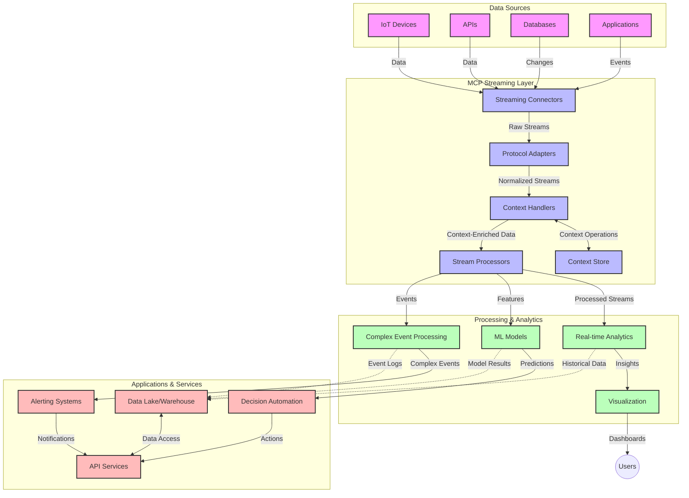

<!--
CO_OP_TRANSLATOR_METADATA:
{
  "original_hash": "195f7287638b77a549acadd96c8f981c",
  "translation_date": "2025-07-14T01:26:28+00:00",
  "source_file": "05-AdvancedTopics/mcp-realtimestreaming/README.md",
  "language_code": "ar"
}
-->
# بروتوكول سياق النموذج لبث البيانات في الوقت الحقيقي

## نظرة عامة

أصبح بث البيانات في الوقت الحقيقي أمرًا ضروريًا في عالم اليوم المعتمد على البيانات، حيث تحتاج الشركات والتطبيقات إلى الوصول الفوري للمعلومات لاتخاذ قرارات سريعة. يمثل بروتوكول سياق النموذج (MCP) تقدمًا مهمًا في تحسين عمليات البث في الوقت الحقيقي، من خلال تعزيز كفاءة معالجة البيانات، والحفاظ على سلامة السياق، وتحسين أداء النظام بشكل عام.

يستعرض هذا الموديول كيف يحول MCP بث البيانات في الوقت الحقيقي عبر توفير نهج موحد لإدارة السياق بين نماذج الذكاء الاصطناعي، ومنصات البث، والتطبيقات.

## مقدمة في بث البيانات في الوقت الحقيقي

بث البيانات في الوقت الحقيقي هو نموذج تقني يتيح النقل والمعالجة والتحليل المستمر للبيانات أثناء توليدها، مما يسمح للأنظمة بالاستجابة الفورية للمعلومات الجديدة. على عكس المعالجة الدُفعية التقليدية التي تعمل على مجموعات بيانات ثابتة، تعالج أنظمة البث البيانات أثناء تدفقها، مما يوفر رؤى وإجراءات بأقل زمن تأخير ممكن.

### المفاهيم الأساسية لبث البيانات في الوقت الحقيقي:

- **تدفق بيانات مستمر**: تتم معالجة البيانات كتيار مستمر لا ينقطع من الأحداث أو السجلات.
- **معالجة منخفضة الكمون**: تُصمم الأنظمة لتقليل الوقت بين توليد البيانات ومعالجتها.
- **قابلية التوسع**: يجب أن تتعامل بنى البث مع أحجام وسرعات بيانات متغيرة.
- **تحمل الأخطاء**: تحتاج الأنظمة إلى مقاومة الأعطال لضمان تدفق البيانات دون انقطاع.
- **المعالجة الحالة**: الحفاظ على السياق عبر الأحداث أمر حيوي للتحليل المفيد.

### بروتوكول سياق النموذج وبث البيانات في الوقت الحقيقي

يعالج بروتوكول سياق النموذج (MCP) عدة تحديات حاسمة في بيئات البث في الوقت الحقيقي:

1. **استمرارية السياق**: يقوم MCP بتوحيد كيفية الحفاظ على السياق عبر مكونات البث الموزعة، مما يضمن أن نماذج الذكاء الاصطناعي وعقد المعالجة تصل إلى السياق التاريخي والبيئي ذي الصلة.

2. **إدارة الحالة بكفاءة**: من خلال توفير آليات منظمة لنقل السياق، يقلل MCP من عبء إدارة الحالة في خطوط أنابيب البث.

3. **التشغيل البيني**: يخلق MCP لغة مشتركة لمشاركة السياق بين تقنيات البث المتنوعة ونماذج الذكاء الاصطناعي، مما يمكّن من بنى أكثر مرونة وقابلية للتوسع.

4. **سياق محسن للبث**: يمكن لتطبيقات MCP أن تعطي أولوية لعناصر السياق الأكثر أهمية لاتخاذ القرارات في الوقت الحقيقي، مما يحسن الأداء والدقة.

5. **المعالجة التكيفية**: مع إدارة السياق المناسبة عبر MCP، يمكن لأنظمة البث تعديل المعالجة ديناميكيًا بناءً على الظروف والأنماط المتغيرة في البيانات.

في التطبيقات الحديثة، من شبكات أجهزة إنترنت الأشياء إلى منصات التداول المالي، يتيح دمج MCP مع تقنيات البث معالجة أكثر ذكاءً ووعيًا بالسياق يمكنها الاستجابة بشكل مناسب للمواقف المعقدة والمتطورة في الوقت الحقيقي.

## أهداف التعلم

بنهاية هذا الدرس، ستكون قادرًا على:

- فهم أساسيات بث البيانات في الوقت الحقيقي وتحدياته
- شرح كيف يعزز بروتوكول سياق النموذج (MCP) بث البيانات في الوقت الحقيقي
- تنفيذ حلول بث تعتمد على MCP باستخدام أُطُر شهيرة مثل Kafka وPulsar
- تصميم ونشر بنى بث عالية الأداء وقادرة على تحمل الأخطاء باستخدام MCP
- تطبيق مفاهيم MCP على حالات استخدام إنترنت الأشياء، والتداول المالي، والتحليلات المدفوعة بالذكاء الاصطناعي
- تقييم الاتجاهات الناشئة والابتكارات المستقبلية في تقنيات البث المعتمدة على MCP

### التعريف والأهمية

يتضمن بث البيانات في الوقت الحقيقي التوليد والمعالجة والتسليم المستمر للبيانات بزمن تأخير منخفض جدًا. على عكس المعالجة الدُفعية التي تجمع البيانات وتعالجها دفعات، تتم معالجة بيانات البث تدريجيًا أثناء وصولها، مما يتيح رؤى وإجراءات فورية.

الخصائص الرئيسية لبث البيانات في الوقت الحقيقي تشمل:

- **زمن تأخير منخفض**: معالجة وتحليل البيانات خلال ميلي ثانية إلى ثوانٍ
- **تدفق مستمر**: تيارات بيانات غير منقطعة من مصادر متعددة
- **معالجة فورية**: تحليل البيانات فور وصولها بدلاً من تجميعها
- **بنية معتمدة على الأحداث**: الاستجابة للأحداث فور حدوثها

### التحديات في بث البيانات التقليدي

تواجه طرق بث البيانات التقليدية عدة قيود:

1. **فقدان السياق**: صعوبة الحفاظ على السياق عبر الأنظمة الموزعة
2. **مشاكل القابلية للتوسع**: تحديات في التوسع للتعامل مع بيانات عالية الحجم والسرعة
3. **تعقيد التكامل**: مشاكل في التشغيل البيني بين الأنظمة المختلفة
4. **إدارة الكمون**: موازنة بين معدل النقل ووقت المعالجة
5. **اتساق البيانات**: ضمان دقة واكتمال البيانات عبر التيار

## فهم بروتوكول سياق النموذج (MCP)

### ما هو MCP؟

بروتوكول سياق النموذج (MCP) هو بروتوكول اتصال موحد مصمم لتسهيل التفاعل الفعال بين نماذج الذكاء الاصطناعي والتطبيقات. في سياق بث البيانات في الوقت الحقيقي، يوفر MCP إطارًا لـ:

- الحفاظ على السياق طوال خط أنابيب البيانات
- توحيد صيغ تبادل البيانات
- تحسين نقل مجموعات البيانات الكبيرة
- تعزيز التواصل بين النماذج وبعضها وبين النماذج والتطبيقات

### المكونات الأساسية والهيكلية

يتكون هيكل MCP للبث في الوقت الحقيقي من عدة مكونات رئيسية:

1. **مديرو السياق**: يديرون ويحافظون على المعلومات السياقية عبر خط أنابيب البث
2. **معالجات التدفق**: تعالج تدفقات البيانات الواردة باستخدام تقنيات واعية للسياق
3. **محولات البروتوكول**: تحول بين بروتوكولات البث المختلفة مع الحفاظ على السياق
4. **مخزن السياق**: يخزن ويسترجع المعلومات السياقية بكفاءة
5. **موصلات البث**: تتصل بمنصات بث متعددة (Kafka، Pulsar، Kinesis، وغيرها)



### كيف يحسن MCP التعامل مع البيانات في الوقت الحقيقي

يعالج MCP تحديات البث التقليدية من خلال:

- **سلامة السياق**: الحفاظ على العلاقات بين نقاط البيانات عبر كامل خط الأنابيب
- **نقل محسن**: تقليل التكرار في تبادل البيانات عبر إدارة ذكية للسياق
- **واجهات موحدة**: توفير واجهات برمجة تطبيقات متسقة لمكونات البث
- **تقليل الكمون**: تقليل عبء المعالجة عبر إدارة فعالة للسياق
- **تعزيز القابلية للتوسع**: دعم التوسع الأفقي مع الحفاظ على السياق

## التكامل والتنفيذ

تتطلب أنظمة بث البيانات في الوقت الحقيقي تصميمًا معماريًا وتنفيذًا دقيقًا للحفاظ على الأداء وسلامة السياق. يقدم بروتوكول سياق النموذج نهجًا موحدًا لدمج نماذج الذكاء الاصطناعي وتقنيات البث، مما يسمح بإنشاء خطوط أنابيب معالجة أكثر تطورًا ووعيًا بالسياق.

### نظرة عامة على تكامل MCP في بنى البث

يتضمن تنفيذ MCP في بيئات البث في الوقت الحقيقي عدة اعتبارات رئيسية:

1. **تسلسل ونقل السياق**: يوفر MCP آليات فعالة لترميز المعلومات السياقية داخل حزم بيانات البث، مما يضمن متابعة السياق الأساسي للبيانات طوال خط المعالجة. يشمل ذلك صيغ تسلسل موحدة ومحسنة لنقل البث.

2. **المعالجة الحالة للتدفق**: يمكّن MCP معالجة حالة أكثر ذكاءً من خلال الحفاظ على تمثيل سياقي متسق عبر عقد المعالجة. هذا مهم بشكل خاص في بنى البث الموزعة حيث تكون إدارة الحالة تحديًا تقليديًا.

3. **وقت الحدث مقابل وقت المعالجة**: يجب على تطبيقات MCP في أنظمة البث معالجة التحدي الشائع المتمثل في التمييز بين وقت حدوث الأحداث ووقت معالجتها. يمكن للبروتوكول تضمين سياق زمني يحافظ على دلالات وقت الحدث.

4. **إدارة الضغط العكسي**: من خلال توحيد معالجة السياق، يساعد MCP في إدارة الضغط العكسي في أنظمة البث، مما يسمح للمكونات بالتواصل حول قدرات المعالجة وضبط التدفق وفقًا لذلك.

5. **تجزئة وتجميع السياق**: يسهل MCP عمليات التجزئة الأكثر تطورًا من خلال توفير تمثيلات منظمة للسياقات الزمنية والعلاقاتية، مما يمكّن من تجميعات أكثر معنى عبر تدفقات الأحداث.

6. **المعالجة الدقيقة مرة واحدة**: في أنظمة البث التي تتطلب دلالات "مرة واحدة بالضبط"، يمكن لـ MCP تضمين بيانات وصفية للمعالجة تساعد في تتبع والتحقق من حالة المعالجة عبر المكونات الموزعة.

يخلق تنفيذ MCP عبر تقنيات بث متعددة نهجًا موحدًا لإدارة السياق، مما يقلل الحاجة إلى أكواد تكامل مخصصة ويعزز قدرة النظام على الحفاظ على سياق ذي معنى أثناء تدفق البيانات عبر خط الأنابيب.

### MCP في أُطُر بث البيانات المختلفة

تتبع هذه الأمثلة مواصفات MCP الحالية التي تركز على بروتوكول JSON-RPC مع آليات نقل مميزة. يوضح الكود كيف يمكنك تنفيذ وسائل نقل مخصصة تدمج منصات البث مثل Kafka وPulsar مع الحفاظ على التوافق الكامل مع بروتوكول MCP.

تم تصميم الأمثلة لتوضيح كيفية دمج منصات البث مع MCP لتوفير معالجة بيانات في الوقت الحقيقي مع الحفاظ على الوعي السياقي الذي يشكل جوهر MCP. يضمن هذا النهج أن تعكس عينات الكود الحالة الحالية لمواصفات MCP حتى يونيو 2025.

يمكن دمج MCP مع أُطُر بث شهيرة تشمل:

#### تكامل Apache Kafka

```python
import asyncio
import json
from typing import Dict, Any, Optional
from confluent_kafka import Consumer, Producer, KafkaError
from mcp.client import Client, ClientCapabilities
from mcp.core.message import JsonRpcMessage
from mcp.core.transports import Transport

# Custom transport class to bridge MCP with Kafka
class KafkaMCPTransport(Transport):
    def __init__(self, bootstrap_servers: str, input_topic: str, output_topic: str):
        self.bootstrap_servers = bootstrap_servers
        self.input_topic = input_topic
        self.output_topic = output_topic
        self.producer = Producer({'bootstrap.servers': bootstrap_servers})
        self.consumer = Consumer({
            'bootstrap.servers': bootstrap_servers,
            'group.id': 'mcp-client-group',
            'auto.offset.reset': 'earliest'
        })
        self.message_queue = asyncio.Queue()
        self.running = False
        self.consumer_task = None
        
    async def connect(self):
        """Connect to Kafka and start consuming messages"""
        self.consumer.subscribe([self.input_topic])
        self.running = True
        self.consumer_task = asyncio.create_task(self._consume_messages())
        return self
        
    async def _consume_messages(self):
        """Background task to consume messages from Kafka and queue them for processing"""
        while self.running:
            try:
                msg = self.consumer.poll(1.0)
                if msg is None:
                    await asyncio.sleep(0.1)
                    continue
                
                if msg.error():
                    if msg.error().code() == KafkaError._PARTITION_EOF:
                        continue
                    print(f"Consumer error: {msg.error()}")
                    continue
                
                # Parse the message value as JSON-RPC
                try:
                    message_str = msg.value().decode('utf-8')
                    message_data = json.loads(message_str)
                    mcp_message = JsonRpcMessage.from_dict(message_data)
                    await self.message_queue.put(mcp_message)
                except Exception as e:
                    print(f"Error parsing message: {e}")
            except Exception as e:
                print(f"Error in consumer loop: {e}")
                await asyncio.sleep(1)
    
    async def read(self) -> Optional[JsonRpcMessage]:
        """Read the next message from the queue"""
        try:
            message = await self.message_queue.get()
            return message
        except Exception as e:
            print(f"Error reading message: {e}")
            return None
    
    async def write(self, message: JsonRpcMessage) -> None:
        """Write a message to the Kafka output topic"""
        try:
            message_json = json.dumps(message.to_dict())
            self.producer.produce(
                self.output_topic,
                message_json.encode('utf-8'),
                callback=self._delivery_report
            )
            self.producer.poll(0)  # Trigger callbacks
        except Exception as e:
            print(f"Error writing message: {e}")
    
    def _delivery_report(self, err, msg):
        """Kafka producer delivery callback"""
        if err is not None:
            print(f'Message delivery failed: {err}')
        else:
            print(f'Message delivered to {msg.topic()} [{msg.partition()}]')
    
    async def close(self) -> None:
        """Close the transport"""
        self.running = False
        if self.consumer_task:
            self.consumer_task.cancel()
            try:
                await self.consumer_task
            except asyncio.CancelledError:
                pass
        self.consumer.close()
        self.producer.flush()

# Example usage of the Kafka MCP transport
async def kafka_mcp_example():
    # Create MCP client with Kafka transport
    client = Client(
        {"name": "kafka-mcp-client", "version": "1.0.0"},
        ClientCapabilities({})
    )
    
    # Create and connect the Kafka transport
    transport = KafkaMCPTransport(
        bootstrap_servers="localhost:9092",
        input_topic="mcp-responses",
        output_topic="mcp-requests"
    )
    
    await client.connect(transport)
    
    try:
        # Initialize the MCP session
        await client.initialize()
        
        # Example of executing a tool via MCP
        response = await client.execute_tool(
            "process_data",
            {
                "data": "sample data",
                "metadata": {
                    "source": "sensor-1",
                    "timestamp": "2025-06-12T10:30:00Z"
                }
            }
        )
        
        print(f"Tool execution response: {response}")
        
        # Clean shutdown
        await client.shutdown()
    finally:
        await transport.close()

# Run the example
if __name__ == "__main__":
    asyncio.run(kafka_mcp_example())
```

#### تنفيذ Apache Pulsar

```python
import asyncio
import json
import pulsar
from typing import Dict, Any, Optional
from mcp.core.message import JsonRpcMessage
from mcp.core.transports import Transport
from mcp.server import Server, ServerOptions
from mcp.server.tools import Tool, ToolExecutionContext, ToolMetadata

# Create a custom MCP transport that uses Pulsar
class PulsarMCPTransport(Transport):
    def __init__(self, service_url: str, request_topic: str, response_topic: str):
        self.service_url = service_url
        self.request_topic = request_topic
        self.response_topic = response_topic
        self.client = pulsar.Client(service_url)
        self.producer = self.client.create_producer(response_topic)
        self.consumer = self.client.subscribe(
            request_topic,
            "mcp-server-subscription",
            consumer_type=pulsar.ConsumerType.Shared
        )
        self.message_queue = asyncio.Queue()
        self.running = False
        self.consumer_task = None
    
    async def connect(self):
        """Connect to Pulsar and start consuming messages"""
        self.running = True
        self.consumer_task = asyncio.create_task(self._consume_messages())
        return self
    
    async def _consume_messages(self):
        """Background task to consume messages from Pulsar and queue them for processing"""
        while self.running:
            try:
                # Non-blocking receive with timeout
                msg = self.consumer.receive(timeout_millis=500)
                
                # Process the message
                try:
                    message_str = msg.data().decode('utf-8')
                    message_data = json.loads(message_str)
                    mcp_message = JsonRpcMessage.from_dict(message_data)
                    await self.message_queue.put(mcp_message)
                    
                    # Acknowledge the message
                    self.consumer.acknowledge(msg)
                except Exception as e:
                    print(f"Error processing message: {e}")
                    # Negative acknowledge if there was an error
                    self.consumer.negative_acknowledge(msg)
            except Exception as e:
                # Handle timeout or other exceptions
                await asyncio.sleep(0.1)
    
    async def read(self) -> Optional[JsonRpcMessage]:
        """Read the next message from the queue"""
        try:
            message = await self.message_queue.get()
            return message
        except Exception as e:
            print(f"Error reading message: {e}")
            return None
    
    async def write(self, message: JsonRpcMessage) -> None:
        """Write a message to the Pulsar output topic"""
        try:
            message_json = json.dumps(message.to_dict())
            self.producer.send(message_json.encode('utf-8'))
        except Exception as e:
            print(f"Error writing message: {e}")
    
    async def close(self) -> None:
        """Close the transport"""
        self.running = False
        if self.consumer_task:
            self.consumer_task.cancel()
            try:
                await self.consumer_task
            except asyncio.CancelledError:
                pass
        self.consumer.close()
        self.producer.close()
        self.client.close()

# Define a sample MCP tool that processes streaming data
@Tool(
    name="process_streaming_data",
    description="Process streaming data with context preservation",
    metadata=ToolMetadata(
        required_capabilities=["streaming"]
    )
)
async def process_streaming_data(
    ctx: ToolExecutionContext,
    data: str,
    source: str,
    priority: str = "medium"
) -> Dict[str, Any]:
    """
    Process streaming data while preserving context
    
    Args:
        ctx: Tool execution context
        data: The data to process
        source: The source of the data
        priority: Priority level (low, medium, high)
        
    Returns:
        Dict containing processed results and context information
    """
    # Example processing that leverages MCP context
    print(f"Processing data from {source} with priority {priority}")
    
    # Access conversation context from MCP
    conversation_id = ctx.conversation_id if hasattr(ctx, 'conversation_id') else "unknown"
    
    # Return results with enhanced context
    return {
        "processed_data": f"Processed: {data}",
        "context": {
            "conversation_id": conversation_id,
            "source": source,
            "priority": priority,
            "processing_timestamp": ctx.get_current_time_iso()
        }
    }

# Example MCP server implementation using Pulsar transport
async def run_mcp_server_with_pulsar():
    # Create MCP server
    server = Server(
        {"name": "pulsar-mcp-server", "version": "1.0.0"},
        ServerOptions(
            capabilities={"streaming": True}
        )
    )
    
    # Register our tool
    server.register_tool(process_streaming_data)
    
    # Create and connect Pulsar transport
    transport = PulsarMCPTransport(
        service_url="pulsar://localhost:6650",
        request_topic="mcp-requests",
        response_topic="mcp-responses"
    )
    
    try:
        # Start the server with the Pulsar transport
        await server.run(transport)
    finally:
        await transport.close()

# Run the server
if __name__ == "__main__":
    asyncio.run(run_mcp_server_with_pulsar())
```

### أفضل الممارسات للنشر

عند تنفيذ MCP للبث في الوقت الحقيقي:

1. **التصميم لتحمل الأخطاء**:
   - تنفيذ معالجة أخطاء مناسبة
   - استخدام قوائم الرسائل الميتة للرسائل الفاشلة
   - تصميم معالجات متكررة (idempotent)

2. **التحسين للأداء**:
   - ضبط أحجام المخازن المؤقتة المناسبة
   - استخدام التجميع حيثما كان مناسبًا
   - تنفيذ آليات الضغط العكسي

3. **المراقبة والرصد**:
   - تتبع مقاييس معالجة التدفق
   - مراقبة انتشار السياق
   - إعداد تنبيهات للحالات الشاذة

4. **تأمين التدفقات**:
   - تنفيذ التشفير للبيانات الحساسة
   - استخدام المصادقة والتفويض
   - تطبيق ضوابط وصول مناسبة

### MCP في إنترنت الأشياء والحوسبة الطرفية

يعزز MCP بث إنترنت الأشياء من خلال:

- الحفاظ على سياق الأجهزة عبر خط المعالجة
- تمكين بث بيانات فعال من الحافة إلى السحابة
- دعم التحليلات في الوقت الحقيقي على تدفقات بيانات إنترنت الأشياء
- تسهيل التواصل بين الأجهزة مع الحفاظ على السياق

مثال: شبكات حساسات المدن الذكية  
```
Sensors → Edge Gateways → MCP Stream Processors → Real-time Analytics → Automated Responses
```

### الدور في المعاملات المالية والتداول عالي التردد

يوفر MCP مزايا كبيرة لبث البيانات المالية:

- معالجة بزمن تأخير منخفض جدًا لاتخاذ قرارات التداول
- الحفاظ على سياق المعاملات طوال المعالجة
- دعم معالجة الأحداث المعقدة مع الوعي السياقي
- ضمان اتساق البيانات عبر أنظمة التداول الموزعة

### تعزيز تحليلات البيانات المدفوعة بالذكاء الاصطناعي

يخلق MCP إمكانيات جديدة لتحليلات البث:

- تدريب النماذج والاستدلال في الوقت الحقيقي
- التعلم المستمر من بيانات البث
- استخراج ميزات واعية للسياق
- خطوط أنابيب استدلال متعددة النماذج مع الحفاظ على السياق

## الاتجاهات والابتكارات المستقبلية

### تطور MCP في بيئات الوقت الحقيقي

نتوقع في المستقبل أن يتطور MCP ليشمل:

- **دمج الحوسبة الكمومية**: الاستعداد لأنظمة البث القائمة على الحوسبة الكمومية
- **المعالجة الأصلية على الحافة**: نقل المزيد من المعالجة الواعية للسياق إلى أجهزة الحافة
- **إدارة البث الذاتية**: خطوط أنابيب بث ذاتية التحسين
- **البث الفيدرالي**: المعالجة الموزعة مع الحفاظ على الخصوصية

### التطورات المحتملة في التكنولوجيا

التقنيات الناشئة التي ستشكل مستقبل بث MCP:

1. **بروتوكولات بث محسنة للذكاء الاصطناعي**: بروتوكولات مخصصة مصممة خصيصًا لأعباء عمل الذكاء الاصطناعي
2. **دمج الحوسبة العصبية**: الحوسبة المستوحاة من الدماغ لمعالجة التدفقات
3. **البث بدون خوادم**: بث قائم على الأحداث وقابل للتوسع بدون إدارة بنية تحتية
4. **مخازن سياق موزعة**: إدارة سياق موزعة عالميًا مع اتساق عالي

## تمارين عملية

### التمرين 1: إعداد خط بث MCP أساسي

في هذا التمرين، ستتعلم كيفية:
- تكوين بيئة بث MCP أساسية
- تنفيذ مديري السياق لمعالجة التدفق
- اختبار والتحقق من الحفاظ على السياق

### التمرين 2: بناء لوحة تحليلات في الوقت الحقيقي

أنشئ تطبيقًا كاملاً يقوم بـ:
- استيعاب بيانات البث باستخدام MCP
- معالجة التدفق مع الحفاظ على السياق
- عرض النتائج في الوقت الحقيقي

### التمرين 3: تنفيذ معالجة أحداث معقدة باستخدام MCP

تمرين متقدم يغطي:
- اكتشاف الأنماط في التدفقات
- الترابط السياقي عبر تدفقات متعددة
- توليد أحداث معقدة مع الحفاظ على السياق

## موارد إضافية

- [Model Context Protocol Specification](https://github.com/modelcontextprotocol) - المواصفات والوثائق الرسمية لـ MCP
- [Apache Kafka Documentation](https://kafka.apache.org/documentation/) - تعلم عن Kafka لمعالجة التدفق
- [Apache Pulsar](https://pulsar.apache.org/) - منصة موحدة للرسائل والبث
- [Streaming Systems: The What, Where, When, and How of Large-Scale Data Processing](https://www.oreilly.com/library/view/streaming-systems/9781491983867/) - كتاب شامل عن بنى البث
- [Microsoft Azure Event Hubs](https://learn.microsoft.com/azure/event-hubs/event-hubs-about) - خدمة بث أحداث مُدارة
- [MLflow Documentation](https://mlflow.org/docs/latest/index.html) - لتتبع ونشر نماذج التعلم الآلي
- [Real-Time Analytics with Apache Storm](https://storm.apache.org/releases/current/index.html) - إطار عمل للمعالجة في الوقت الحقيقي
- [Flink ML](https://nightlies.apache.org/flink/flink-ml-docs-master/) - مكتبة تعلم آلي لـ Apache Flink
- [LangChain Documentation](https://python.langchain.com/docs/get_started/introduction) - بناء التطبيقات باستخدام نماذج اللغة الكبيرة

## نتائج التعلم

بعد إكمال هذا الموديول، ستكون قادرًا على:

- فهم أساسيات بث البيانات في الوقت الحقيقي وتحدياته
- شرح كيف يعزز بروتوكول سياق النموذج (MCP) بث البيانات في الوقت الحقيقي
- تنفيذ حلول بث تعتمد على MCP باستخدام أُطُر شهيرة مثل Kafka وPulsar
- تصميم ونشر بنى بث عالية الأداء وقادرة على تحمل الأخطاء باستخدام MCP
- تطبيق مفاهيم MCP على حالات استخدام إنترنت الأشياء، والتداول المالي، والتحليلات المدفوعة بالذكاء الاصطناعي
- تقييم الاتجاهات الناشئة والابتكارات المستقبلية في تقنيات البث المعتمدة على MCP

## ما التالي

- [5.11 البحث في الوقت الحقيقي](../mcp-realtimesearch/README.md)

**إخلاء المسؤولية**:  
تمت ترجمة هذا المستند باستخدام خدمة الترجمة الآلية [Co-op Translator](https://github.com/Azure/co-op-translator). بينما نسعى لتحقيق الدقة، يرجى العلم أن الترجمات الآلية قد تحتوي على أخطاء أو عدم دقة. يجب اعتبار المستند الأصلي بلغته الأصلية المصدر الموثوق به. للمعلومات الهامة، يُنصح بالاعتماد على الترجمة البشرية المهنية. نحن غير مسؤولين عن أي سوء فهم أو تفسير ناتج عن استخدام هذه الترجمة.