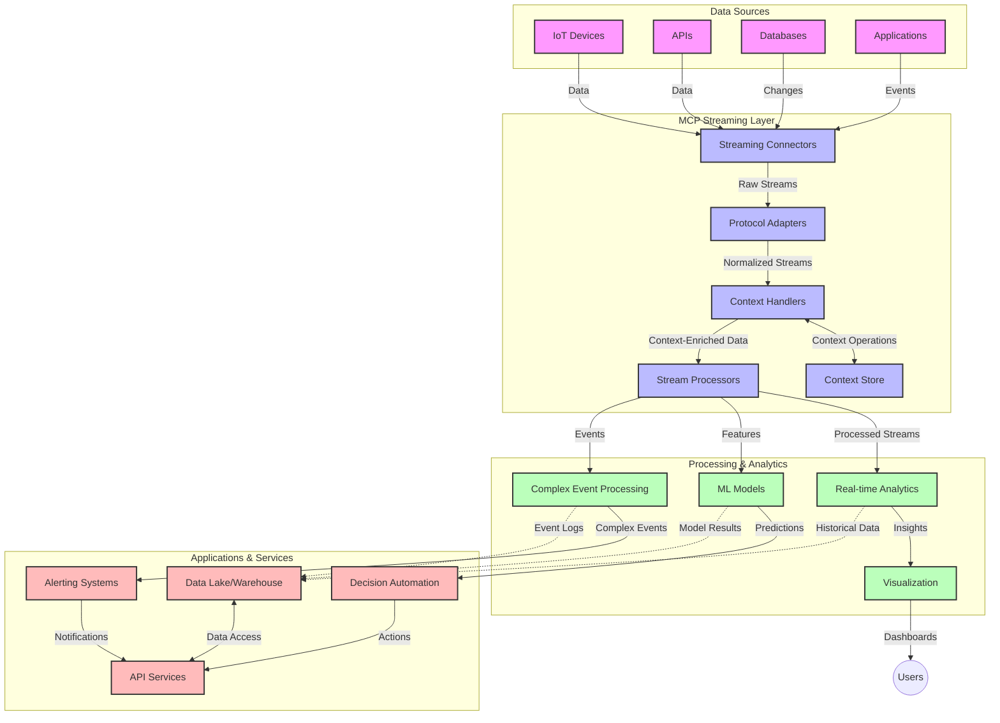

<!--
CO_OP_TRANSLATOR_METADATA:
{
  "original_hash": "68c518dbff8a3b127ed2aa934054c56c",
  "translation_date": "2025-06-11T16:56:26+00:00",
  "source_file": "05-AdvancedTopics/mcp-realtimestreaming/README.md",
  "language_code": "ar"
}
-->
# بروتوكول سياق النموذج لتدفق البيانات في الوقت الحقيقي

## نظرة عامة

أصبح تدفق البيانات في الوقت الحقيقي أمرًا ضروريًا في عالم اليوم الذي يعتمد على البيانات، حيث تحتاج الأعمال والتطبيقات إلى الوصول الفوري إلى المعلومات لاتخاذ قرارات سريعة. يمثل بروتوكول سياق النموذج (MCP) تقدمًا كبيرًا في تحسين عمليات التدفق هذه، مما يعزز كفاءة معالجة البيانات، ويحافظ على سلامة السياق، ويحسن أداء النظام بشكل عام.

تتناول هذه الوحدة كيف يحول MCP تدفق البيانات في الوقت الحقيقي من خلال توفير نهج موحد لإدارة السياق عبر نماذج الذكاء الاصطناعي، ومنصات التدفق، والتطبيقات.

## مقدمة في تدفق البيانات في الوقت الحقيقي

تدفق البيانات في الوقت الحقيقي هو نموذج تقني يتيح النقل المستمر، والمعالجة، وتحليل البيانات أثناء توليدها، مما يسمح للأنظمة بالاستجابة الفورية للمعلومات الجديدة. على عكس المعالجة الدُفعية التقليدية التي تعمل على مجموعات بيانات ثابتة، تعالج التدفقات البيانات أثناء تحركها، مقدمة رؤى وإجراءات بأدنى تأخير ممكن.

### المفاهيم الأساسية لتدفق البيانات في الوقت الحقيقي:

- **تدفق بيانات مستمر**: تتم معالجة البيانات كسلسلة مستمرة لا تنتهي من الأحداث أو السجلات.
- **معالجة منخفضة التأخير**: تم تصميم الأنظمة لتقليل الوقت بين توليد البيانات ومعالجتها.
- **قابلية التوسع**: يجب أن تتعامل هندسة التدفق مع أحجام وسرعات بيانات متغيرة.
- **تحمل الأخطاء**: تحتاج الأنظمة إلى مقاومة الأعطال لضمان تدفق البيانات دون انقطاع.
- **المعالجة الحافظة للحالة**: الحفاظ على السياق عبر الأحداث أمر حاسم للتحليل المفيد.

### بروتوكول سياق النموذج وتدفق البيانات في الوقت الحقيقي

يتعامل بروتوكول سياق النموذج (MCP) مع عدة تحديات حاسمة في بيئات التدفق في الوقت الحقيقي:

1. **استمرارية السياق**: يقوم MCP بتوحيد كيفية الحفاظ على السياق عبر مكونات التدفق الموزعة، مما يضمن أن نماذج الذكاء الاصطناعي وعقد المعالجة تصل إلى السياق التاريخي والبيئي ذي الصلة.

2. **إدارة الحالة بكفاءة**: من خلال توفير آليات منظمة لنقل السياق، يقلل MCP من عبء إدارة الحالة في خطوط أنابيب التدفق.

3. **التشغيل البيني**: يخلق MCP لغة مشتركة لمشاركة السياق بين تقنيات التدفق المتنوعة ونماذج الذكاء الاصطناعي، مما يمكّن من هندسات أكثر مرونة وقابلية للتوسع.

4. **السياق المحسن للتدفق**: يمكن لتطبيقات MCP تحديد أولويات لعناصر السياق الأكثر أهمية لاتخاذ القرار في الوقت الحقيقي، مما يحسن الأداء والدقة.

5. **المعالجة التكيفية**: بفضل إدارة السياق المناسبة عبر MCP، يمكن لأنظمة التدفق التكيف ديناميكيًا مع ظروف وأنماط البيانات المتغيرة.

في التطبيقات الحديثة، بدءًا من شبكات أجهزة الاستشعار في إنترنت الأشياء إلى منصات التداول المالي، يمكّن دمج MCP مع تقنيات التدفق معالجة أكثر ذكاءً ووعيًا بالسياق يمكنها الاستجابة بشكل مناسب للحالات المعقدة والمتطورة في الوقت الحقيقي.

## أهداف التعلم

بنهاية هذا الدرس، ستتمكن من:

- فهم أساسيات تدفق البيانات في الوقت الحقيقي وتحدياته
- شرح كيف يعزز بروتوكول سياق النموذج (MCP) تدفق البيانات في الوقت الحقيقي
- تنفيذ حلول التدفق القائمة على MCP باستخدام أُطُر شائعة مثل Kafka وPulsar
- تصميم ونشر هندسات تدفق عالية الأداء ومتحملة للأخطاء باستخدام MCP
- تطبيق مفاهيم MCP على حالات استخدام إنترنت الأشياء، والتداول المالي، والتحليلات المدفوعة بالذكاء الاصطناعي
- تقييم الاتجاهات الناشئة والابتكارات المستقبلية في تقنيات التدفق القائمة على MCP

### التعريف والأهمية

يتضمن تدفق البيانات في الوقت الحقيقي التوليد المستمر، والمعالجة، وتسليم البيانات بأقل تأخير ممكن. على عكس المعالجة الدُفعية التي تجمع البيانات وتعالجها دفعات، تتم معالجة بيانات التدفق تدريجيًا عند وصولها، مما يمكّن من الحصول على رؤى وإجراءات فورية.

الخصائص الرئيسية لتدفق البيانات في الوقت الحقيقي تشمل:

- **انخفاض التأخير**: معالجة وتحليل البيانات خلال ميلي ثانية إلى ثوانٍ
- **تدفق مستمر**: تدفقات بيانات غير منقطعة من مصادر متعددة
- **المعالجة الفورية**: تحليل البيانات عند وصولها بدلاً من دفعات
- **هندسة معتمدة على الأحداث**: الاستجابة للأحداث عند حدوثها

### التحديات في تدفق البيانات التقليدي

تواجه طرق تدفق البيانات التقليدية عدة قيود:

1. **فقدان السياق**: صعوبة الحفاظ على السياق عبر الأنظمة الموزعة
2. **مشاكل القابلية للتوسع**: تحديات في التوسع للتعامل مع بيانات عالية الحجم والسرعة
3. **تعقيد التكامل**: مشاكل في التشغيل البيني بين الأنظمة المختلفة
4. **إدارة التأخير**: موازنة الإنتاجية مع وقت المعالجة
5. **اتساق البيانات**: ضمان دقة واكتمال البيانات عبر التدفق

## فهم بروتوكول سياق النموذج (MCP)

### ما هو MCP؟

بروتوكول سياق النموذج (MCP) هو بروتوكول اتصال موحد مصمم لتسهيل التفاعل الفعال بين نماذج الذكاء الاصطناعي والتطبيقات. في سياق تدفق البيانات في الوقت الحقيقي، يوفر MCP إطارًا لـ:

- الحفاظ على السياق عبر خط أنابيب البيانات
- توحيد تنسيقات تبادل البيانات
- تحسين نقل مجموعات البيانات الكبيرة
- تعزيز التواصل بين النماذج وبعضها وبين النماذج والتطبيقات

### المكونات الأساسية والهندسة

تتكون هندسة MCP لتدفق البيانات في الوقت الحقيقي من عدة مكونات رئيسية:

1. **مديرو السياق**: يديرون ويحافظون على المعلومات السياقية عبر خط أنابيب التدفق
2. **معالجات التدفق**: تعالج تدفقات البيانات الواردة باستخدام تقنيات واعية للسياق
3. **محولات البروتوكول**: تحول بين بروتوكولات التدفق المختلفة مع الحفاظ على السياق
4. **مخزن السياق**: يخزن ويسترجع المعلومات السياقية بكفاءة
5. **موصلات التدفق**: تتصل بمنصات التدفق المختلفة (Kafka، Pulsar، Kinesis، إلخ)



### كيف يحسن MCP التعامل مع البيانات في الوقت الحقيقي

يتعامل MCP مع تحديات التدفق التقليدية من خلال:

- **سلامة السياق**: الحفاظ على العلاقات بين نقاط البيانات عبر خط الأنابيب بأكمله
- **نقل محسن**: تقليل التكرار في تبادل البيانات عبر إدارة ذكية للسياق
- **واجهات موحدة**: توفير واجهات برمجة تطبيقات متسقة لمكونات التدفق
- **تقليل التأخير**: تقليل عبء المعالجة من خلال إدارة فعالة للسياق
- **تعزيز القابلية للتوسع**: دعم التوسع الأفقي مع الحفاظ على السياق

## التكامل والتنفيذ

تتطلب أنظمة تدفق البيانات في الوقت الحقيقي تصميمًا معماريًا وتنفيذًا دقيقًا للحفاظ على الأداء وسلامة السياق. يقدم بروتوكول سياق النموذج نهجًا موحدًا لدمج نماذج الذكاء الاصطناعي وتقنيات التدفق، مما يسمح بخطوط أنابيب معالجة أكثر تقدمًا ووعيًا بالسياق.

### نظرة عامة على تكامل MCP في هندسات التدفق

يتضمن تنفيذ MCP في بيئات التدفق في الوقت الحقيقي عدة اعتبارات رئيسية:

1. **تسلسل السياق والنقل**: يوفر MCP آليات فعالة لترميز المعلومات السياقية ضمن حزم بيانات التدفق، مما يضمن تتبع السياق الأساسي مع البيانات طوال خط المعالجة. يشمل ذلك تنسيقات تسلسل موحدة ومحسنة لنقل التدفق.

2. **المعالجة الحافظة للحالة**: يمكن MCP من معالجة حافظة للحالة أكثر ذكاءً من خلال الحفاظ على تمثيل سياق متسق عبر عقد المعالجة. وهذا ذو قيمة خاصة في هندسات التدفق الموزعة حيث تكون إدارة الحالة تحديًا تقليديًا.

3. **وقت الحدث مقابل وقت المعالجة**: يجب على تطبيقات MCP في أنظمة التدفق معالجة التحدي الشائع المتمثل في التمييز بين وقت وقوع الأحداث ووقت معالجتها. يمكن للبروتوكول دمج سياق زمني يحافظ على دلالات وقت الحدث.

4. **إدارة ضغط العودة**: من خلال توحيد إدارة السياق، يساعد MCP في إدارة ضغط العودة في أنظمة التدفق، مما يسمح للمكونات بالتواصل عن قدراتها في المعالجة وضبط التدفق وفقًا لذلك.

5. **تجزئة وتجميع السياق**: يسهل MCP عمليات التجزئة الأكثر تقدمًا من خلال توفير تمثيلات منظمة للسياقات الزمنية والعلاقات، مما يمكّن من تجميعات أكثر معنى عبر تدفقات الأحداث.

6. **المعالجة بالضبط مرة واحدة**: في أنظمة التدفق التي تتطلب دلالات معالجة بالضبط مرة واحدة، يمكن لـ MCP دمج بيانات وصفية للمعالجة تساعد في تتبع والتحقق من حالة المعالجة عبر المكونات الموزعة.

يخلق تطبيق MCP عبر تقنيات التدفق المختلفة نهجًا موحدًا لإدارة السياق، مما يقلل الحاجة إلى أكواد تكامل مخصصة ويعزز قدرة النظام على الحفاظ على السياق المعنوي أثناء تدفق البيانات عبر خط الأنابيب.

### MCP في أُطُر تدفق البيانات المختلفة

يمكن دمج MCP مع أُطُر التدفق الشائعة بما في ذلك:

#### تكامل Apache Kafka

```python
from mcp_streaming import MCPKafkaConnector

# Initialize MCP Kafka connector
connector = MCPKafkaConnector(
    bootstrap_servers='localhost:9092',
    context_preservation=True
)

# Create a context-aware consumer
consumer = connector.create_consumer('input-topic')

# Process streaming data with context
for message in consumer:
    context = message.get_context()
    data = message.get_value()
    
    # Process with context awareness
    result = process_with_context(data, context)
    
    # Produce output with preserved context
    connector.produce('output-topic', result, context=context)
```

#### تنفيذ Apache Pulsar

```python
from mcp_streaming import MCPPulsarClient

# Initialize MCP Pulsar client
client = MCPPulsarClient('pulsar://localhost:6650')

# Subscribe with context awareness
consumer = client.subscribe('input-topic', 'subscription-name', 
                           context_enabled=True)

# Process messages with context preservation
while True:
    message = consumer.receive()
    context = message.get_context()
    
    # Process with context
    result = process_with_context(message.data(), context)
    
    # Acknowledge the message
    consumer.acknowledge(message)
    
    # Send result with preserved context
    producer = client.create_producer('output-topic')
    producer.send(result, context=context)
```

### أفضل الممارسات للنشر

عند تنفيذ MCP للتدفق في الوقت الحقيقي:

1. **التصميم لتحمل الأخطاء**:
   - تنفيذ معالجة أخطاء مناسبة
   - استخدام قوائم الرسائل الميتة للرسائل الفاشلة
   - تصميم معالجات متكررة الآثار

2. **التحسين للأداء**:
   - ضبط أحجام المخازن المؤقتة المناسبة
   - استخدام التجميع حيثما كان مناسبًا
   - تنفيذ آليات ضغط العودة

3. **المراقبة والرصد**:
   - تتبع مقاييس معالجة التدفق
   - مراقبة انتشار السياق
   - إعداد تنبيهات للحالات الشاذة

4. **تأمين التدفقات الخاصة بك**:
   - تنفيذ التشفير للبيانات الحساسة
   - استخدام المصادقة والتفويض
   - تطبيق ضوابط وصول مناسبة

### MCP في إنترنت الأشياء والحوسبة الطرفية

يعزز MCP تدفق إنترنت الأشياء من خلال:

- الحفاظ على سياق الجهاز عبر خط المعالجة
- تمكين تدفق بيانات فعال من الطرف إلى السحابة
- دعم التحليلات في الوقت الحقيقي على تدفقات بيانات إنترنت الأشياء
- تسهيل التواصل بين الأجهزة مع الحفاظ على السياق

مثال: شبكات أجهزة استشعار المدن الذكية  
```
Sensors → Edge Gateways → MCP Stream Processors → Real-time Analytics → Automated Responses
```

### الدور في المعاملات المالية والتداول عالي التردد

يوفر MCP مزايا كبيرة لتدفق البيانات المالية:

- معالجة منخفضة للغاية للتأخير لقرارات التداول
- الحفاظ على سياق المعاملة طوال المعالجة
- دعم معالجة الأحداث المعقدة مع الوعي بالسياق
- ضمان اتساق البيانات عبر أنظمة التداول الموزعة

### تعزيز تحليلات البيانات المدفوعة بالذكاء الاصطناعي

يخلق MCP إمكانيات جديدة لتحليلات التدفق:

- تدريب النماذج والاستدلال في الوقت الحقيقي
- التعلم المستمر من بيانات التدفق
- استخراج ميزات واعي بالسياق
- خطوط أنابيب استدلال متعددة النماذج مع الحفاظ على السياق

## الاتجاهات والابتكارات المستقبلية

### تطور MCP في البيئات الزمنية الحقيقية

نتوقع في المستقبل تطور MCP لمعالجة:

- **تكامل الحوسبة الكمومية**: الاستعداد لأنظمة التدفق القائمة على الكم
- **المعالجة الأصلية للطرف**: نقل المزيد من المعالجة الواعية للسياق إلى أجهزة الطرف
- **إدارة التدفق الذاتية**: خطوط أنابيب تدفق ذاتية التحسين
- **التدفق الموحد**: المعالجة الموزعة مع الحفاظ على الخصوصية

### التطورات المحتملة في التكنولوجيا

التقنيات الناشئة التي ستشكل مستقبل تدفق MCP:

1. **بروتوكولات تدفق محسنة للذكاء الاصطناعي**: بروتوكولات مخصصة مصممة خصيصًا لأعباء عمل الذكاء الاصطناعي
2. **تكامل الحوسبة العصبية الشكل**: الحوسبة المستوحاة من الدماغ لمعالجة التدفق
3. **التدفق بدون خوادم**: تدفق معتمد على الأحداث وقابل للتوسع بدون إدارة البنية التحتية
4. **مخازن سياق موزعة**: إدارة سياق موزعة عالميًا مع اتساق عالي

## تمارين عملية

### التمرين 1: إعداد خط أنابيب تدفق MCP أساسي

في هذا التمرين، ستتعلم كيفية:  
- تكوين بيئة تدفق MCP أساسية  
- تنفيذ مديري السياق لمعالجة التدفق  
- اختبار والتحقق من الحفاظ على السياق

### التمرين 2: بناء لوحة تحليلات في الوقت الحقيقي

أنشئ تطبيقًا كاملاً يقوم بـ:  
- استيعاب بيانات التدفق باستخدام MCP  
- معالجة التدفق مع الحفاظ على السياق  
- عرض النتائج في الوقت الحقيقي

### التمرين 3: تنفيذ معالجة أحداث معقدة باستخدام MCP

تمرين متقدم يغطي:  
- اكتشاف الأنماط في التدفقات  
- الارتباط السياقي عبر تدفقات متعددة  
- توليد أحداث معقدة مع الحفاظ على السياق

## موارد إضافية

- [Model Context Protocol Specification](https://github.com/microsoft/model-context-protocol) - المواصفات الرسمية لبروتوكول MCP والوثائق  
- [Apache Kafka Documentation](https://kafka.apache.org/documentation/) - تعلم عن Kafka لمعالجة التدفق  
- [Apache Pulsar](https://pulsar.apache.org/) - منصة رسائل وتدفق موحدة  
- [Streaming Systems: The What, Where, When, and How of Large-Scale Data Processing](https://www.oreilly.com/library/view/streaming-systems/9781491983867/) - كتاب شامل عن هندسات التدفق  
- [Microsoft Azure Event Hubs](https://learn.microsoft.com/en-us/azure/event-hubs/event-hubs-about) - خدمة تدفق أحداث مُدارة  
- [MLflow Documentation](https://mlflow.org/docs/latest/index.html) - لتتبع ونشر نماذج التعلم الآلي  
- [Real-Time Analytics with Apache Storm](https://storm.apache.org/releases/current/index.html) - إطار عمل للمعالجة في الوقت الحقيقي  
- [Flink ML](https://nightlies.apache.org/flink/flink-ml-docs-master/) - مكتبة تعلم آلي لـ Apache Flink  
- [LangChain Documentation](https://python.langchain.com/docs/get_started/introduction) - بناء تطبيقات مع نماذج اللغة الكبيرة

## مخرجات التعلم

من خلال إكمال هذه الوحدة، ستتمكن من:

- فهم أساسيات تدفق البيانات في الوقت الحقيقي وتحدياته  
- شرح كيف يعزز بروتوكول سياق النموذج (MCP) تدفق البيانات في الوقت الحقيقي  
- تنفيذ حلول تدفق قائمة على MCP باستخدام أُطُر شائعة مثل Kafka وPulsar  
- تصميم ونشر هندسات تدفق عالية الأداء ومتحملة للأخطاء باستخدام MCP  
- تطبيق مفاهيم MCP على إنترنت الأشياء، والتداول المالي، وتحليلات الذكاء الاصطناعي  
- تقييم الاتجاهات الناشئة والابتكارات المستقبلية في تقنيات التدفق القائمة على MCP

## ما التالي

- [6. مساهمات المجتمع](../../06-CommunityContributions/README.md)

**إخلاء المسؤولية**:  
تمت ترجمة هذا المستند باستخدام خدمة الترجمة الآلية [Co-op Translator](https://github.com/Azure/co-op-translator). بينما نسعى لتحقيق الدقة، يرجى العلم أن الترجمات الآلية قد تحتوي على أخطاء أو عدم دقة. يجب اعتبار المستند الأصلي بلغته الأصلية المصدر الموثوق به. للمعلومات الهامة، يُنصح بالاستعانة بالترجمة البشرية المهنية. نحن غير مسؤولين عن أي سوء فهم أو تفسير خاطئ ناتج عن استخدام هذه الترجمة.