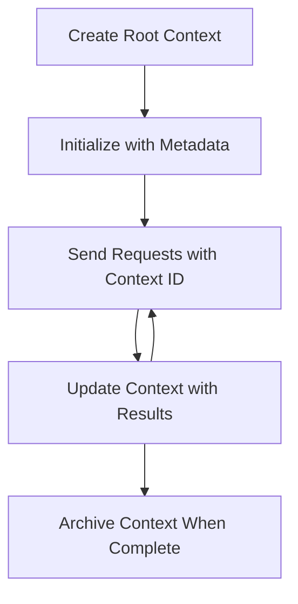

<!--
CO_OP_TRANSLATOR_METADATA:
{
  "original_hash": "ebdb86db46113f1cbd59ce4c74caaa79",
  "translation_date": "2025-07-16T23:35:55+00:00",
  "source_file": "05-AdvancedTopics/mcp-root-contexts/README.md",
  "language_code": "ar"
}
-->
# سياقات الجذر في MCP

تُعد سياقات الجذر مفهومًا أساسيًا في بروتوكول سياق النموذج، حيث توفر طبقة دائمة للحفاظ على سجل المحادثة والحالة المشتركة عبر عدة طلبات وجلسات.

## المقدمة

في هذا الدرس، سنستعرض كيفية إنشاء وإدارة واستخدام سياقات الجذر في MCP.

## أهداف التعلم

بنهاية هذا الدرس، ستكون قادرًا على:

- فهم الغرض والتركيب الخاص بسياقات الجذر  
- إنشاء وإدارة سياقات الجذر باستخدام مكتبات عميل MCP  
- تنفيذ سياقات الجذر في تطبيقات .NET وJava وJavaScript وPython  
- استخدام سياقات الجذر للمحادثات متعددة الأدوار وإدارة الحالة  
- تطبيق أفضل الممارسات لإدارة سياقات الجذر  

## فهم سياقات الجذر

تعمل سياقات الجذر كحاويات تحتفظ بتاريخ وحالة سلسلة من التفاعلات المرتبطة. وهي تتيح:

- **استمرارية المحادثة**: الحفاظ على محادثات متعددة الأدوار متماسكة  
- **إدارة الذاكرة**: تخزين واسترجاع المعلومات عبر التفاعلات  
- **إدارة الحالة**: تتبع التقدم في سير العمل المعقد  
- **مشاركة السياق**: السماح لعدة عملاء بالوصول إلى نفس حالة المحادثة  

في MCP، تتميز سياقات الجذر بالخصائص التالية:

- لكل سياق جذر معرف فريد  
- يمكن أن تحتوي على سجل المحادثة، تفضيلات المستخدم، وبيانات وصفية أخرى  
- يمكن إنشاؤها والوصول إليها وأرشفتها حسب الحاجة  
- تدعم تحكمًا دقيقًا في الوصول والصلاحيات  

## دورة حياة سياق الجذر



## العمل مع سياقات الجذر

فيما يلي مثال على كيفية إنشاء وإدارة سياقات الجذر.

### تنفيذ C#

```csharp
// .NET Example: Root Context Management
using Microsoft.Mcp.Client;
using System;
using System.Threading.Tasks;
using System.Collections.Generic;

public class RootContextExample
{
    private readonly IMcpClient _client;
    private readonly IRootContextManager _contextManager;
    
    public RootContextExample(IMcpClient client, IRootContextManager contextManager)
    {
        _client = client;
        _contextManager = contextManager;
    }
    
    public async Task DemonstrateRootContextAsync()
    {
        // 1. Create a new root context
        var contextResult = await _contextManager.CreateRootContextAsync(new RootContextCreateOptions
        {
            Name = "Customer Support Session",
            Metadata = new Dictionary<string, string>
            {
                ["CustomerName"] = "Acme Corporation",
                ["PriorityLevel"] = "High",
                ["Domain"] = "Cloud Services"
            }
        });
        
        string contextId = contextResult.ContextId;
        Console.WriteLine($"Created root context with ID: {contextId}");
        
        // 2. First interaction using the context
        var response1 = await _client.SendPromptAsync(
            "I'm having issues scaling my web service deployment in the cloud.", 
            new SendPromptOptions { RootContextId = contextId }
        );
        
        Console.WriteLine($"First response: {response1.GeneratedText}");
        
        // Second interaction - the model will have access to the previous conversation
        var response2 = await _client.SendPromptAsync(
            "Yes, we're using containerized deployments with Kubernetes.", 
            new SendPromptOptions { RootContextId = contextId }
        );
        
        Console.WriteLine($"Second response: {response2.GeneratedText}");
        
        // 3. Add metadata to the context based on conversation
        await _contextManager.UpdateContextMetadataAsync(contextId, new Dictionary<string, string>
        {
            ["TechnicalEnvironment"] = "Kubernetes",
            ["IssueType"] = "Scaling"
        });
        
        // 4. Get context information
        var contextInfo = await _contextManager.GetRootContextInfoAsync(contextId);
        
        Console.WriteLine("Context Information:");
        Console.WriteLine($"- Name: {contextInfo.Name}");
        Console.WriteLine($"- Created: {contextInfo.CreatedAt}");
        Console.WriteLine($"- Messages: {contextInfo.MessageCount}");
        
        // 5. When the conversation is complete, archive the context
        await _contextManager.ArchiveRootContextAsync(contextId);
        Console.WriteLine($"Archived context {contextId}");
    }
}
```

في الكود السابق قمنا بـ:

1. إنشاء سياق جذر لجلسة دعم العملاء.  
2. إرسال عدة رسائل ضمن ذلك السياق، مما يسمح للنموذج بالحفاظ على الحالة.  
3. تحديث السياق بالبيانات الوصفية ذات الصلة بناءً على المحادثة.  
4. استرجاع معلومات السياق لفهم تاريخ المحادثة.  
5. أرشفة السياق عند اكتمال المحادثة.  

## مثال: تنفيذ سياق جذر لتحليل مالي

في هذا المثال، سننشئ سياق جذر لجلسة تحليل مالي، موضحين كيفية الحفاظ على الحالة عبر عدة تفاعلات.

### تنفيذ Java

```java
// Java Example: Root Context Implementation
package com.example.mcp.contexts;

import com.mcp.client.McpClient;
import com.mcp.client.ContextManager;
import com.mcp.models.RootContext;
import com.mcp.models.McpResponse;

import java.util.HashMap;
import java.util.Map;
import java.util.UUID;

public class RootContextsDemo {
    private final McpClient client;
    private final ContextManager contextManager;
    
    public RootContextsDemo(String serverUrl) {
        this.client = new McpClient.Builder()
            .setServerUrl(serverUrl)
            .build();
            
        this.contextManager = new ContextManager(client);
    }
    
    public void demonstrateRootContext() throws Exception {
        // Create context metadata
        Map<String, String> metadata = new HashMap<>();
        metadata.put("projectName", "Financial Analysis");
        metadata.put("userRole", "Financial Analyst");
        metadata.put("dataSource", "Q1 2025 Financial Reports");
        
        // 1. Create a new root context
        RootContext context = contextManager.createRootContext("Financial Analysis Session", metadata);
        String contextId = context.getId();
        
        System.out.println("Created context: " + contextId);
        
        // 2. First interaction
        McpResponse response1 = client.sendPrompt(
            "Analyze the trends in Q1 financial data for our technology division",
            contextId
        );
        
        System.out.println("First response: " + response1.getGeneratedText());
        
        // 3. Update context with important information gained from response
        contextManager.addContextMetadata(contextId, 
            Map.of("identifiedTrend", "Increasing cloud infrastructure costs"));
        
        // Second interaction - using the same context
        McpResponse response2 = client.sendPrompt(
            "What's driving the increase in cloud infrastructure costs?",
            contextId
        );
        
        System.out.println("Second response: " + response2.getGeneratedText());
        
        // 4. Generate a summary of the analysis session
        McpResponse summaryResponse = client.sendPrompt(
            "Summarize our analysis of the technology division financials in 3-5 key points",
            contextId
        );
        
        // Store the summary in context metadata
        contextManager.addContextMetadata(contextId, 
            Map.of("analysisSummary", summaryResponse.getGeneratedText()));
            
        // Get updated context information
        RootContext updatedContext = contextManager.getRootContext(contextId);
        
        System.out.println("Context Information:");
        System.out.println("- Created: " + updatedContext.getCreatedAt());
        System.out.println("- Last Updated: " + updatedContext.getLastUpdatedAt());
        System.out.println("- Analysis Summary: " + 
            updatedContext.getMetadata().get("analysisSummary"));
            
        // 5. Archive context when done
        contextManager.archiveContext(contextId);
        System.out.println("Context archived");
    }
}
```

في الكود السابق قمنا بـ:

1. إنشاء سياق جذر لجلسة تحليل مالي.  
2. إرسال عدة رسائل ضمن ذلك السياق، مما يسمح للنموذج بالحفاظ على الحالة.  
3. تحديث السياق بالبيانات الوصفية ذات الصلة بناءً على المحادثة.  
4. توليد ملخص لجلسة التحليل وتخزينه في البيانات الوصفية للسياق.  
5. أرشفة السياق عند اكتمال المحادثة.  

## مثال: إدارة سياق الجذر

إدارة سياقات الجذر بشكل فعال أمر حيوي للحفاظ على سجل المحادثة والحالة. فيما يلي مثال على كيفية تنفيذ إدارة سياق الجذر.

### تنفيذ JavaScript

```javascript
// JavaScript Example: Managing MCP Root Contexts
const { McpClient, RootContextManager } = require('@mcp/client');

class ContextSession {
  constructor(serverUrl, apiKey = null) {
    // Initialize the MCP client
    this.client = new McpClient({
      serverUrl,
      apiKey
    });
    
    // Initialize context manager
    this.contextManager = new RootContextManager(this.client);
  }
  
  /**
   * Create a new conversation context
   * @param {string} sessionName - Name of the conversation session
   * @param {Object} metadata - Additional metadata for the context
   * @returns {Promise<string>} - Context ID
   */
  async createConversationContext(sessionName, metadata = {}) {
    try {
      const contextResult = await this.contextManager.createRootContext({
        name: sessionName,
        metadata: {
          ...metadata,
          createdAt: new Date().toISOString(),
          status: 'active'
        }
      });
      
      console.log(`Created root context '${sessionName}' with ID: ${contextResult.id}`);
      return contextResult.id;
    } catch (error) {
      console.error('Error creating root context:', error);
      throw error;
    }
  }
  
  /**
   * Send a message in an existing context
   * @param {string} contextId - The root context ID
   * @param {string} message - The user's message
   * @param {Object} options - Additional options
   * @returns {Promise<Object>} - Response data
   */
  async sendMessage(contextId, message, options = {}) {
    try {
      // Send the message using the specified context
      const response = await this.client.sendPrompt(message, {
        rootContextId: contextId,
        temperature: options.temperature || 0.7,
        allowedTools: options.allowedTools || []
      });
      
      // Optionally store important insights from the conversation
      if (options.storeInsights) {
        await this.storeConversationInsights(contextId, message, response.generatedText);
      }
      
      return {
        message: response.generatedText,
        toolCalls: response.toolCalls || [],
        contextId
      };
    } catch (error) {
      console.error(`Error sending message in context ${contextId}:`, error);
      throw error;
    }
  }
  
  /**
   * Store important insights from a conversation
   * @param {string} contextId - The root context ID
   * @param {string} userMessage - User's message
   * @param {string} aiResponse - AI's response
   */
  async storeConversationInsights(contextId, userMessage, aiResponse) {
    try {
      // Extract potential insights (in a real app, this would be more sophisticated)
      const combinedText = userMessage + "\n" + aiResponse;
      
      // Simple heuristic to identify potential insights
      const insightWords = ["important", "key point", "remember", "significant", "crucial"];
      
      const potentialInsights = combinedText
        .split(".")
        .filter(sentence => 
          insightWords.some(word => sentence.toLowerCase().includes(word))
        )
        .map(sentence => sentence.trim())
        .filter(sentence => sentence.length > 10);
      
      // Store insights in context metadata
      if (potentialInsights.length > 0) {
        const insights = {};
        potentialInsights.forEach((insight, index) => {
          insights[`insight_${Date.now()}_${index}`] = insight;
        });
        
        await this.contextManager.updateContextMetadata(contextId, insights);
        console.log(`Stored ${potentialInsights.length} insights in context ${contextId}`);
      }
    } catch (error) {
      console.warn('Error storing conversation insights:', error);
      // Non-critical error, so just log warning
    }
  }
  
  /**
   * Get summary information about a context
   * @param {string} contextId - The root context ID
   * @returns {Promise<Object>} - Context information
   */
  async getContextInfo(contextId) {
    try {
      const contextInfo = await this.contextManager.getContextInfo(contextId);
      
      return {
        id: contextInfo.id,
        name: contextInfo.name,
        created: new Date(contextInfo.createdAt).toLocaleString(),
        lastUpdated: new Date(contextInfo.lastUpdatedAt).toLocaleString(),
        messageCount: contextInfo.messageCount,
        metadata: contextInfo.metadata,
        status: contextInfo.status
      };
    } catch (error) {
      console.error(`Error getting context info for ${contextId}:`, error);
      throw error;
    }
  }
  
  /**
   * Generate a summary of the conversation in a context
   * @param {string} contextId - The root context ID
   * @returns {Promise<string>} - Generated summary
   */
  async generateContextSummary(contextId) {
    try {
      // Ask the model to generate a summary of the conversation so far
      const response = await this.client.sendPrompt(
        "Please summarize our conversation so far in 3-4 sentences, highlighting the main points discussed.",
        { rootContextId: contextId, temperature: 0.3 }
      );
      
      // Store the summary in context metadata
      await this.contextManager.updateContextMetadata(contextId, {
        conversationSummary: response.generatedText,
        summarizedAt: new Date().toISOString()
      });
      
      return response.generatedText;
    } catch (error) {
      console.error(`Error generating context summary for ${contextId}:`, error);
      throw error;
    }
  }
  
  /**
   * Archive a context when it's no longer needed
   * @param {string} contextId - The root context ID
   * @returns {Promise<Object>} - Result of the archive operation
   */
  async archiveContext(contextId) {
    try {
      // Generate a final summary before archiving
      const summary = await this.generateContextSummary(contextId);
      
      // Archive the context
      await this.contextManager.archiveContext(contextId);
      
      return {
        status: "archived",
        contextId,
        summary
      };
    } catch (error) {
      console.error(`Error archiving context ${contextId}:`, error);
      throw error;
    }
  }
}

// Example usage
async function demonstrateContextSession() {
  const session = new ContextSession('https://mcp-server-example.com');
  
  try {
    // 1. Create a new context for a product support conversation
    const contextId = await session.createConversationContext(
      'Product Support - Database Performance',
      {
        customer: 'Globex Corporation',
        product: 'Enterprise Database',
        severity: 'Medium',
        supportAgent: 'AI Assistant'
      }
    );
    
    // 2. First message in the conversation
    const response1 = await session.sendMessage(
      contextId,
      "I'm experiencing slow query performance on our database cluster after the latest update.",
      { storeInsights: true }
    );
    console.log('Response 1:', response1.message);
    
    // Follow-up message in the same context
    const response2 = await session.sendMessage(
      contextId,
      "Yes, we've already checked the indexes and they seem to be properly configured.",
      { storeInsights: true }
    );
    console.log('Response 2:', response2.message);
    
    // 3. Get information about the context
    const contextInfo = await session.getContextInfo(contextId);
    console.log('Context Information:', contextInfo);
    
    // 4. Generate and display conversation summary
    const summary = await session.generateContextSummary(contextId);
    console.log('Conversation Summary:', summary);
    
    // 5. Archive the context when done
    const archiveResult = await session.archiveContext(contextId);
    console.log('Archive Result:', archiveResult);
    
    // 6. Handle any errors gracefully
  } catch (error) {
    console.error('Error in context session demonstration:', error);
  }
}

demonstrateContextSession();
```

في الكود السابق قمنا بـ:

1. إنشاء سياق جذر لمحادثة دعم المنتج باستخدام الدالة `createConversationContext`. في هذه الحالة، السياق يتعلق بمشاكل أداء قاعدة البيانات.  
2. إرسال عدة رسائل ضمن ذلك السياق، مما يسمح للنموذج بالحفاظ على الحالة باستخدام الدالة `sendMessage`. الرسائل المرسلة تتعلق بأداء الاستعلام البطيء وتكوين الفهرس.  
3. تحديث السياق بالبيانات الوصفية ذات الصلة بناءً على المحادثة.  
4. توليد ملخص للمحادثة وتخزينه في البيانات الوصفية للسياق باستخدام الدالة `generateContextSummary`.  
5. أرشفة السياق عند اكتمال المحادثة باستخدام الدالة `archiveContext`.  
6. التعامل مع الأخطاء بسلاسة لضمان المتانة.  

## سياق الجذر للمساعدة متعددة الأدوار

في هذا المثال، سننشئ سياق جذر لجلسة مساعدة متعددة الأدوار، موضحين كيفية الحفاظ على الحالة عبر عدة تفاعلات.

### تنفيذ Python

```python
# Python Example: Root Context for Multi-Turn Assistance
import asyncio
from datetime import datetime
from mcp_client import McpClient, RootContextManager

class AssistantSession:
    def __init__(self, server_url, api_key=None):
        self.client = McpClient(server_url=server_url, api_key=api_key)
        self.context_manager = RootContextManager(self.client)
    
    async def create_session(self, name, user_info=None):
        """Create a new root context for an assistant session"""
        metadata = {
            "session_type": "assistant",
            "created_at": datetime.now().isoformat(),
        }
        
        # Add user information if provided
        if user_info:
            metadata.update({f"user_{k}": v for k, v in user_info.items()})
            
        # Create the root context
        context = await self.context_manager.create_root_context(name, metadata)
        return context.id
    
    async def send_message(self, context_id, message, tools=None):
        """Send a message within a root context"""
        # Create options with context ID
        options = {
            "root_context_id": context_id
        }
        
        # Add tools if specified
        if tools:
            options["allowed_tools"] = tools
        
        # Send the prompt within the context
        response = await self.client.send_prompt(message, options)
        
        # Update context metadata with conversation progress
        await self.context_manager.update_context_metadata(
            context_id,
            {
                f"message_{datetime.now().timestamp()}": message[:50] + "...",
                "last_interaction": datetime.now().isoformat()
            }
        )
        
        return response
    
    async def get_conversation_history(self, context_id):
        """Retrieve conversation history from a context"""
        context_info = await self.context_manager.get_context_info(context_id)
        messages = await self.client.get_context_messages(context_id)
        
        return {
            "context_info": context_info,
            "messages": messages
        }
    
    async def end_session(self, context_id):
        """End an assistant session by archiving the context"""
        # Generate a summary prompt first
        summary_response = await self.client.send_prompt(
            "Please summarize our conversation and any key points or decisions made.",
            {"root_context_id": context_id}
        )
        
        # Store summary in metadata
        await self.context_manager.update_context_metadata(
            context_id,
            {
                "summary": summary_response.generated_text,
                "ended_at": datetime.now().isoformat(),
                "status": "completed"
            }
        )
        
        # Archive the context
        await self.context_manager.archive_context(context_id)
        
        return {
            "status": "completed",
            "summary": summary_response.generated_text
        }

# Example usage
async def demo_assistant_session():
    assistant = AssistantSession("https://mcp-server-example.com")
    
    # 1. Create session
    context_id = await assistant.create_session(
        "Technical Support Session",
        {"name": "Alex", "technical_level": "advanced", "product": "Cloud Services"}
    )
    print(f"Created session with context ID: {context_id}")
    
    # 2. First interaction
    response1 = await assistant.send_message(
        context_id, 
        "I'm having trouble with the auto-scaling feature in your cloud platform.",
        ["documentation_search", "diagnostic_tool"]
    )
    print(f"Response 1: {response1.generated_text}")
    
    # Second interaction in the same context
    response2 = await assistant.send_message(
        context_id,
        "Yes, I've already checked the configuration settings you mentioned, but it's still not working."
    )
    print(f"Response 2: {response2.generated_text}")
    
    # 3. Get history
    history = await assistant.get_conversation_history(context_id)
    print(f"Session has {len(history['messages'])} messages")
    
    # 4. End session
    end_result = await assistant.end_session(context_id)
    print(f"Session ended with summary: {end_result['summary']}")

if __name__ == "__main__":
    asyncio.run(demo_assistant_session())
```

في الكود السابق قمنا بـ:

1. إنشاء سياق جذر لجلسة دعم فني باستخدام الدالة `create_session`. يتضمن السياق معلومات المستخدم مثل الاسم والمستوى الفني.  
2. إرسال عدة رسائل ضمن ذلك السياق، مما يسمح للنموذج بالحفاظ على الحالة باستخدام الدالة `send_message`. الرسائل المرسلة تتعلق بمشاكل في ميزة التوسع التلقائي.  
3. استرجاع سجل المحادثة باستخدام الدالة `get_conversation_history`، التي توفر معلومات السياق والرسائل.  
4. إنهاء الجلسة بأرشفة السياق وتوليد ملخص باستخدام الدالة `end_session`. يلتقط الملخص النقاط الرئيسية من المحادثة.  

## أفضل الممارسات لسياق الجذر

إليك بعض أفضل الممارسات لإدارة سياقات الجذر بفعالية:

- **إنشاء سياقات مركزة**: أنشئ سياقات جذر منفصلة لأغراض أو مجالات محادثة مختلفة للحفاظ على الوضوح.  
- **تحديد سياسات انتهاء الصلاحية**: طبق سياسات لأرشفة أو حذف السياقات القديمة لإدارة التخزين والامتثال لسياسات الاحتفاظ بالبيانات.  
- **تخزين البيانات الوصفية ذات الصلة**: استخدم البيانات الوصفية للسياق لتخزين معلومات مهمة عن المحادثة قد تكون مفيدة لاحقًا.  
- **استخدام معرفات السياق بشكل متسق**: بمجرد إنشاء السياق، استخدم معرفه بشكل متسق لجميع الطلبات ذات الصلة للحفاظ على الاستمرارية.  
- **توليد الملخصات**: عندما يكبر حجم السياق، فكر في توليد ملخصات لالتقاط المعلومات الأساسية مع إدارة حجم السياق.  
- **تطبيق تحكم الوصول**: في الأنظمة متعددة المستخدمين، طبق ضوابط وصول مناسبة لضمان خصوصية وأمان سياقات المحادثة.  
- **التعامل مع قيود السياق**: كن على دراية بقيود حجم السياق وطبق استراتيجيات للتعامل مع المحادثات الطويلة جدًا.  
- **الأرشفة عند الانتهاء**: قم بأرشفة السياقات عند اكتمال المحادثات لتحرير الموارد مع الحفاظ على سجل المحادثة.  

## ما التالي

- [5.5 التوجيه](../mcp-routing/README.md)

**إخلاء مسؤولية**:  
تمت ترجمة هذا المستند باستخدام خدمة الترجمة الآلية [Co-op Translator](https://github.com/Azure/co-op-translator). بينما نسعى لتحقيق الدقة، يرجى العلم أن الترجمات الآلية قد تحتوي على أخطاء أو عدم دقة. يجب اعتبار المستند الأصلي بلغته الأصلية المصدر الموثوق به. للمعلومات الهامة، يُنصح بالاعتماد على الترجمة البشرية المهنية. نحن غير مسؤولين عن أي سوء فهم أو تفسير ناتج عن استخدام هذه الترجمة.