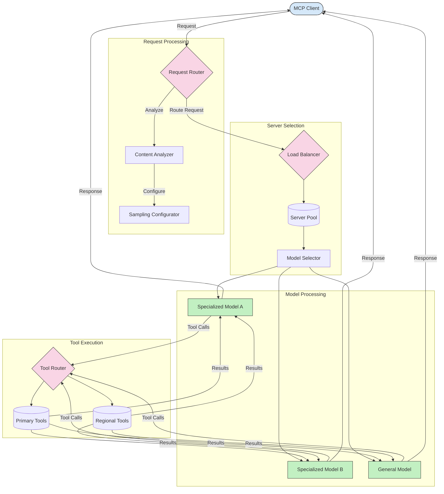

<!--
CO_OP_TRANSLATOR_METADATA:
{
  "original_hash": "af40eab7bd6ebf7e607f982a5506a5b5",
  "translation_date": "2025-06-12T23:04:36+00:00",
  "source_file": "05-AdvancedTopics/mcp-routing/README.md",
  "language_code": "ar"
}
-->
## هندسة المعاينة والتوجيه في MCP

تُعد المعاينة مكونًا حيويًا في بروتوكول سياق النموذج (MCP) يتيح معالجة الطلبات وتوجيهها بكفاءة. تتضمن تحليل الطلبات الواردة لتحديد النموذج أو الخدمة الأنسب للتعامل معها، بناءً على معايير مختلفة مثل نوع المحتوى، وسياق المستخدم، وحمل النظام.

يمكن دمج المعاينة والتوجيه لإنشاء بنية قوية تُحسن من استغلال الموارد وتضمن توفرًا عاليًا. تُستخدم عملية المعاينة لتصنيف الطلبات، في حين يقوم التوجيه بتوجيهها إلى النماذج أو الخدمات المناسبة.

يوضح الرسم البياني أدناه كيف تعمل المعاينة والتوجيه معًا في بنية MCP شاملة:

## ما التالي

- [5.6 المعاينة](../mcp-sampling/README.md)

**تنويه**:  
تمت ترجمة هذا المستند باستخدام خدمة الترجمة الآلية [Co-op Translator](https://github.com/Azure/co-op-translator). بينما نسعى لتحقيق الدقة، يرجى العلم أن الترجمات الآلية قد تحتوي على أخطاء أو عدم دقة. يجب اعتبار المستند الأصلي بلغته الأصلية المصدر الموثوق. للمعلومات الهامة، يُنصح بالاستعانة بترجمة بشرية محترفة. نحن غير مسؤولين عن أي سوء فهم أو تفسيرات خاطئة ناتجة عن استخدام هذه الترجمة.