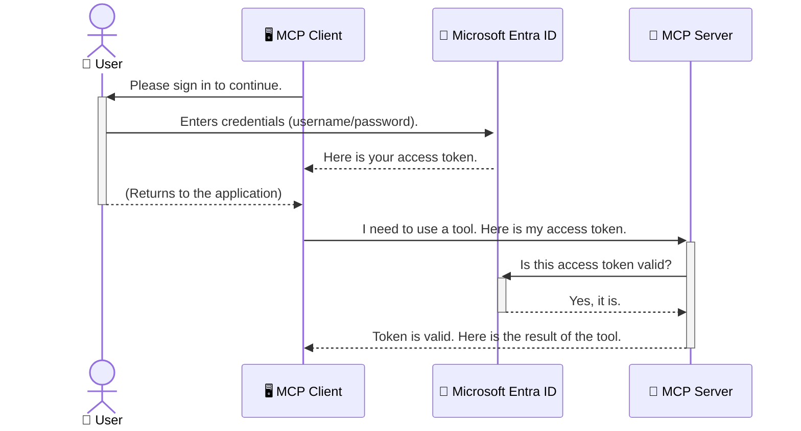

<!--
CO_OP_TRANSLATOR_METADATA:
{
  "original_hash": "6e562d7e5a77c8982da4aa8f762ad1d8",
  "translation_date": "2025-07-14T02:48:53+00:00",
  "source_file": "05-AdvancedTopics/mcp-security-entra/README.md",
  "language_code": "ar"
}
-->
# تأمين سير عمل الذكاء الاصطناعي: مصادقة Entra ID لخوادم بروتوكول سياق النموذج

## المقدمة  
تأمين خادم Model Context Protocol (MCP) الخاص بك لا يقل أهمية عن إغلاق باب منزلك الأمامي. ترك خادم MCP مفتوحًا يعرض أدواتك وبياناتك للوصول غير المصرح به، مما قد يؤدي إلى اختراقات أمنية. توفر Microsoft Entra ID حلاً قوياً لإدارة الهوية والوصول قائمًا على السحابة، مما يساعد على ضمان أن المستخدمين والتطبيقات المصرح لهم فقط يمكنهم التفاعل مع خادم MCP الخاص بك. في هذا القسم، ستتعلم كيفية حماية سير عمل الذكاء الاصطناعي الخاص بك باستخدام مصادقة Entra ID.

## أهداف التعلم  
بنهاية هذا القسم، ستكون قادرًا على:

- فهم أهمية تأمين خوادم MCP.  
- شرح أساسيات Microsoft Entra ID ومصادقة OAuth 2.0.  
- التمييز بين العملاء العامين والسرّيين.  
- تنفيذ مصادقة Entra ID في سيناريوهات خادم MCP المحلية (العميل العام) والبعيدة (العميل السري).  
- تطبيق أفضل ممارسات الأمان عند تطوير سير عمل الذكاء الاصطناعي.

## الأمان وMCP  

تمامًا كما لا تترك باب منزلك الأمامي مفتوحًا، لا يجب أن تترك خادم MCP الخاص بك متاحًا لأي شخص. تأمين سير عمل الذكاء الاصطناعي ضروري لبناء تطبيقات قوية وموثوقة وآمنة. سيقدم لك هذا الفصل كيفية استخدام Microsoft Entra ID لتأمين خوادم MCP الخاصة بك، مما يضمن أن المستخدمين والتطبيقات المصرح لهم فقط يمكنهم التفاعل مع أدواتك وبياناتك.

## لماذا الأمان مهم لخوادم MCP  

تخيل أن خادم MCP الخاص بك يحتوي على أداة يمكنها إرسال رسائل بريد إلكتروني أو الوصول إلى قاعدة بيانات العملاء. خادم غير مؤمن يعني أن أي شخص يمكنه استخدام تلك الأداة، مما يؤدي إلى وصول غير مصرح به للبيانات، أو إرسال رسائل مزعجة، أو أنشطة خبيثة أخرى.

من خلال تنفيذ المصادقة، تضمن أن كل طلب إلى خادمك يتم التحقق منه، مؤكدًا هوية المستخدم أو التطبيق الذي يرسل الطلب. هذه هي الخطوة الأولى والأهم في تأمين سير عمل الذكاء الاصطناعي الخاص بك.

## مقدمة إلى Microsoft Entra ID  

[**Microsoft Entra ID**](https://adoption.microsoft.com/microsoft-security/entra/) هي خدمة إدارة هوية ووصول قائمة على السحابة. فكر فيها كحارس أمني شامل لتطبيقاتك. تتولى عملية التحقق المعقدة لهويات المستخدمين (المصادقة) وتحديد ما يُسمح لهم به (التفويض).

باستخدام Entra ID، يمكنك:

- تمكين تسجيل دخول آمن للمستخدمين.  
- حماية واجهات برمجة التطبيقات والخدمات.  
- إدارة سياسات الوصول من موقع مركزي.

بالنسبة لخوادم MCP، توفر Entra ID حلاً قويًا وموثوقًا على نطاق واسع لإدارة من يمكنه الوصول إلى قدرات خادمك.

---

## فهم السحر: كيف تعمل مصادقة Entra ID  

تستخدم Entra ID معايير مفتوحة مثل **OAuth 2.0** للتعامل مع المصادقة. رغم أن التفاصيل قد تكون معقدة، فإن المفهوم الأساسي بسيط ويمكن فهمه من خلال تشبيه.

### مقدمة بسيطة إلى OAuth 2.0: مفتاح خدمة صف السيارات  

فكر في OAuth 2.0 كخدمة صف سيارات لسيارتك. عندما تصل إلى مطعم، لا تعطي صف السيارات مفتاحك الرئيسي. بدلاً من ذلك، تعطيه **مفتاح خدمة صف السيارات** الذي له صلاحيات محدودة — يمكنه تشغيل السيارة وقفل الأبواب، لكنه لا يستطيع فتح الصندوق الخلفي أو الدرج الجانبي.

في هذا التشبيه:

- **أنت** هو **المستخدم**.  
- **سيارتك** هي **خادم MCP** مع أدواته وبياناته القيمة.  
- **خدمة صف السيارات** هي **Microsoft Entra ID**.  
- **موظف الموقف** هو **عميل MCP** (التطبيق الذي يحاول الوصول إلى الخادم).  
- **مفتاح خدمة صف السيارات** هو **رمز الوصول (Access Token)**.

رمز الوصول هو سلسلة نصية آمنة يتلقاها عميل MCP من Entra ID بعد تسجيل دخولك. ثم يقدم العميل هذا الرمز إلى خادم MCP مع كل طلب. يمكن للخادم التحقق من الرمز للتأكد من أن الطلب شرعي وأن العميل لديه الأذونات اللازمة، كل ذلك دون الحاجة إلى التعامل مع بيانات اعتمادك الحقيقية (مثل كلمة المرور).

### تدفق المصادقة  

إليك كيف يعمل هذا عمليًا:



### تقديم مكتبة مصادقة Microsoft (MSAL)  

قبل الغوص في الكود، من المهم تقديم مكون رئيسي ستراه في الأمثلة: **مكتبة مصادقة Microsoft (MSAL)**.

MSAL هي مكتبة طورتها Microsoft تسهل على المطورين التعامل مع المصادقة. بدلاً من كتابة كل الكود المعقد لإدارة رموز الأمان، وتسجيل الدخول، وتجديد الجلسات، تتولى MSAL هذه المهام الثقيلة.

استخدام مكتبة مثل MSAL موصى به بشدة لأنها:

- **آمنة:** تنفذ بروتوكولات ومعايير أمان معتمدة، مما يقلل من مخاطر الثغرات في الكود.  
- **تبسط التطوير:** تخفي تعقيدات بروتوكولات OAuth 2.0 وOpenID Connect، مما يسمح لك بإضافة مصادقة قوية لتطبيقك ببضع أسطر فقط.  
- **مدعومة:** تقوم Microsoft بصيانتها وتحديثها باستمرار لمواجهة التهديدات الأمنية الجديدة وتغييرات المنصات.

تدعم MSAL مجموعة واسعة من اللغات وأطر العمل، بما في ذلك .NET، JavaScript/TypeScript، Python، Java، Go، ومنصات الهواتف المحمولة مثل iOS وAndroid. هذا يعني أنه يمكنك استخدام نفس أنماط المصادقة عبر كامل بيئة التكنولوجيا الخاصة بك.

لمعرفة المزيد عن MSAL، يمكنك الاطلاع على الوثائق الرسمية [نظرة عامة على MSAL](https://learn.microsoft.com/entra/identity-platform/msal-overview).

---

## تأمين خادم MCP الخاص بك باستخدام Entra ID: دليل خطوة بخطوة  

الآن، دعنا نستعرض كيفية تأمين خادم MCP محلي (يتواصل عبر `stdio`) باستخدام Entra ID. يستخدم هذا المثال **عميلًا عامًا**، وهو مناسب للتطبيقات التي تعمل على جهاز المستخدم، مثل تطبيق سطح المكتب أو خادم تطوير محلي.

### السيناريو 1: تأمين خادم MCP محلي (مع عميل عام)  

في هذا السيناريو، سننظر في خادم MCP يعمل محليًا، يتواصل عبر `stdio`، ويستخدم Entra ID لمصادقة المستخدم قبل السماح بالوصول إلى أدواته. سيكون لدى الخادم أداة واحدة تسترجع معلومات ملف المستخدم من Microsoft Graph API.

#### 1. إعداد التطبيق في Entra ID  

قبل كتابة أي كود، تحتاج إلى تسجيل تطبيقك في Microsoft Entra ID. هذا يُعلم Entra ID عن تطبيقك ويمنحه الإذن لاستخدام خدمة المصادقة.

1. انتقل إلى **[بوابة Microsoft Entra](https://entra.microsoft.com/)**.  
2. اذهب إلى **تسجيلات التطبيقات** وانقر على **تسجيل جديد**.  
3. امنح تطبيقك اسمًا (مثل "خادم MCP المحلي الخاص بي").  
4. بالنسبة لـ **أنواع الحسابات المدعومة**، اختر **الحسابات في هذا الدليل التنظيمي فقط**.  
5. يمكنك ترك **عنوان URI لإعادة التوجيه** فارغًا لهذا المثال.  
6. انقر على **تسجيل**.

بعد التسجيل، احتفظ بـ **معرف التطبيق (clientId)** و**معرف الدليل (tenantId)**. ستحتاج إليهما في الكود.

#### 2. الكود: شرح  

لننظر إلى الأجزاء الرئيسية من الكود التي تتعامل مع المصادقة. الكود الكامل لهذا المثال متاح في مجلد [Entra ID - Local - WAM](https://github.com/Azure-Samples/mcp-auth-servers/tree/main/src/entra-id-local-wam) في مستودع [mcp-auth-servers على GitHub](https://github.com/Azure-Samples/mcp-auth-servers).

**`AuthenticationService.cs`**

هذه الفئة مسؤولة عن التعامل مع Entra ID.

- **`CreateAsync`**: تهيئ `PublicClientApplication` من MSAL. يتم تكوينها باستخدام `clientId` و`tenantId` الخاصين بتطبيقك.  
- **`WithBroker`**: تتيح استخدام وسيط (مثل Windows Web Account Manager)، الذي يوفر تجربة تسجيل دخول موحدة أكثر أمانًا وسلاسة.  
- **`AcquireTokenAsync`**: هذه هي الطريقة الأساسية. تحاول أولاً الحصول على رمز بهدوء (أي بدون مطالبة المستخدم إذا كان لديه جلسة صالحة). إذا لم يكن بالإمكان الحصول على رمز بهدوء، ستطلب من المستخدم تسجيل الدخول بشكل تفاعلي.

```csharp
// Simplified for clarity
public static async Task<AuthenticationService> CreateAsync(ILogger<AuthenticationService> logger)
{
    var msalClient = PublicClientApplicationBuilder
        .Create(_clientId) // Your Application (client) ID
        .WithAuthority(AadAuthorityAudience.AzureAdMyOrg)
        .WithTenantId(_tenantId) // Your Directory (tenant) ID
        .WithBroker(new BrokerOptions(BrokerOptions.OperatingSystems.Windows))
        .Build();

    // ... cache registration ...

    return new AuthenticationService(logger, msalClient);
}

public async Task<string> AcquireTokenAsync()
{
    try
    {
        // Try silent authentication first
        var accounts = await _msalClient.GetAccountsAsync();
        var account = accounts.FirstOrDefault();

        AuthenticationResult? result = null;

        if (account != null)
        {
            result = await _msalClient.AcquireTokenSilent(_scopes, account).ExecuteAsync();
        }
        else
        {
            // If no account, or silent fails, go interactive
            result = await _msalClient.AcquireTokenInteractive(_scopes).ExecuteAsync();
        }

        return result.AccessToken;
    }
    catch (Exception ex)
    {
        _logger.LogError(ex, "An error occurred while acquiring the token.");
        throw; // Optionally rethrow the exception for higher-level handling
    }
}
```

**`Program.cs`**

هنا يتم إعداد خادم MCP ودمج خدمة المصادقة.

- **`AddSingleton<AuthenticationService>`**: يسجل `AuthenticationService` في حاوية حقن التبعيات، ليتم استخدامه من قبل أجزاء أخرى من التطبيق (مثل أداتنا).  
- أداة **`GetUserDetailsFromGraph`**: تتطلب مثيلًا من `AuthenticationService`. قبل أي شيء، تستدعي `authService.AcquireTokenAsync()` للحصول على رمز وصول صالح. إذا نجحت المصادقة، تستخدم الرمز لاستدعاء Microsoft Graph API وجلب تفاصيل المستخدم.

```csharp
// Simplified for clarity
[McpServerTool(Name = "GetUserDetailsFromGraph")]
public static async Task<string> GetUserDetailsFromGraph(
    AuthenticationService authService)
{
    try
    {
        // This will trigger the authentication flow
        var accessToken = await authService.AcquireTokenAsync();

        // Use the token to create a GraphServiceClient
        var graphClient = new GraphServiceClient(
            new BaseBearerTokenAuthenticationProvider(new TokenProvider(authService)));

        var user = await graphClient.Me.GetAsync();

        return System.Text.Json.JsonSerializer.Serialize(user);
    }
    catch (Exception ex)
    {
        return $"Error: {ex.Message}";
    }
}
```

#### 3. كيف يعمل كل شيء معًا  

1. عندما يحاول عميل MCP استخدام أداة `GetUserDetailsFromGraph`، تستدعي الأداة أولاً `AcquireTokenAsync`.  
2. تقوم `AcquireTokenAsync` بتحفيز مكتبة MSAL للتحقق من وجود رمز صالح.  
3. إذا لم يتم العثور على رمز، ستطلب MSAL، عبر الوسيط، من المستخدم تسجيل الدخول باستخدام حساب Entra ID الخاص به.  
4. بعد تسجيل الدخول، تصدر Entra ID رمز وصول.  
5. تستلم الأداة الرمز وتستخدمه لإجراء اتصال آمن إلى Microsoft Graph API.  
6. تُعاد تفاصيل المستخدم إلى عميل MCP.

تضمن هذه العملية أن المستخدمين المصادق عليهم فقط يمكنهم استخدام الأداة، مما يؤمن خادم MCP المحلي الخاص بك بفعالية.

### السيناريو 2: تأمين خادم MCP بعيد (مع عميل سري)  

عندما يعمل خادم MCP الخاص بك على جهاز بعيد (مثل خادم سحابي) ويتواصل عبر بروتوكول مثل HTTP Streaming، تختلف متطلبات الأمان. في هذه الحالة، يجب استخدام **عميل سري** و**تدفق رمز التفويض (Authorization Code Flow)**. هذه طريقة أكثر أمانًا لأن أسرار التطبيق لا تُعرض أبدًا في المتصفح.

يستخدم هذا المثال خادم MCP مبني على TypeScript يستخدم Express.js للتعامل مع طلبات HTTP.

#### 1. إعداد التطبيق في Entra ID  

الإعداد في Entra ID مشابه للعميل العام، لكن مع اختلاف رئيسي: تحتاج إلى إنشاء **سر عميل (client secret)**.

1. انتقل إلى **[بوابة Microsoft Entra](https://entra.microsoft.com/)**.  
2. في تسجيل تطبيقك، اذهب إلى تبويب **الشهادات والأسرار**.  
3. انقر على **سر عميل جديد**، أعطه وصفًا، ثم انقر على **إضافة**.  
4. **ملاحظة أمنية مهمة:** انسخ قيمة السر فورًا. لن تتمكن من رؤيتها مرة أخرى.  
5. تحتاج أيضًا إلى تكوين **عنوان URI لإعادة التوجيه**. اذهب إلى تبويب **المصادقة**، انقر على **إضافة منصة**، اختر **ويب**، وأدخل عنوان URI لإعادة التوجيه لتطبيقك (مثل `http://localhost:3001/auth/callback`).

> **⚠️ ملاحظة أمنية مهمة:** للتطبيقات الإنتاجية، توصي Microsoft بشدة باستخدام طرق مصادقة بدون أسرار مثل **Managed Identity** أو **Workload Identity Federation** بدلاً من أسرار العملاء. أسرار العملاء تشكل مخاطر أمنية لأنها قد تُكشف أو تُخترق. توفر الهويات المُدارة نهجًا أكثر أمانًا من خلال إزالة الحاجة لتخزين بيانات الاعتماد في الكود أو التكوين.  
>  
> لمزيد من المعلومات حول الهويات المُدارة وكيفية تنفيذها، راجع [نظرة عامة على الهويات المُدارة لموارد Azure](https://learn.microsoft.com/entra/identity/managed-identities-azure-resources/overview).

#### 2. الكود: شرح  

يستخدم هذا المثال نهجًا قائمًا على الجلسة. عند مصادقة المستخدم، يخزن الخادم رمز الوصول ورمز التحديث في الجلسة ويعطي المستخدم رمز جلسة. يُستخدم رمز الجلسة هذا للطلبات اللاحقة. الكود الكامل لهذا المثال متاح في مجلد [Entra ID - Confidential client](https://github.com/Azure-Samples/mcp-auth-servers/tree/main/src/entra-id-cca-session) في مستودع [mcp-auth-servers على GitHub](https://github.com/Azure-Samples/mcp-auth-servers).

**`Server.ts`**

يعد هذا الملف خادم Express وطبقة نقل MCP.

- **`requireBearerAuth`**: هذا ميدلوير يحمي نقاط النهاية `/sse` و`/message`. يتحقق من وجود رمز حامل صالح في رأس `Authorization` للطلب.  
- **`EntraIdServerAuthProvider`**: فئة مخصصة تنفذ واجهة `McpServerAuthorizationProvider`. مسؤولة عن التعامل مع تدفق OAuth 2.0.  
- **`/auth/callback`**: نقطة النهاية التي تتعامل مع إعادة التوجيه من Entra ID بعد مصادقة المستخدم. تقوم بتبديل رمز التفويض برمز وصول ورمز تحديث.

```typescript
// Simplified for clarity
const app = express();
const { server } = createServer();
const provider = new EntraIdServerAuthProvider();

// Protect the SSE endpoint
app.get("/sse", requireBearerAuth({
  provider,
  requiredScopes: ["User.Read"]
}), async (req, res) => {
  // ... connect to the transport ...
});

// Protect the message endpoint
app.post("/message", requireBearerAuth({
  provider,
  requiredScopes: ["User.Read"]
}), async (req, res) => {
  // ... handle the message ...
});

// Handle the OAuth 2.0 callback
app.get("/auth/callback", (req, res) => {
  provider.handleCallback(req.query.code, req.query.state)
    .then(result => {
      // ... handle success or failure ...
    });
});
```

**`Tools.ts`**

يحدد هذا الملف الأدوات التي يوفرها خادم MCP. أداة `getUserDetails` مشابهة للأداة في المثال السابق، لكنها تحصل على رمز الوصول من الجلسة.

```typescript
// Simplified for clarity
server.setRequestHandler(CallToolRequestSchema, async (request) => {
  const { name } = request.params;
  const context = request.params?.context as { token?: string } | undefined;
  const sessionToken = context?.token;

  if (name === ToolName.GET_USER_DETAILS) {
    if (!sessionToken) {
      throw new AuthenticationError("Authentication token is missing or invalid. Ensure the token is provided in the request context.");
    }

    // Get the Entra ID token from the session store
    const tokenData = tokenStore.getToken(sessionToken);
    const entraIdToken = tokenData.accessToken;

    const graphClient = Client.init({
      authProvider: (done) => {
        done(null, entraIdToken);
      }
    });

    const user = await graphClient.api('/me').get();

    // ... return user details ...
  }
});
```

**`auth/EntraIdServerAuthProvider.ts`**

تتعامل هذه الفئة مع المنطق الخاص بـ:

- إعادة توجيه المستخدم إلى صفحة تسجيل الدخول في Entra ID.  
- تبديل رمز التفويض برمز وصول.  
- تخزين الرموز في `tokenStore`.  
- تجديد رمز الوصول عند انتهاء صلاحيته.

#### 3. كيف يعمل كل شيء معًا  

1. عندما يحاول المستخدم الاتصال بخادم MCP لأول مرة، سيرى ميدلوير `requireBearerAuth` أنه لا يملك جلسة صالحة وسيعيد توجيهه إلى صفحة تسجيل الدخول في Entra ID.  
2. يقوم المستخدم بتسجيل الدخول باستخدام حساب Entra ID الخاص به.  
3. تعيد Entra ID توجيه المستخدم إلى نقطة النهاية `/auth/callback` مع رمز تفويض.
4. يقوم الخادم بتبادل الرمز للحصول على رمز وصول ورمز تحديث، ثم يخزنهما وينشئ رمز جلسة يتم إرساله إلى العميل.  
5. يمكن للعميل الآن استخدام رمز الجلسة هذا في رأس `Authorization` لجميع الطلبات المستقبلية إلى خادم MCP.  
6. عند استدعاء أداة `getUserDetails`، تستخدم رمز الجلسة للبحث عن رمز وصول Entra ID ثم تستخدمه لاستدعاء Microsoft Graph API.

هذا التدفق أكثر تعقيدًا من تدفق العميل العام، لكنه ضروري لنقاط النهاية التي تواجه الإنترنت. نظرًا لأن خوادم MCP البعيدة متاحة عبر الإنترنت العام، فهي تحتاج إلى تدابير أمان أقوى للحماية من الوصول غير المصرح به والهجمات المحتملة.

## أفضل ممارسات الأمان

- **استخدم HTTPS دائمًا**: قم بتشفير الاتصال بين العميل والخادم لحماية الرموز من الاعتراض.  
- **تطبيق التحكم في الوصول بناءً على الدور (RBAC)**: لا تتحقق فقط مما إذا كان المستخدم مصدقًا؛ بل تحقق مما هو مخول له القيام به. يمكنك تعريف الأدوار في Entra ID والتحقق منها في خادم MCP الخاص بك.  
- **المراقبة والتدقيق**: سجّل جميع أحداث المصادقة حتى تتمكن من اكتشاف النشاط المشبوه والاستجابة له.  
- **التعامل مع تحديد المعدل والحد من الطلبات**: تقوم Microsoft Graph وواجهات برمجة التطبيقات الأخرى بتطبيق تحديد المعدل لمنع سوء الاستخدام. نفذ منطق التراجع الأسي وإعادة المحاولة في خادم MCP الخاص بك للتعامل بسلاسة مع استجابات HTTP 429 (طلبات كثيرة جدًا). فكر في تخزين البيانات التي يتم الوصول إليها بشكل متكرر مؤقتًا لتقليل عدد استدعاءات API.  
- **تخزين الرموز بأمان**: خزّن رموز الوصول ورموز التحديث بشكل آمن. للتطبيقات المحلية، استخدم آليات التخزين الآمن للنظام. للتطبيقات الخادمة، فكر في استخدام التخزين المشفر أو خدمات إدارة المفاتيح الآمنة مثل Azure Key Vault.  
- **التعامل مع انتهاء صلاحية الرموز**: لرموز الوصول عمر محدود. نفذ تحديثًا تلقائيًا للرموز باستخدام رموز التحديث للحفاظ على تجربة مستخدم سلسة دون الحاجة لإعادة المصادقة.  
- **فكر في استخدام Azure API Management**: بينما يمنحك تنفيذ الأمان مباشرة في خادم MCP تحكمًا دقيقًا، يمكن لبوابات API مثل Azure API Management التعامل مع العديد من هذه القضايا الأمنية تلقائيًا، بما في ذلك المصادقة، التفويض، تحديد المعدل، والمراقبة. فهي توفر طبقة أمان مركزية تقع بين عملائك وخوادم MCP الخاصة بك. لمزيد من التفاصيل حول استخدام بوابات API مع MCP، راجع [Azure API Management Your Auth Gateway For MCP Servers](https://techcommunity.microsoft.com/blog/integrationsonazureblog/azure-api-management-your-auth-gateway-for-mcp-servers/4402690).

## النقاط الرئيسية

- تأمين خادم MCP الخاص بك أمر حيوي لحماية بياناتك وأدواتك.  
- يوفر Microsoft Entra ID حلاً قويًا وقابلًا للتوسع للمصادقة والتفويض.  
- استخدم **العميل العام** للتطبيقات المحلية و**العميل السري** للخوادم البعيدة.  
- يعد **تدفق رمز التفويض** الخيار الأكثر أمانًا لتطبيقات الويب.

## التمرين

1. فكر في خادم MCP قد تبنيه. هل سيكون خادمًا محليًا أم خادمًا بعيدًا؟  
2. بناءً على إجابتك، هل ستستخدم عميلًا عامًا أم سريًا؟  
3. ما الأذونات التي سيطلبها خادم MCP الخاص بك لأداء الإجراءات ضد Microsoft Graph؟

## التمارين العملية

### التمرين 1: تسجيل تطبيق في Entra ID  
انتقل إلى بوابة Microsoft Entra.  
سجل تطبيقًا جديدًا لخادم MCP الخاص بك.  
سجل معرف التطبيق (العميل) ومعرف الدليل (المستأجر).

### التمرين 2: تأمين خادم MCP محلي (عميل عام)  
- اتبع مثال الكود لدمج MSAL (مكتبة مصادقة Microsoft) لمصادقة المستخدم.  
- اختبر تدفق المصادقة من خلال استدعاء أداة MCP التي تجلب تفاصيل المستخدم من Microsoft Graph.

### التمرين 3: تأمين خادم MCP بعيد (عميل سري)  
- سجل عميلًا سريًا في Entra ID وأنشئ سر عميل.  
- قم بتكوين خادم MCP الخاص بك باستخدام Express.js لاستخدام تدفق رمز التفويض.  
- اختبر نقاط النهاية المحمية وتأكد من الوصول المعتمد على الرموز.

### التمرين 4: تطبيق أفضل ممارسات الأمان  
- فعّل HTTPS لخادمك المحلي أو البعيد.  
- نفذ التحكم في الوصول بناءً على الدور (RBAC) في منطق الخادم.  
- أضف التعامل مع انتهاء صلاحية الرموز وتخزين الرموز بأمان.

## الموارد

1. **توثيق نظرة عامة على MSAL**  
   تعرّف على كيفية تمكين مكتبة مصادقة Microsoft (MSAL) لاكتساب الرموز بأمان عبر المنصات:  
   [MSAL Overview on Microsoft Learn](https://learn.microsoft.com/en-gb/entra/msal/overview)

2. **مستودع GitHub Azure-Samples/mcp-auth-servers**  
   تطبيقات مرجعية لخوادم MCP توضح تدفقات المصادقة:  
   [Azure-Samples/mcp-auth-servers on GitHub](https://github.com/Azure-Samples/mcp-auth-servers)

3. **نظرة عامة على Managed Identities لموارد Azure**  
   فهم كيفية التخلص من الأسرار باستخدام الهويات المُدارة المعينة للنظام أو المستخدم:  
   [Managed Identities Overview on Microsoft Learn](https://learn.microsoft.com/en-us/entra/identity/managed-identities-azure-resources/)

4. **Azure API Management: بوابة المصادقة الخاصة بك لخوادم MCP**  
   نظرة معمقة على استخدام APIM كبوابة OAuth2 آمنة لخوادم MCP:  
   [Azure API Management Your Auth Gateway For MCP Servers](https://techcommunity.microsoft.com/blog/integrationsonazureblog/azure-api-management-your-auth-gateway-for-mcp-servers/4402690)

5. **مرجع أذونات Microsoft Graph**  
   قائمة شاملة بالأذونات المفوضة وتلك الخاصة بالتطبيق لـ Microsoft Graph:  
   [Microsoft Graph Permissions Reference](https://learn.microsoft.com/zh-tw/graph/permissions-reference)

## نتائج التعلم  
بعد إكمال هذا القسم، ستكون قادرًا على:

- شرح أهمية المصادقة لخوادم MCP وسير عمل الذكاء الاصطناعي.  
- إعداد وتكوين مصادقة Entra ID لكل من سيناريوهات خوادم MCP المحلية والبعيدة.  
- اختيار نوع العميل المناسب (عام أو سري) بناءً على نشر الخادم الخاص بك.  
- تنفيذ ممارسات الترميز الآمن، بما في ذلك تخزين الرموز والتفويض بناءً على الدور.  
- حماية خادم MCP وأدواته بثقة من الوصول غير المصرح به.

## ما التالي

- [5.13 تكامل بروتوكول سياق النموذج (MCP) مع Azure AI Foundry](../mcp-foundry-agent-integration/README.md)

**إخلاء المسؤولية**:  
تمت ترجمة هذا المستند باستخدام خدمة الترجمة الآلية [Co-op Translator](https://github.com/Azure/co-op-translator). بينما نسعى لتحقيق الدقة، يرجى العلم أن الترجمات الآلية قد تحتوي على أخطاء أو عدم دقة. يجب اعتبار المستند الأصلي بلغته الأصلية المصدر الموثوق به. للمعلومات الهامة، يُنصح بالاعتماد على الترجمة البشرية المهنية. نحن غير مسؤولين عن أي سوء فهم أو تفسير ناتج عن استخدام هذه الترجمة.