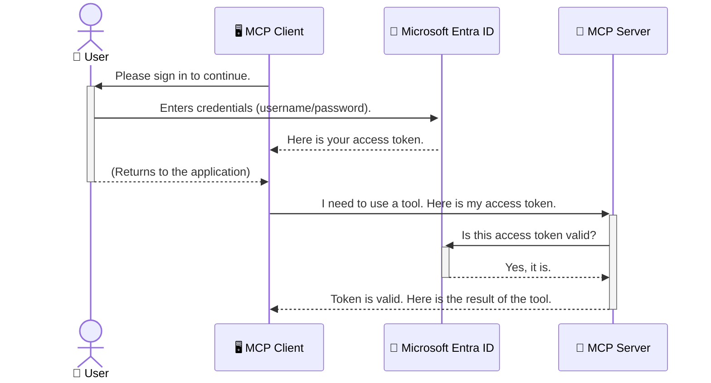

<!--
CO_OP_TRANSLATOR_METADATA:
{
  "original_hash": "9abe1d303ab126f9a8b87f03cebe5213",
  "translation_date": "2025-06-26T14:33:16+00:00",
  "source_file": "05-AdvancedTopics/mcp-security-entra/README.md",
  "language_code": "ar"
}
-->
# تأمين سير عمل الذكاء الاصطناعي: مصادقة Entra ID لخوادم بروتوكول سياق النموذج

## المقدمة  
تأمين خادم Model Context Protocol (MCP) الخاص بك لا يقل أهمية عن إغلاق باب منزلك الأمامي. ترك خادم MCP مفتوحًا يعرض أدواتك وبياناتك للوصول غير المصرح به، مما قد يؤدي إلى اختراقات أمنية. توفر Microsoft Entra ID حلاً قويًا لإدارة الهوية والوصول قائمًا على السحابة، يساعد في ضمان أن المستخدمين والتطبيقات المصرح لهم فقط هم من يمكنهم التفاعل مع خادم MCP الخاص بك. في هذا القسم، ستتعلم كيفية حماية سير عمل الذكاء الاصطناعي الخاص بك باستخدام مصادقة Entra ID.

## أهداف التعلم  
بنهاية هذا القسم، ستكون قادرًا على:

- فهم أهمية تأمين خوادم MCP.  
- شرح أساسيات Microsoft Entra ID ومصادقة OAuth 2.0.  
- التمييز بين العملاء العامين والسرّيين.  
- تنفيذ مصادقة Entra ID في سيناريوهات خادم MCP المحلية (العميل العام) والبعيدة (العميل السري).  
- تطبيق أفضل ممارسات الأمان عند تطوير سير عمل الذكاء الاصطناعي.

# تأمين سير عمل الذكاء الاصطناعي: مصادقة Entra ID لخوادم بروتوكول سياق النموذج

تمامًا كما لا تترك باب منزلك الأمامي مفتوحًا، لا يجب أن تترك خادم MCP الخاص بك متاحًا لأي شخص. تأمين سير عمل الذكاء الاصطناعي أمر ضروري لبناء تطبيقات قوية وموثوقة وآمنة. في هذا الفصل، ستتعرف على كيفية استخدام Microsoft Entra ID لتأمين خوادم MCP الخاصة بك، مما يضمن أن المستخدمين والتطبيقات المصرح لهم فقط يمكنهم التفاعل مع أدواتك وبياناتك.

## لماذا الأمان مهم لخوادم MCP

تخيل أن خادم MCP الخاص بك يحتوي على أداة يمكنها إرسال رسائل بريد إلكتروني أو الوصول إلى قاعدة بيانات العملاء. الخادم غير المؤمّن يعني أن أي شخص قد يستخدم هذه الأداة، مما يؤدي إلى وصول غير مصرح به للبيانات، أو إرسال رسائل مزعجة، أو أنشطة خبيثة أخرى.

من خلال تنفيذ المصادقة، تضمن أن كل طلب إلى خادمك يتم التحقق منه، مؤكدًا هوية المستخدم أو التطبيق الذي يرسل الطلب. هذه هي الخطوة الأولى والأهم في تأمين سير عمل الذكاء الاصطناعي الخاص بك.

## مقدمة إلى Microsoft Entra ID

**Microsoft Entra ID** هي خدمة إدارة الهوية والوصول قائمة على السحابة. فكر فيها كحارس أمني شامل لتطبيقاتك. تتولى العملية المعقدة للتحقق من هوية المستخدمين (المصادقة) وتحديد ما يُسمح لهم بفعله (التفويض).

باستخدام Entra ID، يمكنك:

- تمكين تسجيل دخول آمن للمستخدمين.  
- حماية واجهات برمجة التطبيقات والخدمات.  
- إدارة سياسات الوصول من موقع مركزي.

بالنسبة لخوادم MCP، توفر Entra ID حلاً قويًا وموثوقًا على نطاق واسع لإدارة من يمكنه الوصول إلى إمكانيات خادمك.

---

## فهم الآلية: كيف تعمل مصادقة Entra ID

يستخدم Entra ID معايير مفتوحة مثل **OAuth 2.0** للتعامل مع المصادقة. رغم أن التفاصيل قد تكون معقدة، إلا أن المفهوم الأساسي بسيط ويمكن فهمه من خلال تشبيه.

### مقدمة مبسطة إلى OAuth 2.0: مفتاح خدمة صف السيارة

فكر في OAuth 2.0 كخدمة صف سيارات لسيارتك. عندما تصل إلى مطعم، لا تعطي موظف الصف مفتاحك الرئيسي. بدلاً من ذلك، تعطيه **مفتاح صف** بامتيازات محدودة — يمكنه تشغيل السيارة وقفل الأبواب، لكنه لا يستطيع فتح الصندوق الخلفي أو الدرج الجانبي.

في هذا التشبيه:

- **أنت** هو **المستخدم**.  
- **سيارتك** هي **خادم MCP** بأدواته وبياناته القيمة.  
- **موظف الصف** هو **Microsoft Entra ID**.  
- **المسؤول عن صف السيارات** هو **عميل MCP** (التطبيق الذي يحاول الوصول إلى الخادم).  
- **مفتاح الصف** هو **رمز الوصول (Access Token)**.

رمز الوصول هو سلسلة نصية آمنة يحصل عليها عميل MCP من Entra ID بعد تسجيل دخول المستخدم. ثم يقدم العميل هذا الرمز إلى خادم MCP مع كل طلب. يمكن للخادم التحقق من الرمز للتأكد من صحة الطلب وأن العميل لديه الأذونات اللازمة، كل ذلك دون الحاجة للتعامل مع بيانات اعتمادك الفعلية (مثل كلمة المرور).

### سير عملية المصادقة

إليك كيف تتم العملية عمليًا:



### تقديم مكتبة المصادقة من Microsoft (MSAL)

قبل الخوض في الكود، من المهم تقديم مكون رئيسي سترى استخدامه في الأمثلة: **مكتبة المصادقة من Microsoft (MSAL)**.

MSAL هي مكتبة طورتها Microsoft تسهل على المطورين التعامل مع المصادقة. بدلاً من كتابة كل الكود المعقد لإدارة رموز الأمان، وتسجيل الدخول، وتجديد الجلسات، تقوم MSAL بكل هذا العمل الشاق.

ينصح بشدة باستخدام مكتبة مثل MSAL لأنها:

- **آمنة:** تنفذ بروتوكولات ومعايير أمان معترف بها عالميًا، مما يقلل من خطر وجود ثغرات في كودك.  
- **تبسط التطوير:** تخفي تعقيدات بروتوكولات OAuth 2.0 وOpenID Connect، مما يسمح لك بإضافة مصادقة قوية لتطبيقك بعدد قليل من الأسطر البرمجية.  
- **مدعومة:** تقوم Microsoft بصيانة وتحديث MSAL باستمرار لمواجهة التهديدات الأمنية الجديدة وتغيرات المنصات.

تدعم MSAL مجموعة واسعة من اللغات وأطر العمل، بما في ذلك .NET، JavaScript/TypeScript، Python، Java، Go، ومنصات الهواتف المحمولة مثل iOS وAndroid. هذا يعني أنه يمكنك استخدام نفس أنماط المصادقة عبر كامل بنية التكنولوجيا الخاصة بك.

لمعرفة المزيد عن MSAL، يمكنك الاطلاع على الوثائق الرسمية [MSAL overview documentation](https://learn.microsoft.com/entra/identity-platform/msal-overview).

---

## تأمين خادم MCP الخاص بك باستخدام Entra ID: دليل خطوة بخطوة

الآن، دعنا نستعرض كيفية تأمين خادم MCP محلي (يتواصل عبر `stdio`) using Entra ID. This example uses a **public client**, which is suitable for applications running on a user's machine, like a desktop app or a local development server.

### Scenario 1: Securing a Local MCP Server (with a Public Client)

In this scenario, we'll look at an MCP server that runs locally, communicates over `stdio`, and uses Entra ID to authenticate the user before allowing access to its tools. The server will have a single tool that fetches the user's profile information from the Microsoft Graph API.

#### 1. Setting Up the Application in Entra ID

Before writing any code, you need to register your application in Microsoft Entra ID. This tells Entra ID about your application and grants it permission to use the authentication service.

1. Navigate to the **[Microsoft Entra portal](https://entra.microsoft.com/)**.
2. Go to **App registrations** and click **New registration**.
3. Give your application a name (e.g., "My Local MCP Server").
4. For **Supported account types**, select **Accounts in this organizational directory only**.
5. You can leave the **Redirect URI** blank for this example.
6. Click **Register**.

Once registered, take note of the **Application (client) ID** and **Directory (tenant) ID**. You'll need these in your code.

#### 2. The Code: A Breakdown

Let's look at the key parts of the code that handle authentication. The full code for this example is available in the [Entra ID - Local - WAM](https://github.com/Azure-Samples/mcp-auth-servers/tree/main/src/entra-id-local-wam) folder of the [mcp-auth-servers GitHub repository](https://github.com/Azure-Samples/mcp-auth-servers).

**`AuthenticationService.cs`**

This class is responsible for handling the interaction with Entra ID.

- **`CreateAsync`**: This method initializes the `PublicClientApplication` from the MSAL (Microsoft Authentication Library). It's configured with your application's `clientId` and `tenantId`.
- **`WithBroker`**: This enables the use of a broker (like the Windows Web Account Manager), which provides a more secure and seamless single sign-on experience.
- **`AcquireTokenAsync`**: هذه هي الطريقة الأساسية. تحاول أولًا الحصول على رمز وصول بشكل صامت (أي أن المستخدم لن يضطر لتسجيل الدخول مجددًا إذا كان لديه جلسة صالحة). إذا لم يتمكن من الحصول على الرمز صامتًا، فإنه سيطلب من المستخدم تسجيل الدخول بشكل تفاعلي.

```csharp
// Simplified for clarity
public static async Task<AuthenticationService> CreateAsync(ILogger<AuthenticationService> logger)
{
    var msalClient = PublicClientApplicationBuilder
        .Create(_clientId) // Your Application (client) ID
        .WithAuthority(AadAuthorityAudience.AzureAdMyOrg)
        .WithTenantId(_tenantId) // Your Directory (tenant) ID
        .WithBroker(new BrokerOptions(BrokerOptions.OperatingSystems.Windows))
        .Build();

    // ... cache registration ...

    return new AuthenticationService(logger, msalClient);
}

public async Task<string> AcquireTokenAsync()
{
    try
    {
        // Try silent authentication first
        var accounts = await _msalClient.GetAccountsAsync();
        var account = accounts.FirstOrDefault();

        AuthenticationResult? result = null;

        if (account != null)
        {
            result = await _msalClient.AcquireTokenSilent(_scopes, account).ExecuteAsync();
        }
        else
        {
            // If no account, or silent fails, go interactive
            result = await _msalClient.AcquireTokenInteractive(_scopes).ExecuteAsync();
        }

        return result.AccessToken;
    }
    catch (Exception ex)
    {
        _logger.LogError(ex, "An error occurred while acquiring the token.");
        throw; // Optionally rethrow the exception for higher-level handling
    }
}
```

**`Program.cs`**

This is where the MCP server is set up and the authentication service is integrated.

- **`AddSingleton<AuthenticationService>`**: This registers the `AuthenticationService` with the dependency injection container, so it can be used by other parts of the application (like our tool).
- **`GetUserDetailsFromGraph` tool**: This tool requires an instance of `AuthenticationService`. Before it does anything, it calls `authService.AcquireTokenAsync()` للحصول على رمز وصول صالح. إذا نجحت المصادقة، يستخدم الرمز لاستدعاء Microsoft Graph API وجلب تفاصيل المستخدم.

```csharp
// Simplified for clarity
[McpServerTool(Name = "GetUserDetailsFromGraph")]
public static async Task<string> GetUserDetailsFromGraph(
    AuthenticationService authService)
{
    try
    {
        // This will trigger the authentication flow
        var accessToken = await authService.AcquireTokenAsync();

        // Use the token to create a GraphServiceClient
        var graphClient = new GraphServiceClient(
            new BaseBearerTokenAuthenticationProvider(new TokenProvider(authService)));

        var user = await graphClient.Me.GetAsync();

        return System.Text.Json.JsonSerializer.Serialize(user);
    }
    catch (Exception ex)
    {
        return $"Error: {ex.Message}";
    }
}
```

#### 3. كيف تعمل كل الأجزاء معًا

1. عندما يحاول عميل MCP استخدام `GetUserDetailsFromGraph` tool, the tool first calls `AcquireTokenAsync`.
2. `AcquireTokenAsync` triggers the MSAL library to check for a valid token.
3. If no token is found, MSAL, through the broker, will prompt the user to sign in with their Entra ID account.
4. Once the user signs in, Entra ID issues an access token.
5. The tool receives the token and uses it to make a secure call to the Microsoft Graph API.
6. The user's details are returned to the MCP client.

This process ensures that only authenticated users can use the tool, effectively securing your local MCP server.

### Scenario 2: Securing a Remote MCP Server (with a Confidential Client)

When your MCP server is running on a remote machine (like a cloud server) and communicates over a protocol like HTTP Streaming, the security requirements are different. In this case, you should use a **confidential client** and the **Authorization Code Flow**. This is a more secure method because the application's secrets are never exposed to the browser.

This example uses a TypeScript-based MCP server that uses Express.js to handle HTTP requests.

#### 1. Setting Up the Application in Entra ID

The setup in Entra ID is similar to the public client, but with one key difference: you need to create a **client secret**.

1. Navigate to the **[Microsoft Entra portal](https://entra.microsoft.com/)**.
2. In your app registration, go to the **Certificates & secrets** tab.
3. Click **New client secret**, give it a description, and click **Add**.
4. **Important:** Copy the secret value immediately. You will not be able to see it again.
5. You also need to configure a **Redirect URI**. Go to the **Authentication** tab, click **Add a platform**, select **Web**, and enter the redirect URI for your application (e.g., `http://localhost:3001/auth/callback`).

> **⚠️ Important Security Note:** For production applications, Microsoft strongly recommends using **secretless authentication** methods such as **Managed Identity** or **Workload Identity Federation** instead of client secrets. Client secrets pose security risks as they can be exposed or compromised. Managed identities provide a more secure approach by eliminating the need to store credentials in your code or configuration.
>
> For more information about managed identities and how to implement them, see the [Managed identities for Azure resources overview](https://learn.microsoft.com/entra/identity/managed-identities-azure-resources/overview).

#### 2. The Code: A Breakdown

This example uses a session-based approach. When the user authenticates, the server stores the access token and refresh token in a session and gives the user a session token. This session token is then used for subsequent requests. The full code for this example is available in the [Entra ID - Confidential client](https://github.com/Azure-Samples/mcp-auth-servers/tree/main/src/entra-id-cca-session) folder of the [mcp-auth-servers GitHub repository](https://github.com/Azure-Samples/mcp-auth-servers).

**`Server.ts`**

This file sets up the Express server and the MCP transport layer.

- **`requireBearerAuth`**: This is middleware that protects the `/sse` and `/message` endpoints. It checks for a valid bearer token in the `Authorization` header of the request.
- **`EntraIdServerAuthProvider`**: This is a custom class that implements the `McpServerAuthorizationProvider` interface. It's responsible for handling the OAuth 2.0 flow.
- **`/auth/callback`**: هذا النقطة النهائية تتعامل مع إعادة التوجيه من Entra ID بعد تسجيل دخول المستخدم. تقوم بتبادل رمز التفويض برمز وصول ورمز تحديث.

```typescript
// Simplified for clarity
const app = express();
const { server } = createServer();
const provider = new EntraIdServerAuthProvider();

// Protect the SSE endpoint
app.get("/sse", requireBearerAuth({
  provider,
  requiredScopes: ["User.Read"]
}), async (req, res) => {
  // ... connect to the transport ...
});

// Protect the message endpoint
app.post("/message", requireBearerAuth({
  provider,
  requiredScopes: ["User.Read"]
}), async (req, res) => {
  // ... handle the message ...
});

// Handle the OAuth 2.0 callback
app.get("/auth/callback", (req, res) => {
  provider.handleCallback(req.query.code, req.query.state)
    .then(result => {
      // ... handle success or failure ...
    });
});
```

**`Tools.ts`**

This file defines the tools that the MCP server provides. The `getUserDetails` الأداة مشابهة لتلك في المثال السابق، لكنها تحصل على رمز الوصول من الجلسة.

```typescript
// Simplified for clarity
server.setRequestHandler(CallToolRequestSchema, async (request) => {
  const { name } = request.params;
  const context = request.params?.context as { token?: string } | undefined;
  const sessionToken = context?.token;

  if (name === ToolName.GET_USER_DETAILS) {
    if (!sessionToken) {
      throw new AuthenticationError("Authentication token is missing or invalid. Ensure the token is provided in the request context.");
    }

    // Get the Entra ID token from the session store
    const tokenData = tokenStore.getToken(sessionToken);
    const entraIdToken = tokenData.accessToken;

    const graphClient = Client.init({
      authProvider: (done) => {
        done(null, entraIdToken);
      }
    });

    const user = await graphClient.api('/me').get();

    // ... return user details ...
  }
});
```

**`auth/EntraIdServerAuthProvider.ts`**

This class handles the logic for:

- Redirecting the user to the Entra ID sign-in page.
- Exchanging the authorization code for an access token.
- Storing the tokens in the `tokenStore`.
- Refreshing the access token when it expires.

#### 3. How It All Works Together

1. When a user first tries to connect to the MCP server, the `requireBearerAuth` middleware will see that they don't have a valid session and will redirect them to the Entra ID sign-in page.
2. The user signs in with their Entra ID account.
3. Entra ID redirects the user back to the `/auth/callback` endpoint with an authorization code.
4. The server exchanges the code for an access token and a refresh token, stores them, and creates a session token which is sent to the client.
5. The client can now use this session token in the `Authorization` header for all future requests to the MCP server.
6. When the `getUserDetails` عند استدعاء الأداة، تستخدم رمز الجلسة للبحث عن رمز وصول Entra ID ثم تستخدمه لاستدعاء Microsoft Graph API.

هذا التدفق أكثر تعقيدًا من تدفق العميل العام، لكنه ضروري لنقاط النهاية المتصلة بالإنترنت. بما أن خوادم MCP البعيدة متاحة عبر الإنترنت العام، فهي تحتاج إلى تدابير أمان أقوى للحماية من الوصول غير المصرح به والهجمات المحتملة.

## أفضل ممارسات الأمان

- **استخدم HTTPS دائمًا**: قم بتشفير الاتصال بين العميل والخادم لحماية الرموز من الاعتراض.  
- **طبق التحكم في الوصول القائم على الأدوار (RBAC)**: لا تكتفِ بالتحقق من *تسجيل دخول* المستخدم فقط؛ بل تحقق *ما الذي يسمح له بفعله*. يمكنك تعريف الأدوار في Entra ID والتحقق منها في خادم MCP الخاص بك.  
- **المراقبة والتدقيق**: سجل جميع أحداث المصادقة حتى تتمكن من اكتشاف النشاط المشبوه والاستجابة له.  
- **التعامل مع تحديد المعدل والحد من الطلبات**: تطبق Microsoft Graph وواجهات برمجة التطبيقات الأخرى تحديد المعدل لمنع سوء الاستخدام. طبق استراتيجية التراجع الأسي والمنطق لإعادة المحاولة في خادم MCP الخاص بك للتعامل بسلاسة مع ردود HTTP 429 (طلبات كثيرة جدًا). فكر في تخزين البيانات التي يتم الوصول إليها بشكل متكرر مؤقتًا لتقليل عدد طلبات API.  
- **تأمين تخزين الرموز**: خزّن رموز الوصول ورموز التحديث بشكل آمن. للتطبيقات المحلية، استخدم آليات التخزين الآمن للنظام. لتطبيقات الخادم، فكر في استخدام التخزين المشفر أو خدمات إدارة المفاتيح الآمنة مثل Azure Key Vault.  
- **التعامل مع انتهاء صلاحية الرموز**: رموز الوصول لها مدة صلاحية محدودة. طبق تحديثًا تلقائيًا للرموز باستخدام رموز التحديث للحفاظ على تجربة مستخدم سلسة دون الحاجة لإعادة المصادقة.  
- **فكر في استخدام Azure API Management**: بينما يوفر تنفيذ الأمان مباشرة في خادم MCP تحكمًا دقيقًا، يمكن لبوابات API مثل Azure API Management التعامل مع العديد من هذه القضايا الأمنية تلقائيًا، بما في ذلك المصادقة، التفويض، تحديد المعدل، والمراقبة. توفر طبقة أمان مركزية تقع بين عملائك وخوادم MCP الخاصة بك. لمزيد من التفاصيل حول استخدام بوابات API مع MCP، راجع [Azure API Management Your Auth Gateway For MCP Servers](https://techcommunity.microsoft.com/blog/integrationsonazureblog/azure-api-management-your-auth-gateway-for-mcp-servers/4402690).

## النقاط الرئيسية

- تأمين خادم MCP الخاص بك أمر حاسم لحماية بياناتك وأدواتك.  
- توفر Microsoft Entra ID حلاً قويًا وقابلًا للتوسع للمصادقة والتفويض.  
- استخدم **العميل العام** للتطبيقات المحلية و**العميل السري** للخوادم البعيدة.  
- يعتبر **تدفق رمز التفويض (Authorization Code Flow)** الخيار الأكثر أمانًا لتطبيقات الويب.

## التمرين

1. فكر في خادم MCP قد تبنيه. هل سيكون خادمًا محليًا أم بعيدًا؟  
2. بناءً على إجابتك، هل ستستخدم عميلًا عامًا أم سريًا؟  
3. ما الأذونات التي سيطلبها خادم MCP الخاص بك لأداء الإجراءات على Microsoft Graph؟

## تمارين عملية

### التمرين 1: تسجيل تطبيق في Entra ID  
انتقل إلى بوابة Microsoft Entra.  
سجل تطبيقًا جديدًا لخادم MCP الخاص بك.  
سجل معرف التطبيق (client ID) ومعرف الدليل (tenant ID).

### التمرين 2: تأمين خادم MCP محلي (عميل عام)  
اتبع مثال الكود لدمج MSAL (مكتبة المصادقة من Microsoft) للمصادقة على المستخدم.  
اختبر تدفق المصادقة باستدعاء أداة MCP التي تجلب تفاصيل المستخدم من Microsoft Graph.

### التمرين 3: تأمين خادم MCP بعيد (عميل سري)  
سجل عميلًا سريًا في Entra ID وأنشئ سر عميل.  
قم بتكوين خادم Express.js MCP لاستخدام تدفق رمز التفويض.  
اختبر نقاط النهاية المحمية وتأكد من الوصول بناءً على الرموز.

### التمرين 4: تطبيق أفضل ممارسات الأمان  
فعّل HTTPS لخادمك المحلي أو البعيد.  
طبق التحكم في الوصول القائم على الأدوار (RBAC) في منطق الخادم.  
أضف معالجة انتهاء صلاحية الرموز وتخزين الرموز بشكل آمن.

## الموارد

1. **وثائق نظرة عامة على MSAL**  
   تعرّف على كيفية تمكين مكتبة المصادقة من Microsoft (MSAL) لاكتساب الرموز الآمنة عبر المنصات:  
   [MSAL Overview on Microsoft Learn](https://learn.microsoft.com/en-gb/entra/msal/overview)

2. **مستودع Azure-Samples/mcp-auth-servers على GitHub**  
   تطبيقات مرجعية لخوادم MCP توضح تدفقات المصادقة:  
   [Azure-Samples/mcp-auth-servers on GitHub](https://github.com/Azure-Samples/mcp-auth-servers)

3. **نظرة عامة على Managed Identities لموارد Azure**  
   تعرف على كيفية التخلص من الأسرار باستخدام الهويات المُدارة المعينة للنظام أو المستخدم:  
   [Managed Identities Overview on Microsoft Learn](https://learn.microsoft.com/en-us/entra/identity/managed-identities-azure-resources/)

4. **إدارة واجهات برمجة التطبيقات في Azure: بوابة المصادقة لخوادم MCP**  
   نظرة معمقة على استخدام APIM كبوابة OAuth2 آمنة لخوادم MCP:  
   [Azure API Management Your Auth Gateway For MCP Servers](https://techcommunity.microsoft.com/blog/integrationsonazureblog/azure-api-management-your-auth-gateway-for-mcp-servers/4402690)

5. **مرجع أذونات Microsoft Graph**  
   قائمة شاملة بالأذونات المفوضة وأذونات التطبيقات لـ Microsoft Graph:  
   [Microsoft Graph Permissions Reference](https://learn.microsoft.com/zh-tw/graph/permissions-reference)

## مخرجات التعلم  
بعد إكمال هذا القسم، ستكون قادرًا على:

- التعبير عن سبب أهمية المصادقة لخوادم MCP وسير عمل الذكاء الاصطناعي.  
- إعداد وتكوين مصادقة Entra ID لكل من سيناريوهات خوادم MCP المحلية والبعيدة.  
- اختيار نوع العميل المناسب (عام أو سري) بناءً على نشر خادمك.  
- تنفيذ ممارسات الترميز الآمن، بما في ذلك تخزين الرموز والتفويض القائم على الأدوار.  
- حماية خادم MCP وأدواته بثقة من الوصول غير المصرح به.

## ما التالي

- [6. مساهمات المجتمع](../../06-CommunityContributions/README.md)

**إخلاء مسؤولية**:  
تمت ترجمة هذا المستند باستخدام خدمة الترجمة الآلية [Co-op Translator](https://github.com/Azure/co-op-translator). بينما نسعى جاهدين لتحقيق الدقة، يرجى العلم أن الترجمات الآلية قد تحتوي على أخطاء أو عدم دقة. يجب اعتبار المستند الأصلي بلغته الأصلية المصدر الرسمي والمعتمد. بالنسبة للمعلومات الحساسة، يُنصح بالترجمة الاحترافية البشرية. نحن غير مسؤولين عن أي سوء فهم أو تفسير ناتج عن استخدام هذه الترجمة.