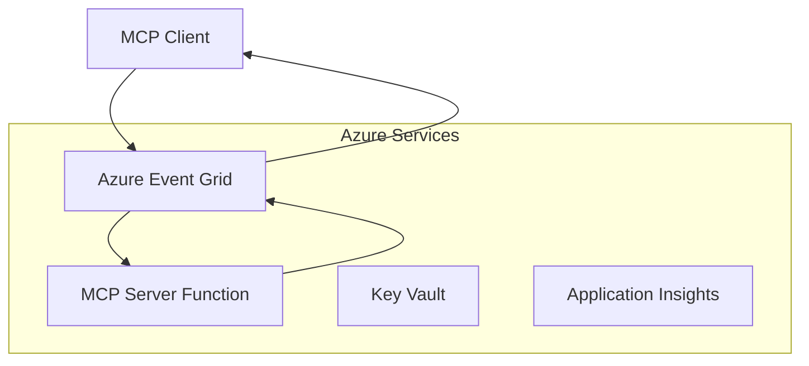
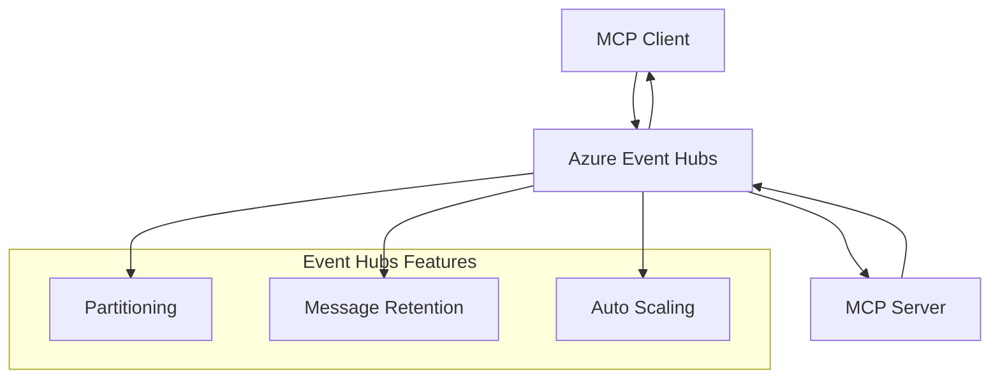

<!--
CO_OP_TRANSLATOR_METADATA:
{
  "original_hash": "c71c60af76120a517809a6cfba47e9a3",
  "translation_date": "2025-09-15T21:27:58+00:00",
  "source_file": "05-AdvancedTopics/mcp-transport/README.md",
  "language_code": "ar"
}
-->
# دليل التنفيذ المتقدم للنقل المخصص في MCP

يوفر بروتوكول سياق النموذج (MCP) مرونة في آليات النقل، مما يسمح بتنفيذات مخصصة لبيئات المؤسسات المتخصصة. يستكشف هذا الدليل المتقدم تنفيذات النقل المخصصة باستخدام Azure Event Grid وAzure Event Hubs كأمثلة عملية لبناء حلول MCP قابلة للتوسع وسحابية الأصل.

## المقدمة

بينما تخدم وسائل النقل القياسية لـ MCP (stdio والبث عبر HTTP) معظم حالات الاستخدام، تحتاج بيئات المؤسسات غالبًا إلى آليات نقل متخصصة لتحسين القابلية للتوسع والموثوقية والتكامل مع البنية التحتية السحابية الحالية. تتيح وسائل النقل المخصصة لـ MCP الاستفادة من خدمات الرسائل السحابية الأصلية للتواصل غير المتزامن، والهياكل المعتمدة على الأحداث، والمعالجة الموزعة.

تستكشف هذه الدرس تنفيذات النقل المتقدمة بناءً على أحدث مواصفات MCP (2025-06-18)، وخدمات الرسائل من Azure، وأنماط التكامل المؤسسية المعتمدة.

### **هيكلية النقل في MCP**

**من مواصفات MCP (2025-06-18):**

- **وسائل النقل القياسية**: stdio (موصى به)، البث عبر HTTP (للحالات البعيدة)
- **وسائل النقل المخصصة**: أي وسيلة نقل تنفذ بروتوكول تبادل الرسائل MCP
- **تنسيق الرسائل**: JSON-RPC 2.0 مع امتدادات خاصة بـ MCP
- **التواصل ثنائي الاتجاه**: مطلوب التواصل الكامل ثنائي الاتجاه للإشعارات والاستجابات

## أهداف التعلم

بنهاية هذا الدرس المتقدم، ستكون قادرًا على:

- **فهم متطلبات النقل المخصص**: تنفيذ بروتوكول MCP عبر أي طبقة نقل مع الحفاظ على الامتثال
- **بناء نقل Event Grid من Azure**: إنشاء خوادم MCP تعتمد على الأحداث باستخدام Azure Event Grid لتحقيق قابلية التوسع بدون خوادم
- **تنفيذ نقل Event Hubs من Azure**: تصميم حلول MCP عالية الإنتاجية باستخدام Azure Event Hubs للبث في الوقت الفعلي
- **تطبيق الأنماط المؤسسية**: دمج وسائل النقل المخصصة مع البنية التحتية الحالية لـ Azure ونماذج الأمان
- **التعامل مع موثوقية النقل**: تنفيذ استمرارية الرسائل، الترتيب، ومعالجة الأخطاء لحالات المؤسسات
- **تحسين الأداء**: تصميم حلول النقل لتلبية متطلبات القابلية للتوسع، والكمون، والإنتاجية

## **متطلبات النقل**

### **المتطلبات الأساسية من مواصفات MCP (2025-06-18):**

```yaml
Message Protocol:
  format: "JSON-RPC 2.0 with MCP extensions"
  bidirectional: "Full duplex communication required"
  ordering: "Message ordering must be preserved per session"
  
Transport Layer:
  reliability: "Transport MUST handle connection failures gracefully"
  security: "Transport MUST support secure communication"
  identification: "Each session MUST have unique identifier"
  
Custom Transport:
  compliance: "MUST implement complete MCP message exchange"
  extensibility: "MAY add transport-specific features"
  interoperability: "MUST maintain protocol compatibility"
```

## **تنفيذ نقل Event Grid من Azure**

يوفر Azure Event Grid خدمة توجيه الأحداث بدون خوادم مثالية لهياكل MCP المعتمدة على الأحداث. يوضح هذا التنفيذ كيفية بناء أنظمة MCP قابلة للتوسع وغير مترابطة.

### **نظرة عامة على الهيكلية**



### **تنفيذ C# - نقل Event Grid**

```csharp
using Azure.Messaging.EventGrid;
using Microsoft.Extensions.Azure;
using System.Text.Json;

public class EventGridMcpTransport : IMcpTransport
{
    private readonly EventGridPublisherClient _publisher;
    private readonly string _topicEndpoint;
    private readonly string _clientId;
    
    public EventGridMcpTransport(string topicEndpoint, string accessKey, string clientId)
    {
        _publisher = new EventGridPublisherClient(
            new Uri(topicEndpoint), 
            new AzureKeyCredential(accessKey));
        _topicEndpoint = topicEndpoint;
        _clientId = clientId;
    }
    
    public async Task SendMessageAsync(McpMessage message)
    {
        var eventGridEvent = new EventGridEvent(
            subject: $"mcp/{_clientId}",
            eventType: "MCP.MessageReceived",
            dataVersion: "1.0",
            data: JsonSerializer.Serialize(message))
        {
            Id = Guid.NewGuid().ToString(),
            EventTime = DateTimeOffset.UtcNow
        };
        
        await _publisher.SendEventAsync(eventGridEvent);
    }
    
    public async Task<McpMessage> ReceiveMessageAsync(CancellationToken cancellationToken)
    {
        // Event Grid is push-based, so implement webhook receiver
        // This would typically be handled by Azure Functions trigger
        throw new NotImplementedException("Use EventGridTrigger in Azure Functions");
    }
}

// Azure Function for receiving Event Grid events
[FunctionName("McpEventGridReceiver")]
public async Task<IActionResult> HandleEventGridMessage(
    [EventGridTrigger] EventGridEvent eventGridEvent,
    ILogger log)
{
    try
    {
        var mcpMessage = JsonSerializer.Deserialize<McpMessage>(
            eventGridEvent.Data.ToString());
        
        // Process MCP message
        var response = await _mcpServer.ProcessMessageAsync(mcpMessage);
        
        // Send response back via Event Grid
        await _transport.SendMessageAsync(response);
        
        return new OkResult();
    }
    catch (Exception ex)
    {
        log.LogError(ex, "Error processing Event Grid MCP message");
        return new BadRequestResult();
    }
}
```

### **تنفيذ TypeScript - نقل Event Grid**

```typescript
import { EventGridPublisherClient, AzureKeyCredential } from "@azure/eventgrid";
import { McpTransport, McpMessage } from "./mcp-types";

export class EventGridMcpTransport implements McpTransport {
    private publisher: EventGridPublisherClient;
    private clientId: string;
    
    constructor(
        private topicEndpoint: string,
        private accessKey: string,
        clientId: string
    ) {
        this.publisher = new EventGridPublisherClient(
            topicEndpoint,
            new AzureKeyCredential(accessKey)
        );
        this.clientId = clientId;
    }
    
    async sendMessage(message: McpMessage): Promise<void> {
        const event = {
            id: crypto.randomUUID(),
            source: `mcp-client-${this.clientId}`,
            type: "MCP.MessageReceived",
            time: new Date(),
            data: message
        };
        
        await this.publisher.sendEvents([event]);
    }
    
    // Event-driven receive via Azure Functions
    onMessage(handler: (message: McpMessage) => Promise<void>): void {
        // Implementation would use Azure Functions Event Grid trigger
        // This is a conceptual interface for the webhook receiver
    }
}

// Azure Functions implementation
import { app, InvocationContext, EventGridEvent } from "@azure/functions";

app.eventGrid("mcpEventGridHandler", {
    handler: async (event: EventGridEvent, context: InvocationContext) => {
        try {
            const mcpMessage = event.data as McpMessage;
            
            // Process MCP message
            const response = await mcpServer.processMessage(mcpMessage);
            
            // Send response via Event Grid
            await transport.sendMessage(response);
            
        } catch (error) {
            context.error("Error processing MCP message:", error);
            throw error;
        }
    }
});
```

### **تنفيذ Python - نقل Event Grid**

```python
from azure.eventgrid import EventGridPublisherClient, EventGridEvent
from azure.core.credentials import AzureKeyCredential
import asyncio
import json
from typing import Callable, Optional
import uuid
from datetime import datetime

class EventGridMcpTransport:
    def __init__(self, topic_endpoint: str, access_key: str, client_id: str):
        self.client = EventGridPublisherClient(
            topic_endpoint, 
            AzureKeyCredential(access_key)
        )
        self.client_id = client_id
        self.message_handler: Optional[Callable] = None
    
    async def send_message(self, message: dict) -> None:
        """Send MCP message via Event Grid"""
        event = EventGridEvent(
            data=message,
            subject=f"mcp/{self.client_id}",
            event_type="MCP.MessageReceived",
            data_version="1.0"
        )
        
        await self.client.send(event)
    
    def on_message(self, handler: Callable[[dict], None]) -> None:
        """Register message handler for incoming events"""
        self.message_handler = handler

# Azure Functions implementation
import azure.functions as func
import logging

def main(event: func.EventGridEvent) -> None:
    """Azure Functions Event Grid trigger for MCP messages"""
    try:
        # Parse MCP message from Event Grid event
        mcp_message = json.loads(event.get_body().decode('utf-8'))
        
        # Process MCP message
        response = process_mcp_message(mcp_message)
        
        # Send response back via Event Grid
        # (Implementation would create new Event Grid client)
        
    except Exception as e:
        logging.error(f"Error processing MCP Event Grid message: {e}")
        raise
```

## **تنفيذ نقل Event Hubs من Azure**

يوفر Azure Event Hubs قدرات بث في الوقت الفعلي وعالية الإنتاجية لسيناريوهات MCP التي تتطلب كمون منخفض وحجم رسائل كبير.

### **نظرة عامة على الهيكلية**



### **تنفيذ C# - نقل Event Hubs**

```csharp
using Azure.Messaging.EventHubs;
using Azure.Messaging.EventHubs.Producer;
using Azure.Messaging.EventHubs.Consumer;
using System.Text;

public class EventHubsMcpTransport : IMcpTransport, IDisposable
{
    private readonly EventHubProducerClient _producer;
    private readonly EventHubConsumerClient _consumer;
    private readonly string _consumerGroup;
    private readonly CancellationTokenSource _cancellationTokenSource;
    
    public EventHubsMcpTransport(
        string connectionString, 
        string eventHubName,
        string consumerGroup = "$Default")
    {
        _producer = new EventHubProducerClient(connectionString, eventHubName);
        _consumer = new EventHubConsumerClient(
            consumerGroup, 
            connectionString, 
            eventHubName);
        _consumerGroup = consumerGroup;
        _cancellationTokenSource = new CancellationTokenSource();
    }
    
    public async Task SendMessageAsync(McpMessage message)
    {
        var messageBody = JsonSerializer.Serialize(message);
        var eventData = new EventData(Encoding.UTF8.GetBytes(messageBody));
        
        // Add MCP-specific properties
        eventData.Properties.Add("MessageType", message.Method ?? "response");
        eventData.Properties.Add("MessageId", message.Id);
        eventData.Properties.Add("Timestamp", DateTimeOffset.UtcNow);
        
        await _producer.SendAsync(new[] { eventData });
    }
    
    public async Task StartReceivingAsync(
        Func<McpMessage, Task> messageHandler)
    {
        await foreach (PartitionEvent partitionEvent in _consumer.ReadEventsAsync(
            _cancellationTokenSource.Token))
        {
            try
            {
                var messageBody = Encoding.UTF8.GetString(
                    partitionEvent.Data.EventBody.ToArray());
                var mcpMessage = JsonSerializer.Deserialize<McpMessage>(messageBody);
                
                await messageHandler(mcpMessage);
            }
            catch (Exception ex)
            {
                // Handle deserialization or processing errors
                Console.WriteLine($"Error processing message: {ex.Message}");
            }
        }
    }
    
    public void Dispose()
    {
        _cancellationTokenSource?.Cancel();
        _producer?.DisposeAsync().AsTask().Wait();
        _consumer?.DisposeAsync().AsTask().Wait();
        _cancellationTokenSource?.Dispose();
    }
}
```

### **تنفيذ TypeScript - نقل Event Hubs**

```typescript
import { 
    EventHubProducerClient, 
    EventHubConsumerClient, 
    EventData 
} from "@azure/event-hubs";

export class EventHubsMcpTransport implements McpTransport {
    private producer: EventHubProducerClient;
    private consumer: EventHubConsumerClient;
    private isReceiving = false;
    
    constructor(
        private connectionString: string,
        private eventHubName: string,
        private consumerGroup: string = "$Default"
    ) {
        this.producer = new EventHubProducerClient(
            connectionString, 
            eventHubName
        );
        this.consumer = new EventHubConsumerClient(
            consumerGroup,
            connectionString,
            eventHubName
        );
    }
    
    async sendMessage(message: McpMessage): Promise<void> {
        const eventData: EventData = {
            body: JSON.stringify(message),
            properties: {
                messageType: message.method || "response",
                messageId: message.id,
                timestamp: new Date().toISOString()
            }
        };
        
        await this.producer.sendBatch([eventData]);
    }
    
    async startReceiving(
        messageHandler: (message: McpMessage) => Promise<void>
    ): Promise<void> {
        if (this.isReceiving) return;
        
        this.isReceiving = true;
        
        const subscription = this.consumer.subscribe({
            processEvents: async (events, context) => {
                for (const event of events) {
                    try {
                        const messageBody = event.body as string;
                        const mcpMessage: McpMessage = JSON.parse(messageBody);
                        
                        await messageHandler(mcpMessage);
                        
                        // Update checkpoint for at-least-once delivery
                        await context.updateCheckpoint(event);
                    } catch (error) {
                        console.error("Error processing Event Hubs message:", error);
                    }
                }
            },
            processError: async (err, context) => {
                console.error("Event Hubs error:", err);
            }
        });
    }
    
    async close(): Promise<void> {
        this.isReceiving = false;
        await this.producer.close();
        await this.consumer.close();
    }
}
```

### **تنفيذ Python - نقل Event Hubs**

```python
from azure.eventhub import EventHubProducerClient, EventHubConsumerClient
from azure.eventhub import EventData
import json
import asyncio
from typing import Callable, Dict, Any
import logging

class EventHubsMcpTransport:
    def __init__(
        self, 
        connection_string: str, 
        eventhub_name: str,
        consumer_group: str = "$Default"
    ):
        self.producer = EventHubProducerClient.from_connection_string(
            connection_string, 
            eventhub_name=eventhub_name
        )
        self.consumer = EventHubConsumerClient.from_connection_string(
            connection_string,
            consumer_group=consumer_group,
            eventhub_name=eventhub_name
        )
        self.is_receiving = False
    
    async def send_message(self, message: Dict[str, Any]) -> None:
        """Send MCP message via Event Hubs"""
        event_data = EventData(json.dumps(message))
        
        # Add MCP-specific properties
        event_data.properties = {
            "messageType": message.get("method", "response"),
            "messageId": message.get("id"),
            "timestamp": "2025-01-14T10:30:00Z"  # Use actual timestamp
        }
        
        async with self.producer:
            event_data_batch = await self.producer.create_batch()
            event_data_batch.add(event_data)
            await self.producer.send_batch(event_data_batch)
    
    async def start_receiving(
        self, 
        message_handler: Callable[[Dict[str, Any]], None]
    ) -> None:
        """Start receiving MCP messages from Event Hubs"""
        if self.is_receiving:
            return
        
        self.is_receiving = True
        
        async with self.consumer:
            await self.consumer.receive(
                on_event=self._on_event_received(message_handler),
                starting_position="-1"  # Start from beginning
            )
    
    def _on_event_received(self, handler: Callable):
        """Internal event handler wrapper"""
        async def handle_event(partition_context, event):
            try:
                # Parse MCP message from Event Hubs event
                message_body = event.body_as_str(encoding='UTF-8')
                mcp_message = json.loads(message_body)
                
                # Process MCP message
                await handler(mcp_message)
                
                # Update checkpoint for at-least-once delivery
                await partition_context.update_checkpoint(event)
                
            except Exception as e:
                logging.error(f"Error processing Event Hubs message: {e}")
        
        return handle_event
    
    async def close(self) -> None:
        """Clean up transport resources"""
        self.is_receiving = False
        await self.producer.close()
        await self.consumer.close()
```

## **أنماط النقل المتقدمة**

### **استمرارية الرسائل وموثوقيتها**

```csharp
// Implementing message durability with retry logic
public class ReliableTransportWrapper : IMcpTransport
{
    private readonly IMcpTransport _innerTransport;
    private readonly RetryPolicy _retryPolicy;
    
    public async Task SendMessageAsync(McpMessage message)
    {
        await _retryPolicy.ExecuteAsync(async () =>
        {
            try
            {
                await _innerTransport.SendMessageAsync(message);
            }
            catch (TransportException ex) when (ex.IsRetryable)
            {
                // Log and retry
                throw;
            }
        });
    }
}
```

### **دمج أمان النقل**

```csharp
// Integrating Azure Key Vault for transport security
public class SecureTransportFactory
{
    private readonly SecretClient _keyVaultClient;
    
    public async Task<IMcpTransport> CreateEventGridTransportAsync()
    {
        var accessKey = await _keyVaultClient.GetSecretAsync("EventGridAccessKey");
        var topicEndpoint = await _keyVaultClient.GetSecretAsync("EventGridTopic");
        
        return new EventGridMcpTransport(
            topicEndpoint.Value.Value,
            accessKey.Value.Value,
            Environment.MachineName
        );
    }
}
```

### **مراقبة النقل وقابليته للرصد**

```csharp
// Adding telemetry to custom transports
public class ObservableTransport : IMcpTransport
{
    private readonly IMcpTransport _transport;
    private readonly ILogger _logger;
    private readonly TelemetryClient _telemetryClient;
    
    public async Task SendMessageAsync(McpMessage message)
    {
        using var activity = Activity.StartActivity("MCP.Transport.Send");
        activity?.SetTag("transport.type", "EventGrid");
        activity?.SetTag("message.method", message.Method);
        
        var stopwatch = Stopwatch.StartNew();
        
        try
        {
            await _transport.SendMessageAsync(message);
            
            _telemetryClient.TrackDependency(
                "EventGrid",
                "SendMessage",
                DateTime.UtcNow.Subtract(stopwatch.Elapsed),
                stopwatch.Elapsed,
                true
            );
        }
        catch (Exception ex)
        {
            _telemetryClient.TrackException(ex);
            throw;
        }
    }
}
```

## **سيناريوهات التكامل المؤسسي**

### **السيناريو 1: معالجة MCP الموزعة**

استخدام Azure Event Grid لتوزيع طلبات MCP عبر عدة عقد معالجة:

```yaml
Architecture:
  - MCP Client sends requests to Event Grid topic
  - Multiple Azure Functions subscribe to process different tool types
  - Results aggregated and returned via separate response topic
  
Benefits:
  - Horizontal scaling based on message volume
  - Fault tolerance through redundant processors
  - Cost optimization with serverless compute
```

### **السيناريو 2: بث MCP في الوقت الفعلي**

استخدام Azure Event Hubs للتفاعلات عالية التردد لـ MCP:

```yaml
Architecture:
  - MCP Client streams continuous requests via Event Hubs
  - Stream Analytics processes and routes messages
  - Multiple consumers handle different aspect of processing
  
Benefits:
  - Low latency for real-time scenarios
  - High throughput for batch processing
  - Built-in partitioning for parallel processing
```

### **السيناريو 3: هيكلية نقل هجينة**

دمج وسائل نقل متعددة لحالات استخدام مختلفة:

```csharp
public class HybridMcpTransport : IMcpTransport
{
    private readonly IMcpTransport _realtimeTransport; // Event Hubs
    private readonly IMcpTransport _batchTransport;    // Event Grid
    private readonly IMcpTransport _fallbackTransport; // HTTP Streaming
    
    public async Task SendMessageAsync(McpMessage message)
    {
        // Route based on message characteristics
        var transport = message.Method switch
        {
            "tools/call" when IsRealtime(message) => _realtimeTransport,
            "resources/read" when IsBatch(message) => _batchTransport,
            _ => _fallbackTransport
        };
        
        await transport.SendMessageAsync(message);
    }
}
```

## **تحسين الأداء**

### **تجميع الرسائل لـ Event Grid**

```csharp
public class BatchingEventGridTransport : IMcpTransport
{
    private readonly List<McpMessage> _messageBuffer = new();
    private readonly Timer _flushTimer;
    private const int MaxBatchSize = 100;
    
    public async Task SendMessageAsync(McpMessage message)
    {
        lock (_messageBuffer)
        {
            _messageBuffer.Add(message);
            
            if (_messageBuffer.Count >= MaxBatchSize)
            {
                _ = Task.Run(FlushMessages);
            }
        }
    }
    
    private async Task FlushMessages()
    {
        List<McpMessage> toSend;
        lock (_messageBuffer)
        {
            toSend = new List<McpMessage>(_messageBuffer);
            _messageBuffer.Clear();
        }
        
        if (toSend.Any())
        {
            var events = toSend.Select(CreateEventGridEvent);
            await _publisher.SendEventsAsync(events);
        }
    }
}
```

### **استراتيجية التقسيم لـ Event Hubs**

```csharp
public class PartitionedEventHubsTransport : IMcpTransport
{
    public async Task SendMessageAsync(McpMessage message)
    {
        // Partition by client ID for session affinity
        var partitionKey = ExtractClientId(message);
        
        var eventData = new EventData(JsonSerializer.SerializeToUtf8Bytes(message))
        {
            PartitionKey = partitionKey
        };
        
        await _producer.SendAsync(new[] { eventData });
    }
}
```

## **اختبار وسائل النقل المخصصة**

### **اختبار الوحدة باستخدام نماذج اختبار**

```csharp
[Test]
public async Task EventGridTransport_SendMessage_PublishesCorrectEvent()
{
    // Arrange
    var mockPublisher = new Mock<EventGridPublisherClient>();
    var transport = new EventGridMcpTransport(mockPublisher.Object);
    var message = new McpMessage { Method = "tools/list", Id = "test-123" };
    
    // Act
    await transport.SendMessageAsync(message);
    
    // Assert
    mockPublisher.Verify(
        x => x.SendEventAsync(
            It.Is<EventGridEvent>(e => 
                e.EventType == "MCP.MessageReceived" &&
                e.Subject == "mcp/test-client"
            )
        ),
        Times.Once
    );
}
```

### **اختبار التكامل باستخدام حاويات اختبار Azure**

```csharp
[Test]
public async Task EventHubsTransport_IntegrationTest()
{
    // Using Testcontainers for integration testing
    var eventHubsContainer = new EventHubsContainer()
        .WithEventHub("test-hub");
    
    await eventHubsContainer.StartAsync();
    
    var transport = new EventHubsMcpTransport(
        eventHubsContainer.GetConnectionString(),
        "test-hub"
    );
    
    // Test message round-trip
    var sentMessage = new McpMessage { Method = "test", Id = "123" };
    McpMessage receivedMessage = null;
    
    await transport.StartReceivingAsync(msg => {
        receivedMessage = msg;
        return Task.CompletedTask;
    });
    
    await transport.SendMessageAsync(sentMessage);
    await Task.Delay(1000); // Allow for message processing
    
    Assert.That(receivedMessage?.Id, Is.EqualTo("123"));
}
```

## **أفضل الممارسات والإرشادات**

### **مبادئ تصميم النقل**

1. **التكرار**: ضمان أن معالجة الرسائل قابلة للتكرار للتعامل مع التكرارات
2. **معالجة الأخطاء**: تنفيذ معالجة شاملة للأخطاء وقوائم الرسائل الميتة
3. **المراقبة**: إضافة قياسات تفصيلية وفحوصات صحية
4. **الأمان**: استخدام الهويات المدارة والوصول بأقل امتياز
5. **الأداء**: التصميم وفقًا لمتطلبات الكمون والإنتاجية الخاصة بك

### **توصيات خاصة بـ Azure**

1. **استخدام الهوية المدارة**: تجنب سلاسل الاتصال في الإنتاج
2. **تنفيذ قواطع الدائرة**: الحماية من انقطاعات خدمات Azure
3. **مراقبة التكاليف**: تتبع حجم الرسائل وتكاليف المعالجة
4. **التخطيط للتوسع**: تصميم استراتيجيات التقسيم والتوسع مبكرًا
5. **اختبار شامل**: استخدام مختبرات Azure DevTest للاختبار الشامل

## **الخاتمة**

تتيح وسائل النقل المخصصة لـ MCP سيناريوهات مؤسسية قوية باستخدام خدمات الرسائل من Azure. من خلال تنفيذ وسائل نقل Event Grid أو Event Hubs، يمكنك بناء حلول MCP قابلة للتوسع وموثوقة تتكامل بسلاسة مع البنية التحتية الحالية لـ Azure.

توضح الأمثلة المقدمة أنماطًا جاهزة للإنتاج لتنفيذ وسائل النقل المخصصة مع الحفاظ على الامتثال لبروتوكول MCP وأفضل الممارسات الخاصة بـ Azure.

## **موارد إضافية**

- [مواصفات MCP 2025-06-18](https://spec.modelcontextprotocol.io/specification/2025-06-18/)
- [وثائق Azure Event Grid](https://docs.microsoft.com/azure/event-grid/)
- [وثائق Azure Event Hubs](https://docs.microsoft.com/azure/event-hubs/)
- [مشغل Event Grid في Azure Functions](https://docs.microsoft.com/azure/azure-functions/functions-bindings-event-grid)
- [Azure SDK لـ .NET](https://github.com/Azure/azure-sdk-for-net)
- [Azure SDK لـ TypeScript](https://github.com/Azure/azure-sdk-for-js)
- [Azure SDK لـ Python](https://github.com/Azure/azure-sdk-for-python)

---

> *يركز هذا الدليل على أنماط التنفيذ العملية لأنظمة MCP الإنتاجية. تحقق دائمًا من تنفيذات النقل مقابل متطلباتك المحددة وحدود خدمات Azure.*
> **المعيار الحالي**: يعكس هذا الدليل [مواصفات MCP 2025-06-18](https://spec.modelcontextprotocol.io/specification/2025-06-18/) متطلبات النقل وأنماط النقل المتقدمة لبيئات المؤسسات.

## ما التالي
- [6. مساهمات المجتمع](../../06-CommunityContributions/README.md)

---

**إخلاء المسؤولية**:  
تم ترجمة هذا المستند باستخدام خدمة الترجمة بالذكاء الاصطناعي [Co-op Translator](https://github.com/Azure/co-op-translator). بينما نسعى لتحقيق الدقة، يرجى العلم أن الترجمات الآلية قد تحتوي على أخطاء أو معلومات غير دقيقة. يجب اعتبار المستند الأصلي بلغته الأصلية المصدر الموثوق. للحصول على معلومات حاسمة، يُوصى بالاستعانة بترجمة بشرية احترافية. نحن غير مسؤولين عن أي سوء فهم أو تفسيرات خاطئة تنشأ عن استخدام هذه الترجمة.