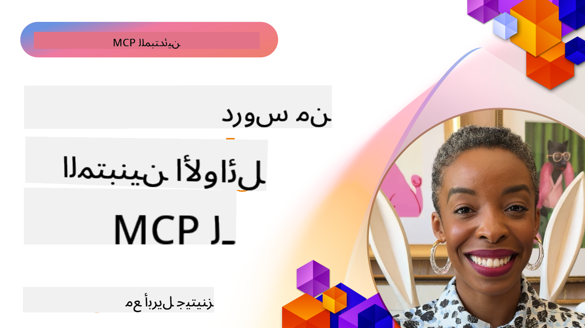

<!--
CO_OP_TRANSLATOR_METADATA:
{
  "original_hash": "41f16dac486d2086a53bc644a01cbe42",
  "translation_date": "2025-08-18T13:34:02+00:00",
  "source_file": "07-LessonsfromEarlyAdoption/README.md",
  "language_code": "ar"
}
-->
# 🌟 دروس من المستخدمين الأوائل

[](https://youtu.be/jds7dSmNptE)

_(انقر على الصورة أعلاه لمشاهدة فيديو هذا الدرس)_

## 🎯 ما يغطيه هذا الوحدة

تستكشف هذه الوحدة كيف تستفيد المؤسسات والمطورون الحقيقيون من بروتوكول سياق النموذج (MCP) لحل التحديات الفعلية ودفع الابتكار. من خلال دراسات حالة مفصلة ومشاريع عملية، ستكتشف كيف يمكّن MCP التكامل الآمن والقابل للتوسع للذكاء الاصطناعي الذي يربط بين نماذج اللغة، الأدوات، وبيانات المؤسسات.

### 📚 شاهد MCP في العمل

هل تريد رؤية هذه المبادئ مطبقة على أدوات جاهزة للإنتاج؟ تحقق من [**10 خوادم MCP من Microsoft التي تحول إنتاجية المطورين**](microsoft-mcp-servers.md)، والتي تعرض خوادم MCP حقيقية من Microsoft يمكنك استخدامها اليوم.

## نظرة عامة

يستكشف هذا الدرس كيف استفاد المستخدمون الأوائل من بروتوكول سياق النموذج (MCP) لحل تحديات العالم الحقيقي ودفع الابتكار عبر الصناعات. من خلال دراسات حالة مفصلة ومشاريع عملية، ستتعرف على كيفية تمكين MCP للتكامل الموحد والآمن والقابل للتوسع للذكاء الاصطناعي—ربط نماذج اللغة الكبيرة، الأدوات، وبيانات المؤسسات في إطار عمل موحد. ستكتسب خبرة عملية في تصميم وبناء حلول تعتمد على MCP، وتتعلم من أنماط التنفيذ المثبتة، وتكتشف أفضل الممارسات لنشر MCP في بيئات الإنتاج. يسلط الدرس أيضًا الضوء على الاتجاهات الناشئة، الاتجاهات المستقبلية، والموارد مفتوحة المصدر لمساعدتك على البقاء في طليعة تقنية MCP ونظامها البيئي المتطور.

## أهداف التعلم

- تحليل تطبيقات MCP الواقعية عبر مختلف الصناعات
- تصميم وبناء تطبيقات كاملة تعتمد على MCP
- استكشاف الاتجاهات الناشئة والاتجاهات المستقبلية في تقنية MCP
- تطبيق أفضل الممارسات في سيناريوهات التطوير الفعلية

## تطبيقات MCP الواقعية

### دراسة حالة 1: أتمتة دعم العملاء للمؤسسات

قامت شركة متعددة الجنسيات بتنفيذ حل يعتمد على MCP لتوحيد التفاعلات الذكية عبر أنظمة دعم العملاء الخاصة بها. مما سمح لهم بـ:

- إنشاء واجهة موحدة لمزودي نماذج اللغة الكبيرة (LLM) المتعددين
- الحفاظ على إدارة موحدة للمطالبات عبر الأقسام
- تنفيذ ضوابط أمان وامتثال قوية
- التبديل بسهولة بين نماذج الذكاء الاصطناعي المختلفة بناءً على الاحتياجات المحددة

**التنفيذ الفني:**

```python
# Python MCP server implementation for customer support
import logging
import asyncio
from modelcontextprotocol import create_server, ServerConfig
from modelcontextprotocol.server import MCPServer
from modelcontextprotocol.transports import create_http_transport
from modelcontextprotocol.resources import ResourceDefinition
from modelcontextprotocol.prompts import PromptDefinition
from modelcontextprotocol.tool import ToolDefinition

# Configure logging
logging.basicConfig(level=logging.INFO)

async def main():
    # Create server configuration
    config = ServerConfig(
        name="Enterprise Customer Support Server",
        version="1.0.0",
        description="MCP server for handling customer support inquiries"
    )
    
    # Initialize MCP server
    server = create_server(config)
    
    # Register knowledge base resources
    server.resources.register(
        ResourceDefinition(
            name="customer_kb",
            description="Customer knowledge base documentation"
        ),
        lambda params: get_customer_documentation(params)
    )
    
    # Register prompt templates
    server.prompts.register(
        PromptDefinition(
            name="support_template",
            description="Templates for customer support responses"
        ),
        lambda params: get_support_templates(params)
    )
    
    # Register support tools
    server.tools.register(
        ToolDefinition(
            name="ticketing",
            description="Create and update support tickets"
        ),
        handle_ticketing_operations
    )
    
    # Start server with HTTP transport
    transport = create_http_transport(port=8080)
    await server.run(transport)

if __name__ == "__main__":
    asyncio.run(main())
```

**النتائج:** تقليل تكاليف النماذج بنسبة 30%، تحسين اتساق الردود بنسبة 45%، وتعزيز الامتثال عبر العمليات العالمية.

### دراسة حالة 2: مساعد تشخيص الرعاية الصحية

طور مقدم خدمات الرعاية الصحية بنية تحتية تعتمد على MCP لدمج نماذج الذكاء الاصطناعي الطبية المتخصصة مع ضمان حماية بيانات المرضى الحساسة:

- التبديل السلس بين النماذج الطبية العامة والمتخصصة
- ضوابط صارمة للخصوصية ومسارات التدقيق
- التكامل مع أنظمة السجلات الصحية الإلكترونية (EHR) الحالية
- هندسة مطالبات متسقة للمصطلحات الطبية

**التنفيذ الفني:**

```csharp
// C# MCP host application implementation in healthcare application
using Microsoft.Extensions.DependencyInjection;
using ModelContextProtocol.SDK.Client;
using ModelContextProtocol.SDK.Security;
using ModelContextProtocol.SDK.Resources;

public class DiagnosticAssistant
{
    private readonly MCPHostClient _mcpClient;
    private readonly PatientContext _patientContext;
    
    public DiagnosticAssistant(PatientContext patientContext)
    {
        _patientContext = patientContext;
        
        // Configure MCP client with healthcare-specific settings
        var clientOptions = new ClientOptions
        {
            Name = "Healthcare Diagnostic Assistant",
            Version = "1.0.0",
            Security = new SecurityOptions
            {
                Encryption = EncryptionLevel.Medical,
                AuditEnabled = true
            }
        };
        
        _mcpClient = new MCPHostClientBuilder()
            .WithOptions(clientOptions)
            .WithTransport(new HttpTransport("https://healthcare-mcp.example.org"))
            .WithAuthentication(new HIPAACompliantAuthProvider())
            .Build();
    }
    
    public async Task<DiagnosticSuggestion> GetDiagnosticAssistance(
        string symptoms, string patientHistory)
    {
        // Create request with appropriate resources and tool access
        var resourceRequest = new ResourceRequest
        {
            Name = "patient_records",
            Parameters = new Dictionary<string, object>
            {
                ["patientId"] = _patientContext.PatientId,
                ["requestingProvider"] = _patientContext.ProviderId
            }
        };
        
        // Request diagnostic assistance using appropriate prompt
        var response = await _mcpClient.SendPromptRequestAsync(
            promptName: "diagnostic_assistance",
            parameters: new Dictionary<string, object>
            {
                ["symptoms"] = symptoms,
                patientHistory = patientHistory,
                relevantGuidelines = _patientContext.GetRelevantGuidelines()
            });
            
        return DiagnosticSuggestion.FromMCPResponse(response);
    }
}
```

**النتائج:** تحسين اقتراحات التشخيص للأطباء مع الحفاظ على الامتثال الكامل لـ HIPAA وتقليل كبير في تبديل السياقات بين الأنظمة.

### دراسة حالة 3: تحليل المخاطر في الخدمات المالية

قامت مؤسسة مالية بتنفيذ MCP لتوحيد عمليات تحليل المخاطر عبر الأقسام المختلفة:

- إنشاء واجهة موحدة لنماذج مخاطر الائتمان، اكتشاف الاحتيال، ومخاطر الاستثمار
- تنفيذ ضوابط وصول صارمة وإصدارات النماذج
- ضمان إمكانية التدقيق لجميع توصيات الذكاء الاصطناعي
- الحفاظ على تنسيق بيانات متسق عبر الأنظمة المتنوعة

**التنفيذ الفني:**

```java
// Java MCP server for financial risk assessment
import org.mcp.server.*;
import org.mcp.security.*;

public class FinancialRiskMCPServer {
    public static void main(String[] args) {
        // Create MCP server with financial compliance features
        MCPServer server = new MCPServerBuilder()
            .withModelProviders(
                new ModelProvider("risk-assessment-primary", new AzureOpenAIProvider()),
                new ModelProvider("risk-assessment-audit", new LocalLlamaProvider())
            )
            .withPromptTemplateDirectory("./compliance/templates")
            .withAccessControls(new SOCCompliantAccessControl())
            .withDataEncryption(EncryptionStandard.FINANCIAL_GRADE)
            .withVersionControl(true)
            .withAuditLogging(new DatabaseAuditLogger())
            .build();
            
        server.addRequestValidator(new FinancialDataValidator());
        server.addResponseFilter(new PII_RedactionFilter());
        
        server.start(9000);
        
        System.out.println("Financial Risk MCP Server running on port 9000");
    }
}
```

**النتائج:** تعزيز الامتثال التنظيمي، تسريع دورات نشر النماذج بنسبة 40%، وتحسين اتساق تقييم المخاطر عبر الأقسام.

### دراسة حالة 4: خادم MCP لـ Microsoft Playwright لأتمتة المتصفح

طورت Microsoft [خادم MCP لـ Playwright](https://github.com/microsoft/playwright-mcp) لتمكين أتمتة المتصفح الآمنة والموحدة من خلال بروتوكول سياق النموذج. يتيح هذا الخادم الجاهز للإنتاج للوكالات الذكية ونماذج اللغة الكبيرة التفاعل مع متصفحات الويب بطريقة محكومة وقابلة للتدقيق وقابلة للتوسيع—مما يتيح حالات استخدام مثل اختبار الويب الآلي، استخراج البيانات، وسير العمل الشامل.

> **🎯 أداة جاهزة للإنتاج**
> 
> تعرض هذه الدراسة حالة خادم MCP حقيقي يمكنك استخدامه اليوم! تعرف على المزيد حول خادم MCP لـ Playwright و9 خوادم أخرى جاهزة للإنتاج من Microsoft في [**دليل خوادم MCP من Microsoft**](microsoft-mcp-servers.md#8--playwright-mcp-server).

**الميزات الرئيسية:**
- يوفر قدرات أتمتة المتصفح (التنقل، ملء النماذج، التقاط لقطات الشاشة، إلخ) كأدوات MCP
- ينفذ ضوابط وصول صارمة وعزل لمنع الإجراءات غير المصرح بها
- يوفر سجلات تدقيق مفصلة لجميع تفاعلات المتصفح
- يدعم التكامل مع Azure OpenAI ومزودي نماذج اللغة الكبيرة الآخرين لأتمتة مدفوعة بالوكالات
- يدعم قدرات التصفح لـ GitHub Copilot

**التنفيذ الفني:**

```typescript
// TypeScript: Registering Playwright browser automation tools in an MCP server
import { createServer, ToolDefinition } from 'modelcontextprotocol';
import { launch } from 'playwright';

const server = createServer({
  name: 'Playwright MCP Server',
  version: '1.0.0',
  description: 'MCP server for browser automation using Playwright'
});

// Register a tool for navigating to a URL and capturing a screenshot
server.tools.register(
  new ToolDefinition({
    name: 'navigate_and_screenshot',
    description: 'Navigate to a URL and capture a screenshot',
    parameters: {
      url: { type: 'string', description: 'The URL to visit' }
    }
  }),
  async ({ url }) => {
    const browser = await launch();
    const page = await browser.newPage();
    await page.goto(url);
    const screenshot = await page.screenshot();
    await browser.close();
    return { screenshot };
  }
);

// Start the MCP server
server.listen(8080);
```

**النتائج:**

- تمكين أتمتة المتصفح البرمجية الآمنة للوكالات الذكية ونماذج اللغة الكبيرة
- تقليل الجهد اليدوي في الاختبار وتحسين تغطية الاختبار لتطبيقات الويب
- توفير إطار عمل قابل لإعادة الاستخدام وقابل للتوسيع لتكامل الأدوات المستندة إلى المتصفح في بيئات المؤسسات
- دعم قدرات التصفح لـ GitHub Copilot

**المراجع:**

- [مستودع GitHub لخادم MCP لـ Playwright](https://github.com/microsoft/playwright-mcp)
- [حلول الذكاء الاصطناعي والأتمتة من Microsoft](https://azure.microsoft.com/en-us/products/ai-services/)

### دراسة حالة 5: Azure MCP – بروتوكول سياق النموذج على مستوى المؤسسات كخدمة

خادم Azure MCP ([https://aka.ms/azmcp](https://aka.ms/azmcp)) هو تنفيذ مُدار من Microsoft لبروتوكول سياق النموذج على مستوى المؤسسات، مصمم لتوفير قدرات خادم MCP قابلة للتوسع وآمنة ومتوافقة كخدمة سحابية. يتيح Azure MCP للمؤسسات نشر وإدارة ودمج خوادم MCP بسرعة مع خدمات Azure للذكاء الاصطناعي والبيانات والأمان، مما يقلل من العبء التشغيلي ويسرع تبني الذكاء الاصطناعي.

> **🎯 أداة جاهزة للإنتاج**
> 
> هذا خادم MCP حقيقي يمكنك استخدامه اليوم! تعرف على المزيد حول خادم MCP لـ Azure AI Foundry في [**دليل خوادم MCP من Microsoft**](microsoft-mcp-servers.md).

- استضافة خادم MCP مُدار بالكامل مع التوسع والمراقبة والأمان المدمجين
- التكامل الأصلي مع Azure OpenAI، Azure AI Search، وخدمات Azure الأخرى
- المصادقة والتفويض على مستوى المؤسسات عبر Microsoft Entra ID
- دعم الأدوات المخصصة، قوالب المطالبات، وموصلات الموارد
- الامتثال لمتطلبات الأمان والتنظيم على مستوى المؤسسات

**التنفيذ الفني:**

```yaml
# Example: Azure MCP server deployment configuration (YAML)
apiVersion: mcp.microsoft.com/v1
kind: McpServer
metadata:
  name: enterprise-mcp-server
spec:
  modelProviders:
    - name: azure-openai
      type: AzureOpenAI
      endpoint: https://<your-openai-resource>.openai.azure.com/
      apiKeySecret: <your-azure-keyvault-secret>
  tools:
    - name: document_search
      type: AzureAISearch
      endpoint: https://<your-search-resource>.search.windows.net/
      apiKeySecret: <your-azure-keyvault-secret>
  authentication:
    type: EntraID
    tenantId: <your-tenant-id>
  monitoring:
    enabled: true
    logAnalyticsWorkspace: <your-log-analytics-id>
```

**النتائج:**  
- تقليل الوقت اللازم لتحقيق القيمة لمشاريع الذكاء الاصطناعي على مستوى المؤسسات من خلال توفير منصة خادم MCP جاهزة للاستخدام ومتوافقة
- تبسيط تكامل نماذج اللغة الكبيرة، الأدوات، ومصادر بيانات المؤسسات
- تعزيز الأمان، الرؤية، والكفاءة التشغيلية لأعباء عمل MCP
- تحسين جودة الكود باستخدام أفضل ممارسات Azure SDK وأنماط المصادقة الحالية

**المراجع:**  
- [وثائق Azure MCP](https://aka.ms/azmcp)
- [مستودع GitHub لخادم Azure MCP](https://github.com/Azure/azure-mcp)
- [خدمات Azure AI](https://azure.microsoft.com/en-us/products/ai-services/)
- [مركز MCP من Microsoft](https://mcp.azure.com)

### دراسة حالة 6: NLWeb

MCP (بروتوكول سياق النموذج) هو بروتوكول ناشئ لروبوتات الدردشة والمساعدين الذكيين للتفاعل مع الأدوات. كل مثيل لـ NLWeb هو أيضًا خادم MCP، يدعم طريقة أساسية واحدة، ask، تُستخدم لطرح سؤال على موقع ويب بلغة طبيعية. يتم الاستفادة من الاستجابة المرتجعة من schema.org، وهي مفردات مستخدمة على نطاق واسع لوصف بيانات الويب. بشكل عام، MCP هو NLWeb كما هو Http بالنسبة لـ HTML. يجمع NLWeb بين البروتوكولات، تنسيقات Schema.org، وعينات الكود لمساعدة المواقع على إنشاء هذه النقاط النهائية بسرعة، مما يفيد البشر من خلال واجهات المحادثة والآلات من خلال التفاعل الطبيعي بين الوكلاء.

هناك مكونان متميزان لـ NLWeb:
- بروتوكول، بسيط جدًا للبدء به، للتفاعل مع موقع بلغة طبيعية وتنسيق، يستفيد من json وschema.org للإجابة المرتجعة. راجع الوثائق حول REST API لمزيد من التفاصيل.
- تنفيذ بسيط لـ (1) يستفيد من العلامات الموجودة، للمواقع التي يمكن تجريدها كقوائم من العناصر (المنتجات، الوصفات، المعالم، المراجعات، إلخ). مع مجموعة من عناصر واجهة المستخدم، يمكن للمواقع بسهولة توفير واجهات محادثة لمحتواها. راجع الوثائق حول حياة استعلام الدردشة لمزيد من التفاصيل حول كيفية عمل ذلك.

**المراجع:**  
- [وثائق Azure MCP](https://aka.ms/azmcp)  
- [NLWeb](https://github.com/microsoft/NlWeb)

### دراسة حالة 7: خادم MCP لـ Azure AI Foundry – تكامل وكالات الذكاء الاصطناعي على مستوى المؤسسات

تظهر خوادم MCP لـ Azure AI Foundry كيف يمكن استخدام MCP لتنظيم وإدارة الوكالات الذكية وسير العمل في بيئات المؤسسات. من خلال دمج MCP مع Azure AI Foundry، يمكن للمؤسسات توحيد تفاعلات الوكالات، الاستفادة من إدارة سير العمل في Foundry، وضمان عمليات نشر آمنة وقابلة للتوسع.

> **🎯 أداة جاهزة للإنتاج**
> 
> هذا خادم MCP حقيقي يمكنك استخدامه اليوم! تعرف على المزيد حول خادم MCP لـ Azure AI Foundry في [**دليل خوادم MCP من Microsoft**](microsoft-mcp-servers.md#9--azure-ai-foundry-mcp-server).

**الميزات الرئيسية:**
- الوصول الشامل إلى نظام Azure للذكاء الاصطناعي، بما في ذلك كتالوجات النماذج وإدارة النشر
- فهرسة المعرفة باستخدام Azure AI Search لتطبيقات RAG
- أدوات تقييم أداء النماذج الذكية وضمان الجودة
- التكامل مع كتالوج ومختبرات Azure AI Foundry للنماذج البحثية المتقدمة
- قدرات إدارة وتقييم الوكالات لسيناريوهات الإنتاج

**النتائج:**
- النماذج الأولية السريعة والمراقبة القوية لسير عمل الوكالات الذكية
- التكامل السلس مع خدمات Azure AI للسيناريوهات المتقدمة
- واجهة موحدة لبناء، نشر، ومراقبة خطوط أنابيب الوكالات
- تحسين الأمان، الامتثال، والكفاءة التشغيلية للمؤسسات
- تسريع تبني الذكاء الاصطناعي مع الحفاظ على التحكم في العمليات المعقدة المدفوعة بالوكالات

**المراجع:**
- [مستودع GitHub لخادم MCP لـ Azure AI Foundry](https://github.com/azure-ai-foundry/mcp-foundry)
- [دمج وكالات Azure AI مع MCP (مدونة Microsoft Foundry)](https://devblogs.microsoft.com/foundry/integrating-azure-ai-agents-mcp/)

### دراسة حالة 8: ملعب MCP لـ Foundry – التجريب والنماذج الأولية

يوفر ملعب MCP لـ Foundry بيئة جاهزة للاستخدام لتجربة خوادم MCP وتكاملات Azure AI Foundry. يمكن للمطورين بسرعة إنشاء نماذج أولية، اختبار، وتقييم نماذج الذكاء الاصطناعي وسير عمل الوكالات باستخدام موارد من كتالوج ومختبرات Azure AI Foundry. يسهل الملعب الإعداد، يوفر مشاريع نموذجية، ويدعم التطوير التعاوني، مما يجعل من السهل استكشاف أفضل الممارسات والسيناريوهات الجديدة بأقل قدر من التعقيد. إنه مفيد بشكل خاص للفرق التي تسعى إلى التحقق من الأفكار، مشاركة التجارب، وتسريع التعلم دون الحاجة إلى بنية تحتية معقدة. من خلال خفض الحواجز، يساعد الملعب في تعزيز الابتكار والمساهمات المجتمعية في نظام MCP وAzure AI Foundry.

**المراجع:**

- [مستودع GitHub لملعب MCP لـ Foundry](https://github.com/azure-ai-foundry/foundry-mcp-playground)

### دراسة حالة 9: خادم MCP لـ Microsoft Learn Docs – الوصول إلى الوثائق المدعوم بالذكاء الاصطناعي

خادم MCP لـ Microsoft Learn Docs هو خدمة مستضافة على السحابة توفر للمساعدين الذكيين الوصول الفوري إلى الوثائق الرسمية من Microsoft من خلال بروتوكول سياق النموذج. يربط هذا الخادم الجاهز للإنتاج بالنظام الشامل لـ Microsoft Learn ويمكّن البحث الدلالي عبر جميع المصادر الرسمية من Microsoft.
> **🎯 أداة جاهزة للإنتاج**

> هذا خادم MCP حقيقي يمكنك استخدامه اليوم! تعرف على المزيد حول خادم Microsoft Learn Docs MCP في [**دليل خوادم Microsoft MCP**](microsoft-mcp-servers.md#1--microsoft-learn-docs-mcp-server).
**الميزات الرئيسية:**
- الوصول الفوري إلى وثائق Microsoft الرسمية، وثائق Azure، ووثائق Microsoft 365
- قدرات بحث دلالي متقدمة تفهم السياق والنوايا
- معلومات محدثة دائمًا مع نشر محتوى Microsoft Learn
- تغطية شاملة عبر مصادر Microsoft Learn، وثائق Azure، وMicrosoft 365
- يعرض ما يصل إلى 10 أجزاء محتوى عالية الجودة مع عناوين المقالات وروابطها

**لماذا هو مهم:**
- يحل مشكلة "المعرفة القديمة للذكاء الاصطناعي" لتقنيات Microsoft
- يضمن أن مساعدي الذكاء الاصطناعي لديهم وصول إلى أحدث ميزات .NET، وC#، وAzure، وMicrosoft 365
- يوفر معلومات موثوقة من الطرف الأول لتوليد أكواد دقيقة
- ضروري للمطورين الذين يعملون مع تقنيات Microsoft المتطورة بسرعة

**النتائج:**
- تحسين دقة الأكواد التي يولدها الذكاء الاصطناعي بشكل كبير لتقنيات Microsoft
- تقليل الوقت المستغرق في البحث عن الوثائق الحالية وأفضل الممارسات
- تعزيز إنتاجية المطورين من خلال استرجاع الوثائق الموجهة بالسياق
- تكامل سلس مع سير العمل التطويري دون مغادرة بيئة التطوير المتكاملة (IDE)

**المراجع:**
- [مستودع GitHub لوثائق Microsoft Learn MCP Server](https://github.com/MicrosoftDocs/mcp)
- [وثائق Microsoft Learn](https://learn.microsoft.com/)

## مشاريع عملية

### المشروع 1: بناء خادم MCP متعدد المزودين

**الهدف:** إنشاء خادم MCP يمكنه توجيه الطلبات إلى مزودي نماذج ذكاء اصطناعي متعددين بناءً على معايير محددة.

**المتطلبات:**

- دعم ما لا يقل عن ثلاثة مزودي نماذج مختلفين (مثل OpenAI، Anthropic، النماذج المحلية)
- تنفيذ آلية توجيه بناءً على بيانات وصفية للطلبات
- إنشاء نظام إعدادات لإدارة بيانات اعتماد المزودين
- إضافة التخزين المؤقت لتحسين الأداء والتكاليف
- بناء لوحة تحكم بسيطة لمراقبة الاستخدام

**خطوات التنفيذ:**

1. إعداد البنية التحتية الأساسية لخادم MCP
2. تنفيذ موصلات المزودين لكل خدمة نموذج ذكاء اصطناعي
3. إنشاء منطق التوجيه بناءً على خصائص الطلب
4. إضافة آليات التخزين المؤقت للطلبات المتكررة
5. تطوير لوحة المراقبة
6. اختبار أنماط طلبات متنوعة

**التقنيات:** اختر من بين Python (.NET/Java/Python بناءً على تفضيلك)، Redis للتخزين المؤقت، وإطار عمل ويب بسيط للوحة التحكم.

### المشروع 2: نظام إدارة القوالب النصية للمؤسسات

**الهدف:** تطوير نظام قائم على MCP لإدارة، إصدار، ونشر قوالب النصوص عبر المؤسسة.

**المتطلبات:**

- إنشاء مستودع مركزي لقوالب النصوص
- تنفيذ أنظمة إصدار وموافقة على القوالب
- بناء قدرات اختبار القوالب باستخدام مدخلات تجريبية
- تطوير ضوابط وصول قائمة على الأدوار
- إنشاء واجهة برمجة تطبيقات لاسترجاع القوالب ونشرها

**خطوات التنفيذ:**

1. تصميم مخطط قاعدة البيانات لتخزين القوالب
2. إنشاء واجهة برمجة التطبيقات الأساسية لعمليات CRUD على القوالب
3. تنفيذ نظام الإصدار
4. بناء سير عمل الموافقة
5. تطوير إطار عمل للاختبار
6. إنشاء واجهة ويب بسيطة للإدارة
7. التكامل مع خادم MCP

**التقنيات:** اختيارك لإطار العمل الخلفي، قاعدة بيانات SQL أو NoSQL، وإطار عمل واجهة أمامية لواجهة الإدارة.

### المشروع 3: منصة إنشاء محتوى قائمة على MCP

**الهدف:** بناء منصة لإنشاء المحتوى تستفيد من MCP لتقديم نتائج متسقة عبر أنواع مختلفة من المحتوى.

**المتطلبات:**

- دعم تنسيقات محتوى متعددة (مقالات مدونات، وسائل التواصل الاجتماعي، نصوص تسويقية)
- تنفيذ إنشاء قائم على القوالب مع خيارات تخصيص
- إنشاء نظام مراجعة وتغذية راجعة للمحتوى
- تتبع مقاييس أداء المحتوى
- دعم إصدار المحتوى وتكراره

**خطوات التنفيذ:**

1. إعداد بنية العميل لخادم MCP
2. إنشاء قوالب لأنواع المحتوى المختلفة
3. بناء خط إنتاج المحتوى
4. تنفيذ نظام المراجعة
5. تطوير نظام تتبع المقاييس
6. إنشاء واجهة مستخدم لإدارة القوالب وإنشاء المحتوى

**التقنيات:** لغة البرمجة المفضلة لديك، إطار عمل ويب، ونظام قاعدة بيانات.

## الاتجاهات المستقبلية لتقنية MCP

### الاتجاهات الناشئة

1. **MCP متعدد الوسائط**
   - توسيع MCP لتوحيد التفاعلات مع نماذج الصور، الصوت، والفيديو
   - تطوير قدرات التفكير عبر الوسائط
   - تنسيقات قوالب موحدة للوسائط المختلفة

2. **بنية MCP الموزعة**
   - شبكات MCP موزعة يمكنها مشاركة الموارد عبر المؤسسات
   - بروتوكولات موحدة لمشاركة النماذج بشكل آمن
   - تقنيات حسابية تحافظ على الخصوصية

3. **أسواق MCP**
   - أنظمة بيئية لمشاركة وبيع قوالب MCP والإضافات
   - عمليات ضمان الجودة وشهادات الاعتماد
   - التكامل مع أسواق النماذج

4. **MCP للحوسبة الطرفية**
   - تكييف معايير MCP للأجهزة الطرفية ذات الموارد المحدودة
   - بروتوكولات محسنة لبيئات النطاق الترددي المنخفض
   - تطبيقات MCP متخصصة لأنظمة إنترنت الأشياء

5. **الأطر التنظيمية**
   - تطوير امتدادات MCP للامتثال التنظيمي
   - سجلات تدقيق موحدة وواجهات تفسيرية
   - التكامل مع أطر حوكمة الذكاء الاصطناعي الناشئة

### حلول MCP من Microsoft

طورت Microsoft وAzure العديد من المستودعات مفتوحة المصدر لمساعدة المطورين على تنفيذ MCP في سيناريوهات مختلفة:

#### منظمة Microsoft

1. [playwright-mcp](https://github.com/microsoft/playwright-mcp) - خادم MCP Playwright لأتمتة المتصفح والاختبار
2. [files-mcp-server](https://github.com/microsoft/files-mcp-server) - تنفيذ خادم MCP OneDrive للاختبار المحلي والمساهمة المجتمعية
3. [NLWeb](https://github.com/microsoft/NlWeb) - مجموعة من البروتوكولات المفتوحة والأدوات مفتوحة المصدر المرتبطة بها، تركز على إنشاء طبقة أساسية للويب الذكي

#### منظمة Azure-Samples

1. [mcp](https://github.com/Azure-Samples/mcp) - روابط إلى عينات، أدوات، وموارد لبناء ودمج خوادم MCP على Azure باستخدام لغات متعددة
2. [mcp-auth-servers](https://github.com/Azure-Samples/mcp-auth-servers) - خوادم MCP مرجعية توضح المصادقة مع مواصفات بروتوكول السياق النموذجي الحالية
3. [remote-mcp-functions](https://github.com/Azure-Samples/remote-mcp-functions) - صفحة هبوط لتنفيذات خوادم MCP البعيدة في Azure Functions مع روابط إلى مستودعات خاصة باللغات
4. [remote-mcp-functions-python](https://github.com/Azure-Samples/remote-mcp-functions-python) - قالب بدء سريع لبناء ونشر خوادم MCP البعيدة المخصصة باستخدام Azure Functions مع Python
5. [remote-mcp-functions-dotnet](https://github.com/Azure-Samples/remote-mcp-functions-dotnet) - قالب بدء سريع لبناء ونشر خوادم MCP البعيدة المخصصة باستخدام Azure Functions مع .NET/C#
6. [remote-mcp-functions-typescript](https://github.com/Azure-Samples/remote-mcp-functions-typescript) - قالب بدء سريع لبناء ونشر خوادم MCP البعيدة المخصصة باستخدام Azure Functions مع TypeScript
7. [remote-mcp-apim-functions-python](https://github.com/Azure-Samples/remote-mcp-apim-functions-python) - إدارة واجهات برمجة التطبيقات كبوابة ذكاء اصطناعي لخوادم MCP البعيدة باستخدام Python
8. [AI-Gateway](https://github.com/Azure-Samples/AI-Gateway) - تجارب APIM ❤️ AI بما في ذلك قدرات MCP، التكامل مع Azure OpenAI وAI Foundry

توفر هذه المستودعات تنفيذات متنوعة، قوالب، وموارد للعمل مع بروتوكول السياق النموذجي عبر لغات البرمجة المختلفة وخدمات Azure. تغطي مجموعة واسعة من حالات الاستخدام من تنفيذات الخوادم الأساسية إلى المصادقة، النشر السحابي، ودمج المؤسسات.

#### دليل موارد MCP

يوفر [دليل موارد MCP](https://github.com/microsoft/mcp/tree/main/Resources) في مستودع Microsoft MCP الرسمي مجموعة من الموارد النموذجية، قوالب النصوص، وتعريفات الأدوات للاستخدام مع خوادم بروتوكول السياق النموذجي. تم تصميم هذا الدليل لمساعدة المطورين على البدء بسرعة مع MCP من خلال تقديم كتل بناء قابلة لإعادة الاستخدام وأمثلة لأفضل الممارسات.

- **قوالب النصوص:** قوالب نصوص جاهزة للاستخدام لمهام وسيناريوهات الذكاء الاصطناعي الشائعة، يمكن تكييفها مع تنفيذات خادم MCP الخاصة بك.
- **تعريفات الأدوات:** أمثلة على مخططات الأدوات والبيانات الوصفية لتوحيد تكامل الأدوات واستدعائها عبر خوادم MCP المختلفة.
- **عينات الموارد:** أمثلة على تعريفات الموارد للاتصال بمصادر البيانات، واجهات برمجة التطبيقات، والخدمات الخارجية ضمن إطار عمل MCP.
- **تنفيذات مرجعية:** عينات عملية توضح كيفية هيكلة وتنظيم الموارد، النصوص، والأدوات في مشاريع MCP الواقعية.

تسرّع هذه الموارد عملية التطوير، تعزز التوحيد، وتساعد في ضمان أفضل الممارسات عند بناء ونشر حلول قائمة على MCP.

#### دليل موارد MCP

- [موارد MCP (قوالب نصوص، أدوات، وتعريفات موارد)](https://github.com/microsoft/mcp/tree/main/Resources)

### فرص البحث

- تقنيات تحسين النصوص الفعالة ضمن أطر MCP
- نماذج الأمان لنشر MCP متعدد المستأجرين
- قياس الأداء عبر تنفيذات MCP المختلفة
- طرق التحقق الرسمية لخوادم MCP

## الخاتمة

يشكل بروتوكول السياق النموذجي (MCP) بسرعة مستقبل التكامل الموحد، الآمن، والقابل للتشغيل البيني للذكاء الاصطناعي عبر الصناعات. من خلال دراسات الحالة والمشاريع العملية في هذا الدرس، رأيت كيف يستفيد المتبنون الأوائل—بما في ذلك Microsoft وAzure—من MCP لحل التحديات الواقعية، تسريع تبني الذكاء الاصطناعي، وضمان الامتثال، الأمان، وقابلية التوسع. يتيح النهج المعياري لـ MCP للمؤسسات ربط نماذج اللغة الكبيرة، الأدوات، وبيانات المؤسسات في إطار عمل موحد وقابل للتدقيق. مع استمرار تطور MCP، فإن البقاء على تواصل مع المجتمع، استكشاف الموارد مفتوحة المصدر، وتطبيق أفضل الممارسات سيكون مفتاحًا لبناء حلول ذكاء اصطناعي قوية وجاهزة للمستقبل.

## موارد إضافية

- [مستودع GitHub لـ MCP Foundry](https://github.com/azure-ai-foundry/mcp-foundry)
- [ملعب Foundry MCP](https://github.com/azure-ai-foundry/foundry-mcp-playground)
- [دمج وكلاء Azure AI مع MCP (مدونة Microsoft Foundry)](https://devblogs.microsoft.com/foundry/integrating-azure-ai-agents-mcp/)
- [مستودع GitHub لـ MCP (Microsoft)](https://github.com/microsoft/mcp)
- [دليل موارد MCP (قوالب نصوص، أدوات، وتعريفات موارد)](https://github.com/microsoft/mcp/tree/main/Resources)
- [مجتمع MCP والوثائق](https://modelcontextprotocol.io/introduction)
- [وثائق Azure MCP](https://aka.ms/azmcp)
- [مستودع GitHub لخادم MCP Playwright](https://github.com/microsoft/playwright-mcp)
- [خادم MCP للملفات (OneDrive)](https://github.com/microsoft/files-mcp-server)
- [عينات Azure MCP](https://github.com/Azure-Samples/mcp)
- [خوادم مصادقة MCP (عينات Azure)](https://github.com/Azure-Samples/mcp-auth-servers)
- [وظائف MCP البعيدة (عينات Azure)](https://github.com/Azure-Samples/remote-mcp-functions)
- [وظائف MCP البعيدة Python (عينات Azure)](https://github.com/Azure-Samples/remote-mcp-functions-python)
- [وظائف MCP البعيدة .NET (عينات Azure)](https://github.com/Azure-Samples/remote-mcp-functions-dotnet)
- [وظائف MCP البعيدة TypeScript (عينات Azure)](https://github.com/Azure-Samples/remote-mcp-functions-typescript)
- [وظائف MCP البعيدة APIM Python (عينات Azure)](https://github.com/Azure-Samples/remote-mcp-apim-functions-python)
- [بوابة الذكاء الاصطناعي (عينات Azure)](https://github.com/Azure-Samples/AI-Gateway)
- [حلول Microsoft للذكاء الاصطناعي والأتمتة](https://azure.microsoft.com/en-us/products/ai-services/)

## التمارين

1. قم بتحليل إحدى دراسات الحالة واقترح نهج تنفيذ بديل.
2. اختر إحدى أفكار المشاريع وقم بإنشاء مواصفات تقنية مفصلة.
3. ابحث عن صناعة لم يتم تغطيتها في دراسات الحالة وحدد كيف يمكن لـ MCP معالجة تحدياتها الخاصة.
4. استكشف أحد الاتجاهات المستقبلية وقم بإنشاء مفهوم لامتداد جديد لـ MCP لدعمه.

التالي: [خوادم Microsoft MCP](../07-LessonsfromEarlyAdoption/microsoft-mcp-servers.md)

**إخلاء المسؤولية**:  
تمت ترجمة هذا المستند باستخدام خدمة الترجمة الآلية [Co-op Translator](https://github.com/Azure/co-op-translator). بينما نسعى لتحقيق الدقة، يرجى العلم أن الترجمات الآلية قد تحتوي على أخطاء أو معلومات غير دقيقة. يجب اعتبار المستند الأصلي بلغته الأصلية هو المصدر الموثوق. للحصول على معلومات حساسة أو هامة، يُوصى بالاستعانة بترجمة بشرية احترافية. نحن غير مسؤولين عن أي سوء فهم أو تفسيرات خاطئة تنشأ عن استخدام هذه الترجمة.