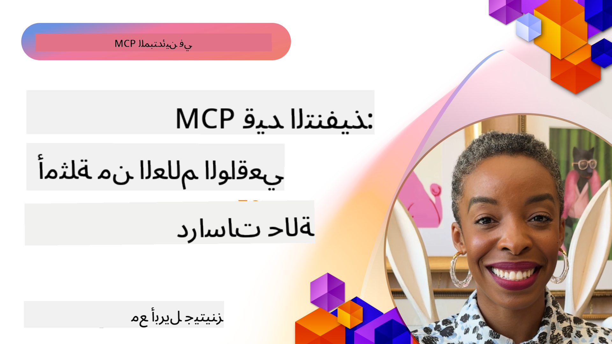

<!--
CO_OP_TRANSLATOR_METADATA:
{
  "original_hash": "1611dc5f6a2a35a789fc4c95fc5bfbe8",
  "translation_date": "2025-09-26T17:41:37+00:00",
  "source_file": "09-CaseStudy/README.md",
  "language_code": "ar"
}
-->
# MCP في التطبيق: دراسات حالة واقعية

_(انقر على الصورة أعلاه لمشاهدة فيديو الدرس)_

بروتوكول سياق النموذج (MCP) يغير طريقة تفاعل تطبيقات الذكاء الاصطناعي مع البيانات والأدوات والخدمات. يقدم هذا القسم دراسات حالة واقعية توضح التطبيقات العملية لـ MCP في مختلف سيناريوهات المؤسسات.

## نظرة عامة

يستعرض هذا القسم أمثلة ملموسة لتطبيقات MCP، مسلطًا الضوء على كيفية استفادة المؤسسات من هذا البروتوكول لحل تحديات الأعمال المعقدة. من خلال دراسة هذه الحالات، ستكتسب رؤى حول مرونة MCP وقابليته للتوسع وفوائده العملية في السيناريوهات الواقعية.

## أهداف التعلم الرئيسية

من خلال استكشاف هذه الدراسات، ستتمكن من:

- فهم كيفية تطبيق MCP لحل مشاكل الأعمال المحددة
- التعرف على أنماط التكامل المختلفة والأساليب المعمارية
- التعرف على أفضل الممارسات لتطبيق MCP في بيئات المؤسسات
- اكتساب رؤى حول التحديات والحلول التي تم مواجهتها في التطبيقات الواقعية
- تحديد الفرص لتطبيق أنماط مشابهة في مشاريعك الخاصة

## دراسات الحالة المميزة

### 1. [وكلاء السفر باستخدام Azure AI – تطبيق مرجعي](./travelagentsample.md)

تتناول هذه الدراسة الحل المرجعي الشامل من Microsoft الذي يوضح كيفية بناء تطبيق تخطيط سفر متعدد الوكلاء مدعوم بالذكاء الاصطناعي باستخدام MCP وAzure OpenAI وAzure AI Search. المشروع يبرز:

- تنسيق متعدد الوكلاء عبر MCP
- تكامل بيانات المؤسسات باستخدام Azure AI Search
- بنية آمنة وقابلة للتوسع باستخدام خدمات Azure
- أدوات قابلة للتوسيع مع مكونات MCP القابلة لإعادة الاستخدام
- تجربة مستخدم محادثة مدعومة بـ Azure OpenAI

تفاصيل البنية والتنفيذ توفر رؤى قيمة لبناء أنظمة متعددة الوكلاء مع MCP كطبقة تنسيق.

### 2. [تحديث عناصر Azure DevOps باستخدام بيانات YouTube](./UpdateADOItemsFromYT.md)

توضح هذه الدراسة تطبيقًا عمليًا لـ MCP لأتمتة عمليات سير العمل. تُظهر كيف يمكن استخدام أدوات MCP لـ:

- استخراج البيانات من المنصات عبر الإنترنت (YouTube)
- تحديث عناصر العمل في أنظمة Azure DevOps
- إنشاء سير عمل أتمتة قابلة للتكرار
- تكامل البيانات عبر أنظمة مختلفة

هذا المثال يوضح كيف يمكن لتطبيقات MCP البسيطة تحقيق مكاسب كبيرة في الكفاءة من خلال أتمتة المهام الروتينية وتحسين تناسق البيانات عبر الأنظمة.

### 3. [استرجاع الوثائق في الوقت الحقيقي باستخدام MCP](./docs-mcp/README.md)

توجهك هذه الدراسة خلال عملية ربط عميل Python console بخادم Model Context Protocol (MCP) لاسترجاع وتسجيل وثائق Microsoft في الوقت الحقيقي وبطريقة واعية للسياق. ستتعلم كيفية:

- الاتصال بخادم MCP باستخدام عميل Python وSDK الرسمي لـ MCP
- استخدام عملاء HTTP المتدفقة لاسترجاع البيانات بكفاءة وفي الوقت الحقيقي
- استدعاء أدوات الوثائق على الخادم وتسجيل الردود مباشرة في وحدة التحكم
- دمج وثائق Microsoft المحدثة في سير عملك دون مغادرة الطرفية

الفصل يتضمن مهمة عملية، نموذج كود عملي، وروابط لموارد إضافية للتعلم العميق. شاهد الشرح الكامل والكود في الفصل المرتبط لفهم كيف يمكن لـ MCP تحسين الوصول إلى الوثائق وإنتاجية المطورين في بيئات الطرفية.

### 4. [تطبيق ويب مولد خطة دراسة تفاعلية باستخدام MCP](./docs-mcp/README.md)

توضح هذه الدراسة كيفية بناء تطبيق ويب تفاعلي باستخدام Chainlit وبروتوكول MCP لإنشاء خطط دراسة شخصية لأي موضوع. يمكن للمستخدمين تحديد موضوع (مثل "شهادة AI-900") ومدة الدراسة (مثل 8 أسابيع)، وسيقوم التطبيق بتقديم تقسيم أسبوعي للمحتوى الموصى به. يوفر Chainlit واجهة محادثة تجعل التجربة تفاعلية وقابلة للتكيف.

- تطبيق ويب محادثة مدعوم بـ Chainlit
- مطالبات موجهة من المستخدم لتحديد الموضوع والمدة
- توصيات محتوى أسبوعية باستخدام MCP
- ردود تفاعلية في الوقت الحقيقي عبر واجهة محادثة

المشروع يوضح كيف يمكن دمج الذكاء الاصطناعي المحادثي وMCP لإنشاء أدوات تعليمية ديناميكية يقودها المستخدم في بيئة ويب حديثة.

### 5. [وثائق داخل المحرر باستخدام خادم MCP في VS Code](./docs-mcp/README.md)

توضح هذه الدراسة كيفية جلب وثائق Microsoft Learn مباشرة إلى بيئة VS Code باستخدام خادم MCP—دون الحاجة للتبديل بين علامات التبويب في المتصفح! ستتعلم كيفية:

- البحث وقراءة الوثائق داخل VS Code باستخدام لوحة MCP أو قائمة الأوامر
- الرجوع إلى الوثائق وإدراج الروابط مباشرة في ملفات README أو ملفات Markdown الخاصة بالدورة
- استخدام GitHub Copilot وMCP معًا لتوثيق سلس مدعوم بالذكاء الاصطناعي وسير عمل الكود
- التحقق من الوثائق وتحسينها باستخدام ردود فعل في الوقت الحقيقي ودقة مستمدة من Microsoft
- دمج MCP مع سير عمل GitHub للتحقق المستمر من الوثائق

التنفيذ يتضمن:

- مثال على تكوين `.vscode/mcp.json` للإعداد السهل
- شروحات مصورة لتجربة داخل المحرر
- نصائح للجمع بين Copilot وMCP لتحقيق أقصى إنتاجية

هذا السيناريو مثالي لمؤلفي الدورات، كتاب الوثائق، والمطورين الذين يرغبون في البقاء مركزين في محررهم أثناء العمل مع الوثائق، Copilot، وأدوات التحقق—كلها مدعومة بـ MCP.

### 6. [إنشاء خادم MCP باستخدام APIM](./apimsample.md)

تقدم هذه الدراسة دليلًا خطوة بخطوة حول كيفية إنشاء خادم MCP باستخدام إدارة واجهات برمجة التطبيقات في Azure (APIM). تغطي:

- إعداد خادم MCP في إدارة واجهات برمجة التطبيقات في Azure
- عرض عمليات API كأدوات MCP
- تكوين السياسات لتحديد المعدل والأمان
- اختبار خادم MCP باستخدام Visual Studio Code وGitHub Copilot

هذا المثال يوضح كيفية الاستفادة من قدرات Azure لإنشاء خادم MCP قوي يمكن استخدامه في تطبيقات متنوعة، مما يعزز تكامل أنظمة الذكاء الاصطناعي مع واجهات برمجة التطبيقات الخاصة بالمؤسسات.

### 7. [سجل MCP في GitHub — تسريع التكامل الوكيل](https://github.com/mcp)

تتناول هذه الدراسة كيف أن سجل MCP في GitHub، الذي تم إطلاقه في سبتمبر 2025، يعالج تحديًا حاسمًا في نظام الذكاء الاصطناعي: اكتشاف ونشر خوادم MCP المتناثرة.

#### نظرة عامة
يحل **سجل MCP** مشكلة تزايد خوادم MCP المتناثرة عبر المستودعات والسجلات، مما كان يجعل التكامل بطيئًا وعرضة للأخطاء. هذه الخوادم تمكن وكلاء الذكاء الاصطناعي من التفاعل مع الأنظمة الخارجية مثل واجهات برمجة التطبيقات، قواعد البيانات، ومصادر الوثائق.

#### بيان المشكلة
واجه المطورون الذين يبنون سير عمل وكيل تحديات عدة:
- **ضعف إمكانية الاكتشاف** لخوادم MCP عبر منصات مختلفة
- **أسئلة إعداد متكررة** متناثرة عبر المنتديات والوثائق
- **مخاطر أمنية** من مصادر غير موثوقة وغير معتمدة
- **نقص في التوحيد القياسي** لجودة الخوادم وتوافقها

#### بنية الحل
يعمل سجل MCP في GitHub على مركزية خوادم MCP الموثوقة مع ميزات رئيسية:
- **تثبيت بنقرة واحدة** للتكامل عبر VS Code لتسهيل الإعداد
- **فرز الإشارة على الضوضاء** حسب النجوم، النشاط، والتحقق المجتمعي
- **تكامل مباشر** مع GitHub Copilot وأدوات أخرى متوافقة مع MCP
- **نموذج مساهمة مفتوح** يتيح للمجتمع وشركاء المؤسسات المساهمة

#### تأثير الأعمال
حقق السجل تحسينات قابلة للقياس:
- **تسريع عملية الإعداد** للمطورين باستخدام أدوات مثل خادم Microsoft Learn MCP، الذي يبث الوثائق الرسمية مباشرة إلى الوكلاء
- **زيادة الإنتاجية** عبر خوادم متخصصة مثل `github-mcp-server`، التي تمكن أتمتة GitHub بلغة طبيعية (إنشاء PR، إعادة تشغيل CI، فحص الكود)
- **تعزيز الثقة في النظام البيئي** من خلال قوائم منسقة ومعايير تكوين شفافة

#### القيمة الاستراتيجية
للممارسين المتخصصين في إدارة دورة حياة الوكلاء وسير العمل القابل للتكرار، يوفر سجل MCP:
- **قدرات نشر وكيل معيارية** بمكونات موحدة
- **أنابيب تقييم مدعومة بالسجل** لاختبار وتحقق متسق
- **توافق عبر الأدوات** يتيح التكامل السلس عبر منصات الذكاء الاصطناعي المختلفة

توضح هذه الدراسة أن سجل MCP ليس مجرد دليل—بل هو منصة أساسية لتكامل النماذج القابلة للتوسع ونشر أنظمة الوكلاء.

## الخاتمة

توضح هذه الدراسات السبع الشاملة التنوع المذهل والتطبيقات العملية لبروتوكول سياق النموذج عبر سيناريوهات واقعية متنوعة. من أنظمة تخطيط السفر متعددة الوكلاء المعقدة وإدارة واجهات برمجة التطبيقات للمؤسسات إلى سير عمل الوثائق المبسط وسجل MCP الثوري في GitHub، تعرض هذه الأمثلة كيف يوفر MCP طريقة موحدة وقابلة للتوسع لربط أنظمة الذكاء الاصطناعي بالأدوات والبيانات والخدمات التي تحتاجها لتقديم قيمة استثنائية.

تغطي دراسات الحالة أبعادًا متعددة لتطبيق MCP:
- **تكامل المؤسسات**: إدارة واجهات برمجة التطبيقات في Azure وأتمتة Azure DevOps
- **تنسيق متعدد الوكلاء**: تخطيط السفر باستخدام وكلاء الذكاء الاصطناعي المنسقين
- **إنتاجية المطورين**: تكامل VS Code والوصول إلى الوثائق في الوقت الحقيقي
- **تطوير النظام البيئي**: سجل MCP في GitHub كمنصة أساسية
- **التطبيقات التعليمية**: مولد خطط الدراسة التفاعلية وواجهات المحادثة

من خلال دراسة هذه التطبيقات، ستكتسب رؤى حاسمة حول:
- **أنماط معمارية** لمقاييس واستخدامات مختلفة
- **استراتيجيات التنفيذ** التي توازن بين الوظائف وقابلية الصيانة
- **اعتبارات الأمان وقابلية التوسع** للنشر في الإنتاج
- **أفضل الممارسات** لتطوير خوادم MCP وتكامل العملاء
- **تفكير النظام البيئي** لبناء حلول مترابطة مدعومة بالذكاء الاصطناعي

توضح هذه الأمثلة بشكل جماعي أن MCP ليس مجرد إطار نظري بل بروتوكول ناضج وجاهز للإنتاج يمكّن حلولًا عملية لتحديات الأعمال المعقدة. سواء كنت تبني أدوات أتمتة بسيطة أو أنظمة متعددة الوكلاء متطورة، فإن الأنماط والأساليب الموضحة هنا توفر أساسًا قويًا لمشاريع MCP الخاصة بك.

## موارد إضافية

- [مستودع وكلاء السفر باستخدام Azure AI على GitHub](https://github.com/Azure-Samples/azure-ai-travel-agents)
- [أداة Azure DevOps MCP](https://github.com/microsoft/azure-devops-mcp)
- [أداة Playwright MCP](https://github.com/microsoft/playwright-mcp)
- [خادم وثائق Microsoft MCP](https://github.com/MicrosoftDocs/mcp)
- [سجل MCP في GitHub — تسريع التكامل الوكيل](https://github.com/mcp)
- [أمثلة مجتمع MCP](https://github.com/microsoft/mcp)

التالي: مختبر عملي [تبسيط سير عمل الذكاء الاصطناعي: بناء خادم MCP باستخدام أدوات الذكاء الاصطناعي](../10-StreamliningAIWorkflowsBuildingAnMCPServerWithAIToolkit/README.md)

---

