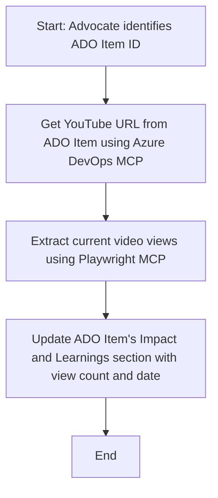

<!--
CO_OP_TRANSLATOR_METADATA:
{
  "original_hash": "14a2dfbea55ef735660a06bd6bdfe5f3",
  "translation_date": "2025-07-14T06:08:53+00:00",
  "source_file": "09-CaseStudy/UpdateADOItemsFromYT.md",
  "language_code": "ar"
}
-->
# دراسة حالة: تحديث عناصر Azure DevOps باستخدام بيانات YouTube مع MCP

> **تنويه:** توجد أدوات وتقارير عبر الإنترنت يمكنها أتمتة عملية تحديث عناصر Azure DevOps باستخدام بيانات من منصات مثل YouTube. السيناريو التالي مقدم كمثال توضيحي فقط لكيفية استخدام أدوات MCP في مهام الأتمتة والتكامل.

## نظرة عامة

تُظهر هذه الدراسة مثالًا على كيفية استخدام بروتوكول سياق النموذج (MCP) وأدواته لأتمتة تحديث عناصر العمل في Azure DevOps (ADO) بمعلومات مأخوذة من منصات عبر الإنترنت مثل YouTube. السيناريو الموضح هو مجرد توضيح لإمكانيات هذه الأدوات الأوسع، والتي يمكن تكييفها لتلبية العديد من احتياجات الأتمتة المشابهة.

في هذا المثال، يقوم Advocate بتتبع الجلسات عبر الإنترنت باستخدام عناصر ADO، حيث يحتوي كل عنصر على رابط فيديو YouTube. من خلال الاستفادة من أدوات MCP، يمكن لـ Advocate تحديث عناصر ADO بأحدث مقاييس الفيديو، مثل عدد المشاهدات، بطريقة متكررة وآلية. يمكن تعميم هذا النهج على حالات أخرى تتطلب دمج معلومات من مصادر عبر الإنترنت في ADO أو أنظمة أخرى.

## السيناريو

يتولى Advocate مسؤولية تتبع تأثير الجلسات عبر الإنترنت وتفاعل المجتمع. يتم تسجيل كل جلسة كعنصر عمل في مشروع 'DevRel' داخل ADO، ويحتوي عنصر العمل على حقل لرابط فيديو YouTube. لتقديم تقرير دقيق عن مدى وصول الجلسة، يحتاج Advocate إلى تحديث عنصر ADO بعدد المشاهدات الحالي للفيديو وتاريخ استرجاع هذه المعلومات.

## الأدوات المستخدمة

- [Azure DevOps MCP](https://github.com/microsoft/azure-devops-mcp): يتيح الوصول البرمجي وتحديث عناصر العمل في ADO عبر MCP.
- [Playwright MCP](https://github.com/microsoft/playwright-mcp): يتيح أتمتة إجراءات المتصفح لاستخراج البيانات الحية من صفحات الويب، مثل إحصائيات فيديو YouTube.

## سير العمل خطوة بخطوة

1. **تحديد عنصر ADO**: ابدأ بمعرف عنصر العمل في ADO (مثلاً 1234) في مشروع 'DevRel'.
2. **استرجاع رابط YouTube**: استخدم أداة Azure DevOps MCP للحصول على رابط YouTube من عنصر العمل.
3. **استخراج عدد المشاهدات**: استخدم أداة Playwright MCP للتنقل إلى رابط YouTube واستخراج عدد المشاهدات الحالي.
4. **تحديث عنصر ADO**: قم بكتابة أحدث عدد مشاهدات وتاريخ الاسترجاع في قسم 'Impact and Learnings' في عنصر العمل باستخدام أداة Azure DevOps MCP.

## مثال على الأمر

```bash
- Work with the ADO Item ID: 1234
- The project is '2025-Awesome'
- Get the YouTube URL for the ADO item
- Use Playwright to get the current views from the YouTube video
- Update the ADO item with the current video views and the updated date of the information
```

## مخطط تدفق Mermaid



## التنفيذ التقني

- **تنسيق MCP**: يتم تنسيق سير العمل بواسطة خادم MCP، الذي ينسق استخدام كل من أدوات Azure DevOps MCP وPlaywright MCP.
- **الأتمتة**: يمكن تشغيل العملية يدويًا أو جدولتها لتعمل بشكل دوري للحفاظ على تحديث عناصر ADO.
- **قابلية التوسع**: يمكن توسيع نفس النمط لتحديث عناصر ADO بمقاييس أخرى عبر الإنترنت (مثل الإعجابات، التعليقات) أو من منصات أخرى.

## النتائج والتأثير

- **الكفاءة**: يقلل الجهد اليدوي على Advocates من خلال أتمتة استرجاع وتحديث مقاييس الفيديو.
- **الدقة**: يضمن أن تعكس عناصر ADO أحدث البيانات المتاحة من المصادر عبر الإنترنت.
- **القابلية لإعادة الاستخدام**: يوفر سير عمل قابل لإعادة الاستخدام لحالات مشابهة تتضمن مصادر بيانات أو مقاييس أخرى.

## المراجع

- [Azure DevOps MCP](https://github.com/microsoft/azure-devops-mcp)
- [Playwright MCP](https://github.com/microsoft/playwright-mcp)
- [Model Context Protocol (MCP)](https://modelcontextprotocol.io/)

**إخلاء المسؤولية**:  
تمت ترجمة هذا المستند باستخدام خدمة الترجمة الآلية [Co-op Translator](https://github.com/Azure/co-op-translator). بينما نسعى لتحقيق الدقة، يرجى العلم أن الترجمات الآلية قد تحتوي على أخطاء أو عدم دقة. يجب اعتبار المستند الأصلي بلغته الأصلية المصدر الموثوق به. للمعلومات الهامة، يُنصح بالاعتماد على الترجمة البشرية المهنية. نحن غير مسؤولين عن أي سوء فهم أو تفسير ناتج عن استخدام هذه الترجمة.