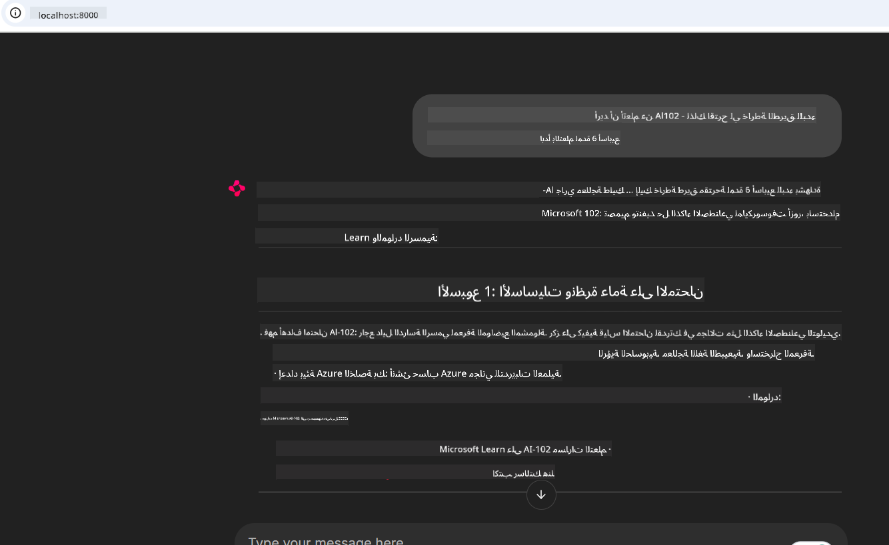

<!--
CO_OP_TRANSLATOR_METADATA:
{
  "original_hash": "4319d291c9d124ecafea52b3d04bfa0e",
  "translation_date": "2025-07-14T06:18:13+00:00",
  "source_file": "09-CaseStudy/docs-mcp/README.md",
  "language_code": "ar"
}
-->
# دراسة حالة: الاتصال بخادم Microsoft Learn Docs MCP من عميل

هل وجدت نفسك يومًا تتنقل بين مواقع التوثيق، Stack Overflow، وعشرات علامات التبويب في محرك البحث، بينما تحاول حل مشكلة في كودك؟ ربما تحتفظ بشاشة ثانية فقط للوثائق، أو تقوم بالتبديل المستمر بين بيئة التطوير والمتصفح. ألن يكون أفضل لو استطعت دمج التوثيق مباشرة في سير عملك—مُدمجًا في تطبيقاتك، بيئة التطوير، أو حتى أدواتك المخصصة؟ في هذه الدراسة، سنستعرض كيف تفعل ذلك بالضبط من خلال الاتصال مباشرة بخادم Microsoft Learn Docs MCP من تطبيق العميل الخاص بك.

## نظرة عامة

التطوير الحديث ليس مجرد كتابة كود—بل هو العثور على المعلومات الصحيحة في الوقت المناسب. التوثيق موجود في كل مكان، لكنه نادرًا ما يكون حيث تحتاجه أكثر: داخل أدواتك وسير عملك. من خلال دمج استرجاع التوثيق مباشرة في تطبيقاتك، يمكنك توفير الوقت، تقليل التنقل بين السياقات، وزيادة الإنتاجية. في هذا القسم، سنوضح لك كيفية توصيل عميل بخادم Microsoft Learn Docs MCP، لتتمكن من الوصول إلى توثيق في الوقت الحقيقي وذو سياق دون مغادرة تطبيقك.

سنمر معًا بعملية إنشاء الاتصال، إرسال الطلب، والتعامل مع الاستجابات المتدفقة بكفاءة. هذا النهج لا يبسط سير عملك فحسب، بل يفتح الباب لبناء أدوات تطوير أكثر ذكاءً وفائدة.

## أهداف التعلم

لماذا نفعل هذا؟ لأن أفضل تجارب المطورين هي التي تزيل العقبات. تخيل عالمًا يستطيع فيه محرر الكود، أو روبوت الدردشة، أو تطبيق الويب الخاص بك الإجابة على أسئلة التوثيق فورًا، باستخدام أحدث المحتويات من Microsoft Learn. بنهاية هذا الفصل، ستتمكن من:

- فهم أساسيات التواصل بين خادم MCP والعميل لاسترجاع التوثيق
- تنفيذ تطبيق وحدة تحكم أو ويب للاتصال بخادم Microsoft Learn Docs MCP
- استخدام عملاء HTTP المتدفقين لاسترجاع التوثيق في الوقت الحقيقي
- تسجيل وتفسير استجابات التوثيق في تطبيقك

سترى كيف تساعدك هذه المهارات في بناء أدوات ليست فقط تفاعلية، بل ذكية وواعية للسياق.

## السيناريو 1 - استرجاع التوثيق في الوقت الحقيقي مع MCP

في هذا السيناريو، سنوضح لك كيفية توصيل عميل بخادم Microsoft Learn Docs MCP، لتتمكن من الوصول إلى توثيق في الوقت الحقيقي وذو سياق دون مغادرة تطبيقك.

لنطبق ذلك عمليًا. مهمتك هي كتابة تطبيق يتصل بخادم Microsoft Learn Docs MCP، يستدعي أداة `microsoft_docs_search`، ويسجل الاستجابة المتدفقة في وحدة التحكم.

### لماذا هذا النهج؟
لأنه الأساس لبناء تكاملات أكثر تقدمًا—سواء أردت تشغيل روبوت دردشة، إضافة لبيئة التطوير، أو لوحة تحكم ويب.

ستجد الكود والتعليمات لهذا السيناريو في مجلد [`solution`](./solution/README.md) ضمن هذه الدراسة. الخطوات سترشدك لإعداد الاتصال:
- استخدام SDK الرسمي لـ MCP وعميل HTTP قابل للتدفق للاتصال
- استدعاء أداة `microsoft_docs_search` مع معلمة استعلام لاسترجاع التوثيق
- تنفيذ تسجيل مناسب والتعامل مع الأخطاء
- إنشاء واجهة وحدة تحكم تفاعلية للسماح للمستخدمين بإدخال استعلامات بحث متعددة

يوضح هذا السيناريو كيفية:
- الاتصال بخادم Docs MCP
- إرسال استعلام
- تحليل وطباعة النتائج

إليك كيف قد يبدو تشغيل الحل:

```
Prompt> What is Azure Key Vault?
Answer> Azure Key Vault is a cloud service for securely storing and accessing secrets. ...
```

فيما يلي نموذج حل بسيط. الكود الكامل والتفاصيل متوفرة في مجلد الحل.

<details>
<summary>بايثون</summary>

```python
import asyncio
from mcp.client.streamable_http import streamablehttp_client
from mcp import ClientSession

async def main():
    async with streamablehttp_client("https://learn.microsoft.com/api/mcp") as (read_stream, write_stream, _):
        async with ClientSession(read_stream, write_stream) as session:
            await session.initialize()
            result = await session.call_tool("microsoft_docs_search", {"query": "Azure Functions best practices"})
            print(result.content)

if __name__ == "__main__":
    asyncio.run(main())
```

- للتنفيذ الكامل والتسجيل، راجع [`scenario1.py`](../../../../09-CaseStudy/docs-mcp/solution/python/scenario1.py).
- لتعليمات التثبيت والاستخدام، راجع ملف [`README.md`](./solution/python/README.md) في نفس المجلد.
</details>

## السيناريو 2 - تطبيق ويب تفاعلي لإنشاء خطة دراسة مع MCP

في هذا السيناريو، ستتعلم كيفية دمج Docs MCP في مشروع تطوير ويب. الهدف هو تمكين المستخدمين من البحث في توثيق Microsoft Learn مباشرة من واجهة ويب، مما يجعل التوثيق متاحًا فورًا داخل تطبيقك أو موقعك.

ستتعلم كيفية:
- إعداد تطبيق ويب
- الاتصال بخادم Docs MCP
- التعامل مع إدخال المستخدم وعرض النتائج

إليك كيف قد يبدو تشغيل الحل:

```
User> I want to learn about AI102 - so suggest the roadmap to get it started from learn for 6 weeks

Assistant> Here’s a detailed 6-week roadmap to start your preparation for the AI-102: Designing and Implementing a Microsoft Azure AI Solution certification, using official Microsoft resources and focusing on exam skills areas:

---
## Week 1: Introduction & Fundamentals
- **Understand the Exam**: Review the [AI-102 exam skills outline](https://learn.microsoft.com/en-us/credentials/certifications/exams/ai-102/).
- **Set up Azure**: Sign up for a free Azure account if you don't have one.
- **Learning Path**: [Introduction to Azure AI services](https://learn.microsoft.com/en-us/training/modules/intro-to-azure-ai/)
- **Focus**: Get familiar with Azure portal, AI capabilities, and necessary tools.

....more weeks of the roadmap...

Let me know if you want module-specific recommendations or need more customized weekly tasks!
```

فيما يلي نموذج حل بسيط. الكود الكامل والتفاصيل متوفرة في مجلد الحل.



<details>
<summary>بايثون (Chainlit)</summary>

Chainlit هو إطار عمل لبناء تطبيقات ويب تعتمد على الذكاء الاصطناعي التفاعلي. يسهل إنشاء روبوتات دردشة ومساعدين يمكنهم استدعاء أدوات MCP وعرض النتائج في الوقت الحقيقي. مثالي للنماذج الأولية السريعة والواجهات سهلة الاستخدام.

```python
import chainlit as cl
import requests

MCP_URL = "https://learn.microsoft.com/api/mcp"

@cl.on_message
def handle_message(message):
    query = {"question": message}
    response = requests.post(MCP_URL, json=query)
    if response.ok:
        result = response.json()
        cl.Message(content=result.get("answer", "No answer found.")).send()
    else:
        cl.Message(content="Error: " + response.text).send()
```

- للتنفيذ الكامل، راجع [`scenario2.py`](../../../../09-CaseStudy/docs-mcp/solution/python/scenario2.py).
- لتعليمات الإعداد والتشغيل، راجع [`README.md`](./solution/python/README.md).
</details>

## السيناريو 3: التوثيق داخل المحرر مع خادم MCP في VS Code

إذا كنت تريد الحصول على توثيق Microsoft Learn مباشرة داخل VS Code (بدلاً من التبديل بين علامات تبويب المتصفح)، يمكنك استخدام خادم MCP في محررك. هذا يتيح لك:
- البحث وقراءة التوثيق في VS Code دون مغادرة بيئة البرمجة.
- الرجوع إلى التوثيق وإدراج الروابط مباشرة في ملفات README أو ملفات الدورات.
- الاستفادة من GitHub Copilot و MCP معًا لسير عمل توثيقي مدعوم بالذكاء الاصطناعي بسلاسة.

**ستتعلم كيف:**
- تضيف ملف `.vscode/mcp.json` صالح إلى جذر مساحة العمل (انظر المثال أدناه).
- تفتح لوحة MCP أو تستخدم لوحة الأوامر في VS Code للبحث وإدراج التوثيق.
- تشير إلى التوثيق مباشرة في ملفات markdown أثناء العمل.
- تدمج هذا الأسلوب مع GitHub Copilot لمزيد من الإنتاجية.

إليك مثال على كيفية إعداد خادم MCP في VS Code:

```json
{
  "servers": {
    "LearnDocsMCP": {
      "url": "https://learn.microsoft.com/api/mcp"
    }
  }
}
```

</details>

> للحصول على شرح مفصل مع لقطات شاشة ودليل خطوة بخطوة، راجع [`README.md`](./solution/scenario3/README.md).


هذا النهج مثالي لأي شخص يبني دورات تقنية، يكتب توثيقًا، أو يطور كودًا يحتاج إلى مراجع متكررة.

## النقاط الرئيسية

دمج التوثيق مباشرة في أدواتك ليس مجرد تسهيل—بل هو تغيير قواعد اللعبة للإنتاجية. من خلال الاتصال بخادم Microsoft Learn Docs MCP من عميلك، يمكنك:

- القضاء على التنقل بين الكود والتوثيق
- استرجاع توثيق محدث وذو سياق في الوقت الحقيقي
- بناء أدوات تطوير أكثر ذكاءً وتفاعلية

هذه المهارات ستساعدك على إنشاء حلول ليست فقط فعالة، بل ممتعة في الاستخدام.

## موارد إضافية

لتعميق فهمك، استكشف هذه الموارد الرسمية:

- [Microsoft Learn Docs MCP Server (GitHub)](https://github.com/MicrosoftDocs/mcp)
- [البدء مع Azure MCP Server (mcp-python)](https://learn.microsoft.com/en-us/azure/developer/azure-mcp-server/get-started#create-the-python-app)
- [ما هو Azure MCP Server؟](https://learn.microsoft.com/en-us/azure/developer/azure-mcp-server/)
- [مقدمة في Model Context Protocol (MCP)](https://modelcontextprotocol.io/introduction)
- [إضافة الإضافات من خادم MCP (بايثون)](https://learn.microsoft.com/en-us/semantic-kernel/concepts/plugins/adding-mcp-plugins)

**إخلاء المسؤولية**:  
تمت ترجمة هذا المستند باستخدام خدمة الترجمة الآلية [Co-op Translator](https://github.com/Azure/co-op-translator). بينما نسعى لتحقيق الدقة، يرجى العلم أن الترجمات الآلية قد تحتوي على أخطاء أو عدم دقة. يجب اعتبار المستند الأصلي بلغته الأصلية المصدر الموثوق به. للمعلومات الهامة، يُنصح بالاعتماد على الترجمة البشرية المهنية. نحن غير مسؤولين عن أي سوء فهم أو تفسير ناتج عن استخدام هذه الترجمة.