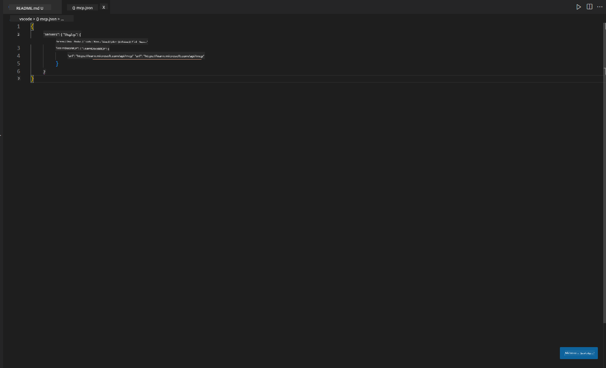
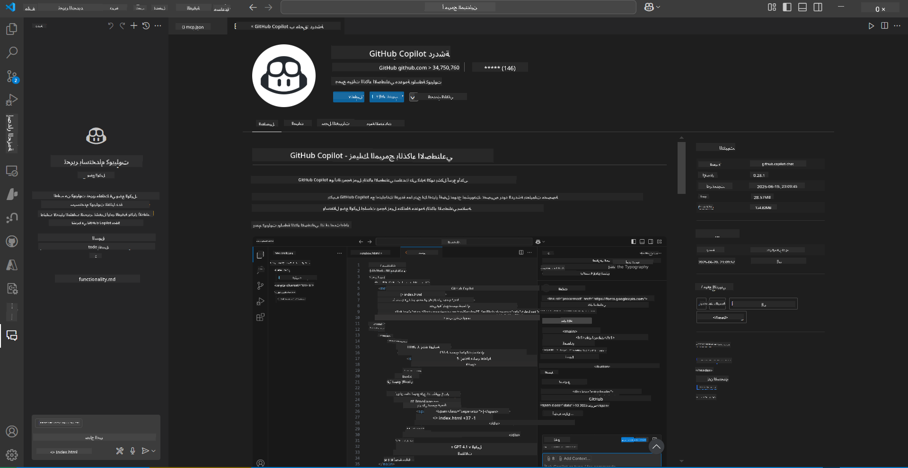
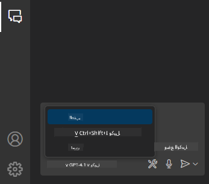
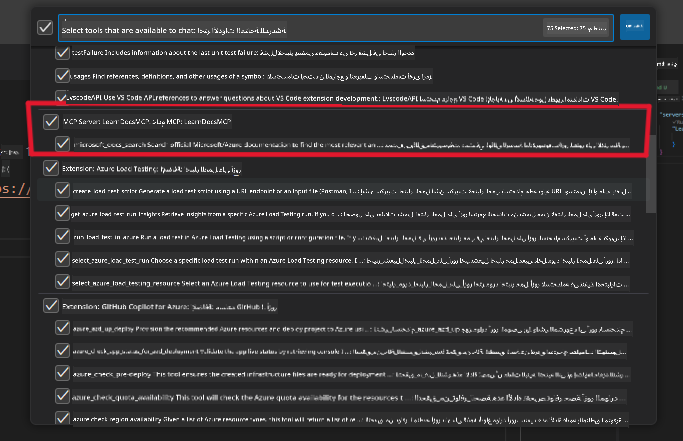
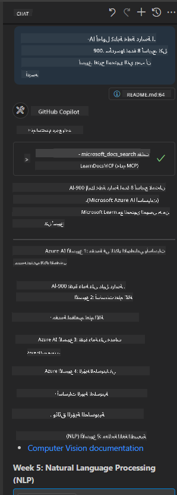
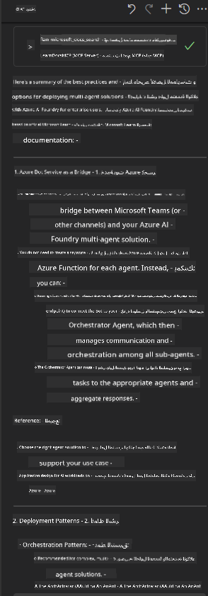

<!--
CO_OP_TRANSLATOR_METADATA:
{
  "original_hash": "db532b1ec386c9ce38c791653dc3c881",
  "translation_date": "2025-07-14T06:46:45+00:00",
  "source_file": "09-CaseStudy/docs-mcp/solution/scenario3/README.md",
  "language_code": "ar"
}
-->
# السيناريو 3: توثيق داخل المحرر مع خادم MCP في VS Code

## نظرة عامة

في هذا السيناريو، ستتعلم كيفية جلب مستندات Microsoft Learn مباشرة إلى بيئة Visual Studio Code الخاصة بك باستخدام خادم MCP. بدلاً من التنقل المستمر بين علامات التبويب في المتصفح للبحث عن التوثيق، يمكنك الوصول إلى المستندات الرسمية والبحث فيها والرجوع إليها داخل المحرر نفسه. هذه الطريقة تبسط سير عملك، تحافظ على تركيزك، وتمكّنك من التكامل السلس مع أدوات مثل GitHub Copilot.

- ابحث واقرأ المستندات داخل VS Code دون مغادرة بيئة البرمجة.
- أدرج مراجع وروابط التوثيق مباشرة في ملفات README أو ملفات الدورة التدريبية.
- استخدم GitHub Copilot وMCP معًا لسير عمل موحد مدعوم بالذكاء الاصطناعي.

## أهداف التعلم

بنهاية هذا الفصل، ستفهم كيفية إعداد واستخدام خادم MCP داخل VS Code لتعزيز توثيقك وسير عمل التطوير. ستكون قادرًا على:

- تكوين مساحة العمل لاستخدام خادم MCP للبحث في التوثيق.
- البحث وإدراج التوثيق مباشرة من داخل VS Code.
- دمج قوة GitHub Copilot وMCP لسير عمل أكثر إنتاجية مدعوم بالذكاء الاصطناعي.

هذه المهارات ستساعدك على الحفاظ على تركيزك، تحسين جودة التوثيق، وزيادة إنتاجيتك كمطور أو كاتب تقني.

## الحل

للوصول إلى التوثيق داخل المحرر، ستتبع سلسلة من الخطوات التي تدمج خادم MCP مع VS Code وGitHub Copilot. هذا الحل مثالي لمؤلفي الدورات، كتاب التوثيق، والمطورين الذين يرغبون في الحفاظ على تركيزهم داخل المحرر أثناء العمل مع المستندات وCopilot.

- أضف بسرعة روابط مرجعية إلى README أثناء كتابة دورة أو توثيق مشروع.
- استخدم Copilot لتوليد الكود وMCP للعثور فورًا على المستندات ذات الصلة والاستشهاد بها.
- حافظ على تركيزك داخل المحرر وزد من إنتاجيتك.

### دليل خطوة بخطوة

للبدء، اتبع هذه الخطوات. يمكنك إضافة لقطة شاشة من مجلد الأصول لكل خطوة لتوضيح العملية بصريًا.

1. **أضف تكوين MCP:**
   في جذر مشروعك، أنشئ ملف `.vscode/mcp.json` وأضف التكوين التالي:
   ```json
   {
     "servers": {
       "LearnDocsMCP": {
         "url": "https://learn.microsoft.com/api/mcp"
       }
     }
   }
   ```
   هذا التكوين يوضح لـ VS Code كيفية الاتصال بـ [`Microsoft Learn Docs MCP server`](https://github.com/MicrosoftDocs/mcp).
   
   
    
2. **افتح لوحة دردشة GitHub Copilot:**
   إذا لم تكن قد ثبتت امتداد GitHub Copilot بعد، انتقل إلى عرض الإضافات في VS Code وقم بتثبيته. يمكنك تنزيله مباشرة من [Visual Studio Code Marketplace](https://marketplace.visualstudio.com/items?itemName=GitHub.copilot-chat). ثم افتح لوحة دردشة Copilot من الشريط الجانبي.

   

3. **فعّل وضع الوكيل وتحقق من الأدوات:**
   في لوحة دردشة Copilot، فعّل وضع الوكيل.

   

   بعد تفعيل وضع الوكيل، تحقق من أن خادم MCP مدرج كأحد الأدوات المتاحة. هذا يضمن أن وكيل Copilot يمكنه الوصول إلى خادم التوثيق لجلب المعلومات ذات الصلة.
   
   
4. **ابدأ دردشة جديدة واطرح استفسارك على الوكيل:**
   افتح دردشة جديدة في لوحة دردشة Copilot. يمكنك الآن طرح استفسارات التوثيق على الوكيل. سيستخدم الوكيل خادم MCP لجلب وعرض مستندات Microsoft Learn ذات الصلة مباشرة في المحرر.

   - *"أحاول كتابة خطة دراسة للموضوع X. سأدرسه لمدة 8 أسابيع، لكل أسبوع اقترح المحتوى الذي يجب أن أدرسه."*

   

5. **استعلام مباشر:**

   > لنأخذ استعلامًا مباشرًا من قسم [#get-help](https://discord.gg/D6cRhjHWSC) في Discord الخاص بـ Azure AI Foundry ([عرض الرسالة الأصلية](https://discord.com/channels/1113626258182504448/1385498306720829572)):
   
   *"أبحث عن إجابات حول كيفية نشر حل متعدد الوكلاء مع وكلاء AI مطورين على Azure AI Foundry. أرى أنه لا توجد طريقة نشر مباشرة، مثل قنوات Copilot Studio. فما هي الطرق المختلفة لنشر هذا الحل ليتمكن مستخدمو المؤسسات من التفاعل وإنجاز المهمة؟
هناك العديد من المقالات والمدونات التي تقول إنه يمكننا استخدام خدمة Azure Bot للقيام بهذا العمل والتي يمكن أن تعمل كجسر بين MS Teams ووكلاء Azure AI Foundry، فهل سينجح هذا إذا قمت بإعداد بوت Azure يتصل بوكيل المنسق على Azure AI Foundry عبر Azure function لأداء التنسيق، أم أحتاج إلى إنشاء Azure function لكل وكيل AI جزء من الحل متعدد الوكلاء للقيام بالتنسيق في إطار عمل البوت؟ أي اقتراحات أخرى مرحب بها."*

   

   سيرد الوكيل بروابط ومستندات ملخصة ذات صلة، يمكنك إدراجها مباشرة في ملفات markdown الخاصة بك أو استخدامها كمراجع في الكود.

### استعلامات نموذجية

إليك بعض الاستعلامات التي يمكنك تجربتها. ستوضح هذه الاستعلامات كيف يمكن لخادم MCP وCopilot العمل معًا لتوفير توثيق فوري وذكي وسياقي دون مغادرة VS Code:

- "أرني كيفية استخدام مشغلات Azure Functions."
- "أدرج رابطًا إلى التوثيق الرسمي لـ Azure Key Vault."
- "ما هي أفضل الممارسات لتأمين موارد Azure؟"
- "ابحث عن بداية سريعة لخدمات Azure AI."

هذه الاستعلامات ستوضح كيف يمكن لخادم MCP وCopilot العمل معًا لتوفير توثيق فوري وذكي وسياقي دون مغادرة VS Code.

---

**إخلاء المسؤولية**:  
تمت ترجمة هذا المستند باستخدام خدمة الترجمة الآلية [Co-op Translator](https://github.com/Azure/co-op-translator). بينما نسعى لتحقيق الدقة، يرجى العلم أن الترجمات الآلية قد تحتوي على أخطاء أو عدم دقة. يجب اعتبار المستند الأصلي بلغته الأصلية المصدر الموثوق به. للمعلومات الهامة، يُنصح بالترجمة البشرية المهنية. نحن غير مسؤولين عن أي سوء فهم أو تفسير ناتج عن استخدام هذه الترجمة.