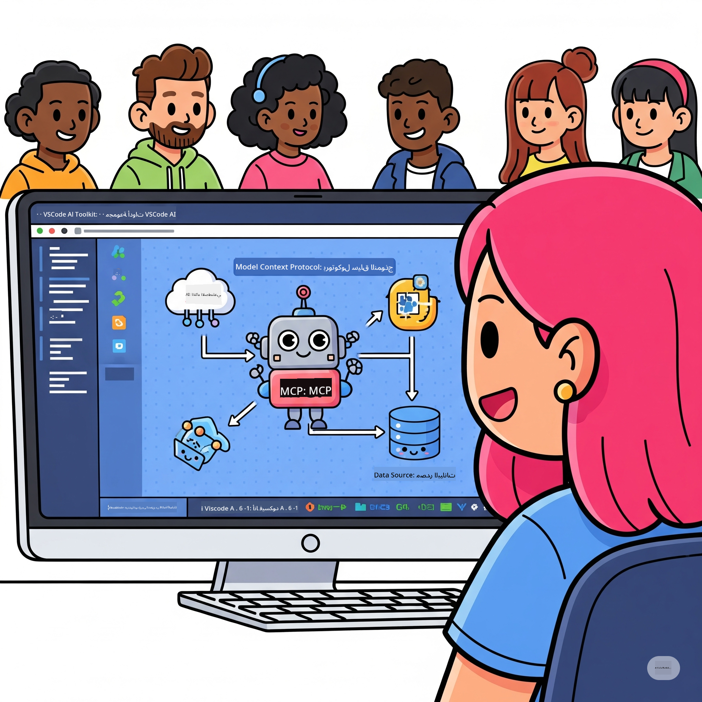
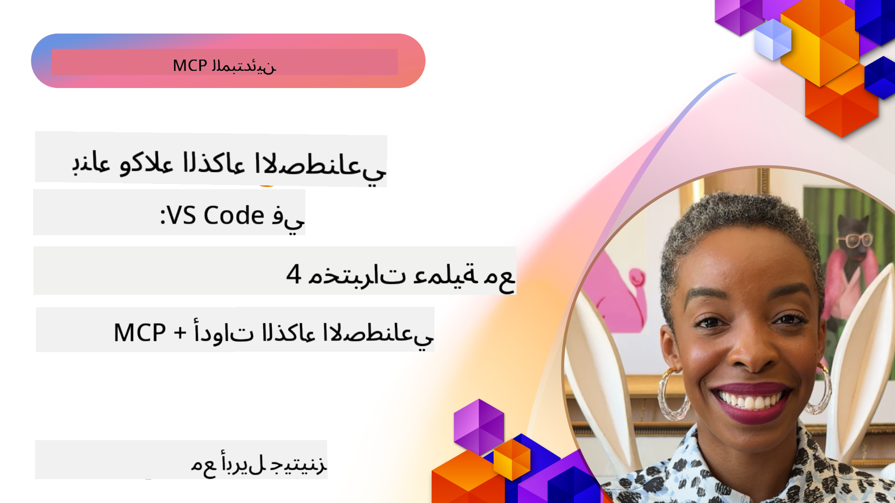

<!--
CO_OP_TRANSLATOR_METADATA:
{
  "original_hash": "1b000fd6e1b04c047578bfc5d07d54eb",
  "translation_date": "2025-08-18T13:52:19+00:00",
  "source_file": "10-StreamliningAIWorkflowsBuildingAnMCPServerWithAIToolkit/README.md",
  "language_code": "ar"
}
-->
# تبسيط سير العمل في الذكاء الاصطناعي: بناء خادم MCP باستخدام أدوات الذكاء الاصطناعي

## 🎯 نظرة عامة

_(انقر على الصورة أعلاه لمشاهدة فيديو هذا الدرس)_

مرحبًا بكم في **ورشة عمل بروتوكول سياق النماذج (MCP)**! تجمع هذه الورشة العملية الشاملة بين تقنيتين متقدمتين لتغيير قواعد اللعبة في تطوير تطبيقات الذكاء الاصطناعي:

- **🔗 بروتوكول سياق النماذج (MCP)**: معيار مفتوح لتكامل سلس بين أدوات الذكاء الاصطناعي
- **🛠️ أدوات الذكاء الاصطناعي لـ Visual Studio Code (AITK)**: إضافة قوية من مايكروسوفت لتطوير الذكاء الاصطناعي

### 🎓 ما ستتعلمه

بنهاية هذه الورشة، ستتقن فن بناء تطبيقات ذكية تربط بين نماذج الذكاء الاصطناعي والأدوات والخدمات الواقعية. من الاختبار الآلي إلى تكامل واجهات برمجة التطبيقات المخصصة، ستكتسب مهارات عملية لحل تحديات الأعمال المعقدة.

## 🏗️ حزمة التكنولوجيا

### 🔌 بروتوكول سياق النماذج (MCP)

MCP هو **"USB-C للذكاء الاصطناعي"** - معيار عالمي يربط نماذج الذكاء الاصطناعي بالأدوات ومصادر البيانات الخارجية.

**✨ الميزات الرئيسية:**

- 🔄 **تكامل موحد**: واجهة عالمية لربط أدوات الذكاء الاصطناعي
- 🏛️ **بنية مرنة**: خوادم محلية وعن بُعد عبر stdio/SSE
- 🧰 **نظام بيئي غني**: أدوات ومطالبات وموارد في بروتوكول واحد
- 🔒 **جاهزية للمؤسسات**: أمان وموثوقية مدمجة

**🎯 لماذا يعتبر MCP مهمًا:**
كما ألغى USB-C فوضى الكابلات، يلغي MCP تعقيد تكاملات الذكاء الاصطناعي. بروتوكول واحد، إمكانيات لا حصر لها.

### 🤖 أدوات الذكاء الاصطناعي لـ Visual Studio Code (AITK)

إضافة مايكروسوفت الرائدة التي تحول VS Code إلى منصة قوية لتطوير الذكاء الاصطناعي.

**🚀 القدرات الأساسية:**

- 📦 **كتالوج النماذج**: الوصول إلى نماذج من Azure AI، GitHub، Hugging Face، Ollama
- ⚡ **استدلال محلي**: تنفيذ ONNX محسّن لوحدات المعالجة المركزية/GPU/NPU
- 🏗️ **منشئ الوكلاء**: تطوير وكلاء ذكاء اصطناعي مرئي مع تكامل MCP
- 🎭 **دعم متعدد الوسائط**: نصوص، صور، ومخرجات منظمة

**💡 فوائد التطوير:**

- نشر النماذج بدون إعدادات مسبقة
- هندسة المطالبات بشكل مرئي
- ملعب اختبار في الوقت الفعلي
- تكامل سلس مع خوادم MCP

## 📚 رحلة التعلم

### [🚀 الوحدة 1: أساسيات أدوات الذكاء الاصطناعي](./lab1/README.md)

**المدة**: 15 دقيقة

- 🛠️ تثبيت وتكوين أدوات الذكاء الاصطناعي لـ VS Code
- 🗂️ استكشاف كتالوج النماذج (أكثر من 100 نموذج من GitHub، ONNX، OpenAI، Anthropic، Google)
- 🎮 إتقان الملعب التفاعلي لاختبار النماذج في الوقت الفعلي
- 🤖 بناء أول وكيل ذكاء اصطناعي باستخدام منشئ الوكلاء
- 📊 تقييم أداء النماذج باستخدام المقاييس المدمجة (F1، الصلة، التشابه، التماسك)
- ⚡ تعلم قدرات المعالجة الدفعية ودعم الوسائط المتعددة

**🎯 نتيجة التعلم**: إنشاء وكيل ذكاء اصطناعي وظيفي مع فهم شامل لقدرات AITK

### [🌐 الوحدة 2: أساسيات MCP مع أدوات الذكاء الاصطناعي](./lab2/README.md)

**المدة**: 20 دقيقة

- 🧠 إتقان بنية ومفاهيم بروتوكول سياق النماذج (MCP)
- 🌐 استكشاف نظام خوادم MCP من مايكروسوفت
- 🤖 بناء وكيل أتمتة متصفح باستخدام خادم Playwright MCP
- 🔧 تكامل خوادم MCP مع منشئ وكلاء أدوات الذكاء الاصطناعي
- 📊 تكوين واختبار أدوات MCP داخل وكلائك
- 🚀 تصدير ونشر الوكلاء المدعومين بـ MCP للاستخدام الإنتاجي

**🎯 نتيجة التعلم**: نشر وكيل ذكاء اصطناعي مدعوم بأدوات خارجية عبر MCP

### [🔧 الوحدة 3: تطوير MCP المتقدم باستخدام أدوات الذكاء الاصطناعي](./lab3/README.md)

**المدة**: 20 دقيقة

- 💻 إنشاء خوادم MCP مخصصة باستخدام أدوات الذكاء الاصطناعي
- 🐍 تكوين واستخدام أحدث إصدار من حزمة MCP Python SDK (v1.9.3)
- 🔍 إعداد واستخدام MCP Inspector للتصحيح
- 🛠️ بناء خادم MCP للطقس مع تدفقات عمل تصحيح احترافية
- 🧪 تصحيح خوادم MCP في بيئات منشئ الوكلاء وInspector

**🎯 نتيجة التعلم**: تطوير وتصحيح خوادم MCP مخصصة باستخدام أدوات حديثة

### [🐙 الوحدة 4: تطوير MCP العملي - خادم استنساخ GitHub مخصص](./lab4/README.md)

**المدة**: 30 دقيقة

- 🏗️ بناء خادم MCP لاستنساخ GitHub لسيناريوهات تطوير حقيقية
- 🔄 تنفيذ استنساخ مستودعات ذكي مع التحقق ومعالجة الأخطاء
- 📁 إنشاء إدارة ذكية للدلائل وتكامل VS Code
- 🤖 استخدام وضع وكيل GitHub Copilot مع أدوات MCP المخصصة
- 🛡️ تطبيق موثوقية جاهزة للإنتاج وتوافق عبر الأنظمة الأساسية

**🎯 نتيجة التعلم**: نشر خادم MCP جاهز للإنتاج يبسط سير عمل التطوير الحقيقي

## 💡 التطبيقات الواقعية والتأثير

### 🏢 حالات استخدام المؤسسات

#### 🔄 أتمتة DevOps

تحويل سير عمل التطوير باستخدام الأتمتة الذكية:

- **إدارة مستودعات ذكية**: مراجعة الكود وقرارات الدمج المدفوعة بالذكاء الاصطناعي
- **CI/CD ذكي**: تحسين خطوط الأنابيب تلقائيًا بناءً على تغييرات الكود
- **تصنيف المشكلات**: تصنيف الأخطاء وتعيينها تلقائيًا

#### 🧪 ثورة ضمان الجودة

رفع مستوى الاختبار باستخدام الأتمتة المدفوعة بالذكاء الاصطناعي:

- **توليد اختبارات ذكي**: إنشاء مجموعات اختبارات شاملة تلقائيًا
- **اختبار التراجع البصري**: اكتشاف تغييرات واجهة المستخدم باستخدام الذكاء الاصطناعي
- **مراقبة الأداء**: تحديد المشكلات بشكل استباقي وحلها

#### 📊 ذكاء خطوط البيانات

بناء تدفقات معالجة بيانات أكثر ذكاءً:

- **عمليات ETL تكيفية**: تحويلات بيانات ذاتية التحسين
- **اكتشاف الشذوذ**: مراقبة جودة البيانات في الوقت الفعلي
- **توجيه ذكي**: إدارة تدفق البيانات بذكاء

#### 🎧 تحسين تجربة العملاء

إنشاء تفاعلات استثنائية مع العملاء:

- **دعم مدرك للسياق**: وكلاء ذكاء اصطناعي مع وصول إلى تاريخ العملاء
- **حل المشكلات بشكل استباقي**: خدمة عملاء تنبؤية
- **تكامل متعدد القنوات**: تجربة ذكاء اصطناعي موحدة عبر المنصات

## 🛠️ المتطلبات والإعداد

### 💻 متطلبات النظام

| المكون | المتطلبات | الملاحظات |
|--------|-----------|-----------|
| **نظام التشغيل** | Windows 10+، macOS 10.15+، Linux | أي نظام تشغيل حديث |
| **Visual Studio Code** | أحدث إصدار مستقر | مطلوب لـ AITK |
| **Node.js** | v18.0+ و npm | لتطوير خوادم MCP |
| **Python** | 3.10+ | اختياري لخوادم MCP المكتوبة بلغة Python |
| **الذاكرة** | 8GB RAM كحد أدنى | 16GB موصى بها للنماذج المحلية |

### 🔧 بيئة التطوير

#### الإضافات الموصى بها لـ VS Code

- **AI Toolkit** (ms-windows-ai-studio.windows-ai-studio)
- **Python** (ms-python.python)
- **Python Debugger** (ms-python.debugpy)
- **GitHub Copilot** (GitHub.copilot) - اختياري ولكنه مفيد

#### الأدوات الاختيارية

- **uv**: مدير حزم Python حديث
- **MCP Inspector**: أداة تصحيح مرئية لخوادم MCP
- **Playwright**: لأمثلة أتمتة الويب

## 🎖️ نتائج التعلم ومسار الشهادات

### 🏆 قائمة إتقان المهارات

عند إكمال هذه الورشة، ستتمكن من إتقان:

#### 🎯 الكفاءات الأساسية

- [ ] **إتقان بروتوكول MCP**: فهم عميق للبنية وأنماط التنفيذ
- [ ] **إتقان AITK**: استخدام أدوات الذكاء الاصطناعي بمستوى خبير للتطوير السريع
- [ ] **تطوير خوادم مخصصة**: بناء ونشر وصيانة خوادم MCP للإنتاج
- [ ] **تكامل الأدوات**: ربط الذكاء الاصطناعي بسلاسة مع سير العمل الحالي
- [ ] **تطبيق حل المشكلات**: تطبيق المهارات المكتسبة على تحديات الأعمال الواقعية

#### 🔧 المهارات التقنية

- [ ] إعداد وتكوين أدوات الذكاء الاصطناعي في VS Code
- [ ] تصميم وتنفيذ خوادم MCP مخصصة
- [ ] تكامل نماذج GitHub مع بنية MCP
- [ ] بناء تدفقات اختبار آلية باستخدام Playwright
- [ ] نشر وكلاء ذكاء اصطناعي للاستخدام الإنتاجي
- [ ] تصحيح وتحسين أداء خوادم MCP

#### 🚀 القدرات المتقدمة

- [ ] تصميم تكاملات ذكاء اصطناعي على مستوى المؤسسات
- [ ] تنفيذ أفضل الممارسات الأمنية لتطبيقات الذكاء الاصطناعي
- [ ] تصميم بنى خوادم MCP قابلة للتوسع
- [ ] إنشاء سلاسل أدوات مخصصة لمجالات محددة
- [ ] توجيه الآخرين في تطوير الذكاء الاصطناعي الأصلي

## 📖 موارد إضافية

- [مواصفات MCP](https://modelcontextprotocol.io/docs)
- [مستودع أدوات الذكاء الاصطناعي على GitHub](https://github.com/microsoft/vscode-ai-toolkit)
- [مجموعة خوادم MCP النموذجية](https://github.com/modelcontextprotocol/servers)
- [دليل أفضل الممارسات](https://modelcontextprotocol.io/docs/best-practices)

---

**🚀 هل أنت مستعد لإحداث ثورة في سير عمل تطوير الذكاء الاصطناعي الخاص بك؟**

لنقم ببناء مستقبل التطبيقات الذكية معًا باستخدام MCP وأدوات الذكاء الاصطناعي!

**إخلاء المسؤولية**:  
تم ترجمة هذا المستند باستخدام خدمة الترجمة الآلية [Co-op Translator](https://github.com/Azure/co-op-translator). بينما نسعى لتحقيق الدقة، يرجى العلم أن الترجمات الآلية قد تحتوي على أخطاء أو عدم دقة. يجب اعتبار المستند الأصلي بلغته الأصلية هو المصدر الموثوق. للحصول على معلومات حساسة أو هامة، يُوصى بالاستعانة بترجمة بشرية احترافية. نحن غير مسؤولين عن أي سوء فهم أو تفسيرات خاطئة تنشأ عن استخدام هذه الترجمة.