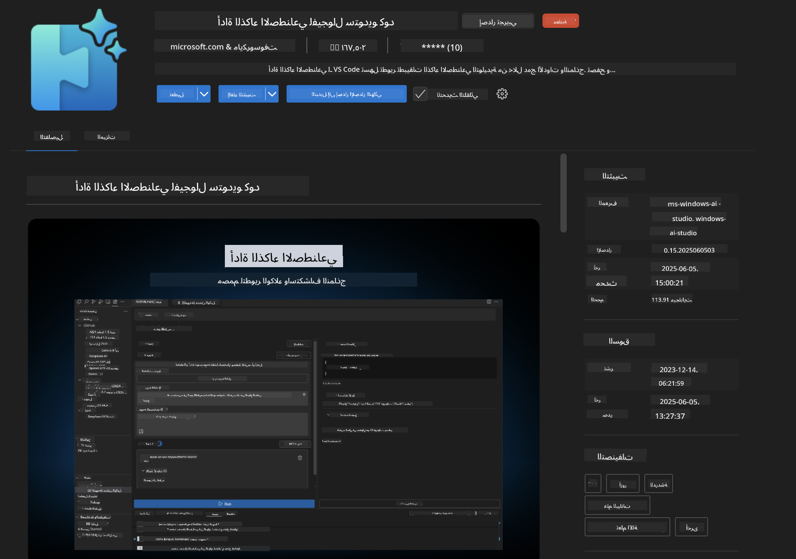
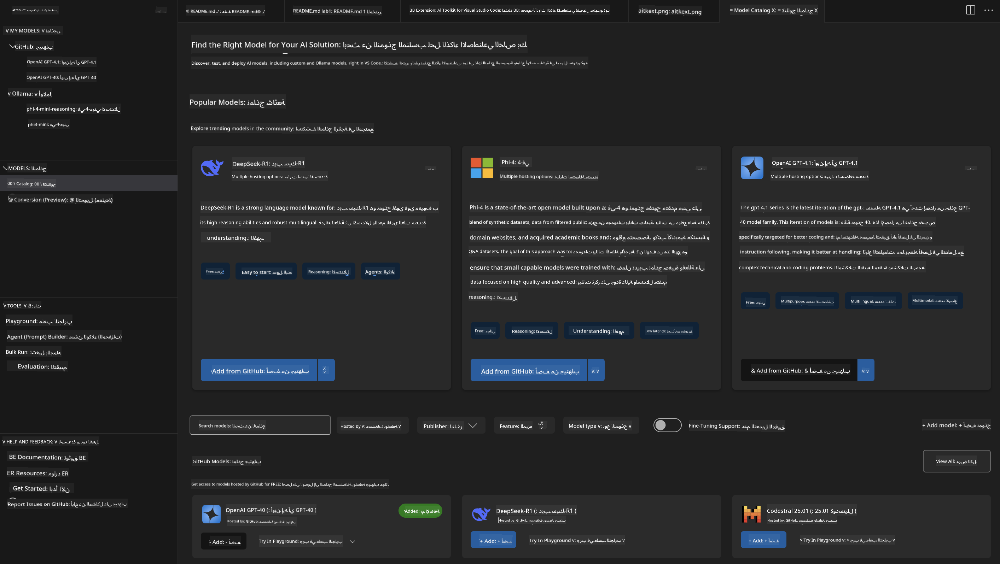
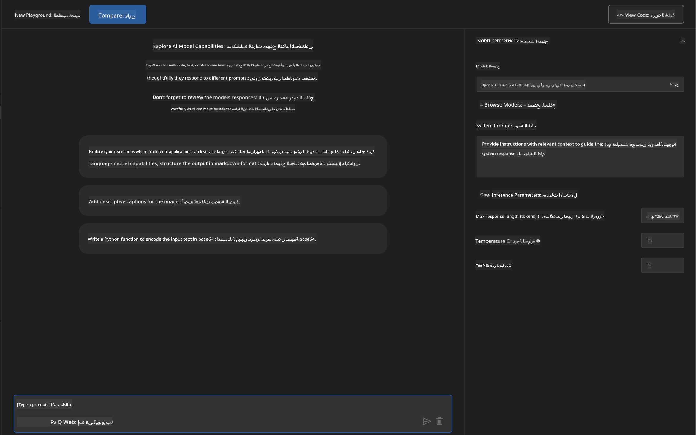
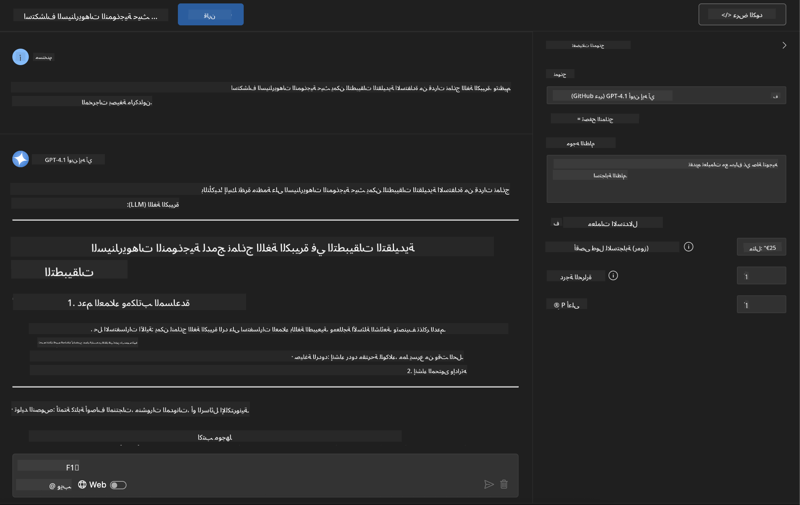
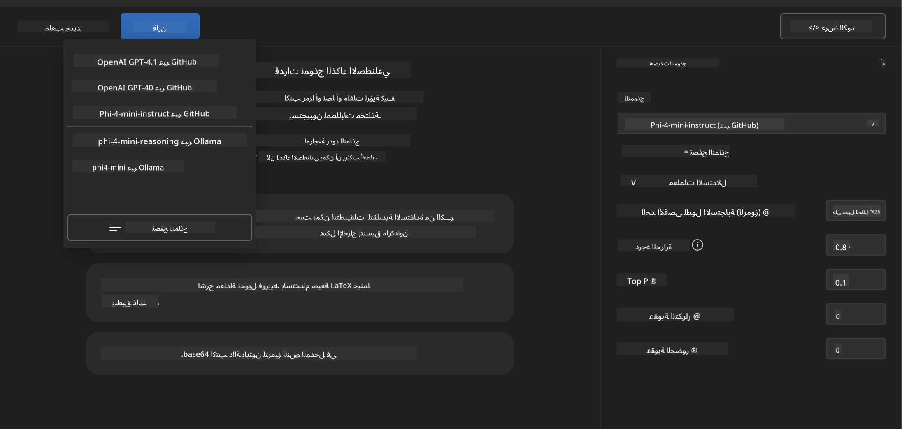
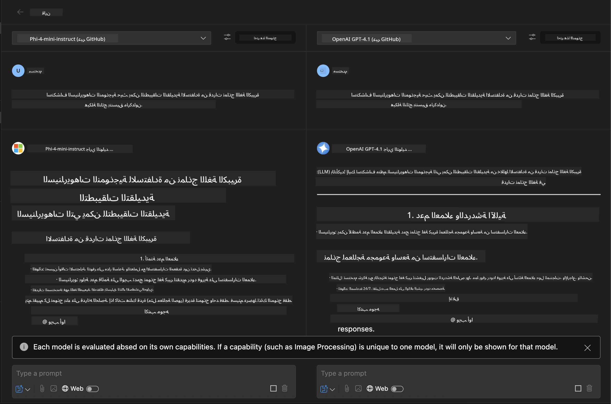
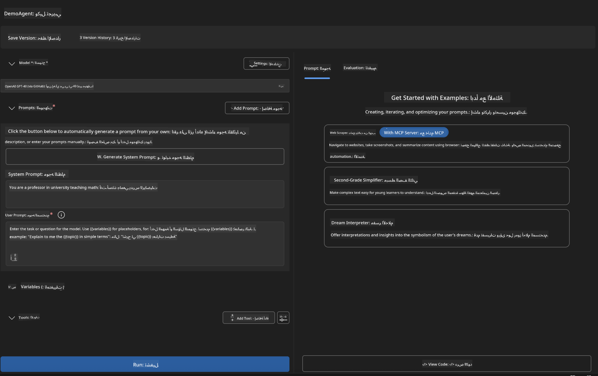
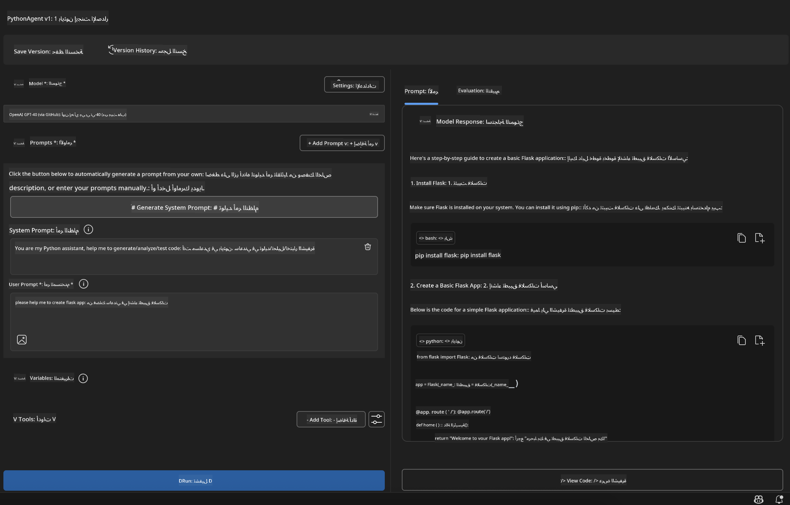

<!--
CO_OP_TRANSLATOR_METADATA:
{
  "original_hash": "2aa9dbc165e104764fa57e8a0d3f1c73",
  "translation_date": "2025-07-14T07:18:59+00:00",
  "source_file": "10-StreamliningAIWorkflowsBuildingAnMCPServerWithAIToolkit/lab1/README.md",
  "language_code": "ar"
}
-->
# 🚀 الوحدة 1: أساسيات مجموعة أدوات الذكاء الاصطناعي

[]()
[]()
[]()

## 📋 أهداف التعلم

بنهاية هذه الوحدة، ستكون قادرًا على:
- ✅ تثبيت وتكوين AI Toolkit لـ Visual Studio Code
- ✅ التنقل في كتالوج النماذج وفهم مصادر النماذج المختلفة
- ✅ استخدام الـ Playground لاختبار النماذج والتجربة
- ✅ إنشاء وكلاء ذكاء اصطناعي مخصصين باستخدام Agent Builder
- ✅ مقارنة أداء النماذج عبر مزودين مختلفين
- ✅ تطبيق أفضل الممارسات في هندسة المطالبات (prompt engineering)

## 🧠 مقدمة في AI Toolkit (AITK)

**AI Toolkit لـ Visual Studio Code** هو الامتداد الرئيسي من مايكروسوفت الذي يحول VS Code إلى بيئة تطوير شاملة للذكاء الاصطناعي. يجسر الفجوة بين أبحاث الذكاء الاصطناعي وتطوير التطبيقات العملية، مما يجعل الذكاء الاصطناعي التوليدي متاحًا للمطورين من جميع المستويات.

### 🌟 القدرات الرئيسية

| الميزة | الوصف | حالة الاستخدام |
|---------|-------------|----------|
| **🗂️ كتالوج النماذج** | الوصول إلى أكثر من 100 نموذج من GitHub، ONNX، OpenAI، Anthropic، Google | اكتشاف واختيار النماذج |
| **🔌 دعم BYOM** | دمج نماذجك الخاصة (محلية/عن بُعد) | نشر النماذج المخصصة |
| **🎮 الملعب التفاعلي** | اختبار النماذج في الوقت الحقيقي مع واجهة دردشة | النمذجة السريعة والاختبار |
| **📎 دعم متعدد الوسائط** | التعامل مع النصوص، الصور، والمرفقات | تطبيقات الذكاء الاصطناعي المعقدة |
| **⚡ المعالجة الدُفعية** | تشغيل عدة مطالبات في نفس الوقت | سير عمل اختبار فعال |
| **📊 تقييم النماذج** | مقاييس مدمجة (F1، الصلة، التشابه، التماسك) | تقييم الأداء |

### 🎯 لماذا AI Toolkit مهم

- **🚀 تسريع التطوير**: من الفكرة إلى النموذج الأولي في دقائق
- **🔄 سير عمل موحد**: واجهة واحدة لمزودين متعددين للذكاء الاصطناعي
- **🧪 تجربة سهلة**: مقارنة النماذج بدون إعداد معقد
- **📈 جاهز للإنتاج**: انتقال سلس من النموذج الأولي إلى النشر

## 🛠️ المتطلبات والإعداد

### 📦 تثبيت امتداد AI Toolkit

**الخطوة 1: الوصول إلى سوق الإضافات**
1. افتح Visual Studio Code
2. انتقل إلى عرض الإضافات (`Ctrl+Shift+X` أو `Cmd+Shift+X`)
3. ابحث عن "AI Toolkit"

**الخطوة 2: اختر نسختك**
- **🟢 الإصدار الرسمي**: موصى به للاستخدام في الإنتاج
- **🔶 الإصدار التجريبي**: وصول مبكر إلى الميزات الحديثة

**الخطوة 3: التثبيت والتفعيل**



### ✅ قائمة التحقق من التثبيت
- [ ] يظهر أيقونة AI Toolkit في الشريط الجانبي لـ VS Code
- [ ] الامتداد مفعل ومشغل
- [ ] لا توجد أخطاء تثبيت في لوحة الإخراج

## 🧪 تمرين عملي 1: استكشاف نماذج GitHub

**🎯 الهدف**: إتقان كتالوج النماذج واختبار أول نموذج ذكاء اصطناعي لك

### 📊 الخطوة 1: التنقل في كتالوج النماذج

كتالوج النماذج هو بوابتك إلى نظام الذكاء الاصطناعي البيئي. يجمع النماذج من مزودين متعددين، مما يسهل اكتشاف الخيارات ومقارنتها.

**🔍 دليل التنقل:**

انقر على **MODELS - Catalog** في الشريط الجانبي لـ AI Toolkit



**💡 نصيحة محترف**: ابحث عن النماذج التي تمتلك قدرات محددة تتناسب مع حالتك (مثل توليد الكود، الكتابة الإبداعية، التحليل).

**⚠️ ملاحظة**: النماذج المستضافة على GitHub (أي نماذج GitHub) مجانية للاستخدام لكنها تخضع لقيود على عدد الطلبات والرموز. إذا أردت الوصول إلى نماذج غير مستضافة على GitHub (أي نماذج خارجية مستضافة عبر Azure AI أو نقاط نهاية أخرى)، ستحتاج إلى توفير مفتاح API أو بيانات اعتماد مناسبة.

### 🚀 الخطوة 2: إضافة وتكوين أول نموذج لك

**استراتيجية اختيار النموذج:**
- **GPT-4.1**: الأفضل للتفكير المعقد والتحليل
- **Phi-4-mini**: خفيف الوزن، استجابات سريعة للمهام البسيطة

**🔧 عملية التكوين:**
1. اختر **OpenAI GPT-4.1** من الكتالوج
2. انقر على **Add to My Models** - لتسجيل النموذج للاستخدام
3. اختر **Try in Playground** لفتح بيئة الاختبار
4. انتظر تهيئة النموذج (قد يستغرق الإعداد الأولي بعض الوقت)



**⚙️ فهم معلمات النموذج:**
- **Temperature**: يتحكم في الإبداع (0 = حتمي، 1 = إبداعي)
- **Max Tokens**: الحد الأقصى لطول الاستجابة
- **Top-p**: عينة نواة لتنوع الاستجابة

### 🎯 الخطوة 3: إتقان واجهة الملعب

الملعب هو مختبر تجارب الذكاء الاصطناعي الخاص بك. إليك كيفية الاستفادة القصوى منه:

**🎨 أفضل ممارسات هندسة المطالبات:**
1. **كن محددًا**: التعليمات الواضحة والمفصلة تعطي نتائج أفضل
2. **وفر السياق**: أضف معلومات خلفية ذات صلة
3. **استخدم الأمثلة**: أرِ النموذج ما تريد من خلال أمثلة
4. **كرر**: حسّن المطالبات بناءً على النتائج الأولية

**🧪 سيناريوهات الاختبار:**
```markdown
# Example 1: Code Generation
"Write a Python function that calculates the factorial of a number using recursion. Include error handling and docstrings."

# Example 2: Creative Writing
"Write a professional email to a client explaining a project delay, maintaining a positive tone while being transparent about challenges."

# Example 3: Data Analysis
"Analyze this sales data and provide insights: [paste your data]. Focus on trends, anomalies, and actionable recommendations."
```



### 🏆 تمرين التحدي: مقارنة أداء النماذج

**🎯 الهدف**: مقارنة نماذج مختلفة باستخدام نفس المطالبات لفهم نقاط قوتها

**📋 التعليمات:**
1. أضف **Phi-4-mini** إلى مساحة عملك
2. استخدم نفس المطالبة لكل من GPT-4.1 و Phi-4-mini



3. قارن جودة الاستجابة، السرعة، والدقة
4. وثق نتائجك في قسم النتائج



**💡 رؤى رئيسية لاكتشافها:**
- متى تستخدم LLM مقابل SLM
- الموازنة بين التكلفة والأداء
- القدرات المتخصصة للنماذج المختلفة

## 🤖 تمرين عملي 2: بناء وكلاء مخصصين باستخدام Agent Builder

**🎯 الهدف**: إنشاء وكلاء ذكاء اصطناعي متخصصين مصممين لمهام وسير عمل محددة

### 🏗️ الخطوة 1: فهم Agent Builder

Agent Builder هو المكان الذي يتألق فيه AI Toolkit حقًا. يتيح لك إنشاء مساعدين ذكاء اصطناعي مخصصين يجمعون بين قوة نماذج اللغة الكبيرة وتعليمات مخصصة، معلمات محددة، ومعرفة متخصصة.

**🧠 مكونات بنية الوكيل:**
- **النموذج الأساسي**: نموذج اللغة الكبير الأساسي (GPT-4، Groks، Phi، إلخ)
- **مطالبة النظام**: تحدد شخصية الوكيل وسلوكه
- **المعلمات**: إعدادات دقيقة لأداء مثالي
- **تكامل الأدوات**: الاتصال بواجهات برمجة التطبيقات الخارجية وخدمات MCP
- **الذاكرة**: سياق المحادثة واستمرارية الجلسة



### ⚙️ الخطوة 2: الغوص في تكوين الوكيل

**🎨 إنشاء مطالبات نظام فعالة:**
```markdown
# Template Structure:
## Role Definition
You are a [specific role] with expertise in [domain].

## Capabilities
- List specific abilities
- Define scope of knowledge
- Clarify limitations

## Behavior Guidelines
- Response style (formal, casual, technical)
- Output format preferences
- Error handling approach

## Examples
Provide 2-3 examples of ideal interactions
```

*بالطبع، يمكنك أيضًا استخدام Generate System Prompt لاستخدام الذكاء الاصطناعي لمساعدتك في إنشاء وتحسين المطالبات*

**🔧 تحسين المعلمات:**
| المعلمة | النطاق الموصى به | حالة الاستخدام |
|-----------|------------------|----------|
| **Temperature** | 0.1-0.3 | ردود تقنية/واقعية |
| **Temperature** | 0.7-0.9 | مهام إبداعية/عصف ذهني |
| **Max Tokens** | 500-1000 | ردود مختصرة |
| **Max Tokens** | 2000-4000 | شروحات مفصلة |

### 🐍 الخطوة 3: تمرين عملي - وكيل برمجة بايثون

**🎯 المهمة**: إنشاء مساعد برمجة بايثون متخصص

**📋 خطوات التكوين:**

1. **اختيار النموذج**: اختر **Claude 3.5 Sonnet** (ممتاز للبرمجة)

2. **تصميم مطالبة النظام**:
```markdown
# Python Programming Expert Agent

## Role
You are a senior Python developer with 10+ years of experience. You excel at writing clean, efficient, and well-documented Python code.

## Capabilities
- Write production-ready Python code
- Debug complex issues
- Explain code concepts clearly
- Suggest best practices and optimizations
- Provide complete working examples

## Response Format
- Always include docstrings
- Add inline comments for complex logic
- Suggest testing approaches
- Mention relevant libraries when applicable

## Code Quality Standards
- Follow PEP 8 style guidelines
- Use type hints where appropriate
- Handle exceptions gracefully
- Write readable, maintainable code
```

3. **تكوين المعلمات**:
   - Temperature: 0.2 (لكود موثوق ومتسق)
   - Max Tokens: 2000 (شروحات مفصلة)
   - Top-p: 0.9 (توازن بين الإبداع)



### 🧪 الخطوة 4: اختبار وكيل بايثون الخاص بك

**سيناريوهات الاختبار:**
1. **دالة أساسية**: "أنشئ دالة لإيجاد الأعداد الأولية"
2. **خوارزمية معقدة**: "نفذ شجرة بحث ثنائية مع طرق الإدخال، الحذف، والبحث"
3. **مشكلة واقعية**: "ابنِ أداة تجريف ويب تتعامل مع تحديد المعدل والمحاولات المتكررة"
4. **تصحيح الأخطاء**: "صحح هذا الكود [ألصق الكود المعطوب]"

**🏆 معايير النجاح:**
- ✅ يعمل الكود بدون أخطاء
- ✅ يتضمن توثيقًا مناسبًا
- ✅ يتبع أفضل ممارسات بايثون
- ✅ يقدم شروحات واضحة
- ✅ يقترح تحسينات

## 🎓 خاتمة الوحدة 1 والخطوات التالية

### 📊 اختبار المعرفة

اختبر فهمك:
- [ ] هل يمكنك شرح الفرق بين النماذج في الكتالوج؟
- [ ] هل أنشأت واختبرت وكيلًا مخصصًا بنجاح؟
- [ ] هل تفهم كيفية تحسين المعلمات لحالات استخدام مختلفة؟
- [ ] هل تستطيع تصميم مطالبات نظام فعالة؟

### 📚 موارد إضافية

- **توثيق AI Toolkit**: [الوثائق الرسمية لمايكروسوفت](https://github.com/microsoft/vscode-ai-toolkit)
- **دليل هندسة المطالبات**: [أفضل الممارسات](https://platform.openai.com/docs/guides/prompt-engineering)
- **النماذج في AI Toolkit**: [النماذج قيد التطوير](https://github.com/microsoft/vscode-ai-toolkit/blob/main/doc/models.md)

**🎉 تهانينا!** لقد أتقنت أساسيات AI Toolkit وأصبحت جاهزًا لبناء تطبيقات ذكاء اصطناعي أكثر تقدمًا!

### 🔜 تابع إلى الوحدة التالية

هل أنت مستعد للقدرات المتقدمة؟ تابع إلى **[الوحدة 2: MCP مع أساسيات AI Toolkit](../lab2/README.md)** حيث ستتعلم كيف:
- توصل وكلائك إلى أدوات خارجية باستخدام Model Context Protocol (MCP)
- تبني وكلاء أتمتة المتصفح باستخدام Playwright
- تدمج خوادم MCP مع وكلاء AI Toolkit الخاص بك
- تعزز وكلائك بالبيانات والقدرات الخارجية

**إخلاء المسؤولية**:  
تمت ترجمة هذا المستند باستخدام خدمة الترجمة الآلية [Co-op Translator](https://github.com/Azure/co-op-translator). بينما نسعى لتحقيق الدقة، يرجى العلم أن الترجمات الآلية قد تحتوي على أخطاء أو عدم دقة. يجب اعتبار المستند الأصلي بلغته الأصلية المصدر الموثوق به. للمعلومات الهامة، يُنصح بالاعتماد على الترجمة البشرية المهنية. نحن غير مسؤولين عن أي سوء فهم أو تفسير ناتج عن استخدام هذه الترجمة.